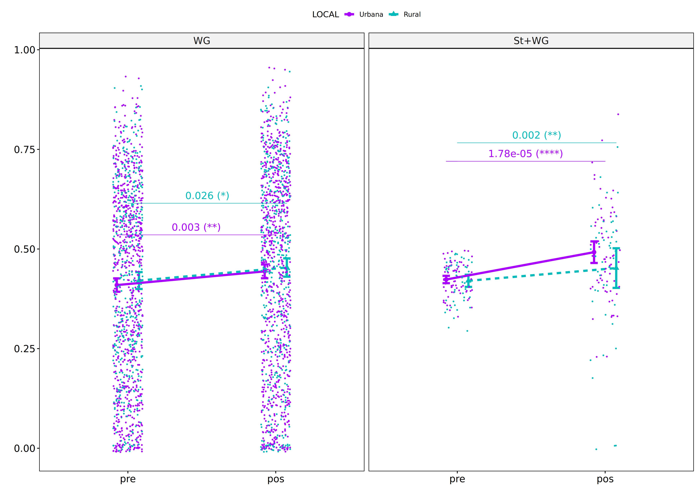

Non-Parametric ANCOVA tests for for assess TDE score
================
Geiser C. Challco <geiser@alumni.usp.br>

- [Setting Initial Variables](#setting-initial-variables)
- [Descriptive Statistics of Initial
  Data](#descriptive-statistics-of-initial-data)
- [One-way factor analysis for: *score ~
  GROUP*](#one-way-factor-analysis-for-score--group)
  - [Pre-test and Post-test PairWise comparisons for: *score ~
    GROUP*](#pre-test-and-post-test-pairwise-comparisons-for-score--group)
    - [Plot using p.adj as information](#plot-using-padj-as-information)
    - [New Plot using diferences as
      information](#new-plot-using-diferences-as-information)
  - [Kruskal and Wilcoxon PairWise comparisons for: *score ~
    GROUP*](#kruskal-and-wilcoxon-pairwise-comparisons-for-score--group)
  - [Plots to compare pre- and post
    results](#plots-to-compare-pre--and-post-results)
  - [Plot to compare diferences of
    pre-post](#plot-to-compare-diferences-of-pre-post)
  - [Plots for learning gain with
    percentages](#plots-for-learning-gain-with-percentages)
- [Two-way factor analysis for: *score ~
  GROUP:SEXO*](#two-way-factor-analysis-for-score--groupsexo)
  - [Pre-test and Post-test PairWise comparisons for: *score ~
    GROUP:SEXO*](#pre-test-and-post-test-pairwise-comparisons-for-score--groupsexo)
    - [Plot to compare pre- and
      post-test](#plot-to-compare-pre--and-post-test)
    - [New plot including percentagens in the
      differences](#new-plot-including-percentagens-in-the-differences)
  - [Scheirer and Wilcoxon PairWise comparisons for: *score ~
    GROUP:SEXO*](#scheirer-and-wilcoxon-pairwise-comparisons-for-score--groupsexo)
    - [Plot to compare results from pre and
      post](#plot-to-compare-results-from-pre-and-post)
    - [Plot to compare differences
      (1st)](#plot-to-compare-differences-1st)
    - [Plot to compare differences
      (1st)](#plot-to-compare-differences-1st-1)
    - [Plot to compare differences using in one
      comparison](#plot-to-compare-differences-using-in-one-comparison)
- [Two-way factor analysis for: *score ~
  GROUP:ZONA*](#two-way-factor-analysis-for-score--groupzona)
  - [Pre-test and Post-test PairWise comparisons for: *score ~
    GROUP:ZONA*](#pre-test-and-post-test-pairwise-comparisons-for-score--groupzona)
    - [Plot to compare pre- and
      post-test](#plot-to-compare-pre--and-post-test-1)
    - [New plot including percentagens in the
      differences](#new-plot-including-percentagens-in-the-differences-1)
  - [Scheirer and Wilcoxon PairWise comparisons for: *score ~
    GROUP:ZONA*](#scheirer-and-wilcoxon-pairwise-comparisons-for-score--groupzona)
    - [Plot to compare results from pre and
      post](#plot-to-compare-results-from-pre-and-post-1)
    - [Plot to compare differences
      (1st)](#plot-to-compare-differences-1st-2)
    - [Plot to compare differences
      (1st)](#plot-to-compare-differences-1st-3)
    - [Plot to compare differences using in one
      comparison](#plot-to-compare-differences-using-in-one-comparison-1)
- [Two-way factor analysis for: *score ~
  GROUP:COR.RACA*](#two-way-factor-analysis-for-score--groupcorraca)
  - [Pre-test and Post-test PairWise comparisons for: *score ~
    GROUP:COR.RACA*](#pre-test-and-post-test-pairwise-comparisons-for-score--groupcorraca)
    - [Plot to compare pre- and
      post-test](#plot-to-compare-pre--and-post-test-2)
    - [New plot including percentagens in the
      differences](#new-plot-including-percentagens-in-the-differences-2)
  - [Scheirer and Wilcoxon PairWise comparisons for: *score ~
    GROUP:COR.RACA*](#scheirer-and-wilcoxon-pairwise-comparisons-for-score--groupcorraca)
    - [Plot to compare results from pre and
      post](#plot-to-compare-results-from-pre-and-post-2)
    - [Plot to compare differences
      (1st)](#plot-to-compare-differences-1st-4)
    - [Plot to compare differences
      (1st)](#plot-to-compare-differences-1st-5)
    - [Plot to compare differences using in one
      comparison](#plot-to-compare-differences-using-in-one-comparison-2)
- [Two-way factor analysis for: *score ~
  GROUP:LOCAL*](#two-way-factor-analysis-for-score--grouplocal)
  - [Pre-test and Post-test PairWise comparisons for: *score ~
    GROUP:LOCAL*](#pre-test-and-post-test-pairwise-comparisons-for-score--grouplocal)
    - [Plot to compare pre- and
      post-test](#plot-to-compare-pre--and-post-test-3)
    - [New plot including percentagens in the
      differences](#new-plot-including-percentagens-in-the-differences-3)
  - [Scheirer and Wilcoxon PairWise comparisons for: *score ~
    GROUP:LOCAL*](#scheirer-and-wilcoxon-pairwise-comparisons-for-score--grouplocal)
    - [Plot to compare results from pre and
      post](#plot-to-compare-results-from-pre-and-post-3)
    - [Plot to compare differences
      (1st)](#plot-to-compare-differences-1st-6)
    - [Plot to compare differences
      (1st)](#plot-to-compare-differences-1st-7)
    - [Plot to compare differences using in one
      comparison](#plot-to-compare-differences-using-in-one-comparison-3)
- [Two-way factor analysis for: *score ~
  GROUP:SERIE*](#two-way-factor-analysis-for-score--groupserie)
  - [Pre-test and Post-test PairWise comparisons for: *score ~
    GROUP:SERIE*](#pre-test-and-post-test-pairwise-comparisons-for-score--groupserie)
    - [Plot to compare pre- and
      post-test](#plot-to-compare-pre--and-post-test-4)
    - [New plot including percentagens in the
      differences](#new-plot-including-percentagens-in-the-differences-4)
  - [Scheirer and Wilcoxon PairWise comparisons for: *score ~
    GROUP:SERIE*](#scheirer-and-wilcoxon-pairwise-comparisons-for-score--groupserie)
    - [Plot to compare results from pre and
      post](#plot-to-compare-results-from-pre-and-post-4)
    - [Plot to compare differences
      (1st)](#plot-to-compare-differences-1st-8)
    - [Plot to compare differences
      (1st)](#plot-to-compare-differences-1st-9)
    - [Plot to compare differences using in one
      comparison](#plot-to-compare-differences-using-in-one-comparison-4)
- [Two-way factor analysis for: *score ~
  GROUP:ESCOLA*](#two-way-factor-analysis-for-score--groupescola)
  - [Pre-test and Post-test PairWise comparisons for: *score ~
    GROUP:ESCOLA*](#pre-test-and-post-test-pairwise-comparisons-for-score--groupescola)
    - [Plot to compare pre- and
      post-test](#plot-to-compare-pre--and-post-test-5)
    - [New plot including percentagens in the
      differences](#new-plot-including-percentagens-in-the-differences-5)
  - [Scheirer and Wilcoxon PairWise comparisons for: *score ~
    GROUP:ESCOLA*](#scheirer-and-wilcoxon-pairwise-comparisons-for-score--groupescola)
    - [Plot to compare results from pre and
      post](#plot-to-compare-results-from-pre-and-post-5)
    - [Plot to compare differences
      (1st)](#plot-to-compare-differences-1st-10)
    - [Plot to compare differences
      (1st)](#plot-to-compare-differences-1st-11)
    - [Plot to compare differences using in one
      comparison](#plot-to-compare-differences-using-in-one-comparison-5)

# Setting Initial Variables

``` r
dv = "score"
dv.pos = "score.pos"
dv.pre = "score.pre"
dv.dif = "score.dif"

fatores2 <- c("SEXO","ZONA","COR.RACA","LOCAL","SERIE","ESCOLA")
lfatores2 <- as.list(fatores2)
names(lfatores2) <- fatores2

fatores1 <- c("GROUP", fatores2)
lfatores1 <- as.list(fatores1)
names(lfatores1) <- fatores1

lfatores <- c(lfatores1)

color <- list()
color[["prepost"]] = c("#ffee65","#f28e2B")
color[["GROUP"]] = c("#bcbd22","#fd7f6f")
color[["SEXO"]] = c("#FF007F","#4D4DFF")
color[["ZONA"]] = c("#AA00FF","#00BBBB")
color[["COR.RACA"]] = c("#b97100","#75c298","#D6B91C","#9F262F","#848283")
color[["LOCAL"]] = c("#AA00FF","#00BBBB")
color[["SERIE"]] = c("#FF0000","#BF0040","#0000FF","#4000BF")
color[["ESCOLA"]] = c("#d8668c","#ff7f7f","#ddf0b2","#b2b2ff","#b299e5")

level <- list()
level[["GROUP"]] = c("WG","St+WG")
level[["SEXO"]] = c("F","M")
level[["ZONA"]] = c("Urbana","Rural")
level[["COR.RACA"]] = c("Parda", "Branca", "Amarela", "Indígena", "Preta")
level[["LOCAL"]] = c("Urbana","Rural")
level[["SERIE"]] = c("6a","7a","8a","9a")
level[["ESCOLA"]] = c("PROF MARIA","PADRE ANCHIETA","PROF RICARDO","PADRE MOUSINHO","VER PORFIRIO")


# ..

gdat <- read_excel("../data/dat-TDE.xlsx", sheet = "main")
gdat <- gdat[!is.na(gdat[["GROUP"]]),]
gdat <- gdat[!is.na(gdat[[dv.pre]]) & !is.na(gdat[[dv.pos]]),]
gdat[[dv.dif]] <- abs(gdat[[dv.pos]] - gdat[[dv.pre]])/80 

gdat <- gdat[is.na(gdat$NECESSIDADE.DEFICIENCIA) & gdat$score.pre != 80 & gdat$score.pos != 80,]

gdat[[dv.pre]] <- gdat[[dv.pre]]/80
gdat[[dv.pos]] <- gdat[[dv.pos]]/80


dat <- gdat
dat$GROUP <- factor(dat[["GROUP"]], level[["GROUP"]])
for (coln in c(names(lfatores))) {
  if (length(level[[coln]]) > 0)
    plevel = level[[coln]][level[[coln]] %in% unique(dat[[coln]])]
  else
    plevel = unique(dat[[coln]])[!is.na(unique(dat[[coln]]))]
  
  dat[[coln]] <- factor(dat[[coln]], plevel)
}

dat <- dat[,c("id", names(lfatores), dv.pre, dv.pos, dv.dif)]

dat.long <- rbind(dat, dat)
dat.long$time <- c(rep("pre", nrow(dat)), rep("pos", nrow(dat)))
dat.long$time <- factor(dat.long$time, c("pre","pos"))
dat.long[[dv]] <- c(dat[[dv.pre]], dat[[dv.pos]])


for (f in c("GROUP", names(lfatores))) {
  if (is.null(color[[f]]) && length(unique(dat[[f]])) > 0) 
      color[[f]] <- distinctColorPalette(length(unique(dat[[f]])))
}

for (f in c(fatores2)) {
  if (is.null(color[[paste0("GROUP:",f)]]) && length(unique(dat[[f]])) > 0)
    color[[paste0("GROUP:",f)]] <- distinctColorPalette(
      length(unique(dat[["GROUP"]]))*length(unique(dat[[f]])))
}

ldat <- list()
laov <- list()
lpwc <- list()
lemms <- list()
```

# Descriptive Statistics of Initial Data

``` r
df <- get.descriptives(dat, c(dv.pre, dv.pos, dv.dif), c("GROUP"),
                       symmetry.test = T, normality.test = F)
df <- plyr::rbind.fill(
  df, do.call(plyr::rbind.fill, lapply(lfatores2, FUN = function(f) {
    if (nrow(dat) > 0 && sum(!is.na(unique(dat[[f]]))) > 1)
      get.descriptives(dat, c(dv.pre,dv.pos), c("GROUP", f), include.global = F,
                       symmetry.test = T, normality.test = F)
    }))
)
```

    ## Warning: There were 2 warnings in `mutate()`.
    ## The first warning was:
    ## ℹ In argument: `ci = abs(stats::qt(alpha/2, .data$n - 1) * .data$se)`.
    ## Caused by warning:
    ## ! There was 1 warning in `mutate()`.
    ## ℹ In argument: `ci = abs(stats::qt(alpha/2, .data$n - 1) * .data$se)`.
    ## Caused by warning in `stats::qt()`:
    ## ! NaNs produced
    ## ℹ Run `dplyr::last_dplyr_warnings()` to see the 1 remaining warning.
    ## There were 2 warnings in `mutate()`.
    ## The first warning was:
    ## ℹ In argument: `ci = abs(stats::qt(alpha/2, .data$n - 1) * .data$se)`.
    ## Caused by warning:
    ## ! There was 1 warning in `mutate()`.
    ## ℹ In argument: `ci = abs(stats::qt(alpha/2, .data$n - 1) * .data$se)`.
    ## Caused by warning in `stats::qt()`:
    ## ! NaNs produced
    ## ℹ Run `dplyr::last_dplyr_warnings()` to see the 1 remaining warning.

``` r
df <- df[,c("variable",fatores1[fatores1 %in% colnames(df)],
            colnames(df)[!colnames(df) %in% c(fatores1,"variable")])]
```

| variable | GROUP | SEXO | ZONA | COR.RACA | LOCAL | SERIE | ESCOLA | n | mean | median | min | max | sd | se | ci | iqr | symmetry | skewness | kurtosis |
|:---|:---|:---|:---|:---|:---|:---|:---|---:|---:|---:|---:|---:|---:|---:|---:|---:|:---|---:|---:|
| score.pre | WG |  |  |  |  |  |  | 1272 | 0.414 | 0.438 | 0.000 | 0.938 | 0.239 | 0.007 | 0.013 | 0.400 | YES | -0.1119895 | -1.1290235 |
| score.pre | St+WG |  |  |  |  |  |  | 119 | 0.422 | 0.425 | 0.300 | 0.488 | 0.045 | 0.004 | 0.008 | 0.069 | YES | -0.4401967 | -0.6427166 |
| score.pos | WG |  |  |  |  |  |  | 1272 | 0.447 | 0.488 | 0.000 | 0.950 | 0.251 | 0.007 | 0.014 | 0.425 | YES | -0.2385755 | -1.0930415 |
| score.pos | St+WG |  |  |  |  |  |  | 119 | 0.476 | 0.488 | 0.000 | 0.838 | 0.140 | 0.013 | 0.025 | 0.156 | NO | -0.8247036 | 2.1114369 |
| score.dif | WG |  |  |  |  |  |  | 1272 | 0.073 | 0.050 | 0.000 | 0.838 | 0.093 | 0.003 | 0.005 | 0.100 | NO | 3.0149112 | 14.9998446 |
| score.dif | St+WG |  |  |  |  |  |  | 119 | 0.102 | 0.088 | 0.000 | 0.475 | 0.098 | 0.009 | 0.018 | 0.125 | NO | 1.4046709 | 2.4183532 |
| score.pre | WG | F |  |  |  |  |  | 658 | 0.457 | 0.512 | 0.000 | 0.938 | 0.237 | 0.009 | 0.018 | 0.388 | YES | -0.3108193 | -1.0121856 |
| score.pre | WG | M |  |  |  |  |  | 614 | 0.367 | 0.350 | 0.000 | 0.938 | 0.233 | 0.009 | 0.018 | 0.400 | YES | 0.0793131 | -1.1192561 |
| score.pre | St+WG | F |  |  |  |  |  | 63 | 0.426 | 0.438 | 0.312 | 0.488 | 0.044 | 0.005 | 0.011 | 0.075 | YES | -0.4259206 | -0.7430963 |
| score.pre | St+WG | M |  |  |  |  |  | 56 | 0.417 | 0.425 | 0.300 | 0.488 | 0.045 | 0.006 | 0.012 | 0.062 | YES | -0.4316968 | -0.6801892 |
| score.pos | WG | F |  |  |  |  |  | 658 | 0.491 | 0.537 | 0.000 | 0.950 | 0.246 | 0.010 | 0.019 | 0.397 | YES | -0.4270482 | -0.9024075 |
| score.pos | WG | M |  |  |  |  |  | 614 | 0.401 | 0.412 | 0.000 | 0.950 | 0.249 | 0.010 | 0.020 | 0.438 | YES | -0.0539162 | -1.1700511 |
| score.pos | St+WG | F |  |  |  |  |  | 63 | 0.483 | 0.475 | 0.225 | 0.750 | 0.114 | 0.014 | 0.029 | 0.150 | YES | -0.0859265 | -0.2554076 |
| score.pos | St+WG | M |  |  |  |  |  | 56 | 0.469 | 0.488 | 0.000 | 0.838 | 0.165 | 0.022 | 0.044 | 0.162 | NO | -0.9628540 | 1.7025386 |
| score.pre | WG |  | Urbana |  |  |  |  | 759 | 0.423 | 0.475 | 0.000 | 0.938 | 0.244 | 0.009 | 0.017 | 0.400 | YES | -0.2123020 | -1.0875455 |
| score.pre | WG |  | Rural |  |  |  |  | 487 | 0.399 | 0.375 | 0.000 | 0.900 | 0.232 | 0.011 | 0.021 | 0.400 | YES | 0.0436913 | -1.1820550 |
| score.pre | WG |  |  |  |  |  |  | 26 | 0.409 | 0.387 | 0.000 | 0.825 | 0.230 | 0.045 | 0.093 | 0.294 | YES | -0.0149840 | -1.0460950 |
| score.pre | St+WG |  | Urbana |  |  |  |  | 67 | 0.423 | 0.425 | 0.312 | 0.488 | 0.041 | 0.005 | 0.010 | 0.050 | YES | -0.3977982 | -0.5632193 |
| score.pre | St+WG |  | Rural |  |  |  |  | 48 | 0.423 | 0.438 | 0.300 | 0.488 | 0.048 | 0.007 | 0.014 | 0.075 | YES | -0.4689604 | -0.7429554 |
| score.pre | St+WG |  |  |  |  |  |  | 4 | 0.406 | 0.406 | 0.338 | 0.475 | 0.067 | 0.033 | 0.106 | 0.100 | YES | 0.0000000 | -2.3366003 |
| score.pos | WG |  | Urbana |  |  |  |  | 759 | 0.458 | 0.512 | 0.000 | 0.950 | 0.252 | 0.009 | 0.018 | 0.412 | YES | -0.3136185 | -1.0641777 |
| score.pos | WG |  | Rural |  |  |  |  | 487 | 0.430 | 0.462 | 0.000 | 0.938 | 0.251 | 0.011 | 0.022 | 0.438 | YES | -0.1226731 | -1.1296702 |
| score.pos | WG |  |  |  |  |  |  | 26 | 0.456 | 0.488 | 0.000 | 0.875 | 0.226 | 0.044 | 0.091 | 0.309 | YES | -0.2170420 | -0.8541214 |
| score.pos | St+WG |  | Urbana |  |  |  |  | 67 | 0.491 | 0.475 | 0.225 | 0.838 | 0.121 | 0.015 | 0.030 | 0.150 | YES | 0.2533891 | 0.3162551 |
| score.pos | St+WG |  | Rural |  |  |  |  | 48 | 0.454 | 0.494 | 0.000 | 0.750 | 0.165 | 0.024 | 0.048 | 0.162 | NO | -1.1859444 | 1.3599505 |
| score.pos | St+WG |  |  |  |  |  |  | 4 | 0.491 | 0.525 | 0.362 | 0.550 | 0.086 | 0.043 | 0.137 | 0.047 | few data | 0.0000000 | 0.0000000 |
| score.pre | WG |  |  | Parda |  |  |  | 1083 | 0.416 | 0.450 | 0.000 | 0.938 | 0.240 | 0.007 | 0.014 | 0.394 | YES | -0.1316430 | -1.1064764 |
| score.pre | WG |  |  | Branca |  |  |  | 134 | 0.399 | 0.388 | 0.000 | 0.850 | 0.245 | 0.021 | 0.042 | 0.447 | YES | -0.0184840 | -1.3178820 |
| score.pre | WG |  |  | Amarela |  |  |  | 1 | 0.200 | 0.200 | 0.200 | 0.200 |  |  |  | 0.000 | few data | 0.0000000 | 0.0000000 |
| score.pre | WG |  |  | Indígena |  |  |  | 38 | 0.413 | 0.362 | 0.050 | 0.812 | 0.221 | 0.036 | 0.073 | 0.388 | YES | 0.0651544 | -1.4814466 |
| score.pre | WG |  |  | Preta |  |  |  | 7 | 0.250 | 0.288 | 0.075 | 0.500 | 0.160 | 0.060 | 0.148 | 0.231 | YES | 0.2012042 | -1.6920950 |
| score.pre | WG |  |  |  |  |  |  | 9 | 0.481 | 0.537 | 0.300 | 0.662 | 0.127 | 0.042 | 0.098 | 0.200 | YES | -0.2974514 | -1.5965241 |
| score.pre | St+WG |  |  | Parda |  |  |  | 97 | 0.424 | 0.438 | 0.300 | 0.488 | 0.045 | 0.005 | 0.009 | 0.075 | NO | -0.5092363 | -0.6029958 |
| score.pre | St+WG |  |  | Branca |  |  |  | 18 | 0.410 | 0.406 | 0.325 | 0.475 | 0.041 | 0.010 | 0.021 | 0.066 | YES | -0.2881951 | -0.9526856 |
| score.pre | St+WG |  |  | Indígena |  |  |  | 3 | 0.446 | 0.450 | 0.400 | 0.488 | 0.044 | 0.025 | 0.109 | 0.044 | few data | 0.0000000 | 0.0000000 |
| score.pre | St+WG |  |  | Preta |  |  |  | 1 | 0.388 | 0.388 | 0.388 | 0.388 |  |  |  | 0.000 | few data | 0.0000000 | 0.0000000 |
| score.pos | WG |  |  | Parda |  |  |  | 1083 | 0.453 | 0.500 | 0.000 | 0.950 | 0.252 | 0.008 | 0.015 | 0.412 | YES | -0.2651458 | -1.0714697 |
| score.pos | WG |  |  | Branca |  |  |  | 134 | 0.426 | 0.431 | 0.000 | 0.863 | 0.250 | 0.022 | 0.043 | 0.434 | YES | -0.0627296 | -1.2585150 |
| score.pos | WG |  |  | Amarela |  |  |  | 1 | 0.588 | 0.588 | 0.588 | 0.588 |  |  |  | 0.000 | few data | 0.0000000 | 0.0000000 |
| score.pos | WG |  |  | Indígena |  |  |  | 38 | 0.373 | 0.431 | 0.000 | 0.750 | 0.248 | 0.040 | 0.082 | 0.397 | YES | -0.0658375 | -1.4151129 |
| score.pos | WG |  |  | Preta |  |  |  | 7 | 0.354 | 0.412 | 0.125 | 0.537 | 0.160 | 0.061 | 0.148 | 0.225 | YES | -0.3137353 | -1.7668981 |
| score.pos | WG |  |  |  |  |  |  | 9 | 0.501 | 0.588 | 0.125 | 0.650 | 0.171 | 0.057 | 0.131 | 0.137 | NO | -1.1320976 | -0.1514363 |
| score.pos | St+WG |  |  | Parda |  |  |  | 97 | 0.476 | 0.488 | 0.000 | 0.775 | 0.143 | 0.015 | 0.029 | 0.150 | NO | -1.0507118 | 2.1676560 |
| score.pos | St+WG |  |  | Branca |  |  |  | 18 | 0.479 | 0.475 | 0.225 | 0.838 | 0.136 | 0.032 | 0.068 | 0.138 | NO | 0.6513874 | 0.6865941 |
| score.pos | St+WG |  |  | Indígena |  |  |  | 3 | 0.458 | 0.525 | 0.312 | 0.537 | 0.126 | 0.073 | 0.314 | 0.112 | few data | 0.0000000 | 0.0000000 |
| score.pos | St+WG |  |  | Preta |  |  |  | 1 | 0.475 | 0.475 | 0.475 | 0.475 |  |  |  | 0.000 | few data | 0.0000000 | 0.0000000 |
| score.pre | WG |  |  |  | Urbana |  |  | 818 | 0.409 | 0.462 | 0.000 | 0.938 | 0.245 | 0.009 | 0.017 | 0.425 | YES | -0.1309041 | -1.1649714 |
| score.pre | WG |  |  |  | Rural |  |  | 454 | 0.421 | 0.425 | 0.000 | 0.900 | 0.230 | 0.011 | 0.021 | 0.375 | YES | -0.0571760 | -1.0933241 |
| score.pre | St+WG |  |  |  | Urbana |  |  | 72 | 0.423 | 0.425 | 0.338 | 0.488 | 0.039 | 0.005 | 0.009 | 0.053 | YES | -0.1796905 | -0.9292547 |
| score.pre | St+WG |  |  |  | Rural |  |  | 47 | 0.420 | 0.438 | 0.300 | 0.488 | 0.052 | 0.008 | 0.015 | 0.088 | NO | -0.5352534 | -0.8971964 |
| score.pos | WG |  |  |  | Urbana |  |  | 818 | 0.444 | 0.488 | 0.000 | 0.950 | 0.252 | 0.009 | 0.017 | 0.425 | YES | -0.2128544 | -1.1386983 |
| score.pos | WG |  |  |  | Rural |  |  | 454 | 0.454 | 0.475 | 0.000 | 0.938 | 0.250 | 0.012 | 0.023 | 0.422 | YES | -0.2842747 | -1.0119745 |
| score.pos | St+WG |  |  |  | Urbana |  |  | 72 | 0.492 | 0.475 | 0.225 | 0.838 | 0.115 | 0.014 | 0.027 | 0.162 | YES | 0.3994899 | 0.3844193 |
| score.pos | St+WG |  |  |  | Rural |  |  | 47 | 0.452 | 0.512 | 0.000 | 0.750 | 0.169 | 0.025 | 0.050 | 0.150 | NO | -1.1432442 | 1.0244287 |
| score.pre | WG |  |  |  |  | 6a |  | 342 | 0.268 | 0.225 | 0.000 | 0.825 | 0.212 | 0.011 | 0.023 | 0.350 | NO | 0.5587246 | -0.7590406 |
| score.pre | WG |  |  |  |  | 7a |  | 340 | 0.411 | 0.431 | 0.000 | 0.900 | 0.225 | 0.012 | 0.024 | 0.350 | YES | -0.1070197 | -1.0373563 |
| score.pre | WG |  |  |  |  | 8a |  | 342 | 0.469 | 0.512 | 0.000 | 0.900 | 0.221 | 0.012 | 0.024 | 0.344 | YES | -0.3952491 | -0.7972131 |
| score.pre | WG |  |  |  |  | 9a |  | 248 | 0.542 | 0.588 | 0.000 | 0.938 | 0.214 | 0.014 | 0.027 | 0.300 | NO | -0.7067047 | -0.2618453 |
| score.pre | St+WG |  |  |  |  | 6a |  | 32 | 0.423 | 0.431 | 0.338 | 0.488 | 0.038 | 0.007 | 0.014 | 0.062 | YES | -0.1999768 | -1.0994223 |
| score.pre | St+WG |  |  |  |  | 7a |  | 38 | 0.415 | 0.419 | 0.300 | 0.488 | 0.046 | 0.007 | 0.015 | 0.062 | YES | -0.3296166 | -0.4267359 |
| score.pre | St+WG |  |  |  |  | 8a |  | 28 | 0.419 | 0.419 | 0.350 | 0.488 | 0.047 | 0.009 | 0.018 | 0.078 | YES | -0.0750285 | -1.4535705 |
| score.pre | St+WG |  |  |  |  | 9a |  | 21 | 0.438 | 0.450 | 0.312 | 0.488 | 0.047 | 0.010 | 0.021 | 0.050 | NO | -1.3354788 | 0.7866553 |
| score.pos | WG |  |  |  |  | 6a |  | 342 | 0.305 | 0.269 | 0.000 | 0.875 | 0.233 | 0.013 | 0.025 | 0.397 | YES | 0.3824742 | -1.0169302 |
| score.pos | WG |  |  |  |  | 7a |  | 340 | 0.431 | 0.462 | 0.000 | 0.938 | 0.232 | 0.013 | 0.025 | 0.375 | YES | -0.1920618 | -0.9457443 |
| score.pos | WG |  |  |  |  | 8a |  | 342 | 0.498 | 0.537 | 0.000 | 0.900 | 0.230 | 0.012 | 0.024 | 0.350 | NO | -0.5484498 | -0.7034682 |
| score.pos | WG |  |  |  |  | 9a |  | 248 | 0.597 | 0.656 | 0.000 | 0.950 | 0.221 | 0.014 | 0.028 | 0.275 | NO | -0.9652090 | 0.2369846 |
| score.pos | St+WG |  |  |  |  | 6a |  | 32 | 0.480 | 0.475 | 0.312 | 0.625 | 0.078 | 0.014 | 0.028 | 0.128 | YES | 0.0664337 | -0.9259495 |
| score.pos | St+WG |  |  |  |  | 7a |  | 38 | 0.431 | 0.475 | 0.000 | 0.637 | 0.137 | 0.022 | 0.045 | 0.184 | NO | -0.9969186 | 0.7089133 |
| score.pos | St+WG |  |  |  |  | 8a |  | 28 | 0.506 | 0.475 | 0.325 | 0.838 | 0.131 | 0.025 | 0.051 | 0.169 | NO | 0.9065264 | 0.0527944 |
| score.pos | St+WG |  |  |  |  | 9a |  | 21 | 0.514 | 0.562 | 0.000 | 0.725 | 0.203 | 0.044 | 0.092 | 0.150 | NO | -1.5328944 | 1.2992127 |
| score.pre | WG |  |  |  |  |  | PROF MARIA | 329 | 0.328 | 0.300 | 0.000 | 0.938 | 0.239 | 0.013 | 0.026 | 0.425 | YES | 0.2873046 | -1.0969500 |
| score.pre | WG |  |  |  |  |  | PADRE ANCHIETA | 185 | 0.421 | 0.425 | 0.000 | 0.900 | 0.224 | 0.016 | 0.033 | 0.337 | YES | -0.1294231 | -0.9141750 |
| score.pre | WG |  |  |  |  |  | PROF RICARDO | 438 | 0.476 | 0.525 | 0.000 | 0.938 | 0.229 | 0.011 | 0.022 | 0.334 | YES | -0.4797651 | -0.7593382 |
| score.pre | WG |  |  |  |  |  | PADRE MOUSINHO | 269 | 0.421 | 0.412 | 0.000 | 0.900 | 0.234 | 0.014 | 0.028 | 0.388 | YES | -0.0127540 | -1.2154889 |
| score.pre | WG |  |  |  |  |  | VER PORFIRIO | 51 | 0.364 | 0.312 | 0.000 | 0.850 | 0.248 | 0.035 | 0.070 | 0.419 | YES | 0.1747838 | -1.1932486 |
| score.pre | St+WG |  |  |  |  |  | PROF MARIA | 23 | 0.438 | 0.450 | 0.375 | 0.488 | 0.037 | 0.008 | 0.016 | 0.069 | YES | -0.3440206 | -1.3559783 |
| score.pre | St+WG |  |  |  |  |  | PADRE ANCHIETA | 11 | 0.417 | 0.412 | 0.350 | 0.475 | 0.042 | 0.013 | 0.028 | 0.069 | YES | -0.1019779 | -1.6834205 |
| score.pre | St+WG |  |  |  |  |  | PROF RICARDO | 37 | 0.418 | 0.425 | 0.350 | 0.488 | 0.039 | 0.006 | 0.013 | 0.062 | YES | -0.2292209 | -0.9796516 |
| score.pre | St+WG |  |  |  |  |  | PADRE MOUSINHO | 36 | 0.421 | 0.444 | 0.300 | 0.488 | 0.055 | 0.009 | 0.019 | 0.088 | NO | -0.5956777 | -0.9311736 |
| score.pre | St+WG |  |  |  |  |  | VER PORFIRIO | 12 | 0.412 | 0.406 | 0.338 | 0.488 | 0.041 | 0.012 | 0.026 | 0.034 | YES | 0.2914113 | -0.6556250 |
| score.pos | WG |  |  |  |  |  | PROF MARIA | 329 | 0.346 | 0.312 | 0.000 | 0.950 | 0.255 | 0.014 | 0.028 | 0.475 | YES | 0.2857336 | -1.1512502 |
| score.pos | WG |  |  |  |  |  | PADRE ANCHIETA | 185 | 0.497 | 0.512 | 0.000 | 0.938 | 0.226 | 0.017 | 0.033 | 0.350 | YES | -0.4135305 | -0.7264190 |
| score.pos | WG |  |  |  |  |  | PROF RICARDO | 438 | 0.508 | 0.550 | 0.000 | 0.950 | 0.223 | 0.011 | 0.021 | 0.325 | NO | -0.5247282 | -0.6837958 |
| score.pos | WG |  |  |  |  |  | PADRE MOUSINHO | 269 | 0.423 | 0.462 | 0.000 | 0.900 | 0.260 | 0.016 | 0.031 | 0.450 | YES | -0.1520781 | -1.1780968 |
| score.pos | WG |  |  |  |  |  | VER PORFIRIO | 51 | 0.522 | 0.562 | 0.000 | 0.912 | 0.271 | 0.038 | 0.076 | 0.400 | YES | -0.4443722 | -0.9632436 |
| score.pos | St+WG |  |  |  |  |  | PROF MARIA | 23 | 0.470 | 0.450 | 0.375 | 0.725 | 0.094 | 0.020 | 0.041 | 0.081 | NO | 1.3350787 | 0.7947685 |
| score.pos | St+WG |  |  |  |  |  | PADRE ANCHIETA | 11 | 0.517 | 0.500 | 0.400 | 0.650 | 0.083 | 0.025 | 0.056 | 0.100 | YES | 0.2461415 | -1.3635397 |
| score.pos | St+WG |  |  |  |  |  | PROF RICARDO | 37 | 0.473 | 0.475 | 0.225 | 0.675 | 0.109 | 0.018 | 0.036 | 0.150 | YES | -0.3906363 | -0.5968957 |
| score.pos | St+WG |  |  |  |  |  | PADRE MOUSINHO | 36 | 0.432 | 0.512 | 0.000 | 0.750 | 0.184 | 0.031 | 0.062 | 0.206 | NO | -0.9225620 | 0.2005536 |
| score.pos | St+WG |  |  |  |  |  | VER PORFIRIO | 12 | 0.595 | 0.575 | 0.412 | 0.838 | 0.123 | 0.035 | 0.078 | 0.116 | NO | 0.5241572 | -0.7856940 |

# One-way factor analysis for: *score ~ GROUP*

``` r
pdat = remove_group_data(dat[!is.na(dat[["GROUP"]]),], "score.dif", "GROUP")

pdat.long <- rbind(pdat[,c("id","GROUP")], pdat[,c("id","GROUP")])
pdat.long[["time"]] <- c(rep("pre", nrow(pdat)), rep("pos", nrow(pdat)))
pdat.long[["time"]] <- factor(pdat.long[["time"]], c("pre","pos"))
pdat.long[["score"]] <- c(pdat[["score.pre"]], pdat[["score.pos"]])

y.position.min <- abs(
  max(pdat.long[["score"]])
  - min(pdat.long[["score"]]))/15

lvars = as.list(c("score.dif","score.pos","score.pre"))
names(lvars) = unlist(lvars)
```

## Pre-test and Post-test PairWise comparisons for: *score ~ GROUP*

``` r
pwc.long <- group_by(pdat.long, GROUP) %>%
  pairwise_wilcox_test(score ~ time, detailed = T)

df <- pwc.long[,c(".y.","GROUP","group1","group2","n1","n2","estimate",
                  "statistic","p.adj","p.adj.signif")]
```

| .y.   | GROUP | group1 | group2 |   n1 |   n2 |   estimate | statistic |    p.adj | p.adj.signif |
|:------|:------|:-------|:-------|-----:|-----:|-----------:|----------:|---------:|:-------------|
| score | WG    | pre    | pos    | 1272 | 1272 | -0.0374848 |  742286.5 | 3.16e-04 | \*\*\*       |
| score | St+WG | pre    | pos    |  119 |  119 | -0.0625386 |    4274.0 | 1.00e-07 | \*\*\*\*     |

### Plot using p.adj as information

``` r
stat.test <- pwc.long %>% add_xy_position(x = "time", fun = "mean_ci")
stat.test$y.position <- stat.test$y.position + y.position.min

gg <- ggline(
  pdat.long, x = "time", y = "score", size = 1.5,
  facet.by = "GROUP", add = c("mean_ci"), color = "GROUP",
  position = position_dodge(width = 0.3), palette = color[["GROUP"]])

pdat.long$xj = jitter(as.numeric(pdat.long[["time"]]), amount=.1)
pdat.long$yj = jitter(pdat.long[["score"]], amount = .01)

gg + geom_point(
  data = pdat.long, aes_string(x="xj",y="yj", color = "GROUP"), size=0.5) +
  stat_pvalue_manual(
    stat.test, tip.length = 0, hide.ns = T, label.size = 5,
    position = position_dodge(width = 0.3),
    label = "{ p.adj } ({ p.adj.signif })") + xlab("") +
  coord_cartesian(ylim = c(min(pdat.long$yj), max(pdat.long$yj))) +
  theme(strip.text = element_text(size = 14),
        axis.text = element_text(size = 14))
```

    ## Warning: `aes_string()` was deprecated in ggplot2 3.0.0.
    ## ℹ Please use tidy evaluation idioms with `aes()`.
    ## ℹ See also `vignette("ggplot2-in-packages")` for more information.
    ## This warning is displayed once every 8 hours.
    ## Call `lifecycle::last_lifecycle_warnings()` to see where this warning was
    ## generated.

<!-- -->

### New Plot using diferences as information

``` r
stat.test <- pwc.long %>% add_xy_position(x = "time", fun = "mean_ci")

stat.test$r <- sapply(abs(stat.test$estimate)/1, FUN = function(x) {
   ifelse(x < 0.0001, "<1%", paste0(round(x*100,2), "%"))
})

gg <- ggline(
  pdat.long, x = "time", y = "score", size = 2,
  facet.by = "GROUP", add = c("mean_ci"), color = "GROUP",
  palette = color[["GROUP"]]) +
  stat_pvalue_manual(
    stat.test, tip.length = 0, hide.ns = T, label.size = 5,
    position = position_dodge(width = 0.3),
    label = "{ r } ({ p.adj.signif })") +
  ggplot2::ylab("")

gg + theme(strip.text = element_text(size = 14),
           axis.text = element_text(size = 14))
```

<!-- -->

## Kruskal and Wilcoxon PairWise comparisons for: *score ~ GROUP*

``` r
kt <- lapply(lvars, FUN = function(x) {
  kruskal_test(pdat, as.formula(paste0(x," ~ GROUP")))  
})

df <- do.call(rbind.fill, lapply(lvars, function(x) {
  add_significance(merge(
    kt[[x]], kruskal_effsize(pdat, as.formula(paste0(x," ~ GROUP"))),
    by = c(".y.","n"), suffixes = c("",".ez")))
}))

df <- df[,c(".y.","n","df","statistic","p","p.signif","effsize","magnitude")]
```

| .y.       |    n |  df |  statistic |        p | p.signif |    effsize | magnitude |
|:----------|-----:|----:|-----------:|---------:|:---------|-----------:|:----------|
| score.dif | 1391 |   1 | 13.6321033 | 0.000222 | \*\*\*   |  0.0090944 | small     |
| score.pos | 1391 |   1 |  0.0719748 | 0.788000 | ns       | -0.0006681 | small     |
| score.pre | 1391 |   1 |  0.2543541 | 0.614000 | ns       | -0.0005368 | small     |

``` r
pwc <- lapply(lvars, FUN = function(x) {
  pairwise_wilcox_test(pdat, as.formula(paste0(x," ~ GROUP")), detailed = T)  
})

df <- do.call(rbind.fill, pwc)
```

| estimate | .y. | group1 | group2 | n1 | n2 | statistic | p | conf.low | conf.high | method | alternative | p.adj | p.adj.signif |
|---:|:---|:---|:---|---:|---:|---:|---:|---:|---:|:---|:---|---:|:---|
| -0.0249348 | score.dif | WG | St+WG | 1272 | 119 | 60364.5 | 0.000222 | -0.0375648 | -0.0124063 | Wilcoxon | two.sided | 0.000222 | \*\*\* |
| -0.0000109 | score.pos | WG | St+WG | 1272 | 119 | 74560.0 | 0.789000 | -0.0500513 | 0.0374913 | Wilcoxon | two.sided | 0.789000 | ns |
| 0.0125742 | score.pre | WG | St+WG | 1272 | 119 | 77797.0 | 0.614000 | -0.0375223 | 0.0625547 | Wilcoxon | two.sided | 0.614000 | ns |

## Plots to compare pre- and post results

``` r
plots <- lapply(lvars, FUN = function(y) {
  stat.test <- pwc[[y]] %>% add_xy_position(x = "GROUP")
  stat.test$y.position <- stat.test$y.position + y.position.min
  ggboxplot(pdat, x = "GROUP", y = y, fill = "GROUP",
            palette = color[["GROUP"]]) +
    stat_pvalue_manual(stat.test, tip.length = 0, hide.ns = T, label.size = 5,
                       label="{ p.adj } ({ p.adj.signif })") + xlab("")
})
```

``` r
egg::ggarrange(plots[["score.pre"]], plots[["score.pos"]], nrow = 1)
```

<!-- -->

## Plot to compare diferences of pre-post

``` r
plots[["score.dif"]] +
  labs(subtitle = get_test_label(kt[["score.dif"]], detailed = T),
       caption = get_pwc_label(pwc[["score.dif"]])) +
  ylab("score (dif)")  +
  theme(strip.text = element_text(size = 14),
        axis.text = element_text(size = 14))
```

<!-- -->

## Plots for learning gain with percentages

``` r
stat.test <- pwc$score.dif %>% add_xy_position(x = "GROUP", fun = "mean_ci")

stat.test$r <- sapply(abs(stat.test$estimate), FUN = function(x) {
   ifelse(x < 0.0001, "<1%", paste0(round(x*100,2), "%"))
})

gg <- ggline(
  pdat, x = "GROUP", y = "score.dif", size = 2, add = c("mean_ci"),
  color = "GROUP", palette = color[["GROUP"]]) +
  stat_pvalue_manual(
    stat.test, tip.length = 0, hide.ns = T, label.size = 5,
    label = "{ r } ({ p.adj.signif })") +
  ggplot2::ylab("")

gg + theme(strip.text = element_text(size = 14),
           axis.text = element_text(size = 14))
```

    ## `geom_line()`: Each group consists of only one observation.
    ## ℹ Do you need to adjust the group aesthetic?

<!-- -->

# Two-way factor analysis for: *score ~ GROUP:SEXO*

``` r
pdat = remove_group_data(
  dat[!is.na(dat[["GROUP"]]) & !is.na(dat[["SEXO"]]),],
  "score.dif", c("GROUP","SEXO"))

pdat.long <- rbind(pdat[,c("id","GROUP","SEXO")],
                   pdat[,c("id","GROUP","SEXO")])
pdat.long[["time"]] <- c(rep("pre", nrow(pdat)), rep("pos", nrow(pdat)))
pdat.long[["time"]] <- factor(pdat.long[["time"]], c("pre","pos"))
pdat.long[["score"]] <- c(pdat[["score.pre"]], pdat[["score.pos"]])

y.position.min <- abs(
  max(pdat.long[["score"]])
  - min(pdat.long[["score"]]))/15

lvars = as.list(c("score.dif","score.pos","score.pre"))
names(lvars) = unlist(lvars)
```

## Pre-test and Post-test PairWise comparisons for: *score ~ GROUP:SEXO*

``` r
pwc.long <- group_by(pdat.long, GROUP:SEXO) %>%
  pairwise_wilcox_test(score ~ time, detailed = T)

df <- pwc.long[,c(".y.","GROUP:SEXO","group1","group2","n1","n2","estimate",
                  "statistic","p.adj","p.adj.signif")]
```

| .y.   | GROUP:SEXO | group1 | group2 |  n1 |  n2 |   estimate | statistic |    p.adj | p.adj.signif |
|:------|:-----------|:-------|:-------|----:|----:|-----------:|----------:|---------:|:-------------|
| score | WG:F       | pre    | pos    | 658 | 658 | -0.0374263 |  197310.5 | 5.00e-03 | \*\*         |
| score | WG:M       | pre    | pos    | 614 | 614 | -0.0374561 |  173620.5 | 1.70e-02 | \*           |
| score | St+WG:F    | pre    | pos    |  63 |  63 | -0.0624608 |    1262.5 | 4.21e-04 | \*\*\*       |
| score | St+WG:M    | pre    | pos    |  56 |  56 | -0.0749992 |     895.0 | 8.82e-05 | \*\*\*\*     |

### Plot to compare pre- and post-test

``` r
pwc.long <- group_by(pdat.long, GROUP, SEXO) %>%
  pairwise_wilcox_test(score ~ time, detailed = T)

stat.test <- pwc.long %>% add_xy_position(x = "time", fun = "mean_ci")
sidx = which(stat.test$p.adj.signif != "ns")
stat.test$y.position[sidx] <- stat.test$y.position[sidx] + y.position.min * (1:length(sidx))

gg <- ggline(
  pdat.long, x = "time", y = "score",
  color = "SEXO", linetype = "SEXO", shape = "SEXO", size = 1.5,
  facet.by = "GROUP", add = c("mean_ci"),
  position = position_dodge(width = 0.3), palette = color[["SEXO"]])

pdat.long$xj = jitter(as.numeric(pdat.long[["time"]]), amount=.1)
pdat.long$yj = jitter(pdat.long[["score"]], amount = .01)

gg + geom_point(
  data = pdat.long, aes_string(x="xj",y="yj",colour="SEXO"), size=0.5) +
  stat_pvalue_manual(
    stat.test, tip.length = 0, hide.ns = T, label.size = 5,
    position = position_dodge(width = 0.3), color = "SEXO",
    label = "{ p.adj } ({ p.adj.signif })") + xlab("") + ylab("") +
  ylim(min(pdat.long$yj), max(pdat.long$yj)) +
  theme(strip.text = element_text(size = 14),
        axis.text = element_text(size = 14))
```

<!-- -->

### New plot including percentagens in the differences

``` r
stat.test <- pwc.long %>% add_xy_position(x = "time", fun = "mean_ci")

stat.test$r <- sapply(abs(stat.test$estimate)/1, FUN = function(x) {
   ifelse(x < 0.0001, "<1%", paste0(round(x*100,2), "%"))
})

gg <- ggline(
  pdat.long, x = "time", y = "score",
  color = "SEXO", linetype = "SEXO", shape = "SEXO", size = 2,
  facet.by = "GROUP", add = c("mean_ci"),
  position = position_dodge(width = 0.3), palette = color[["SEXO"]]) +
  stat_pvalue_manual(
    stat.test, tip.length = 0, hide.ns = T, label.size = 5,
    color = "SEXO",
    label = "{ r } ({ p.adj.signif })") + xlab("") + ylab("")

gg + theme(strip.text = element_text(size = 14),
           axis.text = element_text(size = 14))
```

<!-- -->

## Scheirer and Wilcoxon PairWise comparisons for: *score ~ GROUP:SEXO*

``` r
sch <- lapply(lvars, FUN = function(x) {
  scheirer.test(pdat, x, c("GROUP","SEXO"), as.table = T) 
})
df <- do.call(rbind.fill, sch)
```

| var       | Effect     |   Df |       Sum Sq |          H |   p.value | p.value.signif |
|:----------|:-----------|-----:|-------------:|-----------:|----------:|:---------------|
| score.dif | GROUP      |    1 | 2.157362e+06 | 13.6365214 | 0.0002218 | \*\*\*         |
| score.dif | SEXO       |    1 | 1.605199e+03 |  0.0101463 | 0.9197655 | ns             |
| score.dif | GROUP:SEXO |    1 | 2.287580e+05 |  1.4459621 | 0.2291770 | ns             |
| score.dif | Residuals  | 1387 | 2.175175e+08 |            |           |                |
| score.pos | GROUP      |    1 | 8.163326e+03 |  0.0506084 | 0.8220081 | ns             |
| score.pos | SEXO       |    1 | 6.578228e+06 | 40.7815717 | 0.0000000 | \*\*\*\*       |
| score.pos | GROUP:SEXO |    1 | 4.934645e+05 |  3.0592220 | 0.0802801 | ns             |
| score.pos | Residuals  | 1387 | 2.171292e+08 |            |           |                |
| score.pre | GROUP      |    1 | 4.881931e+04 |  0.3026484 | 0.5822269 | ns             |
| score.pre | SEXO       |    1 | 7.359380e+06 | 45.6234342 | 0.0000000 | \*\*\*\*       |
| score.pre | GROUP:SEXO |    1 | 5.310554e+05 |  3.2922024 | 0.0696096 | ns             |
| score.pre | Residuals  | 1387 | 2.162853e+08 |            |           |                |

``` r
pwc <- lapply(lvars, FUN = function(x) {
  list(
    GROUP = tryCatch(pairwise_wilcox_test(group_by(pdat, SEXO),
                                 as.formula(paste0(x," ~ GROUP")), detailed = T)
                         , error = function(e) NULL),
    SEXO = tryCatch(pairwise_wilcox_test(group_by(pdat, GROUP),
                                 as.formula(paste0(x," ~ SEXO")), detailed = T)
                         , error = function(e) NULL)
  )
})

df <- do.call(rbind.fill, lapply(pwc, FUN =  function(x) {
  do.call(rbind.fill, x)
}))

ivs = c()
if ("GROUP" %in% colnames(df)) ivs = c(ivs, "GROUP")
if ("SEXO" %in% colnames(df)) ivs = c(ivs, "SEXO")
df <- df[,c(".y.",ivs,"group1","group2","n1","n2","estimate",
            "statistic","p.adj","p.adj.signif")]
```

| .y. | GROUP | SEXO | group1 | group2 | n1 | n2 | estimate | statistic | p.adj | p.adj.signif |
|:---|:---|:---|:---|:---|---:|---:|---:|---:|---:|:---|
| score.dif |  | F | WG | St+WG | 658 | 63 | -0.0125460 | 17708.0 | 0.054000 | ns |
| score.dif |  | M | WG | St+WG | 614 | 56 | -0.0250372 | 12628.5 | 0.000876 | \*\*\* |
| score.dif | WG |  | F | M | 658 | 614 | 0.0000017 | 203868.0 | 0.774000 | ns |
| score.dif | St+WG |  | F | M | 63 | 56 | -0.0125152 | 1524.0 | 0.200000 | ns |
| score.pos |  | F | WG | St+WG | 658 | 63 | 0.0430556 | 23029.5 | 0.145000 | ns |
| score.pos |  | M | WG | St+WG | 614 | 56 | -0.0624375 | 14786.0 | 0.083000 | ns |
| score.pos | WG |  | F | M | 658 | 614 | 0.0875101 | 244186.5 | 0.000000 | \*\*\*\* |
| score.pos | St+WG |  | F | M | 63 | 56 | -0.0000741 | 1755.0 | 0.964000 | ns |
| score.pre |  | F | WG | St+WG | 658 | 63 | 0.0750435 | 24370.5 | 0.021000 | \* |
| score.pre |  | M | WG | St+WG | 614 | 56 | -0.0624400 | 14964.5 | 0.108000 | ns |
| score.pre | WG |  | F | M | 658 | 614 | 0.0875181 | 245943.5 | 0.000000 | \*\*\*\* |
| score.pre | St+WG |  | F | M | 63 | 56 | 0.0124605 | 1962.5 | 0.289000 | ns |

### Plot to compare results from pre and post

``` r
plots <- lapply(lvars, FUN = function(y) {
  livs = list("GROUP", "SEXO")
  names(livs) = unlist(livs)
  lapply(livs, FUN = function(x) {
    iv2 = setdiff(names(livs), x)
    if (!is.null(pwc[[y]][[iv2]])) {
      stat.test <- pwc[[y]][[iv2]] %>% add_xy_position(x = x, fun = "max")
      sidx = which(stat.test$p.adj.signif != "ns")
      stat.test$y.position[sidx] <- stat.test$y.position[sidx] + y.position.min * (1:length(sidx))
      
      ggboxplot(pdat, x = x, y = y, fill = iv2, palette = color[[iv2]]) +
        stat_pvalue_manual(stat.test, tip.length = 0, hide.ns = T, label.size = 5,
                           label="{ p.adj } ({ p.adj.signif })") + xlab("")
    }
  })
})
```

``` r
if (!is.null(plots[["score.pre"]][["GROUP"]]) &&
    !is.null(plots[["score.pos"]][["GROUP"]])) {
  egg::ggarrange(plots[["score.pre"]][["GROUP"]],
                 plots[["score.pos"]][["GROUP"]], nrow = 1)  
}
```

<!-- -->

``` r
if (!is.null(plots[["score.pre"]][["SEXO"]]) &&
    !is.null(plots[["score.pos"]][["SEXO"]])) {
  egg::ggarrange(plots[["score.pre"]][["SEXO"]],
                 plots[["score.pos"]][["SEXO"]], nrow = 1)
}
```

<!-- -->

### Plot to compare differences (1st)

``` r
psch = sch[["score.dif"]]
idx = which(psch$Effect == "GROUP:SEXO") 

dof = floor(as.double(psch$Df[idx]))
dof.res = floor(as.double(psch$Df[which(psch$Effect == "Residuals")]))
statistic = round(as.double(psch$H[idx]), 3)
p = round(as.double(psch[["p.value"]][idx]), 3)
pval = ifelse(p < 0.001,paste0(" , p<0.001"),paste0(" , p=",p))

if (!is.null(plots[["score.dif"]][["GROUP"]]))
  plots[["score.dif"]][["GROUP"]] +
    labs(subtitle = paste0("Scheirer-Ray-Hare H(", dof, ",", 
          dof.res, ")=", statistic, pval),
         caption = get_pwc_label(pwc[["score.dif"]][["SEXO"]])) +
    ylab("score (dif)") +
  theme(strip.text = element_text(size = 14),
        axis.text = element_text(size = 14))
```

<!-- -->

### Plot to compare differences (1st)

``` r
psch = sch[["score.dif"]]
idx = which(psch$Effect == "GROUP:SEXO") 

dof = floor(as.double(psch$Df[idx]))
dof.res = floor(as.double(psch$Df[which(psch$Effect == "Residuals")]))
statistic = round(as.double(psch$H[idx]), 3)
p = round(as.double(psch[["p.value"]][idx]), 3)
pval = ifelse(p < 0.001,paste0(" , p<0.001"),paste0(" , p=",p))

if (!is.null(plots[["score.dif"]][["SEXO"]]))
  plots[["score.dif"]][["SEXO"]] +
    labs(subtitle = paste0("Scheirer-Ray-Hare H(", dof, ",", 
          dof.res, ")=", statistic, pval),
         caption = get_pwc_label(pwc[["score.dif"]][["GROUP"]])) +
    ylab("score (dif)") +
  theme(strip.text = element_text(size = 14),
        axis.text = element_text(size = 14))
```

<!-- -->

### Plot to compare differences using in one comparison

``` r
psch = sch[["score.dif"]]
idx = which(psch$Effect == "GROUP:SEXO") 

dof = floor(as.double(psch$Df[idx]))
dof.res = floor(as.double(psch$Df[which(psch$Effect == "Residuals")]))
statistic = round(as.double(psch$H[idx]), 3)
p = round(as.double(psch[["p.value"]][idx]), 3)
pval = ifelse(p < 0.001,paste0(" , p<0.001"),paste0(" , p=",p))

dodge = 0.08
x.seg = sum(!is.na(unique(pdat[["SEXO"]])))-1
d.seg = -1*dodge*x.seg/2


pwc1 = pwc[["score.dif"]][["GROUP"]]
pwc2 = pwc1[pwc[["score.dif"]][["GROUP"]]$p.adj.signif != "ns",]

if (!is.null(pwc1) && nrow(pwc2) > 0) {
  pwc2 = rstatix::add_xy_position(pwc2, dodge = dodge, fun = "mean_ci")
  
  for (f in sort(unique(pdat[["SEXO"]]))) {
    fbool <- pwc2[["SEXO"]] == f
    if (sum(fbool) > 0) {
      pwc2$xmin[which(fbool)] <- pwc2$xmin[which(fbool)]+d.seg
      pwc2$xmax[which(fbool)] <- pwc2$xmax[which(fbool)]+d.seg
    }
    d.seg <- d.seg + dodge
  }
} 

pwc1g <- pwc[["score.dif"]][["SEXO"]]
pwc2g <- pwc1g[pwc[["score.dif"]][["SEXO"]]$p.adj.signif != "ns",]

if (!is.null(pwc1g) && nrow(pwc2g) > 0) {
  pwc2g$y.position <- sapply(seq(1,nrow(pwc2g)), FUN = function(i) {
    rw <- as.list(pwc2g[i,])
    resp = -Inf
    for (atr2 in unique(pdat[["SEXO"]])) {
      idx = which(pdat[["GROUP"]] == rw[["GROUP"]] & pdat[["SEXO"]] == atr2)
      rmax = max(mean_ci(pdat[["score.dif"]][c(idx)]))
      if (rmax > resp) resp <- rmax
    }
    return(resp)
  })
  pwc2g$xpos <- sapply(seq(1,nrow(pwc2g)), FUN = function(i) {
    rw <- as.list(pwc2g[i,])
    tmp <- add_x_position(pwc[["score.dif"]][["GROUP"]])
    min(tmp$xmin[which(tmp$group1 == rw[["GROUP"]])],
        tmp$xmax[which(tmp$group2 == rw[["GROUP"]])])
  })
  pwc2g$xmin <- pwc2g$xpos - abs(dodge*x.seg/2) 
  pwc2g$xmax <- pwc2g$xpos + abs(dodge*x.seg/2)
}

if (!is.null(pwc1) && nrow(pwc2) > 0) {
  pwc2$r <- sapply(abs(pwc2$estimate)/1, FUN = function(x) {
     ifelse(x < 0.0001, "<1%", paste0(round(x*100,2), "%"))
  })
}

pd <- ggplot2::position_dodge(width = sum(!is.na(unique(pwc2[["SEXO"]])))*dodge)

lp <- ggpubr::ggline(pdat, x="GROUP", y = "score.dif", color = "SEXO", linetype = "SEXO",
                       palette = color[["SEXO"]], plot_type='b', size=2,
                       position = pd, add = "mean_ci", ylab = "")

if (!is.null(pwc1) && nrow(pwc2) > 0)
  lp <- lp + ggpubr::stat_pvalue_manual(pwc2, color = "SEXO", linetype = "SEXO",
                                          hide.ns = T, tip.length = 0,
                                          label = "{ r } ({ p.adj.signif })")

if (!is.null(pwc1g) && nrow(pwc2g) > 0) {
  y.pos.min = max(pwc2g$y.position)/10
  if (nrow(pwc2) > 0)
    y.pos.min = max(pwc2$y.position, pwc2g$y.position)/10
  
  pwc2g$r <- sapply(abs(pwc2g$estimate)/1, FUN = function(x) {
     ifelse(x < 0.0001, "<1%", paste0(round(x*100,2), "%"))
  })
  pwc2g$y.position <- pwc2g$y.position + y.pos.min
  
  for (i in which(pwc2g$p.adj < 0.05)) {
    x1 = pwc2g$xmin[i]
    x2 = pwc2g$xmax[i]
    y.pos = pwc2g$y.position[i]
    label = pwc2g$p.adj.signif[i]
    label = paste0(pwc2g$r[i]," (",label,")")
    
    lp <- lp + ggplot2::geom_segment(x = x1, y = y.pos, xend = x2, yend = y.pos) +
      ggplot2::geom_text(x=(x1+x2)/2, y = y.pos+y.pos.min/3, label=label)
  }
}

lp + labs(subtitle = paste0("Scheirer-Ray-Hare H(", dof, ",", 
                            dof.res, ")=", statistic, pval),
          caption = get_pwc_label(pwc[["score.dif"]][["SEXO"]])) +
  xlab("") + ylab("") +
  theme(strip.text = element_text(size = 14),
        axis.text = element_text(size = 14))
```

<!-- -->

# Two-way factor analysis for: *score ~ GROUP:ZONA*

``` r
pdat = remove_group_data(
  dat[!is.na(dat[["GROUP"]]) & !is.na(dat[["ZONA"]]),],
  "score.dif", c("GROUP","ZONA"))

pdat.long <- rbind(pdat[,c("id","GROUP","ZONA")],
                   pdat[,c("id","GROUP","ZONA")])
pdat.long[["time"]] <- c(rep("pre", nrow(pdat)), rep("pos", nrow(pdat)))
pdat.long[["time"]] <- factor(pdat.long[["time"]], c("pre","pos"))
pdat.long[["score"]] <- c(pdat[["score.pre"]], pdat[["score.pos"]])

y.position.min <- abs(
  max(pdat.long[["score"]])
  - min(pdat.long[["score"]]))/15

lvars = as.list(c("score.dif","score.pos","score.pre"))
names(lvars) = unlist(lvars)
```

## Pre-test and Post-test PairWise comparisons for: *score ~ GROUP:ZONA*

``` r
pwc.long <- group_by(pdat.long, GROUP:ZONA) %>%
  pairwise_wilcox_test(score ~ time, detailed = T)

df <- pwc.long[,c(".y.","GROUP:ZONA","group1","group2","n1","n2","estimate",
                  "statistic","p.adj","p.adj.signif")]
```

| .y. | GROUP:ZONA | group1 | group2 | n1 | n2 | estimate | statistic | p.adj | p.adj.signif |
|:---|:---|:---|:---|---:|---:|---:|---:|---:|:---|
| score | WG:Urbana | pre | pos | 759 | 759 | -0.0374996 | 262842 | 3.00e-03 | \*\* |
| score | WG:Rural | pre | pos | 487 | 487 | -0.0374992 | 109689 | 4.30e-02 | \* |
| score | St+WG:Urbana | pre | pos | 67 | 67 | -0.0624533 | 1310 | 3.08e-05 | \*\*\*\* |
| score | St+WG:Rural | pre | pos | 48 | 48 | -0.0624989 | 744 | 3.00e-03 | \*\* |

### Plot to compare pre- and post-test

``` r
pwc.long <- group_by(pdat.long, GROUP, ZONA) %>%
  pairwise_wilcox_test(score ~ time, detailed = T)

stat.test <- pwc.long %>% add_xy_position(x = "time", fun = "mean_ci")
sidx = which(stat.test$p.adj.signif != "ns")
stat.test$y.position[sidx] <- stat.test$y.position[sidx] + y.position.min * (1:length(sidx))

gg <- ggline(
  pdat.long, x = "time", y = "score",
  color = "ZONA", linetype = "ZONA", shape = "ZONA", size = 1.5,
  facet.by = "GROUP", add = c("mean_ci"),
  position = position_dodge(width = 0.3), palette = color[["ZONA"]])

pdat.long$xj = jitter(as.numeric(pdat.long[["time"]]), amount=.1)
pdat.long$yj = jitter(pdat.long[["score"]], amount = .01)

gg + geom_point(
  data = pdat.long, aes_string(x="xj",y="yj",colour="ZONA"), size=0.5) +
  stat_pvalue_manual(
    stat.test, tip.length = 0, hide.ns = T, label.size = 5,
    position = position_dodge(width = 0.3), color = "ZONA",
    label = "{ p.adj } ({ p.adj.signif })") + xlab("") + ylab("") +
  ylim(min(pdat.long$yj), max(pdat.long$yj)) +
  theme(strip.text = element_text(size = 14),
        axis.text = element_text(size = 14))
```

<!-- -->

### New plot including percentagens in the differences

``` r
stat.test <- pwc.long %>% add_xy_position(x = "time", fun = "mean_ci")

stat.test$r <- sapply(abs(stat.test$estimate)/1, FUN = function(x) {
   ifelse(x < 0.0001, "<1%", paste0(round(x*100,2), "%"))
})

gg <- ggline(
  pdat.long, x = "time", y = "score",
  color = "ZONA", linetype = "ZONA", shape = "ZONA", size = 2,
  facet.by = "GROUP", add = c("mean_ci"),
  position = position_dodge(width = 0.3), palette = color[["ZONA"]]) +
  stat_pvalue_manual(
    stat.test, tip.length = 0, hide.ns = T, label.size = 5,
    color = "ZONA",
    label = "{ r } ({ p.adj.signif })") + xlab("") + ylab("")

gg + theme(strip.text = element_text(size = 14),
           axis.text = element_text(size = 14))
```

<!-- -->

## Scheirer and Wilcoxon PairWise comparisons for: *score ~ GROUP:ZONA*

``` r
sch <- lapply(lvars, FUN = function(x) {
  scheirer.test(pdat, x, c("GROUP","ZONA"), as.table = T) 
})
df <- do.call(rbind.fill, sch)
```

| var       | Effect     |   Df |       Sum Sq |          H |   p.value | p.value.signif |
|:----------|:-----------|-----:|-------------:|-----------:|----------:|:---------------|
| score.dif | GROUP      |    1 | 1.869093e+06 | 12.3492655 | 0.0004412 | \*\*\*         |
| score.dif | ZONA       |    1 | 7.774989e+06 | 51.3700519 | 0.0000000 | \*\*\*\*       |
| score.dif | GROUP:ZONA |    1 | 7.432840e+04 |  0.4910944 | 0.4834395 | ns             |
| score.dif | Residuals  | 1357 | 1.960036e+08 |            |           |                |
| score.pos | GROUP      |    1 | 1.260385e+04 |  0.0816186 | 0.7751158 | ns             |
| score.pos | ZONA       |    1 | 7.585420e+05 |  4.9120797 | 0.0266695 | \*             |
| score.pos | GROUP:ZONA |    1 | 3.580997e+02 |  0.0023189 | 0.9615924 | ns             |
| score.pos | Residuals  | 1357 | 2.092476e+08 |            |           |                |
| score.pre | GROUP      |    1 | 3.424083e+04 |  0.2217288 | 0.6377258 | ns             |
| score.pre | ZONA       |    1 | 5.604697e+05 |  3.6293583 | 0.0567687 | ns             |
| score.pre | GROUP:ZONA |    1 | 5.620992e+04 |  0.3639910 | 0.5462980 | ns             |
| score.pre | Residuals  | 1357 | 2.093650e+08 |            |           |                |

``` r
pwc <- lapply(lvars, FUN = function(x) {
  list(
    GROUP = tryCatch(pairwise_wilcox_test(group_by(pdat, ZONA),
                                 as.formula(paste0(x," ~ GROUP")), detailed = T)
                         , error = function(e) NULL),
    ZONA = tryCatch(pairwise_wilcox_test(group_by(pdat, GROUP),
                                 as.formula(paste0(x," ~ ZONA")), detailed = T)
                         , error = function(e) NULL)
  )
})

df <- do.call(rbind.fill, lapply(pwc, FUN =  function(x) {
  do.call(rbind.fill, x)
}))

ivs = c()
if ("GROUP" %in% colnames(df)) ivs = c(ivs, "GROUP")
if ("ZONA" %in% colnames(df)) ivs = c(ivs, "ZONA")
df <- df[,c(".y.",ivs,"group1","group2","n1","n2","estimate",
            "statistic","p.adj","p.adj.signif")]
```

| .y. | GROUP | ZONA | group1 | group2 | n1 | n2 | estimate | statistic | p.adj | p.adj.signif |
|:---|:---|:---|:---|:---|---:|---:|---:|---:|---:|:---|
| score.dif |  | Urbana | WG | St+WG | 759 | 67 | -0.0249738 | 20033.0 | 0.003 | \*\* |
| score.dif |  | Rural | WG | St+WG | 487 | 48 | -0.0249819 | 9736.0 | 0.055 | ns |
| score.dif | WG |  | Urbana | Rural | 759 | 487 | -0.0249797 | 140936.5 | 0.000 | \*\*\*\* |
| score.dif | St+WG |  | Urbana | Rural | 67 | 48 | -0.0125438 | 1399.0 | 0.235 | ns |
| score.pos |  | Urbana | WG | St+WG | 759 | 67 | -0.0000018 | 25300.0 | 0.946 | ns |
| score.pos |  | Rural | WG | St+WG | 487 | 48 | -0.0125334 | 11306.0 | 0.709 | ns |
| score.pos | WG |  | Urbana | Rural | 759 | 487 | 0.0250535 | 197251.5 | 0.045 | \* |
| score.pos | St+WG |  | Urbana | Rural | 67 | 48 | 0.0124640 | 1696.5 | 0.617 | ns |
| score.pre |  | Urbana | WG | St+WG | 759 | 67 | 0.0375039 | 27694.0 | 0.226 | ns |
| score.pre |  | Rural | WG | St+WG | 487 | 48 | -0.0374777 | 10904.0 | 0.443 | ns |
| score.pre | WG |  | Urbana | Rural | 759 | 487 | 0.0249968 | 195683.0 | 0.080 | ns |
| score.pre | St+WG |  | Urbana | Rural | 67 | 48 | -0.0000645 | 1578.0 | 0.866 | ns |

### Plot to compare results from pre and post

``` r
plots <- lapply(lvars, FUN = function(y) {
  livs = list("GROUP", "ZONA")
  names(livs) = unlist(livs)
  lapply(livs, FUN = function(x) {
    iv2 = setdiff(names(livs), x)
    if (!is.null(pwc[[y]][[iv2]])) {
      stat.test <- pwc[[y]][[iv2]] %>% add_xy_position(x = x, fun = "max")
      sidx = which(stat.test$p.adj.signif != "ns")
      stat.test$y.position[sidx] <- stat.test$y.position[sidx] + y.position.min * (1:length(sidx))
      
      ggboxplot(pdat, x = x, y = y, fill = iv2, palette = color[[iv2]]) +
        stat_pvalue_manual(stat.test, tip.length = 0, hide.ns = T, label.size = 5,
                           label="{ p.adj } ({ p.adj.signif })") + xlab("")
    }
  })
})
```

``` r
if (!is.null(plots[["score.pre"]][["GROUP"]]) &&
    !is.null(plots[["score.pos"]][["GROUP"]])) {
  egg::ggarrange(plots[["score.pre"]][["GROUP"]],
                 plots[["score.pos"]][["GROUP"]], nrow = 1)  
}
```

<!-- -->

``` r
if (!is.null(plots[["score.pre"]][["ZONA"]]) &&
    !is.null(plots[["score.pos"]][["ZONA"]])) {
  egg::ggarrange(plots[["score.pre"]][["ZONA"]],
                 plots[["score.pos"]][["ZONA"]], nrow = 1)
}
```

<!-- -->

### Plot to compare differences (1st)

``` r
psch = sch[["score.dif"]]
idx = which(psch$Effect == "GROUP:ZONA") 

dof = floor(as.double(psch$Df[idx]))
dof.res = floor(as.double(psch$Df[which(psch$Effect == "Residuals")]))
statistic = round(as.double(psch$H[idx]), 3)
p = round(as.double(psch[["p.value"]][idx]), 3)
pval = ifelse(p < 0.001,paste0(" , p<0.001"),paste0(" , p=",p))

if (!is.null(plots[["score.dif"]][["GROUP"]]))
  plots[["score.dif"]][["GROUP"]] +
    labs(subtitle = paste0("Scheirer-Ray-Hare H(", dof, ",", 
          dof.res, ")=", statistic, pval),
         caption = get_pwc_label(pwc[["score.dif"]][["ZONA"]])) +
    ylab("score (dif)") +
  theme(strip.text = element_text(size = 14),
        axis.text = element_text(size = 14))
```

<!-- -->

### Plot to compare differences (1st)

``` r
psch = sch[["score.dif"]]
idx = which(psch$Effect == "GROUP:ZONA") 

dof = floor(as.double(psch$Df[idx]))
dof.res = floor(as.double(psch$Df[which(psch$Effect == "Residuals")]))
statistic = round(as.double(psch$H[idx]), 3)
p = round(as.double(psch[["p.value"]][idx]), 3)
pval = ifelse(p < 0.001,paste0(" , p<0.001"),paste0(" , p=",p))

if (!is.null(plots[["score.dif"]][["ZONA"]]))
  plots[["score.dif"]][["ZONA"]] +
    labs(subtitle = paste0("Scheirer-Ray-Hare H(", dof, ",", 
          dof.res, ")=", statistic, pval),
         caption = get_pwc_label(pwc[["score.dif"]][["GROUP"]])) +
    ylab("score (dif)") +
  theme(strip.text = element_text(size = 14),
        axis.text = element_text(size = 14))
```

<!-- -->

### Plot to compare differences using in one comparison

``` r
psch = sch[["score.dif"]]
idx = which(psch$Effect == "GROUP:ZONA") 

dof = floor(as.double(psch$Df[idx]))
dof.res = floor(as.double(psch$Df[which(psch$Effect == "Residuals")]))
statistic = round(as.double(psch$H[idx]), 3)
p = round(as.double(psch[["p.value"]][idx]), 3)
pval = ifelse(p < 0.001,paste0(" , p<0.001"),paste0(" , p=",p))

dodge = 0.08
x.seg = sum(!is.na(unique(pdat[["ZONA"]])))-1
d.seg = -1*dodge*x.seg/2


pwc1 = pwc[["score.dif"]][["GROUP"]]
pwc2 = pwc1[pwc[["score.dif"]][["GROUP"]]$p.adj.signif != "ns",]

if (!is.null(pwc1) && nrow(pwc2) > 0) {
  pwc2 = rstatix::add_xy_position(pwc2, dodge = dodge, fun = "mean_ci")
  
  for (f in sort(unique(pdat[["ZONA"]]))) {
    fbool <- pwc2[["ZONA"]] == f
    if (sum(fbool) > 0) {
      pwc2$xmin[which(fbool)] <- pwc2$xmin[which(fbool)]+d.seg
      pwc2$xmax[which(fbool)] <- pwc2$xmax[which(fbool)]+d.seg
    }
    d.seg <- d.seg + dodge
  }
} 

pwc1g <- pwc[["score.dif"]][["ZONA"]]
pwc2g <- pwc1g[pwc[["score.dif"]][["ZONA"]]$p.adj.signif != "ns",]

if (!is.null(pwc1g) && nrow(pwc2g) > 0) {
  pwc2g$y.position <- sapply(seq(1,nrow(pwc2g)), FUN = function(i) {
    rw <- as.list(pwc2g[i,])
    resp = -Inf
    for (atr2 in unique(pdat[["ZONA"]])) {
      idx = which(pdat[["GROUP"]] == rw[["GROUP"]] & pdat[["ZONA"]] == atr2)
      rmax = max(mean_ci(pdat[["score.dif"]][c(idx)]))
      if (rmax > resp) resp <- rmax
    }
    return(resp)
  })
  pwc2g$xpos <- sapply(seq(1,nrow(pwc2g)), FUN = function(i) {
    rw <- as.list(pwc2g[i,])
    tmp <- add_x_position(pwc[["score.dif"]][["GROUP"]])
    min(tmp$xmin[which(tmp$group1 == rw[["GROUP"]])],
        tmp$xmax[which(tmp$group2 == rw[["GROUP"]])])
  })
  pwc2g$xmin <- pwc2g$xpos - abs(dodge*x.seg/2) 
  pwc2g$xmax <- pwc2g$xpos + abs(dodge*x.seg/2)
}

if (!is.null(pwc1) && nrow(pwc2) > 0) {
  pwc2$r <- sapply(abs(pwc2$estimate)/1, FUN = function(x) {
     ifelse(x < 0.0001, "<1%", paste0(round(x*100,2), "%"))
  })
}

pd <- ggplot2::position_dodge(width = sum(!is.na(unique(pwc2[["ZONA"]])))*dodge)

lp <- ggpubr::ggline(pdat, x="GROUP", y = "score.dif", color = "ZONA", linetype = "ZONA",
                       palette = color[["ZONA"]], plot_type='b', size=2,
                       position = pd, add = "mean_ci", ylab = "")

if (!is.null(pwc1) && nrow(pwc2) > 0)
  lp <- lp + ggpubr::stat_pvalue_manual(pwc2, color = "ZONA", linetype = "ZONA",
                                          hide.ns = T, tip.length = 0,
                                          label = "{ r } ({ p.adj.signif })")

if (!is.null(pwc1g) && nrow(pwc2g) > 0) {
  y.pos.min = max(pwc2g$y.position)/10
  if (nrow(pwc2) > 0)
    y.pos.min = max(pwc2$y.position, pwc2g$y.position)/10
  
  pwc2g$r <- sapply(abs(pwc2g$estimate)/1, FUN = function(x) {
     ifelse(x < 0.0001, "<1%", paste0(round(x*100,2), "%"))
  })
  pwc2g$y.position <- pwc2g$y.position + y.pos.min
  
  for (i in which(pwc2g$p.adj < 0.05)) {
    x1 = pwc2g$xmin[i]
    x2 = pwc2g$xmax[i]
    y.pos = pwc2g$y.position[i]
    label = pwc2g$p.adj.signif[i]
    label = paste0(pwc2g$r[i]," (",label,")")
    
    lp <- lp + ggplot2::geom_segment(x = x1, y = y.pos, xend = x2, yend = y.pos) +
      ggplot2::geom_text(x=(x1+x2)/2, y = y.pos+y.pos.min/3, label=label)
  }
}

lp + labs(subtitle = paste0("Scheirer-Ray-Hare H(", dof, ",", 
                            dof.res, ")=", statistic, pval),
          caption = get_pwc_label(pwc[["score.dif"]][["ZONA"]])) +
  xlab("") + ylab("") +
  theme(strip.text = element_text(size = 14),
        axis.text = element_text(size = 14))
```

<!-- -->

# Two-way factor analysis for: *score ~ GROUP:COR.RACA*

``` r
pdat = remove_group_data(
  dat[!is.na(dat[["GROUP"]]) & !is.na(dat[["COR.RACA"]]),],
  "score.dif", c("GROUP","COR.RACA"))
```

    ## Warning: There were 2 warnings in `mutate()`.
    ## The first warning was:
    ## ℹ In argument: `ci = abs(stats::qt(alpha/2, .data$n - 1) * .data$se)`.
    ## Caused by warning:
    ## ! There was 1 warning in `mutate()`.
    ## ℹ In argument: `ci = abs(stats::qt(alpha/2, .data$n - 1) * .data$se)`.
    ## Caused by warning in `stats::qt()`:
    ## ! NaNs produced
    ## ℹ Run `dplyr::last_dplyr_warnings()` to see the 1 remaining warning.

``` r
pdat.long <- rbind(pdat[,c("id","GROUP","COR.RACA")],
                   pdat[,c("id","GROUP","COR.RACA")])
pdat.long[["time"]] <- c(rep("pre", nrow(pdat)), rep("pos", nrow(pdat)))
pdat.long[["time"]] <- factor(pdat.long[["time"]], c("pre","pos"))
pdat.long[["score"]] <- c(pdat[["score.pre"]], pdat[["score.pos"]])

y.position.min <- abs(
  max(pdat.long[["score"]])
  - min(pdat.long[["score"]]))/15

lvars = as.list(c("score.dif","score.pos","score.pre"))
names(lvars) = unlist(lvars)
```

## Pre-test and Post-test PairWise comparisons for: *score ~ GROUP:COR.RACA*

``` r
pwc.long <- group_by(pdat.long, GROUP:COR.RACA) %>%
  pairwise_wilcox_test(score ~ time, detailed = T)

df <- pwc.long[,c(".y.","GROUP:COR.RACA","group1","group2","n1","n2","estimate",
                  "statistic","p.adj","p.adj.signif")]
```

| .y. | GROUP:COR.RACA | group1 | group2 | n1 | n2 | estimate | statistic | p.adj | p.adj.signif |
|:---|:---|:---|:---|---:|---:|---:|---:|---:|:---|
| score | WG:Parda | pre | pos | 1083 | 1083 | -0.0375085 | 533689.5 | 2.88e-04 | \*\*\* |
| score | WG:Branca | pre | pos | 134 | 134 | -0.0250981 | 8417.5 | 3.77e-01 | ns |
| score | WG:Indígena | pre | pos | 38 | 38 | 0.0500783 | 802.0 | 4.09e-01 | ns |
| score | WG:Preta | pre | pos | 7 | 7 | -0.1000276 | 13.5 | 1.78e-01 | ns |
| score | St+WG:Parda | pre | pos | 97 | 97 | -0.0625579 | 2862.0 | 2.40e-06 | \*\*\*\* |
| score | St+WG:Branca | pre | pos | 18 | 18 | -0.0624875 | 94.0 | 3.20e-02 | \* |

### Plot to compare pre- and post-test

``` r
pwc.long <- group_by(pdat.long, GROUP, COR.RACA) %>%
  pairwise_wilcox_test(score ~ time, detailed = T)

stat.test <- pwc.long %>% add_xy_position(x = "time", fun = "mean_ci")
sidx = which(stat.test$p.adj.signif != "ns")
stat.test$y.position[sidx] <- stat.test$y.position[sidx] + y.position.min * (1:length(sidx))

gg <- ggline(
  pdat.long, x = "time", y = "score",
  color = "COR.RACA", linetype = "COR.RACA", shape = "COR.RACA", size = 1.5,
  facet.by = "GROUP", add = c("mean_ci"),
  position = position_dodge(width = 0.3), palette = color[["COR.RACA"]])

pdat.long$xj = jitter(as.numeric(pdat.long[["time"]]), amount=.1)
pdat.long$yj = jitter(pdat.long[["score"]], amount = .01)

gg + geom_point(
  data = pdat.long, aes_string(x="xj",y="yj",colour="COR.RACA"), size=0.5) +
  stat_pvalue_manual(
    stat.test, tip.length = 0, hide.ns = T, label.size = 5,
    position = position_dodge(width = 0.3), color = "COR.RACA",
    label = "{ p.adj } ({ p.adj.signif })") + xlab("") + ylab("") +
  ylim(min(pdat.long$yj), max(pdat.long$yj)) +
  theme(strip.text = element_text(size = 14),
        axis.text = element_text(size = 14))
```

    ## Warning: Removed 3 rows containing non-finite outside the scale range
    ## (`stat_summary()`).

<!-- -->

### New plot including percentagens in the differences

``` r
stat.test <- pwc.long %>% add_xy_position(x = "time", fun = "mean_ci")

stat.test$r <- sapply(abs(stat.test$estimate)/1, FUN = function(x) {
   ifelse(x < 0.0001, "<1%", paste0(round(x*100,2), "%"))
})

gg <- ggline(
  pdat.long, x = "time", y = "score",
  color = "COR.RACA", linetype = "COR.RACA", shape = "COR.RACA", size = 2,
  facet.by = "GROUP", add = c("mean_ci"),
  position = position_dodge(width = 0.3), palette = color[["COR.RACA"]]) +
  stat_pvalue_manual(
    stat.test, tip.length = 0, hide.ns = T, label.size = 5,
    color = "COR.RACA",
    label = "{ r } ({ p.adj.signif })") + xlab("") + ylab("")

gg + theme(strip.text = element_text(size = 14),
           axis.text = element_text(size = 14))
```

<!-- -->

## Scheirer and Wilcoxon PairWise comparisons for: *score ~ GROUP:COR.RACA*

``` r
sch <- lapply(lvars, FUN = function(x) {
  scheirer.test(pdat, x, c("GROUP","COR.RACA"), as.table = T) 
})
df <- do.call(rbind.fill, sch)
```

| var       | Effect         |   Df |       Sum Sq |          H |   p.value | p.value.signif |
|:----------|:---------------|-----:|-------------:|-----------:|----------:|:---------------|
| score.dif | GROUP          |    1 | 2.021159e+06 | 13.0415270 | 0.0003047 | \*\*\*         |
| score.dif | COR.RACA       |    3 | 7.867042e+05 |  5.0762089 | 0.1663011 | ns             |
| score.dif | GROUP:COR.RACA |    1 | 1.708481e+04 |  0.1102397 | 0.7398714 | ns             |
| score.dif | Residuals      | 1371 | 2.105237e+08 |            |           |                |
| score.pos | GROUP          |    1 | 1.042177e+04 |  0.0659294 | 0.7973585 | ns             |
| score.pos | COR.RACA       |    3 | 1.019053e+06 |  6.4466560 | 0.0917902 | ns             |
| score.pos | GROUP:COR.RACA |    1 | 1.962982e+04 |  0.1241807 | 0.7245437 | ns             |
| score.pos | Residuals      | 1371 | 2.164544e+08 |            |           |                |
| score.pre | GROUP          |    1 | 3.829474e+04 |  0.2422529 | 0.6225837 | ns             |
| score.pre | COR.RACA       |    3 | 7.089598e+05 |  4.4848857 | 0.2136424 | ns             |
| score.pre | GROUP:COR.RACA |    1 | 5.747174e-01 |  0.0000036 | 0.9984786 | ns             |
| score.pre | Residuals      | 1371 | 2.167690e+08 |            |           |                |

``` r
pwc <- lapply(lvars, FUN = function(x) {
  list(
    GROUP = tryCatch(pairwise_wilcox_test(group_by(pdat, COR.RACA),
                                 as.formula(paste0(x," ~ GROUP")), detailed = T)
                         , error = function(e) NULL),
    COR.RACA = tryCatch(pairwise_wilcox_test(group_by(pdat, GROUP),
                                 as.formula(paste0(x," ~ COR.RACA")), detailed = T)
                         , error = function(e) NULL)
  )
})

df <- do.call(rbind.fill, lapply(pwc, FUN =  function(x) {
  do.call(rbind.fill, x)
}))

ivs = c()
if ("GROUP" %in% colnames(df)) ivs = c(ivs, "GROUP")
if ("COR.RACA" %in% colnames(df)) ivs = c(ivs, "COR.RACA")
df <- df[,c(".y.",ivs,"group1","group2","n1","n2","estimate",
            "statistic","p.adj","p.adj.signif")]
```

| .y. | GROUP | group1 | group2 | n1 | n2 | estimate | statistic | p.adj | p.adj.signif |
|:---|:---|:---|:---|---:|---:|---:|---:|---:|:---|
| score.dif | WG | Parda | Branca | 1083 | 134 | -0.0000398 | 70572.5 | 1.000 | ns |
| score.dif | WG | Parda | Indígena | 1083 | 38 | -0.0249495 | 16184.5 | 0.142 | ns |
| score.dif | WG | Parda | Preta | 1083 | 7 | -0.0000019 | 3761.5 | 1.000 | ns |
| score.dif | WG | Branca | Indígena | 134 | 38 | -0.0249131 | 2082.0 | 0.427 | ns |
| score.dif | WG | Branca | Preta | 134 | 7 | 0.0000523 | 476.5 | 1.000 | ns |
| score.dif | WG | Indígena | Preta | 38 | 7 | 0.0249564 | 156.5 | 1.000 | ns |
| score.dif | St+WG | Parda | Branca | 97 | 18 | 0.0000280 | 910.0 | 0.778 | ns |
| score.pos | WG | Parda | Branca | 1083 | 134 | 0.0250357 | 76871.0 | 1.000 | ns |
| score.pos | WG | Parda | Indígena | 1083 | 38 | 0.0750189 | 24401.0 | 0.307 | ns |
| score.pos | WG | Parda | Preta | 1083 | 7 | 0.1125029 | 4822.5 | 1.000 | ns |
| score.pos | WG | Branca | Indígena | 134 | 38 | 0.0500790 | 2854.5 | 1.000 | ns |
| score.pos | WG | Branca | Preta | 134 | 7 | 0.0874491 | 553.0 | 1.000 | ns |
| score.pos | WG | Indígena | Preta | 38 | 7 | 0.0288242 | 144.0 | 1.000 | ns |
| score.pos | St+WG | Parda | Branca | 97 | 18 | 0.0125457 | 944.0 | 0.587 | ns |
| score.pre | WG | Parda | Branca | 1083 | 134 | 0.0125228 | 75082.5 | 1.000 | ns |
| score.pre | WG | Parda | Indígena | 1083 | 38 | 0.0000115 | 20603.0 | 1.000 | ns |
| score.pre | WG | Parda | Preta | 1083 | 7 | 0.1750164 | 5333.0 | 0.379 | ns |
| score.pre | WG | Branca | Indígena | 134 | 38 | -0.0124361 | 2452.5 | 1.000 | ns |
| score.pre | WG | Branca | Preta | 134 | 7 | 0.1579617 | 634.5 | 0.468 | ns |
| score.pre | WG | Indígena | Preta | 38 | 7 | 0.1625684 | 189.5 | 0.396 | ns |
| score.pre | St+WG | Parda | Branca | 97 | 18 | 0.0125296 | 1050.0 | 0.172 | ns |

### Plot to compare results from pre and post

``` r
plots <- lapply(lvars, FUN = function(y) {
  livs = list("GROUP", "COR.RACA")
  names(livs) = unlist(livs)
  lapply(livs, FUN = function(x) {
    iv2 = setdiff(names(livs), x)
    if (!is.null(pwc[[y]][[iv2]])) {
      stat.test <- pwc[[y]][[iv2]] %>% add_xy_position(x = x, fun = "max")
      sidx = which(stat.test$p.adj.signif != "ns")
      stat.test$y.position[sidx] <- stat.test$y.position[sidx] + y.position.min * (1:length(sidx))
      
      ggboxplot(pdat, x = x, y = y, fill = iv2, palette = color[[iv2]]) +
        stat_pvalue_manual(stat.test, tip.length = 0, hide.ns = T, label.size = 5,
                           label="{ p.adj } ({ p.adj.signif })") + xlab("")
    }
  })
})
```

``` r
if (!is.null(plots[["score.pre"]][["GROUP"]]) &&
    !is.null(plots[["score.pos"]][["GROUP"]])) {
  egg::ggarrange(plots[["score.pre"]][["GROUP"]],
                 plots[["score.pos"]][["GROUP"]], nrow = 1)  
}
```

<!-- -->

``` r
if (!is.null(plots[["score.pre"]][["COR.RACA"]]) &&
    !is.null(plots[["score.pos"]][["COR.RACA"]])) {
  egg::ggarrange(plots[["score.pre"]][["COR.RACA"]],
                 plots[["score.pos"]][["COR.RACA"]], nrow = 1)
}
```

### Plot to compare differences (1st)

``` r
psch = sch[["score.dif"]]
idx = which(psch$Effect == "GROUP:COR.RACA") 

dof = floor(as.double(psch$Df[idx]))
dof.res = floor(as.double(psch$Df[which(psch$Effect == "Residuals")]))
statistic = round(as.double(psch$H[idx]), 3)
p = round(as.double(psch[["p.value"]][idx]), 3)
pval = ifelse(p < 0.001,paste0(" , p<0.001"),paste0(" , p=",p))

if (!is.null(plots[["score.dif"]][["GROUP"]]))
  plots[["score.dif"]][["GROUP"]] +
    labs(subtitle = paste0("Scheirer-Ray-Hare H(", dof, ",", 
          dof.res, ")=", statistic, pval),
         caption = get_pwc_label(pwc[["score.dif"]][["COR.RACA"]])) +
    ylab("score (dif)") +
  theme(strip.text = element_text(size = 14),
        axis.text = element_text(size = 14))
```

<!-- -->

### Plot to compare differences (1st)

``` r
psch = sch[["score.dif"]]
idx = which(psch$Effect == "GROUP:COR.RACA") 

dof = floor(as.double(psch$Df[idx]))
dof.res = floor(as.double(psch$Df[which(psch$Effect == "Residuals")]))
statistic = round(as.double(psch$H[idx]), 3)
p = round(as.double(psch[["p.value"]][idx]), 3)
pval = ifelse(p < 0.001,paste0(" , p<0.001"),paste0(" , p=",p))

if (!is.null(plots[["score.dif"]][["COR.RACA"]]))
  plots[["score.dif"]][["COR.RACA"]] +
    labs(subtitle = paste0("Scheirer-Ray-Hare H(", dof, ",", 
          dof.res, ")=", statistic, pval),
         caption = get_pwc_label(pwc[["score.dif"]][["GROUP"]])) +
    ylab("score (dif)") +
  theme(strip.text = element_text(size = 14),
        axis.text = element_text(size = 14))
```

### Plot to compare differences using in one comparison

``` r
psch = sch[["score.dif"]]
idx = which(psch$Effect == "GROUP:COR.RACA") 

dof = floor(as.double(psch$Df[idx]))
dof.res = floor(as.double(psch$Df[which(psch$Effect == "Residuals")]))
statistic = round(as.double(psch$H[idx]), 3)
p = round(as.double(psch[["p.value"]][idx]), 3)
pval = ifelse(p < 0.001,paste0(" , p<0.001"),paste0(" , p=",p))

dodge = 0.08
x.seg = sum(!is.na(unique(pdat[["COR.RACA"]])))-1
d.seg = -1*dodge*x.seg/2


pwc1 = pwc[["score.dif"]][["GROUP"]]
pwc2 = pwc1[pwc[["score.dif"]][["GROUP"]]$p.adj.signif != "ns",]

if (!is.null(pwc1) && nrow(pwc2) > 0) {
  pwc2 = rstatix::add_xy_position(pwc2, dodge = dodge, fun = "mean_ci")
  
  for (f in sort(unique(pdat[["COR.RACA"]]))) {
    fbool <- pwc2[["COR.RACA"]] == f
    if (sum(fbool) > 0) {
      pwc2$xmin[which(fbool)] <- pwc2$xmin[which(fbool)]+d.seg
      pwc2$xmax[which(fbool)] <- pwc2$xmax[which(fbool)]+d.seg
    }
    d.seg <- d.seg + dodge
  }
} 

pwc1g <- pwc[["score.dif"]][["COR.RACA"]]
pwc2g <- pwc1g[pwc[["score.dif"]][["COR.RACA"]]$p.adj.signif != "ns",]

if (!is.null(pwc1g) && nrow(pwc2g) > 0) {
  pwc2g$y.position <- sapply(seq(1,nrow(pwc2g)), FUN = function(i) {
    rw <- as.list(pwc2g[i,])
    resp = -Inf
    for (atr2 in unique(pdat[["COR.RACA"]])) {
      idx = which(pdat[["GROUP"]] == rw[["GROUP"]] & pdat[["COR.RACA"]] == atr2)
      rmax = max(mean_ci(pdat[["score.dif"]][c(idx)]))
      if (rmax > resp) resp <- rmax
    }
    return(resp)
  })
  pwc2g$xpos <- sapply(seq(1,nrow(pwc2g)), FUN = function(i) {
    rw <- as.list(pwc2g[i,])
    tmp <- add_x_position(pwc[["score.dif"]][["GROUP"]])
    min(tmp$xmin[which(tmp$group1 == rw[["GROUP"]])],
        tmp$xmax[which(tmp$group2 == rw[["GROUP"]])])
  })
  pwc2g$xmin <- pwc2g$xpos - abs(dodge*x.seg/2) 
  pwc2g$xmax <- pwc2g$xpos + abs(dodge*x.seg/2)
}

if (!is.null(pwc1) && nrow(pwc2) > 0) {
  pwc2$r <- sapply(abs(pwc2$estimate)/1, FUN = function(x) {
     ifelse(x < 0.0001, "<1%", paste0(round(x*100,2), "%"))
  })
}

pd <- ggplot2::position_dodge(width = sum(!is.na(unique(pwc2[["COR.RACA"]])))*dodge)

lp <- ggpubr::ggline(pdat, x="GROUP", y = "score.dif", color = "COR.RACA", linetype = "COR.RACA",
                       palette = color[["COR.RACA"]], plot_type='b', size=2,
                       position = pd, add = "mean_ci", ylab = "")

if (!is.null(pwc1) && nrow(pwc2) > 0)
  lp <- lp + ggpubr::stat_pvalue_manual(pwc2, color = "COR.RACA", linetype = "COR.RACA",
                                          hide.ns = T, tip.length = 0,
                                          label = "{ r } ({ p.adj.signif })")

if (!is.null(pwc1g) && nrow(pwc2g) > 0) {
  y.pos.min = max(pwc2g$y.position)/10
  if (nrow(pwc2) > 0)
    y.pos.min = max(pwc2$y.position, pwc2g$y.position)/10
  
  pwc2g$r <- sapply(abs(pwc2g$estimate)/1, FUN = function(x) {
     ifelse(x < 0.0001, "<1%", paste0(round(x*100,2), "%"))
  })
  pwc2g$y.position <- pwc2g$y.position + y.pos.min
  
  for (i in which(pwc2g$p.adj < 0.05)) {
    x1 = pwc2g$xmin[i]
    x2 = pwc2g$xmax[i]
    y.pos = pwc2g$y.position[i]
    label = pwc2g$p.adj.signif[i]
    label = paste0(pwc2g$r[i]," (",label,")")
    
    lp <- lp + ggplot2::geom_segment(x = x1, y = y.pos, xend = x2, yend = y.pos) +
      ggplot2::geom_text(x=(x1+x2)/2, y = y.pos+y.pos.min/3, label=label)
  }
}

lp + labs(subtitle = paste0("Scheirer-Ray-Hare H(", dof, ",", 
                            dof.res, ")=", statistic, pval),
          caption = get_pwc_label(pwc[["score.dif"]][["COR.RACA"]])) +
  xlab("") + ylab("") +
  theme(strip.text = element_text(size = 14),
        axis.text = element_text(size = 14))
```

<!-- -->

# Two-way factor analysis for: *score ~ GROUP:LOCAL*

``` r
pdat = remove_group_data(
  dat[!is.na(dat[["GROUP"]]) & !is.na(dat[["LOCAL"]]),],
  "score.dif", c("GROUP","LOCAL"))

pdat.long <- rbind(pdat[,c("id","GROUP","LOCAL")],
                   pdat[,c("id","GROUP","LOCAL")])
pdat.long[["time"]] <- c(rep("pre", nrow(pdat)), rep("pos", nrow(pdat)))
pdat.long[["time"]] <- factor(pdat.long[["time"]], c("pre","pos"))
pdat.long[["score"]] <- c(pdat[["score.pre"]], pdat[["score.pos"]])

y.position.min <- abs(
  max(pdat.long[["score"]])
  - min(pdat.long[["score"]]))/15

lvars = as.list(c("score.dif","score.pos","score.pre"))
names(lvars) = unlist(lvars)
```

## Pre-test and Post-test PairWise comparisons for: *score ~ GROUP:LOCAL*

``` r
pwc.long <- group_by(pdat.long, GROUP:LOCAL) %>%
  pairwise_wilcox_test(score ~ time, detailed = T)

df <- pwc.long[,c(".y.","GROUP:LOCAL","group1","group2","n1","n2","estimate",
                  "statistic","p.adj","p.adj.signif")]
```

| .y. | GROUP:LOCAL | group1 | group2 | n1 | n2 | estimate | statistic | p.adj | p.adj.signif |
|:---|:---|:---|:---|---:|---:|---:|---:|---:|:---|
| score | WG:Urbana | pre | pos | 818 | 818 | -0.0374561 | 306530.0 | 3.00e-03 | \*\* |
| score | WG:Rural | pre | pos | 454 | 454 | -0.0375248 | 94257.5 | 2.60e-02 | \* |
| score | St+WG:Urbana | pre | pos | 72 | 72 | -0.0624932 | 1520.0 | 1.78e-05 | \*\*\*\* |
| score | St+WG:Rural | pre | pos | 47 | 47 | -0.0625310 | 693.5 | 2.00e-03 | \*\* |

### Plot to compare pre- and post-test

``` r
pwc.long <- group_by(pdat.long, GROUP, LOCAL) %>%
  pairwise_wilcox_test(score ~ time, detailed = T)

stat.test <- pwc.long %>% add_xy_position(x = "time", fun = "mean_ci")
sidx = which(stat.test$p.adj.signif != "ns")
stat.test$y.position[sidx] <- stat.test$y.position[sidx] + y.position.min * (1:length(sidx))

gg <- ggline(
  pdat.long, x = "time", y = "score",
  color = "LOCAL", linetype = "LOCAL", shape = "LOCAL", size = 1.5,
  facet.by = "GROUP", add = c("mean_ci"),
  position = position_dodge(width = 0.3), palette = color[["LOCAL"]])

pdat.long$xj = jitter(as.numeric(pdat.long[["time"]]), amount=.1)
pdat.long$yj = jitter(pdat.long[["score"]], amount = .01)

gg + geom_point(
  data = pdat.long, aes_string(x="xj",y="yj",colour="LOCAL"), size=0.5) +
  stat_pvalue_manual(
    stat.test, tip.length = 0, hide.ns = T, label.size = 5,
    position = position_dodge(width = 0.3), color = "LOCAL",
    label = "{ p.adj } ({ p.adj.signif })") + xlab("") + ylab("") +
  ylim(min(pdat.long$yj), max(pdat.long$yj)) +
  theme(strip.text = element_text(size = 14),
        axis.text = element_text(size = 14))
```

<!-- -->

### New plot including percentagens in the differences

``` r
stat.test <- pwc.long %>% add_xy_position(x = "time", fun = "mean_ci")

stat.test$r <- sapply(abs(stat.test$estimate)/1, FUN = function(x) {
   ifelse(x < 0.0001, "<1%", paste0(round(x*100,2), "%"))
})

gg <- ggline(
  pdat.long, x = "time", y = "score",
  color = "LOCAL", linetype = "LOCAL", shape = "LOCAL", size = 2,
  facet.by = "GROUP", add = c("mean_ci"),
  position = position_dodge(width = 0.3), palette = color[["LOCAL"]]) +
  stat_pvalue_manual(
    stat.test, tip.length = 0, hide.ns = T, label.size = 5,
    color = "LOCAL",
    label = "{ r } ({ p.adj.signif })") + xlab("") + ylab("")

gg + theme(strip.text = element_text(size = 14),
           axis.text = element_text(size = 14))
```

<!-- -->

## Scheirer and Wilcoxon PairWise comparisons for: *score ~ GROUP:LOCAL*

``` r
sch <- lapply(lvars, FUN = function(x) {
  scheirer.test(pdat, x, c("GROUP","LOCAL"), as.table = T) 
})
df <- do.call(rbind.fill, sch)
```

| var       | Effect      |   Df |       Sum Sq |           H |   p.value | p.value.signif |
|:----------|:------------|-----:|-------------:|------------:|----------:|:---------------|
| score.dif | GROUP       |    1 | 1.867492e+06 |  11.8042783 | 0.0005909 | \*\*\*         |
| score.dif | LOCAL       |    1 | 2.102839e+07 | 132.9188673 | 0.0000000 | \*\*\*\*       |
| score.dif | GROUP:LOCAL |    1 | 7.410898e+04 |   0.4684373 | 0.4937070 | ns             |
| score.dif | Residuals   | 1387 | 1.966454e+08 |             |           |                |
| score.pos | GROUP       |    1 | 1.095281e+04 |   0.0679017 | 0.7944168 | ns             |
| score.pos | LOCAL       |    1 | 1.914586e+04 |   0.1186943 | 0.7304550 | ns             |
| score.pos | GROUP:LOCAL |    1 | 1.136703e+05 |   0.7046961 | 0.4012102 | ns             |
| score.pos | Residuals   | 1387 | 2.240680e+08 |             |           |                |
| score.pre | GROUP       |    1 | 4.313553e+04 |   0.2674126 | 0.6050727 | ns             |
| score.pre | LOCAL       |    1 | 5.471336e+04 |   0.3391877 | 0.5602985 | ns             |
| score.pre | GROUP:LOCAL |    1 | 9.211342e+03 |   0.0571044 | 0.8111325 | ns             |
| score.pre | Residuals   | 1387 | 2.241118e+08 |             |           |                |

``` r
pwc <- lapply(lvars, FUN = function(x) {
  list(
    GROUP = tryCatch(pairwise_wilcox_test(group_by(pdat, LOCAL),
                                 as.formula(paste0(x," ~ GROUP")), detailed = T)
                         , error = function(e) NULL),
    LOCAL = tryCatch(pairwise_wilcox_test(group_by(pdat, GROUP),
                                 as.formula(paste0(x," ~ LOCAL")), detailed = T)
                         , error = function(e) NULL)
  )
})

df <- do.call(rbind.fill, lapply(pwc, FUN =  function(x) {
  do.call(rbind.fill, x)
}))

ivs = c()
if ("GROUP" %in% colnames(df)) ivs = c(ivs, "GROUP")
if ("LOCAL" %in% colnames(df)) ivs = c(ivs, "LOCAL")
df <- df[,c(".y.",ivs,"group1","group2","n1","n2","estimate",
            "statistic","p.adj","p.adj.signif")]
```

| .y. | GROUP | LOCAL | group1 | group2 | n1 | n2 | estimate | statistic | p.adj | p.adj.signif |
|:---|:---|:---|:---|:---|---:|---:|---:|---:|---:|:---|
| score.dif |  | Urbana | WG | St+WG | 818 | 72 | -0.0125373 | 23665.0 | 0.004 | \*\* |
| score.dif |  | Rural | WG | St+WG | 454 | 47 | -0.0249978 | 8762.0 | 0.043 | \* |
| score.dif | WG |  | Urbana | Rural | 818 | 454 | -0.0375396 | 115056.0 | 0.000 | \*\*\*\* |
| score.dif | St+WG |  | Urbana | Rural | 72 | 47 | -0.0374978 | 1270.0 | 0.021 | \* |
| score.pos |  | Urbana | WG | St+WG | 818 | 72 | -0.0249499 | 27914.0 | 0.463 | ns |
| score.pos |  | Rural | WG | St+WG | 454 | 47 | 0.0125005 | 11065.5 | 0.675 | ns |
| score.pos | WG |  | Urbana | Rural | 818 | 454 | -0.0124483 | 181946.0 | 0.551 | ns |
| score.pos | St+WG |  | Urbana | Rural | 72 | 47 | 0.0124950 | 1770.0 | 0.673 | ns |
| score.pre |  | Urbana | WG | St+WG | 818 | 72 | 0.0249293 | 30677.5 | 0.557 | ns |
| score.pre |  | Rural | WG | St+WG | 454 | 47 | 0.0000246 | 10708.5 | 0.967 | ns |
| score.pre | WG |  | Urbana | Rural | 818 | 454 | -0.0124473 | 180582.0 | 0.416 | ns |
| score.pre | St+WG |  | Urbana | Rural | 72 | 47 | -0.0000534 | 1674.5 | 0.926 | ns |

### Plot to compare results from pre and post

``` r
plots <- lapply(lvars, FUN = function(y) {
  livs = list("GROUP", "LOCAL")
  names(livs) = unlist(livs)
  lapply(livs, FUN = function(x) {
    iv2 = setdiff(names(livs), x)
    if (!is.null(pwc[[y]][[iv2]])) {
      stat.test <- pwc[[y]][[iv2]] %>% add_xy_position(x = x, fun = "max")
      sidx = which(stat.test$p.adj.signif != "ns")
      stat.test$y.position[sidx] <- stat.test$y.position[sidx] + y.position.min * (1:length(sidx))
      
      ggboxplot(pdat, x = x, y = y, fill = iv2, palette = color[[iv2]]) +
        stat_pvalue_manual(stat.test, tip.length = 0, hide.ns = T, label.size = 5,
                           label="{ p.adj } ({ p.adj.signif })") + xlab("")
    }
  })
})
```

``` r
if (!is.null(plots[["score.pre"]][["GROUP"]]) &&
    !is.null(plots[["score.pos"]][["GROUP"]])) {
  egg::ggarrange(plots[["score.pre"]][["GROUP"]],
                 plots[["score.pos"]][["GROUP"]], nrow = 1)  
}
```

<!-- -->

``` r
if (!is.null(plots[["score.pre"]][["LOCAL"]]) &&
    !is.null(plots[["score.pos"]][["LOCAL"]])) {
  egg::ggarrange(plots[["score.pre"]][["LOCAL"]],
                 plots[["score.pos"]][["LOCAL"]], nrow = 1)
}
```

<!-- -->

### Plot to compare differences (1st)

``` r
psch = sch[["score.dif"]]
idx = which(psch$Effect == "GROUP:LOCAL") 

dof = floor(as.double(psch$Df[idx]))
dof.res = floor(as.double(psch$Df[which(psch$Effect == "Residuals")]))
statistic = round(as.double(psch$H[idx]), 3)
p = round(as.double(psch[["p.value"]][idx]), 3)
pval = ifelse(p < 0.001,paste0(" , p<0.001"),paste0(" , p=",p))

if (!is.null(plots[["score.dif"]][["GROUP"]]))
  plots[["score.dif"]][["GROUP"]] +
    labs(subtitle = paste0("Scheirer-Ray-Hare H(", dof, ",", 
          dof.res, ")=", statistic, pval),
         caption = get_pwc_label(pwc[["score.dif"]][["LOCAL"]])) +
    ylab("score (dif)") +
  theme(strip.text = element_text(size = 14),
        axis.text = element_text(size = 14))
```

<!-- -->

### Plot to compare differences (1st)

``` r
psch = sch[["score.dif"]]
idx = which(psch$Effect == "GROUP:LOCAL") 

dof = floor(as.double(psch$Df[idx]))
dof.res = floor(as.double(psch$Df[which(psch$Effect == "Residuals")]))
statistic = round(as.double(psch$H[idx]), 3)
p = round(as.double(psch[["p.value"]][idx]), 3)
pval = ifelse(p < 0.001,paste0(" , p<0.001"),paste0(" , p=",p))

if (!is.null(plots[["score.dif"]][["LOCAL"]]))
  plots[["score.dif"]][["LOCAL"]] +
    labs(subtitle = paste0("Scheirer-Ray-Hare H(", dof, ",", 
          dof.res, ")=", statistic, pval),
         caption = get_pwc_label(pwc[["score.dif"]][["GROUP"]])) +
    ylab("score (dif)") +
  theme(strip.text = element_text(size = 14),
        axis.text = element_text(size = 14))
```

<!-- -->

### Plot to compare differences using in one comparison

``` r
psch = sch[["score.dif"]]
idx = which(psch$Effect == "GROUP:LOCAL") 

dof = floor(as.double(psch$Df[idx]))
dof.res = floor(as.double(psch$Df[which(psch$Effect == "Residuals")]))
statistic = round(as.double(psch$H[idx]), 3)
p = round(as.double(psch[["p.value"]][idx]), 3)
pval = ifelse(p < 0.001,paste0(" , p<0.001"),paste0(" , p=",p))

dodge = 0.08
x.seg = sum(!is.na(unique(pdat[["LOCAL"]])))-1
d.seg = -1*dodge*x.seg/2


pwc1 = pwc[["score.dif"]][["GROUP"]]
pwc2 = pwc1[pwc[["score.dif"]][["GROUP"]]$p.adj.signif != "ns",]

if (!is.null(pwc1) && nrow(pwc2) > 0) {
  pwc2 = rstatix::add_xy_position(pwc2, dodge = dodge, fun = "mean_ci")
  
  for (f in sort(unique(pdat[["LOCAL"]]))) {
    fbool <- pwc2[["LOCAL"]] == f
    if (sum(fbool) > 0) {
      pwc2$xmin[which(fbool)] <- pwc2$xmin[which(fbool)]+d.seg
      pwc2$xmax[which(fbool)] <- pwc2$xmax[which(fbool)]+d.seg
    }
    d.seg <- d.seg + dodge
  }
} 

pwc1g <- pwc[["score.dif"]][["LOCAL"]]
pwc2g <- pwc1g[pwc[["score.dif"]][["LOCAL"]]$p.adj.signif != "ns",]

if (!is.null(pwc1g) && nrow(pwc2g) > 0) {
  pwc2g$y.position <- sapply(seq(1,nrow(pwc2g)), FUN = function(i) {
    rw <- as.list(pwc2g[i,])
    resp = -Inf
    for (atr2 in unique(pdat[["LOCAL"]])) {
      idx = which(pdat[["GROUP"]] == rw[["GROUP"]] & pdat[["LOCAL"]] == atr2)
      rmax = max(mean_ci(pdat[["score.dif"]][c(idx)]))
      if (rmax > resp) resp <- rmax
    }
    return(resp)
  })
  pwc2g$xpos <- sapply(seq(1,nrow(pwc2g)), FUN = function(i) {
    rw <- as.list(pwc2g[i,])
    tmp <- add_x_position(pwc[["score.dif"]][["GROUP"]])
    min(tmp$xmin[which(tmp$group1 == rw[["GROUP"]])],
        tmp$xmax[which(tmp$group2 == rw[["GROUP"]])])
  })
  pwc2g$xmin <- pwc2g$xpos - abs(dodge*x.seg/2) 
  pwc2g$xmax <- pwc2g$xpos + abs(dodge*x.seg/2)
}

if (!is.null(pwc1) && nrow(pwc2) > 0) {
  pwc2$r <- sapply(abs(pwc2$estimate)/1, FUN = function(x) {
     ifelse(x < 0.0001, "<1%", paste0(round(x*100,2), "%"))
  })
}

pd <- ggplot2::position_dodge(width = sum(!is.na(unique(pwc2[["LOCAL"]])))*dodge)

lp <- ggpubr::ggline(pdat, x="GROUP", y = "score.dif", color = "LOCAL", linetype = "LOCAL",
                       palette = color[["LOCAL"]], plot_type='b', size=2,
                       position = pd, add = "mean_ci", ylab = "")

if (!is.null(pwc1) && nrow(pwc2) > 0)
  lp <- lp + ggpubr::stat_pvalue_manual(pwc2, color = "LOCAL", linetype = "LOCAL",
                                          hide.ns = T, tip.length = 0,
                                          label = "{ r } ({ p.adj.signif })")

if (!is.null(pwc1g) && nrow(pwc2g) > 0) {
  y.pos.min = max(pwc2g$y.position)/10
  if (nrow(pwc2) > 0)
    y.pos.min = max(pwc2$y.position, pwc2g$y.position)/10
  
  pwc2g$r <- sapply(abs(pwc2g$estimate)/1, FUN = function(x) {
     ifelse(x < 0.0001, "<1%", paste0(round(x*100,2), "%"))
  })
  pwc2g$y.position <- pwc2g$y.position + y.pos.min
  
  for (i in which(pwc2g$p.adj < 0.05)) {
    x1 = pwc2g$xmin[i]
    x2 = pwc2g$xmax[i]
    y.pos = pwc2g$y.position[i]
    label = pwc2g$p.adj.signif[i]
    label = paste0(pwc2g$r[i]," (",label,")")
    
    lp <- lp + ggplot2::geom_segment(x = x1, y = y.pos, xend = x2, yend = y.pos) +
      ggplot2::geom_text(x=(x1+x2)/2, y = y.pos+y.pos.min/3, label=label)
  }
}

lp + labs(subtitle = paste0("Scheirer-Ray-Hare H(", dof, ",", 
                            dof.res, ")=", statistic, pval),
          caption = get_pwc_label(pwc[["score.dif"]][["LOCAL"]])) +
  xlab("") + ylab("") +
  theme(strip.text = element_text(size = 14),
        axis.text = element_text(size = 14))
```

<!-- -->

# Two-way factor analysis for: *score ~ GROUP:SERIE*

``` r
pdat = remove_group_data(
  dat[!is.na(dat[["GROUP"]]) & !is.na(dat[["SERIE"]]),],
  "score.dif", c("GROUP","SERIE"))

pdat.long <- rbind(pdat[,c("id","GROUP","SERIE")],
                   pdat[,c("id","GROUP","SERIE")])
pdat.long[["time"]] <- c(rep("pre", nrow(pdat)), rep("pos", nrow(pdat)))
pdat.long[["time"]] <- factor(pdat.long[["time"]], c("pre","pos"))
pdat.long[["score"]] <- c(pdat[["score.pre"]], pdat[["score.pos"]])

y.position.min <- abs(
  max(pdat.long[["score"]])
  - min(pdat.long[["score"]]))/15

lvars = as.list(c("score.dif","score.pos","score.pre"))
names(lvars) = unlist(lvars)
```

## Pre-test and Post-test PairWise comparisons for: *score ~ GROUP:SERIE*

``` r
pwc.long <- group_by(pdat.long, GROUP:SERIE) %>%
  pairwise_wilcox_test(score ~ time, detailed = T)

df <- pwc.long[,c(".y.","GROUP:SERIE","group1","group2","n1","n2","estimate",
                  "statistic","p.adj","p.adj.signif")]
```

| .y. | GROUP:SERIE | group1 | group2 | n1 | n2 | estimate | statistic | p.adj | p.adj.signif |
|:---|:---|:---|:---|---:|---:|---:|---:|---:|:---|
| score | WG:6a | pre | pos | 342 | 342 | -0.0250000 | 53770.0 | 0.068000 | ns |
| score | WG:7a | pre | pos | 340 | 340 | -0.0249382 | 54850.5 | 0.249000 | ns |
| score | WG:8a | pre | pos | 342 | 342 | -0.0374877 | 53350.0 | 0.047000 | \* |
| score | WG:9a | pre | pos | 248 | 248 | -0.0624626 | 25257.5 | 0.000575 | \*\*\* |
| score | St+WG:6a | pre | pos | 32 | 32 | -0.0500218 | 277.0 | 0.002000 | \*\* |
| score | St+WG:7a | pre | pos | 38 | 38 | -0.0499424 | 548.0 | 0.071000 | ns |
| score | St+WG:8a | pre | pos | 28 | 28 | -0.0624899 | 221.5 | 0.005000 | \*\* |
| score | St+WG:9a | pre | pos | 21 | 21 | -0.1249835 | 90.5 | 0.001000 | \*\* |

### Plot to compare pre- and post-test

``` r
pwc.long <- group_by(pdat.long, GROUP, SERIE) %>%
  pairwise_wilcox_test(score ~ time, detailed = T)

stat.test <- pwc.long %>% add_xy_position(x = "time", fun = "mean_ci")
sidx = which(stat.test$p.adj.signif != "ns")
stat.test$y.position[sidx] <- stat.test$y.position[sidx] + y.position.min * (1:length(sidx))

gg <- ggline(
  pdat.long, x = "time", y = "score",
  color = "SERIE", linetype = "SERIE", shape = "SERIE", size = 1.5,
  facet.by = "GROUP", add = c("mean_ci"),
  position = position_dodge(width = 0.3), palette = color[["SERIE"]])

pdat.long$xj = jitter(as.numeric(pdat.long[["time"]]), amount=.1)
pdat.long$yj = jitter(pdat.long[["score"]], amount = .01)

gg + geom_point(
  data = pdat.long, aes_string(x="xj",y="yj",colour="SERIE"), size=0.5) +
  stat_pvalue_manual(
    stat.test, tip.length = 0, hide.ns = T, label.size = 5,
    position = position_dodge(width = 0.3), color = "SERIE",
    label = "{ p.adj } ({ p.adj.signif })") + xlab("") + ylab("") +
  ylim(min(pdat.long$yj), max(pdat.long$yj)) +
  theme(strip.text = element_text(size = 14),
        axis.text = element_text(size = 14))
```

    ## Warning: Removed 3 rows containing non-finite outside the scale range
    ## (`stat_summary()`).

    ## Warning: Removed 1 row containing non-finite outside the scale range
    ## (`stat_bracket()`).

<!-- -->

### New plot including percentagens in the differences

``` r
stat.test <- pwc.long %>% add_xy_position(x = "time", fun = "mean_ci")

stat.test$r <- sapply(abs(stat.test$estimate)/1, FUN = function(x) {
   ifelse(x < 0.0001, "<1%", paste0(round(x*100,2), "%"))
})

gg <- ggline(
  pdat.long, x = "time", y = "score",
  color = "SERIE", linetype = "SERIE", shape = "SERIE", size = 2,
  facet.by = "GROUP", add = c("mean_ci"),
  position = position_dodge(width = 0.3), palette = color[["SERIE"]]) +
  stat_pvalue_manual(
    stat.test, tip.length = 0, hide.ns = T, label.size = 5,
    color = "SERIE",
    label = "{ r } ({ p.adj.signif })") + xlab("") + ylab("")

gg + theme(strip.text = element_text(size = 14),
           axis.text = element_text(size = 14))
```

<!-- -->

## Scheirer and Wilcoxon PairWise comparisons for: *score ~ GROUP:SERIE*

``` r
sch <- lapply(lvars, FUN = function(x) {
  scheirer.test(pdat, x, c("GROUP","SERIE"), as.table = T) 
})
df <- do.call(rbind.fill, sch)
```

| var       | Effect      |   Df |        Sum Sq |           H |   p.value | p.value.signif |
|:----------|:------------|-----:|--------------:|------------:|----------:|:---------------|
| score.dif | GROUP       |    1 |    2167706.73 |  13.7019114 | 0.0002142 | \*\*\*         |
| score.dif | SERIE       |    3 |    9197868.70 |  58.1390371 | 0.0000000 | \*\*\*\*       |
| score.dif | GROUP:SERIE |    3 |     609973.08 |   3.8555940 | 0.2774855 | ns             |
| score.dif | Residuals   | 1383 | 207940022\.96 |             |           |                |
| score.pos | GROUP       |    1 |      41622.02 |   0.2580347 | 0.6114735 | ns             |
| score.pos | SERIE       |    3 |   35491061.15 | 220.0260186 | 0.0000000 | \*\*\*\*       |
| score.pos | GROUP:SERIE |    3 |    2015220.68 |  12.4933143 | 0.0058709 | \*\*           |
| score.pos | Residuals   | 1383 | 186694568\.84 |             |           |                |
| score.pre | GROUP       |    1 |      15878.30 |   0.0984353 | 0.7537155 | ns             |
| score.pre | SERIE       |    3 |   34720918.58 | 215.2474117 | 0.0000000 | \*\*\*\*       |
| score.pre | GROUP:SERIE |    3 |    2861527.65 |  17.7396349 | 0.0004977 | \*\*\*         |
| score.pre | Residuals   | 1383 | 186593282\.67 |             |           |                |

``` r
pwc <- lapply(lvars, FUN = function(x) {
  list(
    GROUP = tryCatch(pairwise_wilcox_test(group_by(pdat, SERIE),
                                 as.formula(paste0(x," ~ GROUP")), detailed = T)
                         , error = function(e) NULL),
    SERIE = tryCatch(pairwise_wilcox_test(group_by(pdat, GROUP),
                                 as.formula(paste0(x," ~ SERIE")), detailed = T)
                         , error = function(e) NULL)
  )
})

df <- do.call(rbind.fill, lapply(pwc, FUN =  function(x) {
  do.call(rbind.fill, x)
}))

ivs = c()
if ("GROUP" %in% colnames(df)) ivs = c(ivs, "GROUP")
if ("SERIE" %in% colnames(df)) ivs = c(ivs, "SERIE")
df <- df[,c(".y.",ivs,"group1","group2","n1","n2","estimate",
            "statistic","p.adj","p.adj.signif")]
```

| .y. | GROUP | SERIE | group1 | group2 | n1 | n2 | estimate | statistic | p.adj | p.adj.signif |
|:---|:---|:---|:---|:---|---:|---:|---:|---:|---:|:---|
| score.dif |  | 6a | WG | St+WG | 342 | 32 | -0.0000298 | 5126.5 | 5.49e-01 | ns |
| score.dif |  | 7a | WG | St+WG | 340 | 38 | -0.0250694 | 5014.5 | 2.20e-02 | \* |
| score.dif |  | 8a | WG | St+WG | 342 | 28 | -0.0124246 | 3921.5 | 1.01e-01 | ns |
| score.dif |  | 9a | WG | St+WG | 248 | 21 | -0.0750813 | 1303.5 | 1.40e-04 | \*\*\* |
| score.dif | WG |  | 6a | 7a | 342 | 340 | 0.0000413 | 58164.0 | 9.93e-01 | ns |
| score.dif | WG |  | 6a | 8a | 342 | 342 | 0.0000374 | 64768.5 | 2.60e-02 | \* |
| score.dif | WG |  | 6a | 9a | 342 | 248 | -0.0249540 | 33315.5 | 3.10e-05 | \*\*\*\* |
| score.dif | WG |  | 7a | 8a | 340 | 342 | 0.0000294 | 64854.5 | 2.40e-02 | \* |
| score.dif | WG |  | 7a | 9a | 340 | 248 | -0.0249759 | 32522.0 | 9.80e-06 | \*\*\*\* |
| score.dif | WG |  | 8a | 9a | 342 | 248 | -0.0374621 | 28170.5 | 0.00e+00 | \*\*\*\* |
| score.dif | St+WG |  | 6a | 7a | 32 | 38 | -0.0125475 | 532.5 | 1.00e+00 | ns |
| score.dif | St+WG |  | 6a | 8a | 32 | 28 | -0.0000454 | 435.0 | 1.00e+00 | ns |
| score.dif | St+WG |  | 6a | 9a | 32 | 21 | -0.0875014 | 147.5 | 4.00e-03 | \*\* |
| score.dif | St+WG |  | 7a | 8a | 38 | 28 | 0.0000103 | 569.0 | 1.00e+00 | ns |
| score.dif | St+WG |  | 7a | 9a | 38 | 21 | -0.0750429 | 204.5 | 1.00e-02 | \* |
| score.dif | St+WG |  | 8a | 9a | 28 | 21 | -0.0874932 | 152.0 | 1.70e-02 | \* |
| score.pos |  | 6a | WG | St+WG | 342 | 32 | -0.2124338 | 2964.5 | 1.80e-05 | \*\*\*\* |
| score.pos |  | 7a | WG | St+WG | 340 | 38 | 0.0124245 | 6682.0 | 7.29e-01 | ns |
| score.pos |  | 8a | WG | St+WG | 342 | 28 | 0.0250288 | 5130.0 | 5.30e-01 | ns |
| score.pos |  | 9a | WG | St+WG | 248 | 21 | 0.0875475 | 3405.0 | 1.90e-02 | \* |
| score.pos | WG |  | 6a | 7a | 342 | 340 | -0.1374432 | 40606.0 | 0.00e+00 | \*\*\*\* |
| score.pos | WG |  | 6a | 8a | 342 | 342 | -0.2124683 | 32382.5 | 0.00e+00 | \*\*\*\* |
| score.pos | WG |  | 6a | 9a | 342 | 248 | -0.3125469 | 15562.0 | 0.00e+00 | \*\*\*\* |
| score.pos | WG |  | 7a | 8a | 340 | 342 | -0.0749529 | 47857.5 | 6.40e-05 | \*\*\*\* |
| score.pos | WG |  | 7a | 9a | 340 | 248 | -0.1749910 | 24354.0 | 0.00e+00 | \*\*\*\* |
| score.pos | WG |  | 8a | 9a | 342 | 248 | -0.0999163 | 31072.0 | 1.00e-07 | \*\*\*\* |
| score.pos | St+WG |  | 6a | 7a | 32 | 38 | 0.0250874 | 700.0 | 5.60e-01 | ns |
| score.pos | St+WG |  | 6a | 8a | 32 | 28 | -0.0000334 | 430.5 | 8.01e-01 | ns |
| score.pos | St+WG |  | 6a | 9a | 32 | 21 | -0.0875431 | 196.5 | 5.70e-02 | ns |
| score.pos | St+WG |  | 7a | 8a | 38 | 28 | -0.0499517 | 428.5 | 5.43e-01 | ns |
| score.pos | St+WG |  | 7a | 9a | 38 | 21 | -0.1124824 | 204.5 | 1.30e-02 | \* |
| score.pos | St+WG |  | 8a | 9a | 28 | 21 | -0.0749676 | 216.5 | 4.76e-01 | ns |
| score.pre |  | 6a | WG | St+WG | 342 | 32 | -0.1999407 | 2880.0 | 9.30e-06 | \*\*\*\* |
| score.pre |  | 7a | WG | St+WG | 340 | 38 | 0.0124478 | 6607.0 | 8.19e-01 | ns |
| score.pre |  | 8a | WG | St+WG | 342 | 28 | 0.0875287 | 5903.0 | 4.00e-02 | \* |
| score.pre |  | 9a | WG | St+WG | 248 | 21 | 0.1500542 | 3787.5 | 5.46e-04 | \*\*\* |
| score.pre | WG |  | 6a | 7a | 342 | 340 | -0.1499756 | 37216.5 | 0.00e+00 | \*\*\*\* |
| score.pre | WG |  | 6a | 8a | 342 | 342 | -0.2125200 | 29927.5 | 0.00e+00 | \*\*\*\* |
| score.pre | WG |  | 6a | 9a | 342 | 248 | -0.2999593 | 15826.0 | 0.00e+00 | \*\*\*\* |
| score.pre | WG |  | 7a | 8a | 340 | 342 | -0.0624589 | 49284.5 | 5.76e-04 | \*\*\* |
| score.pre | WG |  | 7a | 9a | 340 | 248 | -0.1374843 | 27825.5 | 0.00e+00 | \*\*\*\* |
| score.pre | WG |  | 8a | 9a | 342 | 248 | -0.0749970 | 34012.5 | 7.96e-05 | \*\*\*\* |
| score.pre | St+WG |  | 6a | 7a | 32 | 38 | 0.0124656 | 667.5 | 1.00e+00 | ns |
| score.pre | St+WG |  | 6a | 8a | 32 | 28 | 0.0000196 | 466.0 | 1.00e+00 | ns |
| score.pre | St+WG |  | 6a | 9a | 32 | 21 | -0.0125896 | 231.0 | 2.76e-01 | ns |
| score.pre | St+WG |  | 7a | 8a | 38 | 28 | -0.0000095 | 513.0 | 1.00e+00 | ns |
| score.pre | St+WG |  | 7a | 9a | 38 | 21 | -0.0250140 | 260.5 | 1.69e-01 | ns |
| score.pre | St+WG |  | 8a | 9a | 28 | 21 | -0.0249706 | 220.5 | 5.48e-01 | ns |

### Plot to compare results from pre and post

``` r
plots <- lapply(lvars, FUN = function(y) {
  livs = list("GROUP", "SERIE")
  names(livs) = unlist(livs)
  lapply(livs, FUN = function(x) {
    iv2 = setdiff(names(livs), x)
    if (!is.null(pwc[[y]][[iv2]])) {
      stat.test <- pwc[[y]][[iv2]] %>% add_xy_position(x = x, fun = "max")
      sidx = which(stat.test$p.adj.signif != "ns")
      stat.test$y.position[sidx] <- stat.test$y.position[sidx] + y.position.min * (1:length(sidx))
      
      ggboxplot(pdat, x = x, y = y, fill = iv2, palette = color[[iv2]]) +
        stat_pvalue_manual(stat.test, tip.length = 0, hide.ns = T, label.size = 5,
                           label="{ p.adj } ({ p.adj.signif })") + xlab("")
    }
  })
})
```

``` r
if (!is.null(plots[["score.pre"]][["GROUP"]]) &&
    !is.null(plots[["score.pos"]][["GROUP"]])) {
  egg::ggarrange(plots[["score.pre"]][["GROUP"]],
                 plots[["score.pos"]][["GROUP"]], nrow = 1)  
}
```

<!-- -->

``` r
if (!is.null(plots[["score.pre"]][["SERIE"]]) &&
    !is.null(plots[["score.pos"]][["SERIE"]])) {
  egg::ggarrange(plots[["score.pre"]][["SERIE"]],
                 plots[["score.pos"]][["SERIE"]], nrow = 1)
}
```

<!-- -->

### Plot to compare differences (1st)

``` r
psch = sch[["score.dif"]]
idx = which(psch$Effect == "GROUP:SERIE") 

dof = floor(as.double(psch$Df[idx]))
dof.res = floor(as.double(psch$Df[which(psch$Effect == "Residuals")]))
statistic = round(as.double(psch$H[idx]), 3)
p = round(as.double(psch[["p.value"]][idx]), 3)
pval = ifelse(p < 0.001,paste0(" , p<0.001"),paste0(" , p=",p))

if (!is.null(plots[["score.dif"]][["GROUP"]]))
  plots[["score.dif"]][["GROUP"]] +
    labs(subtitle = paste0("Scheirer-Ray-Hare H(", dof, ",", 
          dof.res, ")=", statistic, pval),
         caption = get_pwc_label(pwc[["score.dif"]][["SERIE"]])) +
    ylab("score (dif)") +
  theme(strip.text = element_text(size = 14),
        axis.text = element_text(size = 14))
```

<!-- -->

### Plot to compare differences (1st)

``` r
psch = sch[["score.dif"]]
idx = which(psch$Effect == "GROUP:SERIE") 

dof = floor(as.double(psch$Df[idx]))
dof.res = floor(as.double(psch$Df[which(psch$Effect == "Residuals")]))
statistic = round(as.double(psch$H[idx]), 3)
p = round(as.double(psch[["p.value"]][idx]), 3)
pval = ifelse(p < 0.001,paste0(" , p<0.001"),paste0(" , p=",p))

if (!is.null(plots[["score.dif"]][["SERIE"]]))
  plots[["score.dif"]][["SERIE"]] +
    labs(subtitle = paste0("Scheirer-Ray-Hare H(", dof, ",", 
          dof.res, ")=", statistic, pval),
         caption = get_pwc_label(pwc[["score.dif"]][["GROUP"]])) +
    ylab("score (dif)") +
  theme(strip.text = element_text(size = 14),
        axis.text = element_text(size = 14))
```

<!-- -->

### Plot to compare differences using in one comparison

``` r
psch = sch[["score.dif"]]
idx = which(psch$Effect == "GROUP:SERIE") 

dof = floor(as.double(psch$Df[idx]))
dof.res = floor(as.double(psch$Df[which(psch$Effect == "Residuals")]))
statistic = round(as.double(psch$H[idx]), 3)
p = round(as.double(psch[["p.value"]][idx]), 3)
pval = ifelse(p < 0.001,paste0(" , p<0.001"),paste0(" , p=",p))

dodge = 0.08
x.seg = sum(!is.na(unique(pdat[["SERIE"]])))-1
d.seg = -1*dodge*x.seg/2


pwc1 = pwc[["score.dif"]][["GROUP"]]
pwc2 = pwc1[pwc[["score.dif"]][["GROUP"]]$p.adj.signif != "ns",]

if (!is.null(pwc1) && nrow(pwc2) > 0) {
  pwc2 = rstatix::add_xy_position(pwc2, dodge = dodge, fun = "mean_ci")
  
  for (f in sort(unique(pdat[["SERIE"]]))) {
    fbool <- pwc2[["SERIE"]] == f
    if (sum(fbool) > 0) {
      pwc2$xmin[which(fbool)] <- pwc2$xmin[which(fbool)]+d.seg
      pwc2$xmax[which(fbool)] <- pwc2$xmax[which(fbool)]+d.seg
    }
    d.seg <- d.seg + dodge
  }
} 

pwc1g <- pwc[["score.dif"]][["SERIE"]]
pwc2g <- pwc1g[pwc[["score.dif"]][["SERIE"]]$p.adj.signif != "ns",]

if (!is.null(pwc1g) && nrow(pwc2g) > 0) {
  pwc2g$y.position <- sapply(seq(1,nrow(pwc2g)), FUN = function(i) {
    rw <- as.list(pwc2g[i,])
    resp = -Inf
    for (atr2 in unique(pdat[["SERIE"]])) {
      idx = which(pdat[["GROUP"]] == rw[["GROUP"]] & pdat[["SERIE"]] == atr2)
      rmax = max(mean_ci(pdat[["score.dif"]][c(idx)]))
      if (rmax > resp) resp <- rmax
    }
    return(resp)
  })
  pwc2g$xpos <- sapply(seq(1,nrow(pwc2g)), FUN = function(i) {
    rw <- as.list(pwc2g[i,])
    tmp <- add_x_position(pwc[["score.dif"]][["GROUP"]])
    min(tmp$xmin[which(tmp$group1 == rw[["GROUP"]])],
        tmp$xmax[which(tmp$group2 == rw[["GROUP"]])])
  })
  pwc2g$xmin <- pwc2g$xpos - abs(dodge*x.seg/2) 
  pwc2g$xmax <- pwc2g$xpos + abs(dodge*x.seg/2)
}

if (!is.null(pwc1) && nrow(pwc2) > 0) {
  pwc2$r <- sapply(abs(pwc2$estimate)/1, FUN = function(x) {
     ifelse(x < 0.0001, "<1%", paste0(round(x*100,2), "%"))
  })
}

pd <- ggplot2::position_dodge(width = sum(!is.na(unique(pwc2[["SERIE"]])))*dodge)

lp <- ggpubr::ggline(pdat, x="GROUP", y = "score.dif", color = "SERIE", linetype = "SERIE",
                       palette = color[["SERIE"]], plot_type='b', size=2,
                       position = pd, add = "mean_ci", ylab = "")

if (!is.null(pwc1) && nrow(pwc2) > 0)
  lp <- lp + ggpubr::stat_pvalue_manual(pwc2, color = "SERIE", linetype = "SERIE",
                                          hide.ns = T, tip.length = 0,
                                          label = "{ r } ({ p.adj.signif })")

if (!is.null(pwc1g) && nrow(pwc2g) > 0) {
  y.pos.min = max(pwc2g$y.position)/10
  if (nrow(pwc2) > 0)
    y.pos.min = max(pwc2$y.position, pwc2g$y.position)/10
  
  pwc2g$r <- sapply(abs(pwc2g$estimate)/1, FUN = function(x) {
     ifelse(x < 0.0001, "<1%", paste0(round(x*100,2), "%"))
  })
  pwc2g$y.position <- pwc2g$y.position + y.pos.min
  
  for (i in which(pwc2g$p.adj < 0.05)) {
    x1 = pwc2g$xmin[i]
    x2 = pwc2g$xmax[i]
    y.pos = pwc2g$y.position[i]
    label = pwc2g$p.adj.signif[i]
    label = paste0(pwc2g$r[i]," (",label,")")
    
    lp <- lp + ggplot2::geom_segment(x = x1, y = y.pos, xend = x2, yend = y.pos) +
      ggplot2::geom_text(x=(x1+x2)/2, y = y.pos+y.pos.min/3, label=label)
  }
}

lp + labs(subtitle = paste0("Scheirer-Ray-Hare H(", dof, ",", 
                            dof.res, ")=", statistic, pval),
          caption = get_pwc_label(pwc[["score.dif"]][["SERIE"]])) +
  xlab("") + ylab("") +
  theme(strip.text = element_text(size = 14),
        axis.text = element_text(size = 14))
```

<!-- -->

# Two-way factor analysis for: *score ~ GROUP:ESCOLA*

``` r
pdat = remove_group_data(
  dat[!is.na(dat[["GROUP"]]) & !is.na(dat[["ESCOLA"]]),],
  "score.dif", c("GROUP","ESCOLA"))

pdat.long <- rbind(pdat[,c("id","GROUP","ESCOLA")],
                   pdat[,c("id","GROUP","ESCOLA")])
pdat.long[["time"]] <- c(rep("pre", nrow(pdat)), rep("pos", nrow(pdat)))
pdat.long[["time"]] <- factor(pdat.long[["time"]], c("pre","pos"))
pdat.long[["score"]] <- c(pdat[["score.pre"]], pdat[["score.pos"]])

y.position.min <- abs(
  max(pdat.long[["score"]])
  - min(pdat.long[["score"]]))/15

lvars = as.list(c("score.dif","score.pos","score.pre"))
names(lvars) = unlist(lvars)
```

## Pre-test and Post-test PairWise comparisons for: *score ~ GROUP:ESCOLA*

``` r
pwc.long <- group_by(pdat.long, GROUP:ESCOLA) %>%
  pairwise_wilcox_test(score ~ time, detailed = T)

df <- pwc.long[,c(".y.","GROUP:ESCOLA","group1","group2","n1","n2","estimate",
                  "statistic","p.adj","p.adj.signif")]
```

| .y. | GROUP:ESCOLA | group1 | group2 | n1 | n2 | estimate | statistic | p.adj | p.adj.signif |
|:---|:---|:---|:---|---:|---:|---:|---:|---:|:---|
| score | WG:PROF MARIA | pre | pos | 329 | 329 | -0.0124858 | 52148.5 | 0.419000 | ns |
| score | WG:PADRE ANCHIETA | pre | pos | 185 | 185 | -0.0750577 | 13706.0 | 0.000927 | \*\*\* |
| score | WG:PROF RICARDO | pre | pos | 438 | 438 | -0.0374995 | 87626.5 | 0.027000 | \* |
| score | WG:PADRE MOUSINHO | pre | pos | 269 | 269 | -0.0000192 | 35887.5 | 0.871000 | ns |
| score | WG:VER PORFIRIO | pre | pos | 51 | 51 | -0.1874672 | 864.0 | 0.004000 | \*\* |
| score | St+WG:PROF MARIA | pre | pos | 23 | 23 | -0.0000551 | 239.0 | 0.580000 | ns |
| score | St+WG:PADRE ANCHIETA | pre | pos | 11 | 11 | -0.0999392 | 13.5 | 0.002000 | \*\* |
| score | St+WG:PROF RICARDO | pre | pos | 37 | 37 | -0.0625055 | 426.0 | 0.005000 | \*\* |
| score | St+WG:PADRE MOUSINHO | pre | pos | 36 | 36 | -0.0624927 | 476.0 | 0.053000 | ns |
| score | St+WG:VER PORFIRIO | pre | pos | 12 | 12 | -0.1625044 | 6.5 | 0.000165 | \*\*\* |

### Plot to compare pre- and post-test

``` r
pwc.long <- group_by(pdat.long, GROUP, ESCOLA) %>%
  pairwise_wilcox_test(score ~ time, detailed = T)

stat.test <- pwc.long %>% add_xy_position(x = "time", fun = "mean_ci")
sidx = which(stat.test$p.adj.signif != "ns")
stat.test$y.position[sidx] <- stat.test$y.position[sidx] + y.position.min * (1:length(sidx))

gg <- ggline(
  pdat.long, x = "time", y = "score",
  color = "ESCOLA", linetype = "ESCOLA", shape = "ESCOLA", size = 1.5,
  facet.by = "GROUP", add = c("mean_ci"),
  position = position_dodge(width = 0.3), palette = color[["ESCOLA"]])

pdat.long$xj = jitter(as.numeric(pdat.long[["time"]]), amount=.1)
pdat.long$yj = jitter(pdat.long[["score"]], amount = .01)

gg + geom_point(
  data = pdat.long, aes_string(x="xj",y="yj",colour="ESCOLA"), size=0.5) +
  stat_pvalue_manual(
    stat.test, tip.length = 0, hide.ns = T, label.size = 5,
    position = position_dodge(width = 0.3), color = "ESCOLA",
    label = "{ p.adj } ({ p.adj.signif })") + xlab("") + ylab("") +
  ylim(min(pdat.long$yj), max(pdat.long$yj)) +
  theme(strip.text = element_text(size = 14),
        axis.text = element_text(size = 14))
```

    ## Warning: Removed 1 row containing non-finite outside the scale range
    ## (`stat_bracket()`).

<!-- -->

### New plot including percentagens in the differences

``` r
stat.test <- pwc.long %>% add_xy_position(x = "time", fun = "mean_ci")

stat.test$r <- sapply(abs(stat.test$estimate)/1, FUN = function(x) {
   ifelse(x < 0.0001, "<1%", paste0(round(x*100,2), "%"))
})

gg <- ggline(
  pdat.long, x = "time", y = "score",
  color = "ESCOLA", linetype = "ESCOLA", shape = "ESCOLA", size = 2,
  facet.by = "GROUP", add = c("mean_ci"),
  position = position_dodge(width = 0.3), palette = color[["ESCOLA"]]) +
  stat_pvalue_manual(
    stat.test, tip.length = 0, hide.ns = T, label.size = 5,
    color = "ESCOLA",
    label = "{ r } ({ p.adj.signif })") + xlab("") + ylab("")

gg + theme(strip.text = element_text(size = 14),
           axis.text = element_text(size = 14))
```

<!-- -->

## Scheirer and Wilcoxon PairWise comparisons for: *score ~ GROUP:ESCOLA*

``` r
sch <- lapply(lvars, FUN = function(x) {
  scheirer.test(pdat, x, c("GROUP","ESCOLA"), as.table = T) 
})
df <- do.call(rbind.fill, sch)
```

| var       | Effect       |   Df |        Sum Sq |           H |   p.value | p.value.signif |
|:----------|:-------------|-----:|--------------:|------------:|----------:|:---------------|
| score.dif | GROUP        |    1 |     895473.37 |   5.6602199 | 0.0173539 | \*             |
| score.dif | ESCOLA       |    4 |   75315485.45 | 476.0635262 | 0.0000000 | \*\*\*\*       |
| score.dif | GROUP:ESCOLA |    4 |      74981.06 |   0.4739497 | 0.9759869 | ns             |
| score.dif | Residuals    | 1381 | 142357398\.22 |             |           |                |
| score.pos | GROUP        |    1 |        573.63 |   0.0035562 | 0.9524472 | ns             |
| score.pos | ESCOLA       |    4 |   14886989.00 |  92.2915464 | 0.0000000 | \*\*\*\*       |
| score.pos | GROUP:ESCOLA |    4 |     891213.88 |   5.5250600 | 0.2375355 | ns             |
| score.pos | Residuals    | 1381 | 208422647\.80 |             |           |                |
| score.pre | GROUP        |    1 |      46475.91 |   0.2881208 | 0.5914273 | ns             |
| score.pre | ESCOLA       |    4 |   11763913.67 |  72.9287148 | 0.0000000 | \*\*\*\*       |
| score.pre | GROUP:ESCOLA |    4 |    1216332.84 |   7.5404830 | 0.1099374 | ns             |
| score.pre | Residuals    | 1381 | 211195482\.38 |             |           |                |

``` r
pwc <- lapply(lvars, FUN = function(x) {
  list(
    GROUP = tryCatch(pairwise_wilcox_test(group_by(pdat, ESCOLA),
                                 as.formula(paste0(x," ~ GROUP")), detailed = T)
                         , error = function(e) NULL),
    ESCOLA = tryCatch(pairwise_wilcox_test(group_by(pdat, GROUP),
                                 as.formula(paste0(x," ~ ESCOLA")), detailed = T)
                         , error = function(e) NULL)
  )
})

df <- do.call(rbind.fill, lapply(pwc, FUN =  function(x) {
  do.call(rbind.fill, x)
}))

ivs = c()
if ("GROUP" %in% colnames(df)) ivs = c(ivs, "GROUP")
if ("ESCOLA" %in% colnames(df)) ivs = c(ivs, "ESCOLA")
df <- df[,c(".y.",ivs,"group1","group2","n1","n2","estimate",
            "statistic","p.adj","p.adj.signif")]
```

| .y. | GROUP | ESCOLA | group1 | group2 | n1 | n2 | estimate | statistic | p.adj | p.adj.signif |
|:---|:---|:---|:---|:---|---:|---:|---:|---:|---:|:---|
| score.dif |  | PROF MARIA | WG | St+WG | 329 | 23 | -0.0000015 | 3547.5 | 4.43e-01 | ns |
| score.dif |  | PADRE ANCHIETA | WG | St+WG | 185 | 11 | -0.0124712 | 926.5 | 6.20e-01 | ns |
| score.dif |  | PROF RICARDO | WG | St+WG | 438 | 37 | -0.0249889 | 6444.5 | 3.80e-02 | \* |
| score.dif |  | PADRE MOUSINHO | WG | St+WG | 269 | 36 | -0.0250045 | 3867.5 | 5.00e-02 | \* |
| score.dif |  | VER PORFIRIO | WG | St+WG | 51 | 12 | -0.0249517 | 277.5 | 6.24e-01 | ns |
| score.dif | WG |  | PROF MARIA | PADRE ANCHIETA | 329 | 185 | -0.0625141 | 6655.0 | 0.00e+00 | \*\*\*\* |
| score.dif | WG |  | PROF MARIA | PROF RICARDO | 329 | 438 | -0.0499398 | 19850.5 | 0.00e+00 | \*\*\*\* |
| score.dif | WG |  | PROF MARIA | PADRE MOUSINHO | 329 | 269 | -0.0625043 | 10840.5 | 0.00e+00 | \*\*\*\* |
| score.dif | WG |  | PROF MARIA | VER PORFIRIO | 329 | 51 | -0.1499893 | 1317.5 | 0.00e+00 | \*\*\*\* |
| score.dif | WG |  | PADRE ANCHIETA | PROF RICARDO | 185 | 438 | 0.0125418 | 47936.5 | 5.76e-04 | \*\*\* |
| score.dif | WG |  | PADRE ANCHIETA | PADRE MOUSINHO | 185 | 269 | 0.0000064 | 25011.0 | 9.26e-01 | ns |
| score.dif | WG |  | PADRE ANCHIETA | VER PORFIRIO | 185 | 51 | -0.0624529 | 3064.5 | 5.40e-04 | \*\*\* |
| score.dif | WG |  | PROF RICARDO | PADRE MOUSINHO | 438 | 269 | -0.0125022 | 48895.0 | 5.40e-04 | \*\*\* |
| score.dif | WG |  | PROF RICARDO | VER PORFIRIO | 438 | 51 | -0.0750012 | 5906.0 | 2.00e-07 | \*\*\*\* |
| score.dif | WG |  | PADRE MOUSINHO | VER PORFIRIO | 269 | 51 | -0.0624971 | 4517.5 | 5.40e-04 | \*\*\* |
| score.dif | St+WG |  | PROF MARIA | PADRE ANCHIETA | 23 | 11 | -0.0749903 | 36.0 | 2.00e-03 | \*\* |
| score.dif | St+WG |  | PROF MARIA | PROF RICARDO | 23 | 37 | -0.0749811 | 150.5 | 1.87e-04 | \*\*\* |
| score.dif | St+WG |  | PROF MARIA | PADRE MOUSINHO | 23 | 36 | -0.0875096 | 130.0 | 6.89e-05 | \*\*\*\* |
| score.dif | St+WG |  | PROF MARIA | VER PORFIRIO | 23 | 12 | -0.1374801 | 35.5 | 8.80e-04 | \*\*\* |
| score.dif | St+WG |  | PADRE ANCHIETA | PROF RICARDO | 11 | 37 | 0.0124490 | 225.5 | 1.00e+00 | ns |
| score.dif | St+WG |  | PADRE ANCHIETA | PADRE MOUSINHO | 11 | 36 | -0.0195376 | 172.0 | 1.00e+00 | ns |
| score.dif | St+WG |  | PADRE ANCHIETA | VER PORFIRIO | 11 | 12 | -0.0750132 | 38.0 | 4.49e-01 | ns |
| score.dif | St+WG |  | PROF RICARDO | PADRE MOUSINHO | 37 | 36 | -0.0249597 | 549.0 | 5.94e-01 | ns |
| score.dif | St+WG |  | PROF RICARDO | VER PORFIRIO | 37 | 12 | -0.0874342 | 122.5 | 1.27e-01 | ns |
| score.dif | St+WG |  | PADRE MOUSINHO | VER PORFIRIO | 36 | 12 | -0.0500168 | 152.5 | 5.32e-01 | ns |
| score.pos |  | PROF MARIA | WG | St+WG | 329 | 23 | -0.1499985 | 2562.0 | 1.00e-02 | \*\* |
| score.pos |  | PADRE ANCHIETA | WG | St+WG | 185 | 11 | 0.0000494 | 1031.0 | 9.43e-01 | ns |
| score.pos |  | PROF RICARDO | WG | St+WG | 438 | 37 | 0.0625472 | 9746.5 | 4.00e-02 | \* |
| score.pos |  | PADRE MOUSINHO | WG | St+WG | 269 | 36 | 0.0000278 | 4846.0 | 9.94e-01 | ns |
| score.pos |  | VER PORFIRIO | WG | St+WG | 51 | 12 | -0.0375044 | 275.0 | 5.93e-01 | ns |
| score.pos | WG |  | PROF MARIA | PADRE ANCHIETA | 329 | 185 | -0.1624759 | 19949.0 | 0.00e+00 | \*\*\*\* |
| score.pos | WG |  | PROF MARIA | PROF RICARDO | 329 | 438 | -0.1749927 | 45767.5 | 0.00e+00 | \*\*\*\* |
| score.pos | WG |  | PROF MARIA | PADRE MOUSINHO | 329 | 269 | -0.0750423 | 36784.0 | 2.00e-03 | \*\* |
| score.pos | WG |  | PROF MARIA | VER PORFIRIO | 329 | 51 | -0.1875886 | 5321.5 | 2.10e-04 | \*\*\* |
| score.pos | WG |  | PADRE ANCHIETA | PROF RICARDO | 185 | 438 | -0.0124630 | 39343.0 | 9.76e-01 | ns |
| score.pos | WG |  | PADRE ANCHIETA | PADRE MOUSINHO | 185 | 269 | 0.0749883 | 28778.0 | 2.30e-02 | \* |
| score.pos | WG |  | PADRE ANCHIETA | VER PORFIRIO | 185 | 51 | -0.0375440 | 4292.5 | 9.75e-01 | ns |
| score.pos | WG |  | PROF RICARDO | PADRE MOUSINHO | 438 | 269 | 0.0750059 | 69980.5 | 2.10e-04 | \*\*\* |
| score.pos | WG |  | PROF RICARDO | VER PORFIRIO | 438 | 51 | -0.0250264 | 10507.0 | 9.76e-01 | ns |
| score.pos | WG |  | PADRE MOUSINHO | VER PORFIRIO | 269 | 51 | -0.1000351 | 5316.0 | 4.30e-02 | \* |
| score.pos | St+WG |  | PROF MARIA | PADRE ANCHIETA | 23 | 11 | -0.0500283 | 74.5 | 4.00e-01 | ns |
| score.pos | St+WG |  | PROF MARIA | PROF RICARDO | 23 | 37 | -0.0249650 | 377.0 | 1.00e+00 | ns |
| score.pos | St+WG |  | PROF MARIA | PADRE MOUSINHO | 23 | 36 | -0.0249594 | 394.5 | 1.00e+00 | ns |
| score.pos | St+WG |  | PROF MARIA | VER PORFIRIO | 23 | 12 | -0.1249561 | 50.0 | 2.30e-02 | \* |
| score.pos | St+WG |  | PADRE ANCHIETA | PROF RICARDO | 11 | 37 | 0.0375117 | 244.0 | 1.00e+00 | ns |
| score.pos | St+WG |  | PADRE ANCHIETA | PADRE MOUSINHO | 11 | 36 | 0.0499693 | 239.0 | 1.00e+00 | ns |
| score.pos | St+WG |  | PADRE ANCHIETA | VER PORFIRIO | 11 | 12 | -0.0749616 | 41.0 | 7.80e-01 | ns |
| score.pos | St+WG |  | PROF RICARDO | PADRE MOUSINHO | 37 | 36 | 0.0125323 | 712.5 | 1.00e+00 | ns |
| score.pos | St+WG |  | PROF RICARDO | VER PORFIRIO | 37 | 12 | -0.1000374 | 105.0 | 5.40e-02 | ns |
| score.pos | St+WG |  | PADRE MOUSINHO | VER PORFIRIO | 36 | 12 | -0.1249326 | 97.5 | 4.40e-02 | \* |
| score.pre |  | PROF MARIA | WG | St+WG | 329 | 23 | -0.1374802 | 2627.0 | 1.40e-02 | \* |
| score.pre |  | PADRE ANCHIETA | WG | St+WG | 185 | 11 | 0.0124745 | 1040.5 | 9.02e-01 | ns |
| score.pre |  | PROF RICARDO | WG | St+WG | 438 | 37 | 0.1124516 | 10727.5 | 1.00e-03 | \*\* |
| score.pre |  | PADRE MOUSINHO | WG | St+WG | 269 | 36 | -0.0000174 | 4812.5 | 9.53e-01 | ns |
| score.pre |  | VER PORFIRIO | WG | St+WG | 51 | 12 | -0.0875194 | 242.0 | 2.66e-01 | ns |
| score.pre | WG |  | PROF MARIA | PADRE ANCHIETA | 329 | 185 | -0.0999455 | 23483.5 | 1.37e-04 | \*\*\* |
| score.pre | WG |  | PROF MARIA | PROF RICARDO | 329 | 438 | -0.1624322 | 47171.5 | 0.00e+00 | \*\*\*\* |
| score.pre | WG |  | PROF MARIA | PADRE MOUSINHO | 329 | 269 | -0.0999964 | 34266.0 | 1.82e-05 | \*\*\*\* |
| score.pre | WG |  | PROF MARIA | VER PORFIRIO | 329 | 51 | -0.0374637 | 7682.0 | 6.66e-01 | ns |
| score.pre | WG |  | PADRE ANCHIETA | PROF RICARDO | 185 | 438 | -0.0624979 | 34631.0 | 2.50e-02 | \* |
| score.pre | WG |  | PADRE ANCHIETA | PADRE MOUSINHO | 185 | 269 | 0.0000539 | 24987.5 | 9.39e-01 | ns |
| score.pre | WG |  | PADRE ANCHIETA | VER PORFIRIO | 185 | 51 | 0.0624963 | 5390.5 | 4.76e-01 | ns |
| score.pre | WG |  | PROF RICARDO | PADRE MOUSINHO | 438 | 269 | 0.0500011 | 66412.5 | 2.50e-02 | \* |
| score.pre | WG |  | PROF RICARDO | VER PORFIRIO | 438 | 51 | 0.1249536 | 14028.5 | 1.90e-02 | \* |
| score.pre | WG |  | PADRE MOUSINHO | VER PORFIRIO | 269 | 51 | 0.0500512 | 7742.5 | 4.76e-01 | ns |
| score.pre | St+WG |  | PROF MARIA | PADRE ANCHIETA | 23 | 11 | 0.0249650 | 163.0 | 1.00e+00 | ns |
| score.pre | St+WG |  | PROF MARIA | PROF RICARDO | 23 | 37 | 0.0249454 | 548.5 | 6.08e-01 | ns |
| score.pre | St+WG |  | PROF MARIA | PADRE MOUSINHO | 23 | 36 | 0.0124706 | 469.0 | 1.00e+00 | ns |
| score.pre | St+WG |  | PROF MARIA | VER PORFIRIO | 23 | 12 | 0.0374519 | 181.5 | 1.00e+00 | ns |
| score.pre | St+WG |  | PADRE ANCHIETA | PROF RICARDO | 11 | 37 | 0.0000050 | 204.5 | 1.00e+00 | ns |
| score.pre | St+WG |  | PADRE ANCHIETA | PADRE MOUSINHO | 11 | 36 | -0.0124259 | 178.0 | 1.00e+00 | ns |
| score.pre | St+WG |  | PADRE ANCHIETA | VER PORFIRIO | 11 | 12 | 0.0000000 | 67.0 | 1.00e+00 | ns |
| score.pre | St+WG |  | PROF RICARDO | PADRE MOUSINHO | 37 | 36 | -0.0124113 | 586.5 | 1.00e+00 | ns |
| score.pre | St+WG |  | PROF RICARDO | VER PORFIRIO | 37 | 12 | 0.0124657 | 248.5 | 1.00e+00 | ns |
| score.pre | St+WG |  | PADRE MOUSINHO | VER PORFIRIO | 36 | 12 | 0.0125057 | 243.5 | 1.00e+00 | ns |

### Plot to compare results from pre and post

``` r
plots <- lapply(lvars, FUN = function(y) {
  livs = list("GROUP", "ESCOLA")
  names(livs) = unlist(livs)
  lapply(livs, FUN = function(x) {
    iv2 = setdiff(names(livs), x)
    if (!is.null(pwc[[y]][[iv2]])) {
      stat.test <- pwc[[y]][[iv2]] %>% add_xy_position(x = x, fun = "max")
      sidx = which(stat.test$p.adj.signif != "ns")
      stat.test$y.position[sidx] <- stat.test$y.position[sidx] + y.position.min * (1:length(sidx))
      
      ggboxplot(pdat, x = x, y = y, fill = iv2, palette = color[[iv2]]) +
        stat_pvalue_manual(stat.test, tip.length = 0, hide.ns = T, label.size = 5,
                           label="{ p.adj } ({ p.adj.signif })") + xlab("")
    }
  })
})
```

``` r
if (!is.null(plots[["score.pre"]][["GROUP"]]) &&
    !is.null(plots[["score.pos"]][["GROUP"]])) {
  egg::ggarrange(plots[["score.pre"]][["GROUP"]],
                 plots[["score.pos"]][["GROUP"]], nrow = 1)  
}
```

<!-- -->

``` r
if (!is.null(plots[["score.pre"]][["ESCOLA"]]) &&
    !is.null(plots[["score.pos"]][["ESCOLA"]])) {
  egg::ggarrange(plots[["score.pre"]][["ESCOLA"]],
                 plots[["score.pos"]][["ESCOLA"]], nrow = 1)
}
```

<!-- -->

### Plot to compare differences (1st)

``` r
psch = sch[["score.dif"]]
idx = which(psch$Effect == "GROUP:ESCOLA") 

dof = floor(as.double(psch$Df[idx]))
dof.res = floor(as.double(psch$Df[which(psch$Effect == "Residuals")]))
statistic = round(as.double(psch$H[idx]), 3)
p = round(as.double(psch[["p.value"]][idx]), 3)
pval = ifelse(p < 0.001,paste0(" , p<0.001"),paste0(" , p=",p))

if (!is.null(plots[["score.dif"]][["GROUP"]]))
  plots[["score.dif"]][["GROUP"]] +
    labs(subtitle = paste0("Scheirer-Ray-Hare H(", dof, ",", 
          dof.res, ")=", statistic, pval),
         caption = get_pwc_label(pwc[["score.dif"]][["ESCOLA"]])) +
    ylab("score (dif)") +
  theme(strip.text = element_text(size = 14),
        axis.text = element_text(size = 14))
```

<!-- -->

### Plot to compare differences (1st)

``` r
psch = sch[["score.dif"]]
idx = which(psch$Effect == "GROUP:ESCOLA") 

dof = floor(as.double(psch$Df[idx]))
dof.res = floor(as.double(psch$Df[which(psch$Effect == "Residuals")]))
statistic = round(as.double(psch$H[idx]), 3)
p = round(as.double(psch[["p.value"]][idx]), 3)
pval = ifelse(p < 0.001,paste0(" , p<0.001"),paste0(" , p=",p))

if (!is.null(plots[["score.dif"]][["ESCOLA"]]))
  plots[["score.dif"]][["ESCOLA"]] +
    labs(subtitle = paste0("Scheirer-Ray-Hare H(", dof, ",", 
          dof.res, ")=", statistic, pval),
         caption = get_pwc_label(pwc[["score.dif"]][["GROUP"]])) +
    ylab("score (dif)") +
  theme(strip.text = element_text(size = 14),
        axis.text = element_text(size = 14))
```

<!-- -->

### Plot to compare differences using in one comparison

``` r
psch = sch[["score.dif"]]
idx = which(psch$Effect == "GROUP:ESCOLA") 

dof = floor(as.double(psch$Df[idx]))
dof.res = floor(as.double(psch$Df[which(psch$Effect == "Residuals")]))
statistic = round(as.double(psch$H[idx]), 3)
p = round(as.double(psch[["p.value"]][idx]), 3)
pval = ifelse(p < 0.001,paste0(" , p<0.001"),paste0(" , p=",p))

dodge = 0.08
x.seg = sum(!is.na(unique(pdat[["ESCOLA"]])))-1
d.seg = -1*dodge*x.seg/2


pwc1 = pwc[["score.dif"]][["GROUP"]]
pwc2 = pwc1[pwc[["score.dif"]][["GROUP"]]$p.adj.signif != "ns",]

if (!is.null(pwc1) && nrow(pwc2) > 0) {
  pwc2 = rstatix::add_xy_position(pwc2, dodge = dodge, fun = "mean_ci")
  
  for (f in sort(unique(pdat[["ESCOLA"]]))) {
    fbool <- pwc2[["ESCOLA"]] == f
    if (sum(fbool) > 0) {
      pwc2$xmin[which(fbool)] <- pwc2$xmin[which(fbool)]+d.seg
      pwc2$xmax[which(fbool)] <- pwc2$xmax[which(fbool)]+d.seg
    }
    d.seg <- d.seg + dodge
  }
} 

pwc1g <- pwc[["score.dif"]][["ESCOLA"]]
pwc2g <- pwc1g[pwc[["score.dif"]][["ESCOLA"]]$p.adj.signif != "ns",]

if (!is.null(pwc1g) && nrow(pwc2g) > 0) {
  pwc2g$y.position <- sapply(seq(1,nrow(pwc2g)), FUN = function(i) {
    rw <- as.list(pwc2g[i,])
    resp = -Inf
    for (atr2 in unique(pdat[["ESCOLA"]])) {
      idx = which(pdat[["GROUP"]] == rw[["GROUP"]] & pdat[["ESCOLA"]] == atr2)
      rmax = max(mean_ci(pdat[["score.dif"]][c(idx)]))
      if (rmax > resp) resp <- rmax
    }
    return(resp)
  })
  pwc2g$xpos <- sapply(seq(1,nrow(pwc2g)), FUN = function(i) {
    rw <- as.list(pwc2g[i,])
    tmp <- add_x_position(pwc[["score.dif"]][["GROUP"]])
    min(tmp$xmin[which(tmp$group1 == rw[["GROUP"]])],
        tmp$xmax[which(tmp$group2 == rw[["GROUP"]])])
  })
  pwc2g$xmin <- pwc2g$xpos - abs(dodge*x.seg/2) 
  pwc2g$xmax <- pwc2g$xpos + abs(dodge*x.seg/2)
}

if (!is.null(pwc1) && nrow(pwc2) > 0) {
  pwc2$r <- sapply(abs(pwc2$estimate)/1, FUN = function(x) {
     ifelse(x < 0.0001, "<1%", paste0(round(x*100,2), "%"))
  })
}

pd <- ggplot2::position_dodge(width = sum(!is.na(unique(pwc2[["ESCOLA"]])))*dodge)

lp <- ggpubr::ggline(pdat, x="GROUP", y = "score.dif", color = "ESCOLA", linetype = "ESCOLA",
                       palette = color[["ESCOLA"]], plot_type='b', size=2,
                       position = pd, add = "mean_ci", ylab = "")

if (!is.null(pwc1) && nrow(pwc2) > 0)
  lp <- lp + ggpubr::stat_pvalue_manual(pwc2, color = "ESCOLA", linetype = "ESCOLA",
                                          hide.ns = T, tip.length = 0,
                                          label = "{ r } ({ p.adj.signif })")

if (!is.null(pwc1g) && nrow(pwc2g) > 0) {
  y.pos.min = max(pwc2g$y.position)/10
  if (nrow(pwc2) > 0)
    y.pos.min = max(pwc2$y.position, pwc2g$y.position)/10
  
  pwc2g$r <- sapply(abs(pwc2g$estimate)/1, FUN = function(x) {
     ifelse(x < 0.0001, "<1%", paste0(round(x*100,2), "%"))
  })
  pwc2g$y.position <- pwc2g$y.position + y.pos.min
  
  for (i in which(pwc2g$p.adj < 0.05)) {
    x1 = pwc2g$xmin[i]
    x2 = pwc2g$xmax[i]
    y.pos = pwc2g$y.position[i]
    label = pwc2g$p.adj.signif[i]
    label = paste0(pwc2g$r[i]," (",label,")")
    
    lp <- lp + ggplot2::geom_segment(x = x1, y = y.pos, xend = x2, yend = y.pos) +
      ggplot2::geom_text(x=(x1+x2)/2, y = y.pos+y.pos.min/3, label=label)
  }
}

lp + labs(subtitle = paste0("Scheirer-Ray-Hare H(", dof, ",", 
                            dof.res, ")=", statistic, pval),
          caption = get_pwc_label(pwc[["score.dif"]][["ESCOLA"]])) +
  xlab("") + ylab("") +
  theme(strip.text = element_text(size = 14),
        axis.text = element_text(size = 14))
```

<!-- -->
