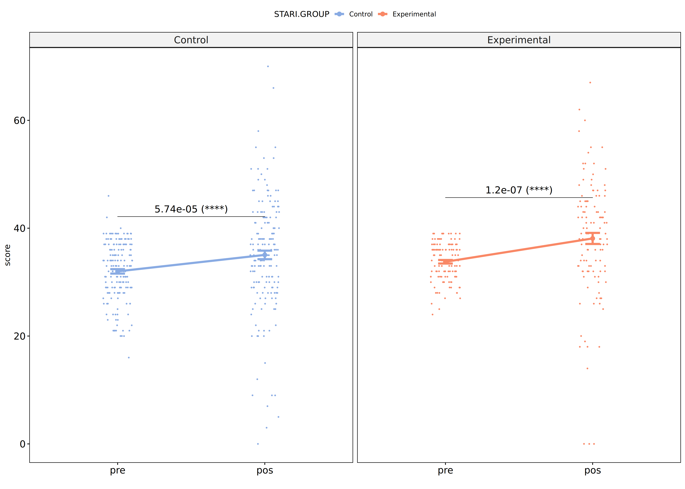
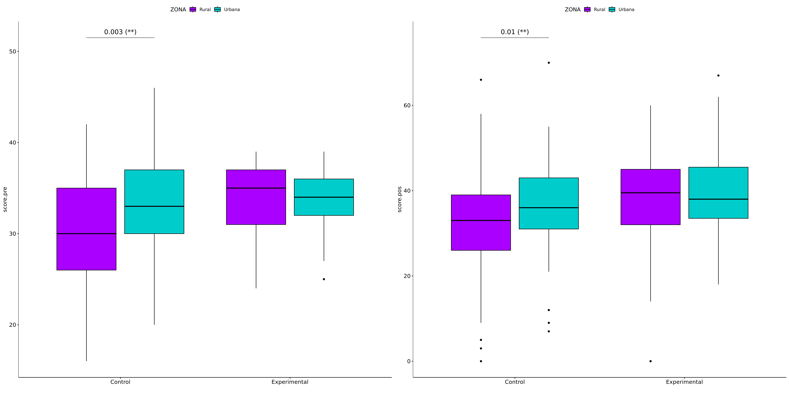
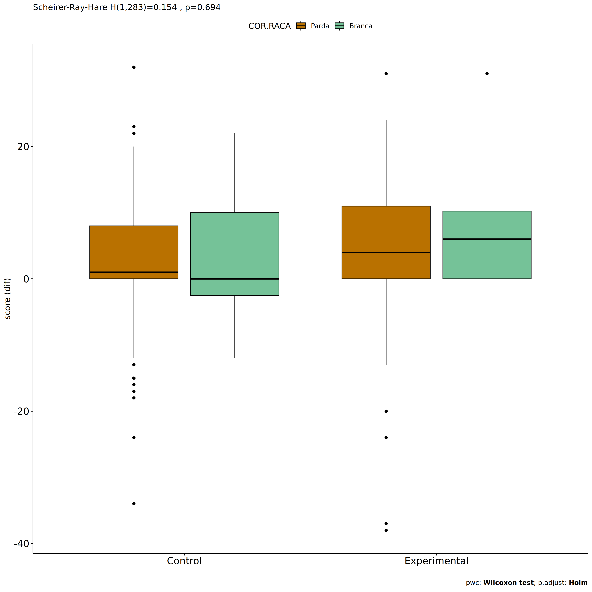
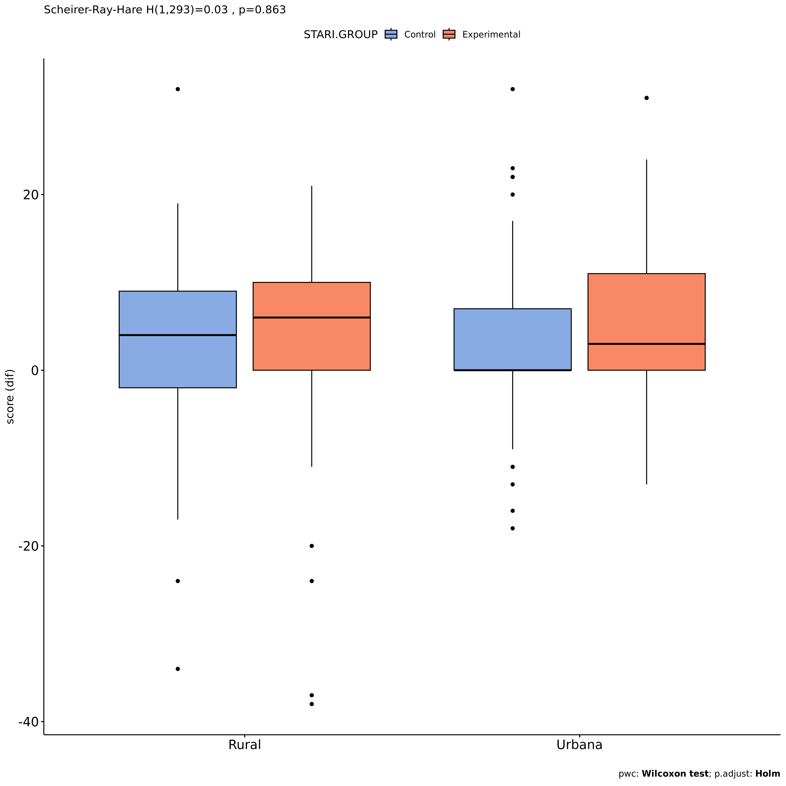
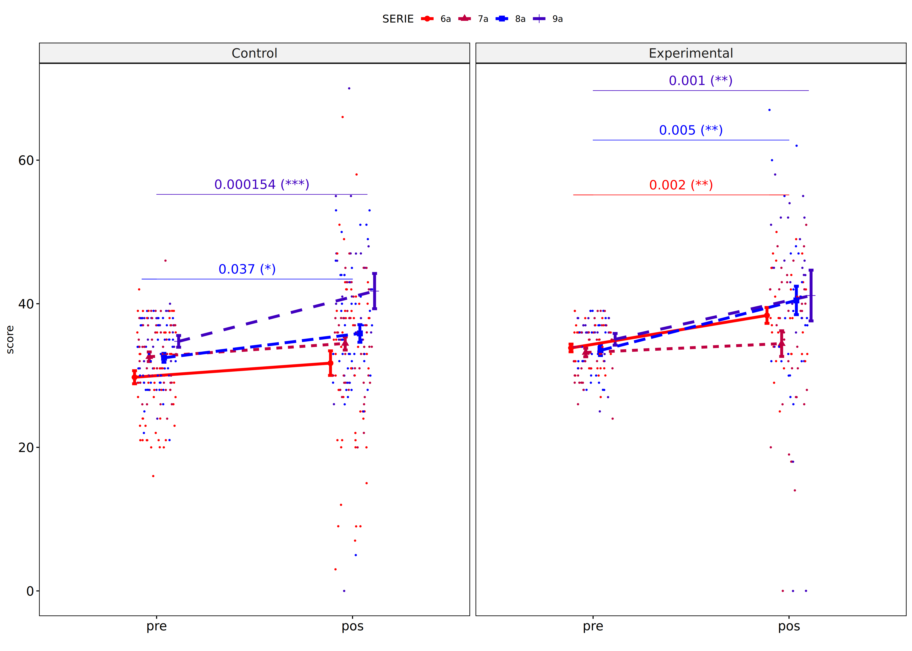

Non-Parametric ANCOVA tests for for assess TDE score
================
Geiser C. Challco <geiser@alumni.usp.br>

- [Setting Initial Variables](#setting-initial-variables)
- [Descriptive Statistics of Initial
  Data](#descriptive-statistics-of-initial-data)
- [One-way factor analysis for: *score ~
  GROUP*](#one-way-factor-analysis-for-score--group)
  - [Pre-test and Post-test PairWise comparisons for: *score ~
    STARI.GROUP*](#pre-test-and-post-test-pairwise-comparisons-for-score--starigroup)
  - [Kruskal and Wilcoxon PairWise comparisons for: *score ~
    STARI.GROUP*](#kruskal-and-wilcoxon-pairwise-comparisons-for-score--starigroup)
- [Two-way factor analysis for: *score ~
  GROUP:SEXO*](#two-way-factor-analysis-for-score--groupsexo)
  - [Pre-test and Post-test PairWise comparisons for: *score ~
    STARI.GROUP:SEXO*](#pre-test-and-post-test-pairwise-comparisons-for-score--starigroupsexo)
  - [Scheirer and Wilcoxon PairWise comparisons for: *score ~
    STARI.GROUP:SEXO*](#scheirer-and-wilcoxon-pairwise-comparisons-for-score--starigroupsexo)
- [Two-way factor analysis for: *score ~
  GROUP:ZONA*](#two-way-factor-analysis-for-score--groupzona)
  - [Pre-test and Post-test PairWise comparisons for: *score ~
    STARI.GROUP:ZONA*](#pre-test-and-post-test-pairwise-comparisons-for-score--starigroupzona)
  - [Scheirer and Wilcoxon PairWise comparisons for: *score ~
    STARI.GROUP:ZONA*](#scheirer-and-wilcoxon-pairwise-comparisons-for-score--starigroupzona)
- [Two-way factor analysis for: *score ~
  GROUP:COR.RACA*](#two-way-factor-analysis-for-score--groupcorraca)
  - [Pre-test and Post-test PairWise comparisons for: *score ~
    STARI.GROUP:COR.RACA*](#pre-test-and-post-test-pairwise-comparisons-for-score--starigroupcorraca)
  - [Scheirer and Wilcoxon PairWise comparisons for: *score ~
    STARI.GROUP:COR.RACA*](#scheirer-and-wilcoxon-pairwise-comparisons-for-score--starigroupcorraca)
- [Two-way factor analysis for: *score ~
  GROUP:LOCAL*](#two-way-factor-analysis-for-score--grouplocal)
  - [Pre-test and Post-test PairWise comparisons for: *score ~
    STARI.GROUP:LOCAL*](#pre-test-and-post-test-pairwise-comparisons-for-score--starigrouplocal)
  - [Scheirer and Wilcoxon PairWise comparisons for: *score ~
    STARI.GROUP:LOCAL*](#scheirer-and-wilcoxon-pairwise-comparisons-for-score--starigrouplocal)
- [Two-way factor analysis for: *score ~
  GROUP:SERIE*](#two-way-factor-analysis-for-score--groupserie)
  - [Pre-test and Post-test PairWise comparisons for: *score ~
    STARI.GROUP:SERIE*](#pre-test-and-post-test-pairwise-comparisons-for-score--starigroupserie)
  - [Scheirer and Wilcoxon PairWise comparisons for: *score ~
    STARI.GROUP:SERIE*](#scheirer-and-wilcoxon-pairwise-comparisons-for-score--starigroupserie)
- [Two-way factor analysis for: *score ~
  GROUP:ESCOLA*](#two-way-factor-analysis-for-score--groupescola)
  - [Pre-test and Post-test PairWise comparisons for: *score ~
    STARI.GROUP:ESCOLA*](#pre-test-and-post-test-pairwise-comparisons-for-score--starigroupescola)
  - [Scheirer and Wilcoxon PairWise comparisons for: *score ~
    STARI.GROUP:ESCOLA*](#scheirer-and-wilcoxon-pairwise-comparisons-for-score--starigroupescola)

# Setting Initial Variables

``` r
dv = "score"
dv.pos = "score.pos"
dv.pre = "score.pre"
dv.dif = "score.dif"

fatores2 <- c("SEXO","ZONA","COR.RACA","LOCAL","SERIE","ESCOLA")
lfatores2 <- as.list(fatores2)
names(lfatores2) <- fatores2

fatores1 <- c("STARI.GROUP", fatores2)
lfatores1 <- as.list(fatores1)
names(lfatores1) <- fatores1

lfatores <- c(lfatores1)

color <- list()
color[["prepost"]] = c("#ffee65","#f28e2B")
color[["STARI.GROUP"]] = c("#89ABE3","#F98866")
color[["SEXO"]] = c("#FF007F","#4D4DFF")
color[["ZONA"]] = c("#AA00FF","#00CCCC")
color[["COR.RACA"]] = c("#b97100","#75c298","#D6B91C","#9F262F","#848283")
color[["LOCAL"]] = c("#AA00FF","#00CCCC")
color[["SERIE"]] = c("#FF0000","#BF0040","#0000FF","#4000BF")
color[["ESCOLA"]] = c("#d8668c","#ff7f7f","#ddf0b2","#b2b2ff","#b299e5")

level <- list()
level[["STARI.GROUP"]] = c("Control","Experimental")
level[["SEXO"]] = c("F","M")
level[["ZONA"]] = c("Rural","Urbana")
level[["COR.RACA"]] = c("Parda", "Branca", "Amarela", "Indígena", "Preta")
level[["LOCAL"]] = c("Rural","Urbana")
level[["SERIE"]] = c("6a","7a","8a","9a")
level[["ESCOLA"]] = c("PROF MARIA","PADRE ANCHIETA","PROF RICARDO","PADRE MOUSINHO","VER PORFIRIO")


# ..

gdat <- read_excel("../data/dat-TDE.xlsx", sheet = "main")
gdat <- gdat[!is.na(gdat[["STARI.GROUP"]]),]
gdat <- gdat[!is.na(gdat[[dv.pre]]) & !is.na(gdat[[dv.pos]]),]
gdat[[dv.dif]] <- gdat[[dv.pos]] - gdat[[dv.pre]] 

gdat <- gdat[is.na(gdat$NECESSIDADE.DEFICIENCIA) & gdat$score.pre != 80 & gdat$score.pos != 80,]

dat <- gdat
dat$STARI.GROUP <- factor(dat[["STARI.GROUP"]], level[["STARI.GROUP"]])
for (coln in c(names(lfatores))) {
  if (length(level[[coln]]) > 0)
    plevel = level[[coln]][level[[coln]] %in% unique(dat[[coln]])]
  else
    plevel = unique(dat[[coln]])[!is.na(unique(dat[[coln]]))]
  
  dat[[coln]] <- factor(dat[[coln]], plevel)
}

dat <- dat[,c("id", names(lfatores), dv.pre, dv.pos, dv.dif)]

dat.long <- rbind(dat, dat)
dat.long$time <- c(rep("pre", nrow(dat)), rep("pos", nrow(dat)))
dat.long$time <- factor(dat.long$time, c("pre","pos"))
dat.long[[dv]] <- c(dat[[dv.pre]], dat[[dv.pos]])


for (f in c("STARI.GROUP", names(lfatores))) {
  if (is.null(color[[f]]) && length(unique(dat[[f]])) > 0) 
      color[[f]] <- distinctColorPalette(length(unique(dat[[f]])))
}

for (f in c(fatores2)) {
  if (is.null(color[[paste0("STARI.GROUP:",f)]]) && length(unique(dat[[f]])) > 0)
    color[[paste0("STARI.GROUP:",f)]] <- distinctColorPalette(
      length(unique(dat[["STARI.GROUP"]]))*length(unique(dat[[f]])))
}

ldat <- list()
laov <- list()
lpwc <- list()
lemms <- list()
```

# Descriptive Statistics of Initial Data

``` r
df <- get.descriptives(dat, c(dv.pre, dv.pos, dv.dif), c("STARI.GROUP"),
                       symmetry.test = T, normality.test = F)
df <- plyr::rbind.fill(
  df, do.call(plyr::rbind.fill, lapply(lfatores2, FUN = function(f) {
    if (nrow(dat) > 0 && sum(!is.na(unique(dat[[f]]))) > 1)
      get.descriptives(dat, c(dv.pre,dv.pos), c("STARI.GROUP", f), include.global = F,
                       symmetry.test = T, normality.test = F)
    }))
)
```

    ## Warning: There were 3 warnings in `mutate()`.
    ## The first warning was:
    ## ℹ In argument: `ci = abs(stats::qt(alpha/2, .data$n - 1) * .data$se)`.
    ## Caused by warning:
    ## ! There was 1 warning in `mutate()`.
    ## ℹ In argument: `ci = abs(stats::qt(alpha/2, .data$n - 1) * .data$se)`.
    ## Caused by warning in `stats::qt()`:
    ## ! NaNs produced
    ## ℹ Run `dplyr::last_dplyr_warnings()` to see the 2 remaining warnings.
    ## There were 3 warnings in `mutate()`.
    ## The first warning was:
    ## ℹ In argument: `ci = abs(stats::qt(alpha/2, .data$n - 1) * .data$se)`.
    ## Caused by warning:
    ## ! There was 1 warning in `mutate()`.
    ## ℹ In argument: `ci = abs(stats::qt(alpha/2, .data$n - 1) * .data$se)`.
    ## Caused by warning in `stats::qt()`:
    ## ! NaNs produced
    ## ℹ Run `dplyr::last_dplyr_warnings()` to see the 2 remaining warnings.

``` r
df <- df[,c("variable",fatores1[fatores1 %in% colnames(df)],
            colnames(df)[!colnames(df) %in% c(fatores1,"variable")])]
```

| variable | STARI.GROUP | SEXO | ZONA | COR.RACA | LOCAL | SERIE | ESCOLA | n | mean | median | min | max | sd | se | ci | iqr | symmetry | skewness | kurtosis |
|:---|:---|:---|:---|:---|:---|:---|:---|---:|---:|---:|---:|---:|---:|---:|---:|---:|:---|---:|---:|
| score.pre | Control |  |  |  |  |  |  | 178 | 31.994 | 33.0 | 16 | 46 | 5.473 | 0.410 | 0.809 | 8.00 | YES | -0.4574502 | -0.3378185 |
| score.pre | Experimental |  |  |  |  |  |  | 119 | 33.773 | 34.0 | 24 | 39 | 3.562 | 0.326 | 0.647 | 5.50 | YES | -0.4401967 | -0.6427166 |
| score.pos | Control |  |  |  |  |  |  | 178 | 35.045 | 36.0 | 0 | 70 | 10.557 | 0.791 | 1.562 | 11.75 | YES | -0.3653629 | 1.5996536 |
| score.pos | Experimental |  |  |  |  |  |  | 119 | 38.101 | 39.0 | 0 | 67 | 11.186 | 1.025 | 2.031 | 12.50 | NO | -0.8247036 | 2.1114369 |
| score.dif | Control |  |  |  |  |  |  | 178 | 3.051 | 1.0 | -34 | 32 | 9.170 | 0.687 | 1.356 | 8.00 | YES | -0.1816873 | 1.8778291 |
| score.dif | Experimental |  |  |  |  |  |  | 119 | 4.328 | 5.0 | -38 | 31 | 10.465 | 0.959 | 1.900 | 10.50 | NO | -0.9258569 | 3.4489083 |
| score.pre | Control | F |  |  |  |  |  | 87 | 31.839 | 33.0 | 16 | 46 | 5.963 | 0.639 | 1.271 | 9.00 | YES | -0.4158074 | -0.3681002 |
| score.pre | Control | M |  |  |  |  |  | 91 | 32.143 | 33.0 | 20 | 40 | 4.988 | 0.523 | 1.039 | 7.50 | YES | -0.4648018 | -0.6355012 |
| score.pre | Experimental | F |  |  |  |  |  | 63 | 34.111 | 35.0 | 25 | 39 | 3.488 | 0.439 | 0.878 | 6.00 | YES | -0.4259206 | -0.7430963 |
| score.pre | Experimental | M |  |  |  |  |  | 56 | 33.393 | 34.0 | 24 | 39 | 3.637 | 0.486 | 0.974 | 5.00 | YES | -0.4316968 | -0.6801892 |
| score.pos | Control | F |  |  |  |  |  | 87 | 35.092 | 36.0 | 7 | 66 | 9.883 | 1.060 | 2.106 | 12.00 | YES | -0.2253507 | 1.1141710 |
| score.pos | Control | M |  |  |  |  |  | 91 | 35.000 | 35.0 | 0 | 70 | 11.219 | 1.176 | 2.336 | 11.50 | YES | -0.4455831 | 1.6817446 |
| score.pos | Experimental | F |  |  |  |  |  | 63 | 38.619 | 38.0 | 18 | 60 | 9.090 | 1.145 | 2.289 | 12.00 | YES | -0.0859265 | -0.2554076 |
| score.pos | Experimental | M |  |  |  |  |  | 56 | 37.518 | 39.0 | 0 | 67 | 13.216 | 1.766 | 3.539 | 13.00 | NO | -0.9628540 | 1.7025386 |
| score.pre | Control |  | Rural |  |  |  |  | 73 | 30.493 | 30.0 | 16 | 42 | 5.982 | 0.700 | 1.396 | 9.00 | YES | -0.2901979 | -0.8703250 |
| score.pre | Control |  | Urbana |  |  |  |  | 101 | 33.218 | 33.0 | 20 | 46 | 4.814 | 0.479 | 0.950 | 7.00 | YES | -0.4584830 | 0.0415280 |
| score.pre | Control |  |  |  |  |  |  | 4 | 28.500 | 27.0 | 26 | 34 | 3.786 | 1.893 | 6.024 | 3.50 | few data | 0.0000000 | 0.0000000 |
| score.pre | Experimental |  | Rural |  |  |  |  | 48 | 33.812 | 35.0 | 24 | 39 | 3.835 | 0.554 | 1.114 | 6.00 | YES | -0.4689604 | -0.7429554 |
| score.pre | Experimental |  | Urbana |  |  |  |  | 67 | 33.821 | 34.0 | 25 | 39 | 3.289 | 0.402 | 0.802 | 4.00 | YES | -0.3977982 | -0.5632193 |
| score.pre | Experimental |  |  |  |  |  |  | 4 | 32.500 | 32.5 | 27 | 38 | 5.323 | 2.661 | 8.470 | 8.00 | YES | 0.0000000 | -2.3366003 |
| score.pos | Control |  | Rural |  |  |  |  | 73 | 32.466 | 33.0 | 0 | 66 | 11.825 | 1.384 | 2.759 | 13.00 | YES | -0.3257779 | 0.8403689 |
| score.pos | Control |  | Urbana |  |  |  |  | 101 | 36.921 | 36.0 | 7 | 70 | 9.335 | 0.929 | 1.843 | 12.00 | YES | -0.0905852 | 1.8813506 |
| score.pos | Control |  |  |  |  |  |  | 4 | 34.750 | 35.5 | 27 | 41 | 5.909 | 2.955 | 9.403 | 5.75 | YES | -0.2549089 | -1.9420440 |
| score.pos | Experimental |  | Rural |  |  |  |  | 48 | 36.312 | 39.5 | 0 | 60 | 13.194 | 1.904 | 3.831 | 13.00 | NO | -1.1859444 | 1.3599505 |
| score.pos | Experimental |  | Urbana |  |  |  |  | 67 | 39.313 | 38.0 | 18 | 67 | 9.678 | 1.182 | 2.361 | 12.00 | YES | 0.2533891 | 0.3162551 |
| score.pos | Experimental |  |  |  |  |  |  | 4 | 39.250 | 42.0 | 29 | 44 | 6.898 | 3.449 | 10.976 | 3.75 | few data | 0.0000000 | 0.0000000 |
| score.pre | Control |  |  | Parda |  |  |  | 153 | 32.471 | 33.0 | 16 | 46 | 5.358 | 0.433 | 0.856 | 8.00 | NO | -0.5275307 | -0.1081351 |
| score.pre | Control |  |  | Branca |  |  |  | 19 | 29.895 | 31.0 | 20 | 37 | 5.695 | 1.307 | 2.745 | 9.00 | YES | -0.3822974 | -1.3846369 |
| score.pre | Control |  |  | Indígena |  |  |  | 4 | 25.500 | 25.5 | 21 | 30 | 3.697 | 1.848 | 5.883 | 3.00 | YES | 0.0000000 | -1.9021044 |
| score.pre | Control |  |  | Preta |  |  |  | 1 | 29.000 | 29.0 | 29 | 29 |  |  |  | 0.00 | few data | 0.0000000 | 0.0000000 |
| score.pre | Control |  |  |  |  |  |  | 1 | 28.000 | 28.0 | 28 | 28 |  |  |  | 0.00 | few data | 0.0000000 | 0.0000000 |
| score.pre | Experimental |  |  | Parda |  |  |  | 97 | 33.928 | 35.0 | 24 | 39 | 3.606 | 0.366 | 0.727 | 6.00 | NO | -0.5092363 | -0.6029958 |
| score.pre | Experimental |  |  | Branca |  |  |  | 18 | 32.778 | 32.5 | 26 | 38 | 3.300 | 0.778 | 1.641 | 5.25 | YES | -0.2881951 | -0.9526856 |
| score.pre | Experimental |  |  | Indígena |  |  |  | 3 | 35.667 | 36.0 | 32 | 39 | 3.512 | 2.028 | 8.724 | 3.50 | few data | 0.0000000 | 0.0000000 |
| score.pre | Experimental |  |  | Preta |  |  |  | 1 | 31.000 | 31.0 | 31 | 31 |  |  |  | 0.00 | few data | 0.0000000 | 0.0000000 |
| score.pos | Control |  |  | Parda |  |  |  | 153 | 35.601 | 37.0 | 0 | 70 | 10.447 | 0.845 | 1.669 | 12.00 | YES | -0.4226458 | 1.7937192 |
| score.pos | Control |  |  | Branca |  |  |  | 19 | 32.895 | 34.0 | 9 | 58 | 10.640 | 2.441 | 5.128 | 7.00 | YES | 0.2794429 | 0.8319617 |
| score.pos | Control |  |  | Indígena |  |  |  | 4 | 26.500 | 30.5 | 7 | 38 | 14.201 | 7.100 | 22.597 | 16.00 | YES | -0.4399663 | -1.9535740 |
| score.pos | Control |  |  | Preta |  |  |  | 1 | 33.000 | 33.0 | 33 | 33 |  |  |  | 0.00 | few data | 0.0000000 | 0.0000000 |
| score.pos | Control |  |  |  |  |  |  | 1 | 27.000 | 27.0 | 27 | 27 |  |  |  | 0.00 | few data | 0.0000000 | 0.0000000 |
| score.pos | Experimental |  |  | Parda |  |  |  | 97 | 38.103 | 39.0 | 0 | 62 | 11.425 | 1.160 | 2.303 | 12.00 | NO | -1.0507118 | 2.1676560 |
| score.pos | Experimental |  |  | Branca |  |  |  | 18 | 38.333 | 38.0 | 18 | 67 | 10.906 | 2.571 | 5.423 | 11.00 | NO | 0.6513874 | 0.6865941 |
| score.pos | Experimental |  |  | Indígena |  |  |  | 3 | 36.667 | 42.0 | 25 | 43 | 10.116 | 5.840 | 25.130 | 9.00 | few data | 0.0000000 | 0.0000000 |
| score.pos | Experimental |  |  | Preta |  |  |  | 1 | 38.000 | 38.0 | 38 | 38 |  |  |  | 0.00 | few data | 0.0000000 | 0.0000000 |
| score.pre | Control |  |  |  | Rural |  |  | 72 | 29.819 | 30.0 | 16 | 40 | 5.810 | 0.685 | 1.365 | 8.00 | YES | -0.2038435 | -0.9160026 |
| score.pre | Control |  |  |  | Urbana |  |  | 106 | 33.472 | 34.0 | 20 | 46 | 4.713 | 0.458 | 0.908 | 7.00 | YES | -0.4296149 | -0.0075861 |
| score.pre | Experimental |  |  |  | Rural |  |  | 47 | 33.617 | 35.0 | 24 | 39 | 4.158 | 0.606 | 1.221 | 7.00 | NO | -0.5352534 | -0.8971964 |
| score.pre | Experimental |  |  |  | Urbana |  |  | 72 | 33.875 | 34.0 | 27 | 39 | 3.140 | 0.370 | 0.738 | 4.25 | YES | -0.1796905 | -0.9292547 |
| score.pos | Control |  |  |  | Rural |  |  | 72 | 32.472 | 35.0 | 0 | 66 | 11.807 | 1.391 | 2.775 | 12.50 | NO | -0.6845184 | 0.9685764 |
| score.pos | Control |  |  |  | Urbana |  |  | 106 | 36.792 | 36.0 | 12 | 70 | 9.273 | 0.901 | 1.786 | 13.00 | YES | 0.4059731 | 0.8017533 |
| score.pos | Experimental |  |  |  | Rural |  |  | 47 | 36.170 | 41.0 | 0 | 60 | 13.548 | 1.976 | 3.978 | 12.00 | NO | -1.1432442 | 1.0244287 |
| score.pos | Experimental |  |  |  | Urbana |  |  | 72 | 39.361 | 38.0 | 18 | 67 | 9.218 | 1.086 | 2.166 | 13.00 | YES | 0.3994899 | 0.3844193 |
| score.pre | Control |  |  |  |  | 6a |  | 55 | 29.764 | 30.0 | 16 | 42 | 6.755 | 0.911 | 1.826 | 12.50 | YES | -0.0976376 | -1.2474385 |
| score.pre | Control |  |  |  |  | 7a |  | 47 | 32.617 | 33.0 | 24 | 46 | 4.580 | 0.668 | 1.345 | 7.50 | YES | 0.3523537 | -0.2238099 |
| score.pre | Control |  |  |  |  | 8a |  | 51 | 32.471 | 33.0 | 21 | 39 | 4.420 | 0.619 | 1.243 | 8.00 | YES | -0.4288305 | -0.4704890 |
| score.pre | Control |  |  |  |  | 9a |  | 25 | 34.760 | 36.0 | 24 | 40 | 4.085 | 0.817 | 1.686 | 6.00 | NO | -0.7985714 | -0.2342114 |
| score.pre | Experimental |  |  |  |  | 6a |  | 32 | 33.844 | 34.5 | 27 | 39 | 3.028 | 0.535 | 1.092 | 5.00 | YES | -0.1999768 | -1.0994223 |
| score.pre | Experimental |  |  |  |  | 7a |  | 38 | 33.211 | 33.5 | 24 | 39 | 3.670 | 0.595 | 1.206 | 5.00 | YES | -0.3296166 | -0.4267359 |
| score.pre | Experimental |  |  |  |  | 8a |  | 28 | 33.500 | 33.5 | 28 | 39 | 3.786 | 0.715 | 1.468 | 6.25 | YES | -0.0750285 | -1.4535705 |
| score.pre | Experimental |  |  |  |  | 9a |  | 21 | 35.048 | 36.0 | 25 | 39 | 3.735 | 0.815 | 1.700 | 4.00 | NO | -1.3354788 | 0.7866553 |
| score.pos | Control |  |  |  |  | 6a |  | 55 | 31.727 | 34.0 | 3 | 66 | 12.686 | 1.711 | 3.430 | 16.00 | YES | -0.1087393 | 0.1132821 |
| score.pos | Control |  |  |  |  | 7a |  | 47 | 34.468 | 35.0 | 20 | 47 | 6.265 | 0.914 | 1.840 | 8.50 | YES | -0.0787669 | -0.5856080 |
| score.pos | Control |  |  |  |  | 8a |  | 51 | 35.863 | 35.0 | 5 | 53 | 8.750 | 1.225 | 2.461 | 10.50 | YES | -0.2993314 | 1.5014020 |
| score.pos | Control |  |  |  |  | 9a |  | 25 | 41.760 | 43.0 | 0 | 70 | 12.282 | 2.456 | 5.070 | 9.00 | NO | -1.1108958 | 3.7429177 |
| score.pos | Experimental |  |  |  |  | 6a |  | 32 | 38.375 | 38.0 | 25 | 50 | 6.251 | 1.105 | 2.254 | 10.25 | YES | 0.0664337 | -0.9259495 |
| score.pos | Experimental |  |  |  |  | 7a |  | 38 | 34.447 | 38.0 | 0 | 51 | 10.993 | 1.783 | 3.613 | 14.75 | NO | -0.9969186 | 0.7089133 |
| score.pos | Experimental |  |  |  |  | 8a |  | 28 | 40.464 | 38.0 | 26 | 67 | 10.490 | 1.982 | 4.068 | 13.50 | NO | 0.9065264 | 0.0527944 |
| score.pos | Experimental |  |  |  |  | 9a |  | 21 | 41.143 | 45.0 | 0 | 58 | 16.203 | 3.536 | 7.375 | 12.00 | NO | -1.5328944 | 1.2992127 |
| score.pre | Control |  |  |  |  |  | PROF MARIA | 45 | 32.978 | 33.0 | 20 | 42 | 4.115 | 0.613 | 1.236 | 6.00 | YES | -0.3653287 | 0.4701212 |
| score.pre | Control |  |  |  |  |  | PADRE ANCHIETA | 29 | 32.310 | 34.0 | 16 | 38 | 4.417 | 0.820 | 1.680 | 6.00 | NO | -1.5450270 | 3.8861913 |
| score.pre | Control |  |  |  |  |  | PROF RICARDO | 54 | 35.037 | 36.5 | 28 | 46 | 3.981 | 0.542 | 1.087 | 7.00 | YES | -0.1395249 | -0.5620494 |
| score.pre | Control |  |  |  |  |  | PADRE MOUSINHO | 43 | 28.140 | 27.0 | 20 | 40 | 6.073 | 0.926 | 1.869 | 10.00 | YES | 0.4633673 | -1.0272196 |
| score.pre | Control |  |  |  |  |  | VER PORFIRIO | 7 | 24.571 | 24.0 | 21 | 29 | 2.878 | 1.088 | 2.662 | 3.00 | YES | 0.4400616 | -1.5477202 |
| score.pre | Experimental |  |  |  |  |  | PROF MARIA | 23 | 35.000 | 36.0 | 30 | 39 | 2.954 | 0.616 | 1.277 | 5.50 | YES | -0.3440206 | -1.3559783 |
| score.pre | Experimental |  |  |  |  |  | PADRE ANCHIETA | 11 | 33.364 | 33.0 | 28 | 38 | 3.384 | 1.020 | 2.274 | 5.50 | YES | -0.1019779 | -1.6834205 |
| score.pre | Experimental |  |  |  |  |  | PROF RICARDO | 37 | 33.459 | 34.0 | 28 | 39 | 3.088 | 0.508 | 1.029 | 5.00 | YES | -0.2292209 | -0.9796516 |
| score.pre | Experimental |  |  |  |  |  | PADRE MOUSINHO | 36 | 33.694 | 35.5 | 24 | 39 | 4.407 | 0.734 | 1.491 | 7.00 | NO | -0.5956777 | -0.9311736 |
| score.pre | Experimental |  |  |  |  |  | VER PORFIRIO | 12 | 33.000 | 32.5 | 27 | 39 | 3.303 | 0.953 | 2.099 | 2.75 | YES | 0.2914113 | -0.6556250 |
| score.pos | Control |  |  |  |  |  | PROF MARIA | 45 | 35.178 | 33.0 | 20 | 70 | 8.354 | 1.245 | 2.510 | 7.00 | NO | 1.9118779 | 5.1283639 |
| score.pos | Control |  |  |  |  |  | PADRE ANCHIETA | 29 | 38.655 | 38.0 | 29 | 66 | 7.456 | 1.385 | 2.836 | 7.00 | NO | 1.7041039 | 4.1049771 |
| score.pos | Control |  |  |  |  |  | PROF RICARDO | 54 | 37.944 | 38.0 | 12 | 58 | 10.097 | 1.374 | 2.756 | 13.75 | YES | -0.3476574 | -0.3370476 |
| score.pos | Control |  |  |  |  |  | PADRE MOUSINHO | 43 | 28.302 | 31.0 | 0 | 47 | 12.426 | 1.895 | 3.824 | 17.00 | NO | -0.6434965 | -0.6244997 |
| score.pos | Control |  |  |  |  |  | VER PORFIRIO | 7 | 38.286 | 40.0 | 27 | 45 | 7.653 | 2.893 | 7.078 | 10.00 | NO | -0.5753654 | -1.6678294 |
| score.pos | Experimental |  |  |  |  |  | PROF MARIA | 23 | 37.565 | 36.0 | 30 | 58 | 7.525 | 1.569 | 3.254 | 6.50 | NO | 1.3350787 | 0.7947685 |
| score.pos | Experimental |  |  |  |  |  | PADRE ANCHIETA | 11 | 41.364 | 40.0 | 32 | 52 | 6.667 | 2.010 | 4.479 | 8.00 | YES | 0.2461415 | -1.3635397 |
| score.pos | Experimental |  |  |  |  |  | PROF RICARDO | 37 | 37.811 | 38.0 | 18 | 54 | 8.740 | 1.437 | 2.914 | 12.00 | YES | -0.3906363 | -0.5968957 |
| score.pos | Experimental |  |  |  |  |  | PADRE MOUSINHO | 36 | 34.583 | 41.0 | 0 | 60 | 14.746 | 2.458 | 4.989 | 16.50 | NO | -0.9225620 | 0.2005536 |
| score.pos | Experimental |  |  |  |  |  | VER PORFIRIO | 12 | 47.583 | 46.0 | 33 | 67 | 9.830 | 2.838 | 6.246 | 9.25 | NO | 0.5241572 | -0.7856940 |

# One-way factor analysis for: *score ~ GROUP*

``` r
pdat = remove_group_data(dat[!is.na(dat[["STARI.GROUP"]]),], "score.dif", "STARI.GROUP")

pdat.long <- rbind(pdat[,c("id","STARI.GROUP")], pdat[,c("id","STARI.GROUP")])
pdat.long[["time"]] <- c(rep("pre", nrow(pdat)), rep("pos", nrow(pdat)))
pdat.long[["time"]] <- factor(pdat.long[["time"]], c("pre","pos"))
pdat.long[["score"]] <- c(pdat[["score.pre"]], pdat[["score.pos"]])

y.position.min <- abs(
  max(pdat.long[["score"]])
  - min(pdat.long[["score"]]))/15

lvars = as.list(c("score.dif","score.pos","score.pre"))
names(lvars) = unlist(lvars)
```

## Pre-test and Post-test PairWise comparisons for: *score ~ STARI.GROUP*

``` r
pwc.long <- group_by(pdat.long, STARI.GROUP) %>%
  pairwise_wilcox_test(score ~ time, detailed = T)

df <- pwc.long[,c(".y.","STARI.GROUP","group1","group2","n1","n2","estimate",
                  "statistic","p.adj","p.adj.signif")]
```

| .y. | STARI.GROUP | group1 | group2 | n1 | n2 | estimate | statistic | p.adj | p.adj.signif |
|:---|:---|:---|:---|---:|---:|---:|---:|---:|:---|
| score | Control | pre | pos | 178 | 178 | -3.000044 | 11940.5 | 5.74e-05 | \*\*\*\* |
| score | Experimental | pre | pos | 119 | 119 | -5.000065 | 4274.0 | 1.00e-07 | \*\*\*\* |

``` r
stat.test <- pwc.long %>% add_xy_position(x = "STARI.GROUP", fun = "max")
stat.test$y.position <- stat.test$y.position + y.position.min

ggboxplot(pdat.long, x = "STARI.GROUP", y = "score",
          palette = color$prepost, fill = "time") +
  stat_pvalue_manual(stat.test, tip.length = 0, hide.ns = T,
                     label = "{ p.adj } ({ p.adj.signif })") + xlab("")
```

<!-- -->

``` r
stat.test <- pwc.long %>% add_xy_position(x = "time", fun = "mean_ci")
stat.test$y.position <- stat.test$y.position + y.position.min

gg <- ggline(
  pdat.long, x = "time", y = "score", size = 1.5,
  facet.by = "STARI.GROUP", add = c("mean_se"), color = "STARI.GROUP",
  position = position_dodge(width = 0.3), palette = color[["STARI.GROUP"]])

pdat.long$xj = jitter(as.numeric(pdat.long[["time"]]), amount=.1)
pdat.long$yj = jitter(pdat.long[["score"]], amount = .01)

gg + geom_point(
  data = pdat.long, aes_string(x="xj",y="yj", color = "STARI.GROUP"), size=0.5) +
  stat_pvalue_manual(
    stat.test, tip.length = 0, hide.ns = T, label.size = 5,
    position = position_dodge(width = 0.3),
    label = "{ p.adj } ({ p.adj.signif })") + xlab("") +
  theme(strip.text = element_text(size = 14),
        axis.text = element_text(size = 14))
```

    ## Warning: `aes_string()` was deprecated in ggplot2 3.0.0.
    ## ℹ Please use tidy evaluation idioms with `aes()`.
    ## ℹ See also `vignette("ggplot2-in-packages")` for more information.
    ## This warning is displayed once every 8 hours.
    ## Call `lifecycle::last_lifecycle_warnings()` to see where this warning was
    ## generated.

<!-- -->

## Kruskal and Wilcoxon PairWise comparisons for: *score ~ STARI.GROUP*

``` r
kt <- lapply(lvars, FUN = function(x) {
  kruskal_test(pdat, as.formula(paste0(x," ~ STARI.GROUP")))  
})

df <- do.call(rbind.fill, lapply(lvars, function(x) {
  add_significance(merge(
    kt[[x]], kruskal_effsize(pdat, as.formula(paste0(x," ~ STARI.GROUP"))),
    by = c(".y.","n"), suffixes = c("",".ez")))
}))

df <- df[,c(".y.","n","df","statistic","p","p.signif","effsize","magnitude")]
```

| .y.       |   n |  df | statistic |       p | p.signif |   effsize | magnitude |
|:----------|----:|----:|----------:|--------:|:---------|----------:|:----------|
| score.dif | 297 |   1 |  2.823073 | 0.09290 | ns       | 0.0061799 | small     |
| score.pos | 297 |   1 |  8.669211 | 0.00324 | \*\*     | 0.0259973 | small     |
| score.pre | 297 |   1 |  6.201322 | 0.01280 | \*       | 0.0176316 | small     |

``` r
pwc <- lapply(lvars, FUN = function(x) {
  pairwise_wilcox_test(pdat, as.formula(paste0(x," ~ STARI.GROUP")), detailed = T)  
})

df <- do.call(rbind.fill, pwc)
```

| estimate | .y. | group1 | group2 | n1 | n2 | statistic | p | conf.low | conf.high | method | alternative | p.adj | p.adj.signif |
|---:|:---|:---|:---|---:|---:|---:|---:|---:|---:|:---|:---|---:|:---|
| -1.000042 | score.dif | Control | Experimental | 178 | 119 | 9380.5 | 0.093 | -3.000046 | 0.0000272 | Wilcoxon | two.sided | 0.093 | ns |
| -3.000048 | score.pos | Control | Experimental | 178 | 119 | 8457.0 | 0.003 | -5.999967 | -1.0000461 | Wilcoxon | two.sided | 0.003 | \*\* |
| -1.000033 | score.pre | Control | Experimental | 178 | 119 | 8789.5 | 0.013 | -2.000071 | -0.0000185 | Wilcoxon | two.sided | 0.013 | \* |

``` r
plots <- lapply(lvars, FUN = function(y) {
  stat.test <- pwc[[y]] %>% add_xy_position(x = "STARI.GROUP")
  stat.test$y.position <- stat.test$y.position + y.position.min
  ggboxplot(pdat, x = "STARI.GROUP", y = y, fill = "STARI.GROUP",
            palette = color[["STARI.GROUP"]]) +
    stat_pvalue_manual(stat.test, tip.length = 0, hide.ns = T, label.size = 5,
                       label="{ p.adj } ({ p.adj.signif })") + xlab("")
})
```

``` r
egg::ggarrange(plots[["score.pre"]], plots[["score.pos"]], nrow = 1)
```

<!-- -->

``` r
plots[["score.dif"]] +
  labs(subtitle = get_test_label(kt[["score.dif"]], detailed = T),
       caption = get_pwc_label(pwc[["score.dif"]])) +
  ylab("score (dif)")  +
  theme(strip.text = element_text(size = 14),
        axis.text = element_text(size = 14))
```

<!-- -->

# Two-way factor analysis for: *score ~ GROUP:SEXO*

``` r
pdat = remove_group_data(
  dat[!is.na(dat[["STARI.GROUP"]]) & !is.na(dat[["SEXO"]]),],
  "score.dif", c("STARI.GROUP","SEXO"))

pdat.long <- rbind(pdat[,c("id","STARI.GROUP","SEXO")],
                   pdat[,c("id","STARI.GROUP","SEXO")])
pdat.long[["time"]] <- c(rep("pre", nrow(pdat)), rep("pos", nrow(pdat)))
pdat.long[["time"]] <- factor(pdat.long[["time"]], c("pre","pos"))
pdat.long[["score"]] <- c(pdat[["score.pre"]], pdat[["score.pos"]])

y.position.min <- abs(
  max(pdat.long[["score"]])
  - min(pdat.long[["score"]]))/15

lvars = as.list(c("score.dif","score.pos","score.pre"))
names(lvars) = unlist(lvars)
```

## Pre-test and Post-test PairWise comparisons for: *score ~ STARI.GROUP:SEXO*

``` r
pwc.long <- group_by(pdat.long, STARI.GROUP:SEXO) %>%
  pairwise_wilcox_test(score ~ time, detailed = T)

df <- pwc.long[,c(".y.","STARI.GROUP:SEXO","group1","group2","n1","n2","estimate",
                  "statistic","p.adj","p.adj.signif")]
```

| .y. | STARI.GROUP:SEXO | group1 | group2 | n1 | n2 | estimate | statistic | p.adj | p.adj.signif |
|:---|:---|:---|:---|---:|---:|---:|---:|---:|:---|
| score | Control:F | pre | pos | 87 | 87 | -3.999936 | 2805.5 | 3.00e-03 | \*\* |
| score | Control:M | pre | pos | 91 | 91 | -2.999930 | 3176.0 | 7.00e-03 | \*\* |
| score | Experimental:F | pre | pos | 63 | 63 | -4.999966 | 1262.5 | 4.21e-04 | \*\*\* |
| score | Experimental:M | pre | pos | 56 | 56 | -5.999956 | 895.0 | 8.82e-05 | \*\*\*\* |

``` r
stat.test <- pwc.long %>% add_xy_position(x = "STARI.GROUP:SEXO", fun = "max")
sidx = which(stat.test$p.adj.signif != "ns")
stat.test$y.position[sidx] <- stat.test$y.position[sidx] + y.position.min * (1:length(sidx))

pdat.long[[paste0(c("STARI.GROUP","SEXO"), collapse = ":")]] = apply(
  pdat.long[, c("STARI.GROUP","SEXO")], 1, paste0, collapse = ":")

ggboxplot(pdat.long, x = "STARI.GROUP:SEXO", y = "score",
          palette = color$prepost, fill = "time") +
  stat_pvalue_manual(stat.test, tip.length = 0, hide.ns = T,
                     label = "{ p.adj } ({ p.adj.signif })") + xlab("")
```

<!-- -->

``` r
pwc.long <- group_by(pdat.long, STARI.GROUP, SEXO) %>%
  pairwise_wilcox_test(score ~ time, detailed = T)

stat.test <- pwc.long %>% add_xy_position(x = "time", fun = "mean_se")
sidx = which(stat.test$p.adj.signif != "ns")
stat.test$y.position[sidx] <- stat.test$y.position[sidx] + y.position.min * (1:length(sidx))

gg <- ggline(
  pdat.long, x = "time", y = "score",
  color = "SEXO", linetype = "SEXO", shape = "SEXO", size = 1.5,
  facet.by = "STARI.GROUP", add = c("mean_se"),
  position = position_dodge(width = 0.3), palette = color[["SEXO"]])

pdat.long$xj = jitter(as.numeric(pdat.long[["time"]]), amount=.1)
pdat.long$yj = jitter(pdat.long[["score"]], amount = .01)

gg + geom_point(
  data = pdat.long, aes_string(x="xj",y="yj",colour="SEXO"), size=0.5) +
  stat_pvalue_manual(
    stat.test, tip.length = 0, hide.ns = T, label.size = 5,
    position = position_dodge(width = 0.3), color = "SEXO",
    label = "{ p.adj } ({ p.adj.signif })") + xlab("") +
  theme(strip.text = element_text(size = 14),
        axis.text = element_text(size = 14))
```

<!-- -->

## Scheirer and Wilcoxon PairWise comparisons for: *score ~ STARI.GROUP:SEXO*

``` r
sch <- lapply(lvars, FUN = function(x) {
  scheirer.test(pdat, x, c("STARI.GROUP","SEXO"), as.table = T) 
})
df <- do.call(rbind.fill, sch)
```

| var       | Effect           |  Df |       Sum Sq |         H |   p.value | p.value.signif |
|:----------|:-----------------|----:|-------------:|----------:|----------:|:---------------|
| score.dif | STARI.GROUP      |   1 | 2.075589e+04 | 2.8519659 | 0.0912623 | ns             |
| score.dif | SEXO             |   1 | 4.503334e+02 | 0.0618781 | 0.8035518 | ns             |
| score.dif | STARI.GROUP:SEXO |   1 | 1.717174e+03 | 0.2359485 | 0.6271477 | ns             |
| score.dif | Residuals        | 293 | 2.131500e+06 |           |           |                |
| score.pos | STARI.GROUP      |   1 | 6.373075e+04 | 8.6526729 | 0.0032658 | \*\*           |
| score.pos | SEXO             |   1 | 1.034724e+00 | 0.0001405 | 0.9905432 | ns             |
| score.pos | STARI.GROUP:SEXO |   1 | 4.321057e+00 | 0.0005867 | 0.9806762 | ns             |
| score.pos | Residuals        | 293 | 2.116313e+06 |           |           |                |
| score.pre | STARI.GROUP      |   1 | 4.470029e+04 | 6.0916733 | 0.0135820 | \*             |
| score.pre | SEXO             |   1 | 1.874679e+03 | 0.2554778 | 0.6132441 | ns             |
| score.pre | STARI.GROUP:SEXO |   1 | 4.749399e+03 | 0.6472395 | 0.4211014 | ns             |
| score.pre | Residuals        | 293 | 2.119899e+06 |           |           |                |

``` r
pwc <- lapply(lvars, FUN = function(x) {
  list(
    STARI.GROUP = tryCatch(pairwise_wilcox_test(group_by(pdat, SEXO),
                                 as.formula(paste0(x," ~ STARI.GROUP")), detailed = T)
                         , error = function(e) NULL),
    SEXO = tryCatch(pairwise_wilcox_test(group_by(pdat, STARI.GROUP),
                                 as.formula(paste0(x," ~ SEXO")), detailed = T)
                         , error = function(e) NULL)
  )
})

df <- do.call(rbind.fill, lapply(pwc, FUN =  function(x) {
  do.call(rbind.fill, x)
}))

ivs = c()
if ("STARI.GROUP" %in% colnames(df)) ivs = c(ivs, "STARI.GROUP")
if ("SEXO" %in% colnames(df)) ivs = c(ivs, "SEXO")
df <- df[,c(".y.",ivs,"group1","group2","n1","n2","estimate",
            "statistic","p.adj","p.adj.signif")]
```

| .y. | STARI.GROUP | SEXO | group1 | group2 | n1 | n2 | estimate | statistic | p.adj | p.adj.signif |
|:---|:---|:---|:---|:---|---:|---:|---:|---:|---:|:---|
| score.dif |  | F | Control | Experimental | 87 | 63 | -0.0000673 | 2501.5 | 0.359 | ns |
| score.dif |  | M | Control | Experimental | 91 | 56 | -1.9999172 | 2186.0 | 0.148 | ns |
| score.dif | Control |  | F | M | 87 | 91 | 0.0000075 | 4018.5 | 0.861 | ns |
| score.dif | Experimental |  | F | M | 63 | 56 | -0.9999599 | 1656.0 | 0.565 | ns |
| score.pos |  | F | Control | Experimental | 87 | 63 | -3.0000264 | 2186.0 | 0.035 | \* |
| score.pos |  | M | Control | Experimental | 91 | 56 | -3.0000401 | 2044.0 | 0.044 | \* |
| score.pos | Control |  | F | M | 87 | 91 | 0.0000163 | 3980.5 | 0.950 | ns |
| score.pos | Experimental |  | F | M | 63 | 56 | -0.0000293 | 1755.0 | 0.964 | ns |
| score.pre |  | F | Control | Experimental | 87 | 63 | -1.9999743 | 2165.5 | 0.028 | \* |
| score.pre |  | M | Control | Experimental | 91 | 56 | -0.9999677 | 2234.5 | 0.211 | ns |
| score.pre | Control |  | F | M | 87 | 91 | -0.0000117 | 3879.0 | 0.818 | ns |
| score.pre | Experimental |  | F | M | 63 | 56 | 0.9999351 | 1962.5 | 0.289 | ns |

``` r
plots <- lapply(lvars, FUN = function(y) {
  livs = list("STARI.GROUP", "SEXO")
  names(livs) = unlist(livs)
  lapply(livs, FUN = function(x) {
    iv2 = setdiff(names(livs), x)
    if (!is.null(pwc[[y]][[iv2]])) {
      stat.test <- pwc[[y]][[iv2]] %>% add_xy_position(x = x, fun = "max")
      sidx = which(stat.test$p.adj.signif != "ns")
      stat.test$y.position[sidx] <- stat.test$y.position[sidx] + y.position.min * (1:length(sidx))
      
      ggboxplot(pdat, x = x, y = y, fill = iv2, palette = color[[iv2]]) +
        stat_pvalue_manual(stat.test, tip.length = 0, hide.ns = T, label.size = 5,
                           label="{ p.adj } ({ p.adj.signif })") + xlab("")
    }
  })
})
```

``` r
if (!is.null(plots[["score.pre"]][["STARI.GROUP"]]) &&
    !is.null(plots[["score.pos"]][["STARI.GROUP"]])) {
  egg::ggarrange(plots[["score.pre"]][["STARI.GROUP"]],
                 plots[["score.pos"]][["STARI.GROUP"]], nrow = 1)  
}
```

<!-- -->

``` r
if (!is.null(plots[["score.pre"]][["SEXO"]]) &&
    !is.null(plots[["score.pos"]][["SEXO"]])) {
  egg::ggarrange(plots[["score.pre"]][["SEXO"]],
                 plots[["score.pos"]][["SEXO"]], nrow = 1)
}
```

<!-- -->

``` r
psch = sch[["score.dif"]]
idx = which(psch$Effect == "STARI.GROUP:SEXO") 

dof = floor(as.double(psch$Df[idx]))
dof.res = floor(as.double(psch$Df[which(psch$Effect == "Residuals")]))
statistic = round(as.double(psch$H[idx]), 3)
p = round(as.double(psch[["p.value"]][idx]), 3)
pval = ifelse(p < 0.001,paste0(" , p<0.001"),paste0(" , p=",p))

if (!is.null(plots[["score.dif"]][["STARI.GROUP"]]))
  plots[["score.dif"]][["STARI.GROUP"]] +
    labs(subtitle = paste0("Scheirer-Ray-Hare H(", dof, ",", 
          dof.res, ")=", statistic, pval),
         caption = get_pwc_label(pwc[["score.dif"]][["SEXO"]])) +
    ylab("score (dif)") +
  theme(strip.text = element_text(size = 14),
        axis.text = element_text(size = 14))
```

<!-- -->

``` r
psch = sch[["score.dif"]]
idx = which(psch$Effect == "STARI.GROUP:SEXO") 

dof = floor(as.double(psch$Df[idx]))
dof.res = floor(as.double(psch$Df[which(psch$Effect == "Residuals")]))
statistic = round(as.double(psch$H[idx]), 3)
p = round(as.double(psch[["p.value"]][idx]), 3)
pval = ifelse(p < 0.001,paste0(" , p<0.001"),paste0(" , p=",p))

if (!is.null(plots[["score.dif"]][["SEXO"]]))
  plots[["score.dif"]][["SEXO"]] +
    labs(subtitle = paste0("Scheirer-Ray-Hare H(", dof, ",", 
          dof.res, ")=", statistic, pval),
         caption = get_pwc_label(pwc[["score.dif"]][["STARI.GROUP"]])) +
    ylab("score (dif)") +
  theme(strip.text = element_text(size = 14),
        axis.text = element_text(size = 14))
```

<!-- -->

# Two-way factor analysis for: *score ~ GROUP:ZONA*

``` r
pdat = remove_group_data(
  dat[!is.na(dat[["STARI.GROUP"]]) & !is.na(dat[["ZONA"]]),],
  "score.dif", c("STARI.GROUP","ZONA"))

pdat.long <- rbind(pdat[,c("id","STARI.GROUP","ZONA")],
                   pdat[,c("id","STARI.GROUP","ZONA")])
pdat.long[["time"]] <- c(rep("pre", nrow(pdat)), rep("pos", nrow(pdat)))
pdat.long[["time"]] <- factor(pdat.long[["time"]], c("pre","pos"))
pdat.long[["score"]] <- c(pdat[["score.pre"]], pdat[["score.pos"]])

y.position.min <- abs(
  max(pdat.long[["score"]])
  - min(pdat.long[["score"]]))/15

lvars = as.list(c("score.dif","score.pos","score.pre"))
names(lvars) = unlist(lvars)
```

## Pre-test and Post-test PairWise comparisons for: *score ~ STARI.GROUP:ZONA*

``` r
pwc.long <- group_by(pdat.long, STARI.GROUP:ZONA) %>%
  pairwise_wilcox_test(score ~ time, detailed = T)

df <- pwc.long[,c(".y.","STARI.GROUP:ZONA","group1","group2","n1","n2","estimate",
                  "statistic","p.adj","p.adj.signif")]
```

| .y. | STARI.GROUP:ZONA | group1 | group2 | n1 | n2 | estimate | statistic | p.adj | p.adj.signif |
|:---|:---|:---|:---|---:|---:|---:|---:|---:|:---|
| score | Control:Rural | pre | pos | 73 | 73 | -2.999962 | 2194 | 6.60e-02 | ns |
| score | Control:Urbana | pre | pos | 101 | 101 | -3.000052 | 3683 | 6.35e-04 | \*\*\* |
| score | Experimental:Rural | pre | pos | 48 | 48 | -4.999963 | 744 | 3.00e-03 | \*\* |
| score | Experimental:Urbana | pre | pos | 67 | 67 | -4.999943 | 1310 | 3.08e-05 | \*\*\*\* |

``` r
stat.test <- pwc.long %>% add_xy_position(x = "STARI.GROUP:ZONA", fun = "max")
sidx = which(stat.test$p.adj.signif != "ns")
stat.test$y.position[sidx] <- stat.test$y.position[sidx] + y.position.min * (1:length(sidx))

pdat.long[[paste0(c("STARI.GROUP","ZONA"), collapse = ":")]] = apply(
  pdat.long[, c("STARI.GROUP","ZONA")], 1, paste0, collapse = ":")

ggboxplot(pdat.long, x = "STARI.GROUP:ZONA", y = "score",
          palette = color$prepost, fill = "time") +
  stat_pvalue_manual(stat.test, tip.length = 0, hide.ns = T,
                     label = "{ p.adj } ({ p.adj.signif })") + xlab("")
```

<!-- -->

``` r
pwc.long <- group_by(pdat.long, STARI.GROUP, ZONA) %>%
  pairwise_wilcox_test(score ~ time, detailed = T)

stat.test <- pwc.long %>% add_xy_position(x = "time", fun = "mean_se")
sidx = which(stat.test$p.adj.signif != "ns")
stat.test$y.position[sidx] <- stat.test$y.position[sidx] + y.position.min * (1:length(sidx))

gg <- ggline(
  pdat.long, x = "time", y = "score",
  color = "ZONA", linetype = "ZONA", shape = "ZONA", size = 1.5,
  facet.by = "STARI.GROUP", add = c("mean_se"),
  position = position_dodge(width = 0.3), palette = color[["ZONA"]])

pdat.long$xj = jitter(as.numeric(pdat.long[["time"]]), amount=.1)
pdat.long$yj = jitter(pdat.long[["score"]], amount = .01)

gg + geom_point(
  data = pdat.long, aes_string(x="xj",y="yj",colour="ZONA"), size=0.5) +
  stat_pvalue_manual(
    stat.test, tip.length = 0, hide.ns = T, label.size = 5,
    position = position_dodge(width = 0.3), color = "ZONA",
    label = "{ p.adj } ({ p.adj.signif })") + xlab("") +
  theme(strip.text = element_text(size = 14),
        axis.text = element_text(size = 14))
```

<!-- -->

## Scheirer and Wilcoxon PairWise comparisons for: *score ~ STARI.GROUP:ZONA*

``` r
sch <- lapply(lvars, FUN = function(x) {
  scheirer.test(pdat, x, c("STARI.GROUP","ZONA"), as.table = T) 
})
df <- do.call(rbind.fill, sch)
```

| var       | Effect           |  Df |       Sum Sq |         H |   p.value | p.value.signif |
|:----------|:-----------------|----:|-------------:|----------:|----------:|:---------------|
| score.dif | STARI.GROUP      |   1 |   17671.8471 | 2.5668485 | 0.1091249 | ns             |
| score.dif | ZONA             |   1 |    5734.7809 | 0.8329810 | 0.3614119 | ns             |
| score.dif | STARI.GROUP:ZONA |   1 |     331.6638 | 0.0481744 | 0.8262709 | ns             |
| score.dif | Residuals        | 285 | 1958997.1749 |           |           |                |
| score.pos | STARI.GROUP      |   1 |   55379.5618 | 7.9402755 | 0.0048346 | \*\*           |
| score.pos | ZONA             |   1 |   35234.8003 | 5.0519364 | 0.0245984 | \*             |
| score.pos | STARI.GROUP:ZONA |   1 |    8003.1704 | 1.1474879 | 0.2840756 | ns             |
| score.pos | Residuals        | 285 | 1909853.6949 |           |           |                |
| score.pre | STARI.GROUP      |   1 |   38472.0157 | 5.5371989 | 0.0186164 | \*             |
| score.pre | ZONA             |   1 |   36622.4466 | 5.2709942 | 0.0216836 | \*             |
| score.pre | STARI.GROUP:ZONA |   1 |   28421.6838 | 4.0906751 | 0.0431204 | \*             |
| score.pre | Residuals        | 285 | 1897324.4552 |           |           |                |

``` r
pwc <- lapply(lvars, FUN = function(x) {
  list(
    STARI.GROUP = tryCatch(pairwise_wilcox_test(group_by(pdat, ZONA),
                                 as.formula(paste0(x," ~ STARI.GROUP")), detailed = T)
                         , error = function(e) NULL),
    ZONA = tryCatch(pairwise_wilcox_test(group_by(pdat, STARI.GROUP),
                                 as.formula(paste0(x," ~ ZONA")), detailed = T)
                         , error = function(e) NULL)
  )
})

df <- do.call(rbind.fill, lapply(pwc, FUN =  function(x) {
  do.call(rbind.fill, x)
}))

ivs = c()
if ("STARI.GROUP" %in% colnames(df)) ivs = c(ivs, "STARI.GROUP")
if ("ZONA" %in% colnames(df)) ivs = c(ivs, "ZONA")
df <- df[,c(".y.",ivs,"group1","group2","n1","n2","estimate",
            "statistic","p.adj","p.adj.signif")]
```

| .y. | STARI.GROUP | ZONA | group1 | group2 | n1 | n2 | estimate | statistic | p.adj | p.adj.signif |
|:---|:---|:---|:---|:---|---:|---:|---:|---:|---:|:---|
| score.dif |  | Rural | Control | Experimental | 73 | 48 | -1.9999555 | 1546.5 | 0.277 | ns |
| score.dif |  | Urbana | Control | Experimental | 101 | 67 | -0.0000240 | 3044.5 | 0.265 | ns |
| score.dif | Control |  | Rural | Urbana | 73 | 101 | -0.9999503 | 3383.5 | 0.352 | ns |
| score.dif | Experimental |  | Rural | Urbana | 48 | 67 | -0.0000391 | 1537.5 | 0.690 | ns |
| score.pos |  | Rural | Control | Experimental | 73 | 48 | -4.9999602 | 1285.0 | 0.013 | \* |
| score.pos |  | Urbana | Control | Experimental | 101 | 67 | -2.0000771 | 2896.0 | 0.114 | ns |
| score.pos | Control |  | Rural | Urbana | 73 | 101 | -3.9999454 | 2840.5 | 0.010 | \*\* |
| score.pos | Experimental |  | Rural | Urbana | 48 | 67 | -0.9999774 | 1519.5 | 0.617 | ns |
| score.pre |  | Rural | Control | Experimental | 73 | 48 | -2.9999580 | 1171.5 | 0.002 | \*\* |
| score.pre |  | Urbana | Control | Experimental | 101 | 67 | -0.0000254 | 3240.0 | 0.642 | ns |
| score.pre | Control |  | Rural | Urbana | 73 | 101 | -2.0000260 | 2707.5 | 0.003 | \*\* |
| score.pre | Experimental |  | Rural | Urbana | 48 | 67 | 0.0000102 | 1638.0 | 0.866 | ns |

``` r
plots <- lapply(lvars, FUN = function(y) {
  livs = list("STARI.GROUP", "ZONA")
  names(livs) = unlist(livs)
  lapply(livs, FUN = function(x) {
    iv2 = setdiff(names(livs), x)
    if (!is.null(pwc[[y]][[iv2]])) {
      stat.test <- pwc[[y]][[iv2]] %>% add_xy_position(x = x, fun = "max")
      sidx = which(stat.test$p.adj.signif != "ns")
      stat.test$y.position[sidx] <- stat.test$y.position[sidx] + y.position.min * (1:length(sidx))
      
      ggboxplot(pdat, x = x, y = y, fill = iv2, palette = color[[iv2]]) +
        stat_pvalue_manual(stat.test, tip.length = 0, hide.ns = T, label.size = 5,
                           label="{ p.adj } ({ p.adj.signif })") + xlab("")
    }
  })
})
```

``` r
if (!is.null(plots[["score.pre"]][["STARI.GROUP"]]) &&
    !is.null(plots[["score.pos"]][["STARI.GROUP"]])) {
  egg::ggarrange(plots[["score.pre"]][["STARI.GROUP"]],
                 plots[["score.pos"]][["STARI.GROUP"]], nrow = 1)  
}
```

<!-- -->

``` r
if (!is.null(plots[["score.pre"]][["ZONA"]]) &&
    !is.null(plots[["score.pos"]][["ZONA"]])) {
  egg::ggarrange(plots[["score.pre"]][["ZONA"]],
                 plots[["score.pos"]][["ZONA"]], nrow = 1)
}
```

<!-- -->

``` r
psch = sch[["score.dif"]]
idx = which(psch$Effect == "STARI.GROUP:ZONA") 

dof = floor(as.double(psch$Df[idx]))
dof.res = floor(as.double(psch$Df[which(psch$Effect == "Residuals")]))
statistic = round(as.double(psch$H[idx]), 3)
p = round(as.double(psch[["p.value"]][idx]), 3)
pval = ifelse(p < 0.001,paste0(" , p<0.001"),paste0(" , p=",p))

if (!is.null(plots[["score.dif"]][["STARI.GROUP"]]))
  plots[["score.dif"]][["STARI.GROUP"]] +
    labs(subtitle = paste0("Scheirer-Ray-Hare H(", dof, ",", 
          dof.res, ")=", statistic, pval),
         caption = get_pwc_label(pwc[["score.dif"]][["ZONA"]])) +
    ylab("score (dif)") +
  theme(strip.text = element_text(size = 14),
        axis.text = element_text(size = 14))
```

<!-- -->

``` r
psch = sch[["score.dif"]]
idx = which(psch$Effect == "STARI.GROUP:ZONA") 

dof = floor(as.double(psch$Df[idx]))
dof.res = floor(as.double(psch$Df[which(psch$Effect == "Residuals")]))
statistic = round(as.double(psch$H[idx]), 3)
p = round(as.double(psch[["p.value"]][idx]), 3)
pval = ifelse(p < 0.001,paste0(" , p<0.001"),paste0(" , p=",p))

if (!is.null(plots[["score.dif"]][["ZONA"]]))
  plots[["score.dif"]][["ZONA"]] +
    labs(subtitle = paste0("Scheirer-Ray-Hare H(", dof, ",", 
          dof.res, ")=", statistic, pval),
         caption = get_pwc_label(pwc[["score.dif"]][["STARI.GROUP"]])) +
    ylab("score (dif)") +
  theme(strip.text = element_text(size = 14),
        axis.text = element_text(size = 14))
```

<!-- -->

# Two-way factor analysis for: *score ~ GROUP:COR.RACA*

``` r
pdat = remove_group_data(
  dat[!is.na(dat[["STARI.GROUP"]]) & !is.na(dat[["COR.RACA"]]),],
  "score.dif", c("STARI.GROUP","COR.RACA"))
```

    ## Warning: There were 2 warnings in `mutate()`.
    ## The first warning was:
    ## ℹ In argument: `ci = abs(stats::qt(alpha/2, .data$n - 1) * .data$se)`.
    ## Caused by warning:
    ## ! There was 1 warning in `mutate()`.
    ## ℹ In argument: `ci = abs(stats::qt(alpha/2, .data$n - 1) * .data$se)`.
    ## Caused by warning in `stats::qt()`:
    ## ! NaNs produced
    ## ℹ Run `dplyr::last_dplyr_warnings()` to see the 1 remaining warning.

``` r
pdat.long <- rbind(pdat[,c("id","STARI.GROUP","COR.RACA")],
                   pdat[,c("id","STARI.GROUP","COR.RACA")])
pdat.long[["time"]] <- c(rep("pre", nrow(pdat)), rep("pos", nrow(pdat)))
pdat.long[["time"]] <- factor(pdat.long[["time"]], c("pre","pos"))
pdat.long[["score"]] <- c(pdat[["score.pre"]], pdat[["score.pos"]])

y.position.min <- abs(
  max(pdat.long[["score"]])
  - min(pdat.long[["score"]]))/15

lvars = as.list(c("score.dif","score.pos","score.pre"))
names(lvars) = unlist(lvars)
```

## Pre-test and Post-test PairWise comparisons for: *score ~ STARI.GROUP:COR.RACA*

``` r
pwc.long <- group_by(pdat.long, STARI.GROUP:COR.RACA) %>%
  pairwise_wilcox_test(score ~ time, detailed = T)

df <- pwc.long[,c(".y.","STARI.GROUP:COR.RACA","group1","group2","n1","n2","estimate",
                  "statistic","p.adj","p.adj.signif")]
```

| .y. | STARI.GROUP:COR.RACA | group1 | group2 | n1 | n2 | estimate | statistic | p.adj | p.adj.signif |
|:---|:---|:---|:---|---:|---:|---:|---:|---:|:---|
| score | Control:Parda | pre | pos | 153 | 153 | -3.000039 | 8644.5 | 7.53e-05 | \*\*\*\* |
| score | Control:Branca | pre | pos | 19 | 19 | -1.999968 | 145.0 | 3.05e-01 | ns |
| score | Experimental:Parda | pre | pos | 97 | 97 | -5.000031 | 2862.0 | 2.40e-06 | \*\*\*\* |
| score | Experimental:Branca | pre | pos | 18 | 18 | -4.999974 | 94.0 | 3.20e-02 | \* |

``` r
stat.test <- pwc.long %>% add_xy_position(x = "STARI.GROUP:COR.RACA", fun = "max")
sidx = which(stat.test$p.adj.signif != "ns")
stat.test$y.position[sidx] <- stat.test$y.position[sidx] + y.position.min * (1:length(sidx))

pdat.long[[paste0(c("STARI.GROUP","COR.RACA"), collapse = ":")]] = apply(
  pdat.long[, c("STARI.GROUP","COR.RACA")], 1, paste0, collapse = ":")

ggboxplot(pdat.long, x = "STARI.GROUP:COR.RACA", y = "score",
          palette = color$prepost, fill = "time") +
  stat_pvalue_manual(stat.test, tip.length = 0, hide.ns = T,
                     label = "{ p.adj } ({ p.adj.signif })") + xlab("")
```

<!-- -->

``` r
pwc.long <- group_by(pdat.long, STARI.GROUP, COR.RACA) %>%
  pairwise_wilcox_test(score ~ time, detailed = T)

stat.test <- pwc.long %>% add_xy_position(x = "time", fun = "mean_se")
sidx = which(stat.test$p.adj.signif != "ns")
stat.test$y.position[sidx] <- stat.test$y.position[sidx] + y.position.min * (1:length(sidx))

gg <- ggline(
  pdat.long, x = "time", y = "score",
  color = "COR.RACA", linetype = "COR.RACA", shape = "COR.RACA", size = 1.5,
  facet.by = "STARI.GROUP", add = c("mean_se"),
  position = position_dodge(width = 0.3), palette = color[["COR.RACA"]])

pdat.long$xj = jitter(as.numeric(pdat.long[["time"]]), amount=.1)
pdat.long$yj = jitter(pdat.long[["score"]], amount = .01)

gg + geom_point(
  data = pdat.long, aes_string(x="xj",y="yj",colour="COR.RACA"), size=0.5) +
  stat_pvalue_manual(
    stat.test, tip.length = 0, hide.ns = T, label.size = 5,
    position = position_dodge(width = 0.3), color = "COR.RACA",
    label = "{ p.adj } ({ p.adj.signif })") + xlab("") +
  theme(strip.text = element_text(size = 14),
        axis.text = element_text(size = 14))
```

<!-- -->

## Scheirer and Wilcoxon PairWise comparisons for: *score ~ STARI.GROUP:COR.RACA*

``` r
sch <- lapply(lvars, FUN = function(x) {
  scheirer.test(pdat, x, c("STARI.GROUP","COR.RACA"), as.table = T) 
})
df <- do.call(rbind.fill, sch)
```

| var | Effect | Df | Sum Sq | H | p.value | p.value.signif |
|:---|:---|---:|---:|---:|---:|:---|
| score.dif | STARI.GROUP | 1 | 17746.9659 | 2.6145789 | 0.1058856 | ns |
| score.dif | COR.RACA | 1 | 494.6573 | 0.0728756 | 0.7871950 | ns |
| score.dif | STARI.GROUP:COR.RACA | 1 | 1048.3408 | 0.1544472 | 0.6943211 | ns |
| score.dif | Residuals | 283 | 1922308.8314 |  |  |  |
| score.pos | STARI.GROUP | 1 | 55069.7328 | 8.0054588 | 0.0046637 | \*\* |
| score.pos | COR.RACA | 1 | 14341.9808 | 2.0848864 | 0.1487633 | ns |
| score.pos | STARI.GROUP:COR.RACA | 1 | 3176.0958 | 0.4617074 | 0.4968271 | ns |
| score.pos | Residuals | 283 | 1898299.1756 |  |  |  |
| score.pre | STARI.GROUP | 1 | 32651.0014 | 4.7652245 | 0.0290403 | \* |
| score.pre | COR.RACA | 1 | 32814.7982 | 4.7891297 | 0.0286399 | \* |
| score.pre | STARI.GROUP:COR.RACA | 1 | 1421.1238 | 0.2074048 | 0.6488092 | ns |
| score.pre | Residuals | 283 | 1896896.9391 |  |  |  |

``` r
pwc <- lapply(lvars, FUN = function(x) {
  list(
    STARI.GROUP = tryCatch(pairwise_wilcox_test(group_by(pdat, COR.RACA),
                                 as.formula(paste0(x," ~ STARI.GROUP")), detailed = T)
                         , error = function(e) NULL),
    COR.RACA = tryCatch(pairwise_wilcox_test(group_by(pdat, STARI.GROUP),
                                 as.formula(paste0(x," ~ COR.RACA")), detailed = T)
                         , error = function(e) NULL)
  )
})

df <- do.call(rbind.fill, lapply(pwc, FUN =  function(x) {
  do.call(rbind.fill, x)
}))

ivs = c()
if ("STARI.GROUP" %in% colnames(df)) ivs = c(ivs, "STARI.GROUP")
if ("COR.RACA" %in% colnames(df)) ivs = c(ivs, "COR.RACA")
df <- df[,c(".y.",ivs,"group1","group2","n1","n2","estimate",
            "statistic","p.adj","p.adj.signif")]
```

| .y. | STARI.GROUP | COR.RACA | group1 | group2 | n1 | n2 | estimate | statistic | p.adj | p.adj.signif |
|:---|:---|:---|:---|:---|---:|---:|---:|---:|---:|:---|
| score.dif |  | Parda | Control | Experimental | 153 | 97 | -1.0000433 | 6657.5 | 0.168 | ns |
| score.dif |  | Branca | Control | Experimental | 19 | 18 | -2.0000674 | 142.5 | 0.393 | ns |
| score.dif | Control |  | Parda | Branca | 153 | 19 | 0.9999593 | 1564.5 | 0.586 | ns |
| score.dif | Experimental |  | Parda | Branca | 97 | 18 | -0.0000192 | 863.0 | 0.941 | ns |
| score.pos |  | Parda | Control | Experimental | 153 | 97 | -3.0000149 | 6077.5 | 0.016 | \* |
| score.pos |  | Branca | Control | Experimental | 19 | 18 | -4.9999442 | 109.0 | 0.061 | ns |
| score.pos | Control |  | Parda | Branca | 153 | 19 | 3.9999718 | 1778.5 | 0.113 | ns |
| score.pos | Experimental |  | Parda | Branca | 97 | 18 | 1.0000302 | 944.0 | 0.587 | ns |
| score.pre |  | Parda | Control | Experimental | 153 | 97 | -1.0000725 | 6416.5 | 0.071 | ns |
| score.pre |  | Branca | Control | Experimental | 19 | 18 | -2.0000505 | 126.0 | 0.175 | ns |
| score.pre | Control |  | Parda | Branca | 153 | 19 | 2.0000314 | 1830.0 | 0.066 | ns |
| score.pre | Experimental |  | Parda | Branca | 97 | 18 | 1.0000318 | 1050.0 | 0.172 | ns |

``` r
plots <- lapply(lvars, FUN = function(y) {
  livs = list("STARI.GROUP", "COR.RACA")
  names(livs) = unlist(livs)
  lapply(livs, FUN = function(x) {
    iv2 = setdiff(names(livs), x)
    if (!is.null(pwc[[y]][[iv2]])) {
      stat.test <- pwc[[y]][[iv2]] %>% add_xy_position(x = x, fun = "max")
      sidx = which(stat.test$p.adj.signif != "ns")
      stat.test$y.position[sidx] <- stat.test$y.position[sidx] + y.position.min * (1:length(sidx))
      
      ggboxplot(pdat, x = x, y = y, fill = iv2, palette = color[[iv2]]) +
        stat_pvalue_manual(stat.test, tip.length = 0, hide.ns = T, label.size = 5,
                           label="{ p.adj } ({ p.adj.signif })") + xlab("")
    }
  })
})
```

``` r
if (!is.null(plots[["score.pre"]][["STARI.GROUP"]]) &&
    !is.null(plots[["score.pos"]][["STARI.GROUP"]])) {
  egg::ggarrange(plots[["score.pre"]][["STARI.GROUP"]],
                 plots[["score.pos"]][["STARI.GROUP"]], nrow = 1)  
}
```

<!-- -->

``` r
if (!is.null(plots[["score.pre"]][["COR.RACA"]]) &&
    !is.null(plots[["score.pos"]][["COR.RACA"]])) {
  egg::ggarrange(plots[["score.pre"]][["COR.RACA"]],
                 plots[["score.pos"]][["COR.RACA"]], nrow = 1)
}
```

<!-- -->

``` r
psch = sch[["score.dif"]]
idx = which(psch$Effect == "STARI.GROUP:COR.RACA") 

dof = floor(as.double(psch$Df[idx]))
dof.res = floor(as.double(psch$Df[which(psch$Effect == "Residuals")]))
statistic = round(as.double(psch$H[idx]), 3)
p = round(as.double(psch[["p.value"]][idx]), 3)
pval = ifelse(p < 0.001,paste0(" , p<0.001"),paste0(" , p=",p))

if (!is.null(plots[["score.dif"]][["STARI.GROUP"]]))
  plots[["score.dif"]][["STARI.GROUP"]] +
    labs(subtitle = paste0("Scheirer-Ray-Hare H(", dof, ",", 
          dof.res, ")=", statistic, pval),
         caption = get_pwc_label(pwc[["score.dif"]][["COR.RACA"]])) +
    ylab("score (dif)") +
  theme(strip.text = element_text(size = 14),
        axis.text = element_text(size = 14))
```

<!-- -->

``` r
psch = sch[["score.dif"]]
idx = which(psch$Effect == "STARI.GROUP:COR.RACA") 

dof = floor(as.double(psch$Df[idx]))
dof.res = floor(as.double(psch$Df[which(psch$Effect == "Residuals")]))
statistic = round(as.double(psch$H[idx]), 3)
p = round(as.double(psch[["p.value"]][idx]), 3)
pval = ifelse(p < 0.001,paste0(" , p<0.001"),paste0(" , p=",p))

if (!is.null(plots[["score.dif"]][["COR.RACA"]]))
  plots[["score.dif"]][["COR.RACA"]] +
    labs(subtitle = paste0("Scheirer-Ray-Hare H(", dof, ",", 
          dof.res, ")=", statistic, pval),
         caption = get_pwc_label(pwc[["score.dif"]][["STARI.GROUP"]])) +
    ylab("score (dif)") +
  theme(strip.text = element_text(size = 14),
        axis.text = element_text(size = 14))
```

<!-- -->

# Two-way factor analysis for: *score ~ GROUP:LOCAL*

``` r
pdat = remove_group_data(
  dat[!is.na(dat[["STARI.GROUP"]]) & !is.na(dat[["LOCAL"]]),],
  "score.dif", c("STARI.GROUP","LOCAL"))

pdat.long <- rbind(pdat[,c("id","STARI.GROUP","LOCAL")],
                   pdat[,c("id","STARI.GROUP","LOCAL")])
pdat.long[["time"]] <- c(rep("pre", nrow(pdat)), rep("pos", nrow(pdat)))
pdat.long[["time"]] <- factor(pdat.long[["time"]], c("pre","pos"))
pdat.long[["score"]] <- c(pdat[["score.pre"]], pdat[["score.pos"]])

y.position.min <- abs(
  max(pdat.long[["score"]])
  - min(pdat.long[["score"]]))/15

lvars = as.list(c("score.dif","score.pos","score.pre"))
names(lvars) = unlist(lvars)
```

## Pre-test and Post-test PairWise comparisons for: *score ~ STARI.GROUP:LOCAL*

``` r
pwc.long <- group_by(pdat.long, STARI.GROUP:LOCAL) %>%
  pairwise_wilcox_test(score ~ time, detailed = T)

df <- pwc.long[,c(".y.","STARI.GROUP:LOCAL","group1","group2","n1","n2","estimate",
                  "statistic","p.adj","p.adj.signif")]
```

| .y. | STARI.GROUP:LOCAL | group1 | group2 | n1 | n2 | estimate | statistic | p.adj | p.adj.signif |
|:---|:---|:---|:---|---:|---:|---:|---:|---:|:---|
| score | Control:Rural | pre | pos | 72 | 72 | -4.000022 | 1848.5 | 3.00e-03 | \*\* |
| score | Control:Urbana | pre | pos | 106 | 106 | -2.999942 | 4528.0 | 1.50e-02 | \* |
| score | Experimental:Rural | pre | pos | 47 | 47 | -5.000063 | 693.5 | 2.00e-03 | \*\* |
| score | Experimental:Urbana | pre | pos | 72 | 72 | -4.999983 | 1520.0 | 1.78e-05 | \*\*\*\* |

``` r
stat.test <- pwc.long %>% add_xy_position(x = "STARI.GROUP:LOCAL", fun = "max")
sidx = which(stat.test$p.adj.signif != "ns")
stat.test$y.position[sidx] <- stat.test$y.position[sidx] + y.position.min * (1:length(sidx))

pdat.long[[paste0(c("STARI.GROUP","LOCAL"), collapse = ":")]] = apply(
  pdat.long[, c("STARI.GROUP","LOCAL")], 1, paste0, collapse = ":")

ggboxplot(pdat.long, x = "STARI.GROUP:LOCAL", y = "score",
          palette = color$prepost, fill = "time") +
  stat_pvalue_manual(stat.test, tip.length = 0, hide.ns = T,
                     label = "{ p.adj } ({ p.adj.signif })") + xlab("")
```

<!-- -->

``` r
pwc.long <- group_by(pdat.long, STARI.GROUP, LOCAL) %>%
  pairwise_wilcox_test(score ~ time, detailed = T)

stat.test <- pwc.long %>% add_xy_position(x = "time", fun = "mean_se")
sidx = which(stat.test$p.adj.signif != "ns")
stat.test$y.position[sidx] <- stat.test$y.position[sidx] + y.position.min * (1:length(sidx))

gg <- ggline(
  pdat.long, x = "time", y = "score",
  color = "LOCAL", linetype = "LOCAL", shape = "LOCAL", size = 1.5,
  facet.by = "STARI.GROUP", add = c("mean_se"),
  position = position_dodge(width = 0.3), palette = color[["LOCAL"]])

pdat.long$xj = jitter(as.numeric(pdat.long[["time"]]), amount=.1)
pdat.long$yj = jitter(pdat.long[["score"]], amount = .01)

gg + geom_point(
  data = pdat.long, aes_string(x="xj",y="yj",colour="LOCAL"), size=0.5) +
  stat_pvalue_manual(
    stat.test, tip.length = 0, hide.ns = T, label.size = 5,
    position = position_dodge(width = 0.3), color = "LOCAL",
    label = "{ p.adj } ({ p.adj.signif })") + xlab("") +
  theme(strip.text = element_text(size = 14),
        axis.text = element_text(size = 14))
```

<!-- -->

## Scheirer and Wilcoxon PairWise comparisons for: *score ~ STARI.GROUP:LOCAL*

``` r
sch <- lapply(lvars, FUN = function(x) {
  scheirer.test(pdat, x, c("STARI.GROUP","LOCAL"), as.table = T) 
})
df <- do.call(rbind.fill, sch)
```

| var | Effect | Df | Sum Sq | H | p.value | p.value.signif |
|:---|:---|---:|---:|---:|---:|:---|
| score.dif | STARI.GROUP | 1 | 20600.7714 | 2.8306518 | 0.0924808 | ns |
| score.dif | LOCAL | 1 | 434.5808 | 0.0597136 | 0.8069491 | ns |
| score.dif | STARI.GROUP:LOCAL | 1 | 216.1818 | 0.0297045 | 0.8631624 | ns |
| score.dif | Residuals | 293 | 2133017.1258 |  |  |  |
| score.pos | STARI.GROUP | 1 | 63146.3686 | 8.5733318 | 0.0034112 | \*\* |
| score.pos | LOCAL | 1 | 21237.2177 | 2.8833600 | 0.0894991 | ns |
| score.pos | STARI.GROUP:LOCAL | 1 | 3667.0605 | 0.4978739 | 0.4804358 | ns |
| score.pos | Residuals | 293 | 2091413.6615 |  |  |  |
| score.pre | STARI.GROUP | 1 | 44340.0433 | 6.0425799 | 0.0139649 | \* |
| score.pre | LOCAL | 1 | 82449.5060 | 11.2360678 | 0.0008022 | \*\*\* |
| score.pre | STARI.GROUP:LOCAL | 1 | 50957.7997 | 6.9444357 | 0.0084080 | \*\* |
| score.pre | Residuals | 293 | 1993115.8095 |  |  |  |

``` r
pwc <- lapply(lvars, FUN = function(x) {
  list(
    STARI.GROUP = tryCatch(pairwise_wilcox_test(group_by(pdat, LOCAL),
                                 as.formula(paste0(x," ~ STARI.GROUP")), detailed = T)
                         , error = function(e) NULL),
    LOCAL = tryCatch(pairwise_wilcox_test(group_by(pdat, STARI.GROUP),
                                 as.formula(paste0(x," ~ LOCAL")), detailed = T)
                         , error = function(e) NULL)
  )
})

df <- do.call(rbind.fill, lapply(pwc, FUN =  function(x) {
  do.call(rbind.fill, x)
}))

ivs = c()
if ("STARI.GROUP" %in% colnames(df)) ivs = c(ivs, "STARI.GROUP")
if ("LOCAL" %in% colnames(df)) ivs = c(ivs, "LOCAL")
df <- df[,c(".y.",ivs,"group1","group2","n1","n2","estimate",
            "statistic","p.adj","p.adj.signif")]
```

| .y. | STARI.GROUP | LOCAL | group1 | group2 | n1 | n2 | estimate | statistic | p.adj | p.adj.signif |
|:---|:---|:---|:---|:---|---:|---:|---:|---:|---:|:---|
| score.dif |  | Rural | Control | Experimental | 72 | 47 | -1.0000259 | 1573.5 | 5.21e-01 | ns |
| score.dif |  | Urbana | Control | Experimental | 106 | 72 | -0.0000345 | 3374.0 | 1.81e-01 | ns |
| score.dif | Control |  | Rural | Urbana | 72 | 106 | 0.0000679 | 3893.5 | 8.18e-01 | ns |
| score.dif | Experimental |  | Rural | Urbana | 47 | 72 | 0.0000303 | 1693.0 | 9.98e-01 | ns |
| score.pos |  | Rural | Control | Experimental | 72 | 47 | -4.0000685 | 1241.5 | 1.40e-02 | \* |
| score.pos |  | Urbana | Control | Experimental | 106 | 72 | -2.9999508 | 3166.0 | 5.40e-02 | ns |
| score.pos | Control |  | Rural | Urbana | 72 | 106 | -2.9999700 | 3216.5 | 7.60e-02 | ns |
| score.pos | Experimental |  | Rural | Urbana | 47 | 72 | -0.9999873 | 1614.0 | 6.73e-01 | ns |
| score.pre |  | Rural | Control | Experimental | 72 | 47 | -3.0000052 | 1033.5 | 3.38e-04 | \*\*\* |
| score.pre |  | Urbana | Control | Experimental | 106 | 72 | -0.0000307 | 3755.0 | 8.57e-01 | ns |
| score.pre | Control |  | Rural | Urbana | 72 | 106 | -3.0000007 | 2434.5 | 4.09e-05 | \*\*\*\* |
| score.pre | Experimental |  | Rural | Urbana | 47 | 72 | 0.0000438 | 1709.5 | 9.26e-01 | ns |

``` r
plots <- lapply(lvars, FUN = function(y) {
  livs = list("STARI.GROUP", "LOCAL")
  names(livs) = unlist(livs)
  lapply(livs, FUN = function(x) {
    iv2 = setdiff(names(livs), x)
    if (!is.null(pwc[[y]][[iv2]])) {
      stat.test <- pwc[[y]][[iv2]] %>% add_xy_position(x = x, fun = "max")
      sidx = which(stat.test$p.adj.signif != "ns")
      stat.test$y.position[sidx] <- stat.test$y.position[sidx] + y.position.min * (1:length(sidx))
      
      ggboxplot(pdat, x = x, y = y, fill = iv2, palette = color[[iv2]]) +
        stat_pvalue_manual(stat.test, tip.length = 0, hide.ns = T, label.size = 5,
                           label="{ p.adj } ({ p.adj.signif })") + xlab("")
    }
  })
})
```

``` r
if (!is.null(plots[["score.pre"]][["STARI.GROUP"]]) &&
    !is.null(plots[["score.pos"]][["STARI.GROUP"]])) {
  egg::ggarrange(plots[["score.pre"]][["STARI.GROUP"]],
                 plots[["score.pos"]][["STARI.GROUP"]], nrow = 1)  
}
```

<!-- -->

``` r
if (!is.null(plots[["score.pre"]][["LOCAL"]]) &&
    !is.null(plots[["score.pos"]][["LOCAL"]])) {
  egg::ggarrange(plots[["score.pre"]][["LOCAL"]],
                 plots[["score.pos"]][["LOCAL"]], nrow = 1)
}
```

<!-- -->

``` r
psch = sch[["score.dif"]]
idx = which(psch$Effect == "STARI.GROUP:LOCAL") 

dof = floor(as.double(psch$Df[idx]))
dof.res = floor(as.double(psch$Df[which(psch$Effect == "Residuals")]))
statistic = round(as.double(psch$H[idx]), 3)
p = round(as.double(psch[["p.value"]][idx]), 3)
pval = ifelse(p < 0.001,paste0(" , p<0.001"),paste0(" , p=",p))

if (!is.null(plots[["score.dif"]][["STARI.GROUP"]]))
  plots[["score.dif"]][["STARI.GROUP"]] +
    labs(subtitle = paste0("Scheirer-Ray-Hare H(", dof, ",", 
          dof.res, ")=", statistic, pval),
         caption = get_pwc_label(pwc[["score.dif"]][["LOCAL"]])) +
    ylab("score (dif)") +
  theme(strip.text = element_text(size = 14),
        axis.text = element_text(size = 14))
```

<!-- -->

``` r
psch = sch[["score.dif"]]
idx = which(psch$Effect == "STARI.GROUP:LOCAL") 

dof = floor(as.double(psch$Df[idx]))
dof.res = floor(as.double(psch$Df[which(psch$Effect == "Residuals")]))
statistic = round(as.double(psch$H[idx]), 3)
p = round(as.double(psch[["p.value"]][idx]), 3)
pval = ifelse(p < 0.001,paste0(" , p<0.001"),paste0(" , p=",p))

if (!is.null(plots[["score.dif"]][["LOCAL"]]))
  plots[["score.dif"]][["LOCAL"]] +
    labs(subtitle = paste0("Scheirer-Ray-Hare H(", dof, ",", 
          dof.res, ")=", statistic, pval),
         caption = get_pwc_label(pwc[["score.dif"]][["STARI.GROUP"]])) +
    ylab("score (dif)") +
  theme(strip.text = element_text(size = 14),
        axis.text = element_text(size = 14))
```

<!-- -->

# Two-way factor analysis for: *score ~ GROUP:SERIE*

``` r
pdat = remove_group_data(
  dat[!is.na(dat[["STARI.GROUP"]]) & !is.na(dat[["SERIE"]]),],
  "score.dif", c("STARI.GROUP","SERIE"))

pdat.long <- rbind(pdat[,c("id","STARI.GROUP","SERIE")],
                   pdat[,c("id","STARI.GROUP","SERIE")])
pdat.long[["time"]] <- c(rep("pre", nrow(pdat)), rep("pos", nrow(pdat)))
pdat.long[["time"]] <- factor(pdat.long[["time"]], c("pre","pos"))
pdat.long[["score"]] <- c(pdat[["score.pre"]], pdat[["score.pos"]])

y.position.min <- abs(
  max(pdat.long[["score"]])
  - min(pdat.long[["score"]]))/15

lvars = as.list(c("score.dif","score.pos","score.pre"))
names(lvars) = unlist(lvars)
```

## Pre-test and Post-test PairWise comparisons for: *score ~ STARI.GROUP:SERIE*

``` r
pwc.long <- group_by(pdat.long, STARI.GROUP:SERIE) %>%
  pairwise_wilcox_test(score ~ time, detailed = T)

df <- pwc.long[,c(".y.","STARI.GROUP:SERIE","group1","group2","n1","n2","estimate",
                  "statistic","p.adj","p.adj.signif")]
```

| .y. | STARI.GROUP:SERIE | group1 | group2 | n1 | n2 | estimate | statistic | p.adj | p.adj.signif |
|:---|:---|:---|:---|---:|---:|---:|---:|---:|:---|
| score | Control:6a | pre | pos | 55 | 55 | -2.999957 | 1275.0 | 0.156000 | ns |
| score | Control:7a | pre | pos | 47 | 47 | -1.999957 | 890.5 | 0.106000 | ns |
| score | Control:8a | pre | pos | 51 | 51 | -2.999969 | 989.5 | 0.037000 | \* |
| score | Control:9a | pre | pos | 25 | 25 | -7.999977 | 117.5 | 0.000154 | \*\*\* |
| score | Experimental:6a | pre | pos | 32 | 32 | -4.000034 | 277.0 | 0.002000 | \*\* |
| score | Experimental:7a | pre | pos | 38 | 38 | -3.999987 | 548.0 | 0.071000 | ns |
| score | Experimental:8a | pre | pos | 28 | 28 | -4.999998 | 221.5 | 0.005000 | \*\* |
| score | Experimental:9a | pre | pos | 21 | 21 | -9.999972 | 90.5 | 0.001000 | \*\* |

``` r
stat.test <- pwc.long %>% add_xy_position(x = "STARI.GROUP:SERIE", fun = "max")
sidx = which(stat.test$p.adj.signif != "ns")
stat.test$y.position[sidx] <- stat.test$y.position[sidx] + y.position.min * (1:length(sidx))

pdat.long[[paste0(c("STARI.GROUP","SERIE"), collapse = ":")]] = apply(
  pdat.long[, c("STARI.GROUP","SERIE")], 1, paste0, collapse = ":")

ggboxplot(pdat.long, x = "STARI.GROUP:SERIE", y = "score",
          palette = color$prepost, fill = "time") +
  stat_pvalue_manual(stat.test, tip.length = 0, hide.ns = T,
                     label = "{ p.adj } ({ p.adj.signif })") + xlab("")
```

<!-- -->

``` r
pwc.long <- group_by(pdat.long, STARI.GROUP, SERIE) %>%
  pairwise_wilcox_test(score ~ time, detailed = T)

stat.test <- pwc.long %>% add_xy_position(x = "time", fun = "mean_se")
sidx = which(stat.test$p.adj.signif != "ns")
stat.test$y.position[sidx] <- stat.test$y.position[sidx] + y.position.min * (1:length(sidx))

gg <- ggline(
  pdat.long, x = "time", y = "score",
  color = "SERIE", linetype = "SERIE", shape = "SERIE", size = 1.5,
  facet.by = "STARI.GROUP", add = c("mean_se"),
  position = position_dodge(width = 0.3), palette = color[["SERIE"]])

pdat.long$xj = jitter(as.numeric(pdat.long[["time"]]), amount=.1)
pdat.long$yj = jitter(pdat.long[["score"]], amount = .01)

gg + geom_point(
  data = pdat.long, aes_string(x="xj",y="yj",colour="SERIE"), size=0.5) +
  stat_pvalue_manual(
    stat.test, tip.length = 0, hide.ns = T, label.size = 5,
    position = position_dodge(width = 0.3), color = "SERIE",
    label = "{ p.adj } ({ p.adj.signif })") + xlab("") +
  theme(strip.text = element_text(size = 14),
        axis.text = element_text(size = 14))
```

<!-- -->

## Scheirer and Wilcoxon PairWise comparisons for: *score ~ STARI.GROUP:SERIE*

``` r
sch <- lapply(lvars, FUN = function(x) {
  scheirer.test(pdat, x, c("STARI.GROUP","SERIE"), as.table = T) 
})
df <- do.call(rbind.fill, sch)
```

| var | Effect | Df | Sum Sq | H | p.value | p.value.signif |
|:---|:---|---:|---:|---:|---:|:---|
| score.dif | STARI.GROUP | 1 | 19922.060 | 2.7373934 | 0.0980245 | ns |
| score.dif | SERIE | 3 | 111380.352 | 15.3042325 | 0.0015743 | \*\* |
| score.dif | STARI.GROUP:SERIE | 3 | 5365.781 | 0.7372858 | 0.8644009 | ns |
| score.dif | Residuals | 289 | 2016921.755 |  |  |  |
| score.pos | STARI.GROUP | 1 | 57499.831 | 7.8067059 | 0.0052053 | \*\* |
| score.pos | SERIE | 3 | 184713.823 | 25.0784475 | 0.0000149 | \*\*\*\* |
| score.pos | STARI.GROUP:SERIE | 3 | 17368.707 | 2.3581354 | 0.5014753 | ns |
| score.pos | Residuals | 289 | 1914235.410 |  |  |  |
| score.pre | STARI.GROUP | 1 | 38553.713 | 5.2540294 | 0.0218960 | \* |
| score.pre | SERIE | 3 | 101137.511 | 13.7828348 | 0.0032162 | \*\* |
| score.pre | STARI.GROUP:SERIE | 3 | 22958.735 | 3.1287744 | 0.3721937 | ns |
| score.pre | Residuals | 289 | 2002426.870 |  |  |  |

``` r
pwc <- lapply(lvars, FUN = function(x) {
  list(
    STARI.GROUP = tryCatch(pairwise_wilcox_test(group_by(pdat, SERIE),
                                 as.formula(paste0(x," ~ STARI.GROUP")), detailed = T)
                         , error = function(e) NULL),
    SERIE = tryCatch(pairwise_wilcox_test(group_by(pdat, STARI.GROUP),
                                 as.formula(paste0(x," ~ SERIE")), detailed = T)
                         , error = function(e) NULL)
  )
})

df <- do.call(rbind.fill, lapply(pwc, FUN =  function(x) {
  do.call(rbind.fill, x)
}))

ivs = c()
if ("STARI.GROUP" %in% colnames(df)) ivs = c(ivs, "STARI.GROUP")
if ("SERIE" %in% colnames(df)) ivs = c(ivs, "SERIE")
df <- df[,c(".y.",ivs,"group1","group2","n1","n2","estimate",
            "statistic","p.adj","p.adj.signif")]
```

| .y. | STARI.GROUP | SERIE | group1 | group2 | n1 | n2 | estimate | statistic | p.adj | p.adj.signif |
|:---|:---|:---|:---|:---|---:|---:|---:|---:|---:|:---|
| score.dif |  | 6a | Control | Experimental | 55 | 32 | -1.0000612 | 755.5 | 0.27300 | ns |
| score.dif |  | 7a | Control | Experimental | 47 | 38 | -0.0000250 | 851.5 | 0.71500 | ns |
| score.dif |  | 8a | Control | Experimental | 51 | 28 | -1.0000547 | 568.5 | 0.12700 | ns |
| score.dif |  | 9a | Control | Experimental | 25 | 21 | -1.9999858 | 236.0 | 0.56600 | ns |
| score.dif | Control |  | 6a | 7a | 55 | 47 | 0.0000354 | 1344.5 | 1.00000 | ns |
| score.dif | Control |  | 6a | 8a | 55 | 51 | -0.0000008 | 1297.5 | 1.00000 | ns |
| score.dif | Control |  | 6a | 9a | 55 | 25 | -5.9999265 | 473.0 | 0.13000 | ns |
| score.dif | Control |  | 7a | 8a | 47 | 51 | -0.0000512 | 1038.0 | 0.72900 | ns |
| score.dif | Control |  | 7a | 9a | 47 | 25 | -6.0000077 | 343.0 | 0.02200 | \* |
| score.dif | Control |  | 8a | 9a | 51 | 25 | -4.9999557 | 451.5 | 0.15200 | ns |
| score.dif | Experimental |  | 6a | 7a | 32 | 38 | 1.9999930 | 705.5 | 0.75000 | ns |
| score.dif | Experimental |  | 6a | 8a | 32 | 28 | -0.9999658 | 398.5 | 0.75000 | ns |
| score.dif | Experimental |  | 6a | 9a | 32 | 21 | -5.9999962 | 241.0 | 0.39400 | ns |
| score.dif | Experimental |  | 7a | 8a | 38 | 28 | -3.8671956 | 397.0 | 0.39400 | ns |
| score.dif | Experimental |  | 7a | 9a | 38 | 21 | -7.0000062 | 232.0 | 0.05000 | \* |
| score.dif | Experimental |  | 8a | 9a | 28 | 21 | -3.0000398 | 241.0 | 0.75000 | ns |
| score.pos |  | 6a | Control | Experimental | 55 | 32 | -5.9999865 | 579.5 | 0.00800 | \*\* |
| score.pos |  | 7a | Control | Experimental | 47 | 38 | -1.9999767 | 791.0 | 0.36900 | ns |
| score.pos |  | 8a | Control | Experimental | 51 | 28 | -3.1834459 | 548.5 | 0.09000 | ns |
| score.pos |  | 9a | Control | Experimental | 25 | 21 | -2.9999803 | 223.0 | 0.38900 | ns |
| score.pos | Control |  | 6a | 7a | 55 | 47 | -1.9999905 | 1157.5 | 0.73200 | ns |
| score.pos | Control |  | 6a | 8a | 55 | 51 | -3.0000250 | 1162.0 | 0.38700 | ns |
| score.pos | Control |  | 6a | 9a | 55 | 25 | -9.0000650 | 316.0 | 0.00066 | \*\*\* |
| score.pos | Control |  | 7a | 8a | 47 | 51 | -1.0000300 | 1103.5 | 0.73200 | ns |
| score.pos | Control |  | 7a | 9a | 47 | 25 | -8.0000370 | 260.5 | 0.00066 | \*\*\* |
| score.pos | Control |  | 8a | 9a | 51 | 25 | -7.0000176 | 366.5 | 0.01100 | \* |
| score.pos | Experimental |  | 6a | 7a | 32 | 38 | 2.0000396 | 700.0 | 0.56000 | ns |
| score.pos | Experimental |  | 6a | 8a | 32 | 28 | -0.0000065 | 430.5 | 0.80100 | ns |
| score.pos | Experimental |  | 6a | 9a | 32 | 21 | -7.0000103 | 196.5 | 0.05700 | ns |
| score.pos | Experimental |  | 7a | 8a | 38 | 28 | -3.9999830 | 428.5 | 0.54300 | ns |
| score.pos | Experimental |  | 7a | 9a | 38 | 21 | -8.9999603 | 204.5 | 0.01300 | \* |
| score.pos | Experimental |  | 8a | 9a | 28 | 21 | -5.9999616 | 216.5 | 0.47600 | ns |
| score.pre |  | 6a | Control | Experimental | 55 | 32 | -3.9999286 | 580.5 | 0.00800 | \*\* |
| score.pre |  | 7a | Control | Experimental | 47 | 38 | -0.9999580 | 803.5 | 0.43000 | ns |
| score.pre |  | 8a | Control | Experimental | 51 | 28 | -0.9999546 | 635.5 | 0.42200 | ns |
| score.pre |  | 9a | Control | Experimental | 25 | 21 | 0.0000000 | 266.5 | 0.93800 | ns |
| score.pre | Control |  | 6a | 7a | 55 | 47 | -2.9999400 | 999.0 | 0.14600 | ns |
| score.pre | Control |  | 6a | 8a | 55 | 51 | -2.0000182 | 1091.0 | 0.14600 | ns |
| score.pre | Control |  | 6a | 9a | 55 | 25 | -4.9999823 | 389.0 | 0.01200 | \* |
| score.pre | Control |  | 7a | 8a | 47 | 51 | -0.0000029 | 1180.0 | 0.89800 | ns |
| score.pre | Control |  | 7a | 9a | 47 | 25 | -2.0000493 | 394.0 | 0.11000 | ns |
| score.pre | Control |  | 8a | 9a | 51 | 25 | -2.0000242 | 431.0 | 0.11000 | ns |
| score.pre | Experimental |  | 6a | 7a | 32 | 38 | 0.9999599 | 667.5 | 1.00000 | ns |
| score.pre | Experimental |  | 6a | 8a | 32 | 28 | 0.0000152 | 466.0 | 1.00000 | ns |
| score.pre | Experimental |  | 6a | 9a | 32 | 21 | -1.0000232 | 231.0 | 0.27600 | ns |
| score.pre | Experimental |  | 7a | 8a | 38 | 28 | -0.0000258 | 513.0 | 1.00000 | ns |
| score.pre | Experimental |  | 7a | 9a | 38 | 21 | -2.0000039 | 260.5 | 0.16900 | ns |
| score.pre | Experimental |  | 8a | 9a | 28 | 21 | -1.9999378 | 220.5 | 0.54800 | ns |

``` r
plots <- lapply(lvars, FUN = function(y) {
  livs = list("STARI.GROUP", "SERIE")
  names(livs) = unlist(livs)
  lapply(livs, FUN = function(x) {
    iv2 = setdiff(names(livs), x)
    if (!is.null(pwc[[y]][[iv2]])) {
      stat.test <- pwc[[y]][[iv2]] %>% add_xy_position(x = x, fun = "max")
      sidx = which(stat.test$p.adj.signif != "ns")
      stat.test$y.position[sidx] <- stat.test$y.position[sidx] + y.position.min * (1:length(sidx))
      
      ggboxplot(pdat, x = x, y = y, fill = iv2, palette = color[[iv2]]) +
        stat_pvalue_manual(stat.test, tip.length = 0, hide.ns = T, label.size = 5,
                           label="{ p.adj } ({ p.adj.signif })") + xlab("")
    }
  })
})
```

``` r
if (!is.null(plots[["score.pre"]][["STARI.GROUP"]]) &&
    !is.null(plots[["score.pos"]][["STARI.GROUP"]])) {
  egg::ggarrange(plots[["score.pre"]][["STARI.GROUP"]],
                 plots[["score.pos"]][["STARI.GROUP"]], nrow = 1)  
}
```

<!-- -->

``` r
if (!is.null(plots[["score.pre"]][["SERIE"]]) &&
    !is.null(plots[["score.pos"]][["SERIE"]])) {
  egg::ggarrange(plots[["score.pre"]][["SERIE"]],
                 plots[["score.pos"]][["SERIE"]], nrow = 1)
}
```

<!-- -->

``` r
psch = sch[["score.dif"]]
idx = which(psch$Effect == "STARI.GROUP:SERIE") 

dof = floor(as.double(psch$Df[idx]))
dof.res = floor(as.double(psch$Df[which(psch$Effect == "Residuals")]))
statistic = round(as.double(psch$H[idx]), 3)
p = round(as.double(psch[["p.value"]][idx]), 3)
pval = ifelse(p < 0.001,paste0(" , p<0.001"),paste0(" , p=",p))

if (!is.null(plots[["score.dif"]][["STARI.GROUP"]]))
  plots[["score.dif"]][["STARI.GROUP"]] +
    labs(subtitle = paste0("Scheirer-Ray-Hare H(", dof, ",", 
          dof.res, ")=", statistic, pval),
         caption = get_pwc_label(pwc[["score.dif"]][["SERIE"]])) +
    ylab("score (dif)") +
  theme(strip.text = element_text(size = 14),
        axis.text = element_text(size = 14))
```

<!-- -->

``` r
psch = sch[["score.dif"]]
idx = which(psch$Effect == "STARI.GROUP:SERIE") 

dof = floor(as.double(psch$Df[idx]))
dof.res = floor(as.double(psch$Df[which(psch$Effect == "Residuals")]))
statistic = round(as.double(psch$H[idx]), 3)
p = round(as.double(psch[["p.value"]][idx]), 3)
pval = ifelse(p < 0.001,paste0(" , p<0.001"),paste0(" , p=",p))

if (!is.null(plots[["score.dif"]][["SERIE"]]))
  plots[["score.dif"]][["SERIE"]] +
    labs(subtitle = paste0("Scheirer-Ray-Hare H(", dof, ",", 
          dof.res, ")=", statistic, pval),
         caption = get_pwc_label(pwc[["score.dif"]][["STARI.GROUP"]])) +
    ylab("score (dif)") +
  theme(strip.text = element_text(size = 14),
        axis.text = element_text(size = 14))
```

<!-- -->

# Two-way factor analysis for: *score ~ GROUP:ESCOLA*

``` r
pdat = remove_group_data(
  dat[!is.na(dat[["STARI.GROUP"]]) & !is.na(dat[["ESCOLA"]]),],
  "score.dif", c("STARI.GROUP","ESCOLA"))

pdat.long <- rbind(pdat[,c("id","STARI.GROUP","ESCOLA")],
                   pdat[,c("id","STARI.GROUP","ESCOLA")])
pdat.long[["time"]] <- c(rep("pre", nrow(pdat)), rep("pos", nrow(pdat)))
pdat.long[["time"]] <- factor(pdat.long[["time"]], c("pre","pos"))
pdat.long[["score"]] <- c(pdat[["score.pre"]], pdat[["score.pos"]])

y.position.min <- abs(
  max(pdat.long[["score"]])
  - min(pdat.long[["score"]]))/15

lvars = as.list(c("score.dif","score.pos","score.pre"))
names(lvars) = unlist(lvars)
```

## Pre-test and Post-test PairWise comparisons for: *score ~ STARI.GROUP:ESCOLA*

``` r
pwc.long <- group_by(pdat.long, STARI.GROUP:ESCOLA) %>%
  pairwise_wilcox_test(score ~ time, detailed = T)

df <- pwc.long[,c(".y.","STARI.GROUP:ESCOLA","group1","group2","n1","n2","estimate",
                  "statistic","p.adj","p.adj.signif")]
```

| .y. | STARI.GROUP:ESCOLA | group1 | group2 | n1 | n2 | estimate | statistic | p.adj | p.adj.signif |
|:---|:---|:---|:---|---:|---:|---:|---:|---:|:---|
| score | Control:PROF MARIA | pre | pos | 45 | 45 | -0.0000435 | 935.0 | 0.533000 | ns |
| score | Control:PADRE ANCHIETA | pre | pos | 29 | 29 | -4.9999654 | 177.5 | 0.000150 | \*\*\* |
| score | Control:PROF RICARDO | pre | pos | 54 | 54 | -3.9999468 | 1125.5 | 0.041000 | \* |
| score | Control:PADRE MOUSINHO | pre | pos | 43 | 43 | -1.9999294 | 826.0 | 0.397000 | ns |
| score | Control:VER PORFIRIO | pre | pos | 7 | 7 | -16.0000723 | 3.5 | 0.008000 | \*\* |
| score | Experimental:PROF MARIA | pre | pos | 23 | 23 | -0.0000319 | 239.0 | 0.580000 | ns |
| score | Experimental:PADRE ANCHIETA | pre | pos | 11 | 11 | -7.9999977 | 13.5 | 0.002000 | \*\* |
| score | Experimental:PROF RICARDO | pre | pos | 37 | 37 | -5.0000346 | 426.0 | 0.005000 | \*\* |
| score | Experimental:PADRE MOUSINHO | pre | pos | 36 | 36 | -4.9999570 | 476.0 | 0.053000 | ns |
| score | Experimental:VER PORFIRIO | pre | pos | 12 | 12 | -13.0000099 | 6.5 | 0.000165 | \*\*\* |

``` r
stat.test <- pwc.long %>% add_xy_position(x = "STARI.GROUP:ESCOLA", fun = "max")
sidx = which(stat.test$p.adj.signif != "ns")
stat.test$y.position[sidx] <- stat.test$y.position[sidx] + y.position.min * (1:length(sidx))

pdat.long[[paste0(c("STARI.GROUP","ESCOLA"), collapse = ":")]] = apply(
  pdat.long[, c("STARI.GROUP","ESCOLA")], 1, paste0, collapse = ":")

ggboxplot(pdat.long, x = "STARI.GROUP:ESCOLA", y = "score",
          palette = color$prepost, fill = "time") +
  stat_pvalue_manual(stat.test, tip.length = 0, hide.ns = T,
                     label = "{ p.adj } ({ p.adj.signif })") + xlab("")
```

<!-- -->

``` r
pwc.long <- group_by(pdat.long, STARI.GROUP, ESCOLA) %>%
  pairwise_wilcox_test(score ~ time, detailed = T)

stat.test <- pwc.long %>% add_xy_position(x = "time", fun = "mean_se")
sidx = which(stat.test$p.adj.signif != "ns")
stat.test$y.position[sidx] <- stat.test$y.position[sidx] + y.position.min * (1:length(sidx))

gg <- ggline(
  pdat.long, x = "time", y = "score",
  color = "ESCOLA", linetype = "ESCOLA", shape = "ESCOLA", size = 1.5,
  facet.by = "STARI.GROUP", add = c("mean_se"),
  position = position_dodge(width = 0.3), palette = color[["ESCOLA"]])

pdat.long$xj = jitter(as.numeric(pdat.long[["time"]]), amount=.1)
pdat.long$yj = jitter(pdat.long[["score"]], amount = .01)

gg + geom_point(
  data = pdat.long, aes_string(x="xj",y="yj",colour="ESCOLA"), size=0.5) +
  stat_pvalue_manual(
    stat.test, tip.length = 0, hide.ns = T, label.size = 5,
    position = position_dodge(width = 0.3), color = "ESCOLA",
    label = "{ p.adj } ({ p.adj.signif })") + xlab("") +
  theme(strip.text = element_text(size = 14),
        axis.text = element_text(size = 14))
```

<!-- -->

## Scheirer and Wilcoxon PairWise comparisons for: *score ~ STARI.GROUP:ESCOLA*

``` r
sch <- lapply(lvars, FUN = function(x) {
  scheirer.test(pdat, x, c("STARI.GROUP","ESCOLA"), as.table = T) 
})
df <- do.call(rbind.fill, sch)
```

| var | Effect | Df | Sum Sq | H | p.value | p.value.signif |
|:---|:---|---:|---:|---:|---:|:---|
| score.dif | STARI.GROUP | 1 | 12213.302 | 1.678171 | 0.1951677 | ns |
| score.dif | ESCOLA | 4 | 243072.907 | 33.399466 | 0.0000010 | \*\*\*\* |
| score.dif | STARI.GROUP:ESCOLA | 4 | 8665.797 | 1.190725 | 0.8796233 | ns |
| score.dif | Residuals | 287 | 1881929.184 |  |  |  |
| score.pos | STARI.GROUP | 1 | 58363.078 | 7.923908 | 0.0048786 | \*\* |
| score.pos | ESCOLA | 4 | 186349.931 | 25.300581 | 0.0000438 | \*\*\*\* |
| score.pos | STARI.GROUP:ESCOLA | 4 | 38622.354 | 5.243726 | 0.2631912 | ns |
| score.pos | Residuals | 287 | 1891345.654 |  |  |  |
| score.pre | STARI.GROUP | 1 | 65723.510 | 8.956680 | 0.0027646 | \*\* |
| score.pre | ESCOLA | 4 | 198548.485 | 27.057824 | 0.0000194 | \*\*\*\* |
| score.pre | STARI.GROUP:ESCOLA | 4 | 187955.736 | 25.614264 | 0.0000378 | \*\*\*\* |
| score.pre | Residuals | 287 | 1740018.894 |  |  |  |

``` r
pwc <- lapply(lvars, FUN = function(x) {
  list(
    STARI.GROUP = tryCatch(pairwise_wilcox_test(group_by(pdat, ESCOLA),
                                 as.formula(paste0(x," ~ STARI.GROUP")), detailed = T)
                         , error = function(e) NULL),
    ESCOLA = tryCatch(pairwise_wilcox_test(group_by(pdat, STARI.GROUP),
                                 as.formula(paste0(x," ~ ESCOLA")), detailed = T)
                         , error = function(e) NULL)
  )
})

df <- do.call(rbind.fill, lapply(pwc, FUN =  function(x) {
  do.call(rbind.fill, x)
}))

ivs = c()
if ("STARI.GROUP" %in% colnames(df)) ivs = c(ivs, "STARI.GROUP")
if ("ESCOLA" %in% colnames(df)) ivs = c(ivs, "ESCOLA")
df <- df[,c(".y.",ivs,"group1","group2","n1","n2","estimate",
            "statistic","p.adj","p.adj.signif")]
```

| .y. | STARI.GROUP | ESCOLA | group1 | group2 | n1 | n2 | estimate | statistic | p.adj | p.adj.signif |
|:---|:---|:---|:---|:---|---:|---:|---:|---:|---:|:---|
| score.dif |  | PROF MARIA | Control | Experimental | 45 | 23 | -0.0000456 | 516.5 | 9.92e-01 | ns |
| score.dif |  | PADRE ANCHIETA | Control | Experimental | 29 | 11 | -1.9999840 | 133.0 | 4.30e-01 | ns |
| score.dif |  | PROF RICARDO | Control | Experimental | 54 | 37 | -1.0000908 | 896.0 | 4.07e-01 | ns |
| score.dif |  | PADRE MOUSINHO | Control | Experimental | 43 | 36 | -1.9999958 | 704.0 | 4.94e-01 | ns |
| score.dif |  | VER PORFIRIO | Control | Experimental | 7 | 12 | -0.9999907 | 41.0 | 9.66e-01 | ns |
| score.dif | Control |  | PROF MARIA | PADRE ANCHIETA | 45 | 29 | -5.0000244 | 400.0 | 1.90e-02 | \* |
| score.dif | Control |  | PROF MARIA | PROF RICARDO | 45 | 54 | -2.0000021 | 987.0 | 3.88e-01 | ns |
| score.dif | Control |  | PROF MARIA | PADRE MOUSINHO | 45 | 43 | 0.0000052 | 1005.5 | 7.39e-01 | ns |
| score.dif | Control |  | PROF MARIA | VER PORFIRIO | 45 | 7 | -15.9999591 | 23.0 | 2.30e-05 | \*\*\*\* |
| score.dif | Control |  | PADRE ANCHIETA | PROF RICARDO | 29 | 54 | 2.9999435 | 940.5 | 3.99e-01 | ns |
| score.dif | Control |  | PADRE ANCHIETA | PADRE MOUSINHO | 29 | 43 | 4.9999584 | 788.5 | 2.94e-01 | ns |
| score.dif | Control |  | PADRE ANCHIETA | VER PORFIRIO | 29 | 7 | -8.9999885 | 42.0 | 1.09e-01 | ns |
| score.dif | Control |  | PROF RICARDO | PADRE MOUSINHO | 54 | 43 | 1.9999363 | 1285.0 | 7.38e-01 | ns |
| score.dif | Control |  | PROF RICARDO | VER PORFIRIO | 54 | 7 | -11.0000298 | 56.5 | 2.00e-02 | \* |
| score.dif | Control |  | PADRE MOUSINHO | VER PORFIRIO | 43 | 7 | -12.9999702 | 39.5 | 1.80e-02 | \* |
| score.dif | Experimental |  | PROF MARIA | PADRE ANCHIETA | 23 | 11 | -6.0000266 | 36.0 | 3.00e-03 | \*\* |
| score.dif | Experimental |  | PROF MARIA | PROF RICARDO | 23 | 37 | -3.9999422 | 340.0 | 7.05e-01 | ns |
| score.dif | Experimental |  | PROF MARIA | PADRE MOUSINHO | 23 | 36 | -1.9999784 | 354.5 | 7.05e-01 | ns |
| score.dif | Experimental |  | PROF MARIA | VER PORFIRIO | 23 | 12 | -10.9999855 | 52.5 | 1.10e-02 | \* |
| score.dif | Experimental |  | PADRE ANCHIETA | PROF RICARDO | 11 | 37 | 3.0000851 | 262.0 | 7.05e-01 | ns |
| score.dif | Experimental |  | PADRE ANCHIETA | PADRE MOUSINHO | 11 | 36 | 4.0000378 | 257.0 | 7.05e-01 | ns |
| score.dif | Experimental |  | PADRE ANCHIETA | VER PORFIRIO | 11 | 12 | -6.0000779 | 38.0 | 5.39e-01 | ns |
| score.dif | Experimental |  | PROF RICARDO | PADRE MOUSINHO | 37 | 36 | 1.0000257 | 721.5 | 7.05e-01 | ns |
| score.dif | Experimental |  | PROF RICARDO | VER PORFIRIO | 37 | 12 | -9.9999927 | 97.5 | 2.70e-02 | \* |
| score.dif | Experimental |  | PADRE MOUSINHO | VER PORFIRIO | 36 | 12 | -11.0000684 | 92.0 | 2.60e-02 | \* |
| score.pos |  | PROF MARIA | Control | Experimental | 45 | 23 | -2.0000548 | 381.0 | 7.70e-02 | ns |
| score.pos |  | PADRE ANCHIETA | Control | Experimental | 29 | 11 | -2.9999774 | 118.5 | 2.17e-01 | ns |
| score.pos |  | PROF RICARDO | Control | Experimental | 54 | 37 | 0.0000510 | 1016.0 | 8.94e-01 | ns |
| score.pos |  | PADRE MOUSINHO | Control | Experimental | 43 | 36 | -6.9999924 | 513.0 | 1.00e-02 | \* |
| score.pos |  | VER PORFIRIO | Control | Experimental | 7 | 12 | -6.1896459 | 19.5 | 6.20e-02 | ns |
| score.pos | Control |  | PROF MARIA | PADRE ANCHIETA | 45 | 29 | -4.0000199 | 402.5 | 4.50e-02 | \* |
| score.pos | Control |  | PROF MARIA | PROF RICARDO | 45 | 54 | -4.0000861 | 923.5 | 2.44e-01 | ns |
| score.pos | Control |  | PROF MARIA | PADRE MOUSINHO | 45 | 43 | 4.9999146 | 1189.5 | 3.21e-01 | ns |
| score.pos | Control |  | PROF MARIA | VER PORFIRIO | 45 | 7 | -6.0000063 | 118.0 | 1.00e+00 | ns |
| score.pos | Control |  | PADRE ANCHIETA | PROF RICARDO | 29 | 54 | -0.0000176 | 765.0 | 1.00e+00 | ns |
| score.pos | Control |  | PADRE ANCHIETA | PADRE MOUSINHO | 29 | 43 | 8.0000826 | 908.0 | 1.00e-02 | \*\* |
| score.pos | Control |  | PADRE ANCHIETA | VER PORFIRIO | 29 | 7 | -1.9999867 | 87.0 | 1.00e+00 | ns |
| score.pos | Control |  | PROF RICARDO | PADRE MOUSINHO | 54 | 43 | 8.9999241 | 1673.0 | 2.00e-03 | \*\* |
| score.pos | Control |  | PROF RICARDO | VER PORFIRIO | 54 | 7 | -0.0000165 | 185.0 | 1.00e+00 | ns |
| score.pos | Control |  | PADRE MOUSINHO | VER PORFIRIO | 43 | 7 | -7.0000336 | 67.5 | 1.47e-01 | ns |
| score.pos | Experimental |  | PROF MARIA | PADRE ANCHIETA | 23 | 11 | -4.0000583 | 74.5 | 4.00e-01 | ns |
| score.pos | Experimental |  | PROF MARIA | PROF RICARDO | 23 | 37 | -1.9999772 | 377.0 | 1.00e+00 | ns |
| score.pos | Experimental |  | PROF MARIA | PADRE MOUSINHO | 23 | 36 | -1.9999429 | 394.5 | 1.00e+00 | ns |
| score.pos | Experimental |  | PROF MARIA | VER PORFIRIO | 23 | 12 | -9.9999913 | 50.0 | 2.30e-02 | \* |
| score.pos | Experimental |  | PADRE ANCHIETA | PROF RICARDO | 11 | 37 | 3.0000521 | 244.0 | 1.00e+00 | ns |
| score.pos | Experimental |  | PADRE ANCHIETA | PADRE MOUSINHO | 11 | 36 | 4.0000016 | 239.0 | 1.00e+00 | ns |
| score.pos | Experimental |  | PADRE ANCHIETA | VER PORFIRIO | 11 | 12 | -5.9999387 | 41.0 | 7.80e-01 | ns |
| score.pos | Experimental |  | PROF RICARDO | PADRE MOUSINHO | 37 | 36 | 1.0000076 | 712.5 | 1.00e+00 | ns |
| score.pos | Experimental |  | PROF RICARDO | VER PORFIRIO | 37 | 12 | -8.0000178 | 105.0 | 5.40e-02 | ns |
| score.pos | Experimental |  | PADRE MOUSINHO | VER PORFIRIO | 36 | 12 | -9.9999452 | 97.5 | 4.40e-02 | \* |
| score.pre |  | PROF MARIA | Control | Experimental | 45 | 23 | -1.9999934 | 356.0 | 3.60e-02 | \* |
| score.pre |  | PADRE ANCHIETA | Control | Experimental | 29 | 11 | -0.9999458 | 136.5 | 4.93e-01 | ns |
| score.pre |  | PROF RICARDO | Control | Experimental | 54 | 37 | 1.9999798 | 1278.0 | 2.40e-02 | \* |
| score.pre |  | PADRE MOUSINHO | Control | Experimental | 43 | 36 | -6.0000322 | 372.5 | 7.65e-05 | \*\*\*\* |
| score.pre |  | VER PORFIRIO | Control | Experimental | 7 | 12 | -8.9999372 | 2.0 | 7.95e-04 | \*\*\* |
| score.pre | Control |  | PROF MARIA | PADRE ANCHIETA | 45 | 29 | 0.0000361 | 694.0 | 6.48e-01 | ns |
| score.pre | Control |  | PROF MARIA | PROF RICARDO | 45 | 54 | -1.9999421 | 852.5 | 3.20e-02 | \* |
| score.pre | Control |  | PROF MARIA | PADRE MOUSINHO | 45 | 43 | 5.9999917 | 1435.5 | 7.40e-04 | \*\*\* |
| score.pre | Control |  | PROF MARIA | VER PORFIRIO | 45 | 7 | 8.0000328 | 300.0 | 9.38e-04 | \*\*\* |
| score.pre | Control |  | PADRE ANCHIETA | PROF RICARDO | 29 | 54 | -2.9999560 | 495.5 | 2.30e-02 | \* |
| score.pre | Control |  | PADRE ANCHIETA | PADRE MOUSINHO | 29 | 43 | 5.0000700 | 903.0 | 7.00e-03 | \*\* |
| score.pre | Control |  | PADRE ANCHIETA | VER PORFIRIO | 29 | 7 | 8.0000382 | 191.5 | 2.00e-03 | \*\* |
| score.pre | Control |  | PROF RICARDO | PADRE MOUSINHO | 54 | 43 | 7.9999971 | 1882.5 | 1.50e-06 | \*\*\*\* |
| score.pre | Control |  | PROF RICARDO | VER PORFIRIO | 54 | 7 | 10.0000439 | 371.5 | 3.09e-04 | \*\*\* |
| score.pre | Control |  | PADRE MOUSINHO | VER PORFIRIO | 43 | 7 | 2.9999711 | 197.5 | 3.84e-01 | ns |
| score.pre | Experimental |  | PROF MARIA | PADRE ANCHIETA | 23 | 11 | 1.9999798 | 163.0 | 1.00e+00 | ns |
| score.pre | Experimental |  | PROF MARIA | PROF RICARDO | 23 | 37 | 1.9999734 | 548.5 | 6.08e-01 | ns |
| score.pre | Experimental |  | PROF MARIA | PADRE MOUSINHO | 23 | 36 | 0.9999887 | 469.0 | 1.00e+00 | ns |
| score.pre | Experimental |  | PROF MARIA | VER PORFIRIO | 23 | 12 | 2.9999946 | 181.5 | 1.00e+00 | ns |
| score.pre | Experimental |  | PADRE ANCHIETA | PROF RICARDO | 11 | 37 | 0.0000194 | 204.5 | 1.00e+00 | ns |
| score.pre | Experimental |  | PADRE ANCHIETA | PADRE MOUSINHO | 11 | 36 | -0.9999778 | 178.0 | 1.00e+00 | ns |
| score.pre | Experimental |  | PADRE ANCHIETA | VER PORFIRIO | 11 | 12 | 0.0000000 | 67.0 | 1.00e+00 | ns |
| score.pre | Experimental |  | PROF RICARDO | PADRE MOUSINHO | 37 | 36 | -0.9999871 | 586.5 | 1.00e+00 | ns |
| score.pre | Experimental |  | PROF RICARDO | VER PORFIRIO | 37 | 12 | 0.9999602 | 248.5 | 1.00e+00 | ns |
| score.pre | Experimental |  | PADRE MOUSINHO | VER PORFIRIO | 36 | 12 | 1.0000487 | 243.5 | 1.00e+00 | ns |

``` r
plots <- lapply(lvars, FUN = function(y) {
  livs = list("STARI.GROUP", "ESCOLA")
  names(livs) = unlist(livs)
  lapply(livs, FUN = function(x) {
    iv2 = setdiff(names(livs), x)
    if (!is.null(pwc[[y]][[iv2]])) {
      stat.test <- pwc[[y]][[iv2]] %>% add_xy_position(x = x, fun = "max")
      sidx = which(stat.test$p.adj.signif != "ns")
      stat.test$y.position[sidx] <- stat.test$y.position[sidx] + y.position.min * (1:length(sidx))
      
      ggboxplot(pdat, x = x, y = y, fill = iv2, palette = color[[iv2]]) +
        stat_pvalue_manual(stat.test, tip.length = 0, hide.ns = T, label.size = 5,
                           label="{ p.adj } ({ p.adj.signif })") + xlab("")
    }
  })
})
```

``` r
if (!is.null(plots[["score.pre"]][["STARI.GROUP"]]) &&
    !is.null(plots[["score.pos"]][["STARI.GROUP"]])) {
  egg::ggarrange(plots[["score.pre"]][["STARI.GROUP"]],
                 plots[["score.pos"]][["STARI.GROUP"]], nrow = 1)  
}
```

<!-- -->

``` r
if (!is.null(plots[["score.pre"]][["ESCOLA"]]) &&
    !is.null(plots[["score.pos"]][["ESCOLA"]])) {
  egg::ggarrange(plots[["score.pre"]][["ESCOLA"]],
                 plots[["score.pos"]][["ESCOLA"]], nrow = 1)
}
```

<!-- -->

``` r
psch = sch[["score.dif"]]
idx = which(psch$Effect == "STARI.GROUP:ESCOLA") 

dof = floor(as.double(psch$Df[idx]))
dof.res = floor(as.double(psch$Df[which(psch$Effect == "Residuals")]))
statistic = round(as.double(psch$H[idx]), 3)
p = round(as.double(psch[["p.value"]][idx]), 3)
pval = ifelse(p < 0.001,paste0(" , p<0.001"),paste0(" , p=",p))

if (!is.null(plots[["score.dif"]][["STARI.GROUP"]]))
  plots[["score.dif"]][["STARI.GROUP"]] +
    labs(subtitle = paste0("Scheirer-Ray-Hare H(", dof, ",", 
          dof.res, ")=", statistic, pval),
         caption = get_pwc_label(pwc[["score.dif"]][["ESCOLA"]])) +
    ylab("score (dif)") +
  theme(strip.text = element_text(size = 14),
        axis.text = element_text(size = 14))
```

<!-- -->

``` r
psch = sch[["score.dif"]]
idx = which(psch$Effect == "STARI.GROUP:ESCOLA") 

dof = floor(as.double(psch$Df[idx]))
dof.res = floor(as.double(psch$Df[which(psch$Effect == "Residuals")]))
statistic = round(as.double(psch$H[idx]), 3)
p = round(as.double(psch[["p.value"]][idx]), 3)
pval = ifelse(p < 0.001,paste0(" , p<0.001"),paste0(" , p=",p))

if (!is.null(plots[["score.dif"]][["ESCOLA"]]))
  plots[["score.dif"]][["ESCOLA"]] +
    labs(subtitle = paste0("Scheirer-Ray-Hare H(", dof, ",", 
          dof.res, ")=", statistic, pval),
         caption = get_pwc_label(pwc[["score.dif"]][["STARI.GROUP"]])) +
    ylab("score (dif)") +
  theme(strip.text = element_text(size = 14),
        axis.text = element_text(size = 14))
```

<!-- -->
