Non-Parametric ANCOVA tests for for assess TDE score
================
Geiser C. Challco <geiser@alumni.usp.br>

- [Setting Initial Variables](#setting-initial-variables)
- [Descriptive Statistics of Initial
  Data](#descriptive-statistics-of-initial-data)
- [One-way factor analysis for: *score ~
  GROUP*](#one-way-factor-analysis-for-score--group)
  - [Pre-test and Post-test PairWise comparisons for: *score ~
    GROUP*](#pre-test-and-post-test-pairwise-comparisons-for-score--group)
    - [Plot using p.adj as information](#plot-using-padj-as-information)
    - [New Plot using diferences as
      information](#new-plot-using-diferences-as-information)
  - [Kruskal and Wilcoxon PairWise comparisons for: *score ~
    GROUP*](#kruskal-and-wilcoxon-pairwise-comparisons-for-score--group)
  - [Plots to compare pre- and post
    results](#plots-to-compare-pre--and-post-results)
  - [Plot to compare diferences of
    pre-post](#plot-to-compare-diferences-of-pre-post)
  - [Plots for learning gain with
    percentages](#plots-for-learning-gain-with-percentages)
- [Two-way factor analysis for: *score ~
  GROUP:SEXO*](#two-way-factor-analysis-for-score--groupsexo)
  - [Pre-test and Post-test PairWise comparisons for: *score ~
    GROUP:SEXO*](#pre-test-and-post-test-pairwise-comparisons-for-score--groupsexo)
    - [Plot to compare pre- and
      post-test](#plot-to-compare-pre--and-post-test)
    - [New plot including percentagens in the
      differences](#new-plot-including-percentagens-in-the-differences)
  - [Scheirer and Wilcoxon PairWise comparisons for: *score ~
    GROUP:SEXO*](#scheirer-and-wilcoxon-pairwise-comparisons-for-score--groupsexo)
    - [Plot to compare results from pre and
      post](#plot-to-compare-results-from-pre-and-post)
    - [Plot to compare differences
      (1st)](#plot-to-compare-differences-1st)
    - [Plot to compare differences
      (1st)](#plot-to-compare-differences-1st-1)
    - [Plot to compare differences using in one
      comparison](#plot-to-compare-differences-using-in-one-comparison)
- [Two-way factor analysis for: *score ~
  GROUP:ZONA*](#two-way-factor-analysis-for-score--groupzona)
  - [Pre-test and Post-test PairWise comparisons for: *score ~
    GROUP:ZONA*](#pre-test-and-post-test-pairwise-comparisons-for-score--groupzona)
    - [Plot to compare pre- and
      post-test](#plot-to-compare-pre--and-post-test-1)
    - [New plot including percentagens in the
      differences](#new-plot-including-percentagens-in-the-differences-1)
  - [Scheirer and Wilcoxon PairWise comparisons for: *score ~
    GROUP:ZONA*](#scheirer-and-wilcoxon-pairwise-comparisons-for-score--groupzona)
    - [Plot to compare results from pre and
      post](#plot-to-compare-results-from-pre-and-post-1)
    - [Plot to compare differences
      (1st)](#plot-to-compare-differences-1st-2)
    - [Plot to compare differences
      (1st)](#plot-to-compare-differences-1st-3)
    - [Plot to compare differences using in one
      comparison](#plot-to-compare-differences-using-in-one-comparison-1)
- [Two-way factor analysis for: *score ~
  GROUP:COR.RACA*](#two-way-factor-analysis-for-score--groupcorraca)
  - [Pre-test and Post-test PairWise comparisons for: *score ~
    GROUP:COR.RACA*](#pre-test-and-post-test-pairwise-comparisons-for-score--groupcorraca)
    - [Plot to compare pre- and
      post-test](#plot-to-compare-pre--and-post-test-2)
    - [New plot including percentagens in the
      differences](#new-plot-including-percentagens-in-the-differences-2)
  - [Scheirer and Wilcoxon PairWise comparisons for: *score ~
    GROUP:COR.RACA*](#scheirer-and-wilcoxon-pairwise-comparisons-for-score--groupcorraca)
    - [Plot to compare results from pre and
      post](#plot-to-compare-results-from-pre-and-post-2)
    - [Plot to compare differences
      (1st)](#plot-to-compare-differences-1st-4)
    - [Plot to compare differences
      (1st)](#plot-to-compare-differences-1st-5)
    - [Plot to compare differences using in one
      comparison](#plot-to-compare-differences-using-in-one-comparison-2)
- [Two-way factor analysis for: *score ~
  GROUP:LOCAL*](#two-way-factor-analysis-for-score--grouplocal)
  - [Pre-test and Post-test PairWise comparisons for: *score ~
    GROUP:LOCAL*](#pre-test-and-post-test-pairwise-comparisons-for-score--grouplocal)
    - [Plot to compare pre- and
      post-test](#plot-to-compare-pre--and-post-test-3)
    - [New plot including percentagens in the
      differences](#new-plot-including-percentagens-in-the-differences-3)
  - [Scheirer and Wilcoxon PairWise comparisons for: *score ~
    GROUP:LOCAL*](#scheirer-and-wilcoxon-pairwise-comparisons-for-score--grouplocal)
    - [Plot to compare results from pre and
      post](#plot-to-compare-results-from-pre-and-post-3)
    - [Plot to compare differences
      (1st)](#plot-to-compare-differences-1st-6)
    - [Plot to compare differences
      (1st)](#plot-to-compare-differences-1st-7)
    - [Plot to compare differences using in one
      comparison](#plot-to-compare-differences-using-in-one-comparison-3)
- [Two-way factor analysis for: *score ~
  GROUP:SERIE*](#two-way-factor-analysis-for-score--groupserie)
  - [Pre-test and Post-test PairWise comparisons for: *score ~
    GROUP:SERIE*](#pre-test-and-post-test-pairwise-comparisons-for-score--groupserie)
    - [Plot to compare pre- and
      post-test](#plot-to-compare-pre--and-post-test-4)
    - [New plot including percentagens in the
      differences](#new-plot-including-percentagens-in-the-differences-4)
  - [Scheirer and Wilcoxon PairWise comparisons for: *score ~
    GROUP:SERIE*](#scheirer-and-wilcoxon-pairwise-comparisons-for-score--groupserie)
    - [Plot to compare results from pre and
      post](#plot-to-compare-results-from-pre-and-post-4)
    - [Plot to compare differences
      (1st)](#plot-to-compare-differences-1st-8)
    - [Plot to compare differences
      (1st)](#plot-to-compare-differences-1st-9)
    - [Plot to compare differences using in one
      comparison](#plot-to-compare-differences-using-in-one-comparison-4)
- [Two-way factor analysis for: *score ~
  GROUP:ESCOLA*](#two-way-factor-analysis-for-score--groupescola)
  - [Pre-test and Post-test PairWise comparisons for: *score ~
    GROUP:ESCOLA*](#pre-test-and-post-test-pairwise-comparisons-for-score--groupescola)
    - [Plot to compare pre- and
      post-test](#plot-to-compare-pre--and-post-test-5)
    - [New plot including percentagens in the
      differences](#new-plot-including-percentagens-in-the-differences-5)
  - [Scheirer and Wilcoxon PairWise comparisons for: *score ~
    GROUP:ESCOLA*](#scheirer-and-wilcoxon-pairwise-comparisons-for-score--groupescola)
    - [Plot to compare results from pre and
      post](#plot-to-compare-results-from-pre-and-post-5)
    - [Plot to compare differences
      (1st)](#plot-to-compare-differences-1st-10)
    - [Plot to compare differences
      (1st)](#plot-to-compare-differences-1st-11)
    - [Plot to compare differences using in one
      comparison](#plot-to-compare-differences-using-in-one-comparison-5)

# Setting Initial Variables

``` r
dv = "vocab"
dv.pos = "vocab.norm.pos"
dv.pre = "vocab.norm.pre"
dv.dif = "vocab.dif"

fatores2 <- c("SEXO","ZONA","COR.RACA","LOCAL","SERIE","ESCOLA")
lfatores2 <- as.list(fatores2)
names(lfatores2) <- fatores2

fatores1 <- c("GROUP", fatores2)
lfatores1 <- as.list(fatores1)
names(lfatores1) <- fatores1

lfatores <- c(lfatores1)

color <- list()
color[["prepost"]] = c("#ffee65","#f28e2B")
color[["GROUP"]] = c("#dedf4d","#7c7c16","#fec2ba","#fc3c24")
color[["SEXO"]] = c("#FF007F","#4D4DFF")
color[["ZONA"]] = c("#AA00FF","#00BBBB")
color[["COR.RACA"]] = c("#b97100","#75c298","#D6B91C","#9F262F","#848283")
color[["LOCAL"]] = c("#AA00FF","#00BBBB")
color[["SERIE"]] = c("#FF0000","#BF0040","#0000FF","#4000BF")
color[["ESCOLA"]] = c("#d8668c","#ff7f7f","#ddf0b2","#b2b2ff","#b299e5")

level <- list()
level[["GROUP"]] = c("WG (base)","WG (teach)","St+WG (base)","St+WG (teach)")
level[["SEXO"]] = c("F","M")
level[["ZONA"]] = c("Urbana","Rural")
level[["COR.RACA"]] = c("Parda", "Branca", "Amarela", "Indígena", "Preta")
level[["LOCAL"]] = c("Urbana","Rural")
level[["SERIE"]] = c("6a","7a","8a","9a")
level[["ESCOLA"]] = c("PROF MARIA","PADRE ANCHIETA","PROF RICARDO","PADRE MOUSINHO","VER PORFIRIO")


# ..

gdat <- read_excel("../data/dat-norm-vocab.xlsx", sheet = "main")
gdat <- gdat[!is.na(gdat[["GROUP"]]),]
gdat <- gdat[!is.na(gdat[[dv.pre]]) & !is.na(gdat[[dv.pos]]),]
gdat[[dv.dif]] <- gdat[[dv.pos]] - gdat[[dv.pre]] 

gdat <- gdat[is.na(gdat$NECESSIDADE.DEFICIENCIA) & gdat$vocab.norm.pre != 1 & gdat$vocab.norm.pos != 1,]

dat <- gdat
dat$GROUP <- factor(dat[["GROUP"]], level[["GROUP"]])
for (coln in c(names(lfatores))) {
  if (length(level[[coln]]) > 0)
    plevel = level[[coln]][level[[coln]] %in% unique(dat[[coln]])]
  else
    plevel = unique(dat[[coln]])[!is.na(unique(dat[[coln]]))]
  
  dat[[coln]] <- factor(dat[[coln]], plevel)
}

dat <- dat[,c("id", names(lfatores), dv.pre, dv.pos, dv.dif)]

dat.long <- rbind(dat, dat)
dat.long$time <- c(rep("pre", nrow(dat)), rep("pos", nrow(dat)))
dat.long$time <- factor(dat.long$time, c("pre","pos"))
dat.long[[dv]] <- c(dat[[dv.pre]], dat[[dv.pos]])


for (f in c("GROUP", names(lfatores))) {
  if (is.null(color[[f]]) && length(unique(dat[[f]])) > 0) 
      color[[f]] <- distinctColorPalette(length(unique(dat[[f]])))
}

for (f in c(fatores2)) {
  if (is.null(color[[paste0("GROUP:",f)]]) && length(unique(dat[[f]])) > 0)
    color[[paste0("GROUP:",f)]] <- distinctColorPalette(
      length(unique(dat[["GROUP"]]))*length(unique(dat[[f]])))
}

ldat <- list()
laov <- list()
lpwc <- list()
lemms <- list()
```

# Descriptive Statistics of Initial Data

``` r
df <- get.descriptives(dat, c(dv.pre, dv.pos, dv.dif), c("GROUP"),
                       symmetry.test = T, normality.test = F)
df <- plyr::rbind.fill(
  df, do.call(plyr::rbind.fill, lapply(lfatores2, FUN = function(f) {
    if (nrow(dat) > 0 && sum(!is.na(unique(dat[[f]]))) > 1)
      get.descriptives(dat, c(dv.pre,dv.pos), c("GROUP", f), include.global = F,
                       symmetry.test = T, normality.test = F)
    }))
)
```

    ## Warning: There were 2 warnings in `mutate()`.
    ## The first warning was:
    ## ℹ In argument: `ci = abs(stats::qt(alpha/2, .data$n - 1) * .data$se)`.
    ## Caused by warning:
    ## ! There was 1 warning in `mutate()`.
    ## ℹ In argument: `ci = abs(stats::qt(alpha/2, .data$n - 1) * .data$se)`.
    ## Caused by warning in `stats::qt()`:
    ## ! NaNs produced
    ## ℹ Run `dplyr::last_dplyr_warnings()` to see the 1 remaining warning.
    ## There were 2 warnings in `mutate()`.
    ## The first warning was:
    ## ℹ In argument: `ci = abs(stats::qt(alpha/2, .data$n - 1) * .data$se)`.
    ## Caused by warning:
    ## ! There was 1 warning in `mutate()`.
    ## ℹ In argument: `ci = abs(stats::qt(alpha/2, .data$n - 1) * .data$se)`.
    ## Caused by warning in `stats::qt()`:
    ## ! NaNs produced
    ## ℹ Run `dplyr::last_dplyr_warnings()` to see the 1 remaining warning.

``` r
df <- df[,c("variable",fatores1[fatores1 %in% colnames(df)],
            colnames(df)[!colnames(df) %in% c(fatores1,"variable")])]
```

| variable | GROUP | SEXO | ZONA | COR.RACA | LOCAL | SERIE | ESCOLA | n | mean | median | min | max | sd | se | ci | iqr | symmetry | skewness | kurtosis |
|:---|:---|:---|:---|:---|:---|:---|:---|---:|---:|---:|---:|---:|---:|---:|---:|---:|:---|---:|---:|
| vocab.norm.pre | WG (base) |  |  |  |  |  |  | 1138 | 0.440 | 0.447 | 0.000 | 0.974 | 0.165 | 0.005 | 0.010 | 0.263 | YES | 0.0666076 | -0.6665314 |
| vocab.norm.pre | WG (teach) |  |  |  |  |  |  | 1137 | 0.383 | 0.333 | 0.000 | 1.167 | 0.185 | 0.005 | 0.011 | 0.250 | YES | 0.2731265 | -0.2920321 |
| vocab.norm.pre | St+WG (base) |  |  |  |  |  |  | 111 | 0.437 | 0.447 | 0.105 | 0.789 | 0.147 | 0.014 | 0.028 | 0.211 | YES | 0.0760574 | -0.6055421 |
| vocab.norm.pre | St+WG (teach) |  |  |  |  |  |  | 111 | 0.343 | 0.333 | 0.000 | 0.750 | 0.169 | 0.016 | 0.032 | 0.167 | YES | 0.4986012 | -0.0499247 |
| vocab.norm.pos | WG (base) |  |  |  |  |  |  | 1138 | 0.437 | 0.421 | 0.053 | 1.026 | 0.176 | 0.005 | 0.010 | 0.289 | YES | 0.1730061 | -0.8398183 |
| vocab.norm.pos | WG (teach) |  |  |  |  |  |  | 1137 | 0.405 | 0.417 | 0.000 | 1.500 | 0.205 | 0.006 | 0.012 | 0.333 | YES | 0.3771669 | -0.0003128 |
| vocab.norm.pos | St+WG (base) |  |  |  |  |  |  | 111 | 0.422 | 0.421 | 0.132 | 0.763 | 0.155 | 0.015 | 0.029 | 0.237 | YES | 0.1713441 | -0.8841686 |
| vocab.norm.pos | St+WG (teach) |  |  |  |  |  |  | 111 | 0.387 | 0.417 | 0.000 | 0.833 | 0.182 | 0.017 | 0.034 | 0.250 | YES | 0.3085733 | 0.2049802 |
| vocab.dif | WG (base) |  |  |  |  |  |  | 1138 | -0.003 | 0.000 | -0.711 | 0.474 | 0.125 | 0.004 | 0.007 | 0.158 | YES | -0.2657207 | 1.9533971 |
| vocab.dif | WG (teach) |  |  |  |  |  |  | 1137 | 0.022 | 0.000 | -0.917 | 1.000 | 0.192 | 0.006 | 0.011 | 0.250 | YES | 0.0567846 | 1.1645132 |
| vocab.dif | St+WG (base) |  |  |  |  |  |  | 111 | -0.016 | 0.000 | -0.526 | 0.447 | 0.147 | 0.014 | 0.028 | 0.171 | YES | -0.3158554 | 1.2670504 |
| vocab.dif | St+WG (teach) |  |  |  |  |  |  | 111 | 0.044 | 0.083 | -0.500 | 0.500 | 0.203 | 0.019 | 0.038 | 0.250 | YES | -0.1218777 | -0.4932715 |
| vocab.norm.pre | WG (base) | F |  |  |  |  |  | 586 | 0.467 | 0.474 | 0.026 | 0.974 | 0.156 | 0.006 | 0.013 | 0.237 | YES | -0.0235133 | -0.2829594 |
| vocab.norm.pre | WG (base) | M |  |  |  |  |  | 550 | 0.412 | 0.395 | 0.000 | 0.789 | 0.169 | 0.007 | 0.014 | 0.289 | YES | 0.2161576 | -0.8995618 |
| vocab.norm.pre | WG (base) |  |  |  |  |  |  | 2 | 0.224 | 0.224 | 0.184 | 0.263 | 0.056 | 0.039 | 0.502 | 0.039 | few data | 0.0000000 | 0.0000000 |
| vocab.norm.pre | WG (teach) | F |  |  |  |  |  | 586 | 0.395 | 0.417 | 0.000 | 1.167 | 0.185 | 0.008 | 0.015 | 0.250 | YES | 0.1979097 | -0.0439193 |
| vocab.norm.pre | WG (teach) | M |  |  |  |  |  | 549 | 0.369 | 0.333 | 0.000 | 0.917 | 0.185 | 0.008 | 0.015 | 0.250 | YES | 0.3565294 | -0.5281472 |
| vocab.norm.pre | WG (teach) |  |  |  |  |  |  | 2 | 0.333 | 0.333 | 0.167 | 0.500 | 0.236 | 0.167 | 2.118 | 0.167 | few data | 0.0000000 | 0.0000000 |
| vocab.norm.pre | St+WG (base) | F |  |  |  |  |  | 59 | 0.453 | 0.474 | 0.105 | 0.763 | 0.151 | 0.020 | 0.039 | 0.184 | YES | -0.2293597 | -0.6343229 |
| vocab.norm.pre | St+WG (base) | M |  |  |  |  |  | 52 | 0.420 | 0.408 | 0.158 | 0.789 | 0.143 | 0.020 | 0.040 | 0.184 | YES | 0.4424328 | -0.3644908 |
| vocab.norm.pre | St+WG (teach) | F |  |  |  |  |  | 59 | 0.328 | 0.333 | 0.000 | 0.750 | 0.176 | 0.023 | 0.046 | 0.167 | YES | 0.4200397 | -0.0852804 |
| vocab.norm.pre | St+WG (teach) | M |  |  |  |  |  | 52 | 0.361 | 0.333 | 0.083 | 0.750 | 0.160 | 0.022 | 0.044 | 0.188 | NO | 0.6859958 | -0.2558926 |
| vocab.norm.pos | WG (base) | F |  |  |  |  |  | 586 | 0.466 | 0.474 | 0.105 | 0.921 | 0.165 | 0.007 | 0.013 | 0.263 | YES | 0.0347012 | -0.7718673 |
| vocab.norm.pos | WG (base) | M |  |  |  |  |  | 550 | 0.407 | 0.368 | 0.053 | 1.026 | 0.182 | 0.008 | 0.015 | 0.289 | YES | 0.3829290 | -0.7740516 |
| vocab.norm.pos | WG (base) |  |  |  |  |  |  | 2 | 0.263 | 0.263 | 0.184 | 0.342 | 0.112 | 0.079 | 1.003 | 0.079 | few data | 0.0000000 | 0.0000000 |
| vocab.norm.pos | WG (teach) | F |  |  |  |  |  | 586 | 0.429 | 0.417 | 0.000 | 1.500 | 0.205 | 0.008 | 0.017 | 0.333 | YES | 0.2904515 | 0.3422667 |
| vocab.norm.pos | WG (teach) | M |  |  |  |  |  | 549 | 0.379 | 0.333 | 0.000 | 0.917 | 0.201 | 0.009 | 0.017 | 0.250 | YES | 0.4714241 | -0.3255988 |
| vocab.norm.pos | WG (teach) |  |  |  |  |  |  | 2 | 0.250 | 0.250 | 0.250 | 0.250 | 0.000 | 0.000 | 0.000 | 0.000 | few data | 0.0000000 | 0.0000000 |
| vocab.norm.pos | St+WG (base) | F |  |  |  |  |  | 59 | 0.449 | 0.474 | 0.184 | 0.737 | 0.141 | 0.018 | 0.037 | 0.197 | YES | -0.0482717 | -0.7952660 |
| vocab.norm.pos | St+WG (base) | M |  |  |  |  |  | 52 | 0.390 | 0.355 | 0.132 | 0.763 | 0.166 | 0.023 | 0.046 | 0.237 | YES | 0.4896097 | -0.7950973 |
| vocab.norm.pos | St+WG (teach) | F |  |  |  |  |  | 59 | 0.401 | 0.417 | 0.000 | 0.833 | 0.190 | 0.025 | 0.050 | 0.250 | YES | 0.1318004 | -0.2348449 |
| vocab.norm.pos | St+WG (teach) | M |  |  |  |  |  | 52 | 0.372 | 0.333 | 0.000 | 0.833 | 0.172 | 0.024 | 0.048 | 0.188 | NO | 0.5141578 | 0.8473603 |
| vocab.norm.pre | WG (base) |  | Urbana |  |  |  |  | 731 | 0.455 | 0.447 | 0.079 | 0.974 | 0.164 | 0.006 | 0.012 | 0.263 | YES | 0.0354741 | -0.6749375 |
| vocab.norm.pre | WG (base) |  | Rural |  |  |  |  | 380 | 0.415 | 0.421 | 0.000 | 0.842 | 0.160 | 0.008 | 0.016 | 0.237 | YES | 0.1337120 | -0.6523377 |
| vocab.norm.pre | WG (base) |  |  |  |  |  |  | 27 | 0.382 | 0.395 | 0.026 | 0.737 | 0.190 | 0.037 | 0.075 | 0.276 | YES | 0.1460988 | -1.0524217 |
| vocab.norm.pre | WG (teach) |  | Urbana |  |  |  |  | 730 | 0.397 | 0.417 | 0.000 | 1.167 | 0.186 | 0.007 | 0.014 | 0.250 | YES | 0.2508545 | -0.3079774 |
| vocab.norm.pre | WG (teach) |  | Rural |  |  |  |  | 380 | 0.357 | 0.333 | 0.000 | 0.917 | 0.180 | 0.009 | 0.018 | 0.250 | YES | 0.2867428 | -0.3162486 |
| vocab.norm.pre | WG (teach) |  |  |  |  |  |  | 27 | 0.364 | 0.333 | 0.000 | 0.833 | 0.209 | 0.040 | 0.083 | 0.292 | YES | 0.4478469 | -0.3067251 |
| vocab.norm.pre | St+WG (base) |  | Urbana |  |  |  |  | 66 | 0.460 | 0.474 | 0.105 | 0.789 | 0.154 | 0.019 | 0.038 | 0.211 | YES | 0.0398654 | -0.6335927 |
| vocab.norm.pre | St+WG (base) |  | Rural |  |  |  |  | 41 | 0.406 | 0.368 | 0.184 | 0.632 | 0.127 | 0.020 | 0.040 | 0.184 | YES | -0.1275744 | -1.1409552 |
| vocab.norm.pre | St+WG (base) |  |  |  |  |  |  | 4 | 0.375 | 0.368 | 0.184 | 0.579 | 0.183 | 0.091 | 0.291 | 0.257 | YES | 0.0450351 | -2.2596496 |
| vocab.norm.pre | St+WG (teach) |  | Urbana |  |  |  |  | 66 | 0.384 | 0.333 | 0.083 | 0.750 | 0.164 | 0.020 | 0.040 | 0.250 | NO | 0.5358193 | -0.3025521 |
| vocab.norm.pre | St+WG (teach) |  | Rural |  |  |  |  | 41 | 0.283 | 0.250 | 0.000 | 0.750 | 0.156 | 0.024 | 0.049 | 0.167 | NO | 0.5599976 | 0.4990610 |
| vocab.norm.pre | St+WG (teach) |  |  |  |  |  |  | 4 | 0.292 | 0.250 | 0.083 | 0.583 | 0.220 | 0.110 | 0.351 | 0.250 | YES | 0.3239695 | -2.0089286 |
| vocab.norm.pos | WG (base) |  | Urbana |  |  |  |  | 731 | 0.450 | 0.447 | 0.079 | 0.921 | 0.176 | 0.007 | 0.013 | 0.276 | YES | 0.0739177 | -0.9483142 |
| vocab.norm.pos | WG (base) |  | Rural |  |  |  |  | 380 | 0.415 | 0.395 | 0.079 | 1.026 | 0.175 | 0.009 | 0.018 | 0.289 | YES | 0.3653734 | -0.5517007 |
| vocab.norm.pos | WG (base) |  |  |  |  |  |  | 27 | 0.399 | 0.368 | 0.053 | 0.763 | 0.171 | 0.033 | 0.068 | 0.197 | YES | 0.1896291 | -0.7260171 |
| vocab.norm.pos | WG (teach) |  | Urbana |  |  |  |  | 730 | 0.419 | 0.417 | 0.000 | 1.500 | 0.211 | 0.008 | 0.015 | 0.333 | YES | 0.4064175 | 0.1400877 |
| vocab.norm.pos | WG (teach) |  | Rural |  |  |  |  | 380 | 0.381 | 0.333 | 0.000 | 0.917 | 0.190 | 0.010 | 0.019 | 0.250 | YES | 0.2207591 | -0.6384549 |
| vocab.norm.pos | WG (teach) |  |  |  |  |  |  | 27 | 0.340 | 0.250 | 0.000 | 0.750 | 0.199 | 0.038 | 0.079 | 0.333 | YES | 0.3909274 | -0.7818207 |
| vocab.norm.pos | St+WG (base) |  | Urbana |  |  |  |  | 66 | 0.432 | 0.421 | 0.132 | 0.763 | 0.167 | 0.021 | 0.041 | 0.257 | YES | 0.1822382 | -1.0267256 |
| vocab.norm.pos | St+WG (base) |  | Rural |  |  |  |  | 41 | 0.409 | 0.447 | 0.184 | 0.684 | 0.136 | 0.021 | 0.043 | 0.211 | YES | -0.0900720 | -1.0352618 |
| vocab.norm.pos | St+WG (base) |  |  |  |  |  |  | 4 | 0.368 | 0.342 | 0.211 | 0.579 | 0.155 | 0.077 | 0.247 | 0.132 | YES | 0.3527478 | -1.8750000 |
| vocab.norm.pos | St+WG (teach) |  | Urbana |  |  |  |  | 66 | 0.405 | 0.333 | 0.000 | 0.833 | 0.199 | 0.025 | 0.049 | 0.250 | YES | 0.4710429 | -0.2213131 |
| vocab.norm.pos | St+WG (teach) |  | Rural |  |  |  |  | 41 | 0.374 | 0.417 | 0.000 | 0.583 | 0.140 | 0.022 | 0.044 | 0.250 | NO | -0.5552910 | -0.3601849 |
| vocab.norm.pos | St+WG (teach) |  |  |  |  |  |  | 4 | 0.229 | 0.250 | 0.000 | 0.417 | 0.219 | 0.110 | 0.349 | 0.354 | few data | 0.0000000 | 0.0000000 |
| vocab.norm.pre | WG (base) |  |  | Parda |  |  |  | 967 | 0.443 | 0.447 | 0.000 | 0.974 | 0.165 | 0.005 | 0.010 | 0.263 | YES | 0.0274857 | -0.6395874 |
| vocab.norm.pre | WG (base) |  |  | Branca |  |  |  | 124 | 0.427 | 0.421 | 0.132 | 0.816 | 0.168 | 0.015 | 0.030 | 0.289 | YES | 0.2394356 | -0.8850787 |
| vocab.norm.pre | WG (base) |  |  | Amarela |  |  |  | 2 | 0.355 | 0.355 | 0.342 | 0.368 | 0.019 | 0.013 | 0.167 | 0.013 | few data | 0.0000000 | 0.0000000 |
| vocab.norm.pre | WG (base) |  |  | Indígena |  |  |  | 26 | 0.419 | 0.447 | 0.158 | 0.763 | 0.150 | 0.029 | 0.061 | 0.211 | YES | 0.1345465 | -0.6975114 |
| vocab.norm.pre | WG (base) |  |  | Preta |  |  |  | 7 | 0.293 | 0.289 | 0.184 | 0.474 | 0.094 | 0.036 | 0.087 | 0.079 | NO | 0.6856551 | -0.7312579 |
| vocab.norm.pre | WG (base) |  |  |  |  |  |  | 12 | 0.443 | 0.421 | 0.184 | 0.737 | 0.151 | 0.044 | 0.096 | 0.138 | YES | 0.1931150 | -0.7258271 |
| vocab.norm.pre | WG (teach) |  |  | Parda |  |  |  | 966 | 0.385 | 0.417 | 0.000 | 1.167 | 0.186 | 0.006 | 0.012 | 0.250 | YES | 0.2515234 | -0.2523022 |
| vocab.norm.pre | WG (teach) |  |  | Branca |  |  |  | 124 | 0.379 | 0.333 | 0.083 | 0.833 | 0.179 | 0.016 | 0.032 | 0.250 | YES | 0.3646850 | -0.6730362 |
| vocab.norm.pre | WG (teach) |  |  | Amarela |  |  |  | 2 | 0.292 | 0.292 | 0.250 | 0.333 | 0.059 | 0.042 | 0.529 | 0.042 | few data | 0.0000000 | 0.0000000 |
| vocab.norm.pre | WG (teach) |  |  | Indígena |  |  |  | 26 | 0.346 | 0.333 | 0.083 | 0.750 | 0.185 | 0.036 | 0.075 | 0.292 | YES | 0.4874505 | -0.4657687 |
| vocab.norm.pre | WG (teach) |  |  | Preta |  |  |  | 7 | 0.226 | 0.250 | 0.000 | 0.583 | 0.185 | 0.070 | 0.171 | 0.125 | NO | 0.7021287 | -0.6213688 |
| vocab.norm.pre | WG (teach) |  |  |  |  |  |  | 12 | 0.424 | 0.500 | 0.167 | 0.833 | 0.196 | 0.057 | 0.125 | 0.250 | YES | 0.3310019 | -0.7685647 |
| vocab.norm.pre | St+WG (base) |  |  | Parda |  |  |  | 91 | 0.449 | 0.474 | 0.105 | 0.789 | 0.148 | 0.016 | 0.031 | 0.211 | YES | -0.0530202 | -0.5833893 |
| vocab.norm.pre | St+WG (base) |  |  | Branca |  |  |  | 17 | 0.378 | 0.368 | 0.184 | 0.711 | 0.138 | 0.033 | 0.071 | 0.158 | NO | 0.6934994 | -0.2193452 |
| vocab.norm.pre | St+WG (base) |  |  | Indígena |  |  |  | 2 | 0.408 | 0.408 | 0.316 | 0.500 | 0.130 | 0.092 | 1.170 | 0.092 | few data | 0.0000000 | 0.0000000 |
| vocab.norm.pre | St+WG (base) |  |  | Preta |  |  |  | 1 | 0.421 | 0.421 | 0.421 | 0.421 |  |  |  | 0.000 | few data | 0.0000000 | 0.0000000 |
| vocab.norm.pre | St+WG (teach) |  |  | Parda |  |  |  | 91 | 0.352 | 0.333 | 0.000 | 0.750 | 0.172 | 0.018 | 0.036 | 0.167 | NO | 0.5096501 | -0.0228306 |
| vocab.norm.pre | St+WG (teach) |  |  | Branca |  |  |  | 17 | 0.289 | 0.250 | 0.083 | 0.583 | 0.159 | 0.039 | 0.082 | 0.250 | YES | 0.4236838 | -1.3053611 |
| vocab.norm.pre | St+WG (teach) |  |  | Indígena |  |  |  | 2 | 0.375 | 0.375 | 0.333 | 0.417 | 0.059 | 0.042 | 0.529 | 0.042 | few data | 0.0000000 | 0.0000000 |
| vocab.norm.pre | St+WG (teach) |  |  | Preta |  |  |  | 1 | 0.417 | 0.417 | 0.417 | 0.417 |  |  |  | 0.000 | few data | 0.0000000 | 0.0000000 |
| vocab.norm.pos | WG (base) |  |  | Parda |  |  |  | 967 | 0.440 | 0.421 | 0.079 | 1.026 | 0.176 | 0.006 | 0.011 | 0.289 | YES | 0.1627319 | -0.8443276 |
| vocab.norm.pos | WG (base) |  |  | Branca |  |  |  | 124 | 0.434 | 0.434 | 0.079 | 0.868 | 0.178 | 0.016 | 0.032 | 0.289 | YES | 0.2189874 | -0.9196169 |
| vocab.norm.pos | WG (base) |  |  | Amarela |  |  |  | 2 | 0.421 | 0.421 | 0.263 | 0.579 | 0.223 | 0.158 | 2.006 | 0.158 | few data | 0.0000000 | 0.0000000 |
| vocab.norm.pos | WG (base) |  |  | Indígena |  |  |  | 26 | 0.421 | 0.382 | 0.105 | 0.737 | 0.176 | 0.035 | 0.071 | 0.283 | YES | 0.1622835 | -1.3561292 |
| vocab.norm.pos | WG (base) |  |  | Preta |  |  |  | 7 | 0.316 | 0.289 | 0.211 | 0.421 | 0.089 | 0.033 | 0.082 | 0.145 | YES | -0.0449311 | -1.9634207 |
| vocab.norm.pos | WG (base) |  |  |  |  |  |  | 12 | 0.386 | 0.434 | 0.053 | 0.579 | 0.152 | 0.044 | 0.097 | 0.171 | NO | -0.8014584 | -0.4875333 |
| vocab.norm.pos | WG (teach) |  |  | Parda |  |  |  | 966 | 0.406 | 0.417 | 0.000 | 1.500 | 0.207 | 0.007 | 0.013 | 0.333 | YES | 0.4166787 | 0.0720966 |
| vocab.norm.pos | WG (teach) |  |  | Branca |  |  |  | 124 | 0.414 | 0.417 | 0.000 | 0.833 | 0.196 | 0.018 | 0.035 | 0.333 | YES | -0.1056903 | -0.7591585 |
| vocab.norm.pos | WG (teach) |  |  | Amarela |  |  |  | 2 | 0.250 | 0.250 | 0.250 | 0.250 | 0.000 | 0.000 | 0.000 | 0.000 | few data | 0.0000000 | 0.0000000 |
| vocab.norm.pos | WG (teach) |  |  | Indígena |  |  |  | 26 | 0.381 | 0.333 | 0.083 | 0.833 | 0.190 | 0.037 | 0.077 | 0.250 | NO | 0.5634514 | -0.5023205 |
| vocab.norm.pos | WG (teach) |  |  | Preta |  |  |  | 7 | 0.238 | 0.250 | 0.083 | 0.417 | 0.131 | 0.050 | 0.121 | 0.208 | YES | -0.0224466 | -1.8623657 |
| vocab.norm.pos | WG (teach) |  |  |  |  |  |  | 12 | 0.382 | 0.417 | 0.167 | 0.583 | 0.148 | 0.043 | 0.094 | 0.250 | YES | -0.1250453 | -1.5268085 |
| vocab.norm.pos | St+WG (base) |  |  | Parda |  |  |  | 91 | 0.435 | 0.447 | 0.184 | 0.763 | 0.153 | 0.016 | 0.032 | 0.237 | YES | 0.1784059 | -0.9334604 |
| vocab.norm.pos | St+WG (base) |  |  | Branca |  |  |  | 17 | 0.373 | 0.368 | 0.132 | 0.684 | 0.147 | 0.036 | 0.076 | 0.237 | YES | 0.1857173 | -0.9487280 |
| vocab.norm.pos | St+WG (base) |  |  | Indígena |  |  |  | 2 | 0.355 | 0.355 | 0.184 | 0.526 | 0.242 | 0.171 | 2.173 | 0.171 | few data | 0.0000000 | 0.0000000 |
| vocab.norm.pos | St+WG (base) |  |  | Preta |  |  |  | 1 | 0.158 | 0.158 | 0.158 | 0.158 |  |  |  | 0.000 | few data | 0.0000000 | 0.0000000 |
| vocab.norm.pos | St+WG (teach) |  |  | Parda |  |  |  | 91 | 0.395 | 0.417 | 0.000 | 0.833 | 0.191 | 0.020 | 0.040 | 0.250 | YES | 0.3103728 | -0.0560020 |
| vocab.norm.pos | St+WG (teach) |  |  | Branca |  |  |  | 17 | 0.363 | 0.417 | 0.000 | 0.583 | 0.138 | 0.033 | 0.071 | 0.167 | NO | -0.7668300 | 0.4762638 |
| vocab.norm.pos | St+WG (teach) |  |  | Indígena |  |  |  | 2 | 0.250 | 0.250 | 0.250 | 0.250 | 0.000 | 0.000 | 0.000 | 0.000 | few data | 0.0000000 | 0.0000000 |
| vocab.norm.pos | St+WG (teach) |  |  | Preta |  |  |  | 1 | 0.417 | 0.417 | 0.417 | 0.417 |  |  |  | 0.000 | few data | 0.0000000 | 0.0000000 |
| vocab.norm.pre | WG (base) |  |  |  | Urbana |  |  | 815 | 0.440 | 0.447 | 0.079 | 0.974 | 0.164 | 0.006 | 0.011 | 0.263 | YES | 0.0837647 | -0.6866403 |
| vocab.norm.pre | WG (base) |  |  |  | Rural |  |  | 323 | 0.439 | 0.447 | 0.000 | 0.842 | 0.166 | 0.009 | 0.018 | 0.263 | YES | 0.0247751 | -0.6340125 |
| vocab.norm.pre | WG (teach) |  |  |  | Urbana |  |  | 814 | 0.385 | 0.417 | 0.000 | 1.167 | 0.188 | 0.007 | 0.013 | 0.250 | YES | 0.2850290 | -0.2835851 |
| vocab.norm.pre | WG (teach) |  |  |  | Rural |  |  | 323 | 0.377 | 0.333 | 0.000 | 0.917 | 0.179 | 0.010 | 0.020 | 0.250 | YES | 0.2280027 | -0.3671814 |
| vocab.norm.pre | St+WG (base) |  |  |  | Urbana |  |  | 72 | 0.444 | 0.447 | 0.105 | 0.789 | 0.155 | 0.018 | 0.036 | 0.211 | YES | 0.0952533 | -0.5913896 |
| vocab.norm.pre | St+WG (base) |  |  |  | Rural |  |  | 39 | 0.424 | 0.447 | 0.184 | 0.658 | 0.133 | 0.021 | 0.043 | 0.197 | YES | -0.0906350 | -1.1217789 |
| vocab.norm.pre | St+WG (teach) |  |  |  | Urbana |  |  | 72 | 0.366 | 0.333 | 0.083 | 0.750 | 0.167 | 0.020 | 0.039 | 0.188 | NO | 0.5956948 | -0.2380054 |
| vocab.norm.pre | St+WG (teach) |  |  |  | Rural |  |  | 39 | 0.301 | 0.250 | 0.000 | 0.750 | 0.166 | 0.027 | 0.054 | 0.208 | YES | 0.3672586 | -0.0780878 |
| vocab.norm.pos | WG (base) |  |  |  | Urbana |  |  | 815 | 0.432 | 0.421 | 0.053 | 0.921 | 0.175 | 0.006 | 0.012 | 0.289 | YES | 0.1767012 | -0.9267356 |
| vocab.norm.pos | WG (base) |  |  |  | Rural |  |  | 323 | 0.450 | 0.447 | 0.079 | 1.026 | 0.178 | 0.010 | 0.019 | 0.263 | YES | 0.1599076 | -0.6542838 |
| vocab.norm.pos | WG (teach) |  |  |  | Urbana |  |  | 814 | 0.404 | 0.417 | 0.000 | 1.500 | 0.205 | 0.007 | 0.014 | 0.333 | YES | 0.4505887 | 0.3319844 |
| vocab.norm.pos | WG (teach) |  |  |  | Rural |  |  | 323 | 0.407 | 0.417 | 0.000 | 0.917 | 0.204 | 0.011 | 0.022 | 0.333 | YES | 0.1888411 | -0.8552710 |
| vocab.norm.pos | St+WG (base) |  |  |  | Urbana |  |  | 72 | 0.418 | 0.421 | 0.132 | 0.763 | 0.159 | 0.019 | 0.037 | 0.243 | YES | 0.2327036 | -0.8879920 |
| vocab.norm.pos | St+WG (base) |  |  |  | Rural |  |  | 39 | 0.428 | 0.447 | 0.184 | 0.737 | 0.151 | 0.024 | 0.049 | 0.184 | YES | 0.0473096 | -0.9781656 |
| vocab.norm.pos | St+WG (teach) |  |  |  | Urbana |  |  | 72 | 0.391 | 0.333 | 0.000 | 0.833 | 0.190 | 0.022 | 0.045 | 0.250 | NO | 0.6891520 | 0.0743219 |
| vocab.norm.pos | St+WG (teach) |  |  |  | Rural |  |  | 39 | 0.380 | 0.417 | 0.000 | 0.667 | 0.168 | 0.027 | 0.054 | 0.250 | NO | -0.7728493 | -0.0783401 |
| vocab.norm.pre | WG (base) |  |  |  |  | 6a |  | 276 | 0.353 | 0.342 | 0.000 | 0.842 | 0.145 | 0.009 | 0.017 | 0.211 | YES | 0.4682176 | -0.1079109 |
| vocab.norm.pre | WG (base) |  |  |  |  | 7a |  | 302 | 0.420 | 0.421 | 0.026 | 0.763 | 0.161 | 0.009 | 0.018 | 0.263 | YES | 0.0523759 | -0.8090445 |
| vocab.norm.pre | WG (base) |  |  |  |  | 8a |  | 292 | 0.471 | 0.474 | 0.132 | 0.921 | 0.154 | 0.009 | 0.018 | 0.263 | YES | -0.0186145 | -0.6079705 |
| vocab.norm.pre | WG (base) |  |  |  |  | 9a |  | 268 | 0.517 | 0.526 | 0.079 | 0.974 | 0.154 | 0.009 | 0.018 | 0.211 | YES | -0.1999483 | -0.3238926 |
| vocab.norm.pre | WG (teach) |  |  |  |  | 6a |  | 276 | 0.306 | 0.333 | 0.000 | 0.833 | 0.168 | 0.010 | 0.020 | 0.250 | YES | 0.3365635 | -0.3521940 |
| vocab.norm.pre | WG (teach) |  |  |  |  | 7a |  | 302 | 0.369 | 0.333 | 0.000 | 0.917 | 0.174 | 0.010 | 0.020 | 0.250 | YES | 0.2092109 | -0.3447361 |
| vocab.norm.pre | WG (teach) |  |  |  |  | 8a |  | 292 | 0.409 | 0.417 | 0.000 | 1.167 | 0.187 | 0.011 | 0.022 | 0.333 | YES | 0.3482522 | -0.0241939 |
| vocab.norm.pre | WG (teach) |  |  |  |  | 9a |  | 267 | 0.449 | 0.500 | 0.083 | 0.917 | 0.183 | 0.011 | 0.022 | 0.250 | YES | 0.1097324 | -0.6257041 |
| vocab.norm.pre | St+WG (base) |  |  |  |  | 6a |  | 28 | 0.431 | 0.474 | 0.184 | 0.789 | 0.168 | 0.032 | 0.065 | 0.296 | YES | -0.0272083 | -1.0501811 |
| vocab.norm.pre | St+WG (base) |  |  |  |  | 7a |  | 34 | 0.390 | 0.368 | 0.158 | 0.763 | 0.139 | 0.024 | 0.049 | 0.184 | NO | 0.6925639 | 0.0292210 |
| vocab.norm.pre | St+WG (base) |  |  |  |  | 8a |  | 28 | 0.444 | 0.461 | 0.105 | 0.684 | 0.124 | 0.023 | 0.048 | 0.158 | YES | -0.4946769 | 0.2767567 |
| vocab.norm.pre | St+WG (base) |  |  |  |  | 9a |  | 21 | 0.513 | 0.500 | 0.316 | 0.711 | 0.136 | 0.030 | 0.062 | 0.237 | YES | 0.0006792 | -1.4308893 |
| vocab.norm.pre | St+WG (teach) |  |  |  |  | 6a |  | 28 | 0.336 | 0.292 | 0.000 | 0.750 | 0.206 | 0.039 | 0.080 | 0.208 | YES | 0.3720469 | -0.6949849 |
| vocab.norm.pre | St+WG (teach) |  |  |  |  | 7a |  | 34 | 0.304 | 0.333 | 0.083 | 0.583 | 0.148 | 0.025 | 0.052 | 0.167 | YES | 0.3658873 | -0.6563689 |
| vocab.norm.pre | St+WG (teach) |  |  |  |  | 8a |  | 28 | 0.336 | 0.333 | 0.083 | 0.750 | 0.141 | 0.027 | 0.055 | 0.167 | NO | 0.7476697 | 0.6481978 |
| vocab.norm.pre | St+WG (teach) |  |  |  |  | 9a |  | 21 | 0.425 | 0.417 | 0.167 | 0.750 | 0.164 | 0.036 | 0.075 | 0.167 | NO | 0.5817689 | -0.7283470 |
| vocab.norm.pos | WG (base) |  |  |  |  | 6a |  | 276 | 0.358 | 0.342 | 0.079 | 0.789 | 0.156 | 0.009 | 0.019 | 0.211 | NO | 0.6494991 | -0.3129568 |
| vocab.norm.pos | WG (base) |  |  |  |  | 7a |  | 302 | 0.418 | 0.395 | 0.079 | 0.763 | 0.161 | 0.009 | 0.018 | 0.263 | YES | 0.1039539 | -1.0293633 |
| vocab.norm.pos | WG (base) |  |  |  |  | 8a |  | 292 | 0.462 | 0.474 | 0.053 | 0.921 | 0.172 | 0.010 | 0.020 | 0.289 | YES | 0.1485825 | -0.7491095 |
| vocab.norm.pos | WG (base) |  |  |  |  | 9a |  | 268 | 0.514 | 0.539 | 0.079 | 1.026 | 0.178 | 0.011 | 0.021 | 0.243 | YES | -0.3169854 | -0.5147796 |
| vocab.norm.pos | WG (teach) |  |  |  |  | 6a |  | 276 | 0.305 | 0.250 | 0.000 | 0.917 | 0.177 | 0.011 | 0.021 | 0.250 | NO | 0.6495503 | 0.1542748 |
| vocab.norm.pos | WG (teach) |  |  |  |  | 7a |  | 302 | 0.386 | 0.333 | 0.000 | 0.917 | 0.188 | 0.011 | 0.021 | 0.250 | YES | 0.2284022 | -0.5545503 |
| vocab.norm.pos | WG (teach) |  |  |  |  | 8a |  | 292 | 0.438 | 0.417 | 0.000 | 0.917 | 0.190 | 0.011 | 0.022 | 0.250 | YES | 0.1203963 | -0.5340012 |
| vocab.norm.pos | WG (teach) |  |  |  |  | 9a |  | 267 | 0.492 | 0.500 | 0.000 | 1.500 | 0.218 | 0.013 | 0.026 | 0.333 | YES | 0.3126115 | 0.5501452 |
| vocab.norm.pos | St+WG (base) |  |  |  |  | 6a |  | 28 | 0.432 | 0.474 | 0.158 | 0.737 | 0.158 | 0.030 | 0.061 | 0.197 | YES | 0.0047881 | -0.9956922 |
| vocab.norm.pos | St+WG (base) |  |  |  |  | 7a |  | 34 | 0.392 | 0.382 | 0.132 | 0.763 | 0.164 | 0.028 | 0.057 | 0.230 | YES | 0.4202137 | -0.7020270 |
| vocab.norm.pos | St+WG (base) |  |  |  |  | 8a |  | 28 | 0.415 | 0.395 | 0.211 | 0.658 | 0.137 | 0.026 | 0.053 | 0.217 | YES | 0.2299978 | -1.2275154 |
| vocab.norm.pos | St+WG (base) |  |  |  |  | 9a |  | 21 | 0.464 | 0.500 | 0.184 | 0.737 | 0.159 | 0.035 | 0.072 | 0.237 | YES | -0.0787658 | -1.1233645 |
| vocab.norm.pos | St+WG (teach) |  |  |  |  | 6a |  | 28 | 0.423 | 0.417 | 0.083 | 0.833 | 0.181 | 0.034 | 0.070 | 0.167 | YES | 0.4941909 | -0.0387203 |
| vocab.norm.pos | St+WG (teach) |  |  |  |  | 7a |  | 34 | 0.368 | 0.333 | 0.000 | 0.833 | 0.184 | 0.031 | 0.064 | 0.229 | NO | 0.6753668 | 0.2101972 |
| vocab.norm.pos | St+WG (teach) |  |  |  |  | 8a |  | 28 | 0.339 | 0.333 | 0.000 | 0.583 | 0.159 | 0.030 | 0.062 | 0.188 | NO | -0.5640843 | -0.4058395 |
| vocab.norm.pos | St+WG (teach) |  |  |  |  | 9a |  | 21 | 0.437 | 0.417 | 0.000 | 0.833 | 0.199 | 0.043 | 0.090 | 0.167 | YES | -0.0160524 | -0.3756638 |
| vocab.norm.pre | WG (base) |  |  |  |  |  | PROF MARIA | 277 | 0.421 | 0.421 | 0.079 | 0.921 | 0.160 | 0.010 | 0.019 | 0.237 | YES | 0.1837862 | -0.5418912 |
| vocab.norm.pre | WG (base) |  |  |  |  |  | PADRE ANCHIETA | 89 | 0.447 | 0.447 | 0.026 | 0.816 | 0.171 | 0.018 | 0.036 | 0.263 | YES | -0.0671348 | -0.7620923 |
| vocab.norm.pre | WG (base) |  |  |  |  |  | PROF RICARDO | 488 | 0.454 | 0.474 | 0.079 | 0.974 | 0.163 | 0.007 | 0.015 | 0.263 | YES | 0.0125204 | -0.6902359 |
| vocab.norm.pre | WG (base) |  |  |  |  |  | PADRE MOUSINHO | 234 | 0.436 | 0.447 | 0.000 | 0.842 | 0.165 | 0.011 | 0.021 | 0.237 | YES | 0.0599828 | -0.5952303 |
| vocab.norm.pre | WG (base) |  |  |  |  |  | VER PORFIRIO | 50 | 0.407 | 0.368 | 0.079 | 0.763 | 0.182 | 0.026 | 0.052 | 0.336 | YES | 0.2701873 | -1.1079887 |
| vocab.norm.pre | WG (teach) |  |  |  |  |  | PROF MARIA | 277 | 0.376 | 0.333 | 0.000 | 0.833 | 0.186 | 0.011 | 0.022 | 0.250 | YES | 0.3681459 | -0.3570271 |
| vocab.norm.pre | WG (teach) |  |  |  |  |  | PADRE ANCHIETA | 89 | 0.379 | 0.333 | 0.000 | 0.750 | 0.167 | 0.018 | 0.035 | 0.250 | YES | 0.0855168 | -0.3828915 |
| vocab.norm.pre | WG (teach) |  |  |  |  |  | PROF RICARDO | 487 | 0.397 | 0.417 | 0.000 | 1.167 | 0.190 | 0.009 | 0.017 | 0.250 | YES | 0.2325965 | -0.2491207 |
| vocab.norm.pre | WG (teach) |  |  |  |  |  | PADRE MOUSINHO | 234 | 0.376 | 0.333 | 0.000 | 0.917 | 0.184 | 0.012 | 0.024 | 0.250 | YES | 0.2688769 | -0.4006984 |
| vocab.norm.pre | WG (teach) |  |  |  |  |  | VER PORFIRIO | 50 | 0.320 | 0.333 | 0.000 | 0.667 | 0.164 | 0.023 | 0.046 | 0.250 | YES | 0.0603044 | -0.9835299 |
| vocab.norm.pre | St+WG (base) |  |  |  |  |  | PROF MARIA | 22 | 0.522 | 0.553 | 0.237 | 0.789 | 0.169 | 0.036 | 0.075 | 0.289 | YES | -0.1654591 | -1.3797024 |
| vocab.norm.pre | St+WG (base) |  |  |  |  |  | PADRE ANCHIETA | 4 | 0.480 | 0.461 | 0.368 | 0.632 | 0.110 | 0.055 | 0.176 | 0.086 | YES | 0.3776382 | -1.8502996 |
| vocab.norm.pre | St+WG (base) |  |  |  |  |  | PROF RICARDO | 37 | 0.391 | 0.395 | 0.105 | 0.632 | 0.133 | 0.022 | 0.044 | 0.211 | YES | -0.2896244 | -0.8983960 |
| vocab.norm.pre | St+WG (base) |  |  |  |  |  | PADRE MOUSINHO | 35 | 0.417 | 0.447 | 0.184 | 0.658 | 0.135 | 0.023 | 0.046 | 0.197 | YES | -0.0601548 | -1.2252952 |
| vocab.norm.pre | St+WG (base) |  |  |  |  |  | VER PORFIRIO | 13 | 0.466 | 0.474 | 0.263 | 0.763 | 0.135 | 0.037 | 0.082 | 0.184 | YES | 0.4360303 | -0.5303205 |
| vocab.norm.pre | St+WG (teach) |  |  |  |  |  | PROF MARIA | 22 | 0.451 | 0.417 | 0.167 | 0.750 | 0.176 | 0.037 | 0.078 | 0.250 | YES | 0.1793785 | -1.3099831 |
| vocab.norm.pre | St+WG (teach) |  |  |  |  |  | PADRE ANCHIETA | 4 | 0.250 | 0.208 | 0.083 | 0.500 | 0.204 | 0.102 | 0.325 | 0.292 | few data | 0.0000000 | 0.0000000 |
| vocab.norm.pre | St+WG (teach) |  |  |  |  |  | PROF RICARDO | 37 | 0.336 | 0.333 | 0.083 | 0.750 | 0.165 | 0.027 | 0.055 | 0.167 | NO | 0.6960515 | 0.1492652 |
| vocab.norm.pre | St+WG (teach) |  |  |  |  |  | PADRE MOUSINHO | 35 | 0.307 | 0.250 | 0.000 | 0.750 | 0.164 | 0.028 | 0.056 | 0.167 | YES | 0.4059064 | 0.1391985 |
| vocab.norm.pre | St+WG (teach) |  |  |  |  |  | VER PORFIRIO | 13 | 0.308 | 0.333 | 0.167 | 0.417 | 0.099 | 0.027 | 0.060 | 0.167 | YES | -0.2860023 | -1.5504896 |
| vocab.norm.pos | WG (base) |  |  |  |  |  | PROF MARIA | 277 | 0.416 | 0.395 | 0.079 | 0.895 | 0.169 | 0.010 | 0.020 | 0.289 | YES | 0.2560907 | -0.8070125 |
| vocab.norm.pos | WG (base) |  |  |  |  |  | PADRE ANCHIETA | 89 | 0.434 | 0.421 | 0.105 | 0.763 | 0.168 | 0.018 | 0.035 | 0.289 | YES | 0.0457045 | -1.1195402 |
| vocab.norm.pos | WG (base) |  |  |  |  |  | PROF RICARDO | 488 | 0.443 | 0.447 | 0.053 | 0.921 | 0.179 | 0.008 | 0.016 | 0.289 | YES | 0.0942118 | -0.9631095 |
| vocab.norm.pos | WG (base) |  |  |  |  |  | PADRE MOUSINHO | 234 | 0.456 | 0.461 | 0.079 | 1.026 | 0.181 | 0.012 | 0.023 | 0.283 | YES | 0.1809945 | -0.5731720 |
| vocab.norm.pos | WG (base) |  |  |  |  |  | VER PORFIRIO | 50 | 0.417 | 0.368 | 0.158 | 0.763 | 0.175 | 0.025 | 0.050 | 0.296 | YES | 0.4673794 | -1.1331266 |
| vocab.norm.pos | WG (teach) |  |  |  |  |  | PROF MARIA | 277 | 0.384 | 0.333 | 0.000 | 1.500 | 0.209 | 0.013 | 0.025 | 0.250 | NO | 0.8013579 | 1.9985668 |
| vocab.norm.pos | WG (teach) |  |  |  |  |  | PADRE ANCHIETA | 89 | 0.436 | 0.417 | 0.083 | 0.917 | 0.200 | 0.021 | 0.042 | 0.333 | YES | 0.1447239 | -0.8532597 |
| vocab.norm.pos | WG (teach) |  |  |  |  |  | PROF RICARDO | 487 | 0.414 | 0.417 | 0.000 | 0.917 | 0.206 | 0.009 | 0.018 | 0.333 | YES | 0.2264532 | -0.6035826 |
| vocab.norm.pos | WG (teach) |  |  |  |  |  | PADRE MOUSINHO | 234 | 0.396 | 0.417 | 0.000 | 0.917 | 0.205 | 0.013 | 0.026 | 0.312 | YES | 0.2146816 | -0.8732611 |
| vocab.norm.pos | WG (teach) |  |  |  |  |  | VER PORFIRIO | 50 | 0.410 | 0.417 | 0.167 | 0.833 | 0.170 | 0.024 | 0.048 | 0.167 | NO | 0.8564441 | 0.1534177 |
| vocab.norm.pos | St+WG (base) |  |  |  |  |  | PROF MARIA | 22 | 0.464 | 0.500 | 0.184 | 0.763 | 0.175 | 0.037 | 0.078 | 0.296 | YES | -0.0959511 | -1.2933769 |
| vocab.norm.pos | St+WG (base) |  |  |  |  |  | PADRE ANCHIETA | 4 | 0.303 | 0.303 | 0.211 | 0.395 | 0.076 | 0.038 | 0.121 | 0.066 | YES | 0.0000000 | -1.9191000 |
| vocab.norm.pos | St+WG (base) |  |  |  |  |  | PROF RICARDO | 37 | 0.374 | 0.342 | 0.132 | 0.737 | 0.151 | 0.025 | 0.050 | 0.211 | NO | 0.5889398 | -0.5008768 |
| vocab.norm.pos | St+WG (base) |  |  |  |  |  | PADRE MOUSINHO | 35 | 0.442 | 0.474 | 0.184 | 0.737 | 0.151 | 0.026 | 0.052 | 0.171 | YES | -0.1057998 | -0.9324152 |
| vocab.norm.pos | St+WG (base) |  |  |  |  |  | VER PORFIRIO | 13 | 0.466 | 0.474 | 0.211 | 0.711 | 0.121 | 0.033 | 0.073 | 0.079 | YES | -0.1132229 | 0.0303404 |
| vocab.norm.pos | St+WG (teach) |  |  |  |  |  | PROF MARIA | 22 | 0.451 | 0.417 | 0.083 | 0.833 | 0.227 | 0.048 | 0.100 | 0.292 | YES | 0.4403837 | -1.0593025 |
| vocab.norm.pos | St+WG (teach) |  |  |  |  |  | PADRE ANCHIETA | 4 | 0.438 | 0.458 | 0.250 | 0.583 | 0.142 | 0.071 | 0.226 | 0.146 | YES | -0.2823139 | -1.9617857 |
| vocab.norm.pos | St+WG (teach) |  |  |  |  |  | PROF RICARDO | 37 | 0.349 | 0.333 | 0.000 | 0.750 | 0.163 | 0.027 | 0.054 | 0.167 | YES | 0.3491280 | 0.0385309 |
| vocab.norm.pos | St+WG (teach) |  |  |  |  |  | PADRE MOUSINHO | 35 | 0.374 | 0.417 | 0.000 | 0.667 | 0.171 | 0.029 | 0.059 | 0.250 | NO | -0.7473352 | -0.1792215 |
| vocab.norm.pos | St+WG (teach) |  |  |  |  |  | VER PORFIRIO | 13 | 0.410 | 0.333 | 0.250 | 0.833 | 0.178 | 0.049 | 0.108 | 0.250 | NO | 1.0344693 | -0.0125367 |

# One-way factor analysis for: *score ~ GROUP*

``` r
pdat = remove_group_data(dat[!is.na(dat[["GROUP"]]),], "vocab.dif", "GROUP")

pdat.long <- rbind(pdat[,c("id","GROUP")], pdat[,c("id","GROUP")])
pdat.long[["time"]] <- c(rep("pre", nrow(pdat)), rep("pos", nrow(pdat)))
pdat.long[["time"]] <- factor(pdat.long[["time"]], c("pre","pos"))
pdat.long[["score"]] <- c(pdat[["vocab.norm.pre"]], pdat[["vocab.norm.pos"]])

y.position.min <- abs(
  max(pdat.long[["score"]])
  - min(pdat.long[["score"]]))/15

lvars = as.list(c("vocab.dif","vocab.norm.pos","vocab.norm.pre"))
names(lvars) = unlist(lvars)
```

## Pre-test and Post-test PairWise comparisons for: *score ~ GROUP*

``` r
pwc.long <- group_by(pdat.long, GROUP) %>%
  pairwise_wilcox_test(score ~ time, detailed = T)

df <- pwc.long[,c(".y.","GROUP","group1","group2","n1","n2","estimate",
                  "statistic","p.adj","p.adj.signif")]
```

| .y. | GROUP | group1 | group2 | n1 | n2 | estimate | statistic | p.adj | p.adj.signif |
|:---|:---|:---|:---|---:|---:|---:|---:|---:|:---|
| score | WG (base) | pre | pos | 1138 | 1138 | 0.0000456 | 657126.0 | 0.540 | ns |
| score | WG (teach) | pre | pos | 1137 | 1137 | -0.0000204 | 612835.0 | 0.031 | \* |
| score | St+WG (base) | pre | pos | 111 | 111 | 0.0263093 | 6554.5 | 0.410 | ns |
| score | St+WG (teach) | pre | pos | 111 | 111 | -0.0832576 | 5185.5 | 0.039 | \* |

### Plot using p.adj as information

``` r
stat.test <- pwc.long %>% add_xy_position(x = "time", fun = "mean_ci")
stat.test$y.position <- stat.test$y.position + y.position.min

gg <- ggline(
  pdat.long, x = "time", y = "score", size = 1.5,
  facet.by = "GROUP", add = c("mean_ci"), color = "GROUP",
  position = position_dodge(width = 0.3), palette = color[["GROUP"]])

pdat.long$xj = jitter(as.numeric(pdat.long[["time"]]), amount=.1)
pdat.long$yj = jitter(pdat.long[["score"]], amount = .01)

gg + geom_point(
  data = pdat.long, aes_string(x="xj",y="yj", color = "GROUP"), size=0.5) +
  stat_pvalue_manual(
    stat.test, tip.length = 0, hide.ns = T, label.size = 5,
    position = position_dodge(width = 0.3),
    label = "{ p.adj } ({ p.adj.signif })") + xlab("") +
  coord_cartesian(ylim = c(min(pdat.long$yj), max(pdat.long$yj))) +
  theme(strip.text = element_text(size = 14),
        axis.text = element_text(size = 14))
```

    ## Warning: `aes_string()` was deprecated in ggplot2 3.0.0.
    ## ℹ Please use tidy evaluation idioms with `aes()`.
    ## ℹ See also `vignette("ggplot2-in-packages")` for more information.
    ## This warning is displayed once every 8 hours.
    ## Call `lifecycle::last_lifecycle_warnings()` to see where this warning was
    ## generated.

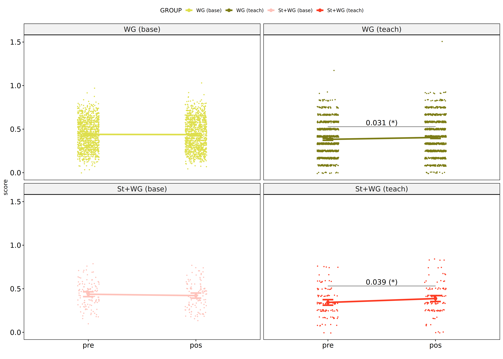<!-- -->

### New Plot using diferences as information

``` r
stat.test <- pwc.long %>% add_xy_position(x = "time", fun = "mean_ci")

stat.test$r <- sapply(abs(stat.test$estimate)/1, FUN = function(x) {
   ifelse(x < 0.0001, "<1%", paste0(round(x*100,2), "%"))
})

gg <- ggline(
  pdat.long[pdat.long$GROUP %in% c("WG (teach)","St+WG (teach)"),], x = "time", y = "score", size = 2,
  facet.by = "GROUP", add = c("mean_ci"), color = "GROUP",
  palette = color[["GROUP"]]) +
  stat_pvalue_manual(
    stat.test, tip.length = 0, hide.ns = T, label.size = 5,
    position = position_dodge(width = 0.3),
    label = "{ r } ({ p.adj.signif })") +
  ggplot2::ylab("")

gg + theme(strip.text = element_text(size = 14),
           axis.text = element_text(size = 14))
```

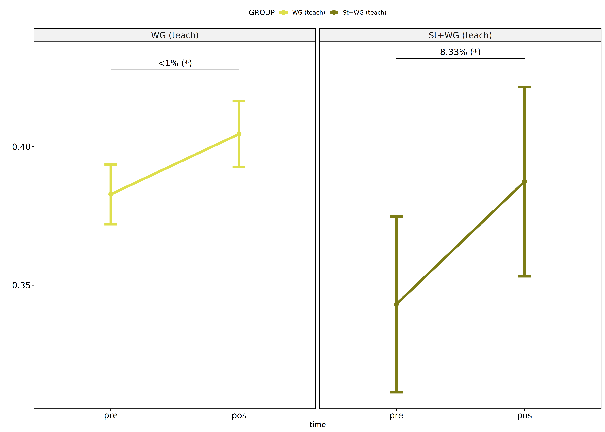<!-- -->

## Kruskal and Wilcoxon PairWise comparisons for: *score ~ GROUP*

``` r
kt <- lapply(lvars, FUN = function(x) {
  kruskal_test(pdat, as.formula(paste0(x," ~ GROUP")))  
})

df <- do.call(rbind.fill, lapply(lvars, function(x) {
  add_significance(merge(
    kt[[x]], kruskal_effsize(pdat, as.formula(paste0(x," ~ GROUP"))),
    by = c(".y.","n"), suffixes = c("",".ez")))
}))

df <- df[,c(".y.","n","df","statistic","p","p.signif","effsize","magnitude")]
```

| .y.            |    n |  df | statistic |        p | p.signif |   effsize | magnitude |
|:---------------|-----:|----:|----------:|---------:|:---------|----------:|:----------|
| vocab.dif      | 2497 |   3 |  20.44171 | 1.37e-04 | \*\*\*   | 0.0069963 | small     |
| vocab.norm.pos | 2497 |   3 |  21.35712 | 8.87e-05 | \*\*\*\* | 0.0073635 | small     |
| vocab.norm.pre | 2497 |   3 |  83.05155 | 0.00e+00 | \*\*\*\* | 0.0321105 | small     |

``` r
pwc <- lapply(lvars, FUN = function(x) {
  pairwise_wilcox_test(pdat, as.formula(paste0(x," ~ GROUP")), detailed = T)  
})

df <- do.call(rbind.fill, pwc)
```

| estimate | .y. | group1 | group2 | n1 | n2 | statistic | p | conf.low | conf.high | method | alternative | p.adj | p.adj.signif |
|---:|:---|:---|:---|---:|---:|---:|---:|---:|---:|:---|:---|---:|:---|
| -0.0262872 | vocab.dif | WG (base) | WG (teach) | 1138 | 1137 | 591621.0 | 4.05e-04 | -0.0307517 | -0.0044135 | Wilcoxon | two.sided | 2.00e-03 | \*\* |
| 0.0000040 | vocab.dif | WG (base) | St+WG (base) | 1138 | 111 | 66075.5 | 4.21e-01 | -0.0263091 | 0.0263614 | Wilcoxon | two.sided | 4.21e-01 | ns |
| -0.0570128 | vocab.dif | WG (base) | St+WG (teach) | 1138 | 111 | 51327.5 | 1.00e-03 | -0.0876989 | -0.0262796 | Wilcoxon | two.sided | 6.00e-03 | \*\* |
| 0.0307568 | vocab.dif | WG (teach) | St+WG (base) | 1137 | 111 | 70157.0 | 5.10e-02 | -0.0000346 | 0.0701860 | Wilcoxon | two.sided | 1.53e-01 | ns |
| -0.0000400 | vocab.dif | WG (teach) | St+WG (teach) | 1137 | 111 | 58262.0 | 1.80e-01 | -0.0832823 | 0.0000087 | Wilcoxon | two.sided | 3.60e-01 | ns |
| -0.0657178 | vocab.dif | St+WG (base) | St+WG (teach) | 111 | 111 | 4871.0 | 7.00e-03 | -0.1096910 | -0.0131796 | Wilcoxon | two.sided | 2.80e-02 | \* |
| 0.0394538 | vocab.norm.pos | WG (base) | WG (teach) | 1138 | 1137 | 713079.0 | 2.38e-05 | 0.0175834 | 0.0526575 | Wilcoxon | two.sided | 1.43e-04 | \*\*\* |
| 0.0262655 | vocab.norm.pos | WG (base) | St+WG (base) | 1138 | 111 | 66224.0 | 3.98e-01 | -0.0263037 | 0.0525849 | Wilcoxon | two.sided | 7.96e-01 | ns |
| 0.0526533 | vocab.norm.pos | WG (base) | St+WG (teach) | 1138 | 111 | 72889.0 | 7.00e-03 | 0.0131151 | 0.0877018 | Wilcoxon | two.sided | 3.60e-02 | \* |
| -0.0263154 | vocab.norm.pos | WG (teach) | St+WG (base) | 1137 | 111 | 58712.0 | 2.23e-01 | -0.0570752 | 0.0174988 | Wilcoxon | two.sided | 6.69e-01 | ns |
| 0.0000509 | vocab.norm.pos | WG (teach) | St+WG (teach) | 1137 | 111 | 65372.5 | 5.28e-01 | -0.0000512 | 0.0833289 | Wilcoxon | two.sided | 7.96e-01 | ns |
| 0.0351308 | vocab.norm.pos | St+WG (base) | St+WG (teach) | 111 | 111 | 6911.0 | 1.16e-01 | -0.0131514 | 0.0833004 | Wilcoxon | two.sided | 4.64e-01 | ns |
| 0.0613743 | vocab.norm.pre | WG (base) | WG (teach) | 1138 | 1137 | 769799.5 | 0.00e+00 | 0.0439009 | 0.0788966 | Wilcoxon | two.sided | 0.00e+00 | \*\*\*\* |
| 0.0000186 | vocab.norm.pre | WG (base) | St+WG (base) | 1138 | 111 | 63688.5 | 8.84e-01 | -0.0263639 | 0.0263292 | Wilcoxon | two.sided | 8.84e-01 | ns |
| 0.1009221 | vocab.norm.pre | WG (base) | St+WG (teach) | 1138 | 111 | 84202.0 | 0.00e+00 | 0.0658567 | 0.1403321 | Wilcoxon | two.sided | 0.00e+00 | \*\*\*\* |
| -0.0569947 | vocab.norm.pre | WG (teach) | St+WG (base) | 1137 | 111 | 50993.0 | 7.68e-04 | -0.0964414 | -0.0306901 | Wilcoxon | two.sided | 2.00e-03 | \*\* |
| 0.0000612 | vocab.norm.pre | WG (teach) | St+WG (teach) | 1137 | 111 | 71246.5 | 2.30e-02 | 0.0000268 | 0.0832764 | Wilcoxon | two.sided | 4.70e-02 | \* |
| 0.1096653 | vocab.norm.pre | St+WG (base) | St+WG (teach) | 111 | 111 | 8336.0 | 5.20e-06 | 0.0570051 | 0.1403553 | Wilcoxon | two.sided | 2.09e-05 | \*\*\*\* |

## Plots to compare pre- and post results

``` r
plots <- lapply(lvars, FUN = function(y) {
  stat.test <- pwc[[y]] %>% add_xy_position(x = "GROUP")
  stat.test$y.position <- stat.test$y.position + y.position.min
  ggboxplot(pdat, x = "GROUP", y = y, fill = "GROUP",
            palette = color[["GROUP"]]) +
    stat_pvalue_manual(stat.test, tip.length = 0, hide.ns = T, label.size = 5,
                       label="{ p.adj } ({ p.adj.signif })") + xlab("")
})
```

``` r
egg::ggarrange(plots[["vocab.norm.pre"]], plots[["vocab.norm.pos"]], nrow = 1)
```

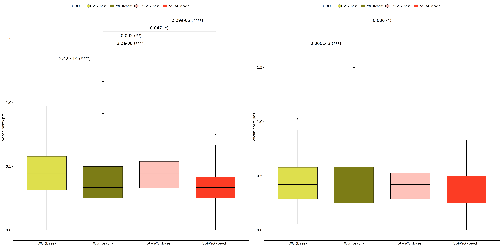<!-- -->

## Plot to compare diferences of pre-post

``` r
plots[["vocab.dif"]] +
  labs(subtitle = get_test_label(kt[["vocab.dif"]], detailed = T),
       caption = get_pwc_label(pwc[["vocab.dif"]])) +
  ylab("score (dif)")  +
  theme(strip.text = element_text(size = 14),
        axis.text = element_text(size = 14))
```

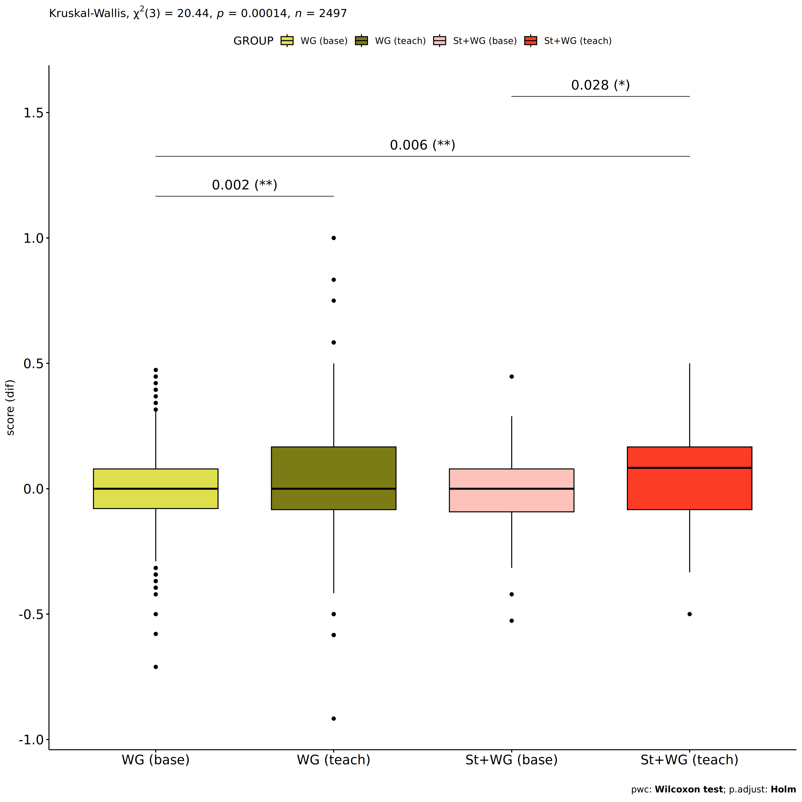<!-- -->

## Plots for learning gain with percentages

``` r
stat.test <- pwc$vocab.dif %>% add_xy_position(x = "GROUP", fun = "mean_ci")

stat.test$r <- sapply(abs(stat.test$estimate), FUN = function(x) {
   ifelse(x < 0.0001, "<1%", paste0(round(x*100,2), "%"))
})

gg <- ggline(
  pdat, x = "GROUP", y = "vocab.dif", size = 2, add = c("mean_ci"),
  color = "GROUP", palette = color[["GROUP"]]) +
  stat_pvalue_manual(
    stat.test, tip.length = 0, hide.ns = T, label.size = 5,
    label = "{ r } ({ p.adj.signif })") +
  ggplot2::ylab("")

gg + theme(strip.text = element_text(size = 14),
           axis.text = element_text(size = 14))
```

    ## `geom_line()`: Each group consists of only one observation.
    ## ℹ Do you need to adjust the group aesthetic?

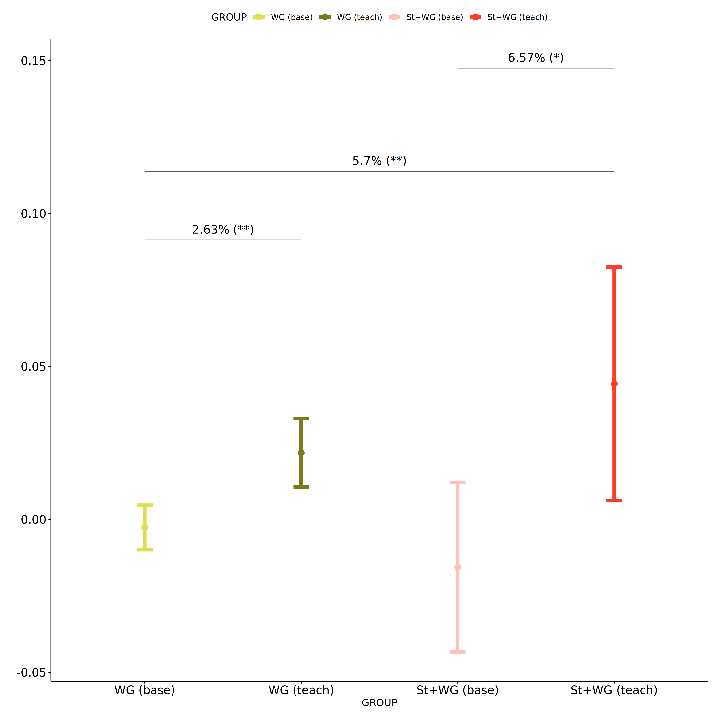<!-- -->

# Two-way factor analysis for: *score ~ GROUP:SEXO*

``` r
pdat = remove_group_data(
  dat[!is.na(dat[["GROUP"]]) & !is.na(dat[["SEXO"]]),],
  "vocab.dif", c("GROUP","SEXO"))

pdat.long <- rbind(pdat[,c("id","GROUP","SEXO")],
                   pdat[,c("id","GROUP","SEXO")])
pdat.long[["time"]] <- c(rep("pre", nrow(pdat)), rep("pos", nrow(pdat)))
pdat.long[["time"]] <- factor(pdat.long[["time"]], c("pre","pos"))
pdat.long[["score"]] <- c(pdat[["vocab.norm.pre"]], pdat[["vocab.norm.pos"]])

y.position.min <- abs(
  max(pdat.long[["score"]])
  - min(pdat.long[["score"]]))/15

lvars = as.list(c("vocab.dif","vocab.norm.pos","vocab.norm.pre"))
names(lvars) = unlist(lvars)
```

## Pre-test and Post-test PairWise comparisons for: *score ~ GROUP:SEXO*

``` r
pwc.long <- group_by(pdat.long, GROUP:SEXO) %>%
  pairwise_wilcox_test(score ~ time, detailed = T)

df <- pwc.long[,c(".y.","GROUP:SEXO","group1","group2","n1","n2","estimate",
                  "statistic","p.adj","p.adj.signif")]
```

| .y. | GROUP:SEXO | group1 | group2 | n1 | n2 | estimate | statistic | p.adj | p.adj.signif |
|:---|:---|:---|:---|---:|---:|---:|---:|---:|:---|
| score | WG (base):F | pre | pos | 586 | 586 | 0.0000416 | 172021.0 | 0.956 | ns |
| score | WG (base):M | pre | pos | 550 | 550 | 0.0000401 | 155975.0 | 0.369 | ns |
| score | WG (teach):F | pre | pos | 586 | 586 | -0.0000379 | 156220.0 | 0.007 | \*\* |
| score | WG (teach):M | pre | pos | 549 | 549 | -0.0000484 | 148341.5 | 0.651 | ns |
| score | St+WG (base):F | pre | pos | 59 | 59 | 0.0000096 | 1779.5 | 0.835 | ns |
| score | St+WG (base):M | pre | pos | 52 | 52 | 0.0263527 | 1530.0 | 0.248 | ns |
| score | St+WG (teach):F | pre | pos | 59 | 59 | -0.0833247 | 1331.0 | 0.026 | \* |
| score | St+WG (teach):M | pre | pos | 52 | 52 | -0.0000646 | 1260.0 | 0.546 | ns |

### Plot to compare pre- and post-test

``` r
pwc.long <- group_by(pdat.long, GROUP, SEXO) %>%
  pairwise_wilcox_test(score ~ time, detailed = T)

stat.test <- pwc.long %>% add_xy_position(x = "time", fun = "mean_ci")
sidx = which(stat.test$p.adj.signif != "ns")
stat.test$y.position[sidx] <- stat.test$y.position[sidx] + y.position.min * (1:length(sidx))

gg <- ggline(
  pdat.long, x = "time", y = "score",
  color = "SEXO", linetype = "SEXO", shape = "SEXO", size = 1.5,
  facet.by = "GROUP", add = c("mean_ci"),
  position = position_dodge(width = 0.3), palette = color[["SEXO"]])

pdat.long$xj = jitter(as.numeric(pdat.long[["time"]]), amount=.1)
pdat.long$yj = jitter(pdat.long[["score"]], amount = .01)

gg + geom_point(
  data = pdat.long, aes_string(x="xj",y="yj",colour="SEXO"), size=0.5) +
  stat_pvalue_manual(
    stat.test, tip.length = 0, hide.ns = T, label.size = 5,
    position = position_dodge(width = 0.3), color = "SEXO",
    label = "{ p.adj } ({ p.adj.signif })") + xlab("") + ylab("") +
  ylim(min(pdat.long$yj), max(pdat.long$yj)) +
  theme(strip.text = element_text(size = 14),
        axis.text = element_text(size = 14))
```

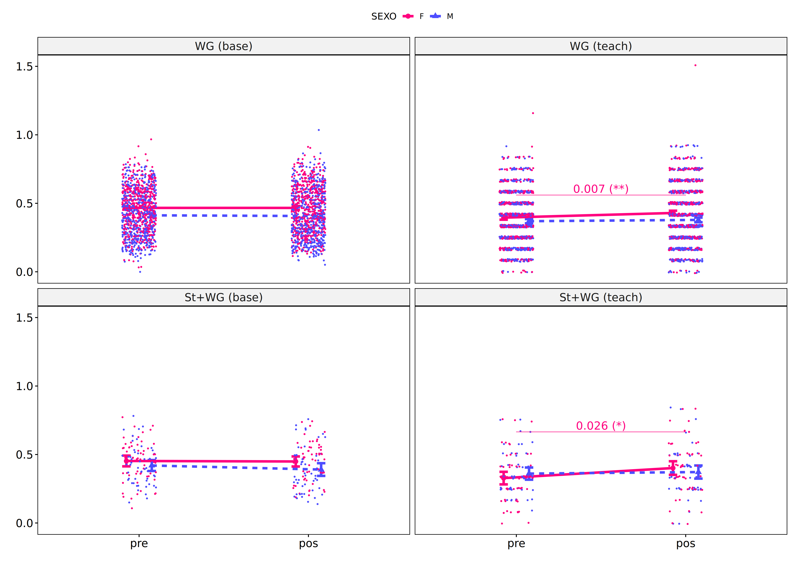<!-- -->

### New plot including percentagens in the differences

``` r
stat.test <- pwc.long %>% add_xy_position(x = "time", fun = "mean_ci")

stat.test$r <- sapply(abs(stat.test$estimate)/1, FUN = function(x) {
   ifelse(x < 0.0001, "<1%", paste0(round(x*100,2), "%"))
})

gg <- ggline(
  pdat.long[pdat.long$GROUP %in% c("WG (teach)","St+WG (teach)"),], x = "time", y = "score",
  color = "SEXO", linetype = "SEXO", shape = "SEXO", size = 2,
  facet.by = "GROUP", add = c("mean_ci"),
  position = position_dodge(width = 0.3), palette = color[["SEXO"]]) +
  stat_pvalue_manual(
    stat.test, tip.length = 0, hide.ns = T, label.size = 5,
    color = "SEXO",
    label = "{ r } ({ p.adj.signif })") + xlab("") + ylab("")

gg + theme(strip.text = element_text(size = 14),
           axis.text = element_text(size = 14))
```

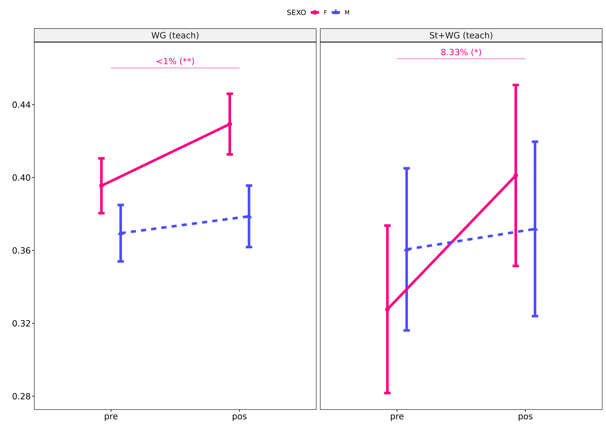<!-- -->

## Scheirer and Wilcoxon PairWise comparisons for: *score ~ GROUP:SEXO*

``` r
sch <- lapply(lvars, FUN = function(x) {
  scheirer.test(pdat, x, c("GROUP","SEXO"), as.table = T) 
})
df <- do.call(rbind.fill, sch)
```

| var            | Effect     |   Df |       Sum Sq |         H |   p.value | p.value.signif |
|:---------------|:-----------|-----:|-------------:|----------:|----------:|:---------------|
| vocab.dif      | GROUP      |    3 |   10633269.3 | 20.577235 | 0.0001289 | \*\*\*         |
| vocab.dif      | SEXO       |    1 |    3109650.0 |  6.017716 | 0.0141630 | \*             |
| vocab.dif      | GROUP:SEXO |    3 |    1075975.4 |  2.082200 | 0.5555221 | ns             |
| vocab.dif      | Residuals  | 2485 | 1272901774.3 |           |           |                |
| vocab.norm.pos | GROUP      |    3 |   11105560.8 | 21.488411 | 0.0000833 | \*\*\*\*       |
| vocab.norm.pos | SEXO       |    1 |   29967921.8 | 57.985638 | 0.0000000 | \*\*\*\*       |
| vocab.norm.pos | GROUP:SEXO |    3 |     619213.6 |  1.198131 | 0.7534526 | ns             |
| vocab.norm.pos | Residuals  | 2485 | 1246304428.8 |           |           |                |
| vocab.norm.pre | GROUP      |    3 |   43301579.2 | 83.829630 | 0.0000000 | \*\*\*\*       |
| vocab.norm.pre | SEXO       |    1 |   16395196.2 | 31.740257 | 0.0000000 | \*\*\*\*       |
| vocab.norm.pre | GROUP:SEXO |    3 |    4283318.6 |  8.292284 | 0.0403419 | \*             |
| vocab.norm.pre | Residuals  | 2485 | 1223354543.2 |           |           |                |

``` r
pwc <- lapply(lvars, FUN = function(x) {
  list(
    GROUP = tryCatch(pairwise_wilcox_test(group_by(pdat, SEXO),
                                 as.formula(paste0(x," ~ GROUP")), detailed = T)
                         , error = function(e) NULL),
    SEXO = tryCatch(pairwise_wilcox_test(group_by(pdat, GROUP),
                                 as.formula(paste0(x," ~ SEXO")), detailed = T)
                         , error = function(e) NULL)
  )
})

df <- do.call(rbind.fill, lapply(pwc, FUN =  function(x) {
  do.call(rbind.fill, x)
}))

ivs = c()
if ("GROUP" %in% colnames(df)) ivs = c(ivs, "GROUP")
if ("SEXO" %in% colnames(df)) ivs = c(ivs, "SEXO")
df <- df[,c(".y.",ivs,"group1","group2","n1","n2","estimate",
            "statistic","p.adj","p.adj.signif")]
```

| .y. | GROUP | SEXO | group1 | group2 | n1 | n2 | estimate | statistic | p.adj | p.adj.signif |
|:---|:---|:---|:---|:---|---:|---:|---:|---:|---:|:---|
| vocab.dif |  | F | WG (base) | WG (teach) | 586 | 586 | -0.0306759 | 152090.0 | 4.00e-03 | \*\* |
| vocab.dif |  | F | WG (base) | St+WG (base) | 586 | 59 | -0.0000052 | 16950.0 | 8.05e-01 | ns |
| vocab.dif |  | F | WG (base) | St+WG (teach) | 586 | 59 | -0.0832921 | 13202.0 | 1.40e-02 | \* |
| vocab.dif |  | F | WG (teach) | St+WG (base) | 586 | 59 | 0.0263358 | 18965.0 | 4.53e-01 | ns |
| vocab.dif |  | F | WG (teach) | St+WG (teach) | 586 | 59 | -0.0832804 | 15334.0 | 4.53e-01 | ns |
| vocab.dif |  | F | St+WG (base) | St+WG (teach) | 59 | 59 | -0.0789394 | 1352.0 | 1.46e-01 | ns |
| vocab.dif |  | M | WG (base) | WG (teach) | 550 | 549 | -0.0175693 | 142381.0 | 5.10e-01 | ns |
| vocab.dif |  | M | WG (base) | St+WG (base) | 550 | 52 | 0.0262793 | 15954.5 | 5.10e-01 | ns |
| vocab.dif |  | M | WG (base) | St+WG (teach) | 550 | 52 | -0.0350438 | 12426.0 | 5.10e-01 | ns |
| vocab.dif |  | M | WG (teach) | St+WG (base) | 549 | 52 | 0.0437921 | 16185.0 | 5.10e-01 | ns |
| vocab.dif |  | M | WG (teach) | St+WG (teach) | 549 | 52 | -0.0000240 | 13697.0 | 6.29e-01 | ns |
| vocab.dif |  | M | St+WG (base) | St+WG (teach) | 52 | 52 | -0.0570780 | 1073.0 | 4.19e-01 | ns |
| vocab.dif | WG (base) |  | F | M | 586 | 550 | 0.0000263 | 166604.5 | 3.23e-01 | ns |
| vocab.dif | WG (teach) |  | F | M | 586 | 549 | 0.0000231 | 172527.5 | 3.40e-02 | \* |
| vocab.dif | St+WG (base) |  | F | M | 59 | 52 | 0.0263185 | 1782.0 | 1.43e-01 | ns |
| vocab.dif | St+WG (teach) |  | F | M | 59 | 52 | 0.0833301 | 1800.0 | 1.16e-01 | ns |
| vocab.norm.pos |  | F | WG (base) | WG (teach) | 586 | 586 | 0.0394828 | 190969.0 | 5.00e-03 | \*\* |
| vocab.norm.pos |  | F | WG (base) | St+WG (base) | 586 | 59 | 0.0262938 | 18383.0 | 1.00e+00 | ns |
| vocab.norm.pos |  | F | WG (base) | St+WG (teach) | 586 | 59 | 0.0657311 | 20854.0 | 4.40e-02 | \* |
| vocab.norm.pos |  | F | WG (teach) | St+WG (base) | 586 | 59 | -0.0262252 | 16149.5 | 1.00e+00 | ns |
| vocab.norm.pos |  | F | WG (teach) | St+WG (teach) | 586 | 59 | 0.0000303 | 18559.5 | 1.00e+00 | ns |
| vocab.norm.pos |  | F | St+WG (base) | St+WG (teach) | 59 | 59 | 0.0526461 | 2032.0 | 4.64e-01 | ns |
| vocab.norm.pos |  | M | WG (base) | WG (teach) | 550 | 549 | 0.0350591 | 164180.0 | 7.20e-02 | ns |
| vocab.norm.pos |  | M | WG (base) | St+WG (base) | 550 | 52 | 0.0000703 | 14922.5 | 1.00e+00 | ns |
| vocab.norm.pos |  | M | WG (base) | St+WG (teach) | 550 | 52 | 0.0307421 | 15568.0 | 1.00e+00 | ns |
| vocab.norm.pos |  | M | WG (teach) | St+WG (base) | 549 | 52 | -0.0175235 | 13433.5 | 1.00e+00 | ns |
| vocab.norm.pos |  | M | WG (teach) | St+WG (teach) | 549 | 52 | -0.0000273 | 14186.0 | 1.00e+00 | ns |
| vocab.norm.pos |  | M | St+WG (base) | St+WG (teach) | 52 | 52 | 0.0088247 | 1415.0 | 1.00e+00 | ns |
| vocab.norm.pos | WG (base) |  | F | M | 586 | 550 | 0.0789176 | 193930.5 | 0.00e+00 | \*\*\*\* |
| vocab.norm.pos | WG (teach) |  | F | M | 586 | 549 | 0.0833091 | 184984.5 | 1.06e-05 | \*\*\*\* |
| vocab.norm.pos | St+WG (base) |  | F | M | 59 | 52 | 0.0668842 | 1910.5 | 2.60e-02 | \* |
| vocab.norm.pos | St+WG (teach) |  | F | M | 59 | 52 | 0.0000611 | 1701.5 | 3.17e-01 | ns |
| vocab.norm.pre |  | F | WG (base) | WG (teach) | 586 | 586 | 0.0789084 | 212645.0 | 0.00e+00 | \*\*\*\* |
| vocab.norm.pre |  | F | WG (base) | St+WG (base) | 586 | 59 | 0.0000372 | 17980.5 | 6.11e-01 | ns |
| vocab.norm.pre |  | F | WG (base) | St+WG (teach) | 586 | 59 | 0.1447837 | 25345.0 | 0.00e+00 | \*\*\*\* |
| vocab.norm.pre |  | F | WG (teach) | St+WG (base) | 586 | 59 | -0.0569788 | 13798.5 | 2.00e-02 | \* |
| vocab.norm.pre |  | F | WG (teach) | St+WG (teach) | 586 | 59 | 0.0832610 | 21085.0 | 1.50e-02 | \* |
| vocab.norm.pre |  | F | St+WG (base) | St+WG (teach) | 59 | 59 | 0.1359744 | 2502.5 | 1.60e-04 | \*\*\* |
| vocab.norm.pre |  | M | WG (base) | WG (teach) | 550 | 549 | 0.0439294 | 172689.0 | 2.15e-04 | \*\*\* |
| vocab.norm.pre |  | M | WG (base) | St+WG (base) | 550 | 52 | -0.0000542 | 13783.0 | 1.00e+00 | ns |
| vocab.norm.pre |  | M | WG (base) | St+WG (teach) | 550 | 52 | 0.0526524 | 16931.5 | 1.14e-01 | ns |
| vocab.norm.pre |  | M | WG (teach) | St+WG (base) | 549 | 52 | -0.0570395 | 11572.5 | 1.14e-01 | ns |
| vocab.norm.pre |  | M | WG (teach) | St+WG (teach) | 549 | 52 | 0.0000013 | 14634.5 | 1.00e+00 | ns |
| vocab.norm.pre |  | M | St+WG (base) | St+WG (teach) | 52 | 52 | 0.0657529 | 1701.5 | 1.14e-01 | ns |
| vocab.norm.pre | WG (base) |  | F | M | 586 | 550 | 0.0526829 | 192192.5 | 0.00e+00 | \*\*\*\* |
| vocab.norm.pre | WG (teach) |  | F | M | 586 | 549 | 0.0000381 | 175210.5 | 9.00e-03 | \*\* |
| vocab.norm.pre | St+WG (base) |  | F | M | 59 | 52 | 0.0526260 | 1787.0 | 1.35e-01 | ns |
| vocab.norm.pre | St+WG (teach) |  | F | M | 59 | 52 | -0.0000872 | 1387.5 | 3.81e-01 | ns |

### Plot to compare results from pre and post

``` r
plots <- lapply(lvars, FUN = function(y) {
  livs = list("GROUP", "SEXO")
  names(livs) = unlist(livs)
  lapply(livs, FUN = function(x) {
    iv2 = setdiff(names(livs), x)
    if (!is.null(pwc[[y]][[iv2]])) {
      stat.test <- pwc[[y]][[iv2]] %>% add_xy_position(x = x, fun = "max")
      sidx = which(stat.test$p.adj.signif != "ns")
      stat.test$y.position[sidx] <- stat.test$y.position[sidx] + y.position.min * (1:length(sidx))
      
      ggboxplot(pdat, x = x, y = y, fill = iv2, palette = color[[iv2]]) +
        stat_pvalue_manual(stat.test, tip.length = 0, hide.ns = T, label.size = 5,
                           label="{ p.adj } ({ p.adj.signif })") + xlab("")
    }
  })
})
```

``` r
if (!is.null(plots[["vocab.norm.pre"]][["GROUP"]]) &&
    !is.null(plots[["vocab.norm.pos"]][["GROUP"]])) {
  egg::ggarrange(plots[["vocab.norm.pre"]][["GROUP"]],
                 plots[["vocab.norm.pos"]][["GROUP"]], nrow = 1)  
}
```

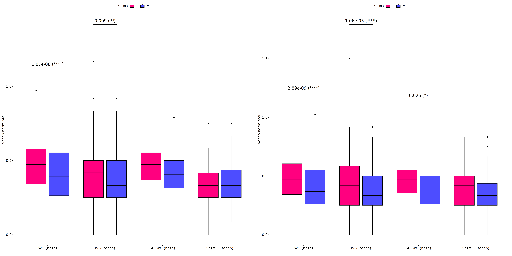<!-- -->

``` r
if (!is.null(plots[["vocab.norm.pre"]][["SEXO"]]) &&
    !is.null(plots[["vocab.norm.pos"]][["SEXO"]])) {
  egg::ggarrange(plots[["vocab.norm.pre"]][["SEXO"]],
                 plots[["vocab.norm.pos"]][["SEXO"]], nrow = 1)
}
```

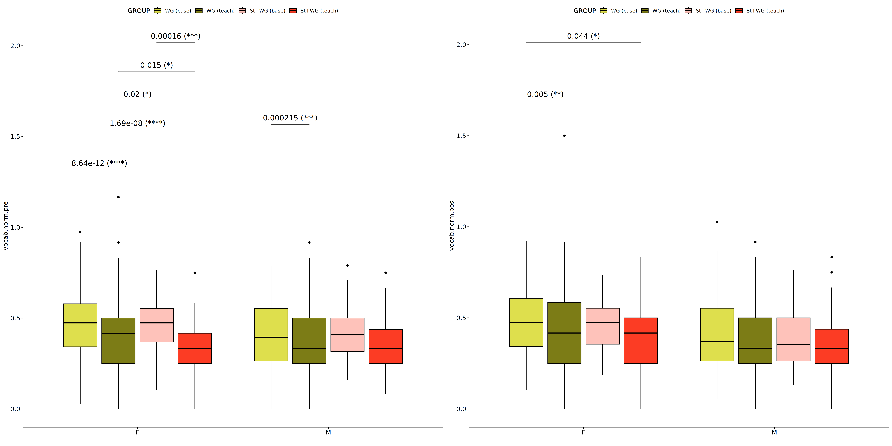<!-- -->

### Plot to compare differences (1st)

``` r
psch = sch[["vocab.dif"]]
idx = which(psch$Effect == "GROUP:SEXO") 

dof = floor(as.double(psch$Df[idx]))
dof.res = floor(as.double(psch$Df[which(psch$Effect == "Residuals")]))
statistic = round(as.double(psch$H[idx]), 3)
p = round(as.double(psch[["p.value"]][idx]), 3)
pval = ifelse(p < 0.001,paste0(" , p<0.001"),paste0(" , p=",p))

if (!is.null(plots[["vocab.dif"]][["GROUP"]]))
  plots[["vocab.dif"]][["GROUP"]] +
    labs(subtitle = paste0("Scheirer-Ray-Hare H(", dof, ",", 
          dof.res, ")=", statistic, pval),
         caption = get_pwc_label(pwc[["vocab.dif"]][["SEXO"]])) +
    ylab("score (dif)") +
  theme(strip.text = element_text(size = 14),
        axis.text = element_text(size = 14))
```

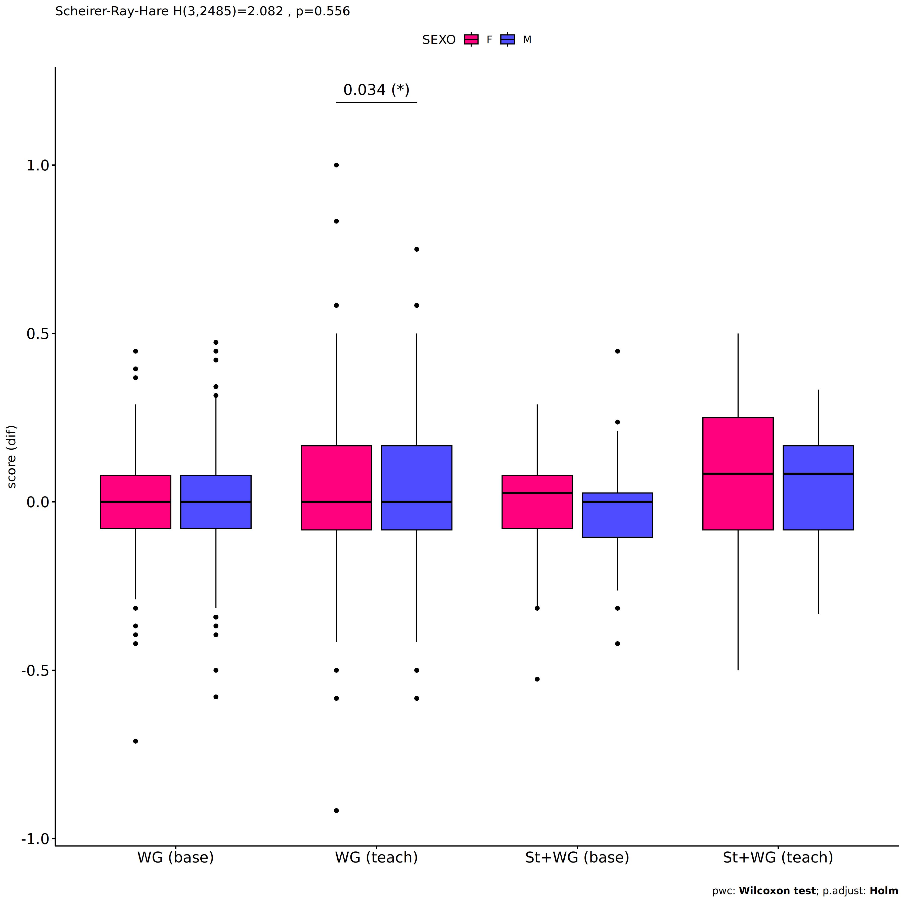<!-- -->

### Plot to compare differences (1st)

``` r
psch = sch[["vocab.dif"]]
idx = which(psch$Effect == "GROUP:SEXO") 

dof = floor(as.double(psch$Df[idx]))
dof.res = floor(as.double(psch$Df[which(psch$Effect == "Residuals")]))
statistic = round(as.double(psch$H[idx]), 3)
p = round(as.double(psch[["p.value"]][idx]), 3)
pval = ifelse(p < 0.001,paste0(" , p<0.001"),paste0(" , p=",p))

if (!is.null(plots[["vocab.dif"]][["SEXO"]]))
  plots[["vocab.dif"]][["SEXO"]] +
    labs(subtitle = paste0("Scheirer-Ray-Hare H(", dof, ",", 
          dof.res, ")=", statistic, pval),
         caption = get_pwc_label(pwc[["vocab.dif"]][["GROUP"]])) +
    ylab("score (dif)") +
  theme(strip.text = element_text(size = 14),
        axis.text = element_text(size = 14))
```

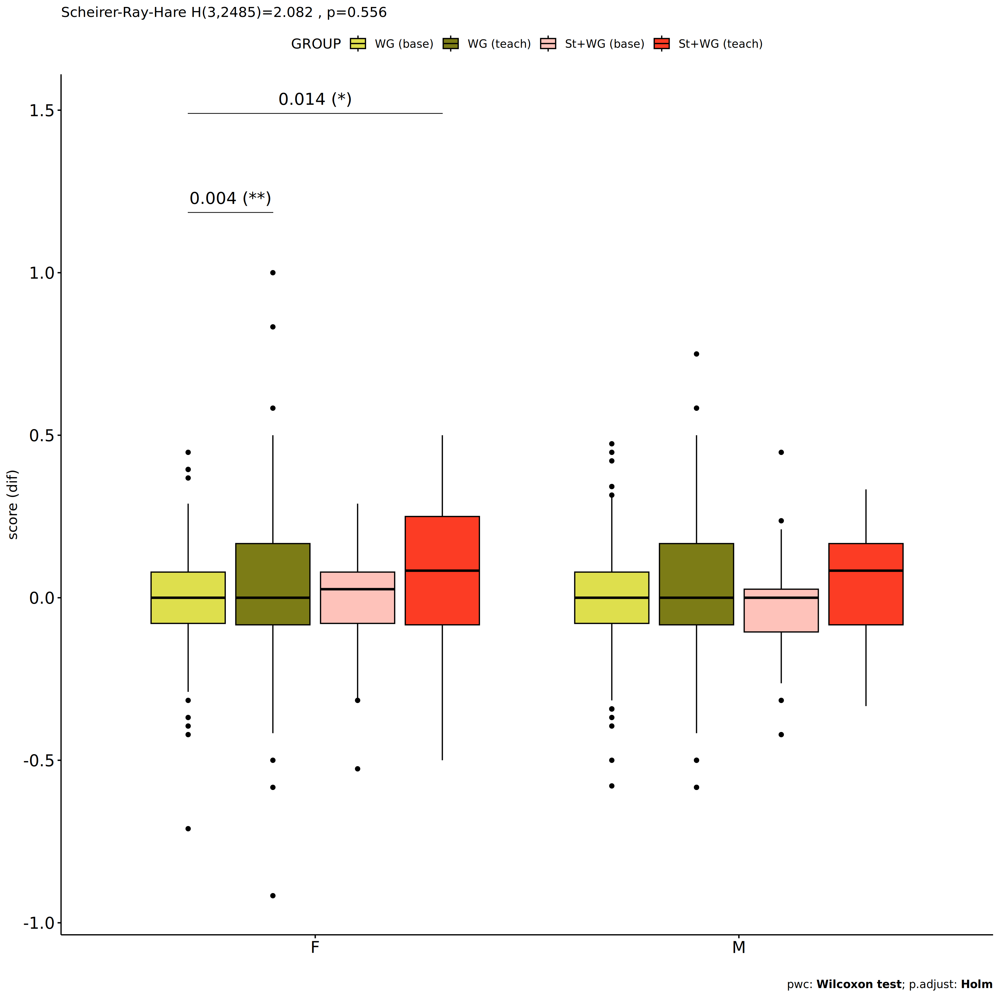<!-- -->

### Plot to compare differences using in one comparison

``` r
psch = sch[["vocab.dif"]]
idx = which(psch$Effect == "GROUP:SEXO") 

dof = floor(as.double(psch$Df[idx]))
dof.res = floor(as.double(psch$Df[which(psch$Effect == "Residuals")]))
statistic = round(as.double(psch$H[idx]), 3)
p = round(as.double(psch[["p.value"]][idx]), 3)
pval = ifelse(p < 0.001,paste0(" , p<0.001"),paste0(" , p=",p))

dodge = 0.08
x.seg = sum(!is.na(unique(pdat[["SEXO"]])))-1
d.seg = -1*dodge*x.seg/2


pwc2 = pwc[["vocab.dif"]][["GROUP"]][pwc[["vocab.dif"]][["GROUP"]]$p.adj.signif != "ns",]

if (nrow(pwc2) > 0) {
  pwc2 = rstatix::add_xy_position(pwc2, dodge = dodge, fun = "mean_ci")
  
  for (f in sort(unique(pdat[["SEXO"]]))) {
    fbool <- pwc2[["SEXO"]] == f
    if (sum(fbool) > 0) {
      pwc2$xmin[which(fbool)] <- pwc2$xmin[which(fbool)]+d.seg
      pwc2$xmax[which(fbool)] <- pwc2$xmax[which(fbool)]+d.seg
    }
    d.seg <- d.seg + dodge
  }
} 


pwc2g <- pwc[["vocab.dif"]][["SEXO"]][pwc[["vocab.dif"]][["SEXO"]]$p.adj.signif != "ns",]

if (nrow(pwc2g) > 0) {
  pwc2g$y.position <- sapply(seq(1,nrow(pwc2g)), FUN = function(i) {
    rw <- as.list(pwc2g[i,])
    resp = -Inf
    for (atr2 in unique(pdat[["SEXO"]])) {
      idx = which(pdat[["GROUP"]] == rw[["GROUP"]] & pdat[["SEXO"]] == atr2)
      rmax = max(mean_ci(pdat[["vocab.dif"]][c(idx)]))
      if (rmax > resp) resp <- rmax
    }
    return(resp)
  })
  pwc2g$xpos <- sapply(seq(1,nrow(pwc2g)), FUN = function(i) {
    rw <- as.list(pwc2g[i,])
    tmp <- add_x_position(pwc[["vocab.dif"]][["GROUP"]])
    min(tmp$xmin[which(tmp$group1 == rw[["GROUP"]])],
        tmp$xmax[which(tmp$group2 == rw[["GROUP"]])])
  })
  pwc2g$xmin <- pwc2g$xpos - abs(dodge*x.seg/2) 
  pwc2g$xmax <- pwc2g$xpos + abs(dodge*x.seg/2)
}

if (nrow(pwc2) > 0) {
  pwc2$r <- sapply(abs(pwc2$estimate)/1, FUN = function(x) {
     ifelse(x < 0.0001, "<1%", paste0(round(x*100,2), "%"))
  })
}

pd <- ggplot2::position_dodge(width = sum(!is.na(unique(pwc2[["SEXO"]])))*dodge)

lp <- ggpubr::ggline(pdat, x="GROUP", y = "vocab.dif", color = "SEXO", linetype = "SEXO",
                       palette = color[["SEXO"]], plot_type='b', size=2,
                       position = pd, add = "mean_ci", ylab = "")

if (nrow(pwc2) > 0)
  lp <- lp + ggpubr::stat_pvalue_manual(pwc2, color = "SEXO", linetype = "SEXO",
                                          hide.ns = T, tip.length = 0,
                                          label = "{ r } ({ p.adj.signif })")

if (nrow(pwc2g) > 0) {
  y.pos.min = max(pwc2g$y.position)/10
  if (nrow(pwc2) > 0)
    y.pos.min = max(pwc2$y.position, pwc2g$y.position)/10
  
  pwc2g$r <- sapply(abs(pwc2g$estimate)/1, FUN = function(x) {
     ifelse(x < 0.0001, "<1%", paste0(round(x*100,2), "%"))
  })
  pwc2g$y.position <- pwc2g$y.position + y.pos.min
  
  for (i in which(pwc2g$p.adj < 0.05)) {
    x1 = pwc2g$xmin[i]
    x2 = pwc2g$xmax[i]
    y.pos = pwc2g$y.position[i]
    label = pwc2g$p.adj.signif[i]
    label = paste0(pwc2g$r[i]," (",label,")")
    
    lp <- lp + ggplot2::geom_segment(x = x1, y = y.pos, xend = x2, yend = y.pos) +
      ggplot2::geom_text(x=(x1+x2)/2, y = y.pos+y.pos.min/3, label=label)
  }
}

lp + labs(subtitle = paste0("Scheirer-Ray-Hare H(", dof, ",", 
                            dof.res, ")=", statistic, pval),
          caption = get_pwc_label(pwc[["vocab.dif"]][["SEXO"]])) +
  xlab("") + ylab("") +
  theme(strip.text = element_text(size = 14),
        axis.text = element_text(size = 14))
```

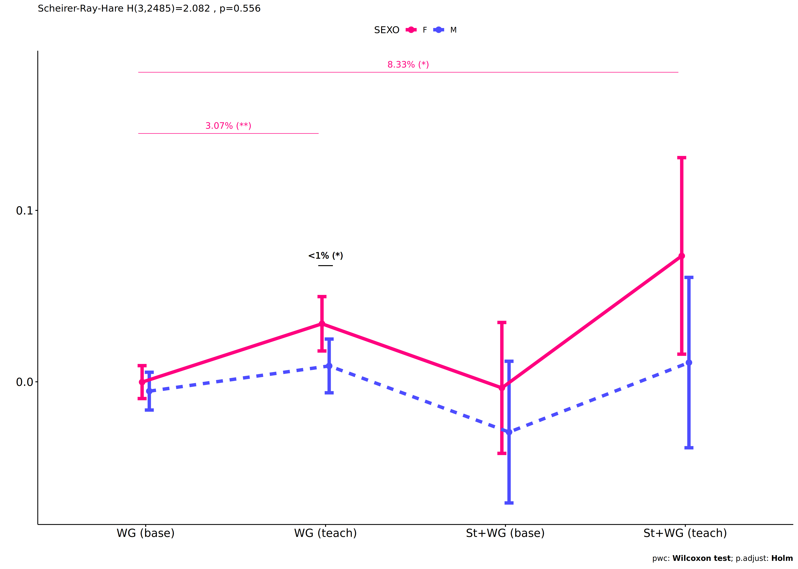<!-- -->

# Two-way factor analysis for: *score ~ GROUP:ZONA*

``` r
pdat = remove_group_data(
  dat[!is.na(dat[["GROUP"]]) & !is.na(dat[["ZONA"]]),],
  "vocab.dif", c("GROUP","ZONA"))

pdat.long <- rbind(pdat[,c("id","GROUP","ZONA")],
                   pdat[,c("id","GROUP","ZONA")])
pdat.long[["time"]] <- c(rep("pre", nrow(pdat)), rep("pos", nrow(pdat)))
pdat.long[["time"]] <- factor(pdat.long[["time"]], c("pre","pos"))
pdat.long[["score"]] <- c(pdat[["vocab.norm.pre"]], pdat[["vocab.norm.pos"]])

y.position.min <- abs(
  max(pdat.long[["score"]])
  - min(pdat.long[["score"]]))/15

lvars = as.list(c("vocab.dif","vocab.norm.pos","vocab.norm.pre"))
names(lvars) = unlist(lvars)
```

## Pre-test and Post-test PairWise comparisons for: *score ~ GROUP:ZONA*

``` r
pwc.long <- group_by(pdat.long, GROUP:ZONA) %>%
  pairwise_wilcox_test(score ~ time, detailed = T)

df <- pwc.long[,c(".y.","GROUP:ZONA","group1","group2","n1","n2","estimate",
                  "statistic","p.adj","p.adj.signif")]
```

| .y. | GROUP:ZONA | group1 | group2 | n1 | n2 | estimate | statistic | p.adj | p.adj.signif |
|:---|:---|:---|:---|---:|---:|---:|---:|---:|:---|
| score | WG (base):Urbana | pre | pos | 731 | 731 | 0.0000099 | 271595.5 | 0.584 | ns |
| score | WG (base):Rural | pre | pos | 380 | 380 | 0.0000345 | 73277.0 | 0.722 | ns |
| score | WG (teach):Urbana | pre | pos | 730 | 730 | -0.0000592 | 252934.0 | 0.091 | ns |
| score | WG (teach):Rural | pre | pos | 380 | 380 | -0.0000444 | 67416.0 | 0.111 | ns |
| score | St+WG (base):Urbana | pre | pos | 66 | 66 | 0.0263692 | 2406.0 | 0.300 | ns |
| score | St+WG (base):Rural | pre | pos | 41 | 41 | -0.0000054 | 837.0 | 0.978 | ns |
| score | St+WG (teach):Urbana | pre | pos | 66 | 66 | 0.0000000 | 2064.0 | 0.600 | ns |
| score | St+WG (teach):Rural | pre | pos | 41 | 41 | -0.0833344 | 526.0 | 0.003 | \*\* |

### Plot to compare pre- and post-test

``` r
pwc.long <- group_by(pdat.long, GROUP, ZONA) %>%
  pairwise_wilcox_test(score ~ time, detailed = T)

stat.test <- pwc.long %>% add_xy_position(x = "time", fun = "mean_ci")
sidx = which(stat.test$p.adj.signif != "ns")
stat.test$y.position[sidx] <- stat.test$y.position[sidx] + y.position.min * (1:length(sidx))

gg <- ggline(
  pdat.long, x = "time", y = "score",
  color = "ZONA", linetype = "ZONA", shape = "ZONA", size = 1.5,
  facet.by = "GROUP", add = c("mean_ci"),
  position = position_dodge(width = 0.3), palette = color[["ZONA"]])

pdat.long$xj = jitter(as.numeric(pdat.long[["time"]]), amount=.1)
pdat.long$yj = jitter(pdat.long[["score"]], amount = .01)

gg + geom_point(
  data = pdat.long, aes_string(x="xj",y="yj",colour="ZONA"), size=0.5) +
  stat_pvalue_manual(
    stat.test, tip.length = 0, hide.ns = T, label.size = 5,
    position = position_dodge(width = 0.3), color = "ZONA",
    label = "{ p.adj } ({ p.adj.signif })") + xlab("") + ylab("") +
  ylim(min(pdat.long$yj), max(pdat.long$yj)) +
  theme(strip.text = element_text(size = 14),
        axis.text = element_text(size = 14))
```

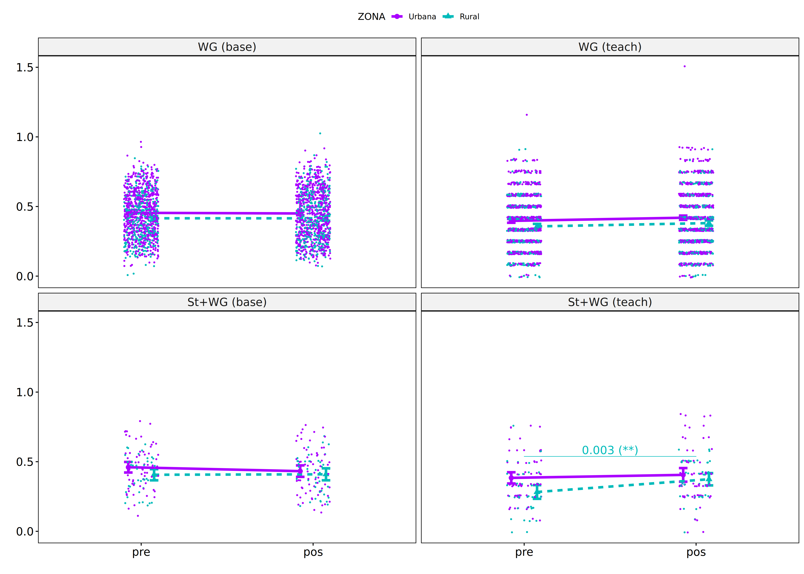<!-- -->

### New plot including percentagens in the differences

``` r
stat.test <- pwc.long %>% add_xy_position(x = "time", fun = "mean_ci")

stat.test$r <- sapply(abs(stat.test$estimate)/1, FUN = function(x) {
   ifelse(x < 0.0001, "<1%", paste0(round(x*100,2), "%"))
})

gg <- ggline(
  pdat.long[pdat.long$GROUP %in% c("WG (teach)","St+WG (teach)"),], x = "time", y = "score",
  color = "ZONA", linetype = "ZONA", shape = "ZONA", size = 2,
  facet.by = "GROUP", add = c("mean_ci"),
  position = position_dodge(width = 0.3), palette = color[["ZONA"]]) +
  stat_pvalue_manual(
    stat.test, tip.length = 0, hide.ns = T, label.size = 5,
    color = "ZONA",
    label = "{ r } ({ p.adj.signif })") + xlab("") + ylab("")

gg + theme(strip.text = element_text(size = 14),
           axis.text = element_text(size = 14))
```

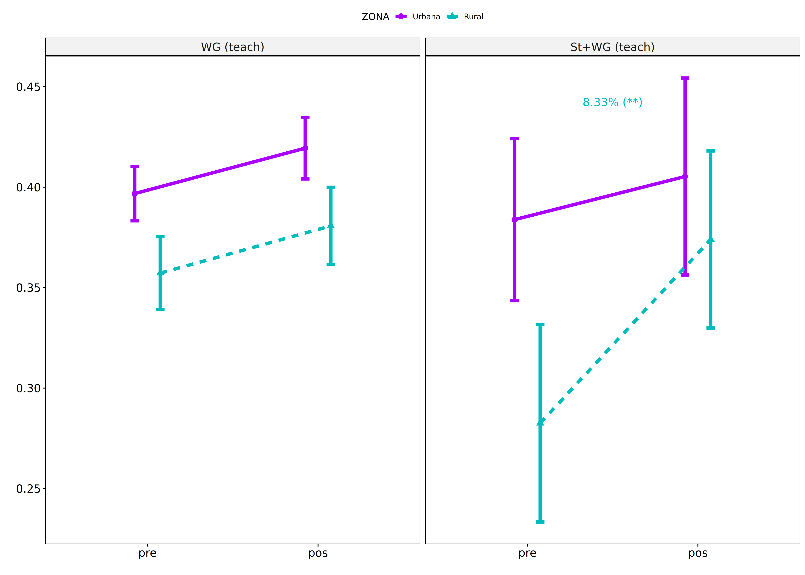<!-- -->

## Scheirer and Wilcoxon PairWise comparisons for: *score ~ GROUP:ZONA*

``` r
sch <- lapply(lvars, FUN = function(x) {
  scheirer.test(pdat, x, c("GROUP","ZONA"), as.table = T) 
})
df <- do.call(rbind.fill, sch)
```

| var | Effect | Df | Sum Sq | H | p.value | p.value.signif |
|:---|:---|---:|---:|---:|---:|:---|
| vocab.dif | GROUP | 3 | 10716687.8 | 21.7371173 | 0.0000740 | \*\*\*\* |
| vocab.dif | ZONA | 1 | 661021.0 | 1.3407772 | 0.2468970 | ns |
| vocab.dif | GROUP:ZONA | 3 | 1679595.6 | 3.4067957 | 0.3330531 | ns |
| vocab.dif | Residuals | 2427 | 1186917894.7 |  |  |  |
| vocab.norm.pos | GROUP | 3 | 9534148.9 | 19.3369441 | 0.0002329 | \*\*\* |
| vocab.norm.pos | ZONA | 1 | 8805868.9 | 17.8598631 | 0.0000238 | \*\*\*\* |
| vocab.norm.pos | GROUP:ZONA | 3 | 157219.9 | 0.3188698 | 0.9564414 | ns |
| vocab.norm.pos | Residuals | 2427 | 1181507058.8 |  |  |  |
| vocab.norm.pre | GROUP | 3 | 40607149.4 | 82.4040303 | 0.0000000 | \*\*\*\* |
| vocab.norm.pre | ZONA | 1 | 15323877.7 | 31.0967231 | 0.0000000 | \*\*\*\* |
| vocab.norm.pre | GROUP:ZONA | 3 | 1359178.3 | 2.7581786 | 0.4304308 | ns |
| vocab.norm.pre | Residuals | 2427 | 1141916481.8 |  |  |  |

``` r
pwc <- lapply(lvars, FUN = function(x) {
  list(
    GROUP = tryCatch(pairwise_wilcox_test(group_by(pdat, ZONA),
                                 as.formula(paste0(x," ~ GROUP")), detailed = T)
                         , error = function(e) NULL),
    ZONA = tryCatch(pairwise_wilcox_test(group_by(pdat, GROUP),
                                 as.formula(paste0(x," ~ ZONA")), detailed = T)
                         , error = function(e) NULL)
  )
})

df <- do.call(rbind.fill, lapply(pwc, FUN =  function(x) {
  do.call(rbind.fill, x)
}))

ivs = c()
if ("GROUP" %in% colnames(df)) ivs = c(ivs, "GROUP")
if ("ZONA" %in% colnames(df)) ivs = c(ivs, "ZONA")
df <- df[,c(".y.",ivs,"group1","group2","n1","n2","estimate",
            "statistic","p.adj","p.adj.signif")]
```

| .y. | GROUP | ZONA | group1 | group2 | n1 | n2 | estimate | statistic | p.adj | p.adj.signif |
|:---|:---|:---|:---|:---|---:|---:|---:|---:|---:|:---|
| vocab.dif |  | Urbana | WG (base) | WG (teach) | 731 | 730 | -0.0262664 | 244274.5 | 3.10e-02 | \* |
| vocab.dif |  | Urbana | WG (base) | St+WG (base) | 731 | 66 | 0.0263009 | 26341.0 | 4.30e-01 | ns |
| vocab.dif |  | Urbana | WG (base) | St+WG (teach) | 731 | 66 | -0.0306940 | 21298.0 | 3.45e-01 | ns |
| vocab.dif |  | Urbana | WG (teach) | St+WG (base) | 730 | 66 | 0.0526009 | 27741.0 | 2.04e-01 | ns |
| vocab.dif |  | Urbana | WG (teach) | St+WG (teach) | 730 | 66 | 0.0000250 | 24152.0 | 9.72e-01 | ns |
| vocab.dif |  | Urbana | St+WG (base) | St+WG (teach) | 66 | 66 | -0.0569834 | 1779.0 | 2.77e-01 | ns |
| vocab.dif |  | Rural | WG (base) | WG (teach) | 380 | 380 | -0.0263121 | 64986.0 | 8.50e-02 | ns |
| vocab.dif |  | Rural | WG (base) | St+WG (base) | 380 | 41 | -0.0000497 | 7687.5 | 1.00e+00 | ns |
| vocab.dif |  | Rural | WG (base) | St+WG (teach) | 380 | 41 | -0.1096971 | 5239.0 | 3.00e-03 | \*\* |
| vocab.dif |  | Rural | WG (teach) | St+WG (base) | 380 | 41 | 0.0219190 | 8257.0 | 1.00e+00 | ns |
| vocab.dif |  | Rural | WG (teach) | St+WG (teach) | 380 | 41 | -0.0833180 | 6130.5 | 8.50e-02 | ns |
| vocab.dif |  | Rural | St+WG (base) | St+WG (teach) | 41 | 41 | -0.1140036 | 589.5 | 8.50e-02 | ns |
| vocab.dif | WG (base) |  | Urbana | Rural | 731 | 380 | -0.0000188 | 135660.5 | 5.24e-01 | ns |
| vocab.dif | WG (teach) |  | Urbana | Rural | 730 | 380 | -0.0000499 | 137320.0 | 7.85e-01 | ns |
| vocab.dif | St+WG (base) |  | Urbana | Rural | 66 | 41 | -0.0263269 | 1181.5 | 2.73e-01 | ns |
| vocab.dif | St+WG (teach) |  | Urbana | Rural | 66 | 41 | -0.0833311 | 1042.0 | 4.60e-02 | \* |
| vocab.norm.pos |  | Urbana | WG (base) | WG (teach) | 731 | 730 | 0.0351402 | 293228.0 | 6.00e-03 | \*\* |
| vocab.norm.pos |  | Urbana | WG (base) | St+WG (base) | 731 | 66 | 0.0262938 | 25551.5 | 1.00e+00 | ns |
| vocab.norm.pos |  | Urbana | WG (base) | St+WG (teach) | 731 | 66 | 0.0526362 | 27766.0 | 2.09e-01 | ns |
| vocab.norm.pos |  | Urbana | WG (teach) | St+WG (base) | 730 | 66 | -0.0132086 | 22796.0 | 1.00e+00 | ns |
| vocab.norm.pos |  | Urbana | WG (teach) | St+WG (teach) | 730 | 66 | 0.0000092 | 25057.0 | 1.00e+00 | ns |
| vocab.norm.pos |  | Urbana | St+WG (base) | St+WG (teach) | 66 | 66 | 0.0350779 | 2411.5 | 1.00e+00 | ns |
| vocab.norm.pos |  | Rural | WG (base) | WG (teach) | 380 | 380 | 0.0351302 | 79409.0 | 1.03e-01 | ns |
| vocab.norm.pos |  | Rural | WG (base) | St+WG (base) | 380 | 41 | 0.0000145 | 7800.5 | 1.00e+00 | ns |
| vocab.norm.pos |  | Rural | WG (base) | St+WG (teach) | 380 | 41 | 0.0306964 | 8593.5 | 1.00e+00 | ns |
| vocab.norm.pos |  | Rural | WG (teach) | St+WG (base) | 380 | 41 | -0.0350938 | 6883.0 | 1.00e+00 | ns |
| vocab.norm.pos |  | Rural | WG (teach) | St+WG (teach) | 380 | 41 | -0.0000442 | 7679.0 | 1.00e+00 | ns |
| vocab.norm.pos |  | Rural | St+WG (base) | St+WG (teach) | 41 | 41 | 0.0306971 | 935.5 | 1.00e+00 | ns |
| vocab.norm.pos | WG (base) |  | Urbana | Rural | 731 | 380 | 0.0263563 | 155414.0 | 1.00e-03 | \*\* |
| vocab.norm.pos | WG (teach) |  | Urbana | Rural | 730 | 380 | 0.0000414 | 152124.5 | 8.00e-03 | \*\* |
| vocab.norm.pos | St+WG (base) |  | Urbana | Rural | 66 | 41 | 0.0262489 | 1450.0 | 5.36e-01 | ns |
| vocab.norm.pos | St+WG (teach) |  | Urbana | Rural | 66 | 41 | 0.0000431 | 1390.5 | 8.10e-01 | ns |
| vocab.norm.pre |  | Urbana | WG (base) | WG (teach) | 731 | 730 | 0.0614894 | 318338.0 | 0.00e+00 | \*\*\*\* |
| vocab.norm.pre |  | Urbana | WG (base) | St+WG (base) | 731 | 66 | -0.0000316 | 23730.5 | 1.00e+00 | ns |
| vocab.norm.pre |  | Urbana | WG (base) | St+WG (teach) | 731 | 66 | 0.0832927 | 30381.5 | 2.00e-03 | \*\* |
| vocab.norm.pre |  | Urbana | WG (teach) | St+WG (base) | 730 | 66 | -0.0614455 | 18868.0 | 1.20e-02 | \* |
| vocab.norm.pre |  | Urbana | WG (teach) | St+WG (teach) | 730 | 66 | 0.0000640 | 25276.5 | 1.00e+00 | ns |
| vocab.norm.pre |  | Urbana | St+WG (base) | St+WG (teach) | 66 | 66 | 0.0876844 | 2830.0 | 1.20e-02 | \* |
| vocab.norm.pre |  | Rural | WG (base) | WG (teach) | 380 | 380 | 0.0614985 | 86207.5 | 1.77e-05 | \*\*\*\* |
| vocab.norm.pre |  | Rural | WG (base) | St+WG (base) | 380 | 41 | 0.0000366 | 7919.0 | 8.62e-01 | ns |
| vocab.norm.pre |  | Rural | WG (base) | St+WG (teach) | 380 | 41 | 0.1402820 | 11371.5 | 7.70e-06 | \*\*\*\* |
| vocab.norm.pre |  | Rural | WG (teach) | St+WG (base) | 380 | 41 | -0.0438931 | 6353.0 | 1.01e-01 | ns |
| vocab.norm.pre |  | Rural | WG (teach) | St+WG (teach) | 380 | 41 | 0.0833204 | 9687.0 | 2.90e-02 | \* |
| vocab.norm.pre |  | Rural | St+WG (base) | St+WG (teach) | 41 | 41 | 0.1228060 | 1239.0 | 8.52e-04 | \*\*\* |
| vocab.norm.pre | WG (base) |  | Urbana | Rural | 731 | 380 | 0.0526314 | 157739.0 | 2.00e-04 | \*\*\* |
| vocab.norm.pre | WG (teach) |  | Urbana | Rural | 730 | 380 | 0.0000338 | 155043.5 | 1.00e-03 | \*\* |
| vocab.norm.pre | St+WG (base) |  | Urbana | Rural | 66 | 41 | 0.0526164 | 1615.5 | 9.20e-02 | ns |
| vocab.norm.pre | St+WG (teach) |  | Urbana | Rural | 66 | 41 | 0.0834139 | 1825.5 | 2.00e-03 | \*\* |

### Plot to compare results from pre and post

``` r
plots <- lapply(lvars, FUN = function(y) {
  livs = list("GROUP", "ZONA")
  names(livs) = unlist(livs)
  lapply(livs, FUN = function(x) {
    iv2 = setdiff(names(livs), x)
    if (!is.null(pwc[[y]][[iv2]])) {
      stat.test <- pwc[[y]][[iv2]] %>% add_xy_position(x = x, fun = "max")
      sidx = which(stat.test$p.adj.signif != "ns")
      stat.test$y.position[sidx] <- stat.test$y.position[sidx] + y.position.min * (1:length(sidx))
      
      ggboxplot(pdat, x = x, y = y, fill = iv2, palette = color[[iv2]]) +
        stat_pvalue_manual(stat.test, tip.length = 0, hide.ns = T, label.size = 5,
                           label="{ p.adj } ({ p.adj.signif })") + xlab("")
    }
  })
})
```

``` r
if (!is.null(plots[["vocab.norm.pre"]][["GROUP"]]) &&
    !is.null(plots[["vocab.norm.pos"]][["GROUP"]])) {
  egg::ggarrange(plots[["vocab.norm.pre"]][["GROUP"]],
                 plots[["vocab.norm.pos"]][["GROUP"]], nrow = 1)  
}
```

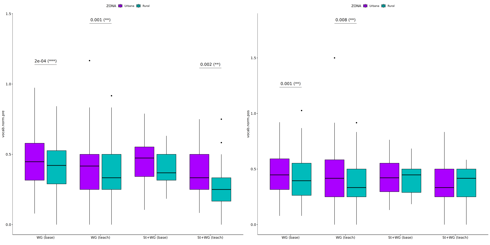<!-- -->

``` r
if (!is.null(plots[["vocab.norm.pre"]][["ZONA"]]) &&
    !is.null(plots[["vocab.norm.pos"]][["ZONA"]])) {
  egg::ggarrange(plots[["vocab.norm.pre"]][["ZONA"]],
                 plots[["vocab.norm.pos"]][["ZONA"]], nrow = 1)
}
```

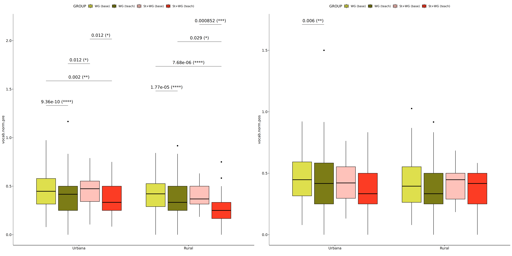<!-- -->

### Plot to compare differences (1st)

``` r
psch = sch[["vocab.dif"]]
idx = which(psch$Effect == "GROUP:ZONA") 

dof = floor(as.double(psch$Df[idx]))
dof.res = floor(as.double(psch$Df[which(psch$Effect == "Residuals")]))
statistic = round(as.double(psch$H[idx]), 3)
p = round(as.double(psch[["p.value"]][idx]), 3)
pval = ifelse(p < 0.001,paste0(" , p<0.001"),paste0(" , p=",p))

if (!is.null(plots[["vocab.dif"]][["GROUP"]]))
  plots[["vocab.dif"]][["GROUP"]] +
    labs(subtitle = paste0("Scheirer-Ray-Hare H(", dof, ",", 
          dof.res, ")=", statistic, pval),
         caption = get_pwc_label(pwc[["vocab.dif"]][["ZONA"]])) +
    ylab("score (dif)") +
  theme(strip.text = element_text(size = 14),
        axis.text = element_text(size = 14))
```

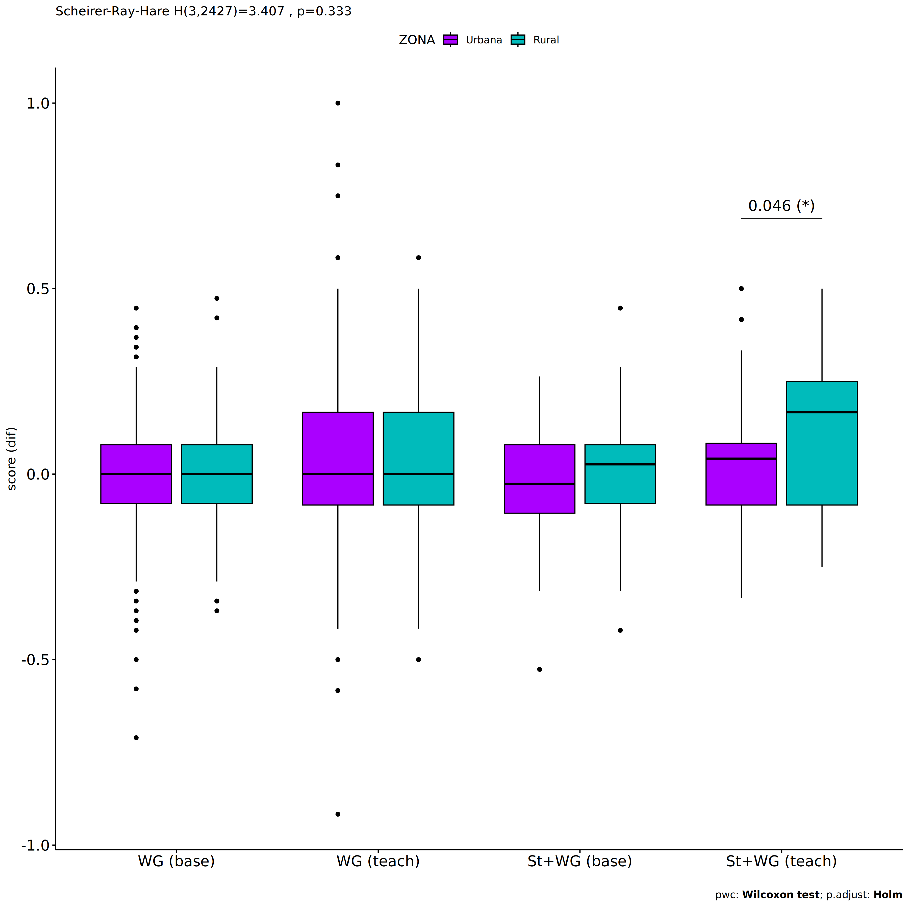<!-- -->

### Plot to compare differences (1st)

``` r
psch = sch[["vocab.dif"]]
idx = which(psch$Effect == "GROUP:ZONA") 

dof = floor(as.double(psch$Df[idx]))
dof.res = floor(as.double(psch$Df[which(psch$Effect == "Residuals")]))
statistic = round(as.double(psch$H[idx]), 3)
p = round(as.double(psch[["p.value"]][idx]), 3)
pval = ifelse(p < 0.001,paste0(" , p<0.001"),paste0(" , p=",p))

if (!is.null(plots[["vocab.dif"]][["ZONA"]]))
  plots[["vocab.dif"]][["ZONA"]] +
    labs(subtitle = paste0("Scheirer-Ray-Hare H(", dof, ",", 
          dof.res, ")=", statistic, pval),
         caption = get_pwc_label(pwc[["vocab.dif"]][["GROUP"]])) +
    ylab("score (dif)") +
  theme(strip.text = element_text(size = 14),
        axis.text = element_text(size = 14))
```

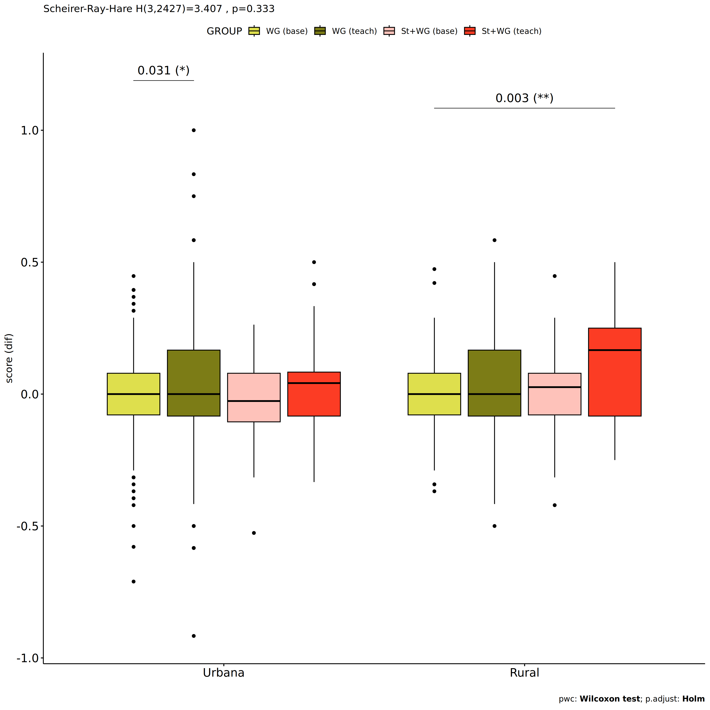<!-- -->

### Plot to compare differences using in one comparison

``` r
psch = sch[["vocab.dif"]]
idx = which(psch$Effect == "GROUP:ZONA") 

dof = floor(as.double(psch$Df[idx]))
dof.res = floor(as.double(psch$Df[which(psch$Effect == "Residuals")]))
statistic = round(as.double(psch$H[idx]), 3)
p = round(as.double(psch[["p.value"]][idx]), 3)
pval = ifelse(p < 0.001,paste0(" , p<0.001"),paste0(" , p=",p))

dodge = 0.08
x.seg = sum(!is.na(unique(pdat[["ZONA"]])))-1
d.seg = -1*dodge*x.seg/2


pwc2 = pwc[["vocab.dif"]][["GROUP"]][pwc[["vocab.dif"]][["GROUP"]]$p.adj.signif != "ns",]

if (nrow(pwc2) > 0) {
  pwc2 = rstatix::add_xy_position(pwc2, dodge = dodge, fun = "mean_ci")
  
  for (f in sort(unique(pdat[["ZONA"]]))) {
    fbool <- pwc2[["ZONA"]] == f
    if (sum(fbool) > 0) {
      pwc2$xmin[which(fbool)] <- pwc2$xmin[which(fbool)]+d.seg
      pwc2$xmax[which(fbool)] <- pwc2$xmax[which(fbool)]+d.seg
    }
    d.seg <- d.seg + dodge
  }
} 


pwc2g <- pwc[["vocab.dif"]][["ZONA"]][pwc[["vocab.dif"]][["ZONA"]]$p.adj.signif != "ns",]

if (nrow(pwc2g) > 0) {
  pwc2g$y.position <- sapply(seq(1,nrow(pwc2g)), FUN = function(i) {
    rw <- as.list(pwc2g[i,])
    resp = -Inf
    for (atr2 in unique(pdat[["ZONA"]])) {
      idx = which(pdat[["GROUP"]] == rw[["GROUP"]] & pdat[["ZONA"]] == atr2)
      rmax = max(mean_ci(pdat[["vocab.dif"]][c(idx)]))
      if (rmax > resp) resp <- rmax
    }
    return(resp)
  })
  pwc2g$xpos <- sapply(seq(1,nrow(pwc2g)), FUN = function(i) {
    rw <- as.list(pwc2g[i,])
    tmp <- add_x_position(pwc[["vocab.dif"]][["GROUP"]])
    min(tmp$xmin[which(tmp$group1 == rw[["GROUP"]])],
        tmp$xmax[which(tmp$group2 == rw[["GROUP"]])])
  })
  pwc2g$xmin <- pwc2g$xpos - abs(dodge*x.seg/2) 
  pwc2g$xmax <- pwc2g$xpos + abs(dodge*x.seg/2)
}

if (nrow(pwc2) > 0) {
  pwc2$r <- sapply(abs(pwc2$estimate)/1, FUN = function(x) {
     ifelse(x < 0.0001, "<1%", paste0(round(x*100,2), "%"))
  })
}

pd <- ggplot2::position_dodge(width = sum(!is.na(unique(pwc2[["ZONA"]])))*dodge)

lp <- ggpubr::ggline(pdat, x="GROUP", y = "vocab.dif", color = "ZONA", linetype = "ZONA",
                       palette = color[["ZONA"]], plot_type='b', size=2,
                       position = pd, add = "mean_ci", ylab = "")

if (nrow(pwc2) > 0)
  lp <- lp + ggpubr::stat_pvalue_manual(pwc2, color = "ZONA", linetype = "ZONA",
                                          hide.ns = T, tip.length = 0,
                                          label = "{ r } ({ p.adj.signif })")

if (nrow(pwc2g) > 0) {
  y.pos.min = max(pwc2g$y.position)/10
  if (nrow(pwc2) > 0)
    y.pos.min = max(pwc2$y.position, pwc2g$y.position)/10
  
  pwc2g$r <- sapply(abs(pwc2g$estimate)/1, FUN = function(x) {
     ifelse(x < 0.0001, "<1%", paste0(round(x*100,2), "%"))
  })
  pwc2g$y.position <- pwc2g$y.position + y.pos.min
  
  for (i in which(pwc2g$p.adj < 0.05)) {
    x1 = pwc2g$xmin[i]
    x2 = pwc2g$xmax[i]
    y.pos = pwc2g$y.position[i]
    label = pwc2g$p.adj.signif[i]
    label = paste0(pwc2g$r[i]," (",label,")")
    
    lp <- lp + ggplot2::geom_segment(x = x1, y = y.pos, xend = x2, yend = y.pos) +
      ggplot2::geom_text(x=(x1+x2)/2, y = y.pos+y.pos.min/3, label=label)
  }
}

lp + labs(subtitle = paste0("Scheirer-Ray-Hare H(", dof, ",", 
                            dof.res, ")=", statistic, pval),
          caption = get_pwc_label(pwc[["vocab.dif"]][["ZONA"]])) +
  xlab("") + ylab("") +
  theme(strip.text = element_text(size = 14),
        axis.text = element_text(size = 14))
```

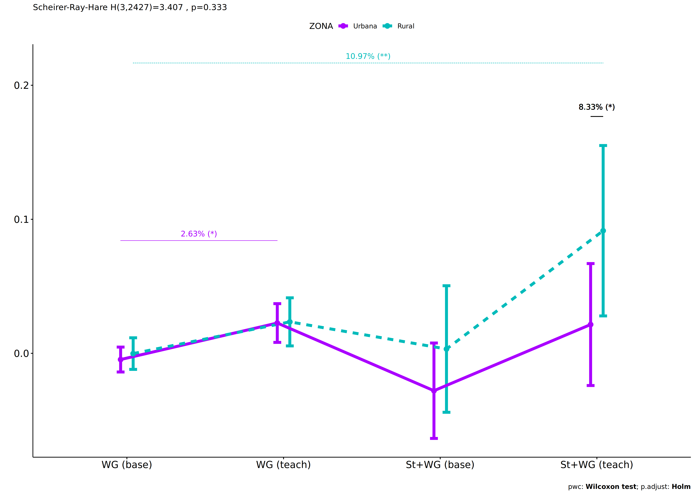<!-- -->

# Two-way factor analysis for: *score ~ GROUP:COR.RACA*

``` r
pdat = remove_group_data(
  dat[!is.na(dat[["GROUP"]]) & !is.na(dat[["COR.RACA"]]),],
  "vocab.dif", c("GROUP","COR.RACA"))
```

    ## Warning: There were 2 warnings in `mutate()`.
    ## The first warning was:
    ## ℹ In argument: `ci = abs(stats::qt(alpha/2, .data$n - 1) * .data$se)`.
    ## Caused by warning:
    ## ! There was 1 warning in `mutate()`.
    ## ℹ In argument: `ci = abs(stats::qt(alpha/2, .data$n - 1) * .data$se)`.
    ## Caused by warning in `stats::qt()`:
    ## ! NaNs produced
    ## ℹ Run `dplyr::last_dplyr_warnings()` to see the 1 remaining warning.

``` r
pdat <- pdat[which(pdat[["COR.RACA"]] != "Preta"),]

pdat.long <- rbind(pdat[,c("id","GROUP","COR.RACA")],
                   pdat[,c("id","GROUP","COR.RACA")])
pdat.long[["time"]] <- c(rep("pre", nrow(pdat)), rep("pos", nrow(pdat)))
pdat.long[["time"]] <- factor(pdat.long[["time"]], c("pre","pos"))
pdat.long[["score"]] <- c(pdat[["vocab.norm.pre"]], pdat[["vocab.norm.pos"]])

y.position.min <- abs(
  max(pdat.long[["score"]])
  - min(pdat.long[["score"]]))/15

lvars = as.list(c("vocab.dif","vocab.norm.pos","vocab.norm.pre"))
names(lvars) = unlist(lvars)
```

## Pre-test and Post-test PairWise comparisons for: *score ~ GROUP:COR.RACA*

``` r
pwc.long <- group_by(pdat.long, GROUP:COR.RACA) %>%
  pairwise_wilcox_test(score ~ time, detailed = T)

df <- pwc.long[,c(".y.","GROUP:COR.RACA","group1","group2","n1","n2","estimate",
                  "statistic","p.adj","p.adj.signif")]
```

| .y. | GROUP:COR.RACA | group1 | group2 | n1 | n2 | estimate | statistic | p.adj | p.adj.signif |
|:---|:---|:---|:---|---:|---:|---:|---:|---:|:---|
| score | WG (base):Parda | pre | pos | 967 | 967 | 0.0000289 | 476424.0 | 0.469 | ns |
| score | WG (base):Branca | pre | pos | 124 | 124 | -0.0000728 | 7535.0 | 0.787 | ns |
| score | WG (base):Indígena | pre | pos | 26 | 26 | -0.0000454 | 329.5 | 0.883 | ns |
| score | WG (teach):Parda | pre | pos | 966 | 966 | -0.0000284 | 445763.5 | 0.087 | ns |
| score | WG (teach):Branca | pre | pos | 124 | 124 | -0.0832542 | 6780.5 | 0.105 | ns |
| score | WG (teach):Indígena | pre | pos | 26 | 26 | -0.0000341 | 303.0 | 0.524 | ns |
| score | St+WG (base):Parda | pre | pos | 91 | 91 | 0.0262762 | 4395.5 | 0.473 | ns |
| score | St+WG (base):Branca | pre | pos | 17 | 17 | 0.0000117 | 146.0 | 0.972 | ns |
| score | St+WG (teach):Parda | pre | pos | 91 | 91 | -0.0833191 | 3532.5 | 0.083 | ns |
| score | St+WG (teach):Branca | pre | pos | 17 | 17 | -0.0833405 | 99.5 | 0.120 | ns |

### Plot to compare pre- and post-test

``` r
pwc.long <- group_by(pdat.long, GROUP, COR.RACA) %>%
  pairwise_wilcox_test(score ~ time, detailed = T)

stat.test <- pwc.long %>% add_xy_position(x = "time", fun = "mean_ci")
sidx = which(stat.test$p.adj.signif != "ns")
stat.test$y.position[sidx] <- stat.test$y.position[sidx] + y.position.min * (1:length(sidx))

gg <- ggline(
  pdat.long, x = "time", y = "score",
  color = "COR.RACA", linetype = "COR.RACA", shape = "COR.RACA", size = 1.5,
  facet.by = "GROUP", add = c("mean_ci"),
  position = position_dodge(width = 0.3), palette = color[["COR.RACA"]])

pdat.long$xj = jitter(as.numeric(pdat.long[["time"]]), amount=.1)
pdat.long$yj = jitter(pdat.long[["score"]], amount = .01)

gg + geom_point(
  data = pdat.long, aes_string(x="xj",y="yj",colour="COR.RACA"), size=0.5) +
  stat_pvalue_manual(
    stat.test, tip.length = 0, hide.ns = T, label.size = 5,
    position = position_dodge(width = 0.3), color = "COR.RACA",
    label = "{ p.adj } ({ p.adj.signif })") + xlab("") + ylab("") +
  ylim(min(pdat.long$yj), max(pdat.long$yj)) +
  theme(strip.text = element_text(size = 14),
        axis.text = element_text(size = 14))
```

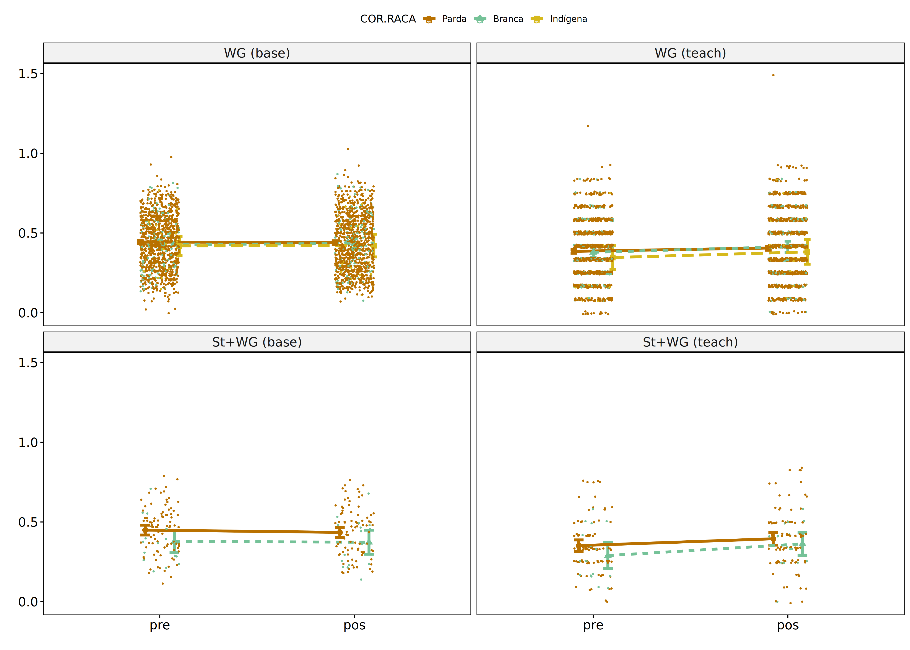<!-- -->

### New plot including percentagens in the differences

``` r
stat.test <- pwc.long %>% add_xy_position(x = "time", fun = "mean_ci")

stat.test$r <- sapply(abs(stat.test$estimate)/1, FUN = function(x) {
   ifelse(x < 0.0001, "<1%", paste0(round(x*100,2), "%"))
})

gg <- ggline(
  pdat.long[pdat.long$GROUP %in% c("WG (teach)","St+WG (teach)"),], x = "time", y = "score",
  color = "COR.RACA", linetype = "COR.RACA", shape = "COR.RACA", size = 2,
  facet.by = "GROUP", add = c("mean_ci"),
  position = position_dodge(width = 0.3), palette = color[["COR.RACA"]]) +
  stat_pvalue_manual(
    stat.test, tip.length = 0, hide.ns = T, label.size = 5,
    color = "COR.RACA",
    label = "{ r } ({ p.adj.signif })") + xlab("") + ylab("")

gg + theme(strip.text = element_text(size = 14),
           axis.text = element_text(size = 14))
```

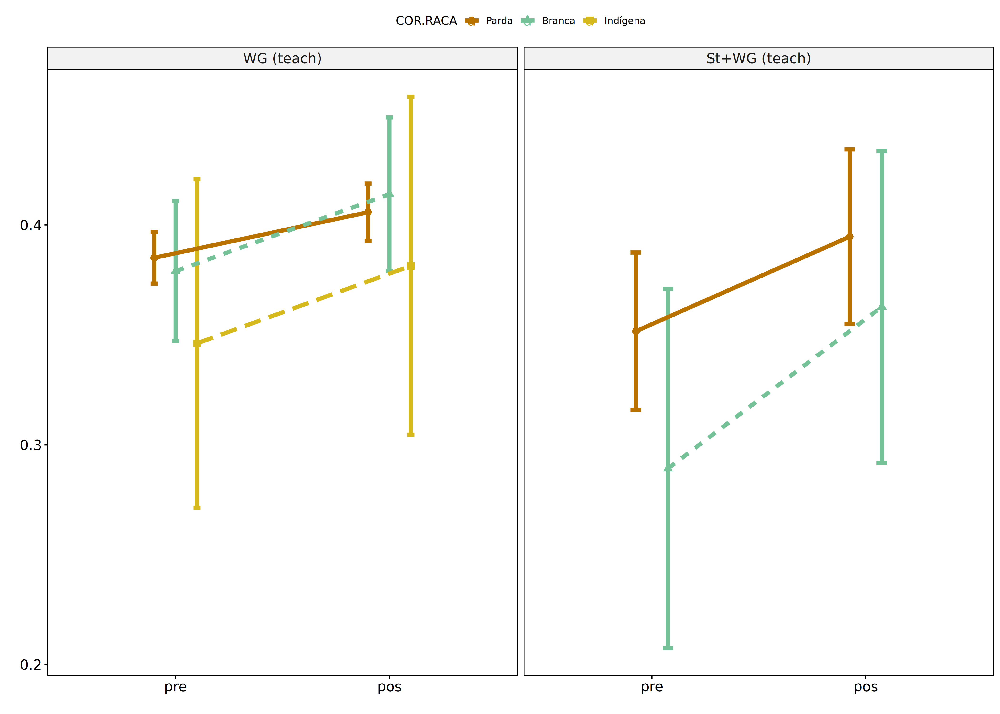<!-- -->

## Scheirer and Wilcoxon PairWise comparisons for: *score ~ GROUP:COR.RACA*

``` r
sch <- lapply(lvars, FUN = function(x) {
  scheirer.test(pdat, x, c("GROUP","COR.RACA"), as.table = T) 
})
df <- do.call(rbind.fill, sch)
```

| var | Effect | Df | Sum Sq | H | p.value | p.value.signif |
|:---|:---|---:|---:|---:|---:|:---|
| vocab.dif | GROUP | 3 | 10719747.4 | 21.4955362 | 0.0000831 | \*\*\*\* |
| vocab.dif | COR.RACA | 2 | 1145535.9 | 2.2970605 | 0.3171025 | ns |
| vocab.dif | GROUP:COR.RACA | 4 | 287692.2 | 0.5768883 | 0.9655970 | ns |
| vocab.dif | Residuals | 2439 | 1208618516.2 |  |  |  |
| vocab.norm.pos | GROUP | 3 | 10093315.4 | 20.2371277 | 0.0001516 | \*\*\* |
| vocab.norm.pos | COR.RACA | 2 | 412005.0 | 0.8260713 | 0.6616387 | ns |
| vocab.norm.pos | GROUP:COR.RACA | 4 | 1439083.7 | 2.8853671 | 0.5771885 | ns |
| vocab.norm.pos | Residuals | 2439 | 1209033078.5 |  |  |  |
| vocab.norm.pre | GROUP | 3 | 41191800.2 | 82.6344037 | 0.0000000 | \*\*\*\* |
| vocab.norm.pre | COR.RACA | 2 | 2541319.9 | 5.0981131 | 0.0781554 | ns |
| vocab.norm.pre | GROUP:COR.RACA | 4 | 1482503.8 | 2.9740341 | 0.5621801 | ns |
| vocab.norm.pre | Residuals | 2439 | 1175037250.1 |  |  |  |

``` r
pwc <- lapply(lvars, FUN = function(x) {
  list(
    GROUP = tryCatch(pairwise_wilcox_test(group_by(pdat, COR.RACA),
                                 as.formula(paste0(x," ~ GROUP")), detailed = T)
                         , error = function(e) NULL),
    COR.RACA = tryCatch(pairwise_wilcox_test(group_by(pdat, GROUP),
                                 as.formula(paste0(x," ~ COR.RACA")), detailed = T)
                         , error = function(e) NULL)
  )
})

df <- do.call(rbind.fill, lapply(pwc, FUN =  function(x) {
  do.call(rbind.fill, x)
}))

ivs = c()
if ("GROUP" %in% colnames(df)) ivs = c(ivs, "GROUP")
if ("COR.RACA" %in% colnames(df)) ivs = c(ivs, "COR.RACA")
df <- df[,c(".y.",ivs,"group1","group2","n1","n2","estimate",
            "statistic","p.adj","p.adj.signif")]
```

| .y. | GROUP | COR.RACA | group1 | group2 | n1 | n2 | estimate | statistic | p.adj | p.adj.signif |
|:---|:---|:---|:---|:---|---:|---:|---:|---:|---:|:---|
| vocab.dif |  | Parda | WG (base) | WG (teach) | 967 | 966 | -0.0262393 | 428931.0 | 1.10e-02 | \* |
| vocab.dif |  | Parda | WG (base) | St+WG (base) | 967 | 91 | 0.0000768 | 45002.0 | 7.19e-01 | ns |
| vocab.dif |  | Parda | WG (base) | St+WG (teach) | 967 | 91 | -0.0569916 | 35941.5 | 1.90e-02 | \* |
| vocab.dif |  | Parda | WG (teach) | St+WG (base) | 966 | 91 | 0.0263069 | 48183.5 | 3.84e-01 | ns |
| vocab.dif |  | Parda | WG (teach) | St+WG (teach) | 966 | 91 | -0.0000444 | 40671.5 | 4.74e-01 | ns |
| vocab.dif |  | Parda | St+WG (base) | St+WG (teach) | 91 | 91 | -0.0570555 | 3328.0 | 8.80e-02 | ns |
| vocab.dif |  | Branca | WG (base) | WG (teach) | 124 | 124 | -0.0262770 | 6728.0 | 4.44e-01 | ns |
| vocab.dif |  | Branca | WG (base) | St+WG (base) | 124 | 17 | 0.0262516 | 1168.5 | 7.74e-01 | ns |
| vocab.dif |  | Branca | WG (base) | St+WG (teach) | 124 | 17 | -0.1008298 | 693.0 | 1.34e-01 | ns |
| vocab.dif |  | Branca | WG (teach) | St+WG (base) | 124 | 17 | 0.0526383 | 1226.0 | 7.74e-01 | ns |
| vocab.dif |  | Branca | WG (teach) | St+WG (teach) | 124 | 17 | -0.0832798 | 875.5 | 7.74e-01 | ns |
| vocab.dif |  | Branca | St+WG (base) | St+WG (teach) | 17 | 17 | -0.1183878 | 102.0 | 5.92e-01 | ns |
| vocab.dif |  | Indígena | WG (base) | WG (teach) | 26 | 26 | -0.0306924 | 297.0 | 4.57e-01 | ns |
| vocab.dif | WG (base) |  | Parda | Branca | 967 | 124 | -0.0000272 | 56086.0 | 7.23e-01 | ns |
| vocab.dif | WG (base) |  | Parda | Indígena | 967 | 26 | -0.0000414 | 12418.0 | 1.00e+00 | ns |
| vocab.dif | WG (base) |  | Branca | Indígena | 124 | 26 | 0.0000542 | 1687.5 | 1.00e+00 | ns |
| vocab.dif | WG (teach) |  | Parda | Branca | 966 | 124 | -0.0000111 | 57078.0 | 1.00e+00 | ns |
| vocab.dif | WG (teach) |  | Parda | Indígena | 966 | 26 | -0.0000445 | 11783.5 | 1.00e+00 | ns |
| vocab.dif | WG (teach) |  | Branca | Indígena | 124 | 26 | 0.0000282 | 1587.0 | 1.00e+00 | ns |
| vocab.dif | St+WG (base) |  | Parda | Branca | 91 | 17 | 0.0000282 | 786.5 | 9.16e-01 | ns |
| vocab.dif | St+WG (teach) |  | Parda | Branca | 91 | 17 | -0.0833193 | 702.5 | 5.51e-01 | ns |
| vocab.norm.pos |  | Parda | WG (base) | WG (teach) | 967 | 966 | 0.0394663 | 517238.5 | 2.54e-04 | \*\*\* |
| vocab.norm.pos |  | Parda | WG (base) | St+WG (base) | 967 | 91 | 0.0000279 | 44516.0 | 1.00e+00 | ns |
| vocab.norm.pos |  | Parda | WG (base) | St+WG (teach) | 967 | 91 | 0.0482846 | 50146.5 | 1.36e-01 | ns |
| vocab.norm.pos |  | Parda | WG (teach) | St+WG (base) | 966 | 91 | -0.0351169 | 39127.5 | 3.25e-01 | ns |
| vocab.norm.pos |  | Parda | WG (teach) | St+WG (teach) | 966 | 91 | 0.0000526 | 44774.5 | 1.00e+00 | ns |
| vocab.norm.pos |  | Parda | St+WG (base) | St+WG (teach) | 91 | 91 | 0.0438872 | 4735.5 | 3.25e-01 | ns |
| vocab.norm.pos |  | Branca | WG (base) | WG (teach) | 124 | 124 | 0.0175426 | 8000.0 | 1.00e+00 | ns |
| vocab.norm.pos |  | Branca | WG (base) | St+WG (base) | 124 | 17 | 0.0526756 | 1267.5 | 1.00e+00 | ns |
| vocab.norm.pos |  | Branca | WG (base) | St+WG (teach) | 124 | 17 | 0.0571151 | 1264.0 | 1.00e+00 | ns |
| vocab.norm.pos |  | Branca | WG (teach) | St+WG (base) | 124 | 17 | 0.0438604 | 1214.5 | 1.00e+00 | ns |
| vocab.norm.pos |  | Branca | WG (teach) | St+WG (teach) | 124 | 17 | 0.0832926 | 1226.5 | 1.00e+00 | ns |
| vocab.norm.pos |  | Branca | St+WG (base) | St+WG (teach) | 17 | 17 | -0.0000342 | 143.5 | 1.00e+00 | ns |
| vocab.norm.pos |  | Indígena | WG (base) | WG (teach) | 26 | 26 | 0.0482693 | 381.0 | 4.36e-01 | ns |
| vocab.norm.pos | WG (base) |  | Parda | Branca | 967 | 124 | 0.0000172 | 61323.5 | 1.00e+00 | ns |
| vocab.norm.pos | WG (base) |  | Parda | Indígena | 967 | 26 | 0.0263062 | 13267.0 | 1.00e+00 | ns |
| vocab.norm.pos | WG (base) |  | Branca | Indígena | 124 | 26 | 0.0000403 | 1647.0 | 1.00e+00 | ns |
| vocab.norm.pos | WG (teach) |  | Parda | Branca | 966 | 124 | -0.0000078 | 57280.0 | 9.75e-01 | ns |
| vocab.norm.pos | WG (teach) |  | Parda | Indígena | 966 | 26 | 0.0000277 | 13465.5 | 9.75e-01 | ns |
| vocab.norm.pos | WG (teach) |  | Branca | Indígena | 124 | 26 | 0.0832821 | 1809.0 | 9.75e-01 | ns |
| vocab.norm.pos | St+WG (base) |  | Parda | Branca | 91 | 17 | 0.0526889 | 954.0 | 1.28e-01 | ns |
| vocab.norm.pos | St+WG (teach) |  | Parda | Branca | 91 | 17 | 0.0000277 | 819.5 | 6.97e-01 | ns |
| vocab.norm.pre |  | Parda | WG (base) | WG (teach) | 967 | 966 | 0.0614188 | 557730.5 | 0.00e+00 | \*\*\*\* |
| vocab.norm.pre |  | Parda | WG (base) | St+WG (base) | 967 | 91 | -0.0000150 | 42995.0 | 7.19e-01 | ns |
| vocab.norm.pre |  | Parda | WG (base) | St+WG (teach) | 967 | 91 | 0.0965178 | 58067.5 | 2.20e-06 | \*\*\*\* |
| vocab.norm.pre |  | Parda | WG (teach) | St+WG (base) | 966 | 91 | -0.0614711 | 34062.0 | 1.00e-03 | \*\* |
| vocab.norm.pre |  | Parda | WG (teach) | St+WG (teach) | 966 | 91 | 0.0000385 | 48969.5 | 1.38e-01 | ns |
| vocab.norm.pre |  | Parda | St+WG (base) | St+WG (teach) | 91 | 91 | 0.1140651 | 5668.5 | 6.56e-05 | \*\*\*\* |
| vocab.norm.pre |  | Branca | WG (base) | WG (teach) | 124 | 124 | 0.0526757 | 8868.0 | 1.82e-01 | ns |
| vocab.norm.pre |  | Branca | WG (base) | St+WG (base) | 124 | 17 | 0.0525901 | 1235.5 | 5.02e-01 | ns |
| vocab.norm.pre |  | Branca | WG (base) | St+WG (teach) | 124 | 17 | 0.1403345 | 1522.5 | 1.80e-02 | \* |
| vocab.norm.pre |  | Branca | WG (teach) | St+WG (base) | 124 | 17 | -0.0132206 | 1041.0 | 9.37e-01 | ns |
| vocab.norm.pre |  | Branca | WG (teach) | St+WG (teach) | 124 | 17 | 0.0834047 | 1362.0 | 1.97e-01 | ns |
| vocab.norm.pre |  | Branca | St+WG (base) | St+WG (teach) | 17 | 17 | 0.1008878 | 196.0 | 2.34e-01 | ns |
| vocab.norm.pre |  | Indígena | WG (base) | WG (teach) | 26 | 26 | 0.0833127 | 427.0 | 1.04e-01 | ns |
| vocab.norm.pre | WG (base) |  | Parda | Branca | 967 | 124 | 0.0262862 | 63835.0 | 7.20e-01 | ns |
| vocab.norm.pre | WG (base) |  | Parda | Indígena | 967 | 26 | 0.0263158 | 13699.0 | 8.68e-01 | ns |
| vocab.norm.pre | WG (base) |  | Branca | Indígena | 124 | 26 | 0.0000145 | 1653.0 | 8.68e-01 | ns |
| vocab.norm.pre | WG (teach) |  | Parda | Branca | 966 | 124 | 0.0000572 | 61372.0 | 7.80e-01 | ns |
| vocab.norm.pre | WG (teach) |  | Parda | Indígena | 966 | 26 | 0.0832671 | 14199.5 | 7.53e-01 | ns |
| vocab.norm.pre | WG (teach) |  | Branca | Indígena | 124 | 26 | 0.0000105 | 1784.0 | 7.80e-01 | ns |
| vocab.norm.pre | St+WG (base) |  | Parda | Branca | 91 | 17 | 0.0789633 | 999.5 | 5.70e-02 | ns |
| vocab.norm.pre | St+WG (teach) |  | Parda | Branca | 91 | 17 | 0.0832880 | 948.5 | 1.35e-01 | ns |

### Plot to compare results from pre and post

``` r
plots <- lapply(lvars, FUN = function(y) {
  livs = list("GROUP", "COR.RACA")
  names(livs) = unlist(livs)
  lapply(livs, FUN = function(x) {
    iv2 = setdiff(names(livs), x)
    if (!is.null(pwc[[y]][[iv2]])) {
      stat.test <- pwc[[y]][[iv2]] %>% add_xy_position(x = x, fun = "max")
      sidx = which(stat.test$p.adj.signif != "ns")
      stat.test$y.position[sidx] <- stat.test$y.position[sidx] + y.position.min * (1:length(sidx))
      
      ggboxplot(pdat, x = x, y = y, fill = iv2, palette = color[[iv2]]) +
        stat_pvalue_manual(stat.test, tip.length = 0, hide.ns = T, label.size = 5,
                           label="{ p.adj } ({ p.adj.signif })") + xlab("")
    }
  })
})
```

``` r
if (!is.null(plots[["vocab.norm.pre"]][["GROUP"]]) &&
    !is.null(plots[["vocab.norm.pos"]][["GROUP"]])) {
  egg::ggarrange(plots[["vocab.norm.pre"]][["GROUP"]],
                 plots[["vocab.norm.pos"]][["GROUP"]], nrow = 1)  
}
```

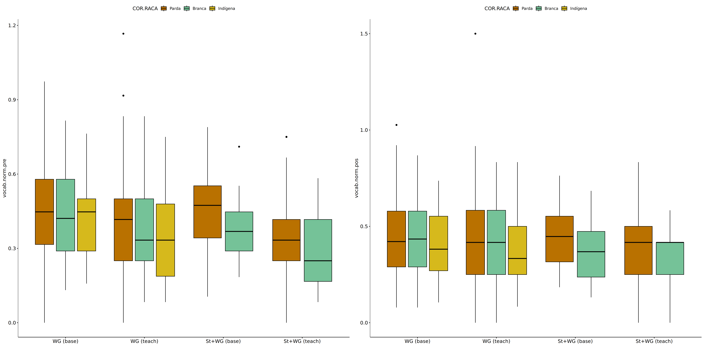<!-- -->

``` r
if (!is.null(plots[["vocab.norm.pre"]][["COR.RACA"]]) &&
    !is.null(plots[["vocab.norm.pos"]][["COR.RACA"]])) {
  egg::ggarrange(plots[["vocab.norm.pre"]][["COR.RACA"]],
                 plots[["vocab.norm.pos"]][["COR.RACA"]], nrow = 1)
}
```

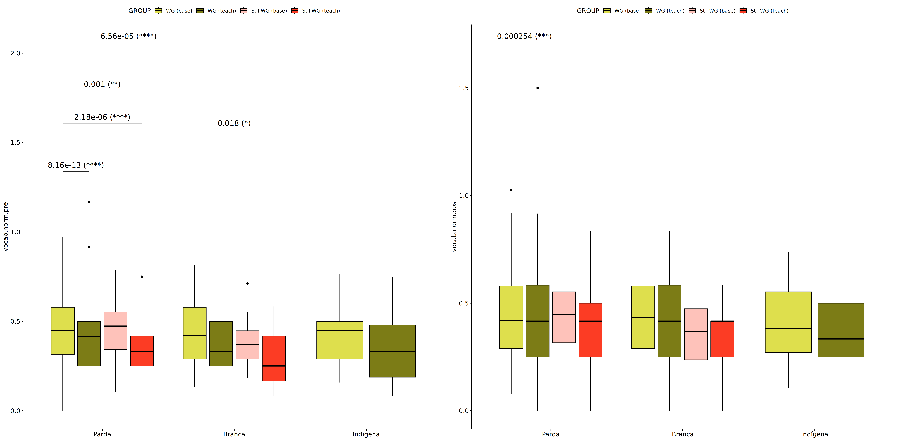<!-- -->

### Plot to compare differences (1st)

``` r
psch = sch[["vocab.dif"]]
idx = which(psch$Effect == "GROUP:COR.RACA") 

dof = floor(as.double(psch$Df[idx]))
dof.res = floor(as.double(psch$Df[which(psch$Effect == "Residuals")]))
statistic = round(as.double(psch$H[idx]), 3)
p = round(as.double(psch[["p.value"]][idx]), 3)
pval = ifelse(p < 0.001,paste0(" , p<0.001"),paste0(" , p=",p))

if (!is.null(plots[["vocab.dif"]][["GROUP"]]))
  plots[["vocab.dif"]][["GROUP"]] +
    labs(subtitle = paste0("Scheirer-Ray-Hare H(", dof, ",", 
          dof.res, ")=", statistic, pval),
         caption = get_pwc_label(pwc[["vocab.dif"]][["COR.RACA"]])) +
    ylab("score (dif)") +
  theme(strip.text = element_text(size = 14),
        axis.text = element_text(size = 14))
```

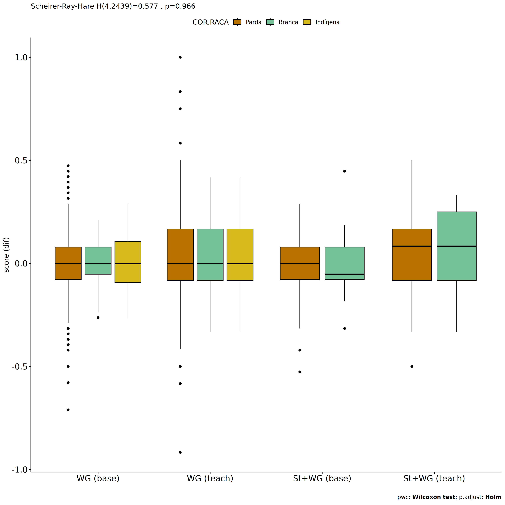<!-- -->

### Plot to compare differences (1st)

``` r
psch = sch[["vocab.dif"]]
idx = which(psch$Effect == "GROUP:COR.RACA") 

dof = floor(as.double(psch$Df[idx]))
dof.res = floor(as.double(psch$Df[which(psch$Effect == "Residuals")]))
statistic = round(as.double(psch$H[idx]), 3)
p = round(as.double(psch[["p.value"]][idx]), 3)
pval = ifelse(p < 0.001,paste0(" , p<0.001"),paste0(" , p=",p))

if (!is.null(plots[["vocab.dif"]][["COR.RACA"]]))
  plots[["vocab.dif"]][["COR.RACA"]] +
    labs(subtitle = paste0("Scheirer-Ray-Hare H(", dof, ",", 
          dof.res, ")=", statistic, pval),
         caption = get_pwc_label(pwc[["vocab.dif"]][["GROUP"]])) +
    ylab("score (dif)") +
  theme(strip.text = element_text(size = 14),
        axis.text = element_text(size = 14))
```

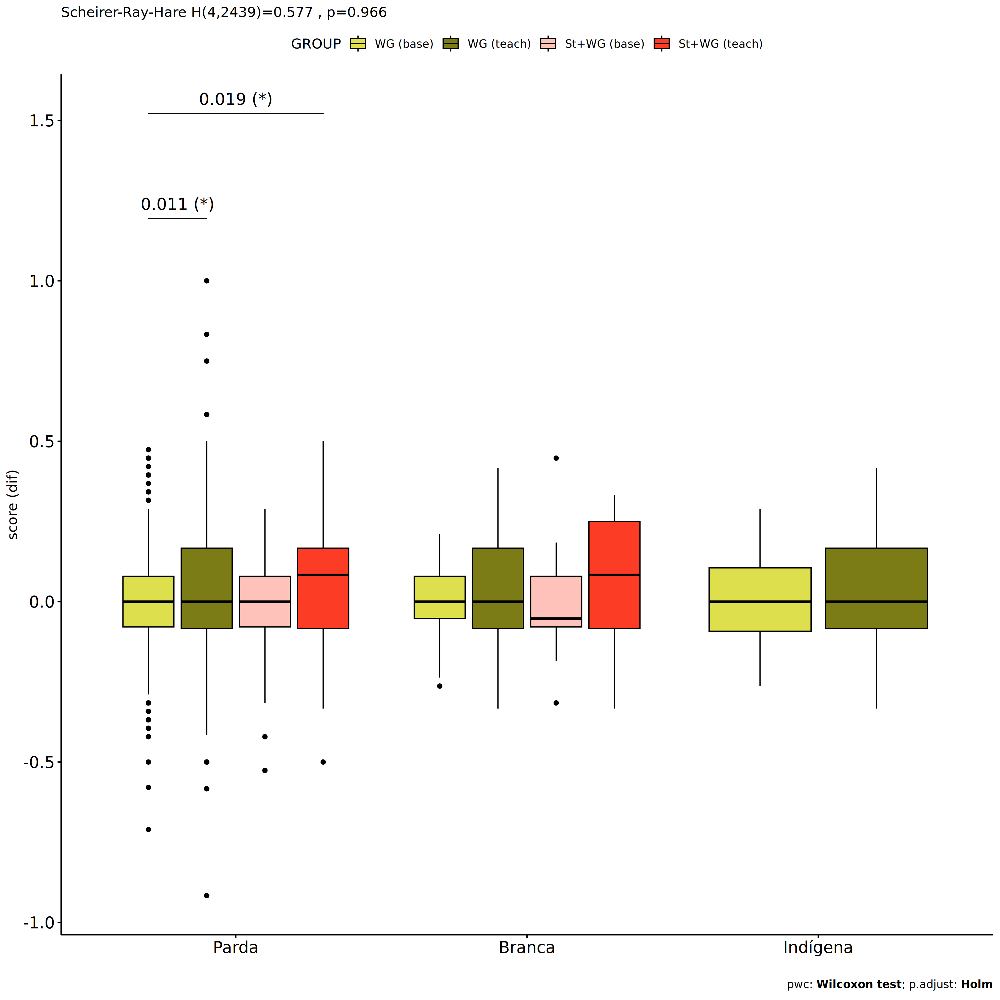<!-- -->

### Plot to compare differences using in one comparison

``` r
psch = sch[["vocab.dif"]]
idx = which(psch$Effect == "GROUP:COR.RACA") 

dof = floor(as.double(psch$Df[idx]))
dof.res = floor(as.double(psch$Df[which(psch$Effect == "Residuals")]))
statistic = round(as.double(psch$H[idx]), 3)
p = round(as.double(psch[["p.value"]][idx]), 3)
pval = ifelse(p < 0.001,paste0(" , p<0.001"),paste0(" , p=",p))

dodge = 0.08
x.seg = sum(!is.na(unique(pdat[["COR.RACA"]])))-1
d.seg = -1*dodge*x.seg/2


pwc2 = pwc[["vocab.dif"]][["GROUP"]][pwc[["vocab.dif"]][["GROUP"]]$p.adj.signif != "ns",]

if (nrow(pwc2) > 0) {
  pwc2 = rstatix::add_xy_position(pwc2, dodge = dodge, fun = "mean_ci")
  
  for (f in sort(unique(pdat[["COR.RACA"]]))) {
    fbool <- pwc2[["COR.RACA"]] == f
    if (sum(fbool) > 0) {
      pwc2$xmin[which(fbool)] <- pwc2$xmin[which(fbool)]+d.seg
      pwc2$xmax[which(fbool)] <- pwc2$xmax[which(fbool)]+d.seg
    }
    d.seg <- d.seg + dodge
  }
} 


pwc2g <- pwc[["vocab.dif"]][["COR.RACA"]][pwc[["vocab.dif"]][["COR.RACA"]]$p.adj.signif != "ns",]

if (nrow(pwc2g) > 0) {
  pwc2g$y.position <- sapply(seq(1,nrow(pwc2g)), FUN = function(i) {
    rw <- as.list(pwc2g[i,])
    resp = -Inf
    for (atr2 in unique(pdat[["COR.RACA"]])) {
      idx = which(pdat[["GROUP"]] == rw[["GROUP"]] & pdat[["COR.RACA"]] == atr2)
      rmax = max(mean_ci(pdat[["vocab.dif"]][c(idx)]))
      if (rmax > resp) resp <- rmax
    }
    return(resp)
  })
  pwc2g$xpos <- sapply(seq(1,nrow(pwc2g)), FUN = function(i) {
    rw <- as.list(pwc2g[i,])
    tmp <- add_x_position(pwc[["vocab.dif"]][["GROUP"]])
    min(tmp$xmin[which(tmp$group1 == rw[["GROUP"]])],
        tmp$xmax[which(tmp$group2 == rw[["GROUP"]])])
  })
  pwc2g$xmin <- pwc2g$xpos - abs(dodge*x.seg/2) 
  pwc2g$xmax <- pwc2g$xpos + abs(dodge*x.seg/2)
}

if (nrow(pwc2) > 0) {
  pwc2$r <- sapply(abs(pwc2$estimate)/1, FUN = function(x) {
     ifelse(x < 0.0001, "<1%", paste0(round(x*100,2), "%"))
  })
}

pd <- ggplot2::position_dodge(width = sum(!is.na(unique(pwc2[["COR.RACA"]])))*dodge)

lp <- ggpubr::ggline(pdat, x="GROUP", y = "vocab.dif", color = "COR.RACA", linetype = "COR.RACA",
                       palette = color[["COR.RACA"]], plot_type='b', size=2,
                       position = pd, add = "mean_ci", ylab = "")

if (nrow(pwc2) > 0)
  lp <- lp + ggpubr::stat_pvalue_manual(pwc2, color = "COR.RACA", linetype = "COR.RACA",
                                          hide.ns = T, tip.length = 0,
                                          label = "{ r } ({ p.adj.signif })")

if (nrow(pwc2g) > 0) {
  y.pos.min = max(pwc2g$y.position)/10
  if (nrow(pwc2) > 0)
    y.pos.min = max(pwc2$y.position, pwc2g$y.position)/10
  
  pwc2g$r <- sapply(abs(pwc2g$estimate)/1, FUN = function(x) {
     ifelse(x < 0.0001, "<1%", paste0(round(x*100,2), "%"))
  })
  pwc2g$y.position <- pwc2g$y.position + y.pos.min
  
  for (i in which(pwc2g$p.adj < 0.05)) {
    x1 = pwc2g$xmin[i]
    x2 = pwc2g$xmax[i]
    y.pos = pwc2g$y.position[i]
    label = pwc2g$p.adj.signif[i]
    label = paste0(pwc2g$r[i]," (",label,")")
    
    lp <- lp + ggplot2::geom_segment(x = x1, y = y.pos, xend = x2, yend = y.pos) +
      ggplot2::geom_text(x=(x1+x2)/2, y = y.pos+y.pos.min/3, label=label)
  }
}

lp + labs(subtitle = paste0("Scheirer-Ray-Hare H(", dof, ",", 
                            dof.res, ")=", statistic, pval),
          caption = get_pwc_label(pwc[["vocab.dif"]][["COR.RACA"]])) +
  xlab("") + ylab("") +
  theme(strip.text = element_text(size = 14),
        axis.text = element_text(size = 14))
```

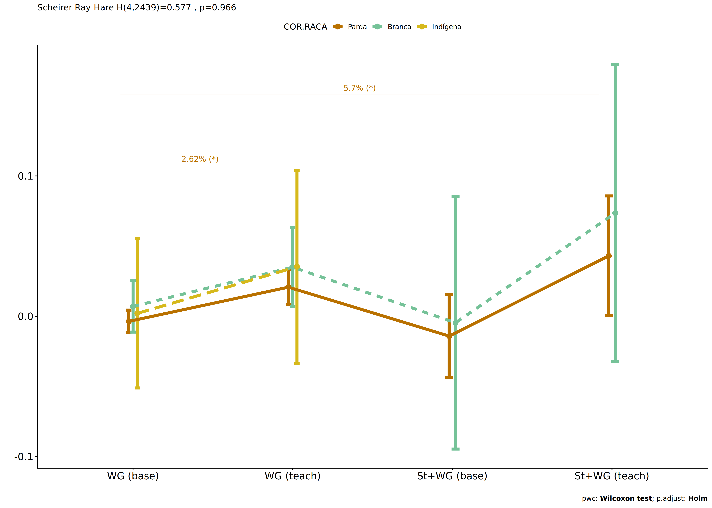<!-- -->

# Two-way factor analysis for: *score ~ GROUP:LOCAL*

``` r
pdat = remove_group_data(
  dat[!is.na(dat[["GROUP"]]) & !is.na(dat[["LOCAL"]]),],
  "vocab.dif", c("GROUP","LOCAL"))

pdat.long <- rbind(pdat[,c("id","GROUP","LOCAL")],
                   pdat[,c("id","GROUP","LOCAL")])
pdat.long[["time"]] <- c(rep("pre", nrow(pdat)), rep("pos", nrow(pdat)))
pdat.long[["time"]] <- factor(pdat.long[["time"]], c("pre","pos"))
pdat.long[["score"]] <- c(pdat[["vocab.norm.pre"]], pdat[["vocab.norm.pos"]])

y.position.min <- abs(
  max(pdat.long[["score"]])
  - min(pdat.long[["score"]]))/15

lvars = as.list(c("vocab.dif","vocab.norm.pos","vocab.norm.pre"))
names(lvars) = unlist(lvars)
```

## Pre-test and Post-test PairWise comparisons for: *score ~ GROUP:LOCAL*

``` r
pwc.long <- group_by(pdat.long, GROUP:LOCAL) %>%
  pairwise_wilcox_test(score ~ time, detailed = T)

df <- pwc.long[,c(".y.","GROUP:LOCAL","group1","group2","n1","n2","estimate",
                  "statistic","p.adj","p.adj.signif")]
```

| .y. | GROUP:LOCAL | group1 | group2 | n1 | n2 | estimate | statistic | p.adj | p.adj.signif |
|:---|:---|:---|:---|---:|---:|---:|---:|---:|:---|
| score | WG (base):Urbana | pre | pos | 815 | 815 | 0.0000308 | 342607.5 | 0.269 | ns |
| score | WG (base):Rural | pre | pos | 323 | 323 | -0.0000171 | 50728.0 | 0.544 | ns |
| score | WG (teach):Urbana | pre | pos | 814 | 814 | -0.0000450 | 317301.0 | 0.137 | ns |
| score | WG (teach):Rural | pre | pos | 323 | 323 | -0.0000219 | 48248.0 | 0.096 | ns |
| score | St+WG (base):Urbana | pre | pos | 72 | 72 | 0.0263602 | 2855.0 | 0.293 | ns |
| score | St+WG (base):Rural | pre | pos | 39 | 39 | -0.0000344 | 756.5 | 0.972 | ns |
| score | St+WG (teach):Urbana | pre | pos | 72 | 72 | -0.0000403 | 2413.5 | 0.471 | ns |
| score | St+WG (teach):Rural | pre | pos | 39 | 39 | -0.0833470 | 522.0 | 0.016 | \* |

### Plot to compare pre- and post-test

``` r
pwc.long <- group_by(pdat.long, GROUP, LOCAL) %>%
  pairwise_wilcox_test(score ~ time, detailed = T)

stat.test <- pwc.long %>% add_xy_position(x = "time", fun = "mean_ci")
sidx = which(stat.test$p.adj.signif != "ns")
stat.test$y.position[sidx] <- stat.test$y.position[sidx] + y.position.min * (1:length(sidx))

gg <- ggline(
  pdat.long, x = "time", y = "score",
  color = "LOCAL", linetype = "LOCAL", shape = "LOCAL", size = 1.5,
  facet.by = "GROUP", add = c("mean_ci"),
  position = position_dodge(width = 0.3), palette = color[["LOCAL"]])

pdat.long$xj = jitter(as.numeric(pdat.long[["time"]]), amount=.1)
pdat.long$yj = jitter(pdat.long[["score"]], amount = .01)

gg + geom_point(
  data = pdat.long, aes_string(x="xj",y="yj",colour="LOCAL"), size=0.5) +
  stat_pvalue_manual(
    stat.test, tip.length = 0, hide.ns = T, label.size = 5,
    position = position_dodge(width = 0.3), color = "LOCAL",
    label = "{ p.adj } ({ p.adj.signif })") + xlab("") + ylab("") +
  ylim(min(pdat.long$yj), max(pdat.long$yj)) +
  theme(strip.text = element_text(size = 14),
        axis.text = element_text(size = 14))
```

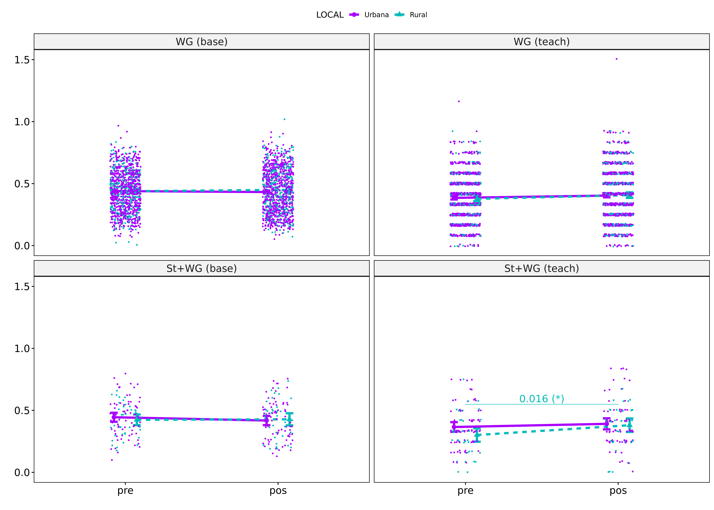<!-- -->

### New plot including percentagens in the differences

``` r
stat.test <- pwc.long %>% add_xy_position(x = "time", fun = "mean_ci")

stat.test$r <- sapply(abs(stat.test$estimate)/1, FUN = function(x) {
   ifelse(x < 0.0001, "<1%", paste0(round(x*100,2), "%"))
})

gg <- ggline(
  pdat.long[pdat.long$GROUP %in% c("WG (teach)","St+WG (teach)"),], x = "time", y = "score",
  color = "LOCAL", linetype = "LOCAL", shape = "LOCAL", size = 2,
  facet.by = "GROUP", add = c("mean_ci"),
  position = position_dodge(width = 0.3), palette = color[["LOCAL"]]) +
  stat_pvalue_manual(
    stat.test, tip.length = 0, hide.ns = T, label.size = 5,
    color = "LOCAL",
    label = "{ r } ({ p.adj.signif })") + xlab("") + ylab("")

gg + theme(strip.text = element_text(size = 14),
           axis.text = element_text(size = 14))
```

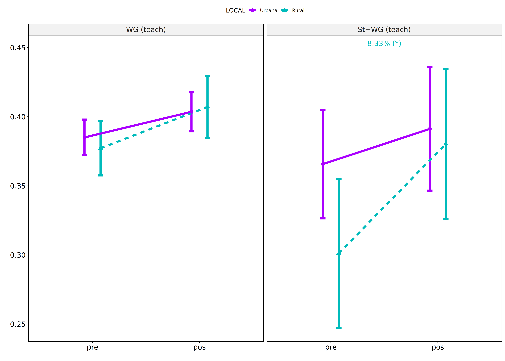<!-- -->

## Scheirer and Wilcoxon PairWise comparisons for: *score ~ GROUP:LOCAL*

``` r
sch <- lapply(lvars, FUN = function(x) {
  scheirer.test(pdat, x, c("GROUP","LOCAL"), as.table = T) 
})
df <- do.call(rbind.fill, sch)
```

| var | Effect | Df | Sum Sq | H | p.value | p.value.signif |
|:---|:---|---:|---:|---:|---:|:---|
| vocab.dif | GROUP | 3 | 10527836.2 | 20.3077542 | 0.0001466 | \*\*\* |
| vocab.dif | LOCAL | 1 | 2455181.6 | 4.7359424 | 0.0295387 | \* |
| vocab.dif | GROUP:LOCAL | 3 | 514118.0 | 0.9917120 | 0.8032574 | ns |
| vocab.dif | Residuals | 2489 | 1280405177.5 |  |  |  |
| vocab.norm.pos | GROUP | 3 | 11137194.2 | 21.4807107 | 0.0000836 | \*\*\*\* |
| vocab.norm.pos | LOCAL | 1 | 952128.4 | 1.8364046 | 0.1753729 | ns |
| vocab.norm.pos | GROUP:LOCAL | 3 | 308814.9 | 0.5956226 | 0.8974338 | ns |
| vocab.norm.pos | Residuals | 2489 | 1281777530.7 |  |  |  |
| vocab.norm.pre | GROUP | 3 | 42961420.8 | 82.9050804 | 0.0000000 | \*\*\*\* |
| vocab.norm.pre | LOCAL | 1 | 471425.3 | 0.9097360 | 0.3401845 | ns |
| vocab.norm.pre | GROUP:LOCAL | 3 | 1216981.3 | 2.3484775 | 0.5032976 | ns |
| vocab.norm.pre | Residuals | 2489 | 1248701718.4 |  |  |  |

``` r
pwc <- lapply(lvars, FUN = function(x) {
  list(
    GROUP = tryCatch(pairwise_wilcox_test(group_by(pdat, LOCAL),
                                 as.formula(paste0(x," ~ GROUP")), detailed = T)
                         , error = function(e) NULL),
    LOCAL = tryCatch(pairwise_wilcox_test(group_by(pdat, GROUP),
                                 as.formula(paste0(x," ~ LOCAL")), detailed = T)
                         , error = function(e) NULL)
  )
})

df <- do.call(rbind.fill, lapply(pwc, FUN =  function(x) {
  do.call(rbind.fill, x)
}))

ivs = c()
if ("GROUP" %in% colnames(df)) ivs = c(ivs, "GROUP")
if ("LOCAL" %in% colnames(df)) ivs = c(ivs, "LOCAL")
df <- df[,c(".y.",ivs,"group1","group2","n1","n2","estimate",
            "statistic","p.adj","p.adj.signif")]
```

| .y. | GROUP | LOCAL | group1 | group2 | n1 | n2 | estimate | statistic | p.adj | p.adj.signif |
|:---|:---|:---|:---|:---|---:|---:|---:|---:|---:|:---|
| vocab.dif |  | Urbana | WG (base) | WG (teach) | 815 | 814 | -0.0263120 | 302829.0 | 1.40e-02 | \* |
| vocab.dif |  | Urbana | WG (base) | St+WG (base) | 815 | 72 | 0.0262674 | 31218.5 | 7.34e-01 | ns |
| vocab.dif |  | Urbana | WG (base) | St+WG (teach) | 815 | 72 | -0.0350894 | 24707.0 | 1.30e-01 | ns |
| vocab.dif |  | Urbana | WG (teach) | St+WG (base) | 814 | 72 | 0.0394710 | 33263.5 | 1.70e-01 | ns |
| vocab.dif |  | Urbana | WG (teach) | St+WG (teach) | 814 | 72 | -0.0000589 | 28614.0 | 7.40e-01 | ns |
| vocab.dif |  | Urbana | St+WG (base) | St+WG (teach) | 72 | 72 | -0.0569860 | 2063.0 | 1.38e-01 | ns |
| vocab.dif |  | Rural | WG (base) | WG (teach) | 323 | 323 | -0.0219382 | 48009.0 | 3.79e-01 | ns |
| vocab.dif |  | Rural | WG (base) | St+WG (base) | 323 | 39 | 0.0000070 | 6456.0 | 9.36e-01 | ns |
| vocab.dif |  | Rural | WG (base) | St+WG (teach) | 323 | 39 | -0.1009024 | 4789.0 | 8.70e-02 | ns |
| vocab.dif |  | Rural | WG (teach) | St+WG (base) | 323 | 39 | 0.0262777 | 6745.5 | 9.36e-01 | ns |
| vocab.dif |  | Rural | WG (teach) | St+WG (teach) | 323 | 39 | -0.0833151 | 5215.0 | 3.79e-01 | ns |
| vocab.dif |  | Rural | St+WG (base) | St+WG (teach) | 39 | 39 | -0.1096929 | 582.5 | 3.79e-01 | ns |
| vocab.dif | WG (base) |  | Urbana | Rural | 815 | 323 | -0.0263013 | 122749.5 | 7.60e-02 | ns |
| vocab.dif | WG (teach) |  | Urbana | Rural | 814 | 323 | -0.0000282 | 126316.0 | 3.01e-01 | ns |
| vocab.dif | St+WG (base) |  | Urbana | Rural | 72 | 39 | -0.0262699 | 1273.5 | 4.22e-01 | ns |
| vocab.dif | St+WG (teach) |  | Urbana | Rural | 72 | 39 | -0.0832927 | 1129.0 | 8.90e-02 | ns |
| vocab.norm.pos |  | Urbana | WG (base) | WG (teach) | 815 | 814 | 0.0350644 | 361942.0 | 9.00e-03 | \*\* |
| vocab.norm.pos |  | Urbana | WG (base) | St+WG (base) | 815 | 72 | 0.0262976 | 30626.5 | 1.00e+00 | ns |
| vocab.norm.pos |  | Urbana | WG (base) | St+WG (teach) | 815 | 72 | 0.0438826 | 33583.0 | 2.08e-01 | ns |
| vocab.norm.pos |  | Urbana | WG (teach) | St+WG (base) | 814 | 72 | -0.0174865 | 27421.0 | 1.00e+00 | ns |
| vocab.norm.pos |  | Urbana | WG (teach) | St+WG (teach) | 814 | 72 | 0.0000162 | 30576.0 | 1.00e+00 | ns |
| vocab.norm.pos |  | Urbana | St+WG (base) | St+WG (teach) | 72 | 72 | 0.0351063 | 2925.0 | 7.32e-01 | ns |
| vocab.norm.pos |  | Rural | WG (base) | WG (teach) | 323 | 323 | 0.0482085 | 58846.0 | 2.90e-02 | \* |
| vocab.norm.pos |  | Rural | WG (base) | St+WG (base) | 323 | 39 | 0.0262930 | 6725.5 | 1.00e+00 | ns |
| vocab.norm.pos |  | Rural | WG (base) | St+WG (teach) | 323 | 39 | 0.0570397 | 7456.0 | 3.04e-01 | ns |
| vocab.norm.pos |  | Rural | WG (teach) | St+WG (base) | 323 | 39 | -0.0306790 | 5858.0 | 1.00e+00 | ns |
| vocab.norm.pos |  | Rural | WG (teach) | St+WG (teach) | 323 | 39 | 0.0000007 | 6554.0 | 1.00e+00 | ns |
| vocab.norm.pos |  | Rural | St+WG (base) | St+WG (teach) | 39 | 39 | 0.0307273 | 848.0 | 1.00e+00 | ns |
| vocab.norm.pos | WG (base) |  | Urbana | Rural | 815 | 323 | -0.0262734 | 124261.5 | 1.41e-01 | ns |
| vocab.norm.pos | WG (teach) |  | Urbana | Rural | 814 | 323 | -0.0000549 | 129812.0 | 7.39e-01 | ns |
| vocab.norm.pos | St+WG (base) |  | Urbana | Rural | 72 | 39 | -0.0000606 | 1352.5 | 7.52e-01 | ns |
| vocab.norm.pos | St+WG (teach) |  | Urbana | Rural | 72 | 39 | -0.0000337 | 1302.0 | 5.25e-01 | ns |
| vocab.norm.pre |  | Urbana | WG (base) | WG (teach) | 815 | 814 | 0.0613964 | 393292.5 | 0.00e+00 | \*\*\*\* |
| vocab.norm.pre |  | Urbana | WG (base) | St+WG (base) | 815 | 72 | -0.0000119 | 28941.0 | 8.48e-01 | ns |
| vocab.norm.pre |  | Urbana | WG (base) | St+WG (teach) | 815 | 72 | 0.0876888 | 37319.0 | 6.35e-04 | \*\*\* |
| vocab.norm.pre |  | Urbana | WG (teach) | St+WG (base) | 814 | 72 | -0.0570274 | 23289.0 | 1.10e-02 | \* |
| vocab.norm.pre |  | Urbana | WG (teach) | St+WG (teach) | 814 | 72 | 0.0000800 | 31295.0 | 6.70e-01 | ns |
| vocab.norm.pre |  | Urbana | St+WG (base) | St+WG (teach) | 72 | 72 | 0.0877573 | 3392.0 | 5.00e-03 | \*\* |
| vocab.norm.pre |  | Rural | WG (base) | WG (teach) | 323 | 323 | 0.0657762 | 62569.0 | 5.55e-05 | \*\*\*\* |
| vocab.norm.pre |  | Rural | WG (base) | St+WG (base) | 323 | 39 | 0.0000784 | 6600.5 | 6.25e-01 | ns |
| vocab.norm.pre |  | Rural | WG (base) | St+WG (teach) | 323 | 39 | 0.1447182 | 9092.0 | 3.56e-05 | \*\*\*\* |
| vocab.norm.pre |  | Rural | WG (teach) | St+WG (base) | 323 | 39 | -0.0439012 | 5224.0 | 1.59e-01 | ns |
| vocab.norm.pre |  | Rural | WG (teach) | St+WG (teach) | 323 | 39 | 0.0832674 | 7832.5 | 3.60e-02 | \* |
| vocab.norm.pre |  | Rural | St+WG (base) | St+WG (teach) | 39 | 39 | 0.1228171 | 1096.0 | 3.00e-03 | \*\* |
| vocab.norm.pre | WG (base) |  | Urbana | Rural | 815 | 323 | 0.0000477 | 131720.0 | 9.85e-01 | ns |
| vocab.norm.pre | WG (teach) |  | Urbana | Rural | 814 | 323 | 0.0000587 | 134051.0 | 6.01e-01 | ns |
| vocab.norm.pre | St+WG (base) |  | Urbana | Rural | 72 | 39 | 0.0263158 | 1500.0 | 5.54e-01 | ns |
| vocab.norm.pre | St+WG (teach) |  | Urbana | Rural | 72 | 39 | 0.0833094 | 1691.0 | 7.30e-02 | ns |

### Plot to compare results from pre and post

``` r
plots <- lapply(lvars, FUN = function(y) {
  livs = list("GROUP", "LOCAL")
  names(livs) = unlist(livs)
  lapply(livs, FUN = function(x) {
    iv2 = setdiff(names(livs), x)
    if (!is.null(pwc[[y]][[iv2]])) {
      stat.test <- pwc[[y]][[iv2]] %>% add_xy_position(x = x, fun = "max")
      sidx = which(stat.test$p.adj.signif != "ns")
      stat.test$y.position[sidx] <- stat.test$y.position[sidx] + y.position.min * (1:length(sidx))
      
      ggboxplot(pdat, x = x, y = y, fill = iv2, palette = color[[iv2]]) +
        stat_pvalue_manual(stat.test, tip.length = 0, hide.ns = T, label.size = 5,
                           label="{ p.adj } ({ p.adj.signif })") + xlab("")
    }
  })
})
```

``` r
if (!is.null(plots[["vocab.norm.pre"]][["GROUP"]]) &&
    !is.null(plots[["vocab.norm.pos"]][["GROUP"]])) {
  egg::ggarrange(plots[["vocab.norm.pre"]][["GROUP"]],
                 plots[["vocab.norm.pos"]][["GROUP"]], nrow = 1)  
}
```

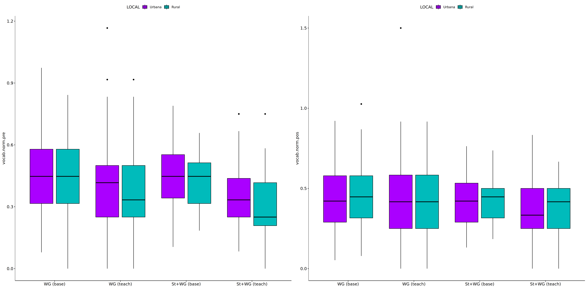<!-- -->

``` r
if (!is.null(plots[["vocab.norm.pre"]][["LOCAL"]]) &&
    !is.null(plots[["vocab.norm.pos"]][["LOCAL"]])) {
  egg::ggarrange(plots[["vocab.norm.pre"]][["LOCAL"]],
                 plots[["vocab.norm.pos"]][["LOCAL"]], nrow = 1)
}
```

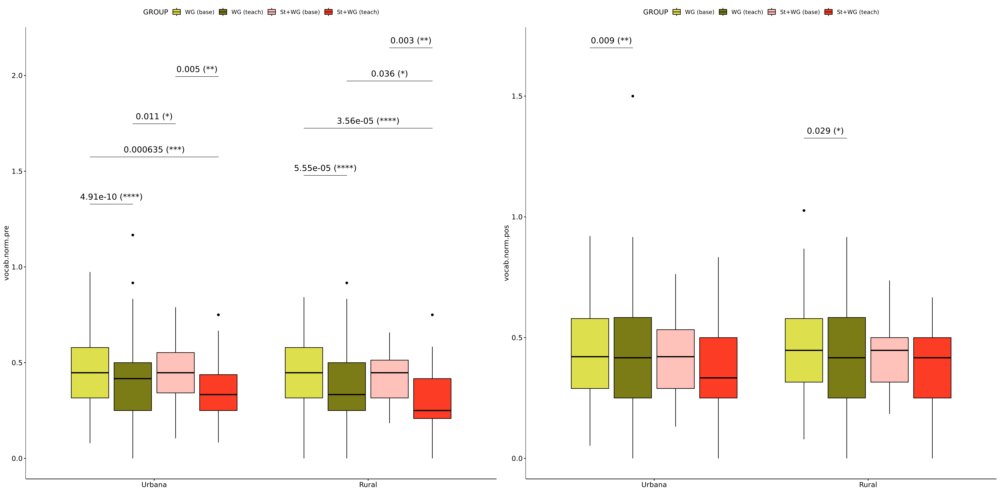<!-- -->

### Plot to compare differences (1st)

``` r
psch = sch[["vocab.dif"]]
idx = which(psch$Effect == "GROUP:LOCAL") 

dof = floor(as.double(psch$Df[idx]))
dof.res = floor(as.double(psch$Df[which(psch$Effect == "Residuals")]))
statistic = round(as.double(psch$H[idx]), 3)
p = round(as.double(psch[["p.value"]][idx]), 3)
pval = ifelse(p < 0.001,paste0(" , p<0.001"),paste0(" , p=",p))

if (!is.null(plots[["vocab.dif"]][["GROUP"]]))
  plots[["vocab.dif"]][["GROUP"]] +
    labs(subtitle = paste0("Scheirer-Ray-Hare H(", dof, ",", 
          dof.res, ")=", statistic, pval),
         caption = get_pwc_label(pwc[["vocab.dif"]][["LOCAL"]])) +
    ylab("score (dif)") +
  theme(strip.text = element_text(size = 14),
        axis.text = element_text(size = 14))
```

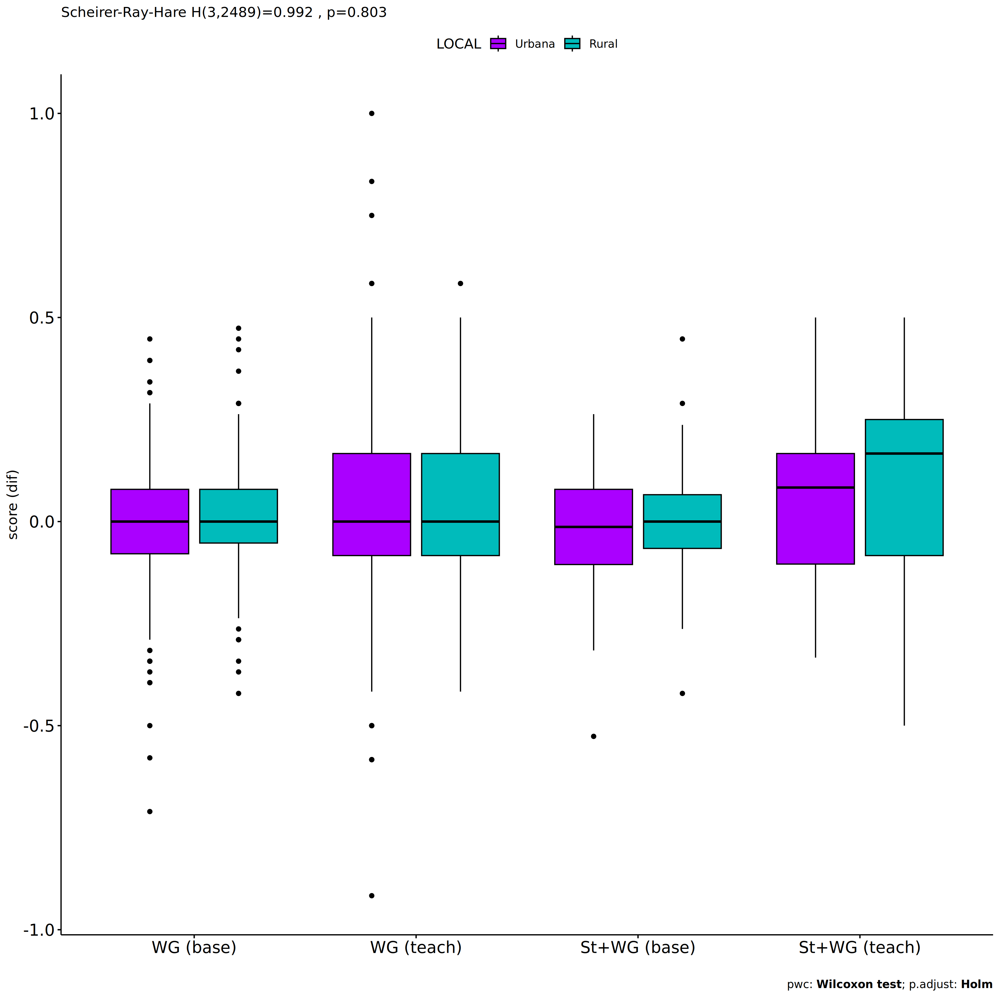<!-- -->

### Plot to compare differences (1st)

``` r
psch = sch[["vocab.dif"]]
idx = which(psch$Effect == "GROUP:LOCAL") 

dof = floor(as.double(psch$Df[idx]))
dof.res = floor(as.double(psch$Df[which(psch$Effect == "Residuals")]))
statistic = round(as.double(psch$H[idx]), 3)
p = round(as.double(psch[["p.value"]][idx]), 3)
pval = ifelse(p < 0.001,paste0(" , p<0.001"),paste0(" , p=",p))

if (!is.null(plots[["vocab.dif"]][["LOCAL"]]))
  plots[["vocab.dif"]][["LOCAL"]] +
    labs(subtitle = paste0("Scheirer-Ray-Hare H(", dof, ",", 
          dof.res, ")=", statistic, pval),
         caption = get_pwc_label(pwc[["vocab.dif"]][["GROUP"]])) +
    ylab("score (dif)") +
  theme(strip.text = element_text(size = 14),
        axis.text = element_text(size = 14))
```

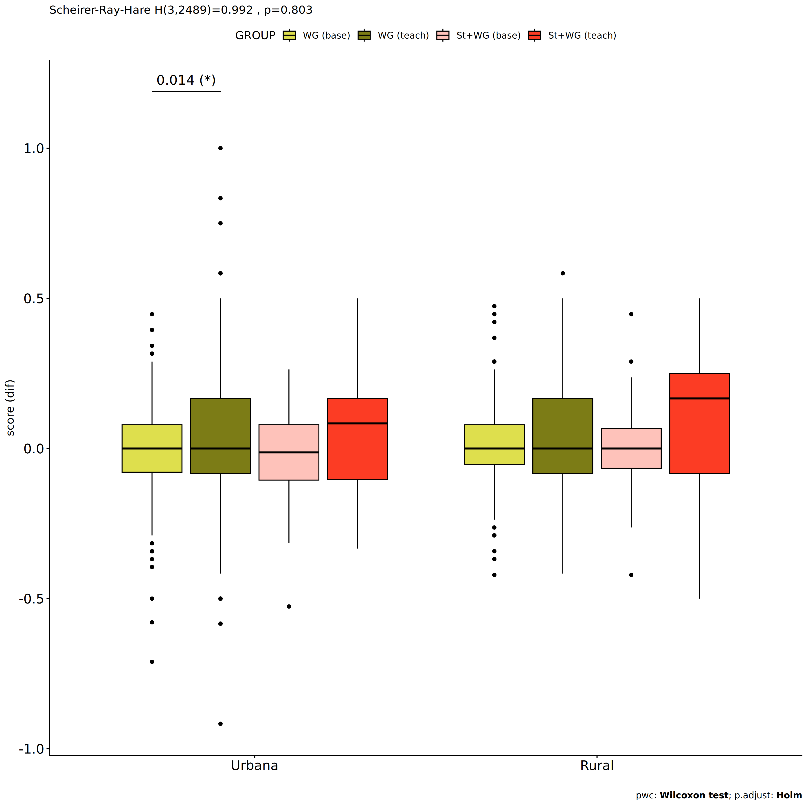<!-- -->

### Plot to compare differences using in one comparison

``` r
psch = sch[["vocab.dif"]]
idx = which(psch$Effect == "GROUP:LOCAL") 

dof = floor(as.double(psch$Df[idx]))
dof.res = floor(as.double(psch$Df[which(psch$Effect == "Residuals")]))
statistic = round(as.double(psch$H[idx]), 3)
p = round(as.double(psch[["p.value"]][idx]), 3)
pval = ifelse(p < 0.001,paste0(" , p<0.001"),paste0(" , p=",p))

dodge = 0.08
x.seg = sum(!is.na(unique(pdat[["LOCAL"]])))-1
d.seg = -1*dodge*x.seg/2


pwc2 = pwc[["vocab.dif"]][["GROUP"]][pwc[["vocab.dif"]][["GROUP"]]$p.adj.signif != "ns",]

if (nrow(pwc2) > 0) {
  pwc2 = rstatix::add_xy_position(pwc2, dodge = dodge, fun = "mean_ci")
  
  for (f in sort(unique(pdat[["LOCAL"]]))) {
    fbool <- pwc2[["LOCAL"]] == f
    if (sum(fbool) > 0) {
      pwc2$xmin[which(fbool)] <- pwc2$xmin[which(fbool)]+d.seg
      pwc2$xmax[which(fbool)] <- pwc2$xmax[which(fbool)]+d.seg
    }
    d.seg <- d.seg + dodge
  }
} 


pwc2g <- pwc[["vocab.dif"]][["LOCAL"]][pwc[["vocab.dif"]][["LOCAL"]]$p.adj.signif != "ns",]

if (nrow(pwc2g) > 0) {
  pwc2g$y.position <- sapply(seq(1,nrow(pwc2g)), FUN = function(i) {
    rw <- as.list(pwc2g[i,])
    resp = -Inf
    for (atr2 in unique(pdat[["LOCAL"]])) {
      idx = which(pdat[["GROUP"]] == rw[["GROUP"]] & pdat[["LOCAL"]] == atr2)
      rmax = max(mean_ci(pdat[["vocab.dif"]][c(idx)]))
      if (rmax > resp) resp <- rmax
    }
    return(resp)
  })
  pwc2g$xpos <- sapply(seq(1,nrow(pwc2g)), FUN = function(i) {
    rw <- as.list(pwc2g[i,])
    tmp <- add_x_position(pwc[["vocab.dif"]][["GROUP"]])
    min(tmp$xmin[which(tmp$group1 == rw[["GROUP"]])],
        tmp$xmax[which(tmp$group2 == rw[["GROUP"]])])
  })
  pwc2g$xmin <- pwc2g$xpos - abs(dodge*x.seg/2) 
  pwc2g$xmax <- pwc2g$xpos + abs(dodge*x.seg/2)
}

if (nrow(pwc2) > 0) {
  pwc2$r <- sapply(abs(pwc2$estimate)/1, FUN = function(x) {
     ifelse(x < 0.0001, "<1%", paste0(round(x*100,2), "%"))
  })
}

pd <- ggplot2::position_dodge(width = sum(!is.na(unique(pwc2[["LOCAL"]])))*dodge)

lp <- ggpubr::ggline(pdat, x="GROUP", y = "vocab.dif", color = "LOCAL", linetype = "LOCAL",
                       palette = color[["LOCAL"]], plot_type='b', size=2,
                       position = pd, add = "mean_ci", ylab = "")

if (nrow(pwc2) > 0)
  lp <- lp + ggpubr::stat_pvalue_manual(pwc2, color = "LOCAL", linetype = "LOCAL",
                                          hide.ns = T, tip.length = 0,
                                          label = "{ r } ({ p.adj.signif })")

if (nrow(pwc2g) > 0) {
  y.pos.min = max(pwc2g$y.position)/10
  if (nrow(pwc2) > 0)
    y.pos.min = max(pwc2$y.position, pwc2g$y.position)/10
  
  pwc2g$r <- sapply(abs(pwc2g$estimate)/1, FUN = function(x) {
     ifelse(x < 0.0001, "<1%", paste0(round(x*100,2), "%"))
  })
  pwc2g$y.position <- pwc2g$y.position + y.pos.min
  
  for (i in which(pwc2g$p.adj < 0.05)) {
    x1 = pwc2g$xmin[i]
    x2 = pwc2g$xmax[i]
    y.pos = pwc2g$y.position[i]
    label = pwc2g$p.adj.signif[i]
    label = paste0(pwc2g$r[i]," (",label,")")
    
    lp <- lp + ggplot2::geom_segment(x = x1, y = y.pos, xend = x2, yend = y.pos) +
      ggplot2::geom_text(x=(x1+x2)/2, y = y.pos+y.pos.min/3, label=label)
  }
}

lp + labs(subtitle = paste0("Scheirer-Ray-Hare H(", dof, ",", 
                            dof.res, ")=", statistic, pval),
          caption = get_pwc_label(pwc[["vocab.dif"]][["LOCAL"]])) +
  xlab("") + ylab("") +
  theme(strip.text = element_text(size = 14),
        axis.text = element_text(size = 14))
```

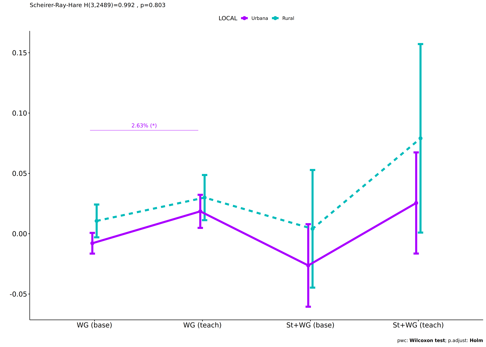<!-- -->

# Two-way factor analysis for: *score ~ GROUP:SERIE*

``` r
pdat = remove_group_data(
  dat[!is.na(dat[["GROUP"]]) & !is.na(dat[["SERIE"]]),],
  "vocab.dif", c("GROUP","SERIE"))

pdat.long <- rbind(pdat[,c("id","GROUP","SERIE")],
                   pdat[,c("id","GROUP","SERIE")])
pdat.long[["time"]] <- c(rep("pre", nrow(pdat)), rep("pos", nrow(pdat)))
pdat.long[["time"]] <- factor(pdat.long[["time"]], c("pre","pos"))
pdat.long[["score"]] <- c(pdat[["vocab.norm.pre"]], pdat[["vocab.norm.pos"]])

y.position.min <- abs(
  max(pdat.long[["score"]])
  - min(pdat.long[["score"]]))/15

lvars = as.list(c("vocab.dif","vocab.norm.pos","vocab.norm.pre"))
names(lvars) = unlist(lvars)
```

## Pre-test and Post-test PairWise comparisons for: *score ~ GROUP:SERIE*

``` r
pwc.long <- group_by(pdat.long, GROUP:SERIE) %>%
  pairwise_wilcox_test(score ~ time, detailed = T)

df <- pwc.long[,c(".y.","GROUP:SERIE","group1","group2","n1","n2","estimate",
                  "statistic","p.adj","p.adj.signif")]
```

| .y. | GROUP:SERIE | group1 | group2 | n1 | n2 | estimate | statistic | p.adj | p.adj.signif |
|:---|:---|:---|:---|---:|---:|---:|---:|---:|:---|
| score | WG (base):6a | pre | pos | 276 | 276 | 0.0000534 | 38268.5 | 0.923 | ns |
| score | WG (base):7a | pre | pos | 302 | 302 | 0.0000292 | 45965.0 | 0.866 | ns |
| score | WG (base):8a | pre | pos | 292 | 292 | 0.0000387 | 44365.0 | 0.395 | ns |
| score | WG (base):9a | pre | pos | 268 | 268 | -0.0000235 | 35560.0 | 0.844 | ns |
| score | WG (teach):6a | pre | pos | 276 | 276 | 0.0000264 | 38940.0 | 0.646 | ns |
| score | WG (teach):7a | pre | pos | 302 | 302 | -0.0000574 | 43655.0 | 0.359 | ns |
| score | WG (teach):8a | pre | pos | 292 | 292 | -0.0000650 | 38728.0 | 0.054 | ns |
| score | WG (teach):9a | pre | pos | 267 | 267 | -0.0832926 | 31642.5 | 0.024 | \* |
| score | St+WG (base):6a | pre | pos | 28 | 28 | 0.0000888 | 401.5 | 0.882 | ns |
| score | St+WG (base):7a | pre | pos | 34 | 34 | 0.0000076 | 582.0 | 0.966 | ns |
| score | St+WG (base):8a | pre | pos | 28 | 28 | 0.0263232 | 449.5 | 0.349 | ns |
| score | St+WG (base):9a | pre | pos | 21 | 21 | 0.0526316 | 255.5 | 0.383 | ns |
| score | St+WG (teach):6a | pre | pos | 28 | 28 | -0.0833727 | 287.0 | 0.084 | ns |
| score | St+WG (teach):7a | pre | pos | 34 | 34 | -0.0832775 | 473.0 | 0.193 | ns |
| score | St+WG (teach):8a | pre | pos | 28 | 28 | -0.0000386 | 355.5 | 0.548 | ns |
| score | St+WG (teach):9a | pre | pos | 21 | 21 | -0.0000321 | 204.0 | 0.684 | ns |

### Plot to compare pre- and post-test

``` r
pwc.long <- group_by(pdat.long, GROUP, SERIE) %>%
  pairwise_wilcox_test(score ~ time, detailed = T)

stat.test <- pwc.long %>% add_xy_position(x = "time", fun = "mean_ci")
sidx = which(stat.test$p.adj.signif != "ns")
stat.test$y.position[sidx] <- stat.test$y.position[sidx] + y.position.min * (1:length(sidx))

gg <- ggline(
  pdat.long, x = "time", y = "score",
  color = "SERIE", linetype = "SERIE", shape = "SERIE", size = 1.5,
  facet.by = "GROUP", add = c("mean_ci"),
  position = position_dodge(width = 0.3), palette = color[["SERIE"]])

pdat.long$xj = jitter(as.numeric(pdat.long[["time"]]), amount=.1)
pdat.long$yj = jitter(pdat.long[["score"]], amount = .01)

gg + geom_point(
  data = pdat.long, aes_string(x="xj",y="yj",colour="SERIE"), size=0.5) +
  stat_pvalue_manual(
    stat.test, tip.length = 0, hide.ns = T, label.size = 5,
    position = position_dodge(width = 0.3), color = "SERIE",
    label = "{ p.adj } ({ p.adj.signif })") + xlab("") + ylab("") +
  ylim(min(pdat.long$yj), max(pdat.long$yj)) +
  theme(strip.text = element_text(size = 14),
        axis.text = element_text(size = 14))
```

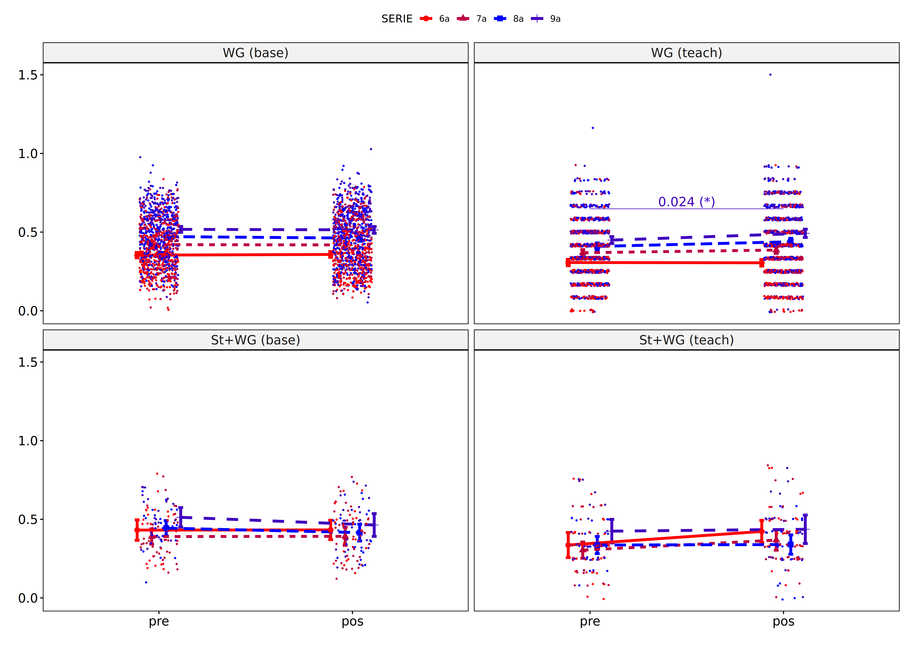<!-- -->

### New plot including percentagens in the differences

``` r
stat.test <- pwc.long %>% add_xy_position(x = "time", fun = "mean_ci")

stat.test$r <- sapply(abs(stat.test$estimate)/1, FUN = function(x) {
   ifelse(x < 0.0001, "<1%", paste0(round(x*100,2), "%"))
})

gg <- ggline(
  pdat.long[pdat.long$GROUP %in% c("WG (teach)","St+WG (teach)"),], x = "time", y = "score",
  color = "SERIE", linetype = "SERIE", shape = "SERIE", size = 2,
  facet.by = "GROUP", add = c("mean_ci"),
  position = position_dodge(width = 0.3), palette = color[["SERIE"]]) +
  stat_pvalue_manual(
    stat.test, tip.length = 0, hide.ns = T, label.size = 5,
    color = "SERIE",
    label = "{ r } ({ p.adj.signif })") + xlab("") + ylab("")

gg + theme(strip.text = element_text(size = 14),
           axis.text = element_text(size = 14))
```

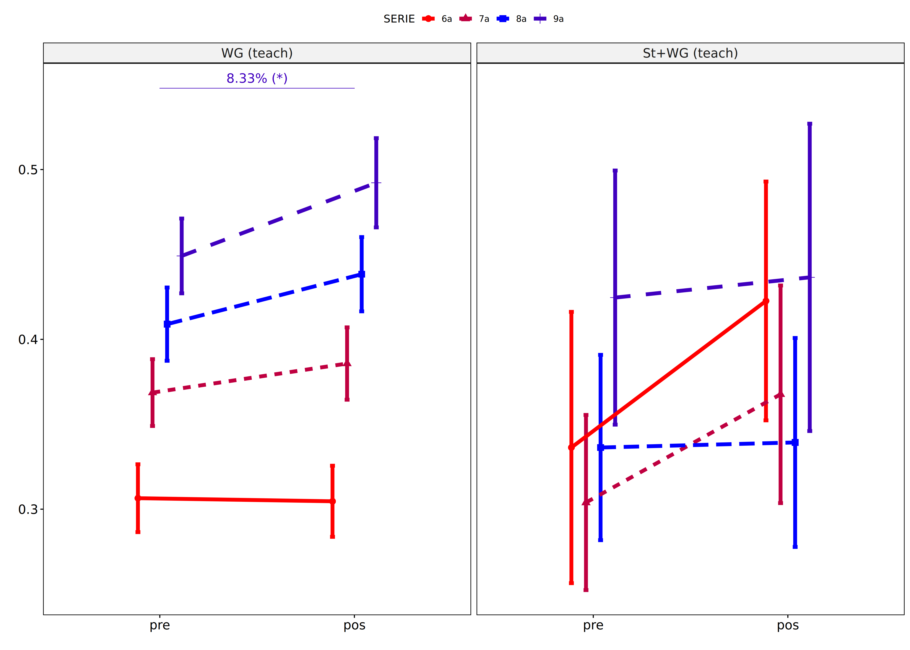<!-- -->

## Scheirer and Wilcoxon PairWise comparisons for: *score ~ GROUP:SERIE*

``` r
sch <- lapply(lvars, FUN = function(x) {
  scheirer.test(pdat, x, c("GROUP","SERIE"), as.table = T) 
})
df <- do.call(rbind.fill, sch)
```

| var            | Effect      |   Df |     Sum Sq |          H |   p.value | p.value.signif |
|:---------------|:------------|-----:|-----------:|-----------:|----------:|:---------------|
| vocab.dif      | GROUP       |    3 |   10616841 |  20.479440 | 0.0001350 | \*\*\*         |
| vocab.dif      | SERIE       |    3 |    1616783 |   3.118707 | 0.3736825 | ns             |
| vocab.dif      | GROUP:SERIE |    9 |    8994376 |  17.349774 | 0.0435121 | \*             |
| vocab.dif      | Residuals   | 2481 | 1272763318 |            |           |                |
| vocab.norm.pos | GROUP       |    3 |   10698336 |  20.634268 | 0.0001254 | \*\*\*         |
| vocab.norm.pos | SERIE       |    3 |  114348309 | 220.547733 | 0.0000000 | \*\*\*\*       |
| vocab.norm.pos | GROUP:SERIE |    9 |   12966564 |  25.009083 | 0.0029611 | \*\*           |
| vocab.norm.pos | Residuals   | 2481 | 1155723601 |            |           |                |
| vocab.norm.pre | GROUP       |    3 |   42346483 |  81.718401 | 0.0000000 | \*\*\*\*       |
| vocab.norm.pre | SERIE       |    3 |  115712260 | 223.296484 | 0.0000000 | \*\*\*\*       |
| vocab.norm.pre | GROUP:SERIE |    9 |    8135239 |  15.699030 | 0.0734389 | ns             |
| vocab.norm.pre | Residuals   | 2481 | 1126542626 |            |           |                |

``` r
pwc <- lapply(lvars, FUN = function(x) {
  list(
    GROUP = tryCatch(pairwise_wilcox_test(group_by(pdat, SERIE),
                                 as.formula(paste0(x," ~ GROUP")), detailed = T)
                         , error = function(e) NULL),
    SERIE = tryCatch(pairwise_wilcox_test(group_by(pdat, GROUP),
                                 as.formula(paste0(x," ~ SERIE")), detailed = T)
                         , error = function(e) NULL)
  )
})

df <- do.call(rbind.fill, lapply(pwc, FUN =  function(x) {
  do.call(rbind.fill, x)
}))

ivs = c()
if ("GROUP" %in% colnames(df)) ivs = c(ivs, "GROUP")
if ("SERIE" %in% colnames(df)) ivs = c(ivs, "SERIE")
df <- df[,c(".y.",ivs,"group1","group2","n1","n2","estimate",
            "statistic","p.adj","p.adj.signif")]
```

| .y. | GROUP | SERIE | group1 | group2 | n1 | n2 | estimate | statistic | p.adj | p.adj.signif |
|:---|:---|:---|:---|:---|---:|---:|---:|---:|---:|:---|
| vocab.dif |  | 6a | WG (base) | WG (teach) | 276 | 276 | 0.0087423 | 39524.5 | 1.00e+00 | ns |
| vocab.dif |  | 6a | WG (base) | St+WG (base) | 276 | 28 | -0.0000256 | 3804.0 | 1.00e+00 | ns |
| vocab.dif |  | 6a | WG (base) | St+WG (teach) | 276 | 28 | -0.0877170 | 2754.0 | 7.40e-02 | ns |
| vocab.dif |  | 6a | WG (teach) | St+WG (base) | 276 | 28 | -0.0132160 | 3664.0 | 1.00e+00 | ns |
| vocab.dif |  | 6a | WG (teach) | St+WG (teach) | 276 | 28 | -0.0833579 | 2827.0 | 9.50e-02 | ns |
| vocab.dif |  | 6a | St+WG (base) | St+WG (teach) | 28 | 28 | -0.0832811 | 290.0 | 3.84e-01 | ns |
| vocab.dif |  | 7a | WG (base) | WG (teach) | 302 | 302 | -0.0218865 | 42584.5 | 4.88e-01 | ns |
| vocab.dif |  | 7a | WG (base) | St+WG (base) | 302 | 34 | 0.0000512 | 5238.0 | 1.00e+00 | ns |
| vocab.dif |  | 7a | WG (base) | St+WG (teach) | 302 | 34 | -0.0833247 | 3674.0 | 3.90e-02 | \* |
| vocab.dif |  | 7a | WG (teach) | St+WG (base) | 302 | 34 | 0.0131634 | 5491.0 | 1.00e+00 | ns |
| vocab.dif |  | 7a | WG (teach) | St+WG (teach) | 302 | 34 | -0.0832997 | 4306.0 | 4.88e-01 | ns |
| vocab.dif |  | 7a | St+WG (base) | St+WG (teach) | 34 | 34 | -0.0833644 | 410.0 | 1.98e-01 | ns |
| vocab.dif |  | 8a | WG (base) | WG (teach) | 292 | 292 | -0.0307559 | 36892.0 | 2.90e-02 | \* |
| vocab.dif |  | 8a | WG (base) | St+WG (base) | 292 | 28 | 0.0262712 | 4585.5 | 1.00e+00 | ns |
| vocab.dif |  | 8a | WG (base) | St+WG (teach) | 292 | 28 | -0.0044123 | 3860.0 | 1.00e+00 | ns |
| vocab.dif |  | 8a | WG (teach) | St+WG (base) | 292 | 28 | 0.0569720 | 4901.5 | 4.06e-01 | ns |
| vocab.dif |  | 8a | WG (teach) | St+WG (teach) | 292 | 28 | 0.0000762 | 4466.0 | 1.00e+00 | ns |
| vocab.dif |  | 8a | St+WG (base) | St+WG (teach) | 28 | 28 | -0.0307003 | 349.0 | 1.00e+00 | ns |
| vocab.dif |  | 9a | WG (base) | WG (teach) | 268 | 267 | -0.0526078 | 29141.0 | 1.00e-03 | \*\* |
| vocab.dif |  | 9a | WG (base) | St+WG (base) | 268 | 21 | 0.0262829 | 3065.5 | 1.00e+00 | ns |
| vocab.dif |  | 9a | WG (base) | St+WG (teach) | 268 | 21 | -0.0263078 | 2584.0 | 1.00e+00 | ns |
| vocab.dif |  | 9a | WG (teach) | St+WG (base) | 267 | 21 | 0.0833070 | 3537.5 | 2.25e-01 | ns |
| vocab.dif |  | 9a | WG (teach) | St+WG (teach) | 267 | 21 | 0.0000262 | 2993.5 | 1.00e+00 | ns |
| vocab.dif |  | 9a | St+WG (base) | St+WG (teach) | 21 | 21 | -0.0570567 | 184.5 | 1.00e+00 | ns |
| vocab.dif | WG (base) |  | 6a | 7a | 276 | 302 | 0.0000812 | 42001.5 | 1.00e+00 | ns |
| vocab.dif | WG (base) |  | 6a | 8a | 276 | 292 | 0.0000223 | 42327.5 | 1.00e+00 | ns |
| vocab.dif | WG (base) |  | 6a | 9a | 276 | 268 | 0.0000086 | 37838.5 | 1.00e+00 | ns |
| vocab.dif | WG (base) |  | 7a | 8a | 302 | 292 | 0.0000033 | 46104.0 | 1.00e+00 | ns |
| vocab.dif | WG (base) |  | 7a | 9a | 302 | 268 | 0.0000215 | 41096.5 | 1.00e+00 | ns |
| vocab.dif | WG (base) |  | 8a | 9a | 292 | 268 | -0.0000113 | 38052.5 | 1.00e+00 | ns |
| vocab.dif | WG (teach) |  | 6a | 7a | 276 | 302 | -0.0000722 | 38759.5 | 4.35e-01 | ns |
| vocab.dif | WG (teach) |  | 6a | 8a | 276 | 292 | -0.0000296 | 35957.0 | 1.30e-01 | ns |
| vocab.dif | WG (teach) |  | 6a | 9a | 276 | 267 | -0.0833219 | 30990.5 | 8.00e-03 | \*\* |
| vocab.dif | WG (teach) |  | 7a | 8a | 302 | 292 | -0.0000146 | 42395.5 | 6.56e-01 | ns |
| vocab.dif | WG (teach) |  | 7a | 9a | 302 | 267 | -0.0000289 | 36782.5 | 2.79e-01 | ns |
| vocab.dif | WG (teach) |  | 8a | 9a | 292 | 267 | -0.0000859 | 37122.0 | 6.56e-01 | ns |
| vocab.dif | St+WG (base) |  | 6a | 7a | 28 | 34 | 0.0000481 | 500.5 | 1.00e+00 | ns |
| vocab.dif | St+WG (base) |  | 6a | 8a | 28 | 28 | 0.0263232 | 451.0 | 1.00e+00 | ns |
| vocab.dif | St+WG (base) |  | 6a | 9a | 28 | 21 | 0.0263888 | 337.0 | 1.00e+00 | ns |
| vocab.dif | St+WG (base) |  | 7a | 8a | 34 | 28 | 0.0264103 | 549.0 | 1.00e+00 | ns |
| vocab.dif | St+WG (base) |  | 7a | 9a | 34 | 21 | 0.0263121 | 389.0 | 1.00e+00 | ns |
| vocab.dif | St+WG (base) |  | 8a | 9a | 28 | 21 | -0.0263012 | 278.5 | 1.00e+00 | ns |
| vocab.dif | St+WG (teach) |  | 6a | 7a | 28 | 34 | 0.0000198 | 505.0 | 1.00e+00 | ns |
| vocab.dif | St+WG (teach) |  | 6a | 8a | 28 | 28 | 0.0833751 | 492.0 | 6.12e-01 | ns |
| vocab.dif | St+WG (teach) |  | 6a | 9a | 28 | 21 | 0.0832603 | 353.0 | 9.44e-01 | ns |
| vocab.dif | St+WG (teach) |  | 7a | 8a | 34 | 28 | 0.0832756 | 570.0 | 9.25e-01 | ns |
| vocab.dif | St+WG (teach) |  | 7a | 9a | 34 | 21 | 0.0833212 | 403.0 | 1.00e+00 | ns |
| vocab.dif | St+WG (teach) |  | 8a | 9a | 28 | 21 | -0.0000786 | 274.0 | 1.00e+00 | ns |
| vocab.norm.pos |  | 6a | WG (base) | WG (teach) | 276 | 276 | 0.0570771 | 45299.0 | 6.96e-04 | \*\*\* |
| vocab.norm.pos |  | 6a | WG (base) | St+WG (base) | 276 | 28 | -0.0789987 | 2785.5 | 4.40e-02 | \* |
| vocab.norm.pos |  | 6a | WG (base) | St+WG (teach) | 276 | 28 | -0.0701217 | 2976.0 | 9.00e-02 | ns |
| vocab.norm.pos |  | 6a | WG (teach) | St+WG (base) | 276 | 28 | -0.1403397 | 2268.0 | 1.00e-03 | \*\* |
| vocab.norm.pos |  | 6a | WG (teach) | St+WG (teach) | 276 | 28 | -0.0833572 | 2415.5 | 4.00e-03 | \*\* |
| vocab.norm.pos |  | 6a | St+WG (base) | St+WG (teach) | 28 | 28 | 0.0263893 | 423.0 | 6.16e-01 | ns |
| vocab.norm.pos |  | 7a | WG (base) | WG (teach) | 302 | 302 | 0.0351117 | 50591.0 | 1.19e-01 | ns |
| vocab.norm.pos |  | 7a | WG (base) | St+WG (base) | 302 | 34 | 0.0263340 | 5659.5 | 1.00e+00 | ns |
| vocab.norm.pos |  | 7a | WG (base) | St+WG (teach) | 302 | 34 | 0.0614194 | 6168.0 | 2.70e-01 | ns |
| vocab.norm.pos |  | 7a | WG (teach) | St+WG (base) | 302 | 34 | -0.0087493 | 4969.0 | 1.00e+00 | ns |
| vocab.norm.pos |  | 7a | WG (teach) | St+WG (teach) | 302 | 34 | 0.0000291 | 5520.5 | 1.00e+00 | ns |
| vocab.norm.pos |  | 7a | St+WG (base) | St+WG (teach) | 34 | 34 | 0.0131613 | 635.0 | 1.00e+00 | ns |
| vocab.norm.pos |  | 8a | WG (base) | WG (teach) | 292 | 292 | 0.0262454 | 45534.5 | 5.84e-01 | ns |
| vocab.norm.pos |  | 8a | WG (base) | St+WG (base) | 292 | 28 | 0.0526012 | 4716.5 | 5.84e-01 | ns |
| vocab.norm.pos |  | 8a | WG (base) | St+WG (teach) | 292 | 28 | 0.1140028 | 5565.5 | 9.00e-03 | \*\* |
| vocab.norm.pos |  | 8a | WG (teach) | St+WG (base) | 292 | 28 | 0.0263499 | 4389.0 | 5.84e-01 | ns |
| vocab.norm.pos |  | 8a | WG (teach) | St+WG (teach) | 292 | 28 | 0.0833723 | 5223.5 | 7.20e-02 | ns |
| vocab.norm.pos |  | 8a | St+WG (base) | St+WG (teach) | 28 | 28 | 0.0569986 | 481.0 | 5.84e-01 | ns |
| vocab.norm.pos |  | 9a | WG (base) | WG (teach) | 268 | 267 | 0.0263575 | 38033.5 | 8.28e-01 | ns |
| vocab.norm.pos |  | 9a | WG (base) | St+WG (base) | 268 | 21 | 0.0526323 | 3330.0 | 8.10e-01 | ns |
| vocab.norm.pos |  | 9a | WG (base) | St+WG (teach) | 268 | 21 | 0.0833754 | 3500.0 | 3.77e-01 | ns |
| vocab.norm.pos |  | 9a | WG (teach) | St+WG (base) | 267 | 21 | 0.0176077 | 3060.0 | 9.68e-01 | ns |
| vocab.norm.pos |  | 9a | WG (teach) | St+WG (teach) | 267 | 21 | 0.0832872 | 3188.0 | 8.79e-01 | ns |
| vocab.norm.pos |  | 9a | St+WG (base) | St+WG (teach) | 21 | 21 | 0.0350064 | 242.0 | 9.68e-01 | ns |
| vocab.norm.pos | WG (base) |  | 6a | 7a | 276 | 302 | -0.0526435 | 32403.5 | 1.10e-05 | \*\*\*\* |
| vocab.norm.pos | WG (base) |  | 6a | 8a | 276 | 292 | -0.1052970 | 26297.0 | 0.00e+00 | \*\*\*\* |
| vocab.norm.pos | WG (base) |  | 6a | 9a | 276 | 268 | -0.1841754 | 18961.5 | 0.00e+00 | \*\*\*\* |
| vocab.norm.pos | WG (base) |  | 7a | 8a | 302 | 292 | -0.0525792 | 38160.5 | 5.00e-03 | \*\* |
| vocab.norm.pos | WG (base) |  | 7a | 9a | 302 | 268 | -0.1052483 | 27924.0 | 0.00e+00 | \*\*\*\* |
| vocab.norm.pos | WG (base) |  | 8a | 9a | 292 | 268 | -0.0526409 | 32048.5 | 4.24e-04 | \*\*\* |
| vocab.norm.pos | WG (teach) |  | 6a | 7a | 276 | 302 | -0.0833621 | 31053.0 | 3.00e-07 | \*\*\*\* |
| vocab.norm.pos | WG (teach) |  | 6a | 8a | 276 | 292 | -0.1666079 | 24223.5 | 0.00e+00 | \*\*\*\* |
| vocab.norm.pos | WG (teach) |  | 6a | 9a | 276 | 267 | -0.1667035 | 18655.5 | 0.00e+00 | \*\*\*\* |
| vocab.norm.pos | WG (teach) |  | 7a | 8a | 302 | 292 | -0.0832612 | 37229.0 | 2.00e-03 | \*\* |
| vocab.norm.pos | WG (teach) |  | 7a | 9a | 302 | 267 | -0.0833771 | 28995.5 | 0.00e+00 | \*\*\*\* |
| vocab.norm.pos | WG (teach) |  | 8a | 9a | 292 | 267 | -0.0833139 | 33502.5 | 4.00e-03 | \*\* |
| vocab.norm.pos | St+WG (base) |  | 6a | 7a | 28 | 34 | 0.0525969 | 554.5 | 1.00e+00 | ns |
| vocab.norm.pos | St+WG (base) |  | 6a | 8a | 28 | 28 | 0.0125157 | 416.0 | 1.00e+00 | ns |
| vocab.norm.pos | St+WG (base) |  | 6a | 9a | 28 | 21 | -0.0263446 | 253.5 | 1.00e+00 | ns |
| vocab.norm.pos | St+WG (base) |  | 7a | 8a | 34 | 28 | -0.0263693 | 422.0 | 1.00e+00 | ns |
| vocab.norm.pos | St+WG (base) |  | 7a | 9a | 34 | 21 | -0.0789871 | 262.0 | 6.06e-01 | ns |
| vocab.norm.pos | St+WG (base) |  | 8a | 9a | 28 | 21 | -0.0525472 | 236.0 | 1.00e+00 | ns |
| vocab.norm.pos | St+WG (teach) |  | 6a | 7a | 28 | 34 | 0.0832835 | 572.5 | 6.60e-01 | ns |
| vocab.norm.pos | St+WG (teach) |  | 6a | 8a | 28 | 28 | 0.0832971 | 479.0 | 6.60e-01 | ns |
| vocab.norm.pos | St+WG (teach) |  | 6a | 9a | 28 | 21 | -0.0000082 | 274.5 | 1.00e+00 | ns |
| vocab.norm.pos | St+WG (teach) |  | 7a | 8a | 34 | 28 | -0.0000363 | 473.0 | 1.00e+00 | ns |
| vocab.norm.pos | St+WG (teach) |  | 7a | 9a | 34 | 21 | -0.0832801 | 271.0 | 6.60e-01 | ns |
| vocab.norm.pos | St+WG (teach) |  | 8a | 9a | 28 | 21 | -0.0833517 | 213.0 | 5.97e-01 | ns |
| vocab.norm.pre |  | 6a | WG (base) | WG (teach) | 276 | 276 | 0.0439255 | 44734.5 | 2.00e-03 | \*\* |
| vocab.norm.pre |  | 6a | WG (base) | St+WG (base) | 276 | 28 | -0.0789558 | 2810.5 | 6.90e-02 | ns |
| vocab.norm.pre |  | 6a | WG (base) | St+WG (teach) | 276 | 28 | 0.0219653 | 4215.0 | 8.56e-01 | ns |
| vocab.norm.pre |  | 6a | WG (teach) | St+WG (base) | 276 | 28 | -0.1359218 | 2302.0 | 2.00e-03 | \*\* |
| vocab.norm.pre |  | 6a | WG (teach) | St+WG (teach) | 276 | 28 | -0.0000088 | 3596.0 | 8.56e-01 | ns |
| vocab.norm.pre |  | 6a | St+WG (base) | St+WG (teach) | 28 | 28 | 0.1096514 | 502.0 | 2.17e-01 | ns |
| vocab.norm.pre |  | 7a | WG (base) | WG (teach) | 302 | 302 | 0.0569956 | 53341.5 | 1.00e-03 | \*\* |
| vocab.norm.pre |  | 7a | WG (base) | St+WG (base) | 302 | 34 | 0.0263865 | 5741.5 | 5.16e-01 | ns |
| vocab.norm.pre |  | 7a | WG (base) | St+WG (teach) | 302 | 34 | 0.1227630 | 7143.5 | 1.00e-03 | \*\* |
| vocab.norm.pre |  | 7a | WG (teach) | St+WG (base) | 302 | 34 | -0.0131919 | 4746.5 | 5.16e-01 | ns |
| vocab.norm.pre |  | 7a | WG (teach) | St+WG (teach) | 302 | 34 | 0.0833135 | 6261.5 | 1.02e-01 | ns |
| vocab.norm.pre |  | 7a | St+WG (base) | St+WG (teach) | 34 | 34 | 0.0921053 | 779.5 | 5.40e-02 | ns |
| vocab.norm.pre |  | 8a | WG (base) | WG (teach) | 292 | 292 | 0.0701560 | 52040.5 | 2.28e-05 | \*\*\*\* |
| vocab.norm.pre |  | 8a | WG (base) | St+WG (base) | 292 | 28 | 0.0263182 | 4491.5 | 3.88e-01 | ns |
| vocab.norm.pre |  | 8a | WG (base) | St+WG (teach) | 292 | 28 | 0.1403677 | 6163.5 | 4.44e-05 | \*\*\*\* |
| vocab.norm.pre |  | 8a | WG (teach) | St+WG (base) | 292 | 28 | -0.0482355 | 3444.0 | 3.32e-01 | ns |
| vocab.norm.pre |  | 8a | WG (teach) | St+WG (teach) | 292 | 28 | 0.0833071 | 5057.5 | 1.09e-01 | ns |
| vocab.norm.pre |  | 8a | St+WG (base) | St+WG (teach) | 28 | 28 | 0.1184628 | 589.0 | 5.00e-03 | \*\* |
| vocab.norm.pre |  | 9a | WG (base) | WG (teach) | 268 | 267 | 0.0788725 | 43992.0 | 2.48e-05 | \*\*\*\* |
| vocab.norm.pre |  | 9a | WG (base) | St+WG (base) | 268 | 21 | 0.0000056 | 2897.0 | 9.32e-01 | ns |
| vocab.norm.pre |  | 9a | WG (base) | St+WG (teach) | 268 | 21 | 0.1095892 | 3805.0 | 3.60e-02 | \* |
| vocab.norm.pre |  | 9a | WG (teach) | St+WG (base) | 267 | 21 | -0.0657505 | 2241.5 | 3.69e-01 | ns |
| vocab.norm.pre |  | 9a | WG (teach) | St+WG (teach) | 267 | 21 | 0.0000289 | 3069.0 | 9.32e-01 | ns |
| vocab.norm.pre |  | 9a | St+WG (base) | St+WG (teach) | 21 | 21 | 0.0876352 | 292.0 | 2.92e-01 | ns |
| vocab.norm.pre | WG (base) |  | 6a | 7a | 276 | 302 | -0.0788984 | 31499.0 | 1.10e-06 | \*\*\*\* |
| vocab.norm.pre | WG (base) |  | 6a | 8a | 276 | 292 | -0.1315177 | 23121.5 | 0.00e+00 | \*\*\*\* |
| vocab.norm.pre | WG (base) |  | 6a | 9a | 276 | 268 | -0.1841824 | 16188.5 | 0.00e+00 | \*\*\*\* |
| vocab.norm.pre | WG (base) |  | 7a | 8a | 302 | 292 | -0.0526274 | 36126.5 | 2.74e-04 | \*\*\* |
| vocab.norm.pre | WG (base) |  | 7a | 9a | 302 | 268 | -0.1052509 | 26981.5 | 0.00e+00 | \*\*\*\* |
| vocab.norm.pre | WG (base) |  | 8a | 9a | 292 | 268 | -0.0525755 | 32455.0 | 4.77e-04 | \*\*\* |
| vocab.norm.pre | WG (teach) |  | 6a | 7a | 276 | 302 | -0.0832549 | 33263.5 | 6.81e-05 | \*\*\*\* |
| vocab.norm.pre | WG (teach) |  | 6a | 8a | 276 | 292 | -0.0833861 | 27974.0 | 0.00e+00 | \*\*\*\* |
| vocab.norm.pre | WG (teach) |  | 6a | 9a | 276 | 267 | -0.1666661 | 21218.5 | 0.00e+00 | \*\*\*\* |
| vocab.norm.pre | WG (teach) |  | 7a | 8a | 302 | 292 | -0.0000251 | 39031.5 | 2.00e-02 | \* |
| vocab.norm.pre | WG (teach) |  | 7a | 9a | 302 | 267 | -0.0833236 | 30541.5 | 1.90e-06 | \*\*\*\* |
| vocab.norm.pre | WG (teach) |  | 8a | 9a | 292 | 267 | -0.0833035 | 34121.5 | 2.00e-02 | \* |
| vocab.norm.pre | St+WG (base) |  | 6a | 7a | 28 | 34 | 0.0526009 | 553.0 | 5.56e-01 | ns |
| vocab.norm.pre | St+WG (base) |  | 6a | 8a | 28 | 28 | -0.0000347 | 387.0 | 9.41e-01 | ns |
| vocab.norm.pre | St+WG (base) |  | 6a | 9a | 28 | 21 | -0.0789904 | 215.0 | 4.48e-01 | ns |
| vocab.norm.pre | St+WG (base) |  | 7a | 8a | 34 | 28 | -0.0789283 | 335.0 | 2.31e-01 | ns |
| vocab.norm.pre | St+WG (base) |  | 7a | 9a | 34 | 21 | -0.1315403 | 180.0 | 1.30e-02 | \* |
| vocab.norm.pre | St+WG (base) |  | 8a | 9a | 28 | 21 | -0.0526424 | 215.0 | 4.48e-01 | ns |
| vocab.norm.pre | St+WG (teach) |  | 6a | 7a | 28 | 34 | 0.0000715 | 509.0 | 1.00e+00 | ns |
| vocab.norm.pre | St+WG (teach) |  | 6a | 8a | 28 | 28 | -0.0000527 | 378.0 | 1.00e+00 | ns |
| vocab.norm.pre | St+WG (teach) |  | 6a | 9a | 28 | 21 | -0.0833456 | 210.5 | 3.60e-01 | ns |
| vocab.norm.pre | St+WG (teach) |  | 7a | 8a | 34 | 28 | -0.0000007 | 421.5 | 1.00e+00 | ns |
| vocab.norm.pre | St+WG (teach) |  | 7a | 9a | 34 | 21 | -0.0833576 | 211.5 | 6.20e-02 | ns |
| vocab.norm.pre | St+WG (teach) |  | 8a | 9a | 28 | 21 | -0.0832884 | 201.5 | 2.92e-01 | ns |

### Plot to compare results from pre and post

``` r
plots <- lapply(lvars, FUN = function(y) {
  livs = list("GROUP", "SERIE")
  names(livs) = unlist(livs)
  lapply(livs, FUN = function(x) {
    iv2 = setdiff(names(livs), x)
    if (!is.null(pwc[[y]][[iv2]])) {
      stat.test <- pwc[[y]][[iv2]] %>% add_xy_position(x = x, fun = "max")
      sidx = which(stat.test$p.adj.signif != "ns")
      stat.test$y.position[sidx] <- stat.test$y.position[sidx] + y.position.min * (1:length(sidx))
      
      ggboxplot(pdat, x = x, y = y, fill = iv2, palette = color[[iv2]]) +
        stat_pvalue_manual(stat.test, tip.length = 0, hide.ns = T, label.size = 5,
                           label="{ p.adj } ({ p.adj.signif })") + xlab("")
    }
  })
})
```

``` r
if (!is.null(plots[["vocab.norm.pre"]][["GROUP"]]) &&
    !is.null(plots[["vocab.norm.pos"]][["GROUP"]])) {
  egg::ggarrange(plots[["vocab.norm.pre"]][["GROUP"]],
                 plots[["vocab.norm.pos"]][["GROUP"]], nrow = 1)  
}
```

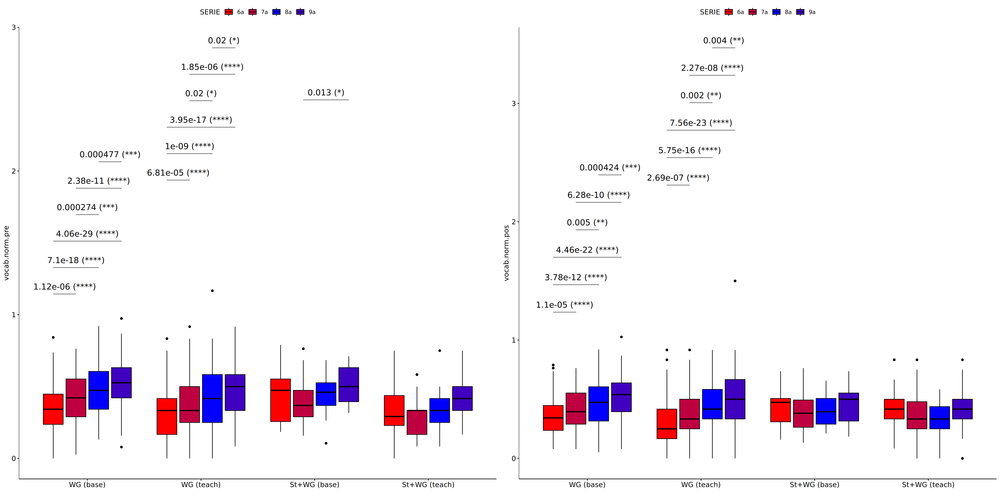<!-- -->

``` r
if (!is.null(plots[["vocab.norm.pre"]][["SERIE"]]) &&
    !is.null(plots[["vocab.norm.pos"]][["SERIE"]])) {
  egg::ggarrange(plots[["vocab.norm.pre"]][["SERIE"]],
                 plots[["vocab.norm.pos"]][["SERIE"]], nrow = 1)
}
```

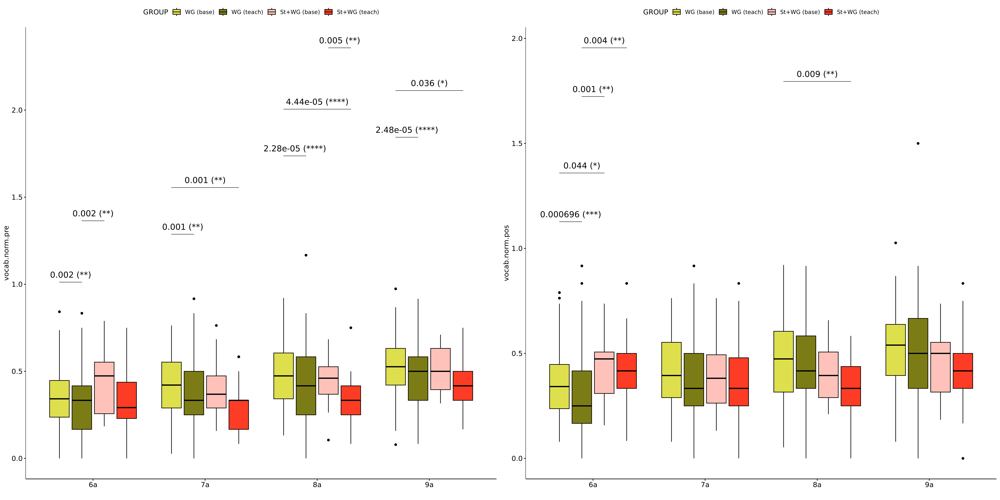<!-- -->

### Plot to compare differences (1st)

``` r
psch = sch[["vocab.dif"]]
idx = which(psch$Effect == "GROUP:SERIE") 

dof = floor(as.double(psch$Df[idx]))
dof.res = floor(as.double(psch$Df[which(psch$Effect == "Residuals")]))
statistic = round(as.double(psch$H[idx]), 3)
p = round(as.double(psch[["p.value"]][idx]), 3)
pval = ifelse(p < 0.001,paste0(" , p<0.001"),paste0(" , p=",p))

if (!is.null(plots[["vocab.dif"]][["GROUP"]]))
  plots[["vocab.dif"]][["GROUP"]] +
    labs(subtitle = paste0("Scheirer-Ray-Hare H(", dof, ",", 
          dof.res, ")=", statistic, pval),
         caption = get_pwc_label(pwc[["vocab.dif"]][["SERIE"]])) +
    ylab("score (dif)") +
  theme(strip.text = element_text(size = 14),
        axis.text = element_text(size = 14))
```

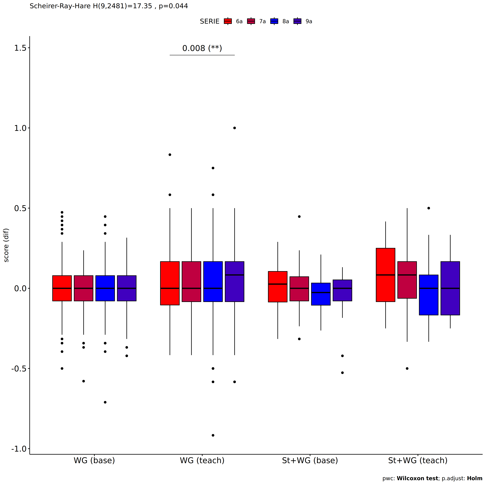<!-- -->

### Plot to compare differences (1st)

``` r
psch = sch[["vocab.dif"]]
idx = which(psch$Effect == "GROUP:SERIE") 

dof = floor(as.double(psch$Df[idx]))
dof.res = floor(as.double(psch$Df[which(psch$Effect == "Residuals")]))
statistic = round(as.double(psch$H[idx]), 3)
p = round(as.double(psch[["p.value"]][idx]), 3)
pval = ifelse(p < 0.001,paste0(" , p<0.001"),paste0(" , p=",p))

if (!is.null(plots[["vocab.dif"]][["SERIE"]]))
  plots[["vocab.dif"]][["SERIE"]] +
    labs(subtitle = paste0("Scheirer-Ray-Hare H(", dof, ",", 
          dof.res, ")=", statistic, pval),
         caption = get_pwc_label(pwc[["vocab.dif"]][["GROUP"]])) +
    ylab("score (dif)") +
  theme(strip.text = element_text(size = 14),
        axis.text = element_text(size = 14))
```

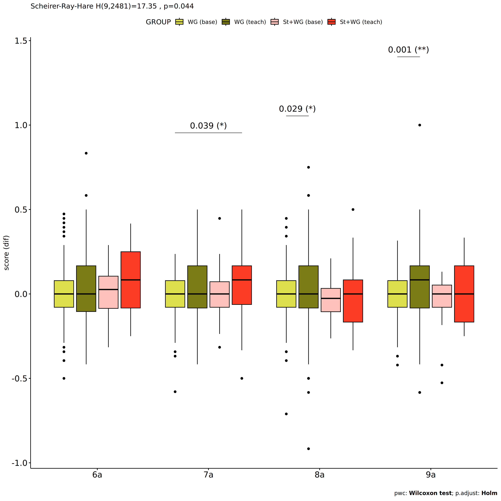<!-- -->

### Plot to compare differences using in one comparison

``` r
psch = sch[["vocab.dif"]]
idx = which(psch$Effect == "GROUP:SERIE") 

dof = floor(as.double(psch$Df[idx]))
dof.res = floor(as.double(psch$Df[which(psch$Effect == "Residuals")]))
statistic = round(as.double(psch$H[idx]), 3)
p = round(as.double(psch[["p.value"]][idx]), 3)
pval = ifelse(p < 0.001,paste0(" , p<0.001"),paste0(" , p=",p))

dodge = 0.08
x.seg = sum(!is.na(unique(pdat[["SERIE"]])))-1
d.seg = -1*dodge*x.seg/2


pwc2 = pwc[["vocab.dif"]][["GROUP"]][pwc[["vocab.dif"]][["GROUP"]]$p.adj.signif != "ns",]

if (nrow(pwc2) > 0) {
  pwc2 = rstatix::add_xy_position(pwc2, dodge = dodge, fun = "mean_ci")
  
  for (f in sort(unique(pdat[["SERIE"]]))) {
    fbool <- pwc2[["SERIE"]] == f
    if (sum(fbool) > 0) {
      pwc2$xmin[which(fbool)] <- pwc2$xmin[which(fbool)]+d.seg
      pwc2$xmax[which(fbool)] <- pwc2$xmax[which(fbool)]+d.seg
    }
    d.seg <- d.seg + dodge
  }
} 


pwc2g <- pwc[["vocab.dif"]][["SERIE"]][pwc[["vocab.dif"]][["SERIE"]]$p.adj.signif != "ns",]

if (nrow(pwc2g) > 0) {
  pwc2g$y.position <- sapply(seq(1,nrow(pwc2g)), FUN = function(i) {
    rw <- as.list(pwc2g[i,])
    resp = -Inf
    for (atr2 in unique(pdat[["SERIE"]])) {
      idx = which(pdat[["GROUP"]] == rw[["GROUP"]] & pdat[["SERIE"]] == atr2)
      rmax = max(mean_ci(pdat[["vocab.dif"]][c(idx)]))
      if (rmax > resp) resp <- rmax
    }
    return(resp)
  })
  pwc2g$xpos <- sapply(seq(1,nrow(pwc2g)), FUN = function(i) {
    rw <- as.list(pwc2g[i,])
    tmp <- add_x_position(pwc[["vocab.dif"]][["GROUP"]])
    min(tmp$xmin[which(tmp$group1 == rw[["GROUP"]])],
        tmp$xmax[which(tmp$group2 == rw[["GROUP"]])])
  })
  pwc2g$xmin <- pwc2g$xpos - abs(dodge*x.seg/2) 
  pwc2g$xmax <- pwc2g$xpos + abs(dodge*x.seg/2)
}

if (nrow(pwc2) > 0) {
  pwc2$r <- sapply(abs(pwc2$estimate)/1, FUN = function(x) {
     ifelse(x < 0.0001, "<1%", paste0(round(x*100,2), "%"))
  })
}

pd <- ggplot2::position_dodge(width = sum(!is.na(unique(pwc2[["SERIE"]])))*dodge)

lp <- ggpubr::ggline(pdat, x="GROUP", y = "vocab.dif", color = "SERIE", linetype = "SERIE",
                       palette = color[["SERIE"]], plot_type='b', size=2,
                       position = pd, add = "mean_ci", ylab = "")

if (nrow(pwc2) > 0)
  lp <- lp + ggpubr::stat_pvalue_manual(pwc2, color = "SERIE", linetype = "SERIE",
                                          hide.ns = T, tip.length = 0,
                                          label = "{ r } ({ p.adj.signif })")

if (nrow(pwc2g) > 0) {
  y.pos.min = max(pwc2g$y.position)/10
  if (nrow(pwc2) > 0)
    y.pos.min = max(pwc2$y.position, pwc2g$y.position)/10
  
  pwc2g$r <- sapply(abs(pwc2g$estimate)/1, FUN = function(x) {
     ifelse(x < 0.0001, "<1%", paste0(round(x*100,2), "%"))
  })
  pwc2g$y.position <- pwc2g$y.position + y.pos.min
  
  for (i in which(pwc2g$p.adj < 0.05)) {
    x1 = pwc2g$xmin[i]
    x2 = pwc2g$xmax[i]
    y.pos = pwc2g$y.position[i]
    label = pwc2g$p.adj.signif[i]
    label = paste0(pwc2g$r[i]," (",label,")")
    
    lp <- lp + ggplot2::geom_segment(x = x1, y = y.pos, xend = x2, yend = y.pos) +
      ggplot2::geom_text(x=(x1+x2)/2, y = y.pos+y.pos.min/3, label=label)
  }
}

lp + labs(subtitle = paste0("Scheirer-Ray-Hare H(", dof, ",", 
                            dof.res, ")=", statistic, pval),
          caption = get_pwc_label(pwc[["vocab.dif"]][["SERIE"]])) +
  xlab("") + ylab("") +
  theme(strip.text = element_text(size = 14),
        axis.text = element_text(size = 14))
```

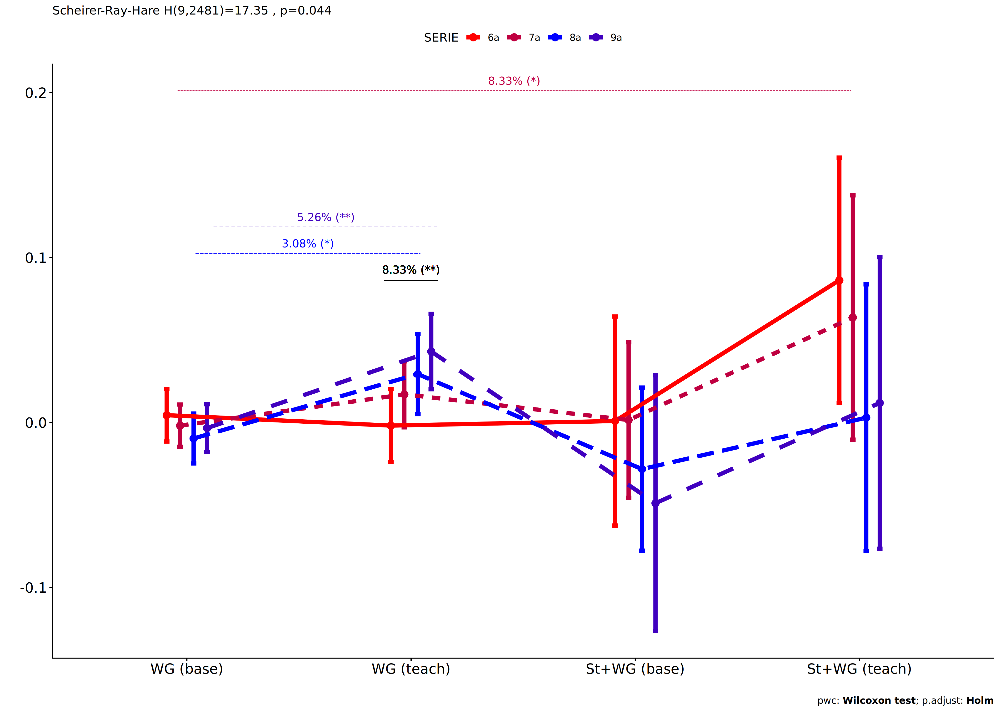<!-- -->

# Two-way factor analysis for: *score ~ GROUP:ESCOLA*

``` r
pdat = remove_group_data(
  dat[!is.na(dat[["GROUP"]]) & !is.na(dat[["ESCOLA"]]),],
  "vocab.dif", c("GROUP","ESCOLA"))

pdat.long <- rbind(pdat[,c("id","GROUP","ESCOLA")],
                   pdat[,c("id","GROUP","ESCOLA")])
pdat.long[["time"]] <- c(rep("pre", nrow(pdat)), rep("pos", nrow(pdat)))
pdat.long[["time"]] <- factor(pdat.long[["time"]], c("pre","pos"))
pdat.long[["score"]] <- c(pdat[["vocab.norm.pre"]], pdat[["vocab.norm.pos"]])

y.position.min <- abs(
  max(pdat.long[["score"]])
  - min(pdat.long[["score"]]))/15

lvars = as.list(c("vocab.dif","vocab.norm.pos","vocab.norm.pre"))
names(lvars) = unlist(lvars)
```

## Pre-test and Post-test PairWise comparisons for: *score ~ GROUP:ESCOLA*

``` r
pwc.long <- group_by(pdat.long, GROUP:ESCOLA) %>%
  pairwise_wilcox_test(score ~ time, detailed = T)

df <- pwc.long[,c(".y.","GROUP:ESCOLA","group1","group2","n1","n2","estimate",
                  "statistic","p.adj","p.adj.signif")]
```

| .y. | GROUP:ESCOLA | group1 | group2 | n1 | n2 | estimate | statistic | p.adj | p.adj.signif |
|:---|:---|:---|:---|---:|---:|---:|---:|---:|:---|
| score | WG (base):PROF MARIA | pre | pos | 277 | 277 | 0.0000401 | 39230.0 | 0.646 | ns |
| score | WG (base):PADRE ANCHIETA | pre | pos | 89 | 89 | 0.0262882 | 4155.5 | 0.571 | ns |
| score | WG (base):PROF RICARDO | pre | pos | 488 | 488 | 0.0000049 | 123910.5 | 0.271 | ns |
| score | WG (base):PADRE MOUSINHO | pre | pos | 234 | 234 | -0.0262930 | 25852.5 | 0.297 | ns |
| score | WG (base):VER PORFIRIO | pre | pos | 50 | 50 | -0.0000741 | 1206.5 | 0.766 | ns |
| score | WG (teach):PROF MARIA | pre | pos | 277 | 277 | -0.0000695 | 37965.0 | 0.831 | ns |
| score | WG (teach):PADRE ANCHIETA | pre | pos | 89 | 89 | -0.0833102 | 3338.0 | 0.068 | ns |
| score | WG (teach):PROF RICARDO | pre | pos | 487 | 487 | -0.0000025 | 113780.0 | 0.270 | ns |
| score | WG (teach):PADRE MOUSINHO | pre | pos | 234 | 234 | 0.0000000 | 26100.0 | 0.379 | ns |
| score | WG (teach):VER PORFIRIO | pre | pos | 50 | 50 | -0.0833234 | 928.0 | 0.025 | \* |
| score | St+WG (base):PROF MARIA | pre | pos | 22 | 22 | 0.0526692 | 289.0 | 0.274 | ns |
| score | St+WG (base):PROF RICARDO | pre | pos | 37 | 37 | 0.0264071 | 758.0 | 0.429 | ns |
| score | St+WG (base):PADRE MOUSINHO | pre | pos | 35 | 35 | -0.0262994 | 561.5 | 0.552 | ns |
| score | St+WG (base):VER PORFIRIO | pre | pos | 13 | 13 | -0.0000379 | 84.0 | 1.000 | ns |
| score | St+WG (teach):PROF MARIA | pre | pos | 22 | 22 | 0.0000228 | 249.0 | 0.878 | ns |
| score | St+WG (teach):PROF RICARDO | pre | pos | 37 | 37 | -0.0000694 | 638.0 | 0.613 | ns |
| score | St+WG (teach):PADRE MOUSINHO | pre | pos | 35 | 35 | -0.0833706 | 436.5 | 0.037 | \* |
| score | St+WG (teach):VER PORFIRIO | pre | pos | 13 | 13 | -0.0833134 | 58.0 | 0.172 | ns |

### Plot to compare pre- and post-test

``` r
pwc.long <- group_by(pdat.long, GROUP, ESCOLA) %>%
  pairwise_wilcox_test(score ~ time, detailed = T)

stat.test <- pwc.long %>% add_xy_position(x = "time", fun = "mean_ci")
sidx = which(stat.test$p.adj.signif != "ns")
stat.test$y.position[sidx] <- stat.test$y.position[sidx] + y.position.min * (1:length(sidx))

gg <- ggline(
  pdat.long, x = "time", y = "score",
  color = "ESCOLA", linetype = "ESCOLA", shape = "ESCOLA", size = 1.5,
  facet.by = "GROUP", add = c("mean_ci"),
  position = position_dodge(width = 0.3), palette = color[["ESCOLA"]])

pdat.long$xj = jitter(as.numeric(pdat.long[["time"]]), amount=.1)
pdat.long$yj = jitter(pdat.long[["score"]], amount = .01)

gg + geom_point(
  data = pdat.long, aes_string(x="xj",y="yj",colour="ESCOLA"), size=0.5) +
  stat_pvalue_manual(
    stat.test, tip.length = 0, hide.ns = T, label.size = 5,
    position = position_dodge(width = 0.3), color = "ESCOLA",
    label = "{ p.adj } ({ p.adj.signif })") + xlab("") + ylab("") +
  ylim(min(pdat.long$yj), max(pdat.long$yj)) +
  theme(strip.text = element_text(size = 14),
        axis.text = element_text(size = 14))
```

    ## Warning: Removed 1 row containing non-finite outside the scale range
    ## (`stat_summary()`).

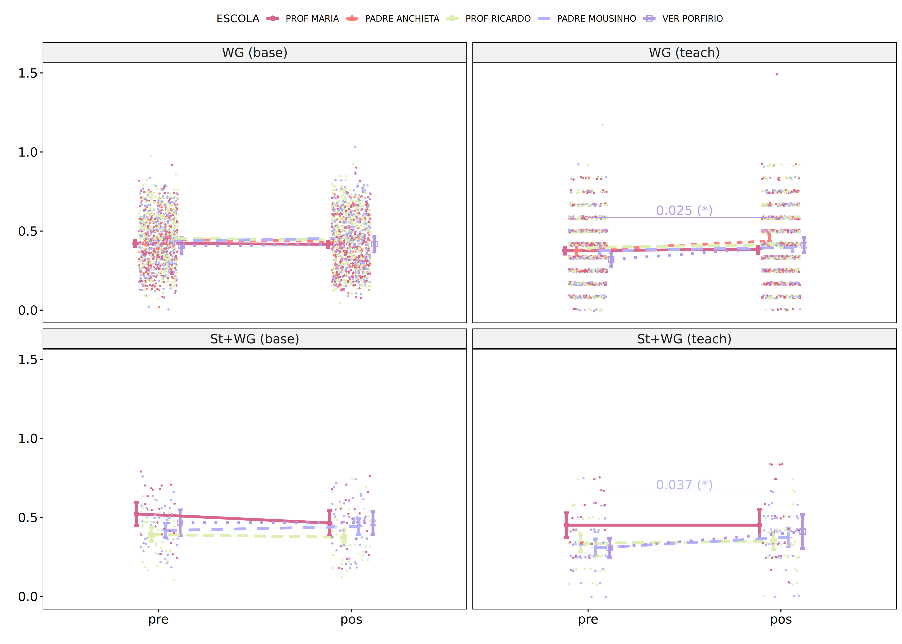<!-- -->

### New plot including percentagens in the differences

``` r
stat.test <- pwc.long %>% add_xy_position(x = "time", fun = "mean_ci")

stat.test$r <- sapply(abs(stat.test$estimate)/1, FUN = function(x) {
   ifelse(x < 0.0001, "<1%", paste0(round(x*100,2), "%"))
})

gg <- ggline(
  pdat.long[pdat.long$GROUP %in% c("WG (teach)","St+WG (teach)"),], x = "time", y = "score",
  color = "ESCOLA", linetype = "ESCOLA", shape = "ESCOLA", size = 2,
  facet.by = "GROUP", add = c("mean_ci"),
  position = position_dodge(width = 0.3), palette = color[["ESCOLA"]]) +
  stat_pvalue_manual(
    stat.test, tip.length = 0, hide.ns = T, label.size = 5,
    color = "ESCOLA",
    label = "{ r } ({ p.adj.signif })") + xlab("") + ylab("")

gg + theme(strip.text = element_text(size = 14),
           axis.text = element_text(size = 14))
```

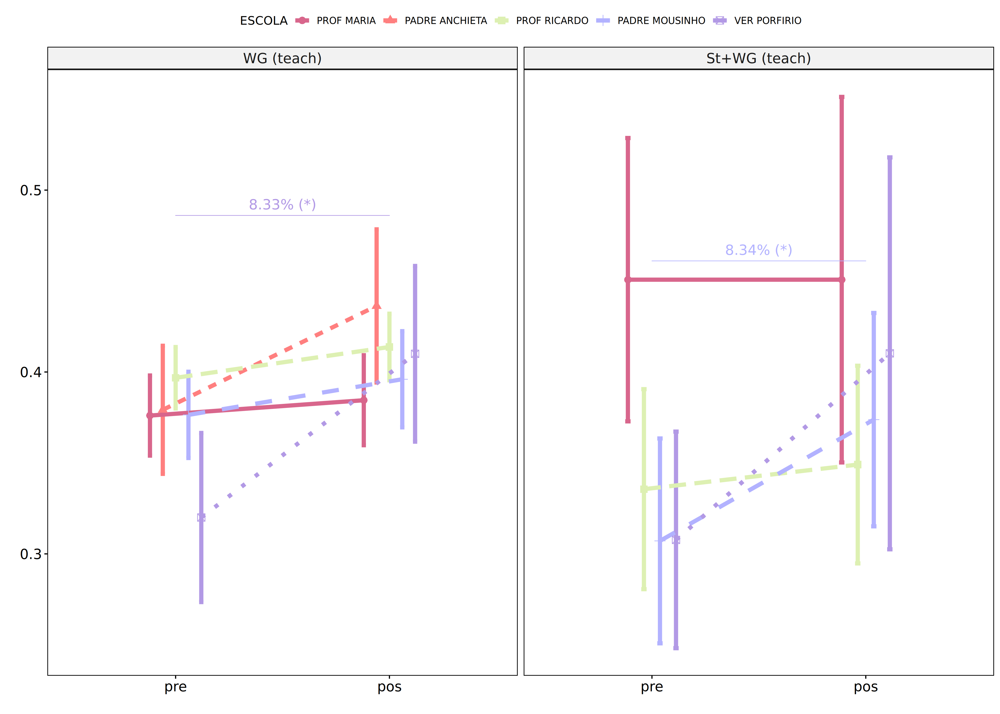<!-- -->

## Scheirer and Wilcoxon PairWise comparisons for: *score ~ GROUP:ESCOLA*

``` r
sch <- lapply(lvars, FUN = function(x) {
  scheirer.test(pdat, x, c("GROUP","ESCOLA"), as.table = T) 
})
df <- do.call(rbind.fill, sch)
```

| var            | Effect       |   Df |     Sum Sq |         H |   p.value | p.value.signif |
|:---------------|:-------------|-----:|-----------:|----------:|----------:|:---------------|
| vocab.dif      | GROUP        |    3 |    9272414 | 18.001654 | 0.0004395 | \*\*\*         |
| vocab.dif      | ESCOLA       |    4 |    8413408 | 16.333962 | 0.0026023 | \*\*           |
| vocab.dif      | GROUP:ESCOLA |   10 |    7918945 | 15.374002 | 0.1190097 | ns             |
| vocab.dif      | Residuals    | 2471 | 1255711614 |           |           |                |
| vocab.norm.pos | GROUP        |    3 |   11231554 | 21.802053 | 0.0000717 | \*\*\*\*       |
| vocab.norm.pos | ESCOLA       |    4 |    3274465 |  6.356206 | 0.1740791 | ns             |
| vocab.norm.pos | GROUP:ESCOLA |   10 |    8307476 | 16.126001 | 0.0960818 | ns             |
| vocab.norm.pos | Residuals    | 2471 | 1258869192 |           |           |                |
| vocab.norm.pre | GROUP        |    3 |   40948283 | 79.529088 | 0.0000000 | \*\*\*\*       |
| vocab.norm.pre | ESCOLA       |    4 |    6355269 | 12.343100 | 0.0149742 | \*             |
| vocab.norm.pre | GROUP:ESCOLA |   10 |   11958634 | 23.225863 | 0.0099429 | \*\*           |
| vocab.norm.pre | Residuals    | 2471 | 1221148387 |           |           |                |

``` r
pwc <- lapply(lvars, FUN = function(x) {
  list(
    GROUP = tryCatch(pairwise_wilcox_test(group_by(pdat, ESCOLA),
                                 as.formula(paste0(x," ~ GROUP")), detailed = T)
                         , error = function(e) NULL),
    ESCOLA = tryCatch(pairwise_wilcox_test(group_by(pdat, GROUP),
                                 as.formula(paste0(x," ~ ESCOLA")), detailed = T)
                         , error = function(e) NULL)
  )
})

df <- do.call(rbind.fill, lapply(pwc, FUN =  function(x) {
  do.call(rbind.fill, x)
}))

ivs = c()
if ("GROUP" %in% colnames(df)) ivs = c(ivs, "GROUP")
if ("ESCOLA" %in% colnames(df)) ivs = c(ivs, "ESCOLA")
df <- df[,c(".y.",ivs,"group1","group2","n1","n2","estimate",
            "statistic","p.adj","p.adj.signif")]
```

| .y. | GROUP | ESCOLA | group1 | group2 | n1 | n2 | estimate | statistic | p.adj | p.adj.signif |
|:---|:---|:---|:---|:---|---:|---:|---:|---:|---:|:---|
| vocab.dif |  | PROF MARIA | WG (base) | WG (teach) | 277 | 277 | -0.0000520 | 37873.0 | 1.00e+00 | ns |
| vocab.dif |  | PROF MARIA | WG (base) | St+WG (base) | 277 | 22 | 0.0526984 | 3840.0 | 2.53e-01 | ns |
| vocab.dif |  | PROF MARIA | WG (base) | St+WG (teach) | 277 | 22 | -0.0000726 | 3004.0 | 1.00e+00 | ns |
| vocab.dif |  | PROF MARIA | WG (teach) | St+WG (base) | 277 | 22 | 0.0569935 | 3506.0 | 1.00e+00 | ns |
| vocab.dif |  | PROF MARIA | WG (teach) | St+WG (teach) | 277 | 22 | 0.0000592 | 3098.5 | 1.00e+00 | ns |
| vocab.dif |  | PROF MARIA | St+WG (base) | St+WG (teach) | 22 | 22 | -0.0569741 | 197.5 | 1.00e+00 | ns |
| vocab.dif |  | PADRE ANCHIETA | WG (base) | WG (teach) | 89 | 89 | -0.0657725 | 2882.0 | 2.00e-03 | \*\* |
| vocab.dif |  | PROF RICARDO | WG (base) | WG (teach) | 488 | 487 | -0.0263998 | 105729.5 | 1.70e-02 | \* |
| vocab.dif |  | PROF RICARDO | WG (base) | St+WG (base) | 488 | 37 | -0.0000280 | 8840.5 | 1.00e+00 | ns |
| vocab.dif |  | PROF RICARDO | WG (base) | St+WG (teach) | 488 | 37 | -0.0394998 | 7708.0 | 6.90e-01 | ns |
| vocab.dif |  | PROF RICARDO | WG (teach) | St+WG (base) | 487 | 37 | 0.0263389 | 10136.0 | 8.12e-01 | ns |
| vocab.dif |  | PROF RICARDO | WG (teach) | St+WG (teach) | 487 | 37 | -0.0000283 | 9015.0 | 1.00e+00 | ns |
| vocab.dif |  | PROF RICARDO | St+WG (base) | St+WG (teach) | 37 | 37 | -0.0351051 | 570.0 | 8.12e-01 | ns |
| vocab.dif |  | PADRE MOUSINHO | WG (base) | WG (teach) | 234 | 234 | -0.0000629 | 27302.0 | 1.00e+00 | ns |
| vocab.dif |  | PADRE MOUSINHO | WG (base) | St+WG (base) | 234 | 35 | -0.0000208 | 4085.0 | 1.00e+00 | ns |
| vocab.dif |  | PADRE MOUSINHO | WG (base) | St+WG (teach) | 234 | 35 | -0.0833615 | 3292.0 | 3.68e-01 | ns |
| vocab.dif |  | PADRE MOUSINHO | WG (teach) | St+WG (base) | 234 | 35 | -0.0000373 | 3941.0 | 1.00e+00 | ns |
| vocab.dif |  | PADRE MOUSINHO | WG (teach) | St+WG (teach) | 234 | 35 | -0.0832974 | 3395.5 | 5.10e-01 | ns |
| vocab.dif |  | PADRE MOUSINHO | St+WG (base) | St+WG (teach) | 35 | 35 | -0.0745782 | 512.5 | 9.68e-01 | ns |
| vocab.dif |  | VER PORFIRIO | WG (base) | WG (teach) | 50 | 50 | -0.0789445 | 904.5 | 1.03e-01 | ns |
| vocab.dif |  | VER PORFIRIO | WG (base) | St+WG (base) | 50 | 13 | 0.0000224 | 339.5 | 1.00e+00 | ns |
| vocab.dif |  | VER PORFIRIO | WG (base) | St+WG (teach) | 50 | 13 | -0.0789109 | 207.5 | 2.33e-01 | ns |
| vocab.dif |  | VER PORFIRIO | WG (teach) | St+WG (base) | 50 | 13 | 0.0832668 | 427.0 | 3.20e-01 | ns |
| vocab.dif |  | VER PORFIRIO | WG (teach) | St+WG (teach) | 50 | 13 | -0.0000217 | 327.5 | 1.00e+00 | ns |
| vocab.dif |  | VER PORFIRIO | St+WG (base) | St+WG (teach) | 13 | 13 | -0.0832600 | 50.0 | 3.20e-01 | ns |
| vocab.dif | WG (base) |  | PROF MARIA | PADRE ANCHIETA | 277 | 89 | 0.0263087 | 13143.0 | 1.00e+00 | ns |
| vocab.dif | WG (base) |  | PROF MARIA | PROF RICARDO | 277 | 488 | 0.0000061 | 70644.5 | 1.00e+00 | ns |
| vocab.dif | WG (base) |  | PROF MARIA | PADRE MOUSINHO | 277 | 234 | -0.0262736 | 29611.0 | 7.38e-01 | ns |
| vocab.dif | WG (base) |  | PROF MARIA | VER PORFIRIO | 277 | 50 | -0.0000677 | 6431.0 | 1.00e+00 | ns |
| vocab.dif | WG (base) |  | PADRE ANCHIETA | PROF RICARDO | 89 | 488 | -0.0000809 | 21132.0 | 1.00e+00 | ns |
| vocab.dif | WG (base) |  | PADRE ANCHIETA | PADRE MOUSINHO | 89 | 234 | -0.0263496 | 8801.0 | 2.84e-01 | ns |
| vocab.dif | WG (base) |  | PADRE ANCHIETA | VER PORFIRIO | 89 | 50 | -0.0263867 | 1936.5 | 1.00e+00 | ns |
| vocab.dif | WG (base) |  | PROF RICARDO | PADRE MOUSINHO | 488 | 234 | -0.0263600 | 49407.5 | 3.40e-02 | \* |
| vocab.dif | WG (base) |  | PROF RICARDO | VER PORFIRIO | 488 | 50 | -0.0262781 | 10775.0 | 1.00e+00 | ns |
| vocab.dif | WG (base) |  | PADRE MOUSINHO | VER PORFIRIO | 234 | 50 | 0.0000325 | 5925.5 | 1.00e+00 | ns |
| vocab.dif | WG (teach) |  | PROF MARIA | PADRE ANCHIETA | 277 | 89 | -0.0832441 | 10182.0 | 1.19e-01 | ns |
| vocab.dif | WG (teach) |  | PROF MARIA | PROF RICARDO | 277 | 487 | -0.0000472 | 64714.5 | 1.00e+00 | ns |
| vocab.dif | WG (teach) |  | PROF MARIA | PADRE MOUSINHO | 277 | 234 | -0.0000152 | 30965.0 | 1.00e+00 | ns |
| vocab.dif | WG (teach) |  | PROF MARIA | VER PORFIRIO | 277 | 50 | -0.0833252 | 5326.0 | 9.20e-02 | ns |
| vocab.dif | WG (teach) |  | PADRE ANCHIETA | PROF RICARDO | 89 | 487 | 0.0000217 | 24589.0 | 2.56e-01 | ns |
| vocab.dif | WG (teach) |  | PADRE ANCHIETA | PADRE MOUSINHO | 89 | 234 | 0.0000474 | 11893.5 | 2.56e-01 | ns |
| vocab.dif | WG (teach) |  | PADRE ANCHIETA | VER PORFIRIO | 89 | 50 | -0.0000485 | 2045.0 | 1.00e+00 | ns |
| vocab.dif | WG (teach) |  | PROF RICARDO | PADRE MOUSINHO | 487 | 234 | 0.0000690 | 56896.5 | 1.00e+00 | ns |
| vocab.dif | WG (teach) |  | PROF RICARDO | VER PORFIRIO | 487 | 50 | -0.0832733 | 9741.0 | 1.36e-01 | ns |
| vocab.dif | WG (teach) |  | PADRE MOUSINHO | VER PORFIRIO | 234 | 50 | -0.0833042 | 4586.5 | 1.29e-01 | ns |
| vocab.dif | St+WG (base) |  | PROF MARIA | PROF RICARDO | 22 | 37 | -0.0525763 | 328.5 | 1.00e+00 | ns |
| vocab.dif | St+WG (base) |  | PROF MARIA | PADRE MOUSINHO | 22 | 35 | -0.0789048 | 250.5 | 1.67e-01 | ns |
| vocab.dif | St+WG (base) |  | PROF MARIA | VER PORFIRIO | 22 | 13 | -0.0563001 | 108.0 | 1.00e+00 | ns |
| vocab.dif | St+WG (base) |  | PROF RICARDO | PADRE MOUSINHO | 37 | 35 | -0.0262802 | 595.5 | 1.00e+00 | ns |
| vocab.dif | St+WG (base) |  | PROF RICARDO | VER PORFIRIO | 37 | 13 | -0.0262613 | 228.0 | 1.00e+00 | ns |
| vocab.dif | St+WG (base) |  | PADRE MOUSINHO | VER PORFIRIO | 35 | 13 | 0.0000149 | 242.0 | 1.00e+00 | ns |
| vocab.dif | St+WG (teach) |  | PROF MARIA | PROF RICARDO | 22 | 37 | -0.0000350 | 380.0 | 1.00e+00 | ns |
| vocab.dif | St+WG (teach) |  | PROF MARIA | PADRE MOUSINHO | 22 | 35 | -0.0833351 | 296.0 | 8.76e-01 | ns |
| vocab.dif | St+WG (teach) |  | PROF MARIA | VER PORFIRIO | 22 | 13 | -0.0833451 | 101.0 | 8.76e-01 | ns |
| vocab.dif | St+WG (teach) |  | PROF RICARDO | PADRE MOUSINHO | 37 | 35 | -0.0832857 | 520.0 | 8.76e-01 | ns |
| vocab.dif | St+WG (teach) |  | PROF RICARDO | VER PORFIRIO | 37 | 13 | -0.0833215 | 189.0 | 8.76e-01 | ns |
| vocab.dif | St+WG (teach) |  | PADRE MOUSINHO | VER PORFIRIO | 35 | 13 | -0.0000382 | 225.0 | 1.00e+00 | ns |
| vocab.norm.pos |  | PROF MARIA | WG (base) | WG (teach) | 277 | 277 | 0.0393850 | 42915.0 | 9.40e-02 | ns |
| vocab.norm.pos |  | PROF MARIA | WG (base) | St+WG (base) | 277 | 22 | -0.0525884 | 2575.5 | 8.88e-01 | ns |
| vocab.norm.pos |  | PROF MARIA | WG (base) | St+WG (teach) | 277 | 22 | -0.0219138 | 2883.5 | 1.00e+00 | ns |
| vocab.norm.pos |  | PROF MARIA | WG (teach) | St+WG (base) | 277 | 22 | -0.0965542 | 2243.0 | 1.91e-01 | ns |
| vocab.norm.pos |  | PROF MARIA | WG (teach) | St+WG (teach) | 277 | 22 | -0.0833288 | 2573.5 | 8.88e-01 | ns |
| vocab.norm.pos |  | PROF MARIA | St+WG (base) | St+WG (teach) | 22 | 22 | 0.0263372 | 263.0 | 1.00e+00 | ns |
| vocab.norm.pos |  | PADRE ANCHIETA | WG (base) | WG (teach) | 89 | 89 | 0.0000530 | 3970.0 | 9.79e-01 | ns |
| vocab.norm.pos |  | PROF RICARDO | WG (base) | WG (teach) | 488 | 487 | 0.0350396 | 128827.5 | 1.14e-01 | ns |
| vocab.norm.pos |  | PROF RICARDO | WG (base) | St+WG (base) | 488 | 37 | 0.0788892 | 11050.5 | 1.14e-01 | ns |
| vocab.norm.pos |  | PROF RICARDO | WG (base) | St+WG (teach) | 488 | 37 | 0.0921143 | 11632.0 | 2.00e-02 | \* |
| vocab.norm.pos |  | PROF RICARDO | WG (teach) | St+WG (base) | 487 | 37 | 0.0307509 | 10049.0 | 4.78e-01 | ns |
| vocab.norm.pos |  | PROF RICARDO | WG (teach) | St+WG (teach) | 487 | 37 | 0.0832353 | 10619.5 | 2.03e-01 | ns |
| vocab.norm.pos |  | PROF RICARDO | St+WG (base) | St+WG (teach) | 37 | 37 | 0.0131104 | 739.0 | 5.58e-01 | ns |
| vocab.norm.pos |  | PADRE MOUSINHO | WG (base) | WG (teach) | 234 | 234 | 0.0657523 | 32216.0 | 6.00e-03 | \*\* |
| vocab.norm.pos |  | PADRE MOUSINHO | WG (base) | St+WG (base) | 234 | 35 | 0.0000418 | 4238.0 | 1.00e+00 | ns |
| vocab.norm.pos |  | PADRE MOUSINHO | WG (base) | St+WG (teach) | 234 | 35 | 0.0658181 | 4990.0 | 1.85e-01 | ns |
| vocab.norm.pos |  | PADRE MOUSINHO | WG (teach) | St+WG (base) | 234 | 35 | -0.0482799 | 3464.0 | 5.60e-01 | ns |
| vocab.norm.pos |  | PADRE MOUSINHO | WG (teach) | St+WG (teach) | 234 | 35 | 0.0000493 | 4183.5 | 1.00e+00 | ns |
| vocab.norm.pos |  | PADRE MOUSINHO | St+WG (base) | St+WG (teach) | 35 | 35 | 0.0570750 | 737.0 | 5.60e-01 | ns |
| vocab.norm.pos |  | VER PORFIRIO | WG (base) | WG (teach) | 50 | 50 | -0.0131109 | 1236.0 | 1.00e+00 | ns |
| vocab.norm.pos |  | VER PORFIRIO | WG (base) | St+WG (base) | 50 | 13 | -0.0788891 | 246.0 | 7.45e-01 | ns |
| vocab.norm.pos |  | VER PORFIRIO | WG (base) | St+WG (teach) | 50 | 13 | 0.0042182 | 325.0 | 1.00e+00 | ns |
| vocab.norm.pos |  | VER PORFIRIO | WG (teach) | St+WG (base) | 50 | 13 | -0.0832916 | 214.0 | 3.50e-01 | ns |
| vocab.norm.pos |  | VER PORFIRIO | WG (teach) | St+WG (teach) | 50 | 13 | 0.0000370 | 333.5 | 1.00e+00 | ns |
| vocab.norm.pos |  | VER PORFIRIO | St+WG (base) | St+WG (teach) | 13 | 13 | 0.0877670 | 113.0 | 7.45e-01 | ns |
| vocab.norm.pos | WG (base) |  | PROF MARIA | PADRE ANCHIETA | 277 | 89 | -0.0263082 | 11566.0 | 1.00e+00 | ns |
| vocab.norm.pos | WG (base) |  | PROF MARIA | PROF RICARDO | 277 | 488 | -0.0262955 | 62149.5 | 5.75e-01 | ns |
| vocab.norm.pos | WG (base) |  | PROF MARIA | PADRE MOUSINHO | 277 | 234 | -0.0263327 | 28443.5 | 1.70e-01 | ns |
| vocab.norm.pos | WG (base) |  | PROF MARIA | VER PORFIRIO | 277 | 50 | 0.0000184 | 6948.0 | 1.00e+00 | ns |
| vocab.norm.pos | WG (base) |  | PADRE ANCHIETA | PROF RICARDO | 89 | 488 | -0.0000733 | 21315.5 | 1.00e+00 | ns |
| vocab.norm.pos | WG (base) |  | PADRE ANCHIETA | PADRE MOUSINHO | 89 | 234 | -0.0262429 | 9786.5 | 1.00e+00 | ns |
| vocab.norm.pos | WG (base) |  | PADRE ANCHIETA | VER PORFIRIO | 89 | 50 | 0.0262720 | 2369.0 | 1.00e+00 | ns |
| vocab.norm.pos | WG (base) |  | PROF RICARDO | PADRE MOUSINHO | 488 | 234 | -0.0000288 | 54968.0 | 1.00e+00 | ns |
| vocab.norm.pos | WG (base) |  | PROF RICARDO | VER PORFIRIO | 488 | 50 | 0.0263608 | 13194.5 | 1.00e+00 | ns |
| vocab.norm.pos | WG (base) |  | PADRE MOUSINHO | VER PORFIRIO | 234 | 50 | 0.0526212 | 6613.5 | 1.00e+00 | ns |
| vocab.norm.pos | WG (teach) |  | PROF MARIA | PADRE ANCHIETA | 277 | 89 | -0.0832729 | 10443.0 | 2.89e-01 | ns |
| vocab.norm.pos | WG (teach) |  | PROF MARIA | PROF RICARDO | 277 | 487 | -0.0000322 | 61439.5 | 3.51e-01 | ns |
| vocab.norm.pos | WG (teach) |  | PROF MARIA | PADRE MOUSINHO | 277 | 234 | -0.0000047 | 31180.0 | 1.00e+00 | ns |
| vocab.norm.pos | WG (teach) |  | PROF MARIA | VER PORFIRIO | 277 | 50 | -0.0000133 | 6338.5 | 1.00e+00 | ns |
| vocab.norm.pos | WG (teach) |  | PADRE ANCHIETA | PROF RICARDO | 89 | 487 | 0.0000085 | 23015.5 | 1.00e+00 | ns |
| vocab.norm.pos | WG (teach) |  | PADRE ANCHIETA | PADRE MOUSINHO | 89 | 234 | 0.0833087 | 11588.0 | 9.20e-01 | ns |
| vocab.norm.pos | WG (teach) |  | PADRE ANCHIETA | VER PORFIRIO | 89 | 50 | 0.0000101 | 2418.5 | 1.00e+00 | ns |
| vocab.norm.pos | WG (teach) |  | PROF RICARDO | PADRE MOUSINHO | 487 | 234 | 0.0000560 | 59737.0 | 1.00e+00 | ns |
| vocab.norm.pos | WG (teach) |  | PROF RICARDO | VER PORFIRIO | 487 | 50 | 0.0000234 | 12357.0 | 1.00e+00 | ns |
| vocab.norm.pos | WG (teach) |  | PADRE MOUSINHO | VER PORFIRIO | 234 | 50 | -0.0000554 | 5607.0 | 1.00e+00 | ns |
| vocab.norm.pos | St+WG (base) |  | PROF MARIA | PROF RICARDO | 22 | 37 | 0.1052129 | 527.5 | 2.98e-01 | ns |
| vocab.norm.pos | St+WG (base) |  | PROF MARIA | PADRE MOUSINHO | 22 | 35 | 0.0263629 | 423.5 | 1.00e+00 | ns |
| vocab.norm.pos | St+WG (base) |  | PROF MARIA | VER PORFIRIO | 22 | 13 | 0.0262544 | 150.0 | 1.00e+00 | ns |
| vocab.norm.pos | St+WG (base) |  | PROF RICARDO | PADRE MOUSINHO | 37 | 35 | -0.0790233 | 480.5 | 2.98e-01 | ns |
| vocab.norm.pos | St+WG (base) |  | PROF RICARDO | VER PORFIRIO | 37 | 13 | -0.1053219 | 146.0 | 2.23e-01 | ns |
| vocab.norm.pos | St+WG (base) |  | PADRE MOUSINHO | VER PORFIRIO | 35 | 13 | -0.0000120 | 212.5 | 1.00e+00 | ns |
| vocab.norm.pos | St+WG (teach) |  | PROF MARIA | PROF RICARDO | 22 | 37 | 0.0832764 | 506.5 | 6.96e-01 | ns |
| vocab.norm.pos | St+WG (teach) |  | PROF MARIA | PADRE MOUSINHO | 22 | 35 | 0.0000558 | 426.5 | 1.00e+00 | ns |
| vocab.norm.pos | St+WG (teach) |  | PROF MARIA | VER PORFIRIO | 22 | 13 | 0.0000296 | 156.5 | 1.00e+00 | ns |
| vocab.norm.pos | St+WG (teach) |  | PROF RICARDO | PADRE MOUSINHO | 37 | 35 | -0.0832834 | 541.0 | 1.00e+00 | ns |
| vocab.norm.pos | St+WG (teach) |  | PROF RICARDO | VER PORFIRIO | 37 | 13 | -0.0000406 | 201.5 | 1.00e+00 | ns |
| vocab.norm.pos | St+WG (teach) |  | PADRE MOUSINHO | VER PORFIRIO | 35 | 13 | 0.0000076 | 231.0 | 1.00e+00 | ns |
| vocab.norm.pre |  | PROF MARIA | WG (base) | WG (teach) | 277 | 277 | 0.0525812 | 44913.0 | 3.00e-03 | \*\* |
| vocab.norm.pre |  | PROF MARIA | WG (base) | St+WG (base) | 277 | 22 | -0.1052799 | 2053.0 | 4.30e-02 | \* |
| vocab.norm.pre |  | PROF MARIA | WG (base) | St+WG (teach) | 277 | 22 | -0.0262984 | 2800.0 | 5.27e-01 | ns |
| vocab.norm.pre |  | PROF MARIA | WG (teach) | St+WG (base) | 277 | 22 | -0.1535460 | 1696.0 | 3.00e-03 | \*\* |
| vocab.norm.pre |  | PROF MARIA | WG (teach) | St+WG (teach) | 277 | 22 | -0.0833139 | 2356.0 | 2.22e-01 | ns |
| vocab.norm.pre |  | PROF MARIA | St+WG (base) | St+WG (teach) | 22 | 22 | 0.0788937 | 299.0 | 3.68e-01 | ns |
| vocab.norm.pre |  | PADRE ANCHIETA | WG (base) | WG (teach) | 89 | 89 | 0.0701597 | 4815.0 | 1.30e-02 | \* |
| vocab.norm.pre |  | PROF RICARDO | WG (base) | WG (teach) | 488 | 487 | 0.0613721 | 140824.0 | 3.30e-06 | \*\*\*\* |
| vocab.norm.pre |  | PROF RICARDO | WG (base) | St+WG (base) | 488 | 37 | 0.0526503 | 11022.0 | 1.00e-01 | ns |
| vocab.norm.pre |  | PROF RICARDO | WG (base) | St+WG (teach) | 488 | 37 | 0.1315786 | 12718.0 | 1.65e-04 | \*\*\* |
| vocab.norm.pre |  | PROF RICARDO | WG (teach) | St+WG (base) | 487 | 37 | -0.0000115 | 8964.5 | 9.60e-01 | ns |
| vocab.norm.pre |  | PROF RICARDO | WG (teach) | St+WG (teach) | 487 | 37 | 0.0832895 | 10813.5 | 1.21e-01 | ns |
| vocab.norm.pre |  | PROF RICARDO | St+WG (base) | St+WG (teach) | 37 | 37 | 0.0657816 | 870.0 | 1.21e-01 | ns |
| vocab.norm.pre |  | PADRE MOUSINHO | WG (base) | WG (teach) | 234 | 234 | 0.0614179 | 32698.5 | 1.00e-03 | \*\* |
| vocab.norm.pre |  | PADRE MOUSINHO | WG (base) | St+WG (base) | 234 | 35 | 0.0263053 | 4328.0 | 5.88e-01 | ns |
| vocab.norm.pre |  | PADRE MOUSINHO | WG (base) | St+WG (teach) | 234 | 35 | 0.1359662 | 5851.0 | 2.55e-04 | \*\*\* |
| vocab.norm.pre |  | PADRE MOUSINHO | WG (teach) | St+WG (base) | 234 | 35 | -0.0394868 | 3483.0 | 3.04e-01 | ns |
| vocab.norm.pre |  | PADRE MOUSINHO | WG (teach) | St+WG (teach) | 234 | 35 | 0.0832826 | 4992.0 | 1.05e-01 | ns |
| vocab.norm.pre |  | PADRE MOUSINHO | St+WG (base) | St+WG (teach) | 35 | 35 | 0.1183887 | 861.0 | 1.40e-02 | \* |
| vocab.norm.pre |  | VER PORFIRIO | WG (base) | WG (teach) | 50 | 50 | 0.0877524 | 1602.0 | 6.10e-02 | ns |
| vocab.norm.pre |  | VER PORFIRIO | WG (base) | St+WG (base) | 50 | 13 | -0.0789281 | 254.0 | 4.60e-01 | ns |
| vocab.norm.pre |  | VER PORFIRIO | WG (base) | St+WG (teach) | 50 | 13 | 0.0876566 | 433.0 | 2.02e-01 | ns |
| vocab.norm.pre |  | VER PORFIRIO | WG (teach) | St+WG (base) | 50 | 13 | -0.1359882 | 163.0 | 2.90e-02 | \* |
| vocab.norm.pre |  | VER PORFIRIO | WG (teach) | St+WG (teach) | 50 | 13 | 0.0000007 | 340.0 | 8.02e-01 | ns |
| vocab.norm.pre |  | VER PORFIRIO | St+WG (base) | St+WG (teach) | 13 | 13 | 0.1403549 | 141.0 | 2.30e-02 | \* |
| vocab.norm.pre | WG (base) |  | PROF MARIA | PADRE ANCHIETA | 277 | 89 | -0.0263228 | 11177.5 | 1.00e+00 | ns |
| vocab.norm.pre | WG (base) |  | PROF MARIA | PROF RICARDO | 277 | 488 | -0.0263706 | 59594.5 | 6.40e-02 | ns |
| vocab.norm.pre | WG (base) |  | PROF MARIA | PADRE MOUSINHO | 277 | 234 | -0.0263042 | 30610.0 | 1.00e+00 | ns |
| vocab.norm.pre | WG (base) |  | PROF MARIA | VER PORFIRIO | 277 | 50 | 0.0262500 | 7362.5 | 1.00e+00 | ns |
| vocab.norm.pre | WG (base) |  | PADRE ANCHIETA | PROF RICARDO | 89 | 488 | -0.0000425 | 21322.0 | 1.00e+00 | ns |
| vocab.norm.pre | WG (base) |  | PADRE ANCHIETA | PADRE MOUSINHO | 89 | 234 | 0.0000732 | 10833.0 | 1.00e+00 | ns |
| vocab.norm.pre | WG (base) |  | PADRE ANCHIETA | VER PORFIRIO | 89 | 50 | 0.0525573 | 2532.0 | 1.00e+00 | ns |
| vocab.norm.pre | WG (base) |  | PROF RICARDO | PADRE MOUSINHO | 488 | 234 | 0.0263089 | 60699.0 | 1.00e+00 | ns |
| vocab.norm.pre | WG (base) |  | PROF RICARDO | VER PORFIRIO | 488 | 50 | 0.0526432 | 14105.5 | 6.17e-01 | ns |
| vocab.norm.pre | WG (base) |  | PADRE MOUSINHO | VER PORFIRIO | 234 | 50 | 0.0263757 | 6494.5 | 1.00e+00 | ns |
| vocab.norm.pre | WG (teach) |  | PROF MARIA | PADRE ANCHIETA | 277 | 89 | -0.0000365 | 11936.0 | 1.00e+00 | ns |
| vocab.norm.pre | WG (teach) |  | PROF MARIA | PROF RICARDO | 277 | 487 | -0.0000620 | 62798.5 | 6.60e-01 | ns |
| vocab.norm.pre | WG (teach) |  | PROF MARIA | PADRE MOUSINHO | 277 | 234 | -0.0000654 | 32203.5 | 1.00e+00 | ns |
| vocab.norm.pre | WG (teach) |  | PROF MARIA | VER PORFIRIO | 277 | 50 | 0.0832861 | 7981.0 | 5.82e-01 | ns |
| vocab.norm.pre | WG (teach) |  | PADRE ANCHIETA | PROF RICARDO | 89 | 487 | -0.0000377 | 20610.0 | 1.00e+00 | ns |
| vocab.norm.pre | WG (teach) |  | PADRE ANCHIETA | PADRE MOUSINHO | 89 | 234 | 0.0000013 | 10602.0 | 1.00e+00 | ns |
| vocab.norm.pre | WG (teach) |  | PADRE ANCHIETA | VER PORFIRIO | 89 | 50 | 0.0833002 | 2662.0 | 4.74e-01 | ns |
| vocab.norm.pre | WG (teach) |  | PROF RICARDO | PADRE MOUSINHO | 487 | 234 | 0.0000422 | 60502.5 | 8.75e-01 | ns |
| vocab.norm.pre | WG (teach) |  | PROF RICARDO | VER PORFIRIO | 487 | 50 | 0.0832954 | 14923.0 | 8.00e-02 | ns |
| vocab.norm.pre | WG (teach) |  | PADRE MOUSINHO | VER PORFIRIO | 234 | 50 | 0.0833109 | 6812.0 | 5.25e-01 | ns |
| vocab.norm.pre | St+WG (base) |  | PROF MARIA | PROF RICARDO | 22 | 37 | 0.1315886 | 584.5 | 3.30e-02 | \* |
| vocab.norm.pre | St+WG (base) |  | PROF MARIA | PADRE MOUSINHO | 22 | 35 | 0.1052531 | 529.5 | 9.10e-02 | ns |
| vocab.norm.pre | St+WG (base) |  | PROF MARIA | VER PORFIRIO | 22 | 13 | 0.0700790 | 175.0 | 8.43e-01 | ns |
| vocab.norm.pre | St+WG (base) |  | PROF RICARDO | PADRE MOUSINHO | 37 | 35 | -0.0262925 | 578.0 | 8.43e-01 | ns |
| vocab.norm.pre | St+WG (base) |  | PROF RICARDO | VER PORFIRIO | 37 | 13 | -0.0526957 | 173.0 | 5.48e-01 | ns |
| vocab.norm.pre | St+WG (base) |  | PADRE MOUSINHO | VER PORFIRIO | 35 | 13 | -0.0525997 | 187.5 | 8.43e-01 | ns |
| vocab.norm.pre | St+WG (teach) |  | PROF MARIA | PROF RICARDO | 22 | 37 | 0.0833599 | 556.0 | 9.20e-02 | ns |
| vocab.norm.pre | St+WG (teach) |  | PROF MARIA | PADRE MOUSINHO | 22 | 35 | 0.1666446 | 555.0 | 2.90e-02 | \* |
| vocab.norm.pre | St+WG (teach) |  | PROF MARIA | VER PORFIRIO | 22 | 13 | 0.1666119 | 208.5 | 9.80e-02 | ns |
| vocab.norm.pre | St+WG (teach) |  | PROF RICARDO | PADRE MOUSINHO | 37 | 35 | 0.0000524 | 704.5 | 1.00e+00 | ns |
| vocab.norm.pre | St+WG (teach) |  | PROF RICARDO | VER PORFIRIO | 37 | 13 | 0.0000023 | 249.5 | 1.00e+00 | ns |
| vocab.norm.pre | St+WG (teach) |  | PADRE MOUSINHO | VER PORFIRIO | 35 | 13 | -0.0000600 | 217.0 | 1.00e+00 | ns |

### Plot to compare results from pre and post

``` r
plots <- lapply(lvars, FUN = function(y) {
  livs = list("GROUP", "ESCOLA")
  names(livs) = unlist(livs)
  lapply(livs, FUN = function(x) {
    iv2 = setdiff(names(livs), x)
    if (!is.null(pwc[[y]][[iv2]])) {
      stat.test <- pwc[[y]][[iv2]] %>% add_xy_position(x = x, fun = "max")
      sidx = which(stat.test$p.adj.signif != "ns")
      stat.test$y.position[sidx] <- stat.test$y.position[sidx] + y.position.min * (1:length(sidx))
      
      ggboxplot(pdat, x = x, y = y, fill = iv2, palette = color[[iv2]]) +
        stat_pvalue_manual(stat.test, tip.length = 0, hide.ns = T, label.size = 5,
                           label="{ p.adj } ({ p.adj.signif })") + xlab("")
    }
  })
})
```

``` r
if (!is.null(plots[["vocab.norm.pre"]][["GROUP"]]) &&
    !is.null(plots[["vocab.norm.pos"]][["GROUP"]])) {
  egg::ggarrange(plots[["vocab.norm.pre"]][["GROUP"]],
                 plots[["vocab.norm.pos"]][["GROUP"]], nrow = 1)  
}
```

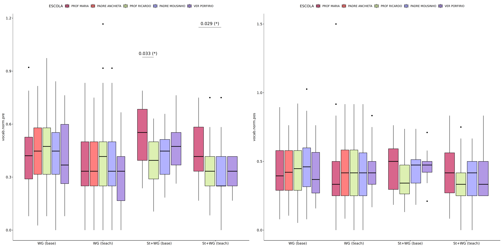<!-- -->

``` r
if (!is.null(plots[["vocab.norm.pre"]][["ESCOLA"]]) &&
    !is.null(plots[["vocab.norm.pos"]][["ESCOLA"]])) {
  egg::ggarrange(plots[["vocab.norm.pre"]][["ESCOLA"]],
                 plots[["vocab.norm.pos"]][["ESCOLA"]], nrow = 1)
}
```

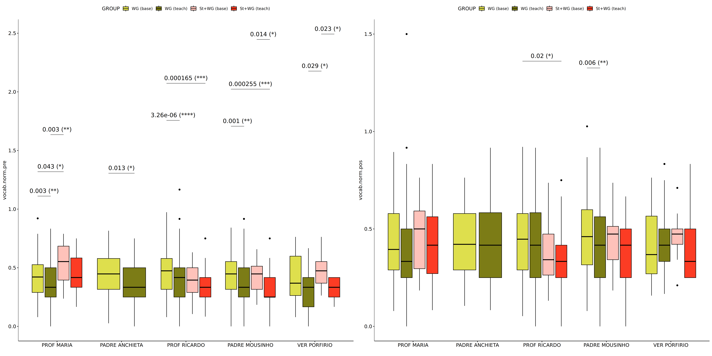<!-- -->

### Plot to compare differences (1st)

``` r
psch = sch[["vocab.dif"]]
idx = which(psch$Effect == "GROUP:ESCOLA") 

dof = floor(as.double(psch$Df[idx]))
dof.res = floor(as.double(psch$Df[which(psch$Effect == "Residuals")]))
statistic = round(as.double(psch$H[idx]), 3)
p = round(as.double(psch[["p.value"]][idx]), 3)
pval = ifelse(p < 0.001,paste0(" , p<0.001"),paste0(" , p=",p))

if (!is.null(plots[["vocab.dif"]][["GROUP"]]))
  plots[["vocab.dif"]][["GROUP"]] +
    labs(subtitle = paste0("Scheirer-Ray-Hare H(", dof, ",", 
          dof.res, ")=", statistic, pval),
         caption = get_pwc_label(pwc[["vocab.dif"]][["ESCOLA"]])) +
    ylab("score (dif)") +
  theme(strip.text = element_text(size = 14),
        axis.text = element_text(size = 14))
```

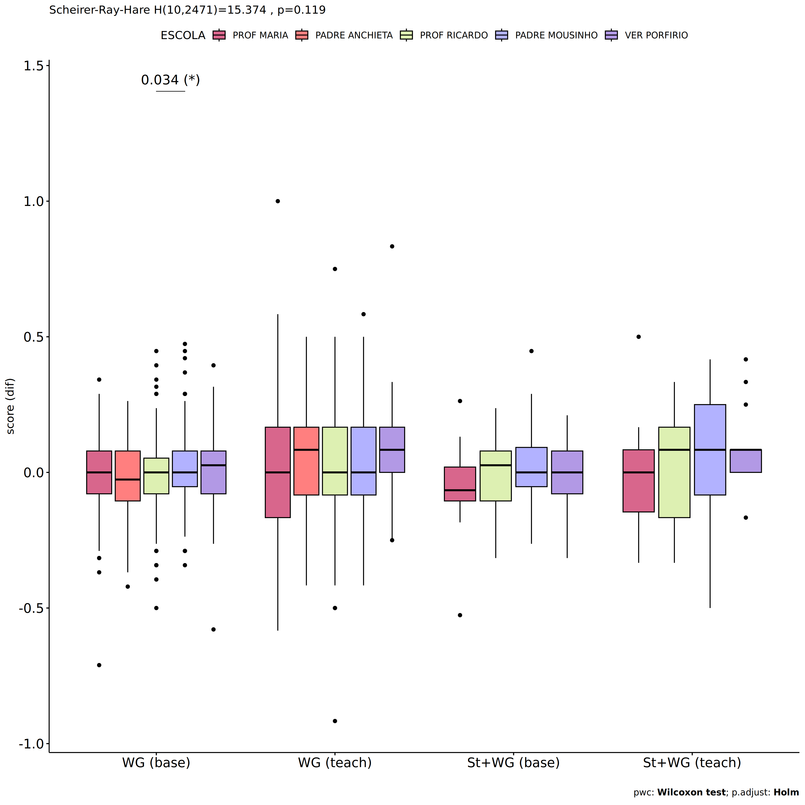<!-- -->

### Plot to compare differences (1st)

``` r
psch = sch[["vocab.dif"]]
idx = which(psch$Effect == "GROUP:ESCOLA") 

dof = floor(as.double(psch$Df[idx]))
dof.res = floor(as.double(psch$Df[which(psch$Effect == "Residuals")]))
statistic = round(as.double(psch$H[idx]), 3)
p = round(as.double(psch[["p.value"]][idx]), 3)
pval = ifelse(p < 0.001,paste0(" , p<0.001"),paste0(" , p=",p))

if (!is.null(plots[["vocab.dif"]][["ESCOLA"]]))
  plots[["vocab.dif"]][["ESCOLA"]] +
    labs(subtitle = paste0("Scheirer-Ray-Hare H(", dof, ",", 
          dof.res, ")=", statistic, pval),
         caption = get_pwc_label(pwc[["vocab.dif"]][["GROUP"]])) +
    ylab("score (dif)") +
  theme(strip.text = element_text(size = 14),
        axis.text = element_text(size = 14))
```

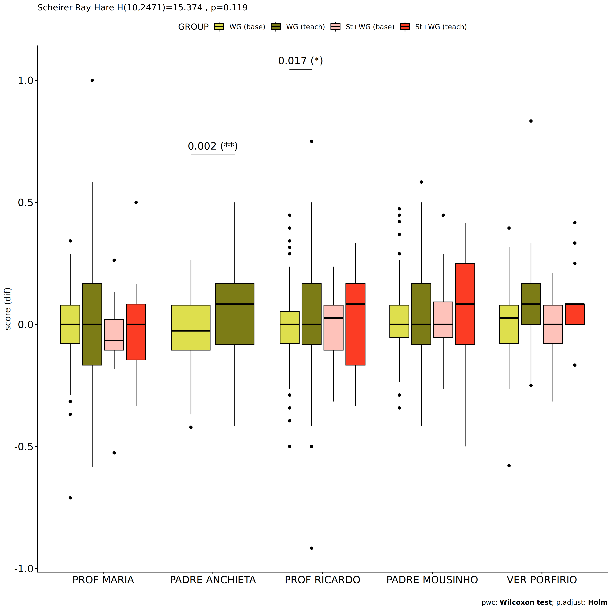<!-- -->

### Plot to compare differences using in one comparison

``` r
psch = sch[["vocab.dif"]]
idx = which(psch$Effect == "GROUP:ESCOLA") 

dof = floor(as.double(psch$Df[idx]))
dof.res = floor(as.double(psch$Df[which(psch$Effect == "Residuals")]))
statistic = round(as.double(psch$H[idx]), 3)
p = round(as.double(psch[["p.value"]][idx]), 3)
pval = ifelse(p < 0.001,paste0(" , p<0.001"),paste0(" , p=",p))

dodge = 0.08
x.seg = sum(!is.na(unique(pdat[["ESCOLA"]])))-1
d.seg = -1*dodge*x.seg/2


pwc2 = pwc[["vocab.dif"]][["GROUP"]][pwc[["vocab.dif"]][["GROUP"]]$p.adj.signif != "ns",]

if (nrow(pwc2) > 0) {
  pwc2 = rstatix::add_xy_position(pwc2, dodge = dodge, fun = "mean_ci")
  
  for (f in sort(unique(pdat[["ESCOLA"]]))) {
    fbool <- pwc2[["ESCOLA"]] == f
    if (sum(fbool) > 0) {
      pwc2$xmin[which(fbool)] <- pwc2$xmin[which(fbool)]+d.seg
      pwc2$xmax[which(fbool)] <- pwc2$xmax[which(fbool)]+d.seg
    }
    d.seg <- d.seg + dodge
  }
} 


pwc2g <- pwc[["vocab.dif"]][["ESCOLA"]][pwc[["vocab.dif"]][["ESCOLA"]]$p.adj.signif != "ns",]

if (nrow(pwc2g) > 0) {
  pwc2g$y.position <- sapply(seq(1,nrow(pwc2g)), FUN = function(i) {
    rw <- as.list(pwc2g[i,])
    resp = -Inf
    for (atr2 in unique(pdat[["ESCOLA"]])) {
      idx = which(pdat[["GROUP"]] == rw[["GROUP"]] & pdat[["ESCOLA"]] == atr2)
      rmax = max(mean_ci(pdat[["vocab.dif"]][c(idx)]))
      if (rmax > resp) resp <- rmax
    }
    return(resp)
  })
  pwc2g$xpos <- sapply(seq(1,nrow(pwc2g)), FUN = function(i) {
    rw <- as.list(pwc2g[i,])
    tmp <- add_x_position(pwc[["vocab.dif"]][["GROUP"]])
    min(tmp$xmin[which(tmp$group1 == rw[["GROUP"]])],
        tmp$xmax[which(tmp$group2 == rw[["GROUP"]])])
  })
  pwc2g$xmin <- pwc2g$xpos - abs(dodge*x.seg/2) 
  pwc2g$xmax <- pwc2g$xpos + abs(dodge*x.seg/2)
}

if (nrow(pwc2) > 0) {
  pwc2$r <- sapply(abs(pwc2$estimate)/1, FUN = function(x) {
     ifelse(x < 0.0001, "<1%", paste0(round(x*100,2), "%"))
  })
}

pd <- ggplot2::position_dodge(width = sum(!is.na(unique(pwc2[["ESCOLA"]])))*dodge)

lp <- ggpubr::ggline(pdat, x="GROUP", y = "vocab.dif", color = "ESCOLA", linetype = "ESCOLA",
                       palette = color[["ESCOLA"]], plot_type='b', size=2,
                       position = pd, add = "mean_ci", ylab = "")

if (nrow(pwc2) > 0)
  lp <- lp + ggpubr::stat_pvalue_manual(pwc2, color = "ESCOLA", linetype = "ESCOLA",
                                          hide.ns = T, tip.length = 0,
                                          label = "{ r } ({ p.adj.signif })")

if (nrow(pwc2g) > 0) {
  y.pos.min = max(pwc2g$y.position)/10
  if (nrow(pwc2) > 0)
    y.pos.min = max(pwc2$y.position, pwc2g$y.position)/10
  
  pwc2g$r <- sapply(abs(pwc2g$estimate)/1, FUN = function(x) {
     ifelse(x < 0.0001, "<1%", paste0(round(x*100,2), "%"))
  })
  pwc2g$y.position <- pwc2g$y.position + y.pos.min
  
  for (i in which(pwc2g$p.adj < 0.05)) {
    x1 = pwc2g$xmin[i]
    x2 = pwc2g$xmax[i]
    y.pos = pwc2g$y.position[i]
    label = pwc2g$p.adj.signif[i]
    label = paste0(pwc2g$r[i]," (",label,")")
    
    lp <- lp + ggplot2::geom_segment(x = x1, y = y.pos, xend = x2, yend = y.pos) +
      ggplot2::geom_text(x=(x1+x2)/2, y = y.pos+y.pos.min/3, label=label)
  }
}

lp + labs(subtitle = paste0("Scheirer-Ray-Hare H(", dof, ",", 
                            dof.res, ")=", statistic, pval),
          caption = get_pwc_label(pwc[["vocab.dif"]][["ESCOLA"]])) +
  xlab("") + ylab("") +
  theme(strip.text = element_text(size = 14),
        axis.text = element_text(size = 14))
```

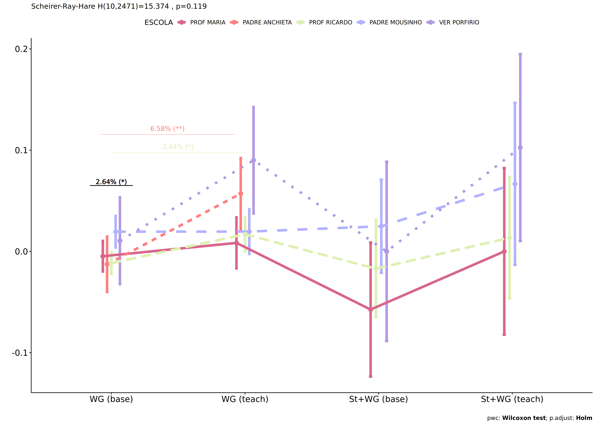<!-- -->
