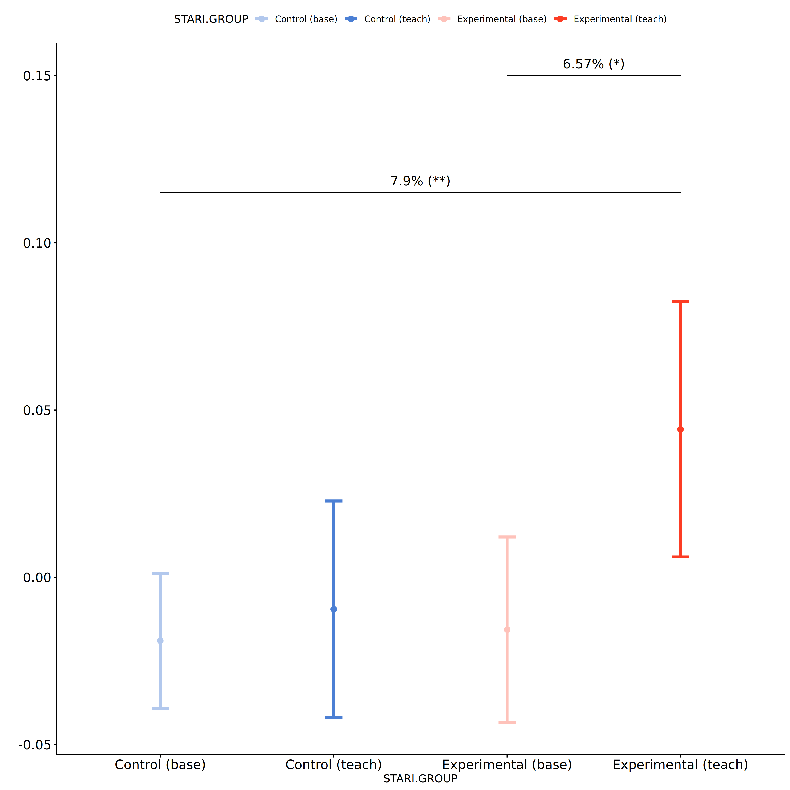
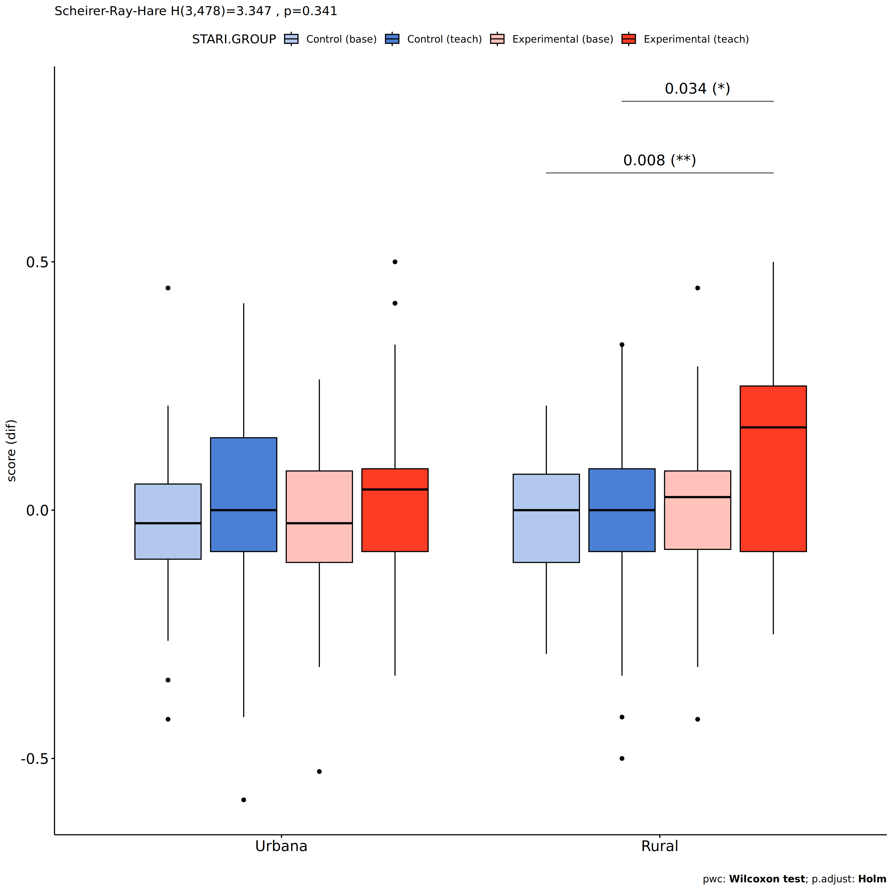
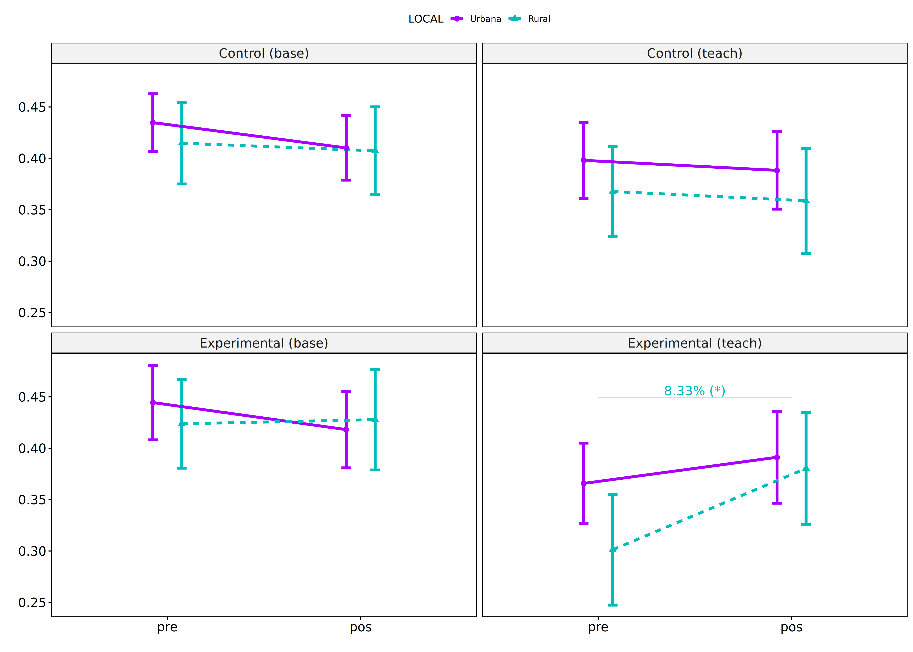

Non-Parametric ANCOVA tests for for assess TDE score
================
Geiser C. Challco <geiser@alumni.usp.br>

- [Setting Initial Variables](#setting-initial-variables)
- [Descriptive Statistics of Initial
  Data](#descriptive-statistics-of-initial-data)
- [One-way factor analysis for: *score ~
  GROUP*](#one-way-factor-analysis-for-score--group)
  - [Pre-test and Post-test PairWise comparisons for: *score ~
    STARI.GROUP*](#pre-test-and-post-test-pairwise-comparisons-for-score--starigroup)
    - [Plot using p.adj as information](#plot-using-padj-as-information)
    - [New Plot using diferences as
      information](#new-plot-using-diferences-as-information)
  - [Kruskal and Wilcoxon PairWise comparisons for: *score ~
    STARI.GROUP*](#kruskal-and-wilcoxon-pairwise-comparisons-for-score--starigroup)
  - [Plots to compare pre- and post
    results](#plots-to-compare-pre--and-post-results)
  - [Plot to compare diferences of
    pre-post](#plot-to-compare-diferences-of-pre-post)
  - [Plots for learning gain with
    percentages](#plots-for-learning-gain-with-percentages)
- [Two-way factor analysis for: *score ~
  GROUP:SEXO*](#two-way-factor-analysis-for-score--groupsexo)
  - [Pre-test and Post-test PairWise comparisons for: *score ~
    STARI.GROUP:SEXO*](#pre-test-and-post-test-pairwise-comparisons-for-score--starigroupsexo)
    - [Plot to compare pre- and
      post-test](#plot-to-compare-pre--and-post-test)
    - [New plot including percentagens in the
      differences](#new-plot-including-percentagens-in-the-differences)
  - [Scheirer and Wilcoxon PairWise comparisons for: *score ~
    STARI.GROUP:SEXO*](#scheirer-and-wilcoxon-pairwise-comparisons-for-score--starigroupsexo)
    - [Plot to compare results from pre and
      post](#plot-to-compare-results-from-pre-and-post)
    - [Plot to compare differences
      (1st)](#plot-to-compare-differences-1st)
    - [Plot to compare differences
      (1st)](#plot-to-compare-differences-1st-1)
    - [Plot to compare differences using in one
      comparison](#plot-to-compare-differences-using-in-one-comparison)
- [Two-way factor analysis for: *score ~
  GROUP:ZONA*](#two-way-factor-analysis-for-score--groupzona)
  - [Pre-test and Post-test PairWise comparisons for: *score ~
    STARI.GROUP:ZONA*](#pre-test-and-post-test-pairwise-comparisons-for-score--starigroupzona)
    - [Plot to compare pre- and
      post-test](#plot-to-compare-pre--and-post-test-1)
    - [New plot including percentagens in the
      differences](#new-plot-including-percentagens-in-the-differences-1)
  - [Scheirer and Wilcoxon PairWise comparisons for: *score ~
    STARI.GROUP:ZONA*](#scheirer-and-wilcoxon-pairwise-comparisons-for-score--starigroupzona)
    - [Plot to compare results from pre and
      post](#plot-to-compare-results-from-pre-and-post-1)
    - [Plot to compare differences
      (1st)](#plot-to-compare-differences-1st-2)
    - [Plot to compare differences
      (1st)](#plot-to-compare-differences-1st-3)
    - [Plot to compare differences using in one
      comparison](#plot-to-compare-differences-using-in-one-comparison-1)
- [Two-way factor analysis for: *score ~
  GROUP:COR.RACA*](#two-way-factor-analysis-for-score--groupcorraca)
  - [Pre-test and Post-test PairWise comparisons for: *score ~
    STARI.GROUP:COR.RACA*](#pre-test-and-post-test-pairwise-comparisons-for-score--starigroupcorraca)
    - [Plot to compare pre- and
      post-test](#plot-to-compare-pre--and-post-test-2)
    - [New plot including percentagens in the
      differences](#new-plot-including-percentagens-in-the-differences-2)
  - [Scheirer and Wilcoxon PairWise comparisons for: *score ~
    STARI.GROUP:COR.RACA*](#scheirer-and-wilcoxon-pairwise-comparisons-for-score--starigroupcorraca)
    - [Plot to compare results from pre and
      post](#plot-to-compare-results-from-pre-and-post-2)
    - [Plot to compare differences
      (1st)](#plot-to-compare-differences-1st-4)
    - [Plot to compare differences
      (1st)](#plot-to-compare-differences-1st-5)
    - [Plot to compare differences using in one
      comparison](#plot-to-compare-differences-using-in-one-comparison-2)
- [Two-way factor analysis for: *score ~
  GROUP:LOCAL*](#two-way-factor-analysis-for-score--grouplocal)
  - [Pre-test and Post-test PairWise comparisons for: *score ~
    STARI.GROUP:LOCAL*](#pre-test-and-post-test-pairwise-comparisons-for-score--starigrouplocal)
    - [Plot to compare pre- and
      post-test](#plot-to-compare-pre--and-post-test-3)
    - [New plot including percentagens in the
      differences](#new-plot-including-percentagens-in-the-differences-3)
  - [Scheirer and Wilcoxon PairWise comparisons for: *score ~
    STARI.GROUP:LOCAL*](#scheirer-and-wilcoxon-pairwise-comparisons-for-score--starigrouplocal)
    - [Plot to compare results from pre and
      post](#plot-to-compare-results-from-pre-and-post-3)
    - [Plot to compare differences
      (1st)](#plot-to-compare-differences-1st-6)
    - [Plot to compare differences
      (1st)](#plot-to-compare-differences-1st-7)
    - [Plot to compare differences using in one
      comparison](#plot-to-compare-differences-using-in-one-comparison-3)
- [Two-way factor analysis for: *score ~
  GROUP:SERIE*](#two-way-factor-analysis-for-score--groupserie)
  - [Pre-test and Post-test PairWise comparisons for: *score ~
    STARI.GROUP:SERIE*](#pre-test-and-post-test-pairwise-comparisons-for-score--starigroupserie)
    - [Plot to compare pre- and
      post-test](#plot-to-compare-pre--and-post-test-4)
    - [New plot including percentagens in the
      differences](#new-plot-including-percentagens-in-the-differences-4)
  - [Scheirer and Wilcoxon PairWise comparisons for: *score ~
    STARI.GROUP:SERIE*](#scheirer-and-wilcoxon-pairwise-comparisons-for-score--starigroupserie)
    - [Plot to compare results from pre and
      post](#plot-to-compare-results-from-pre-and-post-4)
    - [Plot to compare differences
      (1st)](#plot-to-compare-differences-1st-8)
    - [Plot to compare differences
      (1st)](#plot-to-compare-differences-1st-9)
    - [Plot to compare differences using in one
      comparison](#plot-to-compare-differences-using-in-one-comparison-4)
- [Two-way factor analysis for: *score ~
  GROUP:ESCOLA*](#two-way-factor-analysis-for-score--groupescola)
  - [Pre-test and Post-test PairWise comparisons for: *score ~
    STARI.GROUP:ESCOLA*](#pre-test-and-post-test-pairwise-comparisons-for-score--starigroupescola)
    - [Plot to compare pre- and
      post-test](#plot-to-compare-pre--and-post-test-5)
    - [New plot including percentagens in the
      differences](#new-plot-including-percentagens-in-the-differences-5)
  - [Scheirer and Wilcoxon PairWise comparisons for: *score ~
    STARI.GROUP:ESCOLA*](#scheirer-and-wilcoxon-pairwise-comparisons-for-score--starigroupescola)
    - [Plot to compare results from pre and
      post](#plot-to-compare-results-from-pre-and-post-5)
    - [Plot to compare differences
      (1st)](#plot-to-compare-differences-1st-10)
    - [Plot to compare differences
      (1st)](#plot-to-compare-differences-1st-11)
    - [Plot to compare differences using in one
      comparison](#plot-to-compare-differences-using-in-one-comparison-5)

# Setting Initial Variables

``` r
dv = "vocab"
dv.pos = "vocab.norm.pos"
dv.pre = "vocab.norm.pre"
dv.dif = "vocab.dif"

fatores2 <- c("SEXO","ZONA","COR.RACA","LOCAL","SERIE","ESCOLA")
lfatores2 <- as.list(fatores2)
names(lfatores2) <- fatores2

fatores1 <- c("STARI.GROUP", fatores2)
lfatores1 <- as.list(fatores1)
names(lfatores1) <- fatores1

lfatores <- c(lfatores1)

color <- list()
color[["prepost"]] = c("#ffee65","#f28e2B")
color[["STARI.GROUP"]] = c("#b2c8ed","#4b7fd4","#fec2ba","#fc3c24")
color[["SEXO"]] = c("#FF007F","#4D4DFF")
color[["ZONA"]] = c("#AA00FF","#00BBBB")
color[["COR.RACA"]] = c("#b97100","#75c298","#D6B91C","#9F262F","#848283")
color[["LOCAL"]] = c("#AA00FF","#00BBBB")
color[["SERIE"]] = c("#FF0000","#BF0040","#0000FF","#4000BF")
color[["ESCOLA"]] = c("#d8668c","#ff7f7f","#ddf0b2","#b2b2ff","#b299e5")

level <- list()
level[["STARI.GROUP"]] = c("Control (base)","Control (teach)","Experimental (base)","Experimental (teach)")
level[["SEXO"]] = c("F","M")
level[["ZONA"]] = c("Urbana","Rural")
level[["COR.RACA"]] = c("Parda", "Branca", "Amarela", "Indígena", "Preta")
level[["LOCAL"]] = c("Urbana","Rural")
level[["SERIE"]] = c("6a","7a","8a","9a")
level[["ESCOLA"]] = c("PROF MARIA","PADRE ANCHIETA","PROF RICARDO","PADRE MOUSINHO","VER PORFIRIO")


# ..

gdat <- read_excel("../data/dat-norm-vocab.xlsx", sheet = "main")
gdat <- gdat[!is.na(gdat[["STARI.GROUP"]]),]
gdat <- gdat[!is.na(gdat[[dv.pre]]) & !is.na(gdat[[dv.pos]]),]
gdat[[dv.dif]] <- gdat[[dv.pos]] - gdat[[dv.pre]] 

gdat <- gdat[is.na(gdat$NECESSIDADE.DEFICIENCIA) & gdat$vocab.norm.pre != 1 & gdat$vocab.norm.pos != 1,]

dat <- gdat
dat$STARI.GROUP <- factor(dat[["STARI.GROUP"]], level[["STARI.GROUP"]])
for (coln in c(names(lfatores))) {
  if (length(level[[coln]]) > 0)
    plevel = level[[coln]][level[[coln]] %in% unique(dat[[coln]])]
  else
    plevel = unique(dat[[coln]])[!is.na(unique(dat[[coln]]))]
  
  dat[[coln]] <- factor(dat[[coln]], plevel)
}

dat <- dat[,c("id", names(lfatores), dv.pre, dv.pos, dv.dif)]

dat.long <- rbind(dat, dat)
dat.long$time <- c(rep("pre", nrow(dat)), rep("pos", nrow(dat)))
dat.long$time <- factor(dat.long$time, c("pre","pos"))
dat.long[[dv]] <- c(dat[[dv.pre]], dat[[dv.pos]])


for (f in c("STARI.GROUP", names(lfatores))) {
  if (is.null(color[[f]]) && length(unique(dat[[f]])) > 0) 
      color[[f]] <- distinctColorPalette(length(unique(dat[[f]])))
}

for (f in c(fatores2)) {
  if (is.null(color[[paste0("STARI.GROUP:",f)]]) && length(unique(dat[[f]])) > 0)
    color[[paste0("STARI.GROUP:",f)]] <- distinctColorPalette(
      length(unique(dat[["STARI.GROUP"]]))*length(unique(dat[[f]])))
}

ldat <- list()
laov <- list()
lpwc <- list()
lemms <- list()
```

# Descriptive Statistics of Initial Data

``` r
df <- get.descriptives(dat, c(dv.pre, dv.pos, dv.dif), c("STARI.GROUP"),
                       symmetry.test = T, normality.test = F)
df <- plyr::rbind.fill(
  df, do.call(plyr::rbind.fill, lapply(lfatores2, FUN = function(f) {
    if (nrow(dat) > 0 && sum(!is.na(unique(dat[[f]]))) > 1)
      get.descriptives(dat, c(dv.pre,dv.pos), c("STARI.GROUP", f), include.global = F,
                       symmetry.test = T, normality.test = F)
    }))
)
```

    ## Warning: There were 6 warnings in `mutate()`.
    ## The first warning was:
    ## ℹ In argument: `ci = abs(stats::qt(alpha/2, .data$n - 1) * .data$se)`.
    ## Caused by warning:
    ## ! There was 1 warning in `mutate()`.
    ## ℹ In argument: `ci = abs(stats::qt(alpha/2, .data$n - 1) * .data$se)`.
    ## Caused by warning in `stats::qt()`:
    ## ! NaNs produced
    ## ℹ Run `dplyr::last_dplyr_warnings()` to see the 5 remaining warnings.
    ## There were 6 warnings in `mutate()`.
    ## The first warning was:
    ## ℹ In argument: `ci = abs(stats::qt(alpha/2, .data$n - 1) * .data$se)`.
    ## Caused by warning:
    ## ! There was 1 warning in `mutate()`.
    ## ℹ In argument: `ci = abs(stats::qt(alpha/2, .data$n - 1) * .data$se)`.
    ## Caused by warning in `stats::qt()`:
    ## ! NaNs produced
    ## ℹ Run `dplyr::last_dplyr_warnings()` to see the 5 remaining warnings.

``` r
df <- df[,c("variable",fatores1[fatores1 %in% colnames(df)],
            colnames(df)[!colnames(df) %in% c(fatores1,"variable")])]
```

| variable | STARI.GROUP | SEXO | ZONA | COR.RACA | LOCAL | SERIE | ESCOLA | n | mean | median | min | max | sd | se | ci | iqr | symmetry | skewness | kurtosis |
|:---|:---|:---|:---|:---|:---|:---|:---|---:|---:|---:|---:|---:|---:|---:|---:|---:|:---|---:|---:|
| vocab.norm.pre | Control (base) |  |  |  |  |  |  | 140 | 0.428 | 0.434 | 0.105 | 0.763 | 0.136 | 0.011 | 0.023 | 0.191 | YES | 0.0303420 | -0.4999896 |
| vocab.norm.pre | Control (teach) |  |  |  |  |  |  | 140 | 0.388 | 0.417 | 0.000 | 0.833 | 0.171 | 0.014 | 0.029 | 0.250 | YES | -0.0599064 | -0.4890618 |
| vocab.norm.pre | Experimental (base) |  |  |  |  |  |  | 111 | 0.437 | 0.447 | 0.105 | 0.789 | 0.147 | 0.014 | 0.028 | 0.211 | YES | 0.0760574 | -0.6055421 |
| vocab.norm.pre | Experimental (teach) |  |  |  |  |  |  | 111 | 0.343 | 0.333 | 0.000 | 0.750 | 0.169 | 0.016 | 0.032 | 0.167 | YES | 0.4986012 | -0.0499247 |
| vocab.norm.pos | Control (base) |  |  |  |  |  |  | 140 | 0.409 | 0.395 | 0.105 | 0.868 | 0.149 | 0.013 | 0.025 | 0.211 | YES | 0.3383162 | -0.4281425 |
| vocab.norm.pos | Control (teach) |  |  |  |  |  |  | 140 | 0.379 | 0.333 | 0.000 | 0.917 | 0.180 | 0.015 | 0.030 | 0.250 | YES | 0.4456466 | 0.0655634 |
| vocab.norm.pos | Experimental (base) |  |  |  |  |  |  | 111 | 0.422 | 0.421 | 0.132 | 0.763 | 0.155 | 0.015 | 0.029 | 0.237 | YES | 0.1713441 | -0.8841686 |
| vocab.norm.pos | Experimental (teach) |  |  |  |  |  |  | 111 | 0.387 | 0.417 | 0.000 | 0.833 | 0.182 | 0.017 | 0.034 | 0.250 | YES | 0.3085733 | 0.2049802 |
| vocab.dif | Control (base) |  |  |  |  |  |  | 140 | -0.019 | -0.026 | -0.421 | 0.447 | 0.121 | 0.010 | 0.020 | 0.164 | YES | -0.0501051 | 1.4592860 |
| vocab.dif | Control (teach) |  |  |  |  |  |  | 140 | -0.010 | 0.000 | -0.583 | 0.417 | 0.194 | 0.016 | 0.032 | 0.167 | YES | -0.1837822 | -0.0351912 |
| vocab.dif | Experimental (base) |  |  |  |  |  |  | 111 | -0.016 | 0.000 | -0.526 | 0.447 | 0.147 | 0.014 | 0.028 | 0.171 | YES | -0.3158554 | 1.2670504 |
| vocab.dif | Experimental (teach) |  |  |  |  |  |  | 111 | 0.044 | 0.083 | -0.500 | 0.500 | 0.203 | 0.019 | 0.038 | 0.250 | YES | -0.1218777 | -0.4932715 |
| vocab.norm.pre | Control (base) | F |  |  |  |  |  | 67 | 0.432 | 0.447 | 0.158 | 0.684 | 0.109 | 0.013 | 0.027 | 0.158 | YES | -0.0203512 | -0.5451828 |
| vocab.norm.pre | Control (base) | M |  |  |  |  |  | 73 | 0.425 | 0.421 | 0.105 | 0.763 | 0.156 | 0.018 | 0.036 | 0.237 | YES | 0.0749884 | -0.8328619 |
| vocab.norm.pre | Control (teach) | F |  |  |  |  |  | 67 | 0.379 | 0.417 | 0.083 | 0.667 | 0.152 | 0.019 | 0.037 | 0.250 | YES | -0.1409657 | -0.6337546 |
| vocab.norm.pre | Control (teach) | M |  |  |  |  |  | 73 | 0.396 | 0.417 | 0.000 | 0.833 | 0.187 | 0.022 | 0.044 | 0.250 | YES | -0.0601950 | -0.6179374 |
| vocab.norm.pre | Experimental (base) | F |  |  |  |  |  | 59 | 0.453 | 0.474 | 0.105 | 0.763 | 0.151 | 0.020 | 0.039 | 0.184 | YES | -0.2293597 | -0.6343229 |
| vocab.norm.pre | Experimental (base) | M |  |  |  |  |  | 52 | 0.420 | 0.408 | 0.158 | 0.789 | 0.143 | 0.020 | 0.040 | 0.184 | YES | 0.4424328 | -0.3644908 |
| vocab.norm.pre | Experimental (teach) | F |  |  |  |  |  | 59 | 0.328 | 0.333 | 0.000 | 0.750 | 0.176 | 0.023 | 0.046 | 0.167 | YES | 0.4200397 | -0.0852804 |
| vocab.norm.pre | Experimental (teach) | M |  |  |  |  |  | 52 | 0.361 | 0.333 | 0.083 | 0.750 | 0.160 | 0.022 | 0.044 | 0.188 | NO | 0.6859958 | -0.2558926 |
| vocab.norm.pos | Control (base) | F |  |  |  |  |  | 67 | 0.399 | 0.395 | 0.105 | 0.658 | 0.127 | 0.016 | 0.031 | 0.158 | YES | 0.0371645 | -0.4972658 |
| vocab.norm.pos | Control (base) | M |  |  |  |  |  | 73 | 0.418 | 0.395 | 0.132 | 0.868 | 0.168 | 0.020 | 0.039 | 0.263 | YES | 0.3770630 | -0.7533845 |
| vocab.norm.pos | Control (teach) | F |  |  |  |  |  | 67 | 0.357 | 0.333 | 0.000 | 0.833 | 0.173 | 0.021 | 0.042 | 0.250 | YES | 0.2482984 | 0.1293721 |
| vocab.norm.pos | Control (teach) | M |  |  |  |  |  | 73 | 0.398 | 0.333 | 0.083 | 0.917 | 0.185 | 0.022 | 0.043 | 0.250 | NO | 0.5560024 | -0.2233611 |
| vocab.norm.pos | Experimental (base) | F |  |  |  |  |  | 59 | 0.449 | 0.474 | 0.184 | 0.737 | 0.141 | 0.018 | 0.037 | 0.197 | YES | -0.0482717 | -0.7952660 |
| vocab.norm.pos | Experimental (base) | M |  |  |  |  |  | 52 | 0.390 | 0.355 | 0.132 | 0.763 | 0.166 | 0.023 | 0.046 | 0.237 | YES | 0.4896097 | -0.7950973 |
| vocab.norm.pos | Experimental (teach) | F |  |  |  |  |  | 59 | 0.401 | 0.417 | 0.000 | 0.833 | 0.190 | 0.025 | 0.050 | 0.250 | YES | 0.1318004 | -0.2348449 |
| vocab.norm.pos | Experimental (teach) | M |  |  |  |  |  | 52 | 0.372 | 0.333 | 0.000 | 0.833 | 0.172 | 0.024 | 0.048 | 0.188 | NO | 0.5141578 | 0.8473603 |
| vocab.norm.pre | Control (base) |  | Urbana |  |  |  |  | 82 | 0.445 | 0.447 | 0.105 | 0.763 | 0.139 | 0.015 | 0.031 | 0.184 | YES | 0.0166809 | -0.4606450 |
| vocab.norm.pre | Control (base) |  | Rural |  |  |  |  | 54 | 0.409 | 0.421 | 0.158 | 0.658 | 0.126 | 0.017 | 0.034 | 0.178 | YES | -0.0785286 | -0.8185914 |
| vocab.norm.pre | Control (base) |  |  |  |  |  |  | 4 | 0.342 | 0.329 | 0.184 | 0.526 | 0.141 | 0.070 | 0.224 | 0.105 | YES | 0.2052318 | -1.8750000 |
| vocab.norm.pre | Control (teach) |  | Urbana |  |  |  |  | 82 | 0.396 | 0.417 | 0.000 | 0.833 | 0.178 | 0.020 | 0.039 | 0.229 | YES | 0.0066178 | -0.5223657 |
| vocab.norm.pre | Control (teach) |  | Rural |  |  |  |  | 54 | 0.381 | 0.417 | 0.083 | 0.750 | 0.163 | 0.022 | 0.045 | 0.229 | YES | -0.2791810 | -0.6703922 |
| vocab.norm.pre | Control (teach) |  |  |  |  |  |  | 4 | 0.312 | 0.333 | 0.167 | 0.417 | 0.125 | 0.062 | 0.199 | 0.188 | few data | 0.0000000 | 0.0000000 |
| vocab.norm.pre | Experimental (base) |  | Urbana |  |  |  |  | 66 | 0.460 | 0.474 | 0.105 | 0.789 | 0.154 | 0.019 | 0.038 | 0.211 | YES | 0.0398654 | -0.6335927 |
| vocab.norm.pre | Experimental (base) |  | Rural |  |  |  |  | 41 | 0.406 | 0.368 | 0.184 | 0.632 | 0.127 | 0.020 | 0.040 | 0.184 | YES | -0.1275744 | -1.1409552 |
| vocab.norm.pre | Experimental (base) |  |  |  |  |  |  | 4 | 0.375 | 0.368 | 0.184 | 0.579 | 0.183 | 0.091 | 0.291 | 0.257 | YES | 0.0450351 | -2.2596496 |
| vocab.norm.pre | Experimental (teach) |  | Urbana |  |  |  |  | 66 | 0.384 | 0.333 | 0.083 | 0.750 | 0.164 | 0.020 | 0.040 | 0.250 | NO | 0.5358193 | -0.3025521 |
| vocab.norm.pre | Experimental (teach) |  | Rural |  |  |  |  | 41 | 0.283 | 0.250 | 0.000 | 0.750 | 0.156 | 0.024 | 0.049 | 0.167 | NO | 0.5599976 | 0.4990610 |
| vocab.norm.pre | Experimental (teach) |  |  |  |  |  |  | 4 | 0.292 | 0.250 | 0.083 | 0.583 | 0.220 | 0.110 | 0.351 | 0.250 | YES | 0.3239695 | -2.0089286 |
| vocab.norm.pos | Control (base) |  | Urbana |  |  |  |  | 82 | 0.424 | 0.395 | 0.158 | 0.868 | 0.153 | 0.017 | 0.034 | 0.230 | YES | 0.3521390 | -0.3631050 |
| vocab.norm.pos | Control (base) |  | Rural |  |  |  |  | 54 | 0.388 | 0.368 | 0.105 | 0.684 | 0.145 | 0.020 | 0.039 | 0.184 | YES | 0.2316211 | -0.8093681 |
| vocab.norm.pos | Control (base) |  |  |  |  |  |  | 4 | 0.395 | 0.342 | 0.289 | 0.605 | 0.144 | 0.072 | 0.229 | 0.118 | NO | 0.6390097 | -1.7683333 |
| vocab.norm.pos | Control (teach) |  | Urbana |  |  |  |  | 82 | 0.391 | 0.417 | 0.000 | 0.917 | 0.180 | 0.020 | 0.040 | 0.250 | NO | 0.5056863 | 0.3573589 |
| vocab.norm.pos | Control (teach) |  | Rural |  |  |  |  | 54 | 0.356 | 0.333 | 0.000 | 0.750 | 0.183 | 0.025 | 0.050 | 0.250 | YES | 0.4128401 | -0.5320572 |
| vocab.norm.pos | Control (teach) |  |  |  |  |  |  | 4 | 0.417 | 0.458 | 0.250 | 0.500 | 0.118 | 0.059 | 0.188 | 0.125 | few data | 0.0000000 | 0.0000000 |
| vocab.norm.pos | Experimental (base) |  | Urbana |  |  |  |  | 66 | 0.432 | 0.421 | 0.132 | 0.763 | 0.167 | 0.021 | 0.041 | 0.257 | YES | 0.1822382 | -1.0267256 |
| vocab.norm.pos | Experimental (base) |  | Rural |  |  |  |  | 41 | 0.409 | 0.447 | 0.184 | 0.684 | 0.136 | 0.021 | 0.043 | 0.211 | YES | -0.0900720 | -1.0352618 |
| vocab.norm.pos | Experimental (base) |  |  |  |  |  |  | 4 | 0.368 | 0.342 | 0.211 | 0.579 | 0.155 | 0.077 | 0.247 | 0.132 | YES | 0.3527478 | -1.8750000 |
| vocab.norm.pos | Experimental (teach) |  | Urbana |  |  |  |  | 66 | 0.405 | 0.333 | 0.000 | 0.833 | 0.199 | 0.025 | 0.049 | 0.250 | YES | 0.4710429 | -0.2213131 |
| vocab.norm.pos | Experimental (teach) |  | Rural |  |  |  |  | 41 | 0.374 | 0.417 | 0.000 | 0.583 | 0.140 | 0.022 | 0.044 | 0.250 | NO | -0.5552910 | -0.3601849 |
| vocab.norm.pos | Experimental (teach) |  |  |  |  |  |  | 4 | 0.229 | 0.250 | 0.000 | 0.417 | 0.219 | 0.110 | 0.349 | 0.354 | few data | 0.0000000 | 0.0000000 |
| vocab.norm.pre | Control (base) |  |  | Parda |  |  |  | 119 | 0.432 | 0.447 | 0.105 | 0.763 | 0.133 | 0.012 | 0.024 | 0.184 | YES | 0.0315618 | -0.3636134 |
| vocab.norm.pre | Control (base) |  |  | Branca |  |  |  | 16 | 0.405 | 0.421 | 0.158 | 0.632 | 0.150 | 0.038 | 0.080 | 0.217 | YES | -0.0133354 | -1.3887838 |
| vocab.norm.pre | Control (base) |  |  | Amarela |  |  |  | 1 | 0.368 | 0.368 | 0.368 | 0.368 |  |  |  | 0.000 | few data | 0.0000000 | 0.0000000 |
| vocab.norm.pre | Control (base) |  |  | Indígena |  |  |  | 3 | 0.465 | 0.500 | 0.237 | 0.658 | 0.213 | 0.123 | 0.528 | 0.211 | few data | 0.0000000 | 0.0000000 |
| vocab.norm.pre | Control (base) |  |  |  |  |  |  | 1 | 0.342 | 0.342 | 0.342 | 0.342 |  |  |  | 0.000 | few data | 0.0000000 | 0.0000000 |
| vocab.norm.pre | Control (teach) |  |  | Parda |  |  |  | 119 | 0.391 | 0.417 | 0.000 | 0.833 | 0.172 | 0.016 | 0.031 | 0.208 | YES | -0.1451836 | -0.4794071 |
| vocab.norm.pre | Control (teach) |  |  | Branca |  |  |  | 16 | 0.375 | 0.333 | 0.083 | 0.583 | 0.149 | 0.037 | 0.079 | 0.188 | YES | -0.1310196 | -1.0041504 |
| vocab.norm.pre | Control (teach) |  |  | Amarela |  |  |  | 1 | 0.333 | 0.333 | 0.333 | 0.333 |  |  |  | 0.000 | few data | 0.0000000 | 0.0000000 |
| vocab.norm.pre | Control (teach) |  |  | Indígena |  |  |  | 3 | 0.389 | 0.250 | 0.167 | 0.750 | 0.315 | 0.182 | 0.784 | 0.292 | few data | 0.0000000 | 0.0000000 |
| vocab.norm.pre | Control (teach) |  |  |  |  |  |  | 1 | 0.250 | 0.250 | 0.250 | 0.250 |  |  |  | 0.000 | few data | 0.0000000 | 0.0000000 |
| vocab.norm.pre | Experimental (base) |  |  | Parda |  |  |  | 91 | 0.449 | 0.474 | 0.105 | 0.789 | 0.148 | 0.016 | 0.031 | 0.211 | YES | -0.0530202 | -0.5833893 |
| vocab.norm.pre | Experimental (base) |  |  | Branca |  |  |  | 17 | 0.378 | 0.368 | 0.184 | 0.711 | 0.138 | 0.033 | 0.071 | 0.158 | NO | 0.6934994 | -0.2193452 |
| vocab.norm.pre | Experimental (base) |  |  | Indígena |  |  |  | 2 | 0.408 | 0.408 | 0.316 | 0.500 | 0.130 | 0.092 | 1.170 | 0.092 | few data | 0.0000000 | 0.0000000 |
| vocab.norm.pre | Experimental (base) |  |  | Preta |  |  |  | 1 | 0.421 | 0.421 | 0.421 | 0.421 |  |  |  | 0.000 | few data | 0.0000000 | 0.0000000 |
| vocab.norm.pre | Experimental (teach) |  |  | Parda |  |  |  | 91 | 0.352 | 0.333 | 0.000 | 0.750 | 0.172 | 0.018 | 0.036 | 0.167 | NO | 0.5096501 | -0.0228306 |
| vocab.norm.pre | Experimental (teach) |  |  | Branca |  |  |  | 17 | 0.289 | 0.250 | 0.083 | 0.583 | 0.159 | 0.039 | 0.082 | 0.250 | YES | 0.4236838 | -1.3053611 |
| vocab.norm.pre | Experimental (teach) |  |  | Indígena |  |  |  | 2 | 0.375 | 0.375 | 0.333 | 0.417 | 0.059 | 0.042 | 0.529 | 0.042 | few data | 0.0000000 | 0.0000000 |
| vocab.norm.pre | Experimental (teach) |  |  | Preta |  |  |  | 1 | 0.417 | 0.417 | 0.417 | 0.417 |  |  |  | 0.000 | few data | 0.0000000 | 0.0000000 |
| vocab.norm.pos | Control (base) |  |  | Parda |  |  |  | 119 | 0.408 | 0.395 | 0.105 | 0.868 | 0.150 | 0.014 | 0.027 | 0.197 | YES | 0.3503545 | -0.2856993 |
| vocab.norm.pos | Control (base) |  |  | Branca |  |  |  | 16 | 0.429 | 0.382 | 0.237 | 0.684 | 0.144 | 0.036 | 0.077 | 0.230 | YES | 0.2595761 | -1.5332765 |
| vocab.norm.pos | Control (base) |  |  | Amarela |  |  |  | 1 | 0.579 | 0.579 | 0.579 | 0.579 |  |  |  | 0.000 | few data | 0.0000000 | 0.0000000 |
| vocab.norm.pos | Control (base) |  |  | Indígena |  |  |  | 3 | 0.333 | 0.237 | 0.237 | 0.526 | 0.167 | 0.096 | 0.415 | 0.145 | few data | 0.0000000 | 0.0000000 |
| vocab.norm.pos | Control (base) |  |  |  |  |  |  | 1 | 0.289 | 0.289 | 0.289 | 0.289 |  |  |  | 0.000 | few data | 0.0000000 | 0.0000000 |
| vocab.norm.pos | Control (teach) |  |  | Parda |  |  |  | 119 | 0.375 | 0.333 | 0.000 | 0.917 | 0.182 | 0.017 | 0.033 | 0.250 | YES | 0.4958988 | 0.1872371 |
| vocab.norm.pos | Control (teach) |  |  | Branca |  |  |  | 16 | 0.401 | 0.458 | 0.083 | 0.667 | 0.167 | 0.042 | 0.089 | 0.250 | YES | -0.2696889 | -1.2057234 |
| vocab.norm.pos | Control (teach) |  |  | Amarela |  |  |  | 1 | 0.250 | 0.250 | 0.250 | 0.250 |  |  |  | 0.000 | few data | 0.0000000 | 0.0000000 |
| vocab.norm.pos | Control (teach) |  |  | Indígena |  |  |  | 3 | 0.444 | 0.333 | 0.250 | 0.750 | 0.268 | 0.155 | 0.665 | 0.250 | few data | 0.0000000 | 0.0000000 |
| vocab.norm.pos | Control (teach) |  |  |  |  |  |  | 1 | 0.417 | 0.417 | 0.417 | 0.417 |  |  |  | 0.000 | few data | 0.0000000 | 0.0000000 |
| vocab.norm.pos | Experimental (base) |  |  | Parda |  |  |  | 91 | 0.435 | 0.447 | 0.184 | 0.763 | 0.153 | 0.016 | 0.032 | 0.237 | YES | 0.1784059 | -0.9334604 |
| vocab.norm.pos | Experimental (base) |  |  | Branca |  |  |  | 17 | 0.373 | 0.368 | 0.132 | 0.684 | 0.147 | 0.036 | 0.076 | 0.237 | YES | 0.1857173 | -0.9487280 |
| vocab.norm.pos | Experimental (base) |  |  | Indígena |  |  |  | 2 | 0.355 | 0.355 | 0.184 | 0.526 | 0.242 | 0.171 | 2.173 | 0.171 | few data | 0.0000000 | 0.0000000 |
| vocab.norm.pos | Experimental (base) |  |  | Preta |  |  |  | 1 | 0.158 | 0.158 | 0.158 | 0.158 |  |  |  | 0.000 | few data | 0.0000000 | 0.0000000 |
| vocab.norm.pos | Experimental (teach) |  |  | Parda |  |  |  | 91 | 0.395 | 0.417 | 0.000 | 0.833 | 0.191 | 0.020 | 0.040 | 0.250 | YES | 0.3103728 | -0.0560020 |
| vocab.norm.pos | Experimental (teach) |  |  | Branca |  |  |  | 17 | 0.363 | 0.417 | 0.000 | 0.583 | 0.138 | 0.033 | 0.071 | 0.167 | NO | -0.7668300 | 0.4762638 |
| vocab.norm.pos | Experimental (teach) |  |  | Indígena |  |  |  | 2 | 0.250 | 0.250 | 0.250 | 0.250 | 0.000 | 0.000 | 0.000 | 0.000 | few data | 0.0000000 | 0.0000000 |
| vocab.norm.pos | Experimental (teach) |  |  | Preta |  |  |  | 1 | 0.417 | 0.417 | 0.417 | 0.417 |  |  |  | 0.000 | few data | 0.0000000 | 0.0000000 |
| vocab.norm.pre | Control (base) |  |  |  | Urbana |  |  | 94 | 0.435 | 0.447 | 0.105 | 0.763 | 0.137 | 0.014 | 0.028 | 0.184 | YES | -0.0098444 | -0.4876467 |
| vocab.norm.pre | Control (base) |  |  |  | Rural |  |  | 46 | 0.415 | 0.421 | 0.158 | 0.737 | 0.134 | 0.020 | 0.040 | 0.184 | YES | 0.1016170 | -0.6124464 |
| vocab.norm.pre | Control (teach) |  |  |  | Urbana |  |  | 94 | 0.398 | 0.417 | 0.000 | 0.833 | 0.181 | 0.019 | 0.037 | 0.250 | YES | -0.1707177 | -0.6624115 |
| vocab.norm.pre | Control (teach) |  |  |  | Rural |  |  | 46 | 0.368 | 0.333 | 0.083 | 0.750 | 0.148 | 0.022 | 0.044 | 0.146 | YES | 0.1520369 | -0.0326937 |
| vocab.norm.pre | Experimental (base) |  |  |  | Urbana |  |  | 72 | 0.444 | 0.447 | 0.105 | 0.789 | 0.155 | 0.018 | 0.036 | 0.211 | YES | 0.0952533 | -0.5913896 |
| vocab.norm.pre | Experimental (base) |  |  |  | Rural |  |  | 39 | 0.424 | 0.447 | 0.184 | 0.658 | 0.133 | 0.021 | 0.043 | 0.197 | YES | -0.0906350 | -1.1217789 |
| vocab.norm.pre | Experimental (teach) |  |  |  | Urbana |  |  | 72 | 0.366 | 0.333 | 0.083 | 0.750 | 0.167 | 0.020 | 0.039 | 0.188 | NO | 0.5956948 | -0.2380054 |
| vocab.norm.pre | Experimental (teach) |  |  |  | Rural |  |  | 39 | 0.301 | 0.250 | 0.000 | 0.750 | 0.166 | 0.027 | 0.054 | 0.208 | YES | 0.3672586 | -0.0780878 |
| vocab.norm.pos | Control (base) |  |  |  | Urbana |  |  | 94 | 0.410 | 0.395 | 0.158 | 0.868 | 0.153 | 0.016 | 0.031 | 0.230 | YES | 0.4514386 | -0.4196888 |
| vocab.norm.pos | Control (base) |  |  |  | Rural |  |  | 46 | 0.407 | 0.382 | 0.105 | 0.711 | 0.144 | 0.021 | 0.043 | 0.204 | YES | 0.0423501 | -0.6322388 |
| vocab.norm.pos | Control (teach) |  |  |  | Urbana |  |  | 94 | 0.388 | 0.417 | 0.000 | 0.917 | 0.184 | 0.019 | 0.038 | 0.250 | YES | 0.4653876 | 0.1498344 |
| vocab.norm.pos | Control (teach) |  |  |  | Rural |  |  | 46 | 0.359 | 0.333 | 0.000 | 0.750 | 0.172 | 0.025 | 0.051 | 0.250 | YES | 0.3401968 | -0.4501167 |
| vocab.norm.pos | Experimental (base) |  |  |  | Urbana |  |  | 72 | 0.418 | 0.421 | 0.132 | 0.763 | 0.159 | 0.019 | 0.037 | 0.243 | YES | 0.2327036 | -0.8879920 |
| vocab.norm.pos | Experimental (base) |  |  |  | Rural |  |  | 39 | 0.428 | 0.447 | 0.184 | 0.737 | 0.151 | 0.024 | 0.049 | 0.184 | YES | 0.0473096 | -0.9781656 |
| vocab.norm.pos | Experimental (teach) |  |  |  | Urbana |  |  | 72 | 0.391 | 0.333 | 0.000 | 0.833 | 0.190 | 0.022 | 0.045 | 0.250 | NO | 0.6891520 | 0.0743219 |
| vocab.norm.pos | Experimental (teach) |  |  |  | Rural |  |  | 39 | 0.380 | 0.417 | 0.000 | 0.667 | 0.168 | 0.027 | 0.054 | 0.250 | NO | -0.7728493 | -0.0783401 |
| vocab.norm.pre | Control (base) |  |  |  |  | 6a |  | 36 | 0.403 | 0.421 | 0.105 | 0.684 | 0.130 | 0.022 | 0.044 | 0.138 | YES | -0.3596580 | -0.2906219 |
| vocab.norm.pre | Control (base) |  |  |  |  | 7a |  | 43 | 0.401 | 0.395 | 0.158 | 0.684 | 0.134 | 0.020 | 0.041 | 0.184 | YES | 0.3112507 | -0.8879111 |
| vocab.norm.pre | Control (base) |  |  |  |  | 8a |  | 39 | 0.442 | 0.447 | 0.184 | 0.684 | 0.128 | 0.021 | 0.042 | 0.184 | YES | -0.2586959 | -0.8637308 |
| vocab.norm.pre | Control (base) |  |  |  |  | 9a |  | 22 | 0.499 | 0.487 | 0.263 | 0.763 | 0.139 | 0.030 | 0.061 | 0.184 | YES | 0.3059624 | -1.0960150 |
| vocab.norm.pre | Control (teach) |  |  |  |  | 6a |  | 36 | 0.375 | 0.333 | 0.000 | 0.583 | 0.155 | 0.026 | 0.052 | 0.167 | NO | -0.5185645 | -0.3359511 |
| vocab.norm.pre | Control (teach) |  |  |  |  | 7a |  | 43 | 0.370 | 0.417 | 0.083 | 0.750 | 0.177 | 0.027 | 0.054 | 0.250 | YES | -0.1777187 | -0.9022867 |
| vocab.norm.pre | Control (teach) |  |  |  |  | 8a |  | 39 | 0.400 | 0.417 | 0.083 | 0.667 | 0.159 | 0.025 | 0.052 | 0.208 | YES | 0.1973768 | -0.9016870 |
| vocab.norm.pre | Control (teach) |  |  |  |  | 9a |  | 22 | 0.424 | 0.417 | 0.083 | 0.833 | 0.206 | 0.044 | 0.091 | 0.250 | YES | 0.0639430 | -0.9019231 |
| vocab.norm.pre | Experimental (base) |  |  |  |  | 6a |  | 28 | 0.431 | 0.474 | 0.184 | 0.789 | 0.168 | 0.032 | 0.065 | 0.296 | YES | -0.0272083 | -1.0501811 |
| vocab.norm.pre | Experimental (base) |  |  |  |  | 7a |  | 34 | 0.390 | 0.368 | 0.158 | 0.763 | 0.139 | 0.024 | 0.049 | 0.184 | NO | 0.6925639 | 0.0292210 |
| vocab.norm.pre | Experimental (base) |  |  |  |  | 8a |  | 28 | 0.444 | 0.461 | 0.105 | 0.684 | 0.124 | 0.023 | 0.048 | 0.158 | YES | -0.4946769 | 0.2767567 |
| vocab.norm.pre | Experimental (base) |  |  |  |  | 9a |  | 21 | 0.513 | 0.500 | 0.316 | 0.711 | 0.136 | 0.030 | 0.062 | 0.237 | YES | 0.0006792 | -1.4308893 |
| vocab.norm.pre | Experimental (teach) |  |  |  |  | 6a |  | 28 | 0.336 | 0.292 | 0.000 | 0.750 | 0.206 | 0.039 | 0.080 | 0.208 | YES | 0.3720469 | -0.6949849 |
| vocab.norm.pre | Experimental (teach) |  |  |  |  | 7a |  | 34 | 0.304 | 0.333 | 0.083 | 0.583 | 0.148 | 0.025 | 0.052 | 0.167 | YES | 0.3658873 | -0.6563689 |
| vocab.norm.pre | Experimental (teach) |  |  |  |  | 8a |  | 28 | 0.336 | 0.333 | 0.083 | 0.750 | 0.141 | 0.027 | 0.055 | 0.167 | NO | 0.7476697 | 0.6481978 |
| vocab.norm.pre | Experimental (teach) |  |  |  |  | 9a |  | 21 | 0.425 | 0.417 | 0.167 | 0.750 | 0.164 | 0.036 | 0.075 | 0.167 | NO | 0.5817689 | -0.7283470 |
| vocab.norm.pos | Control (base) |  |  |  |  | 6a |  | 36 | 0.404 | 0.382 | 0.158 | 0.684 | 0.130 | 0.022 | 0.044 | 0.184 | YES | 0.2263890 | -0.8485267 |
| vocab.norm.pos | Control (base) |  |  |  |  | 7a |  | 43 | 0.376 | 0.368 | 0.105 | 0.684 | 0.147 | 0.022 | 0.045 | 0.158 | YES | 0.2250156 | -0.7825756 |
| vocab.norm.pos | Control (base) |  |  |  |  | 8a |  | 39 | 0.420 | 0.395 | 0.184 | 0.711 | 0.145 | 0.023 | 0.047 | 0.211 | YES | 0.1910226 | -1.0608941 |
| vocab.norm.pos | Control (base) |  |  |  |  | 9a |  | 22 | 0.465 | 0.434 | 0.158 | 0.868 | 0.179 | 0.038 | 0.080 | 0.237 | YES | 0.3665477 | -0.7093660 |
| vocab.norm.pos | Control (teach) |  |  |  |  | 6a |  | 36 | 0.350 | 0.333 | 0.000 | 0.750 | 0.181 | 0.030 | 0.061 | 0.271 | YES | -0.0158846 | -0.8395452 |
| vocab.norm.pos | Control (teach) |  |  |  |  | 7a |  | 43 | 0.355 | 0.333 | 0.000 | 0.750 | 0.165 | 0.025 | 0.051 | 0.208 | YES | 0.4822498 | -0.0258777 |
| vocab.norm.pos | Control (teach) |  |  |  |  | 8a |  | 39 | 0.397 | 0.417 | 0.083 | 0.833 | 0.164 | 0.026 | 0.053 | 0.250 | YES | 0.3547905 | -0.1063253 |
| vocab.norm.pos | Control (teach) |  |  |  |  | 9a |  | 22 | 0.439 | 0.375 | 0.083 | 0.917 | 0.223 | 0.048 | 0.099 | 0.229 | NO | 0.5896156 | -0.7075481 |
| vocab.norm.pos | Experimental (base) |  |  |  |  | 6a |  | 28 | 0.432 | 0.474 | 0.158 | 0.737 | 0.158 | 0.030 | 0.061 | 0.197 | YES | 0.0047881 | -0.9956922 |
| vocab.norm.pos | Experimental (base) |  |  |  |  | 7a |  | 34 | 0.392 | 0.382 | 0.132 | 0.763 | 0.164 | 0.028 | 0.057 | 0.230 | YES | 0.4202137 | -0.7020270 |
| vocab.norm.pos | Experimental (base) |  |  |  |  | 8a |  | 28 | 0.415 | 0.395 | 0.211 | 0.658 | 0.137 | 0.026 | 0.053 | 0.217 | YES | 0.2299978 | -1.2275154 |
| vocab.norm.pos | Experimental (base) |  |  |  |  | 9a |  | 21 | 0.464 | 0.500 | 0.184 | 0.737 | 0.159 | 0.035 | 0.072 | 0.237 | YES | -0.0787658 | -1.1233645 |
| vocab.norm.pos | Experimental (teach) |  |  |  |  | 6a |  | 28 | 0.423 | 0.417 | 0.083 | 0.833 | 0.181 | 0.034 | 0.070 | 0.167 | YES | 0.4941909 | -0.0387203 |
| vocab.norm.pos | Experimental (teach) |  |  |  |  | 7a |  | 34 | 0.368 | 0.333 | 0.000 | 0.833 | 0.184 | 0.031 | 0.064 | 0.229 | NO | 0.6753668 | 0.2101972 |
| vocab.norm.pos | Experimental (teach) |  |  |  |  | 8a |  | 28 | 0.339 | 0.333 | 0.000 | 0.583 | 0.159 | 0.030 | 0.062 | 0.188 | NO | -0.5640843 | -0.4058395 |
| vocab.norm.pos | Experimental (teach) |  |  |  |  | 9a |  | 21 | 0.437 | 0.417 | 0.000 | 0.833 | 0.199 | 0.043 | 0.090 | 0.167 | YES | -0.0160524 | -0.3756638 |
| vocab.norm.pre | Control (base) |  |  |  |  |  | PROF MARIA | 36 | 0.486 | 0.487 | 0.158 | 0.763 | 0.146 | 0.024 | 0.049 | 0.191 | YES | -0.1913909 | -0.7777466 |
| vocab.norm.pre | Control (base) |  |  |  |  |  | PADRE ANCHIETA | 12 | 0.441 | 0.434 | 0.316 | 0.632 | 0.097 | 0.028 | 0.061 | 0.092 | YES | 0.4351773 | -0.8181127 |
| vocab.norm.pre | Control (base) |  |  |  |  |  | PROF RICARDO | 54 | 0.406 | 0.421 | 0.105 | 0.632 | 0.124 | 0.017 | 0.034 | 0.178 | YES | -0.2310656 | -0.6050054 |
| vocab.norm.pre | Control (base) |  |  |  |  |  | PADRE MOUSINHO | 34 | 0.406 | 0.408 | 0.158 | 0.737 | 0.145 | 0.025 | 0.050 | 0.204 | YES | 0.1679156 | -0.8390767 |
| vocab.norm.pre | Control (base) |  |  |  |  |  | VER PORFIRIO | 4 | 0.362 | 0.382 | 0.263 | 0.421 | 0.069 | 0.035 | 0.110 | 0.059 | NO | -0.5411471 | -1.8198850 |
| vocab.norm.pre | Control (teach) |  |  |  |  |  | PROF MARIA | 36 | 0.449 | 0.417 | 0.167 | 0.833 | 0.152 | 0.025 | 0.051 | 0.250 | YES | 0.3103686 | -0.5208072 |
| vocab.norm.pre | Control (teach) |  |  |  |  |  | PADRE ANCHIETA | 12 | 0.319 | 0.333 | 0.083 | 0.583 | 0.146 | 0.042 | 0.093 | 0.104 | YES | -0.0484198 | -0.7376503 |
| vocab.norm.pre | Control (teach) |  |  |  |  |  | PROF RICARDO | 54 | 0.373 | 0.417 | 0.083 | 0.750 | 0.191 | 0.026 | 0.052 | 0.250 | YES | -0.1435080 | -1.1948444 |
| vocab.norm.pre | Control (teach) |  |  |  |  |  | PADRE MOUSINHO | 34 | 0.385 | 0.333 | 0.083 | 0.750 | 0.147 | 0.025 | 0.051 | 0.167 | YES | 0.2160476 | -0.0651927 |
| vocab.norm.pre | Control (teach) |  |  |  |  |  | VER PORFIRIO | 4 | 0.271 | 0.333 | 0.000 | 0.417 | 0.197 | 0.098 | 0.313 | 0.229 | few data | 0.0000000 | 0.0000000 |
| vocab.norm.pre | Experimental (base) |  |  |  |  |  | PROF MARIA | 22 | 0.522 | 0.553 | 0.237 | 0.789 | 0.169 | 0.036 | 0.075 | 0.289 | YES | -0.1654591 | -1.3797024 |
| vocab.norm.pre | Experimental (base) |  |  |  |  |  | PADRE ANCHIETA | 4 | 0.480 | 0.461 | 0.368 | 0.632 | 0.110 | 0.055 | 0.176 | 0.086 | YES | 0.3776382 | -1.8502996 |
| vocab.norm.pre | Experimental (base) |  |  |  |  |  | PROF RICARDO | 37 | 0.391 | 0.395 | 0.105 | 0.632 | 0.133 | 0.022 | 0.044 | 0.211 | YES | -0.2896244 | -0.8983960 |
| vocab.norm.pre | Experimental (base) |  |  |  |  |  | PADRE MOUSINHO | 35 | 0.417 | 0.447 | 0.184 | 0.658 | 0.135 | 0.023 | 0.046 | 0.197 | YES | -0.0601548 | -1.2252952 |
| vocab.norm.pre | Experimental (base) |  |  |  |  |  | VER PORFIRIO | 13 | 0.466 | 0.474 | 0.263 | 0.763 | 0.135 | 0.037 | 0.082 | 0.184 | YES | 0.4360303 | -0.5303205 |
| vocab.norm.pre | Experimental (teach) |  |  |  |  |  | PROF MARIA | 22 | 0.451 | 0.417 | 0.167 | 0.750 | 0.176 | 0.037 | 0.078 | 0.250 | YES | 0.1793785 | -1.3099831 |
| vocab.norm.pre | Experimental (teach) |  |  |  |  |  | PADRE ANCHIETA | 4 | 0.250 | 0.208 | 0.083 | 0.500 | 0.204 | 0.102 | 0.325 | 0.292 | few data | 0.0000000 | 0.0000000 |
| vocab.norm.pre | Experimental (teach) |  |  |  |  |  | PROF RICARDO | 37 | 0.336 | 0.333 | 0.083 | 0.750 | 0.165 | 0.027 | 0.055 | 0.167 | NO | 0.6960515 | 0.1492652 |
| vocab.norm.pre | Experimental (teach) |  |  |  |  |  | PADRE MOUSINHO | 35 | 0.307 | 0.250 | 0.000 | 0.750 | 0.164 | 0.028 | 0.056 | 0.167 | YES | 0.4059064 | 0.1391985 |
| vocab.norm.pre | Experimental (teach) |  |  |  |  |  | VER PORFIRIO | 13 | 0.308 | 0.333 | 0.167 | 0.417 | 0.099 | 0.027 | 0.060 | 0.167 | YES | -0.2860023 | -1.5504896 |
| vocab.norm.pos | Control (base) |  |  |  |  |  | PROF MARIA | 36 | 0.477 | 0.447 | 0.211 | 0.868 | 0.151 | 0.025 | 0.051 | 0.224 | YES | 0.3699123 | -0.4063418 |
| vocab.norm.pos | Control (base) |  |  |  |  |  | PADRE ANCHIETA | 12 | 0.375 | 0.355 | 0.158 | 0.605 | 0.128 | 0.037 | 0.081 | 0.145 | YES | 0.2161988 | -0.9246153 |
| vocab.norm.pos | Control (base) |  |  |  |  |  | PROF RICARDO | 54 | 0.373 | 0.342 | 0.158 | 0.684 | 0.140 | 0.019 | 0.038 | 0.158 | YES | 0.4917241 | -0.7788799 |
| vocab.norm.pos | Control (base) |  |  |  |  |  | PADRE MOUSINHO | 34 | 0.419 | 0.395 | 0.105 | 0.711 | 0.149 | 0.026 | 0.052 | 0.204 | YES | -0.0623893 | -0.6688330 |
| vocab.norm.pos | Control (base) |  |  |  |  |  | VER PORFIRIO | 4 | 0.316 | 0.316 | 0.158 | 0.474 | 0.136 | 0.068 | 0.216 | 0.158 | YES | 0.0000000 | -2.0775000 |
| vocab.norm.pos | Control (teach) |  |  |  |  |  | PROF MARIA | 36 | 0.407 | 0.417 | 0.000 | 0.833 | 0.202 | 0.034 | 0.068 | 0.250 | YES | 0.3719251 | -0.2365302 |
| vocab.norm.pos | Control (teach) |  |  |  |  |  | PADRE ANCHIETA | 12 | 0.340 | 0.333 | 0.167 | 0.583 | 0.135 | 0.039 | 0.086 | 0.188 | YES | 0.3473150 | -1.2891646 |
| vocab.norm.pos | Control (teach) |  |  |  |  |  | PROF RICARDO | 54 | 0.377 | 0.375 | 0.083 | 0.917 | 0.177 | 0.024 | 0.048 | 0.250 | YES | 0.4664757 | 0.1327913 |
| vocab.norm.pos | Control (teach) |  |  |  |  |  | PADRE MOUSINHO | 34 | 0.365 | 0.333 | 0.000 | 0.750 | 0.185 | 0.032 | 0.064 | 0.250 | YES | 0.2736925 | -0.6120787 |
| vocab.norm.pos | Control (teach) |  |  |  |  |  | VER PORFIRIO | 4 | 0.375 | 0.375 | 0.250 | 0.500 | 0.108 | 0.054 | 0.171 | 0.125 | YES | 0.0000000 | -2.0775000 |
| vocab.norm.pos | Experimental (base) |  |  |  |  |  | PROF MARIA | 22 | 0.464 | 0.500 | 0.184 | 0.763 | 0.175 | 0.037 | 0.078 | 0.296 | YES | -0.0959511 | -1.2933769 |
| vocab.norm.pos | Experimental (base) |  |  |  |  |  | PADRE ANCHIETA | 4 | 0.303 | 0.303 | 0.211 | 0.395 | 0.076 | 0.038 | 0.121 | 0.066 | YES | 0.0000000 | -1.9191000 |
| vocab.norm.pos | Experimental (base) |  |  |  |  |  | PROF RICARDO | 37 | 0.374 | 0.342 | 0.132 | 0.737 | 0.151 | 0.025 | 0.050 | 0.211 | NO | 0.5889398 | -0.5008768 |
| vocab.norm.pos | Experimental (base) |  |  |  |  |  | PADRE MOUSINHO | 35 | 0.442 | 0.474 | 0.184 | 0.737 | 0.151 | 0.026 | 0.052 | 0.171 | YES | -0.1057998 | -0.9324152 |
| vocab.norm.pos | Experimental (base) |  |  |  |  |  | VER PORFIRIO | 13 | 0.466 | 0.474 | 0.211 | 0.711 | 0.121 | 0.033 | 0.073 | 0.079 | YES | -0.1132229 | 0.0303404 |
| vocab.norm.pos | Experimental (teach) |  |  |  |  |  | PROF MARIA | 22 | 0.451 | 0.417 | 0.083 | 0.833 | 0.227 | 0.048 | 0.100 | 0.292 | YES | 0.4403837 | -1.0593025 |
| vocab.norm.pos | Experimental (teach) |  |  |  |  |  | PADRE ANCHIETA | 4 | 0.438 | 0.458 | 0.250 | 0.583 | 0.142 | 0.071 | 0.226 | 0.146 | YES | -0.2823139 | -1.9617857 |
| vocab.norm.pos | Experimental (teach) |  |  |  |  |  | PROF RICARDO | 37 | 0.349 | 0.333 | 0.000 | 0.750 | 0.163 | 0.027 | 0.054 | 0.167 | YES | 0.3491280 | 0.0385309 |
| vocab.norm.pos | Experimental (teach) |  |  |  |  |  | PADRE MOUSINHO | 35 | 0.374 | 0.417 | 0.000 | 0.667 | 0.171 | 0.029 | 0.059 | 0.250 | NO | -0.7473352 | -0.1792215 |
| vocab.norm.pos | Experimental (teach) |  |  |  |  |  | VER PORFIRIO | 13 | 0.410 | 0.333 | 0.250 | 0.833 | 0.178 | 0.049 | 0.108 | 0.250 | NO | 1.0344693 | -0.0125367 |

# One-way factor analysis for: *score ~ GROUP*

``` r
pdat = remove_group_data(dat[!is.na(dat[["STARI.GROUP"]]),], "vocab.dif", "STARI.GROUP")

pdat.long <- rbind(pdat[,c("id","STARI.GROUP")], pdat[,c("id","STARI.GROUP")])
pdat.long[["time"]] <- c(rep("pre", nrow(pdat)), rep("pos", nrow(pdat)))
pdat.long[["time"]] <- factor(pdat.long[["time"]], c("pre","pos"))
pdat.long[["score"]] <- c(pdat[["vocab.norm.pre"]], pdat[["vocab.norm.pos"]])

y.position.min <- abs(
  max(pdat.long[["score"]])
  - min(pdat.long[["score"]]))/15

lvars = as.list(c("vocab.dif","vocab.norm.pos","vocab.norm.pre"))
names(lvars) = unlist(lvars)
```

## Pre-test and Post-test PairWise comparisons for: *score ~ STARI.GROUP*

``` r
pwc.long <- group_by(pdat.long, STARI.GROUP) %>%
  pairwise_wilcox_test(score ~ time, detailed = T)

df <- pwc.long[,c(".y.","STARI.GROUP","group1","group2","n1","n2","estimate",
                  "statistic","p.adj","p.adj.signif")]
```

| .y. | STARI.GROUP | group1 | group2 | n1 | n2 | estimate | statistic | p.adj | p.adj.signif |
|:---|:---|:---|:---|---:|---:|---:|---:|---:|:---|
| score | Control (base) | pre | pos | 140 | 140 | 0.0262916 | 10691.0 | 0.188 | ns |
| score | Control (teach) | pre | pos | 140 | 140 | 0.0000033 | 10403.5 | 0.368 | ns |
| score | Experimental (base) | pre | pos | 111 | 111 | 0.0263093 | 6554.5 | 0.410 | ns |
| score | Experimental (teach) | pre | pos | 111 | 111 | -0.0832576 | 5185.5 | 0.039 | \* |

### Plot using p.adj as information

``` r
stat.test <- pwc.long %>% add_xy_position(x = "time", fun = "mean_ci")
stat.test$y.position <- stat.test$y.position + y.position.min

gg <- ggline(
  pdat.long, x = "time", y = "score", size = 1.5,
  facet.by = "STARI.GROUP", add = c("mean_ci"), color = "STARI.GROUP",
  position = position_dodge(width = 0.3), palette = color[["STARI.GROUP"]])

pdat.long$xj = jitter(as.numeric(pdat.long[["time"]]), amount=.1)
pdat.long$yj = jitter(pdat.long[["score"]], amount = .01)

gg + geom_point(
  data = pdat.long, aes_string(x="xj",y="yj", color = "STARI.GROUP"), size=0.5) +
  stat_pvalue_manual(
    stat.test, tip.length = 0, hide.ns = T, label.size = 5,
    position = position_dodge(width = 0.3),
    label = "{ p.adj } ({ p.adj.signif })") + xlab("") +
  coord_cartesian(ylim = c(min(pdat.long$yj), max(pdat.long$yj))) +
  theme(strip.text = element_text(size = 14),
        axis.text = element_text(size = 14))
```

    ## Warning: `aes_string()` was deprecated in ggplot2 3.0.0.
    ## ℹ Please use tidy evaluation idioms with `aes()`.
    ## ℹ See also `vignette("ggplot2-in-packages")` for more information.
    ## This warning is displayed once every 8 hours.
    ## Call `lifecycle::last_lifecycle_warnings()` to see where this warning was
    ## generated.

<!-- -->

### New Plot using diferences as information

``` r
stat.test <- pwc.long %>% add_xy_position(x = "time", fun = "mean_ci")

stat.test$r <- sapply(abs(stat.test$estimate)/1, FUN = function(x) {
   ifelse(x < 0.0001, "<1%", paste0(round(x*100,2), "%"))
})

gg <- ggline(
  pdat.long, x = "time", y = "score", size = 1.5,
  facet.by = "STARI.GROUP", add = c("mean_ci"), color = "STARI.GROUP",
  palette = color[["STARI.GROUP"]]) +
  stat_pvalue_manual(
    stat.test, tip.length = 0, hide.ns = T, label.size = 5,
    position = position_dodge(width = 0.3),
    label = "{ r } ({ p.adj.signif })") +
  ggplot2::ylab("")

gg + theme(strip.text = element_text(size = 14),
           axis.text = element_text(size = 14))
```

<!-- -->

## Kruskal and Wilcoxon PairWise comparisons for: *score ~ STARI.GROUP*

``` r
kt <- lapply(lvars, FUN = function(x) {
  kruskal_test(pdat, as.formula(paste0(x," ~ STARI.GROUP")))  
})

df <- do.call(rbind.fill, lapply(lvars, function(x) {
  add_significance(merge(
    kt[[x]], kruskal_effsize(pdat, as.formula(paste0(x," ~ STARI.GROUP"))),
    by = c(".y.","n"), suffixes = c("",".ez")))
}))

df <- df[,c(".y.","n","df","statistic","p","p.signif","effsize","magnitude")]
```

| .y.            |   n |  df | statistic |        p | p.signif |   effsize | magnitude |
|:---------------|----:|----:|----------:|---------:|:---------|----------:|:----------|
| vocab.dif      | 502 |   3 | 11.133884 | 1.10e-02 | \*       | 0.0163331 | small     |
| vocab.norm.pos | 502 |   3 |  5.739698 | 1.25e-01 | ns       | 0.0055014 | small     |
| vocab.norm.pre | 502 |   3 | 28.088853 | 3.50e-06 | \*\*\*\* | 0.0503792 | small     |

``` r
pwc <- lapply(lvars, FUN = function(x) {
  pairwise_wilcox_test(pdat, as.formula(paste0(x," ~ STARI.GROUP")), detailed = T)  
})

df <- do.call(rbind.fill, pwc)
```

| estimate | .y. | group1 | group2 | n1 | n2 | statistic | p | conf.low | conf.high | method | alternative | p.adj | p.adj.signif |
|---:|:---|:---|:---|---:|---:|---:|---:|---:|---:|:---|:---|---:|:---|
| -0.0044151 | vocab.dif | Control (base) | Control (teach) | 140 | 140 | 9323.0 | 4.81e-01 | -0.0525535 | 0.0262879 | Wilcoxon | two.sided | 1.00e+00 | ns |
| -0.0000310 | vocab.dif | Control (base) | Experimental (base) | 140 | 111 | 7528.5 | 6.73e-01 | -0.0263445 | 0.0262426 | Wilcoxon | two.sided | 1.00e+00 | ns |
| -0.0790097 | vocab.dif | Control (base) | Experimental (teach) | 140 | 111 | 5915.0 | 1.00e-03 | -0.1096789 | -0.0263192 | Wilcoxon | two.sided | 7.00e-03 | \*\* |
| 0.0000137 | vocab.dif | Control (teach) | Experimental (base) | 140 | 111 | 7862.0 | 8.72e-01 | -0.0263955 | 0.0527179 | Wilcoxon | two.sided | 1.00e+00 | ns |
| -0.0832943 | vocab.dif | Control (teach) | Experimental (teach) | 140 | 111 | 6553.5 | 3.30e-02 | -0.0833461 | -0.0000293 | Wilcoxon | two.sided | 1.31e-01 | ns |
| -0.0657178 | vocab.dif | Experimental (base) | Experimental (teach) | 111 | 111 | 4871.0 | 7.00e-03 | -0.1096910 | -0.0131796 | Wilcoxon | two.sided | 3.50e-02 | \* |
| 0.0350969 | vocab.norm.pos | Control (base) | Control (teach) | 140 | 140 | 10949.0 | 8.90e-02 | -0.0131268 | 0.0658495 | Wilcoxon | two.sided | 4.46e-01 | ns |
| -0.0000351 | vocab.norm.pos | Control (base) | Experimental (base) | 140 | 111 | 7435.0 | 5.58e-01 | -0.0526393 | 0.0263575 | Wilcoxon | two.sided | 1.00e+00 | ns |
| 0.0307007 | vocab.norm.pos | Control (base) | Experimental (teach) | 140 | 111 | 8347.0 | 3.12e-01 | -0.0218698 | 0.0657605 | Wilcoxon | two.sided | 9.36e-01 | ns |
| -0.0438752 | vocab.norm.pos | Control (teach) | Experimental (base) | 140 | 111 | 6568.0 | 3.50e-02 | -0.0877896 | -0.0000417 | Wilcoxon | two.sided | 2.09e-01 | ns |
| -0.0000815 | vocab.norm.pos | Control (teach) | Experimental (teach) | 140 | 111 | 7494.0 | 6.25e-01 | -0.0833091 | 0.0000671 | Wilcoxon | two.sided | 1.00e+00 | ns |
| 0.0351308 | vocab.norm.pos | Experimental (base) | Experimental (teach) | 111 | 111 | 6911.0 | 1.16e-01 | -0.0131514 | 0.0833004 | Wilcoxon | two.sided | 4.64e-01 | ns |
| 0.0350634 | vocab.norm.pre | Control (base) | Control (teach) | 140 | 140 | 11203.5 | 3.80e-02 | 0.0000406 | 0.0789582 | Wilcoxon | two.sided | 8.80e-02 | ns |
| -0.0000339 | vocab.norm.pre | Control (base) | Experimental (base) | 140 | 111 | 7496.5 | 6.32e-01 | -0.0526045 | 0.0263356 | Wilcoxon | two.sided | 6.32e-01 | ns |
| 0.0921912 | vocab.norm.pre | Control (base) | Experimental (teach) | 140 | 111 | 10451.0 | 2.60e-06 | 0.0613673 | 0.1403383 | Wilcoxon | two.sided | 1.55e-05 | \*\*\*\* |
| -0.0482413 | vocab.norm.pre | Control (teach) | Experimental (base) | 140 | 111 | 6528.0 | 2.90e-02 | -0.0877295 | -0.0044010 | Wilcoxon | two.sided | 8.80e-02 | ns |
| 0.0833036 | vocab.norm.pre | Control (teach) | Experimental (teach) | 140 | 111 | 9154.5 | 1.40e-02 | 0.0000078 | 0.0833727 | Wilcoxon | two.sided | 5.70e-02 | ns |
| 0.1096653 | vocab.norm.pre | Experimental (base) | Experimental (teach) | 111 | 111 | 8336.0 | 5.20e-06 | 0.0570051 | 0.1403553 | Wilcoxon | two.sided | 2.61e-05 | \*\*\*\* |

## Plots to compare pre- and post results

``` r
plots <- lapply(lvars, FUN = function(y) {
  stat.test <- pwc[[y]] %>% add_xy_position(x = "STARI.GROUP")
  stat.test$y.position <- stat.test$y.position + y.position.min
  ggboxplot(pdat, x = "STARI.GROUP", y = y, fill = "STARI.GROUP",
            palette = color[["STARI.GROUP"]]) +
    stat_pvalue_manual(stat.test, tip.length = 0, hide.ns = T, label.size = 5,
                       label="{ p.adj } ({ p.adj.signif })") + xlab("")
})
```

``` r
egg::ggarrange(plots[["vocab.norm.pre"]], plots[["vocab.norm.pos"]], nrow = 1)
```

<!-- -->

## Plot to compare diferences of pre-post

``` r
plots[["vocab.dif"]] +
  labs(subtitle = get_test_label(kt[["vocab.dif"]], detailed = T),
       caption = get_pwc_label(pwc[["vocab.dif"]])) +
  ylab("score (dif)")  +
  theme(strip.text = element_text(size = 14),
        axis.text = element_text(size = 14))
```

<!-- -->

## Plots for learning gain with percentages

``` r
stat.test <- pwc$vocab.dif %>% add_xy_position(x = "STARI.GROUP", fun = "mean_ci")

stat.test$r <- sapply(abs(stat.test$estimate), FUN = function(x) {
   ifelse(x < 0.0001, "<1%", paste0(round(x*100,2), "%"))
})

gg <- ggline(
  pdat, x = "STARI.GROUP", y = "vocab.dif", size = 1.5, add = c("mean_ci"),
  color = "STARI.GROUP", palette = color[["STARI.GROUP"]]) +
  stat_pvalue_manual(
    stat.test, tip.length = 0, hide.ns = T, label.size = 5,
    label = "{ r } ({ p.adj.signif })") +
  ggplot2::ylab("")

gg + theme(strip.text = element_text(size = 14),
           axis.text = element_text(size = 14))
```

    ## `geom_line()`: Each group consists of only one observation.
    ## ℹ Do you need to adjust the group aesthetic?

<!-- -->

# Two-way factor analysis for: *score ~ GROUP:SEXO*

``` r
pdat = remove_group_data(
  dat[!is.na(dat[["STARI.GROUP"]]) & !is.na(dat[["SEXO"]]),],
  "vocab.dif", c("STARI.GROUP","SEXO"))

pdat.long <- rbind(pdat[,c("id","STARI.GROUP","SEXO")],
                   pdat[,c("id","STARI.GROUP","SEXO")])
pdat.long[["time"]] <- c(rep("pre", nrow(pdat)), rep("pos", nrow(pdat)))
pdat.long[["time"]] <- factor(pdat.long[["time"]], c("pre","pos"))
pdat.long[["score"]] <- c(pdat[["vocab.norm.pre"]], pdat[["vocab.norm.pos"]])

y.position.min <- abs(
  max(pdat.long[["score"]])
  - min(pdat.long[["score"]]))/15

lvars = as.list(c("vocab.dif","vocab.norm.pos","vocab.norm.pre"))
names(lvars) = unlist(lvars)
```

## Pre-test and Post-test PairWise comparisons for: *score ~ STARI.GROUP:SEXO*

``` r
pwc.long <- group_by(pdat.long, STARI.GROUP:SEXO) %>%
  pairwise_wilcox_test(score ~ time, detailed = T)

df <- pwc.long[,c(".y.","STARI.GROUP:SEXO","group1","group2","n1","n2","estimate",
                  "statistic","p.adj","p.adj.signif")]
```

| .y. | STARI.GROUP:SEXO | group1 | group2 | n1 | n2 | estimate | statistic | p.adj | p.adj.signif |
|:---|:---|:---|:---|---:|---:|---:|---:|---:|:---|
| score | Control (base):F | pre | pos | 67 | 67 | 0.0263638 | 2594.0 | 0.119 | ns |
| score | Control (base):M | pre | pos | 73 | 73 | 0.0000028 | 2757.5 | 0.717 | ns |
| score | Control (teach):F | pre | pos | 67 | 67 | 0.0000290 | 2457.5 | 0.338 | ns |
| score | Control (teach):M | pre | pos | 73 | 73 | 0.0000081 | 2747.5 | 0.744 | ns |
| score | Experimental (base):F | pre | pos | 59 | 59 | 0.0000096 | 1779.5 | 0.835 | ns |
| score | Experimental (base):M | pre | pos | 52 | 52 | 0.0263527 | 1530.0 | 0.248 | ns |
| score | Experimental (teach):F | pre | pos | 59 | 59 | -0.0833247 | 1331.0 | 0.026 | \* |
| score | Experimental (teach):M | pre | pos | 52 | 52 | -0.0000646 | 1260.0 | 0.546 | ns |

### Plot to compare pre- and post-test

``` r
pwc.long <- group_by(pdat.long, STARI.GROUP, SEXO) %>%
  pairwise_wilcox_test(score ~ time, detailed = T)

stat.test <- pwc.long %>% add_xy_position(x = "time", fun = "mean_ci")
sidx = which(stat.test$p.adj.signif != "ns")
stat.test$y.position[sidx] <- stat.test$y.position[sidx] + y.position.min * (1:length(sidx))

gg <- ggline(
  pdat.long, x = "time", y = "score",
  color = "SEXO", linetype = "SEXO", shape = "SEXO", size = 1.5,
  facet.by = "STARI.GROUP", add = c("mean_ci"),
  position = position_dodge(width = 0.3), palette = color[["SEXO"]])

pdat.long$xj = jitter(as.numeric(pdat.long[["time"]]), amount=.1)
pdat.long$yj = jitter(pdat.long[["score"]], amount = .01)

gg + geom_point(
  data = pdat.long, aes_string(x="xj",y="yj",colour="SEXO"), size=0.5) +
  stat_pvalue_manual(
    stat.test, tip.length = 0, hide.ns = T, label.size = 5,
    position = position_dodge(width = 0.3), color = "SEXO",
    label = "{ p.adj } ({ p.adj.signif })") + xlab("") + ylab("") +
  ylim(min(pdat.long$yj), max(pdat.long$yj)) +
  theme(strip.text = element_text(size = 14),
        axis.text = element_text(size = 14))
```

<!-- -->

### New plot including percentagens in the differences

``` r
stat.test <- pwc.long %>% add_xy_position(x = "time", fun = "mean_ci")

stat.test$r <- sapply(abs(stat.test$estimate)/1, FUN = function(x) {
   ifelse(x < 0.0001, "<1%", paste0(round(x*100,2), "%"))
})

gg <- ggline(
  pdat.long, x = "time", y = "score",
  color = "SEXO", linetype = "SEXO", shape = "SEXO", size = 1.5,
  facet.by = "STARI.GROUP", add = c("mean_ci"),
  position = position_dodge(width = 0.3), palette = color[["SEXO"]]) +
  stat_pvalue_manual(
    stat.test, tip.length = 0, hide.ns = T, label.size = 5,
    color = "SEXO",
    label = "{ r } ({ p.adj.signif })") + xlab("") + ylab("")

gg + theme(strip.text = element_text(size = 14),
           axis.text = element_text(size = 14))
```

<!-- -->

## Scheirer and Wilcoxon PairWise comparisons for: *score ~ STARI.GROUP:SEXO*

``` r
sch <- lapply(lvars, FUN = function(x) {
  scheirer.test(pdat, x, c("STARI.GROUP","SEXO"), as.table = T) 
})
df <- do.call(rbind.fill, sch)
```

| var | Effect | Df | Sum Sq | H | p.value | p.value.signif |
|:---|:---|---:|---:|---:|---:|:---|
| vocab.dif | STARI.GROUP | 3 | 2.330173e+05 | 11.1105714 | 0.0111428 | \* |
| vocab.dif | SEXO | 1 | 1.002198e+01 | 0.0004779 | 0.9825596 | ns |
| vocab.dif | STARI.GROUP:SEXO | 3 | 1.071897e+05 | 5.1109444 | 0.1638512 | ns |
| vocab.dif | Residuals | 494 | 1.016672e+07 |  |  |  |
| vocab.norm.pos | STARI.GROUP | 3 | 1.188524e+05 | 5.6745842 | 0.1285615 | ns |
| vocab.norm.pos | SEXO | 1 | 1.373408e+04 | 0.6557305 | 0.4180713 | ns |
| vocab.norm.pos | STARI.GROUP:SEXO | 3 | 1.383689e+05 | 6.6063910 | 0.0855598 | ns |
| vocab.norm.pos | Residuals | 494 | 1.022097e+07 |  |  |  |
| vocab.norm.pre | STARI.GROUP | 3 | 5.893074e+05 | 28.1161830 | 0.0000034 | \*\*\*\* |
| vocab.norm.pre | SEXO | 1 | 8.836414e+02 | 0.0421590 | 0.8373169 | ns |
| vocab.norm.pre | STARI.GROUP:SEXO | 3 | 6.390419e+04 | 3.0489045 | 0.3841463 | ns |
| vocab.norm.pre | Residuals | 494 | 9.847299e+06 |  |  |  |

``` r
pwc <- lapply(lvars, FUN = function(x) {
  list(
    STARI.GROUP = tryCatch(pairwise_wilcox_test(group_by(pdat, SEXO),
                                 as.formula(paste0(x," ~ STARI.GROUP")), detailed = T)
                         , error = function(e) NULL),
    SEXO = tryCatch(pairwise_wilcox_test(group_by(pdat, STARI.GROUP),
                                 as.formula(paste0(x," ~ SEXO")), detailed = T)
                         , error = function(e) NULL)
  )
})

df <- do.call(rbind.fill, lapply(pwc, FUN =  function(x) {
  do.call(rbind.fill, x)
}))

ivs = c()
if ("STARI.GROUP" %in% colnames(df)) ivs = c(ivs, "STARI.GROUP")
if ("SEXO" %in% colnames(df)) ivs = c(ivs, "SEXO")
df <- df[,c(".y.",ivs,"group1","group2","n1","n2","estimate",
            "statistic","p.adj","p.adj.signif")]
```

| .y. | STARI.GROUP | SEXO | group1 | group2 | n1 | n2 | estimate | statistic | p.adj | p.adj.signif |
|:---|:---|:---|:---|:---|---:|---:|---:|---:|---:|:---|
| vocab.dif |  | F | Control (base) | Control (teach) | 67 | 67 | 0.0000052 | 2249.0 | 0.986000 | ns |
| vocab.dif |  | F | Control (base) | Experimental (base) | 67 | 59 | -0.0263228 | 1675.0 | 0.423000 | ns |
| vocab.dif |  | F | Control (base) | Experimental (teach) | 67 | 59 | -0.1096478 | 1327.0 | 0.009000 | \*\* |
| vocab.dif |  | F | Control (teach) | Experimental (base) | 67 | 59 | -0.0263744 | 1739.0 | 0.492000 | ns |
| vocab.dif |  | F | Control (teach) | Experimental (teach) | 67 | 59 | -0.0833452 | 1482.5 | 0.078000 | ns |
| vocab.dif |  | F | Experimental (base) | Experimental (teach) | 59 | 59 | -0.0789394 | 1352.0 | 0.146000 | ns |
| vocab.dif |  | M | Control (base) | Control (teach) | 73 | 73 | -0.0174696 | 2467.0 | 1.000000 | ns |
| vocab.dif |  | M | Control (base) | Experimental (base) | 73 | 52 | 0.0263121 | 2068.0 | 1.000000 | ns |
| vocab.dif |  | M | Control (base) | Experimental (teach) | 73 | 52 | -0.0351477 | 1641.0 | 0.840000 | ns |
| vocab.dif |  | M | Control (teach) | Experimental (base) | 73 | 52 | 0.0482887 | 2173.0 | 0.840000 | ns |
| vocab.dif |  | M | Control (teach) | Experimental (teach) | 73 | 52 | -0.0000470 | 1823.0 | 1.000000 | ns |
| vocab.dif |  | M | Experimental (base) | Experimental (teach) | 52 | 52 | -0.0570780 | 1073.0 | 0.419000 | ns |
| vocab.dif | Control (base) |  | F | M | 67 | 73 | -0.0262687 | 2232.0 | 0.374000 | ns |
| vocab.dif | Control (teach) |  | F | M | 67 | 73 | -0.0000215 | 2211.5 | 0.327000 | ns |
| vocab.dif | Experimental (base) |  | F | M | 59 | 52 | 0.0263185 | 1782.0 | 0.143000 | ns |
| vocab.dif | Experimental (teach) |  | F | M | 59 | 52 | 0.0833301 | 1800.0 | 0.116000 | ns |
| vocab.norm.pos |  | F | Control (base) | Control (teach) | 67 | 67 | 0.0395184 | 2618.0 | 0.385000 | ns |
| vocab.norm.pos |  | F | Control (base) | Experimental (base) | 67 | 59 | -0.0526739 | 1565.0 | 0.220000 | ns |
| vocab.norm.pos |  | F | Control (base) | Experimental (teach) | 67 | 59 | 0.0043642 | 1991.0 | 0.945000 | ns |
| vocab.norm.pos |  | F | Control (teach) | Experimental (base) | 67 | 59 | -0.0964604 | 1322.5 | 0.008000 | \*\* |
| vocab.norm.pos |  | F | Control (teach) | Experimental (teach) | 67 | 59 | -0.0000578 | 1706.0 | 0.385000 | ns |
| vocab.norm.pos |  | F | Experimental (base) | Experimental (teach) | 59 | 59 | 0.0526461 | 2032.0 | 0.385000 | ns |
| vocab.norm.pos |  | M | Control (base) | Control (teach) | 73 | 73 | 0.0263261 | 2868.0 | 1.000000 | ns |
| vocab.norm.pos |  | M | Control (base) | Experimental (base) | 73 | 52 | 0.0263286 | 2102.0 | 1.000000 | ns |
| vocab.norm.pos |  | M | Control (base) | Experimental (teach) | 73 | 52 | 0.0395483 | 2151.0 | 1.000000 | ns |
| vocab.norm.pos |  | M | Control (teach) | Experimental (base) | 73 | 52 | 0.0000259 | 1929.5 | 1.000000 | ns |
| vocab.norm.pos |  | M | Control (teach) | Experimental (teach) | 73 | 52 | 0.0000265 | 2020.5 | 1.000000 | ns |
| vocab.norm.pos |  | M | Experimental (base) | Experimental (teach) | 52 | 52 | 0.0088247 | 1415.0 | 1.000000 | ns |
| vocab.norm.pos | Control (base) |  | F | M | 67 | 73 | -0.0000173 | 2377.0 | 0.776000 | ns |
| vocab.norm.pos | Control (teach) |  | F | M | 67 | 73 | -0.0000713 | 2200.0 | 0.300000 | ns |
| vocab.norm.pos | Experimental (base) |  | F | M | 59 | 52 | 0.0668842 | 1910.5 | 0.026000 | \* |
| vocab.norm.pos | Experimental (teach) |  | F | M | 59 | 52 | 0.0000611 | 1701.5 | 0.317000 | ns |
| vocab.norm.pre |  | F | Control (base) | Control (teach) | 67 | 67 | 0.0570092 | 2754.5 | 0.069000 | ns |
| vocab.norm.pre |  | F | Control (base) | Experimental (base) | 67 | 59 | -0.0263291 | 1740.5 | 0.249000 | ns |
| vocab.norm.pre |  | F | Control (base) | Experimental (teach) | 67 | 59 | 0.1139860 | 2844.5 | 0.000128 | \*\*\* |
| vocab.norm.pre |  | F | Control (teach) | Experimental (base) | 67 | 59 | -0.0789445 | 1450.5 | 0.040000 | \* |
| vocab.norm.pre |  | F | Control (teach) | Experimental (teach) | 67 | 59 | 0.0833092 | 2383.0 | 0.089000 | ns |
| vocab.norm.pre |  | F | Experimental (base) | Experimental (teach) | 59 | 59 | 0.1359744 | 2502.5 | 0.000200 | \*\*\* |
| vocab.norm.pre |  | M | Control (base) | Control (teach) | 73 | 73 | 0.0263528 | 2882.0 | 1.000000 | ns |
| vocab.norm.pre |  | M | Control (base) | Experimental (base) | 73 | 52 | 0.0000265 | 1958.5 | 1.000000 | ns |
| vocab.norm.pre |  | M | Control (base) | Experimental (teach) | 73 | 52 | 0.0701622 | 2366.0 | 0.114000 | ns |
| vocab.norm.pre |  | M | Control (teach) | Experimental (base) | 73 | 52 | -0.0132298 | 1802.0 | 1.000000 | ns |
| vocab.norm.pre |  | M | Control (teach) | Experimental (teach) | 73 | 52 | 0.0833037 | 2175.5 | 0.644000 | ns |
| vocab.norm.pre |  | M | Experimental (base) | Experimental (teach) | 52 | 52 | 0.0657529 | 1701.5 | 0.114000 | ns |
| vocab.norm.pre | Control (base) |  | F | M | 67 | 73 | 0.0000159 | 2520.0 | 0.757000 | ns |
| vocab.norm.pre | Control (teach) |  | F | M | 67 | 73 | -0.0000004 | 2306.5 | 0.559000 | ns |
| vocab.norm.pre | Experimental (base) |  | F | M | 59 | 52 | 0.0526260 | 1787.0 | 0.135000 | ns |
| vocab.norm.pre | Experimental (teach) |  | F | M | 59 | 52 | -0.0000872 | 1387.5 | 0.381000 | ns |

### Plot to compare results from pre and post

``` r
plots <- lapply(lvars, FUN = function(y) {
  livs = list("STARI.GROUP", "SEXO")
  names(livs) = unlist(livs)
  lapply(livs, FUN = function(x) {
    iv2 = setdiff(names(livs), x)
    if (!is.null(pwc[[y]][[iv2]])) {
      stat.test <- pwc[[y]][[iv2]] %>% add_xy_position(x = x, fun = "max")
      sidx = which(stat.test$p.adj.signif != "ns")
      stat.test$y.position[sidx] <- stat.test$y.position[sidx] + y.position.min * (1:length(sidx))
      
      ggboxplot(pdat, x = x, y = y, fill = iv2, palette = color[[iv2]]) +
        stat_pvalue_manual(stat.test, tip.length = 0, hide.ns = T, label.size = 5,
                           label="{ p.adj } ({ p.adj.signif })") + xlab("")
    }
  })
})
```

``` r
if (!is.null(plots[["vocab.norm.pre"]][["STARI.GROUP"]]) &&
    !is.null(plots[["vocab.norm.pos"]][["STARI.GROUP"]])) {
  egg::ggarrange(plots[["vocab.norm.pre"]][["STARI.GROUP"]],
                 plots[["vocab.norm.pos"]][["STARI.GROUP"]], nrow = 1)  
}
```

<!-- -->

``` r
if (!is.null(plots[["vocab.norm.pre"]][["SEXO"]]) &&
    !is.null(plots[["vocab.norm.pos"]][["SEXO"]])) {
  egg::ggarrange(plots[["vocab.norm.pre"]][["SEXO"]],
                 plots[["vocab.norm.pos"]][["SEXO"]], nrow = 1)
}
```

<!-- -->

### Plot to compare differences (1st)

``` r
psch = sch[["vocab.dif"]]
idx = which(psch$Effect == "STARI.GROUP:SEXO") 

dof = floor(as.double(psch$Df[idx]))
dof.res = floor(as.double(psch$Df[which(psch$Effect == "Residuals")]))
statistic = round(as.double(psch$H[idx]), 3)
p = round(as.double(psch[["p.value"]][idx]), 3)
pval = ifelse(p < 0.001,paste0(" , p<0.001"),paste0(" , p=",p))

if (!is.null(plots[["vocab.dif"]][["STARI.GROUP"]]))
  plots[["vocab.dif"]][["STARI.GROUP"]] +
    labs(subtitle = paste0("Scheirer-Ray-Hare H(", dof, ",", 
          dof.res, ")=", statistic, pval),
         caption = get_pwc_label(pwc[["vocab.dif"]][["SEXO"]])) +
    ylab("score (dif)") +
  theme(strip.text = element_text(size = 14),
        axis.text = element_text(size = 14))
```

<!-- -->

### Plot to compare differences (1st)

``` r
psch = sch[["vocab.dif"]]
idx = which(psch$Effect == "STARI.GROUP:SEXO") 

dof = floor(as.double(psch$Df[idx]))
dof.res = floor(as.double(psch$Df[which(psch$Effect == "Residuals")]))
statistic = round(as.double(psch$H[idx]), 3)
p = round(as.double(psch[["p.value"]][idx]), 3)
pval = ifelse(p < 0.001,paste0(" , p<0.001"),paste0(" , p=",p))

if (!is.null(plots[["vocab.dif"]][["SEXO"]]))
  plots[["vocab.dif"]][["SEXO"]] +
    labs(subtitle = paste0("Scheirer-Ray-Hare H(", dof, ",", 
          dof.res, ")=", statistic, pval),
         caption = get_pwc_label(pwc[["vocab.dif"]][["STARI.GROUP"]])) +
    ylab("score (dif)") +
  theme(strip.text = element_text(size = 14),
        axis.text = element_text(size = 14))
```

<!-- -->

### Plot to compare differences using in one comparison

``` r
psch = sch[["vocab.dif"]]
idx = which(psch$Effect == "STARI.GROUP:SEXO") 

dof = floor(as.double(psch$Df[idx]))
dof.res = floor(as.double(psch$Df[which(psch$Effect == "Residuals")]))
statistic = round(as.double(psch$H[idx]), 3)
p = round(as.double(psch[["p.value"]][idx]), 3)
pval = ifelse(p < 0.001,paste0(" , p<0.001"),paste0(" , p=",p))

dodge = 0.08
x.seg = sum(!is.na(unique(pdat[["SEXO"]])))-1
d.seg = -1*dodge*x.seg/2


pwc2 = pwc[["vocab.dif"]][["STARI.GROUP"]][pwc[["vocab.dif"]][["STARI.GROUP"]]$p.adj.signif != "ns",]

if (nrow(pwc2) > 0) {
  pwc2 = rstatix::add_xy_position(pwc2, dodge = dodge, fun = "mean_ci")
  
  for (f in sort(unique(pdat[["SEXO"]]))) {
    fbool <- pwc2[["SEXO"]] == f
    if (sum(fbool) > 0) {
      pwc2$xmin[which(fbool)] <- pwc2$xmin[which(fbool)]+d.seg
      pwc2$xmax[which(fbool)] <- pwc2$xmax[which(fbool)]+d.seg
    }
    d.seg <- d.seg + dodge
  }
} 


pwc2g <- pwc[["vocab.dif"]][["SEXO"]][pwc[["vocab.dif"]][["SEXO"]]$p.adj.signif != "ns",]

if (nrow(pwc2g) > 0) {
  pwc2g$y.position <- sapply(seq(1,nrow(pwc2g)), FUN = function(i) {
    rw <- as.list(pwc2g[i,])
    resp = -Inf
    for (atr2 in unique(pdat[["SEXO"]])) {
      idx = which(pdat[["STARI.GROUP"]] == rw[["STARI.GROUP"]] & pdat[["SEXO"]] == atr2)
      rmax = max(mean_ci(pdat[["vocab.dif"]][c(idx)]))
      if (rmax > resp) resp <- rmax
    }
    return(resp)
  })
  pwc2g$xpos <- sapply(seq(1,nrow(pwc2g)), FUN = function(i) {
    rw <- as.list(pwc2g[i,])
    tmp <- add_x_position(pwc[["vocab.dif"]][["STARI.GROUP"]])
    min(tmp$xmin[which(tmp$group1 == rw[["STARI.GROUP"]])],
        tmp$xmax[which(tmp$group2 == rw[["STARI.GROUP"]])])
  })
  pwc2g$xmin <- pwc2g$xpos - abs(dodge*x.seg/2) 
  pwc2g$xmax <- pwc2g$xpos + abs(dodge*x.seg/2)
}

if (nrow(pwc2) > 0) {
  pwc2$r <- sapply(abs(pwc2$estimate)/1, FUN = function(x) {
     ifelse(x < 0.0001, "<1%", paste0(round(x*100,2), "%"))
  })
}

pd <- ggplot2::position_dodge(width = sum(!is.na(unique(pwc2[["SEXO"]])))*dodge)

lp <- ggpubr::ggline(pdat, x="STARI.GROUP", y = "vocab.dif", color = "SEXO", linetype = "SEXO",
                       palette = color[["SEXO"]], plot_type='b', size=0.4,
                       position = pd, add = "mean_ci", ylab = "")

if (nrow(pwc2) > 0)
  lp <- lp + ggpubr::stat_pvalue_manual(pwc2, color = "SEXO", linetype = "SEXO",
                                          hide.ns = T, tip.length = 0,
                                          label = "{ r } ({ p.adj.signif })")

if (nrow(pwc2g) > 0) {
  y.pos.min = max(pwc2g$y.position)/10
  if (nrow(pwc2) > 0)
    y.pos.min = max(pwc2$y.position, pwc2g$y.position)/10
  
  pwc2g$r <- sapply(abs(pwc2g$estimate)/1, FUN = function(x) {
     ifelse(x < 0.0001, "<1%", paste0(round(x*100,2), "%"))
  })
  pwc2g$y.position <- pwc2g$y.position + y.pos.min
  
  for (i in which(pwc2g$p.adj < 0.05)) {
    x1 = pwc2g$xmin[i]
    x2 = pwc2g$xmax[i]
    y.pos = pwc2g$y.position[i]
    label = pwc2g$p.adj.signif[i]
    label = paste0(pwc2g$r[i]," (",label,")")
    
    lp <- lp + ggplot2::geom_segment(x = x1, y = y.pos, xend = x2, yend = y.pos) +
      ggplot2::geom_text(x=(x1+x2)/2, y = y.pos+y.pos.min/3, label=label)
  }
}

lp + labs(subtitle = paste0("Scheirer-Ray-Hare H(", dof, ",", 
                            dof.res, ")=", statistic, pval),
          caption = get_pwc_label(pwc[["vocab.dif"]][["SEXO"]])) +
  xlab("") + ylab("") +
  theme(strip.text = element_text(size = 14),
        axis.text = element_text(size = 14))
```

<!-- -->

# Two-way factor analysis for: *score ~ GROUP:ZONA*

``` r
pdat = remove_group_data(
  dat[!is.na(dat[["STARI.GROUP"]]) & !is.na(dat[["ZONA"]]),],
  "vocab.dif", c("STARI.GROUP","ZONA"))

pdat.long <- rbind(pdat[,c("id","STARI.GROUP","ZONA")],
                   pdat[,c("id","STARI.GROUP","ZONA")])
pdat.long[["time"]] <- c(rep("pre", nrow(pdat)), rep("pos", nrow(pdat)))
pdat.long[["time"]] <- factor(pdat.long[["time"]], c("pre","pos"))
pdat.long[["score"]] <- c(pdat[["vocab.norm.pre"]], pdat[["vocab.norm.pos"]])

y.position.min <- abs(
  max(pdat.long[["score"]])
  - min(pdat.long[["score"]]))/15

lvars = as.list(c("vocab.dif","vocab.norm.pos","vocab.norm.pre"))
names(lvars) = unlist(lvars)
```

## Pre-test and Post-test PairWise comparisons for: *score ~ STARI.GROUP:ZONA*

``` r
pwc.long <- group_by(pdat.long, STARI.GROUP:ZONA) %>%
  pairwise_wilcox_test(score ~ time, detailed = T)

df <- pwc.long[,c(".y.","STARI.GROUP:ZONA","group1","group2","n1","n2","estimate",
                  "statistic","p.adj","p.adj.signif")]
```

| .y. | STARI.GROUP:ZONA | group1 | group2 | n1 | n2 | estimate | statistic | p.adj | p.adj.signif |
|:---|:---|:---|:---|---:|---:|---:|---:|---:|:---|
| score | Control (base):Urbana | pre | pos | 82 | 82 | 0.0263207 | 3685.5 | 0.287 | ns |
| score | Control (base):Rural | pre | pos | 54 | 54 | 0.0263677 | 1614.0 | 0.338 | ns |
| score | Control (teach):Urbana | pre | pos | 82 | 82 | 0.0000628 | 3492.0 | 0.667 | ns |
| score | Control (teach):Rural | pre | pos | 54 | 54 | 0.0000440 | 1637.5 | 0.266 | ns |
| score | Experimental (base):Urbana | pre | pos | 66 | 66 | 0.0263692 | 2406.0 | 0.300 | ns |
| score | Experimental (base):Rural | pre | pos | 41 | 41 | -0.0000054 | 837.0 | 0.978 | ns |
| score | Experimental (teach):Urbana | pre | pos | 66 | 66 | 0.0000000 | 2064.0 | 0.600 | ns |
| score | Experimental (teach):Rural | pre | pos | 41 | 41 | -0.0833344 | 526.0 | 0.003 | \*\* |

### Plot to compare pre- and post-test

``` r
pwc.long <- group_by(pdat.long, STARI.GROUP, ZONA) %>%
  pairwise_wilcox_test(score ~ time, detailed = T)

stat.test <- pwc.long %>% add_xy_position(x = "time", fun = "mean_ci")
sidx = which(stat.test$p.adj.signif != "ns")
stat.test$y.position[sidx] <- stat.test$y.position[sidx] + y.position.min * (1:length(sidx))

gg <- ggline(
  pdat.long, x = "time", y = "score",
  color = "ZONA", linetype = "ZONA", shape = "ZONA", size = 1.5,
  facet.by = "STARI.GROUP", add = c("mean_ci"),
  position = position_dodge(width = 0.3), palette = color[["ZONA"]])

pdat.long$xj = jitter(as.numeric(pdat.long[["time"]]), amount=.1)
pdat.long$yj = jitter(pdat.long[["score"]], amount = .01)

gg + geom_point(
  data = pdat.long, aes_string(x="xj",y="yj",colour="ZONA"), size=0.5) +
  stat_pvalue_manual(
    stat.test, tip.length = 0, hide.ns = T, label.size = 5,
    position = position_dodge(width = 0.3), color = "ZONA",
    label = "{ p.adj } ({ p.adj.signif })") + xlab("") + ylab("") +
  ylim(min(pdat.long$yj), max(pdat.long$yj)) +
  theme(strip.text = element_text(size = 14),
        axis.text = element_text(size = 14))
```

    ## Warning: Removed 1 row containing non-finite outside the scale range
    ## (`stat_summary()`).

<!-- -->

### New plot including percentagens in the differences

``` r
stat.test <- pwc.long %>% add_xy_position(x = "time", fun = "mean_ci")

stat.test$r <- sapply(abs(stat.test$estimate)/1, FUN = function(x) {
   ifelse(x < 0.0001, "<1%", paste0(round(x*100,2), "%"))
})

gg <- ggline(
  pdat.long, x = "time", y = "score",
  color = "ZONA", linetype = "ZONA", shape = "ZONA", size = 1.5,
  facet.by = "STARI.GROUP", add = c("mean_ci"),
  position = position_dodge(width = 0.3), palette = color[["ZONA"]]) +
  stat_pvalue_manual(
    stat.test, tip.length = 0, hide.ns = T, label.size = 5,
    color = "ZONA",
    label = "{ r } ({ p.adj.signif })") + xlab("") + ylab("")

gg + theme(strip.text = element_text(size = 14),
           axis.text = element_text(size = 14))
```

<!-- -->

## Scheirer and Wilcoxon PairWise comparisons for: *score ~ STARI.GROUP:ZONA*

``` r
sch <- lapply(lvars, FUN = function(x) {
  scheirer.test(pdat, x, c("STARI.GROUP","ZONA"), as.table = T) 
})
df <- do.call(rbind.fill, sch)
```

| var | Effect | Df | Sum Sq | H | p.value | p.value.signif |
|:---|:---|---:|---:|---:|---:|:---|
| vocab.dif | STARI.GROUP | 3 | 240648.84 | 12.2421439 | 0.0065981 | \*\* |
| vocab.dif | ZONA | 1 | 20173.23 | 1.0262405 | 0.3110433 | ns |
| vocab.dif | STARI.GROUP:ZONA | 3 | 65785.85 | 3.3466182 | 0.3412068 | ns |
| vocab.dif | Residuals | 478 | 9208455.30 |  |  |  |
| vocab.norm.pos | STARI.GROUP | 3 | 118824.13 | 6.0527265 | 0.1090730 | ns |
| vocab.norm.pos | ZONA | 1 | 57297.14 | 2.9186320 | 0.0875621 | ns |
| vocab.norm.pos | STARI.GROUP:ZONA | 3 | 10560.83 | 0.5379533 | 0.9104775 | ns |
| vocab.norm.pos | Residuals | 478 | 9333657.36 |  |  |  |
| vocab.norm.pre | STARI.GROUP | 3 | 547603.47 | 27.8766405 | 0.0000039 | \*\*\*\* |
| vocab.norm.pre | ZONA | 1 | 173811.74 | 8.8481679 | 0.0029338 | \*\* |
| vocab.norm.pre | STARI.GROUP:ZONA | 3 | 78052.57 | 3.9733926 | 0.2643516 | ns |
| vocab.norm.pre | Residuals | 478 | 8730468.44 |  |  |  |

``` r
pwc <- lapply(lvars, FUN = function(x) {
  list(
    STARI.GROUP = tryCatch(pairwise_wilcox_test(group_by(pdat, ZONA),
                                 as.formula(paste0(x," ~ STARI.GROUP")), detailed = T)
                         , error = function(e) NULL),
    ZONA = tryCatch(pairwise_wilcox_test(group_by(pdat, STARI.GROUP),
                                 as.formula(paste0(x," ~ ZONA")), detailed = T)
                         , error = function(e) NULL)
  )
})

df <- do.call(rbind.fill, lapply(pwc, FUN =  function(x) {
  do.call(rbind.fill, x)
}))

ivs = c()
if ("STARI.GROUP" %in% colnames(df)) ivs = c(ivs, "STARI.GROUP")
if ("ZONA" %in% colnames(df)) ivs = c(ivs, "ZONA")
df <- df[,c(".y.",ivs,"group1","group2","n1","n2","estimate",
            "statistic","p.adj","p.adj.signif")]
```

| .y. | STARI.GROUP | ZONA | group1 | group2 | n1 | n2 | estimate | statistic | p.adj | p.adj.signif |
|:---|:---|:---|:---|:---|---:|---:|---:|---:|---:|:---|
| vocab.dif |  | Urbana | Control (base) | Control (teach) | 82 | 82 | -0.0218807 | 3132.5 | 1.000000 | ns |
| vocab.dif |  | Urbana | Control (base) | Experimental (base) | 82 | 66 | 0.0000474 | 2738.5 | 1.000000 | ns |
| vocab.dif |  | Urbana | Control (base) | Experimental (teach) | 82 | 66 | -0.0526361 | 2232.0 | 0.403000 | ns |
| vocab.dif |  | Urbana | Control (teach) | Experimental (base) | 82 | 66 | 0.0218953 | 2880.0 | 1.000000 | ns |
| vocab.dif |  | Urbana | Control (teach) | Experimental (teach) | 82 | 66 | -0.0000672 | 2495.5 | 1.000000 | ns |
| vocab.dif |  | Urbana | Experimental (base) | Experimental (teach) | 66 | 66 | -0.0569834 | 1779.0 | 0.403000 | ns |
| vocab.dif |  | Rural | Control (base) | Control (teach) | 54 | 54 | -0.0043858 | 1425.0 | 0.996000 | ns |
| vocab.dif |  | Rural | Control (base) | Experimental (base) | 54 | 41 | -0.0262691 | 977.5 | 0.996000 | ns |
| vocab.dif |  | Rural | Control (base) | Experimental (teach) | 54 | 41 | -0.1403267 | 680.0 | 0.008000 | \*\* |
| vocab.dif |  | Rural | Control (teach) | Experimental (base) | 54 | 41 | -0.0262441 | 998.0 | 0.996000 | ns |
| vocab.dif |  | Rural | Control (teach) | Experimental (teach) | 54 | 41 | -0.1666456 | 747.5 | 0.034000 | \* |
| vocab.dif |  | Rural | Experimental (base) | Experimental (teach) | 41 | 41 | -0.1140036 | 589.5 | 0.080000 | ns |
| vocab.dif | Control (base) |  | Urbana | Rural | 82 | 54 | -0.0000603 | 2195.5 | 0.936000 | ns |
| vocab.dif | Control (teach) |  | Urbana | Rural | 82 | 54 | 0.0000461 | 2350.0 | 0.544000 | ns |
| vocab.dif | Experimental (base) |  | Urbana | Rural | 66 | 41 | -0.0263269 | 1181.5 | 0.273000 | ns |
| vocab.dif | Experimental (teach) |  | Urbana | Rural | 66 | 41 | -0.0833311 | 1042.0 | 0.046000 | \* |
| vocab.norm.pos |  | Urbana | Control (base) | Control (teach) | 82 | 82 | 0.0350892 | 3805.0 | 0.725000 | ns |
| vocab.norm.pos |  | Urbana | Control (base) | Experimental (base) | 82 | 66 | -0.0000461 | 2649.5 | 1.000000 | ns |
| vocab.norm.pos |  | Urbana | Control (base) | Experimental (teach) | 82 | 66 | 0.0347732 | 2987.0 | 1.000000 | ns |
| vocab.norm.pos |  | Urbana | Control (teach) | Experimental (base) | 82 | 66 | -0.0459423 | 2303.0 | 0.714000 | ns |
| vocab.norm.pos |  | Urbana | Control (teach) | Experimental (teach) | 82 | 66 | -0.0000612 | 2659.0 | 1.000000 | ns |
| vocab.norm.pos |  | Urbana | Experimental (base) | Experimental (teach) | 66 | 66 | 0.0350779 | 2411.5 | 1.000000 | ns |
| vocab.norm.pos |  | Rural | Control (base) | Control (teach) | 54 | 54 | 0.0395135 | 1637.0 | 1.000000 | ns |
| vocab.norm.pos |  | Rural | Control (base) | Experimental (base) | 54 | 41 | -0.0263638 | 1001.0 | 1.000000 | ns |
| vocab.norm.pos |  | Rural | Control (base) | Experimental (teach) | 54 | 41 | -0.0131100 | 1104.0 | 1.000000 | ns |
| vocab.norm.pos |  | Rural | Control (teach) | Experimental (base) | 54 | 41 | -0.0614428 | 896.0 | 0.672000 | ns |
| vocab.norm.pos |  | Rural | Control (teach) | Experimental (teach) | 54 | 41 | -0.0000371 | 993.0 | 1.000000 | ns |
| vocab.norm.pos |  | Rural | Experimental (base) | Experimental (teach) | 41 | 41 | 0.0306971 | 935.5 | 1.000000 | ns |
| vocab.norm.pos | Control (base) |  | Urbana | Rural | 82 | 54 | 0.0263335 | 2496.5 | 0.209000 | ns |
| vocab.norm.pos | Control (teach) |  | Urbana | Rural | 82 | 54 | 0.0000059 | 2468.5 | 0.252000 | ns |
| vocab.norm.pos | Experimental (base) |  | Urbana | Rural | 66 | 41 | 0.0262489 | 1450.0 | 0.536000 | ns |
| vocab.norm.pos | Experimental (teach) |  | Urbana | Rural | 66 | 41 | 0.0000431 | 1390.5 | 0.810000 | ns |
| vocab.norm.pre |  | Urbana | Control (base) | Control (teach) | 82 | 82 | 0.0482900 | 3977.0 | 0.129000 | ns |
| vocab.norm.pre |  | Urbana | Control (base) | Experimental (base) | 82 | 66 | -0.0263132 | 2563.0 | 0.934000 | ns |
| vocab.norm.pre |  | Urbana | Control (base) | Experimental (teach) | 82 | 66 | 0.0789877 | 3451.5 | 0.020000 | \* |
| vocab.norm.pre |  | Urbana | Control (teach) | Experimental (base) | 82 | 66 | -0.0570540 | 2128.0 | 0.102000 | ns |
| vocab.norm.pre |  | Urbana | Control (teach) | Experimental (teach) | 82 | 66 | 0.0000035 | 2892.5 | 0.934000 | ns |
| vocab.norm.pre |  | Urbana | Experimental (base) | Experimental (teach) | 66 | 66 | 0.0876844 | 2830.0 | 0.018000 | \* |
| vocab.norm.pre |  | Rural | Control (base) | Control (teach) | 54 | 54 | 0.0131402 | 1564.0 | 1.000000 | ns |
| vocab.norm.pre |  | Rural | Control (base) | Experimental (base) | 54 | 41 | -0.0000468 | 1103.0 | 1.000000 | ns |
| vocab.norm.pre |  | Rural | Control (base) | Experimental (teach) | 54 | 41 | 0.1402905 | 1646.0 | 0.000301 | \*\*\* |
| vocab.norm.pre |  | Rural | Control (teach) | Experimental (base) | 54 | 41 | -0.0263502 | 1031.0 | 1.000000 | ns |
| vocab.norm.pre |  | Rural | Control (teach) | Experimental (teach) | 54 | 41 | 0.0833972 | 1514.0 | 0.008000 | \*\* |
| vocab.norm.pre |  | Rural | Experimental (base) | Experimental (teach) | 41 | 41 | 0.1228060 | 1239.0 | 0.001000 | \*\* |
| vocab.norm.pre | Control (base) |  | Urbana | Rural | 82 | 54 | 0.0263305 | 2532.5 | 0.156000 | ns |
| vocab.norm.pre | Control (teach) |  | Urbana | Rural | 82 | 54 | 0.0000275 | 2286.5 | 0.746000 | ns |
| vocab.norm.pre | Experimental (base) |  | Urbana | Rural | 66 | 41 | 0.0526164 | 1615.5 | 0.092000 | ns |
| vocab.norm.pre | Experimental (teach) |  | Urbana | Rural | 66 | 41 | 0.0834139 | 1825.5 | 0.002000 | \*\* |

### Plot to compare results from pre and post

``` r
plots <- lapply(lvars, FUN = function(y) {
  livs = list("STARI.GROUP", "ZONA")
  names(livs) = unlist(livs)
  lapply(livs, FUN = function(x) {
    iv2 = setdiff(names(livs), x)
    if (!is.null(pwc[[y]][[iv2]])) {
      stat.test <- pwc[[y]][[iv2]] %>% add_xy_position(x = x, fun = "max")
      sidx = which(stat.test$p.adj.signif != "ns")
      stat.test$y.position[sidx] <- stat.test$y.position[sidx] + y.position.min * (1:length(sidx))
      
      ggboxplot(pdat, x = x, y = y, fill = iv2, palette = color[[iv2]]) +
        stat_pvalue_manual(stat.test, tip.length = 0, hide.ns = T, label.size = 5,
                           label="{ p.adj } ({ p.adj.signif })") + xlab("")
    }
  })
})
```

``` r
if (!is.null(plots[["vocab.norm.pre"]][["STARI.GROUP"]]) &&
    !is.null(plots[["vocab.norm.pos"]][["STARI.GROUP"]])) {
  egg::ggarrange(plots[["vocab.norm.pre"]][["STARI.GROUP"]],
                 plots[["vocab.norm.pos"]][["STARI.GROUP"]], nrow = 1)  
}
```

<!-- -->

``` r
if (!is.null(plots[["vocab.norm.pre"]][["ZONA"]]) &&
    !is.null(plots[["vocab.norm.pos"]][["ZONA"]])) {
  egg::ggarrange(plots[["vocab.norm.pre"]][["ZONA"]],
                 plots[["vocab.norm.pos"]][["ZONA"]], nrow = 1)
}
```

<!-- -->

### Plot to compare differences (1st)

``` r
psch = sch[["vocab.dif"]]
idx = which(psch$Effect == "STARI.GROUP:ZONA") 

dof = floor(as.double(psch$Df[idx]))
dof.res = floor(as.double(psch$Df[which(psch$Effect == "Residuals")]))
statistic = round(as.double(psch$H[idx]), 3)
p = round(as.double(psch[["p.value"]][idx]), 3)
pval = ifelse(p < 0.001,paste0(" , p<0.001"),paste0(" , p=",p))

if (!is.null(plots[["vocab.dif"]][["STARI.GROUP"]]))
  plots[["vocab.dif"]][["STARI.GROUP"]] +
    labs(subtitle = paste0("Scheirer-Ray-Hare H(", dof, ",", 
          dof.res, ")=", statistic, pval),
         caption = get_pwc_label(pwc[["vocab.dif"]][["ZONA"]])) +
    ylab("score (dif)") +
  theme(strip.text = element_text(size = 14),
        axis.text = element_text(size = 14))
```

<!-- -->

### Plot to compare differences (1st)

``` r
psch = sch[["vocab.dif"]]
idx = which(psch$Effect == "STARI.GROUP:ZONA") 

dof = floor(as.double(psch$Df[idx]))
dof.res = floor(as.double(psch$Df[which(psch$Effect == "Residuals")]))
statistic = round(as.double(psch$H[idx]), 3)
p = round(as.double(psch[["p.value"]][idx]), 3)
pval = ifelse(p < 0.001,paste0(" , p<0.001"),paste0(" , p=",p))

if (!is.null(plots[["vocab.dif"]][["ZONA"]]))
  plots[["vocab.dif"]][["ZONA"]] +
    labs(subtitle = paste0("Scheirer-Ray-Hare H(", dof, ",", 
          dof.res, ")=", statistic, pval),
         caption = get_pwc_label(pwc[["vocab.dif"]][["STARI.GROUP"]])) +
    ylab("score (dif)") +
  theme(strip.text = element_text(size = 14),
        axis.text = element_text(size = 14))
```

<!-- -->

### Plot to compare differences using in one comparison

``` r
psch = sch[["vocab.dif"]]
idx = which(psch$Effect == "STARI.GROUP:ZONA") 

dof = floor(as.double(psch$Df[idx]))
dof.res = floor(as.double(psch$Df[which(psch$Effect == "Residuals")]))
statistic = round(as.double(psch$H[idx]), 3)
p = round(as.double(psch[["p.value"]][idx]), 3)
pval = ifelse(p < 0.001,paste0(" , p<0.001"),paste0(" , p=",p))

dodge = 0.08
x.seg = sum(!is.na(unique(pdat[["ZONA"]])))-1
d.seg = -1*dodge*x.seg/2


pwc2 = pwc[["vocab.dif"]][["STARI.GROUP"]][pwc[["vocab.dif"]][["STARI.GROUP"]]$p.adj.signif != "ns",]

if (nrow(pwc2) > 0) {
  pwc2 = rstatix::add_xy_position(pwc2, dodge = dodge, fun = "mean_ci")
  
  for (f in sort(unique(pdat[["ZONA"]]))) {
    fbool <- pwc2[["ZONA"]] == f
    if (sum(fbool) > 0) {
      pwc2$xmin[which(fbool)] <- pwc2$xmin[which(fbool)]+d.seg
      pwc2$xmax[which(fbool)] <- pwc2$xmax[which(fbool)]+d.seg
    }
    d.seg <- d.seg + dodge
  }
} 


pwc2g <- pwc[["vocab.dif"]][["ZONA"]][pwc[["vocab.dif"]][["ZONA"]]$p.adj.signif != "ns",]

if (nrow(pwc2g) > 0) {
  pwc2g$y.position <- sapply(seq(1,nrow(pwc2g)), FUN = function(i) {
    rw <- as.list(pwc2g[i,])
    resp = -Inf
    for (atr2 in unique(pdat[["ZONA"]])) {
      idx = which(pdat[["STARI.GROUP"]] == rw[["STARI.GROUP"]] & pdat[["ZONA"]] == atr2)
      rmax = max(mean_ci(pdat[["vocab.dif"]][c(idx)]))
      if (rmax > resp) resp <- rmax
    }
    return(resp)
  })
  pwc2g$xpos <- sapply(seq(1,nrow(pwc2g)), FUN = function(i) {
    rw <- as.list(pwc2g[i,])
    tmp <- add_x_position(pwc[["vocab.dif"]][["STARI.GROUP"]])
    min(tmp$xmin[which(tmp$group1 == rw[["STARI.GROUP"]])],
        tmp$xmax[which(tmp$group2 == rw[["STARI.GROUP"]])])
  })
  pwc2g$xmin <- pwc2g$xpos - abs(dodge*x.seg/2) 
  pwc2g$xmax <- pwc2g$xpos + abs(dodge*x.seg/2)
}

if (nrow(pwc2) > 0) {
  pwc2$r <- sapply(abs(pwc2$estimate)/1, FUN = function(x) {
     ifelse(x < 0.0001, "<1%", paste0(round(x*100,2), "%"))
  })
}

pd <- ggplot2::position_dodge(width = sum(!is.na(unique(pwc2[["ZONA"]])))*dodge)

lp <- ggpubr::ggline(pdat, x="STARI.GROUP", y = "vocab.dif", color = "ZONA", linetype = "ZONA",
                       palette = color[["ZONA"]], plot_type='b', size=0.4,
                       position = pd, add = "mean_ci", ylab = "")

if (nrow(pwc2) > 0)
  lp <- lp + ggpubr::stat_pvalue_manual(pwc2, color = "ZONA", linetype = "ZONA",
                                          hide.ns = T, tip.length = 0,
                                          label = "{ r } ({ p.adj.signif })")

if (nrow(pwc2g) > 0) {
  y.pos.min = max(pwc2g$y.position)/10
  if (nrow(pwc2) > 0)
    y.pos.min = max(pwc2$y.position, pwc2g$y.position)/10
  
  pwc2g$r <- sapply(abs(pwc2g$estimate)/1, FUN = function(x) {
     ifelse(x < 0.0001, "<1%", paste0(round(x*100,2), "%"))
  })
  pwc2g$y.position <- pwc2g$y.position + y.pos.min
  
  for (i in which(pwc2g$p.adj < 0.05)) {
    x1 = pwc2g$xmin[i]
    x2 = pwc2g$xmax[i]
    y.pos = pwc2g$y.position[i]
    label = pwc2g$p.adj.signif[i]
    label = paste0(pwc2g$r[i]," (",label,")")
    
    lp <- lp + ggplot2::geom_segment(x = x1, y = y.pos, xend = x2, yend = y.pos) +
      ggplot2::geom_text(x=(x1+x2)/2, y = y.pos+y.pos.min/3, label=label)
  }
}

lp + labs(subtitle = paste0("Scheirer-Ray-Hare H(", dof, ",", 
                            dof.res, ")=", statistic, pval),
          caption = get_pwc_label(pwc[["vocab.dif"]][["ZONA"]])) +
  xlab("") + ylab("") +
  theme(strip.text = element_text(size = 14),
        axis.text = element_text(size = 14))
```

<!-- -->

# Two-way factor analysis for: *score ~ GROUP:COR.RACA*

``` r
pdat = remove_group_data(
  dat[!is.na(dat[["STARI.GROUP"]]) & !is.na(dat[["COR.RACA"]]),],
  "vocab.dif", c("STARI.GROUP","COR.RACA"))
```

    ## Warning: There were 4 warnings in `mutate()`.
    ## The first warning was:
    ## ℹ In argument: `ci = abs(stats::qt(alpha/2, .data$n - 1) * .data$se)`.
    ## Caused by warning:
    ## ! There was 1 warning in `mutate()`.
    ## ℹ In argument: `ci = abs(stats::qt(alpha/2, .data$n - 1) * .data$se)`.
    ## Caused by warning in `stats::qt()`:
    ## ! NaNs produced
    ## ℹ Run `dplyr::last_dplyr_warnings()` to see the 3 remaining warnings.

``` r
pdat.long <- rbind(pdat[,c("id","STARI.GROUP","COR.RACA")],
                   pdat[,c("id","STARI.GROUP","COR.RACA")])
pdat.long[["time"]] <- c(rep("pre", nrow(pdat)), rep("pos", nrow(pdat)))
pdat.long[["time"]] <- factor(pdat.long[["time"]], c("pre","pos"))
pdat.long[["score"]] <- c(pdat[["vocab.norm.pre"]], pdat[["vocab.norm.pos"]])

y.position.min <- abs(
  max(pdat.long[["score"]])
  - min(pdat.long[["score"]]))/15

lvars = as.list(c("vocab.dif","vocab.norm.pos","vocab.norm.pre"))
names(lvars) = unlist(lvars)
```

## Pre-test and Post-test PairWise comparisons for: *score ~ STARI.GROUP:COR.RACA*

``` r
pwc.long <- group_by(pdat.long, STARI.GROUP:COR.RACA) %>%
  pairwise_wilcox_test(score ~ time, detailed = T)

df <- pwc.long[,c(".y.","STARI.GROUP:COR.RACA","group1","group2","n1","n2","estimate",
                  "statistic","p.adj","p.adj.signif")]
```

| .y. | STARI.GROUP:COR.RACA | group1 | group2 | n1 | n2 | estimate | statistic | p.adj | p.adj.signif |
|:---|:---|:---|:---|---:|---:|---:|---:|---:|:---|
| score | Control (base):Parda | pre | pos | 119 | 119 | 0.0263229 | 7871.0 | 0.136 | ns |
| score | Control (base):Branca | pre | pos | 16 | 16 | -0.0263487 | 114.0 | 0.610 | ns |
| score | Control (teach):Parda | pre | pos | 119 | 119 | 0.0000165 | 7733.0 | 0.215 | ns |
| score | Control (teach):Branca | pre | pos | 16 | 16 | -0.0000065 | 117.0 | 0.688 | ns |
| score | Experimental (base):Parda | pre | pos | 91 | 91 | 0.0262762 | 4395.5 | 0.473 | ns |
| score | Experimental (base):Branca | pre | pos | 17 | 17 | 0.0000117 | 146.0 | 0.972 | ns |
| score | Experimental (teach):Parda | pre | pos | 91 | 91 | -0.0833191 | 3532.5 | 0.083 | ns |
| score | Experimental (teach):Branca | pre | pos | 17 | 17 | -0.0833405 | 99.5 | 0.120 | ns |

### Plot to compare pre- and post-test

``` r
pwc.long <- group_by(pdat.long, STARI.GROUP, COR.RACA) %>%
  pairwise_wilcox_test(score ~ time, detailed = T)

stat.test <- pwc.long %>% add_xy_position(x = "time", fun = "mean_ci")
sidx = which(stat.test$p.adj.signif != "ns")
stat.test$y.position[sidx] <- stat.test$y.position[sidx] + y.position.min * (1:length(sidx))

gg <- ggline(
  pdat.long, x = "time", y = "score",
  color = "COR.RACA", linetype = "COR.RACA", shape = "COR.RACA", size = 1.5,
  facet.by = "STARI.GROUP", add = c("mean_ci"),
  position = position_dodge(width = 0.3), palette = color[["COR.RACA"]])

pdat.long$xj = jitter(as.numeric(pdat.long[["time"]]), amount=.1)
pdat.long$yj = jitter(pdat.long[["score"]], amount = .01)

gg + geom_point(
  data = pdat.long, aes_string(x="xj",y="yj",colour="COR.RACA"), size=0.5) +
  stat_pvalue_manual(
    stat.test, tip.length = 0, hide.ns = T, label.size = 5,
    position = position_dodge(width = 0.3), color = "COR.RACA",
    label = "{ p.adj } ({ p.adj.signif })") + xlab("") + ylab("") +
  ylim(min(pdat.long$yj), max(pdat.long$yj)) +
  theme(strip.text = element_text(size = 14),
        axis.text = element_text(size = 14))
```

<!-- -->

### New plot including percentagens in the differences

``` r
stat.test <- pwc.long %>% add_xy_position(x = "time", fun = "mean_ci")

stat.test$r <- sapply(abs(stat.test$estimate)/1, FUN = function(x) {
   ifelse(x < 0.0001, "<1%", paste0(round(x*100,2), "%"))
})

gg <- ggline(
  pdat.long, x = "time", y = "score",
  color = "COR.RACA", linetype = "COR.RACA", shape = "COR.RACA", size = 1.5,
  facet.by = "STARI.GROUP", add = c("mean_ci"),
  position = position_dodge(width = 0.3), palette = color[["COR.RACA"]]) +
  stat_pvalue_manual(
    stat.test, tip.length = 0, hide.ns = T, label.size = 5,
    color = "COR.RACA",
    label = "{ r } ({ p.adj.signif })") + xlab("") + ylab("")

gg + theme(strip.text = element_text(size = 14),
           axis.text = element_text(size = 14))
```

<!-- -->

## Scheirer and Wilcoxon PairWise comparisons for: *score ~ STARI.GROUP:COR.RACA*

``` r
sch <- lapply(lvars, FUN = function(x) {
  scheirer.test(pdat, x, c("STARI.GROUP","COR.RACA"), as.table = T) 
})
df <- do.call(rbind.fill, sch)
```

| var | Effect | Df | Sum Sq | H | p.value | p.value.signif |
|:---|:---|---:|---:|---:|---:|:---|
| vocab.dif | STARI.GROUP | 3 | 231507.225 | 11.7740212 | 0.0081988 | \*\* |
| vocab.dif | COR.RACA | 1 | 37551.012 | 1.9097737 | 0.1669884 | ns |
| vocab.dif | STARI.GROUP:COR.RACA | 3 | 21560.928 | 1.0965482 | 0.7779074 | ns |
| vocab.dif | Residuals | 478 | 9238635.342 |  |  |  |
| vocab.norm.pos | STARI.GROUP | 3 | 122701.156 | 6.2504095 | 0.1000429 | ns |
| vocab.norm.pos | COR.RACA | 1 | 1371.174 | 0.0698477 | 0.7915586 | ns |
| vocab.norm.pos | STARI.GROUP:COR.RACA | 3 | 63605.387 | 3.2400649 | 0.3560720 | ns |
| vocab.norm.pos | Residuals | 478 | 9333791.875 |  |  |  |
| vocab.norm.pre | STARI.GROUP | 3 | 537255.226 | 27.3446573 | 0.0000050 | \*\*\*\* |
| vocab.norm.pre | COR.RACA | 1 | 89123.455 | 4.5361129 | 0.0331869 | \* |
| vocab.norm.pre | STARI.GROUP:COR.RACA | 3 | 25777.866 | 1.3120150 | 0.7262820 | ns |
| vocab.norm.pre | Residuals | 478 | 8869117.936 |  |  |  |

``` r
pwc <- lapply(lvars, FUN = function(x) {
  list(
    STARI.GROUP = tryCatch(pairwise_wilcox_test(group_by(pdat, COR.RACA),
                                 as.formula(paste0(x," ~ STARI.GROUP")), detailed = T)
                         , error = function(e) NULL),
    COR.RACA = tryCatch(pairwise_wilcox_test(group_by(pdat, STARI.GROUP),
                                 as.formula(paste0(x," ~ COR.RACA")), detailed = T)
                         , error = function(e) NULL)
  )
})

df <- do.call(rbind.fill, lapply(pwc, FUN =  function(x) {
  do.call(rbind.fill, x)
}))

ivs = c()
if ("STARI.GROUP" %in% colnames(df)) ivs = c(ivs, "STARI.GROUP")
if ("COR.RACA" %in% colnames(df)) ivs = c(ivs, "COR.RACA")
df <- df[,c(".y.",ivs,"group1","group2","n1","n2","estimate",
            "statistic","p.adj","p.adj.signif")]
```

| .y. | STARI.GROUP | COR.RACA | group1 | group2 | n1 | n2 | estimate | statistic | p.adj | p.adj.signif |
|:---|:---|:---|:---|:---|---:|---:|---:|---:|---:|:---|
| vocab.dif |  | Parda | Control (base) | Control (teach) | 119 | 119 | -0.0043890 | 6753.0 | 1.00e+00 | ns |
| vocab.dif |  | Parda | Control (base) | Experimental (base) | 119 | 91 | -0.0262739 | 5020.0 | 1.00e+00 | ns |
| vocab.dif |  | Parda | Control (base) | Experimental (teach) | 119 | 91 | -0.0832581 | 4072.0 | 1.20e-02 | \* |
| vocab.dif |  | Parda | Control (teach) | Experimental (base) | 119 | 91 | -0.0000479 | 5326.5 | 1.00e+00 | ns |
| vocab.dif |  | Parda | Control (teach) | Experimental (teach) | 119 | 91 | -0.0833149 | 4516.5 | 1.56e-01 | ns |
| vocab.dif |  | Parda | Experimental (base) | Experimental (teach) | 91 | 91 | -0.0570555 | 3328.0 | 1.11e-01 | ns |
| vocab.dif |  | Branca | Control (base) | Control (teach) | 16 | 16 | 0.0256957 | 140.0 | 1.00e+00 | ns |
| vocab.dif |  | Branca | Control (base) | Experimental (base) | 16 | 17 | 0.0263240 | 162.5 | 1.00e+00 | ns |
| vocab.dif |  | Branca | Control (base) | Experimental (teach) | 16 | 17 | -0.0876631 | 97.0 | 8.88e-01 | ns |
| vocab.dif |  | Branca | Control (teach) | Experimental (base) | 16 | 17 | 0.0345594 | 146.0 | 1.00e+00 | ns |
| vocab.dif |  | Branca | Control (teach) | Experimental (teach) | 16 | 17 | -0.0833307 | 108.0 | 1.00e+00 | ns |
| vocab.dif |  | Branca | Experimental (base) | Experimental (teach) | 17 | 17 | -0.1183878 | 102.0 | 8.88e-01 | ns |
| vocab.dif | Control (base) |  | Parda | Branca | 119 | 16 | -0.0526084 | 696.5 | 8.20e-02 | ns |
| vocab.dif | Control (teach) |  | Parda | Branca | 119 | 16 | -0.0000498 | 858.5 | 5.25e-01 | ns |
| vocab.dif | Experimental (base) |  | Parda | Branca | 91 | 17 | 0.0000282 | 786.5 | 9.16e-01 | ns |
| vocab.dif | Experimental (teach) |  | Parda | Branca | 91 | 17 | -0.0833193 | 702.5 | 5.51e-01 | ns |
| vocab.norm.pos |  | Parda | Control (base) | Control (teach) | 119 | 119 | 0.0394728 | 7996.5 | 4.20e-01 | ns |
| vocab.norm.pos |  | Parda | Control (base) | Experimental (base) | 119 | 91 | -0.0263711 | 4891.0 | 6.90e-01 | ns |
| vocab.norm.pos |  | Parda | Control (base) | Experimental (teach) | 119 | 91 | 0.0219451 | 5697.5 | 8.04e-01 | ns |
| vocab.norm.pos |  | Parda | Control (teach) | Experimental (base) | 119 | 91 | -0.0657378 | 4234.5 | 4.00e-02 | \* |
| vocab.norm.pos |  | Parda | Control (teach) | Experimental (teach) | 119 | 91 | -0.0000117 | 5053.0 | 8.04e-01 | ns |
| vocab.norm.pos |  | Parda | Experimental (base) | Experimental (teach) | 91 | 91 | 0.0438872 | 4735.5 | 4.20e-01 | ns |
| vocab.norm.pos |  | Branca | Control (base) | Control (teach) | 16 | 16 | 0.0262710 | 143.5 | 1.00e+00 | ns |
| vocab.norm.pos |  | Branca | Control (base) | Experimental (base) | 16 | 17 | 0.0526489 | 171.5 | 1.00e+00 | ns |
| vocab.norm.pos |  | Branca | Control (base) | Experimental (teach) | 16 | 17 | 0.0519297 | 163.5 | 1.00e+00 | ns |
| vocab.norm.pos |  | Branca | Control (teach) | Experimental (base) | 16 | 17 | 0.0341740 | 159.5 | 1.00e+00 | ns |
| vocab.norm.pos |  | Branca | Control (teach) | Experimental (teach) | 16 | 17 | 0.0832733 | 157.0 | 1.00e+00 | ns |
| vocab.norm.pos |  | Branca | Experimental (base) | Experimental (teach) | 17 | 17 | -0.0000342 | 143.5 | 1.00e+00 | ns |
| vocab.norm.pos | Control (base) |  | Parda | Branca | 119 | 16 | -0.0262693 | 897.0 | 7.10e-01 | ns |
| vocab.norm.pos | Control (teach) |  | Parda | Branca | 119 | 16 | -0.0000858 | 832.0 | 4.10e-01 | ns |
| vocab.norm.pos | Experimental (base) |  | Parda | Branca | 91 | 17 | 0.0526889 | 954.0 | 1.28e-01 | ns |
| vocab.norm.pos | Experimental (teach) |  | Parda | Branca | 91 | 17 | 0.0000277 | 819.5 | 6.97e-01 | ns |
| vocab.norm.pre |  | Parda | Control (base) | Control (teach) | 119 | 119 | 0.0307028 | 8050.5 | 1.35e-01 | ns |
| vocab.norm.pre |  | Parda | Control (base) | Experimental (base) | 119 | 91 | -0.0262471 | 4986.5 | 3.26e-01 | ns |
| vocab.norm.pre |  | Parda | Control (base) | Experimental (teach) | 119 | 91 | 0.0921040 | 7247.5 | 1.30e-04 | \*\*\* |
| vocab.norm.pre |  | Parda | Control (teach) | Experimental (base) | 119 | 91 | -0.0569665 | 4382.5 | 7.10e-02 | ns |
| vocab.norm.pre |  | Parda | Control (teach) | Experimental (teach) | 119 | 91 | 0.0833047 | 6345.5 | 9.30e-02 | ns |
| vocab.norm.pre |  | Parda | Experimental (base) | Experimental (teach) | 91 | 91 | 0.1140651 | 5668.5 | 9.84e-05 | \*\*\*\* |
| vocab.norm.pre |  | Branca | Control (base) | Control (teach) | 16 | 16 | 0.0118253 | 140.0 | 1.00e+00 | ns |
| vocab.norm.pre |  | Branca | Control (base) | Experimental (base) | 16 | 17 | 0.0263468 | 153.5 | 1.00e+00 | ns |
| vocab.norm.pre |  | Branca | Control (base) | Experimental (teach) | 16 | 17 | 0.1228288 | 190.5 | 3.03e-01 | ns |
| vocab.norm.pre |  | Branca | Control (teach) | Experimental (base) | 16 | 17 | 0.0175788 | 141.0 | 1.00e+00 | ns |
| vocab.norm.pre |  | Branca | Control (teach) | Experimental (teach) | 16 | 17 | 0.0834000 | 181.0 | 4.20e-01 | ns |
| vocab.norm.pre |  | Branca | Experimental (base) | Experimental (teach) | 17 | 17 | 0.1008878 | 196.0 | 3.90e-01 | ns |
| vocab.norm.pre | Control (base) |  | Parda | Branca | 119 | 16 | 0.0262900 | 1046.5 | 5.21e-01 | ns |
| vocab.norm.pre | Control (teach) |  | Parda | Branca | 119 | 16 | 0.0000246 | 1018.0 | 6.52e-01 | ns |
| vocab.norm.pre | Experimental (base) |  | Parda | Branca | 91 | 17 | 0.0789633 | 999.5 | 5.70e-02 | ns |
| vocab.norm.pre | Experimental (teach) |  | Parda | Branca | 91 | 17 | 0.0832880 | 948.5 | 1.35e-01 | ns |

### Plot to compare results from pre and post

``` r
plots <- lapply(lvars, FUN = function(y) {
  livs = list("STARI.GROUP", "COR.RACA")
  names(livs) = unlist(livs)
  lapply(livs, FUN = function(x) {
    iv2 = setdiff(names(livs), x)
    if (!is.null(pwc[[y]][[iv2]])) {
      stat.test <- pwc[[y]][[iv2]] %>% add_xy_position(x = x, fun = "max")
      sidx = which(stat.test$p.adj.signif != "ns")
      stat.test$y.position[sidx] <- stat.test$y.position[sidx] + y.position.min * (1:length(sidx))
      
      ggboxplot(pdat, x = x, y = y, fill = iv2, palette = color[[iv2]]) +
        stat_pvalue_manual(stat.test, tip.length = 0, hide.ns = T, label.size = 5,
                           label="{ p.adj } ({ p.adj.signif })") + xlab("")
    }
  })
})
```

``` r
if (!is.null(plots[["vocab.norm.pre"]][["STARI.GROUP"]]) &&
    !is.null(plots[["vocab.norm.pos"]][["STARI.GROUP"]])) {
  egg::ggarrange(plots[["vocab.norm.pre"]][["STARI.GROUP"]],
                 plots[["vocab.norm.pos"]][["STARI.GROUP"]], nrow = 1)  
}
```

<!-- -->

``` r
if (!is.null(plots[["vocab.norm.pre"]][["COR.RACA"]]) &&
    !is.null(plots[["vocab.norm.pos"]][["COR.RACA"]])) {
  egg::ggarrange(plots[["vocab.norm.pre"]][["COR.RACA"]],
                 plots[["vocab.norm.pos"]][["COR.RACA"]], nrow = 1)
}
```

<!-- -->

### Plot to compare differences (1st)

``` r
psch = sch[["vocab.dif"]]
idx = which(psch$Effect == "STARI.GROUP:COR.RACA") 

dof = floor(as.double(psch$Df[idx]))
dof.res = floor(as.double(psch$Df[which(psch$Effect == "Residuals")]))
statistic = round(as.double(psch$H[idx]), 3)
p = round(as.double(psch[["p.value"]][idx]), 3)
pval = ifelse(p < 0.001,paste0(" , p<0.001"),paste0(" , p=",p))

if (!is.null(plots[["vocab.dif"]][["STARI.GROUP"]]))
  plots[["vocab.dif"]][["STARI.GROUP"]] +
    labs(subtitle = paste0("Scheirer-Ray-Hare H(", dof, ",", 
          dof.res, ")=", statistic, pval),
         caption = get_pwc_label(pwc[["vocab.dif"]][["COR.RACA"]])) +
    ylab("score (dif)") +
  theme(strip.text = element_text(size = 14),
        axis.text = element_text(size = 14))
```

<!-- -->

### Plot to compare differences (1st)

``` r
psch = sch[["vocab.dif"]]
idx = which(psch$Effect == "STARI.GROUP:COR.RACA") 

dof = floor(as.double(psch$Df[idx]))
dof.res = floor(as.double(psch$Df[which(psch$Effect == "Residuals")]))
statistic = round(as.double(psch$H[idx]), 3)
p = round(as.double(psch[["p.value"]][idx]), 3)
pval = ifelse(p < 0.001,paste0(" , p<0.001"),paste0(" , p=",p))

if (!is.null(plots[["vocab.dif"]][["COR.RACA"]]))
  plots[["vocab.dif"]][["COR.RACA"]] +
    labs(subtitle = paste0("Scheirer-Ray-Hare H(", dof, ",", 
          dof.res, ")=", statistic, pval),
         caption = get_pwc_label(pwc[["vocab.dif"]][["STARI.GROUP"]])) +
    ylab("score (dif)") +
  theme(strip.text = element_text(size = 14),
        axis.text = element_text(size = 14))
```

<!-- -->

### Plot to compare differences using in one comparison

``` r
psch = sch[["vocab.dif"]]
idx = which(psch$Effect == "STARI.GROUP:COR.RACA") 

dof = floor(as.double(psch$Df[idx]))
dof.res = floor(as.double(psch$Df[which(psch$Effect == "Residuals")]))
statistic = round(as.double(psch$H[idx]), 3)
p = round(as.double(psch[["p.value"]][idx]), 3)
pval = ifelse(p < 0.001,paste0(" , p<0.001"),paste0(" , p=",p))

dodge = 0.08
x.seg = sum(!is.na(unique(pdat[["COR.RACA"]])))-1
d.seg = -1*dodge*x.seg/2


pwc2 = pwc[["vocab.dif"]][["STARI.GROUP"]][pwc[["vocab.dif"]][["STARI.GROUP"]]$p.adj.signif != "ns",]

if (nrow(pwc2) > 0) {
  pwc2 = rstatix::add_xy_position(pwc2, dodge = dodge, fun = "mean_ci")
  
  for (f in sort(unique(pdat[["COR.RACA"]]))) {
    fbool <- pwc2[["COR.RACA"]] == f
    if (sum(fbool) > 0) {
      pwc2$xmin[which(fbool)] <- pwc2$xmin[which(fbool)]+d.seg
      pwc2$xmax[which(fbool)] <- pwc2$xmax[which(fbool)]+d.seg
    }
    d.seg <- d.seg + dodge
  }
} 


pwc2g <- pwc[["vocab.dif"]][["COR.RACA"]][pwc[["vocab.dif"]][["COR.RACA"]]$p.adj.signif != "ns",]

if (nrow(pwc2g) > 0) {
  pwc2g$y.position <- sapply(seq(1,nrow(pwc2g)), FUN = function(i) {
    rw <- as.list(pwc2g[i,])
    resp = -Inf
    for (atr2 in unique(pdat[["COR.RACA"]])) {
      idx = which(pdat[["STARI.GROUP"]] == rw[["STARI.GROUP"]] & pdat[["COR.RACA"]] == atr2)
      rmax = max(mean_ci(pdat[["vocab.dif"]][c(idx)]))
      if (rmax > resp) resp <- rmax
    }
    return(resp)
  })
  pwc2g$xpos <- sapply(seq(1,nrow(pwc2g)), FUN = function(i) {
    rw <- as.list(pwc2g[i,])
    tmp <- add_x_position(pwc[["vocab.dif"]][["STARI.GROUP"]])
    min(tmp$xmin[which(tmp$group1 == rw[["STARI.GROUP"]])],
        tmp$xmax[which(tmp$group2 == rw[["STARI.GROUP"]])])
  })
  pwc2g$xmin <- pwc2g$xpos - abs(dodge*x.seg/2) 
  pwc2g$xmax <- pwc2g$xpos + abs(dodge*x.seg/2)
}

if (nrow(pwc2) > 0) {
  pwc2$r <- sapply(abs(pwc2$estimate)/1, FUN = function(x) {
     ifelse(x < 0.0001, "<1%", paste0(round(x*100,2), "%"))
  })
}

pd <- ggplot2::position_dodge(width = sum(!is.na(unique(pwc2[["COR.RACA"]])))*dodge)

lp <- ggpubr::ggline(pdat, x="STARI.GROUP", y = "vocab.dif", color = "COR.RACA", linetype = "COR.RACA",
                       palette = color[["COR.RACA"]], plot_type='b', size=0.4,
                       position = pd, add = "mean_ci", ylab = "")

if (nrow(pwc2) > 0)
  lp <- lp + ggpubr::stat_pvalue_manual(pwc2, color = "COR.RACA", linetype = "COR.RACA",
                                          hide.ns = T, tip.length = 0,
                                          label = "{ r } ({ p.adj.signif })")

if (nrow(pwc2g) > 0) {
  y.pos.min = max(pwc2g$y.position)/10
  if (nrow(pwc2) > 0)
    y.pos.min = max(pwc2$y.position, pwc2g$y.position)/10
  
  pwc2g$r <- sapply(abs(pwc2g$estimate)/1, FUN = function(x) {
     ifelse(x < 0.0001, "<1%", paste0(round(x*100,2), "%"))
  })
  pwc2g$y.position <- pwc2g$y.position + y.pos.min
  
  for (i in which(pwc2g$p.adj < 0.05)) {
    x1 = pwc2g$xmin[i]
    x2 = pwc2g$xmax[i]
    y.pos = pwc2g$y.position[i]
    label = pwc2g$p.adj.signif[i]
    label = paste0(pwc2g$r[i]," (",label,")")
    
    lp <- lp + ggplot2::geom_segment(x = x1, y = y.pos, xend = x2, yend = y.pos) +
      ggplot2::geom_text(x=(x1+x2)/2, y = y.pos+y.pos.min/3, label=label)
  }
}

lp + labs(subtitle = paste0("Scheirer-Ray-Hare H(", dof, ",", 
                            dof.res, ")=", statistic, pval),
          caption = get_pwc_label(pwc[["vocab.dif"]][["COR.RACA"]])) +
  xlab("") + ylab("") +
  theme(strip.text = element_text(size = 14),
        axis.text = element_text(size = 14))
```

<!-- -->

# Two-way factor analysis for: *score ~ GROUP:LOCAL*

``` r
pdat = remove_group_data(
  dat[!is.na(dat[["STARI.GROUP"]]) & !is.na(dat[["LOCAL"]]),],
  "vocab.dif", c("STARI.GROUP","LOCAL"))

pdat.long <- rbind(pdat[,c("id","STARI.GROUP","LOCAL")],
                   pdat[,c("id","STARI.GROUP","LOCAL")])
pdat.long[["time"]] <- c(rep("pre", nrow(pdat)), rep("pos", nrow(pdat)))
pdat.long[["time"]] <- factor(pdat.long[["time"]], c("pre","pos"))
pdat.long[["score"]] <- c(pdat[["vocab.norm.pre"]], pdat[["vocab.norm.pos"]])

y.position.min <- abs(
  max(pdat.long[["score"]])
  - min(pdat.long[["score"]]))/15

lvars = as.list(c("vocab.dif","vocab.norm.pos","vocab.norm.pre"))
names(lvars) = unlist(lvars)
```

## Pre-test and Post-test PairWise comparisons for: *score ~ STARI.GROUP:LOCAL*

``` r
pwc.long <- group_by(pdat.long, STARI.GROUP:LOCAL) %>%
  pairwise_wilcox_test(score ~ time, detailed = T)

df <- pwc.long[,c(".y.","STARI.GROUP:LOCAL","group1","group2","n1","n2","estimate",
                  "statistic","p.adj","p.adj.signif")]
```

| .y. | STARI.GROUP:LOCAL | group1 | group2 | n1 | n2 | estimate | statistic | p.adj | p.adj.signif |
|:---|:---|:---|:---|---:|---:|---:|---:|---:|:---|
| score | Control (base):Urbana | pre | pos | 94 | 94 | 0.0263419 | 4947.5 | 0.156 | ns |
| score | Control (base):Rural | pre | pos | 46 | 46 | 0.0000669 | 1081.0 | 0.860 | ns |
| score | Control (teach):Urbana | pre | pos | 94 | 94 | 0.0000542 | 4714.0 | 0.424 | ns |
| score | Control (teach):Rural | pre | pos | 46 | 46 | 0.0000385 | 1137.5 | 0.529 | ns |
| score | Experimental (base):Urbana | pre | pos | 72 | 72 | 0.0263602 | 2855.0 | 0.293 | ns |
| score | Experimental (base):Rural | pre | pos | 39 | 39 | -0.0000344 | 756.5 | 0.972 | ns |
| score | Experimental (teach):Urbana | pre | pos | 72 | 72 | -0.0000403 | 2413.5 | 0.471 | ns |
| score | Experimental (teach):Rural | pre | pos | 39 | 39 | -0.0833470 | 522.0 | 0.016 | \* |

### Plot to compare pre- and post-test

``` r
pwc.long <- group_by(pdat.long, STARI.GROUP, LOCAL) %>%
  pairwise_wilcox_test(score ~ time, detailed = T)

stat.test <- pwc.long %>% add_xy_position(x = "time", fun = "mean_ci")
sidx = which(stat.test$p.adj.signif != "ns")
stat.test$y.position[sidx] <- stat.test$y.position[sidx] + y.position.min * (1:length(sidx))

gg <- ggline(
  pdat.long, x = "time", y = "score",
  color = "LOCAL", linetype = "LOCAL", shape = "LOCAL", size = 1.5,
  facet.by = "STARI.GROUP", add = c("mean_ci"),
  position = position_dodge(width = 0.3), palette = color[["LOCAL"]])

pdat.long$xj = jitter(as.numeric(pdat.long[["time"]]), amount=.1)
pdat.long$yj = jitter(pdat.long[["score"]], amount = .01)

gg + geom_point(
  data = pdat.long, aes_string(x="xj",y="yj",colour="LOCAL"), size=0.5) +
  stat_pvalue_manual(
    stat.test, tip.length = 0, hide.ns = T, label.size = 5,
    position = position_dodge(width = 0.3), color = "LOCAL",
    label = "{ p.adj } ({ p.adj.signif })") + xlab("") + ylab("") +
  ylim(min(pdat.long$yj), max(pdat.long$yj)) +
  theme(strip.text = element_text(size = 14),
        axis.text = element_text(size = 14))
```

    ## Warning: Removed 1 row containing non-finite outside the scale range
    ## (`stat_summary()`).

<!-- -->

### New plot including percentagens in the differences

``` r
stat.test <- pwc.long %>% add_xy_position(x = "time", fun = "mean_ci")

stat.test$r <- sapply(abs(stat.test$estimate)/1, FUN = function(x) {
   ifelse(x < 0.0001, "<1%", paste0(round(x*100,2), "%"))
})

gg <- ggline(
  pdat.long, x = "time", y = "score",
  color = "LOCAL", linetype = "LOCAL", shape = "LOCAL", size = 1.5,
  facet.by = "STARI.GROUP", add = c("mean_ci"),
  position = position_dodge(width = 0.3), palette = color[["LOCAL"]]) +
  stat_pvalue_manual(
    stat.test, tip.length = 0, hide.ns = T, label.size = 5,
    color = "LOCAL",
    label = "{ r } ({ p.adj.signif })") + xlab("") + ylab("")

gg + theme(strip.text = element_text(size = 14),
           axis.text = element_text(size = 14))
```

<!-- -->

## Scheirer and Wilcoxon PairWise comparisons for: *score ~ STARI.GROUP:LOCAL*

``` r
sch <- lapply(lvars, FUN = function(x) {
  scheirer.test(pdat, x, c("STARI.GROUP","LOCAL"), as.table = T) 
})
df <- do.call(rbind.fill, sch)
```

| var | Effect | Df | Sum Sq | H | p.value | p.value.signif |
|:---|:---|---:|---:|---:|---:|:---|
| vocab.dif | STARI.GROUP | 3 | 2.306174e+05 | 10.9961374 | 0.0117468 | \* |
| vocab.dif | LOCAL | 1 | 3.813805e+04 | 1.8184721 | 0.1774953 | ns |
| vocab.dif | STARI.GROUP:LOCAL | 3 | 1.523721e+04 | 0.7265299 | 0.8669468 | ns |
| vocab.dif | Residuals | 494 | 1.022054e+07 |  |  |  |
| vocab.norm.pos | STARI.GROUP | 3 | 1.201845e+05 | 5.7381821 | 0.1250668 | ns |
| vocab.norm.pos | LOCAL | 1 | 2.166876e+01 | 0.0010346 | 0.9743407 | ns |
| vocab.norm.pos | STARI.GROUP:LOCAL | 3 | 2.648253e+04 | 1.2644026 | 0.7376029 | ns |
| vocab.norm.pos | Residuals | 494 | 1.034657e+07 |  |  |  |
| vocab.norm.pre | STARI.GROUP | 3 | 5.853435e+05 | 27.9270654 | 0.0000038 | \*\*\*\* |
| vocab.norm.pre | LOCAL | 1 | 9.729235e+04 | 4.6418723 | 0.0312009 | \* |
| vocab.norm.pre | STARI.GROUP:LOCAL | 3 | 1.620911e+04 | 0.7733455 | 0.8558312 | ns |
| vocab.norm.pre | Residuals | 494 | 9.798585e+06 |  |  |  |

``` r
pwc <- lapply(lvars, FUN = function(x) {
  list(
    STARI.GROUP = tryCatch(pairwise_wilcox_test(group_by(pdat, LOCAL),
                                 as.formula(paste0(x," ~ STARI.GROUP")), detailed = T)
                         , error = function(e) NULL),
    LOCAL = tryCatch(pairwise_wilcox_test(group_by(pdat, STARI.GROUP),
                                 as.formula(paste0(x," ~ LOCAL")), detailed = T)
                         , error = function(e) NULL)
  )
})

df <- do.call(rbind.fill, lapply(pwc, FUN =  function(x) {
  do.call(rbind.fill, x)
}))

ivs = c()
if ("STARI.GROUP" %in% colnames(df)) ivs = c(ivs, "STARI.GROUP")
if ("LOCAL" %in% colnames(df)) ivs = c(ivs, "LOCAL")
df <- df[,c(".y.",ivs,"group1","group2","n1","n2","estimate",
            "statistic","p.adj","p.adj.signif")]
```

| .y. | STARI.GROUP | LOCAL | group1 | group2 | n1 | n2 | estimate | statistic | p.adj | p.adj.signif |
|:---|:---|:---|:---|:---|---:|---:|---:|---:|---:|:---|
| vocab.dif |  | Urbana | Control (base) | Control (teach) | 94 | 94 | -0.0219272 | 4164.5 | 1.000 | ns |
| vocab.dif |  | Urbana | Control (base) | Experimental (base) | 94 | 72 | -0.0000622 | 3331.0 | 1.000 | ns |
| vocab.dif |  | Urbana | Control (base) | Experimental (teach) | 94 | 72 | -0.0569301 | 2641.0 | 0.092 | ns |
| vocab.dif |  | Urbana | Control (teach) | Experimental (base) | 94 | 72 | 0.0087392 | 3514.5 | 1.000 | ns |
| vocab.dif |  | Urbana | Control (teach) | Experimental (teach) | 94 | 72 | -0.0000158 | 3038.5 | 1.000 | ns |
| vocab.dif |  | Urbana | Experimental (base) | Experimental (teach) | 72 | 72 | -0.0569860 | 2063.0 | 0.173 | ns |
| vocab.dif |  | Rural | Control (base) | Control (teach) | 46 | 46 | -0.0000335 | 1028.0 | 1.000 | ns |
| vocab.dif |  | Rural | Control (base) | Experimental (base) | 46 | 39 | -0.0000286 | 840.5 | 1.000 | ns |
| vocab.dif |  | Rural | Control (base) | Experimental (teach) | 46 | 39 | -0.1140447 | 643.5 | 0.153 | ns |
| vocab.dif |  | Rural | Control (teach) | Experimental (base) | 46 | 39 | -0.0043721 | 856.0 | 1.000 | ns |
| vocab.dif |  | Rural | Control (teach) | Experimental (teach) | 46 | 39 | -0.0833570 | 666.0 | 0.208 | ns |
| vocab.dif |  | Rural | Experimental (base) | Experimental (teach) | 39 | 39 | -0.1096929 | 582.5 | 0.303 | ns |
| vocab.dif | Control (base) |  | Urbana | Rural | 94 | 46 | -0.0262988 | 1980.0 | 0.420 | ns |
| vocab.dif | Control (teach) |  | Urbana | Rural | 94 | 46 | -0.0000101 | 2142.0 | 0.931 | ns |
| vocab.dif | Experimental (base) |  | Urbana | Rural | 72 | 39 | -0.0262699 | 1273.5 | 0.422 | ns |
| vocab.dif | Experimental (teach) |  | Urbana | Rural | 72 | 39 | -0.0832927 | 1129.0 | 0.089 | ns |
| vocab.norm.pos |  | Urbana | Control (base) | Control (teach) | 94 | 94 | 0.0307205 | 4740.0 | 1.000 | ns |
| vocab.norm.pos |  | Urbana | Control (base) | Experimental (base) | 94 | 72 | -0.0000357 | 3294.0 | 1.000 | ns |
| vocab.norm.pos |  | Urbana | Control (base) | Experimental (teach) | 94 | 72 | 0.0350508 | 3696.0 | 1.000 | ns |
| vocab.norm.pos |  | Urbana | Control (teach) | Experimental (base) | 94 | 72 | -0.0351264 | 2976.0 | 1.000 | ns |
| vocab.norm.pos |  | Urbana | Control (teach) | Experimental (teach) | 94 | 72 | 0.0000331 | 3447.5 | 1.000 | ns |
| vocab.norm.pos |  | Urbana | Experimental (base) | Experimental (teach) | 72 | 72 | 0.0351063 | 2925.0 | 1.000 | ns |
| vocab.norm.pos |  | Rural | Control (base) | Control (teach) | 46 | 46 | 0.0613940 | 1281.0 | 0.488 | ns |
| vocab.norm.pos |  | Rural | Control (base) | Experimental (base) | 46 | 39 | -0.0263064 | 833.0 | 1.000 | ns |
| vocab.norm.pos |  | Rural | Control (base) | Experimental (teach) | 46 | 39 | 0.0219254 | 927.0 | 1.000 | ns |
| vocab.norm.pos |  | Rural | Control (teach) | Experimental (base) | 46 | 39 | -0.0701484 | 702.0 | 0.488 | ns |
| vocab.norm.pos |  | Rural | Control (teach) | Experimental (teach) | 46 | 39 | -0.0000112 | 786.5 | 1.000 | ns |
| vocab.norm.pos |  | Rural | Experimental (base) | Experimental (teach) | 39 | 39 | 0.0307273 | 848.0 | 1.000 | ns |
| vocab.norm.pos | Control (base) |  | Urbana | Rural | 94 | 46 | -0.0000816 | 2128.5 | 0.883 | ns |
| vocab.norm.pos | Control (teach) |  | Urbana | Rural | 94 | 46 | 0.0000216 | 2352.5 | 0.393 | ns |
| vocab.norm.pos | Experimental (base) |  | Urbana | Rural | 72 | 39 | -0.0000606 | 1352.5 | 0.752 | ns |
| vocab.norm.pos | Experimental (teach) |  | Urbana | Rural | 72 | 39 | -0.0000337 | 1302.0 | 0.525 | ns |
| vocab.norm.pre |  | Urbana | Control (base) | Control (teach) | 94 | 94 | 0.0306324 | 4931.0 | 0.484 | ns |
| vocab.norm.pre |  | Urbana | Control (base) | Experimental (base) | 94 | 72 | -0.0000013 | 3277.0 | 0.728 | ns |
| vocab.norm.pre |  | Urbana | Control (base) | Experimental (teach) | 94 | 72 | 0.0877053 | 4419.0 | 0.004 | \*\* |
| vocab.norm.pre |  | Urbana | Control (teach) | Experimental (base) | 94 | 72 | -0.0395370 | 2941.0 | 0.484 | ns |
| vocab.norm.pre |  | Urbana | Control (teach) | Experimental (teach) | 94 | 72 | 0.0832861 | 3856.0 | 0.484 | ns |
| vocab.norm.pre |  | Urbana | Experimental (base) | Experimental (teach) | 72 | 72 | 0.0877573 | 3392.0 | 0.007 | \*\* |
| vocab.norm.pre |  | Rural | Control (base) | Control (teach) | 46 | 46 | 0.0547108 | 1268.0 | 0.230 | ns |
| vocab.norm.pre |  | Rural | Control (base) | Experimental (base) | 46 | 39 | -0.0000250 | 849.5 | 0.678 | ns |
| vocab.norm.pre |  | Rural | Control (base) | Experimental (teach) | 46 | 39 | 0.1184205 | 1266.0 | 0.006 | \*\* |
| vocab.norm.pre |  | Rural | Control (teach) | Experimental (base) | 46 | 39 | -0.0525764 | 697.0 | 0.230 | ns |
| vocab.norm.pre |  | Rural | Control (teach) | Experimental (teach) | 46 | 39 | 0.0833100 | 1132.5 | 0.140 | ns |
| vocab.norm.pre |  | Rural | Experimental (base) | Experimental (teach) | 39 | 39 | 0.1228171 | 1096.0 | 0.005 | \*\* |
| vocab.norm.pre | Control (base) |  | Urbana | Rural | 94 | 46 | 0.0262662 | 2339.5 | 0.431 | ns |
| vocab.norm.pre | Control (teach) |  | Urbana | Rural | 94 | 46 | 0.0000195 | 2432.5 | 0.226 | ns |
| vocab.norm.pre | Experimental (base) |  | Urbana | Rural | 72 | 39 | 0.0263158 | 1500.0 | 0.554 | ns |
| vocab.norm.pre | Experimental (teach) |  | Urbana | Rural | 72 | 39 | 0.0833094 | 1691.0 | 0.073 | ns |

### Plot to compare results from pre and post

``` r
plots <- lapply(lvars, FUN = function(y) {
  livs = list("STARI.GROUP", "LOCAL")
  names(livs) = unlist(livs)
  lapply(livs, FUN = function(x) {
    iv2 = setdiff(names(livs), x)
    if (!is.null(pwc[[y]][[iv2]])) {
      stat.test <- pwc[[y]][[iv2]] %>% add_xy_position(x = x, fun = "max")
      sidx = which(stat.test$p.adj.signif != "ns")
      stat.test$y.position[sidx] <- stat.test$y.position[sidx] + y.position.min * (1:length(sidx))
      
      ggboxplot(pdat, x = x, y = y, fill = iv2, palette = color[[iv2]]) +
        stat_pvalue_manual(stat.test, tip.length = 0, hide.ns = T, label.size = 5,
                           label="{ p.adj } ({ p.adj.signif })") + xlab("")
    }
  })
})
```

``` r
if (!is.null(plots[["vocab.norm.pre"]][["STARI.GROUP"]]) &&
    !is.null(plots[["vocab.norm.pos"]][["STARI.GROUP"]])) {
  egg::ggarrange(plots[["vocab.norm.pre"]][["STARI.GROUP"]],
                 plots[["vocab.norm.pos"]][["STARI.GROUP"]], nrow = 1)  
}
```

<!-- -->

``` r
if (!is.null(plots[["vocab.norm.pre"]][["LOCAL"]]) &&
    !is.null(plots[["vocab.norm.pos"]][["LOCAL"]])) {
  egg::ggarrange(plots[["vocab.norm.pre"]][["LOCAL"]],
                 plots[["vocab.norm.pos"]][["LOCAL"]], nrow = 1)
}
```

<!-- -->

### Plot to compare differences (1st)

``` r
psch = sch[["vocab.dif"]]
idx = which(psch$Effect == "STARI.GROUP:LOCAL") 

dof = floor(as.double(psch$Df[idx]))
dof.res = floor(as.double(psch$Df[which(psch$Effect == "Residuals")]))
statistic = round(as.double(psch$H[idx]), 3)
p = round(as.double(psch[["p.value"]][idx]), 3)
pval = ifelse(p < 0.001,paste0(" , p<0.001"),paste0(" , p=",p))

if (!is.null(plots[["vocab.dif"]][["STARI.GROUP"]]))
  plots[["vocab.dif"]][["STARI.GROUP"]] +
    labs(subtitle = paste0("Scheirer-Ray-Hare H(", dof, ",", 
          dof.res, ")=", statistic, pval),
         caption = get_pwc_label(pwc[["vocab.dif"]][["LOCAL"]])) +
    ylab("score (dif)") +
  theme(strip.text = element_text(size = 14),
        axis.text = element_text(size = 14))
```

<!-- -->

### Plot to compare differences (1st)

``` r
psch = sch[["vocab.dif"]]
idx = which(psch$Effect == "STARI.GROUP:LOCAL") 

dof = floor(as.double(psch$Df[idx]))
dof.res = floor(as.double(psch$Df[which(psch$Effect == "Residuals")]))
statistic = round(as.double(psch$H[idx]), 3)
p = round(as.double(psch[["p.value"]][idx]), 3)
pval = ifelse(p < 0.001,paste0(" , p<0.001"),paste0(" , p=",p))

if (!is.null(plots[["vocab.dif"]][["LOCAL"]]))
  plots[["vocab.dif"]][["LOCAL"]] +
    labs(subtitle = paste0("Scheirer-Ray-Hare H(", dof, ",", 
          dof.res, ")=", statistic, pval),
         caption = get_pwc_label(pwc[["vocab.dif"]][["STARI.GROUP"]])) +
    ylab("score (dif)") +
  theme(strip.text = element_text(size = 14),
        axis.text = element_text(size = 14))
```

<!-- -->

### Plot to compare differences using in one comparison

``` r
psch = sch[["vocab.dif"]]
idx = which(psch$Effect == "STARI.GROUP:LOCAL") 

dof = floor(as.double(psch$Df[idx]))
dof.res = floor(as.double(psch$Df[which(psch$Effect == "Residuals")]))
statistic = round(as.double(psch$H[idx]), 3)
p = round(as.double(psch[["p.value"]][idx]), 3)
pval = ifelse(p < 0.001,paste0(" , p<0.001"),paste0(" , p=",p))

dodge = 0.08
x.seg = sum(!is.na(unique(pdat[["LOCAL"]])))-1
d.seg = -1*dodge*x.seg/2


pwc2 = pwc[["vocab.dif"]][["STARI.GROUP"]][pwc[["vocab.dif"]][["STARI.GROUP"]]$p.adj.signif != "ns",]

if (nrow(pwc2) > 0) {
  pwc2 = rstatix::add_xy_position(pwc2, dodge = dodge, fun = "mean_ci")
  
  for (f in sort(unique(pdat[["LOCAL"]]))) {
    fbool <- pwc2[["LOCAL"]] == f
    if (sum(fbool) > 0) {
      pwc2$xmin[which(fbool)] <- pwc2$xmin[which(fbool)]+d.seg
      pwc2$xmax[which(fbool)] <- pwc2$xmax[which(fbool)]+d.seg
    }
    d.seg <- d.seg + dodge
  }
} 


pwc2g <- pwc[["vocab.dif"]][["LOCAL"]][pwc[["vocab.dif"]][["LOCAL"]]$p.adj.signif != "ns",]

if (nrow(pwc2g) > 0) {
  pwc2g$y.position <- sapply(seq(1,nrow(pwc2g)), FUN = function(i) {
    rw <- as.list(pwc2g[i,])
    resp = -Inf
    for (atr2 in unique(pdat[["LOCAL"]])) {
      idx = which(pdat[["STARI.GROUP"]] == rw[["STARI.GROUP"]] & pdat[["LOCAL"]] == atr2)
      rmax = max(mean_ci(pdat[["vocab.dif"]][c(idx)]))
      if (rmax > resp) resp <- rmax
    }
    return(resp)
  })
  pwc2g$xpos <- sapply(seq(1,nrow(pwc2g)), FUN = function(i) {
    rw <- as.list(pwc2g[i,])
    tmp <- add_x_position(pwc[["vocab.dif"]][["STARI.GROUP"]])
    min(tmp$xmin[which(tmp$group1 == rw[["STARI.GROUP"]])],
        tmp$xmax[which(tmp$group2 == rw[["STARI.GROUP"]])])
  })
  pwc2g$xmin <- pwc2g$xpos - abs(dodge*x.seg/2) 
  pwc2g$xmax <- pwc2g$xpos + abs(dodge*x.seg/2)
}

if (nrow(pwc2) > 0) {
  pwc2$r <- sapply(abs(pwc2$estimate)/1, FUN = function(x) {
     ifelse(x < 0.0001, "<1%", paste0(round(x*100,2), "%"))
  })
}

pd <- ggplot2::position_dodge(width = sum(!is.na(unique(pwc2[["LOCAL"]])))*dodge)

lp <- ggpubr::ggline(pdat, x="STARI.GROUP", y = "vocab.dif", color = "LOCAL", linetype = "LOCAL",
                       palette = color[["LOCAL"]], plot_type='b', size=0.4,
                       position = pd, add = "mean_ci", ylab = "")

if (nrow(pwc2) > 0)
  lp <- lp + ggpubr::stat_pvalue_manual(pwc2, color = "LOCAL", linetype = "LOCAL",
                                          hide.ns = T, tip.length = 0,
                                          label = "{ r } ({ p.adj.signif })")

if (nrow(pwc2g) > 0) {
  y.pos.min = max(pwc2g$y.position)/10
  if (nrow(pwc2) > 0)
    y.pos.min = max(pwc2$y.position, pwc2g$y.position)/10
  
  pwc2g$r <- sapply(abs(pwc2g$estimate)/1, FUN = function(x) {
     ifelse(x < 0.0001, "<1%", paste0(round(x*100,2), "%"))
  })
  pwc2g$y.position <- pwc2g$y.position + y.pos.min
  
  for (i in which(pwc2g$p.adj < 0.05)) {
    x1 = pwc2g$xmin[i]
    x2 = pwc2g$xmax[i]
    y.pos = pwc2g$y.position[i]
    label = pwc2g$p.adj.signif[i]
    label = paste0(pwc2g$r[i]," (",label,")")
    
    lp <- lp + ggplot2::geom_segment(x = x1, y = y.pos, xend = x2, yend = y.pos) +
      ggplot2::geom_text(x=(x1+x2)/2, y = y.pos+y.pos.min/3, label=label)
  }
}

lp + labs(subtitle = paste0("Scheirer-Ray-Hare H(", dof, ",", 
                            dof.res, ")=", statistic, pval),
          caption = get_pwc_label(pwc[["vocab.dif"]][["LOCAL"]])) +
  xlab("") + ylab("") +
  theme(strip.text = element_text(size = 14),
        axis.text = element_text(size = 14))
```

<!-- -->

# Two-way factor analysis for: *score ~ GROUP:SERIE*

``` r
pdat = remove_group_data(
  dat[!is.na(dat[["STARI.GROUP"]]) & !is.na(dat[["SERIE"]]),],
  "vocab.dif", c("STARI.GROUP","SERIE"))

pdat.long <- rbind(pdat[,c("id","STARI.GROUP","SERIE")],
                   pdat[,c("id","STARI.GROUP","SERIE")])
pdat.long[["time"]] <- c(rep("pre", nrow(pdat)), rep("pos", nrow(pdat)))
pdat.long[["time"]] <- factor(pdat.long[["time"]], c("pre","pos"))
pdat.long[["score"]] <- c(pdat[["vocab.norm.pre"]], pdat[["vocab.norm.pos"]])

y.position.min <- abs(
  max(pdat.long[["score"]])
  - min(pdat.long[["score"]]))/15

lvars = as.list(c("vocab.dif","vocab.norm.pos","vocab.norm.pre"))
names(lvars) = unlist(lvars)
```

## Pre-test and Post-test PairWise comparisons for: *score ~ STARI.GROUP:SERIE*

``` r
pwc.long <- group_by(pdat.long, STARI.GROUP:SERIE) %>%
  pairwise_wilcox_test(score ~ time, detailed = T)

df <- pwc.long[,c(".y.","STARI.GROUP:SERIE","group1","group2","n1","n2","estimate",
                  "statistic","p.adj","p.adj.signif")]
```

| .y. | STARI.GROUP:SERIE | group1 | group2 | n1 | n2 | estimate | statistic | p.adj | p.adj.signif |
|:---|:---|:---|:---|---:|---:|---:|---:|---:|:---|
| score | Control (base):6a | pre | pos | 36 | 36 | 0.0000317 | 671.5 | 0.795 | ns |
| score | Control (base):7a | pre | pos | 43 | 43 | 0.0262563 | 1014.0 | 0.441 | ns |
| score | Control (base):8a | pre | pos | 39 | 39 | 0.0263584 | 837.0 | 0.447 | ns |
| score | Control (base):9a | pre | pos | 22 | 22 | 0.0263389 | 280.0 | 0.377 | ns |
| score | Control (teach):6a | pre | pos | 36 | 36 | 0.0000156 | 711.0 | 0.475 | ns |
| score | Control (teach):7a | pre | pos | 43 | 43 | 0.0000391 | 1004.5 | 0.487 | ns |
| score | Control (teach):8a | pre | pos | 39 | 39 | 0.0000669 | 767.0 | 0.952 | ns |
| score | Control (teach):9a | pre | pos | 22 | 22 | 0.0000081 | 244.5 | 0.962 | ns |
| score | Experimental (base):6a | pre | pos | 28 | 28 | 0.0000888 | 401.5 | 0.882 | ns |
| score | Experimental (base):7a | pre | pos | 34 | 34 | 0.0000076 | 582.0 | 0.966 | ns |
| score | Experimental (base):8a | pre | pos | 28 | 28 | 0.0263232 | 449.5 | 0.349 | ns |
| score | Experimental (base):9a | pre | pos | 21 | 21 | 0.0526316 | 255.5 | 0.383 | ns |
| score | Experimental (teach):6a | pre | pos | 28 | 28 | -0.0833727 | 287.0 | 0.084 | ns |
| score | Experimental (teach):7a | pre | pos | 34 | 34 | -0.0832775 | 473.0 | 0.193 | ns |
| score | Experimental (teach):8a | pre | pos | 28 | 28 | -0.0000386 | 355.5 | 0.548 | ns |
| score | Experimental (teach):9a | pre | pos | 21 | 21 | -0.0000321 | 204.0 | 0.684 | ns |

### Plot to compare pre- and post-test

``` r
pwc.long <- group_by(pdat.long, STARI.GROUP, SERIE) %>%
  pairwise_wilcox_test(score ~ time, detailed = T)

stat.test <- pwc.long %>% add_xy_position(x = "time", fun = "mean_ci")
sidx = which(stat.test$p.adj.signif != "ns")
stat.test$y.position[sidx] <- stat.test$y.position[sidx] + y.position.min * (1:length(sidx))

gg <- ggline(
  pdat.long, x = "time", y = "score",
  color = "SERIE", linetype = "SERIE", shape = "SERIE", size = 1.5,
  facet.by = "STARI.GROUP", add = c("mean_ci"),
  position = position_dodge(width = 0.3), palette = color[["SERIE"]])

pdat.long$xj = jitter(as.numeric(pdat.long[["time"]]), amount=.1)
pdat.long$yj = jitter(pdat.long[["score"]], amount = .01)

gg + geom_point(
  data = pdat.long, aes_string(x="xj",y="yj",colour="SERIE"), size=0.5) +
  stat_pvalue_manual(
    stat.test, tip.length = 0, hide.ns = T, label.size = 5,
    position = position_dodge(width = 0.3), color = "SERIE",
    label = "{ p.adj } ({ p.adj.signif })") + xlab("") + ylab("") +
  ylim(min(pdat.long$yj), max(pdat.long$yj)) +
  theme(strip.text = element_text(size = 14),
        axis.text = element_text(size = 14))
```

    ## Warning: Removed 1 row containing non-finite outside the scale range
    ## (`stat_summary()`).

<!-- -->

### New plot including percentagens in the differences

``` r
stat.test <- pwc.long %>% add_xy_position(x = "time", fun = "mean_ci")

stat.test$r <- sapply(abs(stat.test$estimate)/1, FUN = function(x) {
   ifelse(x < 0.0001, "<1%", paste0(round(x*100,2), "%"))
})

gg <- ggline(
  pdat.long, x = "time", y = "score",
  color = "SERIE", linetype = "SERIE", shape = "SERIE", size = 1.5,
  facet.by = "STARI.GROUP", add = c("mean_ci"),
  position = position_dodge(width = 0.3), palette = color[["SERIE"]]) +
  stat_pvalue_manual(
    stat.test, tip.length = 0, hide.ns = T, label.size = 5,
    color = "SERIE",
    label = "{ r } ({ p.adj.signif })") + xlab("") + ylab("")

gg + theme(strip.text = element_text(size = 14),
           axis.text = element_text(size = 14))
```

<!-- -->

## Scheirer and Wilcoxon PairWise comparisons for: *score ~ STARI.GROUP:SERIE*

``` r
sch <- lapply(lvars, FUN = function(x) {
  scheirer.test(pdat, x, c("STARI.GROUP","SERIE"), as.table = T) 
})
df <- do.call(rbind.fill, sch)
```

| var | Effect | Df | Sum Sq | H | p.value | p.value.signif |
|:---|:---|---:|---:|---:|---:|:---|
| vocab.dif | STARI.GROUP | 3 | 233074.09 | 11.113277 | 0.0111289 | \* |
| vocab.dif | SERIE | 3 | 38165.54 | 1.819783 | 0.6106395 | ns |
| vocab.dif | STARI.GROUP:SERIE | 9 | 124639.53 | 5.942976 | 0.7456117 | ns |
| vocab.dif | Residuals | 486 | 10111111.97 |  |  |  |
| vocab.norm.pos | STARI.GROUP | 3 | 117333.31 | 5.602053 | 0.1326605 | ns |
| vocab.norm.pos | SERIE | 3 | 232162.26 | 11.084537 | 0.0112774 | \* |
| vocab.norm.pos | STARI.GROUP:SERIE | 9 | 69778.53 | 3.331561 | 0.9496880 | ns |
| vocab.norm.pos | Residuals | 486 | 10071135.98 |  |  |  |
| vocab.norm.pre | STARI.GROUP | 3 | 597145.00 | 28.490120 | 0.0000029 | \*\*\*\* |
| vocab.norm.pre | SERIE | 3 | 399467.73 | 19.058827 | 0.0002658 | \*\*\* |
| vocab.norm.pre | STARI.GROUP:SERIE | 9 | 69968.18 | 3.338221 | 0.9493645 | ns |
| vocab.norm.pre | Residuals | 486 | 9442650.53 |  |  |  |

``` r
pwc <- lapply(lvars, FUN = function(x) {
  list(
    STARI.GROUP = tryCatch(pairwise_wilcox_test(group_by(pdat, SERIE),
                                 as.formula(paste0(x," ~ STARI.GROUP")), detailed = T)
                         , error = function(e) NULL),
    SERIE = tryCatch(pairwise_wilcox_test(group_by(pdat, STARI.GROUP),
                                 as.formula(paste0(x," ~ SERIE")), detailed = T)
                         , error = function(e) NULL)
  )
})

df <- do.call(rbind.fill, lapply(pwc, FUN =  function(x) {
  do.call(rbind.fill, x)
}))

ivs = c()
if ("STARI.GROUP" %in% colnames(df)) ivs = c(ivs, "STARI.GROUP")
if ("SERIE" %in% colnames(df)) ivs = c(ivs, "SERIE")
df <- df[,c(".y.",ivs,"group1","group2","n1","n2","estimate",
            "statistic","p.adj","p.adj.signif")]
```

| .y. | STARI.GROUP | SERIE | group1 | group2 | n1 | n2 | estimate | statistic | p.adj | p.adj.signif |
|:---|:---|:---|:---|:---|---:|---:|---:|---:|---:|:---|
| vocab.dif |  | 6a | Control (base) | Control (teach) | 36 | 36 | 0.0263215 | 731.5 | 1.000 | ns |
| vocab.dif |  | 6a | Control (base) | Experimental (base) | 36 | 28 | -0.0000750 | 490.0 | 1.000 | ns |
| vocab.dif |  | 6a | Control (base) | Experimental (teach) | 36 | 28 | -0.0876889 | 348.0 | 0.198 | ns |
| vocab.dif |  | 6a | Control (teach) | Experimental (base) | 36 | 28 | -0.0263328 | 434.0 | 1.000 | ns |
| vocab.dif |  | 6a | Control (teach) | Experimental (teach) | 36 | 28 | -0.0833753 | 346.5 | 0.198 | ns |
| vocab.dif |  | 6a | Experimental (base) | Experimental (teach) | 28 | 28 | -0.0832811 | 290.0 | 0.384 | ns |
| vocab.dif |  | 7a | Control (base) | Control (teach) | 43 | 43 | -0.0044414 | 860.0 | 1.000 | ns |
| vocab.dif |  | 7a | Control (base) | Experimental (base) | 43 | 34 | -0.0262812 | 642.5 | 1.000 | ns |
| vocab.dif |  | 7a | Control (base) | Experimental (teach) | 43 | 34 | -0.1052323 | 459.0 | 0.032 | \* |
| vocab.dif |  | 7a | Control (teach) | Experimental (base) | 43 | 34 | -0.0043776 | 710.0 | 1.000 | ns |
| vocab.dif |  | 7a | Control (teach) | Experimental (teach) | 43 | 34 | -0.0833835 | 534.5 | 0.198 | ns |
| vocab.dif |  | 7a | Experimental (base) | Experimental (teach) | 34 | 34 | -0.0833644 | 410.0 | 0.198 | ns |
| vocab.dif |  | 8a | Control (base) | Control (teach) | 39 | 39 | -0.0307699 | 676.5 | 1.000 | ns |
| vocab.dif |  | 8a | Control (base) | Experimental (base) | 39 | 28 | 0.0000227 | 564.0 | 1.000 | ns |
| vocab.dif |  | 8a | Control (base) | Experimental (teach) | 39 | 28 | -0.0262672 | 488.0 | 1.000 | ns |
| vocab.dif |  | 8a | Control (teach) | Experimental (base) | 39 | 28 | 0.0306232 | 613.5 | 1.000 | ns |
| vocab.dif |  | 8a | Control (teach) | Experimental (teach) | 39 | 28 | 0.0000732 | 555.5 | 1.000 | ns |
| vocab.dif |  | 8a | Experimental (base) | Experimental (teach) | 28 | 28 | -0.0307003 | 349.0 | 1.000 | ns |
| vocab.dif |  | 9a | Control (base) | Control (teach) | 22 | 22 | -0.0526323 | 192.0 | 1.000 | ns |
| vocab.dif |  | 9a | Control (base) | Experimental (base) | 22 | 21 | -0.0000262 | 223.5 | 1.000 | ns |
| vocab.dif |  | 9a | Control (base) | Experimental (teach) | 22 | 21 | -0.0483050 | 194.0 | 1.000 | ns |
| vocab.dif |  | 9a | Control (teach) | Experimental (base) | 22 | 21 | 0.0746311 | 268.5 | 1.000 | ns |
| vocab.dif |  | 9a | Control (teach) | Experimental (teach) | 22 | 21 | 0.0000600 | 228.5 | 1.000 | ns |
| vocab.dif |  | 9a | Experimental (base) | Experimental (teach) | 21 | 21 | -0.0570567 | 184.5 | 1.000 | ns |
| vocab.dif | Control (base) |  | 6a | 7a | 36 | 43 | 0.0262741 | 894.0 | 1.000 | ns |
| vocab.dif | Control (base) |  | 6a | 8a | 36 | 39 | 0.0264087 | 792.0 | 1.000 | ns |
| vocab.dif | Control (base) |  | 6a | 9a | 36 | 22 | 0.0263407 | 452.5 | 1.000 | ns |
| vocab.dif | Control (base) |  | 7a | 8a | 43 | 39 | 0.0000358 | 849.0 | 1.000 | ns |
| vocab.dif | Control (base) |  | 7a | 9a | 43 | 22 | 0.0000451 | 491.0 | 1.000 | ns |
| vocab.dif | Control (base) |  | 8a | 9a | 39 | 22 | -0.0000449 | 436.0 | 1.000 | ns |
| vocab.dif | Control (teach) |  | 6a | 7a | 36 | 43 | -0.0000493 | 752.5 | 1.000 | ns |
| vocab.dif | Control (teach) |  | 6a | 8a | 36 | 39 | -0.0000471 | 630.5 | 1.000 | ns |
| vocab.dif | Control (teach) |  | 6a | 9a | 36 | 22 | -0.0828923 | 348.0 | 1.000 | ns |
| vocab.dif | Control (teach) |  | 7a | 8a | 43 | 39 | -0.0000089 | 788.5 | 1.000 | ns |
| vocab.dif | Control (teach) |  | 7a | 9a | 43 | 22 | -0.0833006 | 417.0 | 1.000 | ns |
| vocab.dif | Control (teach) |  | 8a | 9a | 39 | 22 | -0.0000440 | 418.5 | 1.000 | ns |
| vocab.dif | Experimental (base) |  | 6a | 7a | 28 | 34 | 0.0000481 | 500.5 | 1.000 | ns |
| vocab.dif | Experimental (base) |  | 6a | 8a | 28 | 28 | 0.0263232 | 451.0 | 1.000 | ns |
| vocab.dif | Experimental (base) |  | 6a | 9a | 28 | 21 | 0.0263888 | 337.0 | 1.000 | ns |
| vocab.dif | Experimental (base) |  | 7a | 8a | 34 | 28 | 0.0264103 | 549.0 | 1.000 | ns |
| vocab.dif | Experimental (base) |  | 7a | 9a | 34 | 21 | 0.0263121 | 389.0 | 1.000 | ns |
| vocab.dif | Experimental (base) |  | 8a | 9a | 28 | 21 | -0.0263012 | 278.5 | 1.000 | ns |
| vocab.dif | Experimental (teach) |  | 6a | 7a | 28 | 34 | 0.0000198 | 505.0 | 1.000 | ns |
| vocab.dif | Experimental (teach) |  | 6a | 8a | 28 | 28 | 0.0833751 | 492.0 | 0.612 | ns |
| vocab.dif | Experimental (teach) |  | 6a | 9a | 28 | 21 | 0.0832603 | 353.0 | 0.944 | ns |
| vocab.dif | Experimental (teach) |  | 7a | 8a | 34 | 28 | 0.0832756 | 570.0 | 0.925 | ns |
| vocab.dif | Experimental (teach) |  | 7a | 9a | 34 | 21 | 0.0833212 | 403.0 | 1.000 | ns |
| vocab.dif | Experimental (teach) |  | 8a | 9a | 28 | 21 | -0.0000786 | 274.0 | 1.000 | ns |
| vocab.norm.pos |  | 6a | Control (base) | Control (teach) | 36 | 36 | 0.0525615 | 754.0 | 1.000 | ns |
| vocab.norm.pos |  | 6a | Control (base) | Experimental (base) | 36 | 28 | -0.0263964 | 448.0 | 1.000 | ns |
| vocab.norm.pos |  | 6a | Control (base) | Experimental (teach) | 36 | 28 | -0.0175056 | 480.0 | 1.000 | ns |
| vocab.norm.pos |  | 6a | Control (teach) | Experimental (base) | 36 | 28 | -0.0832743 | 384.0 | 0.624 | ns |
| vocab.norm.pos |  | 6a | Control (teach) | Experimental (teach) | 36 | 28 | -0.0833204 | 412.5 | 1.000 | ns |
| vocab.norm.pos |  | 6a | Experimental (base) | Experimental (teach) | 28 | 28 | 0.0263893 | 423.0 | 1.000 | ns |
| vocab.norm.pos |  | 7a | Control (base) | Control (teach) | 43 | 43 | 0.0351241 | 1013.0 | 1.000 | ns |
| vocab.norm.pos |  | 7a | Control (base) | Experimental (base) | 43 | 34 | -0.0262442 | 698.0 | 1.000 | ns |
| vocab.norm.pos |  | 7a | Control (base) | Experimental (teach) | 43 | 34 | 0.0350670 | 783.0 | 1.000 | ns |
| vocab.norm.pos |  | 7a | Control (teach) | Experimental (base) | 43 | 34 | -0.0307864 | 631.0 | 1.000 | ns |
| vocab.norm.pos |  | 7a | Control (teach) | Experimental (teach) | 43 | 34 | -0.0000446 | 712.0 | 1.000 | ns |
| vocab.norm.pos |  | 7a | Experimental (base) | Experimental (teach) | 34 | 34 | 0.0131613 | 635.0 | 1.000 | ns |
| vocab.norm.pos |  | 8a | Control (base) | Control (teach) | 39 | 39 | 0.0306499 | 814.0 | 1.000 | ns |
| vocab.norm.pos |  | 8a | Control (base) | Experimental (base) | 39 | 28 | 0.0000142 | 555.5 | 1.000 | ns |
| vocab.norm.pos |  | 8a | Control (base) | Experimental (teach) | 39 | 28 | 0.0614290 | 673.5 | 0.636 | ns |
| vocab.norm.pos |  | 8a | Control (teach) | Experimental (base) | 39 | 28 | -0.0263524 | 508.0 | 1.000 | ns |
| vocab.norm.pos |  | 8a | Control (teach) | Experimental (teach) | 39 | 28 | 0.0000035 | 627.0 | 1.000 | ns |
| vocab.norm.pos |  | 8a | Experimental (base) | Experimental (teach) | 28 | 28 | 0.0569986 | 481.0 | 0.730 | ns |
| vocab.norm.pos |  | 9a | Control (base) | Control (teach) | 22 | 22 | 0.0394753 | 276.0 | 1.000 | ns |
| vocab.norm.pos |  | 9a | Control (base) | Experimental (base) | 22 | 21 | 0.0000190 | 231.5 | 1.000 | ns |
| vocab.norm.pos |  | 9a | Control (base) | Experimental (teach) | 22 | 21 | 0.0306665 | 247.0 | 1.000 | ns |
| vocab.norm.pos |  | 9a | Control (teach) | Experimental (base) | 22 | 21 | -0.0438369 | 201.0 | 1.000 | ns |
| vocab.norm.pos |  | 9a | Control (teach) | Experimental (teach) | 22 | 21 | -0.0000131 | 220.0 | 1.000 | ns |
| vocab.norm.pos |  | 9a | Experimental (base) | Experimental (teach) | 21 | 21 | 0.0350064 | 242.0 | 1.000 | ns |
| vocab.norm.pos | Control (base) |  | 6a | 7a | 36 | 43 | 0.0263281 | 859.5 | 1.000 | ns |
| vocab.norm.pos | Control (base) |  | 6a | 8a | 36 | 39 | -0.0262284 | 657.5 | 1.000 | ns |
| vocab.norm.pos | Control (base) |  | 6a | 9a | 36 | 22 | -0.0526014 | 317.0 | 0.900 | ns |
| vocab.norm.pos | Control (base) |  | 7a | 8a | 43 | 39 | -0.0526316 | 694.0 | 0.900 | ns |
| vocab.norm.pos | Control (base) |  | 7a | 9a | 43 | 22 | -0.0790172 | 345.5 | 0.466 | ns |
| vocab.norm.pos | Control (base) |  | 8a | 9a | 39 | 22 | -0.0263739 | 374.0 | 1.000 | ns |
| vocab.norm.pos | Control (teach) |  | 6a | 7a | 36 | 43 | 0.0000147 | 780.0 | 1.000 | ns |
| vocab.norm.pos | Control (teach) |  | 6a | 8a | 36 | 39 | -0.0000309 | 610.5 | 0.996 | ns |
| vocab.norm.pos | Control (teach) |  | 6a | 9a | 36 | 22 | -0.0832944 | 322.0 | 0.996 | ns |
| vocab.norm.pos | Control (teach) |  | 7a | 8a | 43 | 39 | -0.0833095 | 701.5 | 0.996 | ns |
| vocab.norm.pos | Control (teach) |  | 7a | 9a | 43 | 22 | -0.0833182 | 374.0 | 0.996 | ns |
| vocab.norm.pos | Control (teach) |  | 8a | 9a | 39 | 22 | -0.0000702 | 401.5 | 1.000 | ns |
| vocab.norm.pos | Experimental (base) |  | 6a | 7a | 28 | 34 | 0.0525969 | 554.5 | 1.000 | ns |
| vocab.norm.pos | Experimental (base) |  | 6a | 8a | 28 | 28 | 0.0125157 | 416.0 | 1.000 | ns |
| vocab.norm.pos | Experimental (base) |  | 6a | 9a | 28 | 21 | -0.0263446 | 253.5 | 1.000 | ns |
| vocab.norm.pos | Experimental (base) |  | 7a | 8a | 34 | 28 | -0.0263693 | 422.0 | 1.000 | ns |
| vocab.norm.pos | Experimental (base) |  | 7a | 9a | 34 | 21 | -0.0789871 | 262.0 | 0.606 | ns |
| vocab.norm.pos | Experimental (base) |  | 8a | 9a | 28 | 21 | -0.0525472 | 236.0 | 1.000 | ns |
| vocab.norm.pos | Experimental (teach) |  | 6a | 7a | 28 | 34 | 0.0832835 | 572.5 | 0.660 | ns |
| vocab.norm.pos | Experimental (teach) |  | 6a | 8a | 28 | 28 | 0.0832971 | 479.0 | 0.660 | ns |
| vocab.norm.pos | Experimental (teach) |  | 6a | 9a | 28 | 21 | -0.0000082 | 274.5 | 1.000 | ns |
| vocab.norm.pos | Experimental (teach) |  | 7a | 8a | 34 | 28 | -0.0000363 | 473.0 | 1.000 | ns |
| vocab.norm.pos | Experimental (teach) |  | 7a | 9a | 34 | 21 | -0.0832801 | 271.0 | 0.660 | ns |
| vocab.norm.pos | Experimental (teach) |  | 8a | 9a | 28 | 21 | -0.0833517 | 213.0 | 0.597 | ns |
| vocab.norm.pre |  | 6a | Control (base) | Control (teach) | 36 | 36 | 0.0218814 | 723.0 | 0.915 | ns |
| vocab.norm.pre |  | 6a | Control (base) | Experimental (base) | 36 | 28 | -0.0263328 | 428.0 | 0.915 | ns |
| vocab.norm.pre |  | 6a | Control (base) | Experimental (teach) | 36 | 28 | 0.0877191 | 635.0 | 0.433 | ns |
| vocab.norm.pre |  | 6a | Control (teach) | Experimental (base) | 36 | 28 | -0.0527066 | 428.0 | 0.915 | ns |
| vocab.norm.pre |  | 6a | Control (teach) | Experimental (teach) | 36 | 28 | 0.0832856 | 593.5 | 0.892 | ns |
| vocab.norm.pre |  | 6a | Experimental (base) | Experimental (teach) | 28 | 28 | 0.1096514 | 502.0 | 0.433 | ns |
| vocab.norm.pre |  | 7a | Control (base) | Control (teach) | 43 | 43 | 0.0263884 | 989.0 | 1.000 | ns |
| vocab.norm.pre |  | 7a | Control (base) | Experimental (base) | 43 | 34 | 0.0000454 | 764.5 | 1.000 | ns |
| vocab.norm.pre |  | 7a | Control (base) | Experimental (teach) | 43 | 34 | 0.1009194 | 986.0 | 0.053 | ns |
| vocab.norm.pre |  | 7a | Control (teach) | Experimental (base) | 43 | 34 | -0.0044062 | 718.5 | 1.000 | ns |
| vocab.norm.pre |  | 7a | Control (teach) | Experimental (teach) | 43 | 34 | 0.0832898 | 908.5 | 0.266 | ns |
| vocab.norm.pre |  | 7a | Experimental (base) | Experimental (teach) | 34 | 34 | 0.0921053 | 779.5 | 0.067 | ns |
| vocab.norm.pre |  | 8a | Control (base) | Control (teach) | 39 | 39 | 0.0394806 | 923.0 | 0.378 | ns |
| vocab.norm.pre |  | 8a | Control (base) | Experimental (base) | 39 | 28 | -0.0000420 | 542.0 | 0.964 | ns |
| vocab.norm.pre |  | 8a | Control (base) | Experimental (teach) | 39 | 28 | 0.1139982 | 812.0 | 0.004 | \*\* |
| vocab.norm.pre |  | 8a | Control (teach) | Experimental (base) | 39 | 28 | -0.0569996 | 425.0 | 0.378 | ns |
| vocab.norm.pre |  | 8a | Control (teach) | Experimental (teach) | 39 | 28 | 0.0832752 | 676.0 | 0.378 | ns |
| vocab.norm.pre |  | 8a | Experimental (base) | Experimental (teach) | 28 | 28 | 0.1184628 | 589.0 | 0.006 | \*\* |
| vocab.norm.pre |  | 9a | Control (base) | Control (teach) | 22 | 22 | 0.0742368 | 297.0 | 0.600 | ns |
| vocab.norm.pre |  | 9a | Control (base) | Experimental (base) | 22 | 21 | -0.0262932 | 219.0 | 1.000 | ns |
| vocab.norm.pre |  | 9a | Control (base) | Experimental (teach) | 22 | 21 | 0.0790226 | 305.0 | 0.439 | ns |
| vocab.norm.pre |  | 9a | Control (teach) | Experimental (base) | 22 | 21 | -0.0844845 | 170.5 | 0.576 | ns |
| vocab.norm.pre |  | 9a | Control (teach) | Experimental (teach) | 22 | 21 | 0.0000306 | 235.0 | 1.000 | ns |
| vocab.norm.pre |  | 9a | Experimental (base) | Experimental (teach) | 21 | 21 | 0.0876352 | 292.0 | 0.439 | ns |
| vocab.norm.pre | Control (base) |  | 6a | 7a | 36 | 43 | 0.0262584 | 819.5 | 0.657 | ns |
| vocab.norm.pre | Control (base) |  | 6a | 8a | 36 | 39 | -0.0263207 | 574.0 | 0.525 | ns |
| vocab.norm.pre | Control (base) |  | 6a | 9a | 36 | 22 | -0.0789802 | 262.0 | 0.159 | ns |
| vocab.norm.pre | Control (base) |  | 7a | 8a | 43 | 39 | -0.0526221 | 674.5 | 0.512 | ns |
| vocab.norm.pre | Control (base) |  | 7a | 9a | 43 | 22 | -0.1052593 | 295.0 | 0.082 | ns |
| vocab.norm.pre | Control (base) |  | 8a | 9a | 39 | 22 | -0.0526876 | 348.5 | 0.525 | ns |
| vocab.norm.pre | Control (teach) |  | 6a | 7a | 36 | 43 | 0.0000388 | 777.0 | 1.000 | ns |
| vocab.norm.pre | Control (teach) |  | 6a | 8a | 36 | 39 | -0.0000132 | 667.0 | 1.000 | ns |
| vocab.norm.pre | Control (teach) |  | 6a | 9a | 36 | 22 | -0.0000106 | 341.5 | 1.000 | ns |
| vocab.norm.pre | Control (teach) |  | 7a | 8a | 43 | 39 | -0.0000554 | 789.0 | 1.000 | ns |
| vocab.norm.pre | Control (teach) |  | 7a | 9a | 43 | 22 | -0.0833109 | 405.5 | 1.000 | ns |
| vocab.norm.pre | Control (teach) |  | 8a | 9a | 39 | 22 | -0.0000153 | 398.5 | 1.000 | ns |
| vocab.norm.pre | Experimental (base) |  | 6a | 7a | 28 | 34 | 0.0526009 | 553.0 | 0.556 | ns |
| vocab.norm.pre | Experimental (base) |  | 6a | 8a | 28 | 28 | -0.0000347 | 387.0 | 0.941 | ns |
| vocab.norm.pre | Experimental (base) |  | 6a | 9a | 28 | 21 | -0.0789904 | 215.0 | 0.448 | ns |
| vocab.norm.pre | Experimental (base) |  | 7a | 8a | 34 | 28 | -0.0789283 | 335.0 | 0.231 | ns |
| vocab.norm.pre | Experimental (base) |  | 7a | 9a | 34 | 21 | -0.1315403 | 180.0 | 0.013 | \* |
| vocab.norm.pre | Experimental (base) |  | 8a | 9a | 28 | 21 | -0.0526424 | 215.0 | 0.448 | ns |
| vocab.norm.pre | Experimental (teach) |  | 6a | 7a | 28 | 34 | 0.0000715 | 509.0 | 1.000 | ns |
| vocab.norm.pre | Experimental (teach) |  | 6a | 8a | 28 | 28 | -0.0000527 | 378.0 | 1.000 | ns |
| vocab.norm.pre | Experimental (teach) |  | 6a | 9a | 28 | 21 | -0.0833456 | 210.5 | 0.360 | ns |
| vocab.norm.pre | Experimental (teach) |  | 7a | 8a | 34 | 28 | -0.0000007 | 421.5 | 1.000 | ns |
| vocab.norm.pre | Experimental (teach) |  | 7a | 9a | 34 | 21 | -0.0833576 | 211.5 | 0.062 | ns |
| vocab.norm.pre | Experimental (teach) |  | 8a | 9a | 28 | 21 | -0.0832884 | 201.5 | 0.292 | ns |

### Plot to compare results from pre and post

``` r
plots <- lapply(lvars, FUN = function(y) {
  livs = list("STARI.GROUP", "SERIE")
  names(livs) = unlist(livs)
  lapply(livs, FUN = function(x) {
    iv2 = setdiff(names(livs), x)
    if (!is.null(pwc[[y]][[iv2]])) {
      stat.test <- pwc[[y]][[iv2]] %>% add_xy_position(x = x, fun = "max")
      sidx = which(stat.test$p.adj.signif != "ns")
      stat.test$y.position[sidx] <- stat.test$y.position[sidx] + y.position.min * (1:length(sidx))
      
      ggboxplot(pdat, x = x, y = y, fill = iv2, palette = color[[iv2]]) +
        stat_pvalue_manual(stat.test, tip.length = 0, hide.ns = T, label.size = 5,
                           label="{ p.adj } ({ p.adj.signif })") + xlab("")
    }
  })
})
```

``` r
if (!is.null(plots[["vocab.norm.pre"]][["STARI.GROUP"]]) &&
    !is.null(plots[["vocab.norm.pos"]][["STARI.GROUP"]])) {
  egg::ggarrange(plots[["vocab.norm.pre"]][["STARI.GROUP"]],
                 plots[["vocab.norm.pos"]][["STARI.GROUP"]], nrow = 1)  
}
```

<!-- -->

``` r
if (!is.null(plots[["vocab.norm.pre"]][["SERIE"]]) &&
    !is.null(plots[["vocab.norm.pos"]][["SERIE"]])) {
  egg::ggarrange(plots[["vocab.norm.pre"]][["SERIE"]],
                 plots[["vocab.norm.pos"]][["SERIE"]], nrow = 1)
}
```

<!-- -->

### Plot to compare differences (1st)

``` r
psch = sch[["vocab.dif"]]
idx = which(psch$Effect == "STARI.GROUP:SERIE") 

dof = floor(as.double(psch$Df[idx]))
dof.res = floor(as.double(psch$Df[which(psch$Effect == "Residuals")]))
statistic = round(as.double(psch$H[idx]), 3)
p = round(as.double(psch[["p.value"]][idx]), 3)
pval = ifelse(p < 0.001,paste0(" , p<0.001"),paste0(" , p=",p))

if (!is.null(plots[["vocab.dif"]][["STARI.GROUP"]]))
  plots[["vocab.dif"]][["STARI.GROUP"]] +
    labs(subtitle = paste0("Scheirer-Ray-Hare H(", dof, ",", 
          dof.res, ")=", statistic, pval),
         caption = get_pwc_label(pwc[["vocab.dif"]][["SERIE"]])) +
    ylab("score (dif)") +
  theme(strip.text = element_text(size = 14),
        axis.text = element_text(size = 14))
```

<!-- -->

### Plot to compare differences (1st)

``` r
psch = sch[["vocab.dif"]]
idx = which(psch$Effect == "STARI.GROUP:SERIE") 

dof = floor(as.double(psch$Df[idx]))
dof.res = floor(as.double(psch$Df[which(psch$Effect == "Residuals")]))
statistic = round(as.double(psch$H[idx]), 3)
p = round(as.double(psch[["p.value"]][idx]), 3)
pval = ifelse(p < 0.001,paste0(" , p<0.001"),paste0(" , p=",p))

if (!is.null(plots[["vocab.dif"]][["SERIE"]]))
  plots[["vocab.dif"]][["SERIE"]] +
    labs(subtitle = paste0("Scheirer-Ray-Hare H(", dof, ",", 
          dof.res, ")=", statistic, pval),
         caption = get_pwc_label(pwc[["vocab.dif"]][["STARI.GROUP"]])) +
    ylab("score (dif)") +
  theme(strip.text = element_text(size = 14),
        axis.text = element_text(size = 14))
```

<!-- -->

### Plot to compare differences using in one comparison

``` r
psch = sch[["vocab.dif"]]
idx = which(psch$Effect == "STARI.GROUP:SERIE") 

dof = floor(as.double(psch$Df[idx]))
dof.res = floor(as.double(psch$Df[which(psch$Effect == "Residuals")]))
statistic = round(as.double(psch$H[idx]), 3)
p = round(as.double(psch[["p.value"]][idx]), 3)
pval = ifelse(p < 0.001,paste0(" , p<0.001"),paste0(" , p=",p))

dodge = 0.08
x.seg = sum(!is.na(unique(pdat[["SERIE"]])))-1
d.seg = -1*dodge*x.seg/2


pwc2 = pwc[["vocab.dif"]][["STARI.GROUP"]][pwc[["vocab.dif"]][["STARI.GROUP"]]$p.adj.signif != "ns",]

if (nrow(pwc2) > 0) {
  pwc2 = rstatix::add_xy_position(pwc2, dodge = dodge, fun = "mean_ci")
  
  for (f in sort(unique(pdat[["SERIE"]]))) {
    fbool <- pwc2[["SERIE"]] == f
    if (sum(fbool) > 0) {
      pwc2$xmin[which(fbool)] <- pwc2$xmin[which(fbool)]+d.seg
      pwc2$xmax[which(fbool)] <- pwc2$xmax[which(fbool)]+d.seg
    }
    d.seg <- d.seg + dodge
  }
} 


pwc2g <- pwc[["vocab.dif"]][["SERIE"]][pwc[["vocab.dif"]][["SERIE"]]$p.adj.signif != "ns",]

if (nrow(pwc2g) > 0) {
  pwc2g$y.position <- sapply(seq(1,nrow(pwc2g)), FUN = function(i) {
    rw <- as.list(pwc2g[i,])
    resp = -Inf
    for (atr2 in unique(pdat[["SERIE"]])) {
      idx = which(pdat[["STARI.GROUP"]] == rw[["STARI.GROUP"]] & pdat[["SERIE"]] == atr2)
      rmax = max(mean_ci(pdat[["vocab.dif"]][c(idx)]))
      if (rmax > resp) resp <- rmax
    }
    return(resp)
  })
  pwc2g$xpos <- sapply(seq(1,nrow(pwc2g)), FUN = function(i) {
    rw <- as.list(pwc2g[i,])
    tmp <- add_x_position(pwc[["vocab.dif"]][["STARI.GROUP"]])
    min(tmp$xmin[which(tmp$group1 == rw[["STARI.GROUP"]])],
        tmp$xmax[which(tmp$group2 == rw[["STARI.GROUP"]])])
  })
  pwc2g$xmin <- pwc2g$xpos - abs(dodge*x.seg/2) 
  pwc2g$xmax <- pwc2g$xpos + abs(dodge*x.seg/2)
}

if (nrow(pwc2) > 0) {
  pwc2$r <- sapply(abs(pwc2$estimate)/1, FUN = function(x) {
     ifelse(x < 0.0001, "<1%", paste0(round(x*100,2), "%"))
  })
}

pd <- ggplot2::position_dodge(width = sum(!is.na(unique(pwc2[["SERIE"]])))*dodge)

lp <- ggpubr::ggline(pdat, x="STARI.GROUP", y = "vocab.dif", color = "SERIE", linetype = "SERIE",
                       palette = color[["SERIE"]], plot_type='b', size=0.4,
                       position = pd, add = "mean_ci", ylab = "")

if (nrow(pwc2) > 0)
  lp <- lp + ggpubr::stat_pvalue_manual(pwc2, color = "SERIE", linetype = "SERIE",
                                          hide.ns = T, tip.length = 0,
                                          label = "{ r } ({ p.adj.signif })")

if (nrow(pwc2g) > 0) {
  y.pos.min = max(pwc2g$y.position)/10
  if (nrow(pwc2) > 0)
    y.pos.min = max(pwc2$y.position, pwc2g$y.position)/10
  
  pwc2g$r <- sapply(abs(pwc2g$estimate)/1, FUN = function(x) {
     ifelse(x < 0.0001, "<1%", paste0(round(x*100,2), "%"))
  })
  pwc2g$y.position <- pwc2g$y.position + y.pos.min
  
  for (i in which(pwc2g$p.adj < 0.05)) {
    x1 = pwc2g$xmin[i]
    x2 = pwc2g$xmax[i]
    y.pos = pwc2g$y.position[i]
    label = pwc2g$p.adj.signif[i]
    label = paste0(pwc2g$r[i]," (",label,")")
    
    lp <- lp + ggplot2::geom_segment(x = x1, y = y.pos, xend = x2, yend = y.pos) +
      ggplot2::geom_text(x=(x1+x2)/2, y = y.pos+y.pos.min/3, label=label)
  }
}

lp + labs(subtitle = paste0("Scheirer-Ray-Hare H(", dof, ",", 
                            dof.res, ")=", statistic, pval),
          caption = get_pwc_label(pwc[["vocab.dif"]][["SERIE"]])) +
  xlab("") + ylab("") +
  theme(strip.text = element_text(size = 14),
        axis.text = element_text(size = 14))
```

<!-- -->

# Two-way factor analysis for: *score ~ GROUP:ESCOLA*

``` r
pdat = remove_group_data(
  dat[!is.na(dat[["STARI.GROUP"]]) & !is.na(dat[["ESCOLA"]]),],
  "vocab.dif", c("STARI.GROUP","ESCOLA"))

pdat.long <- rbind(pdat[,c("id","STARI.GROUP","ESCOLA")],
                   pdat[,c("id","STARI.GROUP","ESCOLA")])
pdat.long[["time"]] <- c(rep("pre", nrow(pdat)), rep("pos", nrow(pdat)))
pdat.long[["time"]] <- factor(pdat.long[["time"]], c("pre","pos"))
pdat.long[["score"]] <- c(pdat[["vocab.norm.pre"]], pdat[["vocab.norm.pos"]])

y.position.min <- abs(
  max(pdat.long[["score"]])
  - min(pdat.long[["score"]]))/15

lvars = as.list(c("vocab.dif","vocab.norm.pos","vocab.norm.pre"))
names(lvars) = unlist(lvars)
```

## Pre-test and Post-test PairWise comparisons for: *score ~ STARI.GROUP:ESCOLA*

``` r
pwc.long <- group_by(pdat.long, STARI.GROUP:ESCOLA) %>%
  pairwise_wilcox_test(score ~ time, detailed = T)

df <- pwc.long[,c(".y.","STARI.GROUP:ESCOLA","group1","group2","n1","n2","estimate",
                  "statistic","p.adj","p.adj.signif")]
```

| .y. | STARI.GROUP:ESCOLA | group1 | group2 | n1 | n2 | estimate | statistic | p.adj | p.adj.signif |
|:---|:---|:---|:---|---:|---:|---:|---:|---:|:---|
| score | Control (base):PROF MARIA | pre | pos | 36 | 36 | 0.0263032 | 688.0 | 0.656 | ns |
| score | Control (base):PADRE ANCHIETA | pre | pos | 12 | 12 | 0.0789108 | 96.0 | 0.173 | ns |
| score | Control (base):PROF RICARDO | pre | pos | 54 | 54 | 0.0525851 | 1714.0 | 0.116 | ns |
| score | Control (base):PADRE MOUSINHO | pre | pos | 34 | 34 | -0.0263084 | 537.5 | 0.623 | ns |
| score | Control (teach):PROF MARIA | pre | pos | 36 | 36 | 0.0833137 | 750.0 | 0.247 | ns |
| score | Control (teach):PADRE ANCHIETA | pre | pos | 12 | 12 | -0.0000445 | 69.5 | 0.906 | ns |
| score | Control (teach):PROF RICARDO | pre | pos | 54 | 54 | 0.0000229 | 1487.0 | 0.860 | ns |
| score | Control (teach):PADRE MOUSINHO | pre | pos | 34 | 34 | 0.0000236 | 638.0 | 0.457 | ns |
| score | Experimental (base):PROF MARIA | pre | pos | 22 | 22 | 0.0526692 | 289.0 | 0.274 | ns |
| score | Experimental (base):PROF RICARDO | pre | pos | 37 | 37 | 0.0264071 | 758.0 | 0.429 | ns |
| score | Experimental (base):PADRE MOUSINHO | pre | pos | 35 | 35 | -0.0262994 | 561.5 | 0.552 | ns |
| score | Experimental (base):VER PORFIRIO | pre | pos | 13 | 13 | -0.0000379 | 84.0 | 1.000 | ns |
| score | Experimental (teach):PROF MARIA | pre | pos | 22 | 22 | 0.0000228 | 249.0 | 0.878 | ns |
| score | Experimental (teach):PROF RICARDO | pre | pos | 37 | 37 | -0.0000694 | 638.0 | 0.613 | ns |
| score | Experimental (teach):PADRE MOUSINHO | pre | pos | 35 | 35 | -0.0833706 | 436.5 | 0.037 | \* |
| score | Experimental (teach):VER PORFIRIO | pre | pos | 13 | 13 | -0.0833134 | 58.0 | 0.172 | ns |

### Plot to compare pre- and post-test

``` r
pwc.long <- group_by(pdat.long, STARI.GROUP, ESCOLA) %>%
  pairwise_wilcox_test(score ~ time, detailed = T)

stat.test <- pwc.long %>% add_xy_position(x = "time", fun = "mean_ci")
sidx = which(stat.test$p.adj.signif != "ns")
stat.test$y.position[sidx] <- stat.test$y.position[sidx] + y.position.min * (1:length(sidx))

gg <- ggline(
  pdat.long, x = "time", y = "score",
  color = "ESCOLA", linetype = "ESCOLA", shape = "ESCOLA", size = 1.5,
  facet.by = "STARI.GROUP", add = c("mean_ci"),
  position = position_dodge(width = 0.3), palette = color[["ESCOLA"]])

pdat.long$xj = jitter(as.numeric(pdat.long[["time"]]), amount=.1)
pdat.long$yj = jitter(pdat.long[["score"]], amount = .01)

gg + geom_point(
  data = pdat.long, aes_string(x="xj",y="yj",colour="ESCOLA"), size=0.5) +
  stat_pvalue_manual(
    stat.test, tip.length = 0, hide.ns = T, label.size = 5,
    position = position_dodge(width = 0.3), color = "ESCOLA",
    label = "{ p.adj } ({ p.adj.signif })") + xlab("") + ylab("") +
  ylim(min(pdat.long$yj), max(pdat.long$yj)) +
  theme(strip.text = element_text(size = 14),
        axis.text = element_text(size = 14))
```

<!-- -->

### New plot including percentagens in the differences

``` r
stat.test <- pwc.long %>% add_xy_position(x = "time", fun = "mean_ci")

stat.test$r <- sapply(abs(stat.test$estimate)/1, FUN = function(x) {
   ifelse(x < 0.0001, "<1%", paste0(round(x*100,2), "%"))
})

gg <- ggline(
  pdat.long, x = "time", y = "score",
  color = "ESCOLA", linetype = "ESCOLA", shape = "ESCOLA", size = 1.5,
  facet.by = "STARI.GROUP", add = c("mean_ci"),
  position = position_dodge(width = 0.3), palette = color[["ESCOLA"]]) +
  stat_pvalue_manual(
    stat.test, tip.length = 0, hide.ns = T, label.size = 5,
    color = "ESCOLA",
    label = "{ r } ({ p.adj.signif })") + xlab("") + ylab("")

gg + theme(strip.text = element_text(size = 14),
           axis.text = element_text(size = 14))
```

<!-- -->

## Scheirer and Wilcoxon PairWise comparisons for: *score ~ STARI.GROUP:ESCOLA*

``` r
sch <- lapply(lvars, FUN = function(x) {
  scheirer.test(pdat, x, c("STARI.GROUP","ESCOLA"), as.table = T) 
})
df <- do.call(rbind.fill, sch)
```

| var | Effect | Df | Sum Sq | H | p.value | p.value.signif |
|:---|:---|---:|---:|---:|---:|:---|
| vocab.dif | STARI.GROUP | 3 | 130481.06 | 6.638574 | 0.0843548 | ns |
| vocab.dif | ESCOLA | 4 | 132027.83 | 6.717270 | 0.1516051 | ns |
| vocab.dif | STARI.GROUP:ESCOLA | 8 | 127504.76 | 6.487147 | 0.5928337 | ns |
| vocab.dif | Residuals | 470 | 9089483.65 |  |  |  |
| vocab.norm.pos | STARI.GROUP | 3 | 129125.75 | 6.577033 | 0.0866735 | ns |
| vocab.norm.pos | ESCOLA | 4 | 329753.36 | 16.796021 | 0.0021175 | \*\* |
| vocab.norm.pos | STARI.GROUP:ESCOLA | 8 | 94220.42 | 4.799127 | 0.7788141 | ns |
| vocab.norm.pos | Residuals | 470 | 8958759.53 |  |  |  |
| vocab.norm.pre | STARI.GROUP | 3 | 482720.90 | 24.572664 | 0.0000190 | \*\*\*\* |
| vocab.norm.pre | ESCOLA | 4 | 501730.42 | 25.540334 | 0.0000392 | \*\*\*\* |
| vocab.norm.pre | STARI.GROUP:ESCOLA | 8 | 115491.39 | 5.879031 | 0.6607801 | ns |
| vocab.norm.pre | Residuals | 470 | 8410224.02 |  |  |  |

``` r
pwc <- lapply(lvars, FUN = function(x) {
  list(
    STARI.GROUP = tryCatch(pairwise_wilcox_test(group_by(pdat, ESCOLA),
                                 as.formula(paste0(x," ~ STARI.GROUP")), detailed = T)
                         , error = function(e) NULL),
    ESCOLA = tryCatch(pairwise_wilcox_test(group_by(pdat, STARI.GROUP),
                                 as.formula(paste0(x," ~ ESCOLA")), detailed = T)
                         , error = function(e) NULL)
  )
})

df <- do.call(rbind.fill, lapply(pwc, FUN =  function(x) {
  do.call(rbind.fill, x)
}))

ivs = c()
if ("STARI.GROUP" %in% colnames(df)) ivs = c(ivs, "STARI.GROUP")
if ("ESCOLA" %in% colnames(df)) ivs = c(ivs, "ESCOLA")
df <- df[,c(".y.",ivs,"group1","group2","n1","n2","estimate",
            "statistic","p.adj","p.adj.signif")]
```

| .y. | STARI.GROUP | ESCOLA | group1 | group2 | n1 | n2 | estimate | statistic | p.adj | p.adj.signif |
|:---|:---|:---|:---|:---|---:|---:|---:|---:|---:|:---|
| vocab.dif |  | PROF MARIA | Control (base) | Control (teach) | 36 | 36 | 0.0306586 | 722.0 | 1.000 | ns |
| vocab.dif |  | PROF MARIA | Control (base) | Experimental (base) | 36 | 22 | 0.0525877 | 489.5 | 0.816 | ns |
| vocab.dif |  | PROF MARIA | Control (base) | Experimental (teach) | 36 | 22 | -0.0085039 | 375.5 | 1.000 | ns |
| vocab.dif |  | PROF MARIA | Control (teach) | Experimental (base) | 36 | 22 | 0.0044397 | 409.0 | 1.000 | ns |
| vocab.dif |  | PROF MARIA | Control (teach) | Experimental (teach) | 36 | 22 | -0.0000591 | 346.5 | 1.000 | ns |
| vocab.dif |  | PROF MARIA | Experimental (base) | Experimental (teach) | 22 | 22 | -0.0569741 | 197.5 | 1.000 | ns |
| vocab.dif |  | PADRE ANCHIETA | Control (base) | Control (teach) | 12 | 12 | -0.0516601 | 41.0 | 0.078 | ns |
| vocab.dif |  | PROF RICARDO | Control (base) | Control (teach) | 54 | 54 | -0.0351009 | 1299.0 | 1.000 | ns |
| vocab.dif |  | PROF RICARDO | Control (base) | Experimental (base) | 54 | 37 | -0.0263561 | 893.5 | 1.000 | ns |
| vocab.dif |  | PROF RICARDO | Control (base) | Experimental (teach) | 54 | 37 | -0.0614377 | 795.0 | 0.599 | ns |
| vocab.dif |  | PROF RICARDO | Control (teach) | Experimental (base) | 54 | 37 | 0.0219073 | 1049.0 | 1.000 | ns |
| vocab.dif |  | PROF RICARDO | Control (teach) | Experimental (teach) | 54 | 37 | -0.0000239 | 967.0 | 1.000 | ns |
| vocab.dif |  | PROF RICARDO | Experimental (base) | Experimental (teach) | 37 | 37 | -0.0351051 | 570.0 | 1.000 | ns |
| vocab.dif |  | PADRE MOUSINHO | Control (base) | Control (teach) | 34 | 34 | 0.0218906 | 620.0 | 1.000 | ns |
| vocab.dif |  | PADRE MOUSINHO | Control (base) | Experimental (base) | 34 | 35 | -0.0000220 | 572.5 | 1.000 | ns |
| vocab.dif |  | PADRE MOUSINHO | Control (base) | Experimental (teach) | 34 | 35 | -0.0877176 | 467.5 | 0.635 | ns |
| vocab.dif |  | PADRE MOUSINHO | Control (teach) | Experimental (base) | 34 | 35 | -0.0262880 | 520.0 | 1.000 | ns |
| vocab.dif |  | PADRE MOUSINHO | Control (teach) | Experimental (teach) | 34 | 35 | -0.0833644 | 440.5 | 0.383 | ns |
| vocab.dif |  | PADRE MOUSINHO | Experimental (base) | Experimental (teach) | 35 | 35 | -0.0745782 | 512.5 | 0.968 | ns |
| vocab.dif |  | VER PORFIRIO | Experimental (base) | Experimental (teach) | 13 | 13 | -0.0832600 | 50.0 | 0.080 | ns |
| vocab.dif | Control (base) |  | PROF MARIA | PADRE ANCHIETA | 36 | 12 | 0.0526430 | 279.0 | 0.544 | ns |
| vocab.dif | Control (base) |  | PROF MARIA | PROF RICARDO | 36 | 54 | 0.0262841 | 1080.0 | 1.000 | ns |
| vocab.dif | Control (base) |  | PROF MARIA | PADRE MOUSINHO | 36 | 34 | -0.0262875 | 540.5 | 1.000 | ns |
| vocab.dif | Control (base) |  | PADRE ANCHIETA | PROF RICARDO | 12 | 54 | -0.0263187 | 267.5 | 1.000 | ns |
| vocab.dif | Control (base) |  | PADRE ANCHIETA | PADRE MOUSINHO | 12 | 34 | -0.0789860 | 114.0 | 0.149 | ns |
| vocab.dif | Control (base) |  | PROF RICARDO | PADRE MOUSINHO | 54 | 34 | -0.0526226 | 712.0 | 0.388 | ns |
| vocab.dif | Control (teach) |  | PROF MARIA | PADRE ANCHIETA | 36 | 12 | -0.0832885 | 164.5 | 1.000 | ns |
| vocab.dif | Control (teach) |  | PROF MARIA | PROF RICARDO | 36 | 54 | -0.0833025 | 856.0 | 1.000 | ns |
| vocab.dif | Control (teach) |  | PROF MARIA | PADRE MOUSINHO | 36 | 34 | -0.0000496 | 572.5 | 1.000 | ns |
| vocab.dif | Control (teach) |  | PADRE ANCHIETA | PROF RICARDO | 12 | 54 | 0.0000727 | 343.0 | 1.000 | ns |
| vocab.dif | Control (teach) |  | PADRE ANCHIETA | PADRE MOUSINHO | 12 | 34 | 0.0000058 | 235.5 | 1.000 | ns |
| vocab.dif | Control (teach) |  | PROF RICARDO | PADRE MOUSINHO | 54 | 34 | 0.0000033 | 968.0 | 1.000 | ns |
| vocab.dif | Experimental (base) |  | PROF MARIA | PROF RICARDO | 22 | 37 | -0.0525763 | 328.5 | 1.000 | ns |
| vocab.dif | Experimental (base) |  | PROF MARIA | PADRE MOUSINHO | 22 | 35 | -0.0789048 | 250.5 | 0.167 | ns |
| vocab.dif | Experimental (base) |  | PROF MARIA | VER PORFIRIO | 22 | 13 | -0.0563001 | 108.0 | 1.000 | ns |
| vocab.dif | Experimental (base) |  | PROF RICARDO | PADRE MOUSINHO | 37 | 35 | -0.0262802 | 595.5 | 1.000 | ns |
| vocab.dif | Experimental (base) |  | PROF RICARDO | VER PORFIRIO | 37 | 13 | -0.0262613 | 228.0 | 1.000 | ns |
| vocab.dif | Experimental (base) |  | PADRE MOUSINHO | VER PORFIRIO | 35 | 13 | 0.0000149 | 242.0 | 1.000 | ns |
| vocab.dif | Experimental (teach) |  | PROF MARIA | PROF RICARDO | 22 | 37 | -0.0000350 | 380.0 | 1.000 | ns |
| vocab.dif | Experimental (teach) |  | PROF MARIA | PADRE MOUSINHO | 22 | 35 | -0.0833351 | 296.0 | 0.876 | ns |
| vocab.dif | Experimental (teach) |  | PROF MARIA | VER PORFIRIO | 22 | 13 | -0.0833451 | 101.0 | 0.876 | ns |
| vocab.dif | Experimental (teach) |  | PROF RICARDO | PADRE MOUSINHO | 37 | 35 | -0.0832857 | 520.0 | 0.876 | ns |
| vocab.dif | Experimental (teach) |  | PROF RICARDO | VER PORFIRIO | 37 | 13 | -0.0833215 | 189.0 | 0.876 | ns |
| vocab.dif | Experimental (teach) |  | PADRE MOUSINHO | VER PORFIRIO | 35 | 13 | -0.0000382 | 225.0 | 1.000 | ns |
| vocab.norm.pos |  | PROF MARIA | Control (base) | Control (teach) | 36 | 36 | 0.0790237 | 809.0 | 0.420 | ns |
| vocab.norm.pos |  | PROF MARIA | Control (base) | Experimental (base) | 36 | 22 | 0.0262665 | 409.5 | 1.000 | ns |
| vocab.norm.pos |  | PROF MARIA | Control (base) | Experimental (teach) | 36 | 22 | 0.0591760 | 453.0 | 1.000 | ns |
| vocab.norm.pos |  | PROF MARIA | Control (teach) | Experimental (base) | 36 | 22 | -0.0657888 | 315.0 | 0.975 | ns |
| vocab.norm.pos |  | PROF MARIA | Control (teach) | Experimental (teach) | 36 | 22 | -0.0000150 | 364.5 | 1.000 | ns |
| vocab.norm.pos |  | PROF MARIA | Experimental (base) | Experimental (teach) | 22 | 22 | 0.0263372 | 263.0 | 1.000 | ns |
| vocab.norm.pos |  | PADRE ANCHIETA | Control (base) | Control (teach) | 12 | 12 | 0.0351441 | 85.0 | 0.469 | ns |
| vocab.norm.pos |  | PROF RICARDO | Control (base) | Control (teach) | 54 | 54 | -0.0131389 | 1427.0 | 1.000 | ns |
| vocab.norm.pos |  | PROF RICARDO | Control (base) | Experimental (base) | 54 | 37 | 0.0000444 | 1006.5 | 1.000 | ns |
| vocab.norm.pos |  | PROF RICARDO | Control (base) | Experimental (teach) | 54 | 37 | 0.0307112 | 1061.0 | 1.000 | ns |
| vocab.norm.pos |  | PROF RICARDO | Control (teach) | Experimental (base) | 54 | 37 | 0.0000566 | 1002.0 | 1.000 | ns |
| vocab.norm.pos |  | PROF RICARDO | Control (teach) | Experimental (teach) | 54 | 37 | 0.0000467 | 1086.5 | 1.000 | ns |
| vocab.norm.pos |  | PROF RICARDO | Experimental (base) | Experimental (teach) | 37 | 37 | 0.0131104 | 739.0 | 1.000 | ns |
| vocab.norm.pos |  | PADRE MOUSINHO | Control (base) | Control (teach) | 34 | 34 | 0.0614241 | 704.0 | 0.624 | ns |
| vocab.norm.pos |  | PADRE MOUSINHO | Control (base) | Experimental (base) | 34 | 35 | -0.0262657 | 546.5 | 1.000 | ns |
| vocab.norm.pos |  | PADRE MOUSINHO | Control (base) | Experimental (teach) | 34 | 35 | 0.0306966 | 656.0 | 1.000 | ns |
| vocab.norm.pos |  | PADRE MOUSINHO | Control (teach) | Experimental (base) | 34 | 35 | -0.1052183 | 460.0 | 0.624 | ns |
| vocab.norm.pos |  | PADRE MOUSINHO | Control (teach) | Experimental (teach) | 34 | 35 | -0.0000142 | 551.0 | 1.000 | ns |
| vocab.norm.pos |  | PADRE MOUSINHO | Experimental (base) | Experimental (teach) | 35 | 35 | 0.0570750 | 737.0 | 0.624 | ns |
| vocab.norm.pos |  | VER PORFIRIO | Experimental (base) | Experimental (teach) | 13 | 13 | 0.0877670 | 113.0 | 0.149 | ns |
| vocab.norm.pos | Control (base) |  | PROF MARIA | PADRE ANCHIETA | 36 | 12 | 0.1052526 | 300.0 | 0.232 | ns |
| vocab.norm.pos | Control (base) |  | PROF MARIA | PROF RICARDO | 36 | 54 | 0.1051920 | 1359.5 | 0.008 | \*\* |
| vocab.norm.pos | Control (base) |  | PROF MARIA | PADRE MOUSINHO | 36 | 34 | 0.0525962 | 729.0 | 0.510 | ns |
| vocab.norm.pos | Control (base) |  | PADRE ANCHIETA | PROF RICARDO | 12 | 54 | 0.0000225 | 338.5 | 0.815 | ns |
| vocab.norm.pos | Control (base) |  | PADRE ANCHIETA | PADRE MOUSINHO | 12 | 34 | -0.0525860 | 164.0 | 0.644 | ns |
| vocab.norm.pos | Control (base) |  | PROF RICARDO | PADRE MOUSINHO | 54 | 34 | -0.0526745 | 729.0 | 0.420 | ns |
| vocab.norm.pos | Control (teach) |  | PROF MARIA | PADRE ANCHIETA | 36 | 12 | 0.0833125 | 260.0 | 1.000 | ns |
| vocab.norm.pos | Control (teach) |  | PROF MARIA | PROF RICARDO | 36 | 54 | 0.0000397 | 1054.0 | 1.000 | ns |
| vocab.norm.pos | Control (teach) |  | PROF MARIA | PADRE MOUSINHO | 36 | 34 | 0.0000465 | 686.0 | 1.000 | ns |
| vocab.norm.pos | Control (teach) |  | PADRE ANCHIETA | PROF RICARDO | 12 | 54 | -0.0000937 | 287.5 | 1.000 | ns |
| vocab.norm.pos | Control (teach) |  | PADRE ANCHIETA | PADRE MOUSINHO | 12 | 34 | -0.0000184 | 190.0 | 1.000 | ns |
| vocab.norm.pos | Control (teach) |  | PROF RICARDO | PADRE MOUSINHO | 54 | 34 | 0.0000447 | 944.5 | 1.000 | ns |
| vocab.norm.pos | Experimental (base) |  | PROF MARIA | PROF RICARDO | 22 | 37 | 0.1052129 | 527.5 | 0.298 | ns |
| vocab.norm.pos | Experimental (base) |  | PROF MARIA | PADRE MOUSINHO | 22 | 35 | 0.0263629 | 423.5 | 1.000 | ns |
| vocab.norm.pos | Experimental (base) |  | PROF MARIA | VER PORFIRIO | 22 | 13 | 0.0262544 | 150.0 | 1.000 | ns |
| vocab.norm.pos | Experimental (base) |  | PROF RICARDO | PADRE MOUSINHO | 37 | 35 | -0.0790233 | 480.5 | 0.298 | ns |
| vocab.norm.pos | Experimental (base) |  | PROF RICARDO | VER PORFIRIO | 37 | 13 | -0.1053219 | 146.0 | 0.223 | ns |
| vocab.norm.pos | Experimental (base) |  | PADRE MOUSINHO | VER PORFIRIO | 35 | 13 | -0.0000120 | 212.5 | 1.000 | ns |
| vocab.norm.pos | Experimental (teach) |  | PROF MARIA | PROF RICARDO | 22 | 37 | 0.0832764 | 506.5 | 0.696 | ns |
| vocab.norm.pos | Experimental (teach) |  | PROF MARIA | PADRE MOUSINHO | 22 | 35 | 0.0000558 | 426.5 | 1.000 | ns |
| vocab.norm.pos | Experimental (teach) |  | PROF MARIA | VER PORFIRIO | 22 | 13 | 0.0000296 | 156.5 | 1.000 | ns |
| vocab.norm.pos | Experimental (teach) |  | PROF RICARDO | PADRE MOUSINHO | 37 | 35 | -0.0832834 | 541.0 | 1.000 | ns |
| vocab.norm.pos | Experimental (teach) |  | PROF RICARDO | VER PORFIRIO | 37 | 13 | -0.0000406 | 201.5 | 1.000 | ns |
| vocab.norm.pos | Experimental (teach) |  | PADRE MOUSINHO | VER PORFIRIO | 35 | 13 | 0.0000076 | 231.0 | 1.000 | ns |
| vocab.norm.pre |  | PROF MARIA | Control (base) | Control (teach) | 36 | 36 | 0.0395262 | 759.0 | 0.920 | ns |
| vocab.norm.pre |  | PROF MARIA | Control (base) | Experimental (base) | 36 | 22 | -0.0263212 | 345.5 | 1.000 | ns |
| vocab.norm.pre |  | PROF MARIA | Control (base) | Experimental (teach) | 36 | 22 | 0.0394385 | 451.0 | 1.000 | ns |
| vocab.norm.pre |  | PROF MARIA | Control (teach) | Experimental (base) | 36 | 22 | -0.0788805 | 291.0 | 0.557 | ns |
| vocab.norm.pre |  | PROF MARIA | Control (teach) | Experimental (teach) | 36 | 22 | 0.0000171 | 397.5 | 1.000 | ns |
| vocab.norm.pre |  | PROF MARIA | Experimental (base) | Experimental (teach) | 22 | 22 | 0.0788937 | 299.0 | 0.920 | ns |
| vocab.norm.pre |  | PADRE ANCHIETA | Control (base) | Control (teach) | 12 | 12 | 0.1140780 | 109.0 | 0.034 | \* |
| vocab.norm.pre |  | PROF RICARDO | Control (base) | Control (teach) | 54 | 54 | 0.0262880 | 1584.0 | 1.000 | ns |
| vocab.norm.pre |  | PROF RICARDO | Control (base) | Experimental (base) | 54 | 37 | 0.0000401 | 1047.5 | 1.000 | ns |
| vocab.norm.pre |  | PROF RICARDO | Control (base) | Experimental (teach) | 54 | 37 | 0.0877868 | 1342.0 | 0.033 | \* |
| vocab.norm.pre |  | PROF RICARDO | Control (teach) | Experimental (base) | 54 | 37 | -0.0175082 | 957.0 | 1.000 | ns |
| vocab.norm.pre |  | PROF RICARDO | Control (teach) | Experimental (teach) | 54 | 37 | 0.0832843 | 1141.5 | 0.988 | ns |
| vocab.norm.pre |  | PROF RICARDO | Experimental (base) | Experimental (teach) | 37 | 37 | 0.0657816 | 870.0 | 0.224 | ns |
| vocab.norm.pre |  | PADRE MOUSINHO | Control (base) | Control (teach) | 34 | 34 | 0.0088034 | 638.0 | 1.000 | ns |
| vocab.norm.pre |  | PADRE MOUSINHO | Control (base) | Experimental (base) | 34 | 35 | -0.0262903 | 559.5 | 1.000 | ns |
| vocab.norm.pre |  | PADRE MOUSINHO | Control (base) | Experimental (teach) | 34 | 35 | 0.0921590 | 803.0 | 0.062 | ns |
| vocab.norm.pre |  | PADRE MOUSINHO | Control (teach) | Experimental (base) | 34 | 35 | -0.0350354 | 515.0 | 1.000 | ns |
| vocab.norm.pre |  | PADRE MOUSINHO | Control (teach) | Experimental (teach) | 34 | 35 | 0.0833153 | 777.5 | 0.106 | ns |
| vocab.norm.pre |  | PADRE MOUSINHO | Experimental (base) | Experimental (teach) | 35 | 35 | 0.1183887 | 861.0 | 0.021 | \* |
| vocab.norm.pre |  | VER PORFIRIO | Experimental (base) | Experimental (teach) | 13 | 13 | 0.1403549 | 141.0 | 0.004 | \*\* |
| vocab.norm.pre | Control (base) |  | PROF MARIA | PADRE ANCHIETA | 36 | 12 | 0.0526705 | 263.0 | 1.000 | ns |
| vocab.norm.pre | Control (base) |  | PROF MARIA | PROF RICARDO | 36 | 54 | 0.0789789 | 1282.0 | 0.064 | ns |
| vocab.norm.pre | Control (base) |  | PROF MARIA | PADRE MOUSINHO | 36 | 34 | 0.0789643 | 796.5 | 0.152 | ns |
| vocab.norm.pre | Control (base) |  | PADRE ANCHIETA | PROF RICARDO | 12 | 54 | 0.0263314 | 367.5 | 1.000 | ns |
| vocab.norm.pre | Control (base) |  | PADRE ANCHIETA | PADRE MOUSINHO | 12 | 34 | 0.0263197 | 229.0 | 1.000 | ns |
| vocab.norm.pre | Control (base) |  | PROF RICARDO | PADRE MOUSINHO | 54 | 34 | 0.0000377 | 931.5 | 1.000 | ns |
| vocab.norm.pre | Control (teach) |  | PROF MARIA | PADRE ANCHIETA | 36 | 12 | 0.0833719 | 312.5 | 0.123 | ns |
| vocab.norm.pre | Control (teach) |  | PROF MARIA | PROF RICARDO | 36 | 54 | 0.0832930 | 1169.0 | 0.484 | ns |
| vocab.norm.pre | Control (teach) |  | PROF MARIA | PADRE MOUSINHO | 36 | 34 | 0.0832850 | 751.5 | 0.484 | ns |
| vocab.norm.pre | Control (teach) |  | PADRE ANCHIETA | PROF RICARDO | 12 | 54 | -0.0832695 | 263.0 | 0.618 | ns |
| vocab.norm.pre | Control (teach) |  | PADRE ANCHIETA | PADRE MOUSINHO | 12 | 34 | -0.0833057 | 151.0 | 0.528 | ns |
| vocab.norm.pre | Control (teach) |  | PROF RICARDO | PADRE MOUSINHO | 54 | 34 | -0.0000270 | 914.0 | 0.976 | ns |
| vocab.norm.pre | Experimental (base) |  | PROF MARIA | PROF RICARDO | 22 | 37 | 0.1315886 | 584.5 | 0.033 | \* |
| vocab.norm.pre | Experimental (base) |  | PROF MARIA | PADRE MOUSINHO | 22 | 35 | 0.1052531 | 529.5 | 0.091 | ns |
| vocab.norm.pre | Experimental (base) |  | PROF MARIA | VER PORFIRIO | 22 | 13 | 0.0700790 | 175.0 | 0.843 | ns |
| vocab.norm.pre | Experimental (base) |  | PROF RICARDO | PADRE MOUSINHO | 37 | 35 | -0.0262925 | 578.0 | 0.843 | ns |
| vocab.norm.pre | Experimental (base) |  | PROF RICARDO | VER PORFIRIO | 37 | 13 | -0.0526957 | 173.0 | 0.548 | ns |
| vocab.norm.pre | Experimental (base) |  | PADRE MOUSINHO | VER PORFIRIO | 35 | 13 | -0.0525997 | 187.5 | 0.843 | ns |
| vocab.norm.pre | Experimental (teach) |  | PROF MARIA | PROF RICARDO | 22 | 37 | 0.0833599 | 556.0 | 0.092 | ns |
| vocab.norm.pre | Experimental (teach) |  | PROF MARIA | PADRE MOUSINHO | 22 | 35 | 0.1666446 | 555.0 | 0.029 | \* |
| vocab.norm.pre | Experimental (teach) |  | PROF MARIA | VER PORFIRIO | 22 | 13 | 0.1666119 | 208.5 | 0.098 | ns |
| vocab.norm.pre | Experimental (teach) |  | PROF RICARDO | PADRE MOUSINHO | 37 | 35 | 0.0000524 | 704.5 | 1.000 | ns |
| vocab.norm.pre | Experimental (teach) |  | PROF RICARDO | VER PORFIRIO | 37 | 13 | 0.0000023 | 249.5 | 1.000 | ns |
| vocab.norm.pre | Experimental (teach) |  | PADRE MOUSINHO | VER PORFIRIO | 35 | 13 | -0.0000600 | 217.0 | 1.000 | ns |

### Plot to compare results from pre and post

``` r
plots <- lapply(lvars, FUN = function(y) {
  livs = list("STARI.GROUP", "ESCOLA")
  names(livs) = unlist(livs)
  lapply(livs, FUN = function(x) {
    iv2 = setdiff(names(livs), x)
    if (!is.null(pwc[[y]][[iv2]])) {
      stat.test <- pwc[[y]][[iv2]] %>% add_xy_position(x = x, fun = "max")
      sidx = which(stat.test$p.adj.signif != "ns")
      stat.test$y.position[sidx] <- stat.test$y.position[sidx] + y.position.min * (1:length(sidx))
      
      ggboxplot(pdat, x = x, y = y, fill = iv2, palette = color[[iv2]]) +
        stat_pvalue_manual(stat.test, tip.length = 0, hide.ns = T, label.size = 5,
                           label="{ p.adj } ({ p.adj.signif })") + xlab("")
    }
  })
})
```

``` r
if (!is.null(plots[["vocab.norm.pre"]][["STARI.GROUP"]]) &&
    !is.null(plots[["vocab.norm.pos"]][["STARI.GROUP"]])) {
  egg::ggarrange(plots[["vocab.norm.pre"]][["STARI.GROUP"]],
                 plots[["vocab.norm.pos"]][["STARI.GROUP"]], nrow = 1)  
}
```

<!-- -->

``` r
if (!is.null(plots[["vocab.norm.pre"]][["ESCOLA"]]) &&
    !is.null(plots[["vocab.norm.pos"]][["ESCOLA"]])) {
  egg::ggarrange(plots[["vocab.norm.pre"]][["ESCOLA"]],
                 plots[["vocab.norm.pos"]][["ESCOLA"]], nrow = 1)
}
```

<!-- -->

### Plot to compare differences (1st)

``` r
psch = sch[["vocab.dif"]]
idx = which(psch$Effect == "STARI.GROUP:ESCOLA") 

dof = floor(as.double(psch$Df[idx]))
dof.res = floor(as.double(psch$Df[which(psch$Effect == "Residuals")]))
statistic = round(as.double(psch$H[idx]), 3)
p = round(as.double(psch[["p.value"]][idx]), 3)
pval = ifelse(p < 0.001,paste0(" , p<0.001"),paste0(" , p=",p))

if (!is.null(plots[["vocab.dif"]][["STARI.GROUP"]]))
  plots[["vocab.dif"]][["STARI.GROUP"]] +
    labs(subtitle = paste0("Scheirer-Ray-Hare H(", dof, ",", 
          dof.res, ")=", statistic, pval),
         caption = get_pwc_label(pwc[["vocab.dif"]][["ESCOLA"]])) +
    ylab("score (dif)") +
  theme(strip.text = element_text(size = 14),
        axis.text = element_text(size = 14))
```

<!-- -->

### Plot to compare differences (1st)

``` r
psch = sch[["vocab.dif"]]
idx = which(psch$Effect == "STARI.GROUP:ESCOLA") 

dof = floor(as.double(psch$Df[idx]))
dof.res = floor(as.double(psch$Df[which(psch$Effect == "Residuals")]))
statistic = round(as.double(psch$H[idx]), 3)
p = round(as.double(psch[["p.value"]][idx]), 3)
pval = ifelse(p < 0.001,paste0(" , p<0.001"),paste0(" , p=",p))

if (!is.null(plots[["vocab.dif"]][["ESCOLA"]]))
  plots[["vocab.dif"]][["ESCOLA"]] +
    labs(subtitle = paste0("Scheirer-Ray-Hare H(", dof, ",", 
          dof.res, ")=", statistic, pval),
         caption = get_pwc_label(pwc[["vocab.dif"]][["STARI.GROUP"]])) +
    ylab("score (dif)") +
  theme(strip.text = element_text(size = 14),
        axis.text = element_text(size = 14))
```

<!-- -->

### Plot to compare differences using in one comparison

``` r
psch = sch[["vocab.dif"]]
idx = which(psch$Effect == "STARI.GROUP:ESCOLA") 

dof = floor(as.double(psch$Df[idx]))
dof.res = floor(as.double(psch$Df[which(psch$Effect == "Residuals")]))
statistic = round(as.double(psch$H[idx]), 3)
p = round(as.double(psch[["p.value"]][idx]), 3)
pval = ifelse(p < 0.001,paste0(" , p<0.001"),paste0(" , p=",p))

dodge = 0.08
x.seg = sum(!is.na(unique(pdat[["ESCOLA"]])))-1
d.seg = -1*dodge*x.seg/2


pwc2 = pwc[["vocab.dif"]][["STARI.GROUP"]][pwc[["vocab.dif"]][["STARI.GROUP"]]$p.adj.signif != "ns",]

if (nrow(pwc2) > 0) {
  pwc2 = rstatix::add_xy_position(pwc2, dodge = dodge, fun = "mean_ci")
  
  for (f in sort(unique(pdat[["ESCOLA"]]))) {
    fbool <- pwc2[["ESCOLA"]] == f
    if (sum(fbool) > 0) {
      pwc2$xmin[which(fbool)] <- pwc2$xmin[which(fbool)]+d.seg
      pwc2$xmax[which(fbool)] <- pwc2$xmax[which(fbool)]+d.seg
    }
    d.seg <- d.seg + dodge
  }
} 


pwc2g <- pwc[["vocab.dif"]][["ESCOLA"]][pwc[["vocab.dif"]][["ESCOLA"]]$p.adj.signif != "ns",]

if (nrow(pwc2g) > 0) {
  pwc2g$y.position <- sapply(seq(1,nrow(pwc2g)), FUN = function(i) {
    rw <- as.list(pwc2g[i,])
    resp = -Inf
    for (atr2 in unique(pdat[["ESCOLA"]])) {
      idx = which(pdat[["STARI.GROUP"]] == rw[["STARI.GROUP"]] & pdat[["ESCOLA"]] == atr2)
      rmax = max(mean_ci(pdat[["vocab.dif"]][c(idx)]))
      if (rmax > resp) resp <- rmax
    }
    return(resp)
  })
  pwc2g$xpos <- sapply(seq(1,nrow(pwc2g)), FUN = function(i) {
    rw <- as.list(pwc2g[i,])
    tmp <- add_x_position(pwc[["vocab.dif"]][["STARI.GROUP"]])
    min(tmp$xmin[which(tmp$group1 == rw[["STARI.GROUP"]])],
        tmp$xmax[which(tmp$group2 == rw[["STARI.GROUP"]])])
  })
  pwc2g$xmin <- pwc2g$xpos - abs(dodge*x.seg/2) 
  pwc2g$xmax <- pwc2g$xpos + abs(dodge*x.seg/2)
}

if (nrow(pwc2) > 0) {
  pwc2$r <- sapply(abs(pwc2$estimate)/1, FUN = function(x) {
     ifelse(x < 0.0001, "<1%", paste0(round(x*100,2), "%"))
  })
}

pd <- ggplot2::position_dodge(width = sum(!is.na(unique(pwc2[["ESCOLA"]])))*dodge)

lp <- ggpubr::ggline(pdat, x="STARI.GROUP", y = "vocab.dif", color = "ESCOLA", linetype = "ESCOLA",
                       palette = color[["ESCOLA"]], plot_type='b', size=0.4,
                       position = pd, add = "mean_ci", ylab = "")

if (nrow(pwc2) > 0)
  lp <- lp + ggpubr::stat_pvalue_manual(pwc2, color = "ESCOLA", linetype = "ESCOLA",
                                          hide.ns = T, tip.length = 0,
                                          label = "{ r } ({ p.adj.signif })")

if (nrow(pwc2g) > 0) {
  y.pos.min = max(pwc2g$y.position)/10
  if (nrow(pwc2) > 0)
    y.pos.min = max(pwc2$y.position, pwc2g$y.position)/10
  
  pwc2g$r <- sapply(abs(pwc2g$estimate)/1, FUN = function(x) {
     ifelse(x < 0.0001, "<1%", paste0(round(x*100,2), "%"))
  })
  pwc2g$y.position <- pwc2g$y.position + y.pos.min
  
  for (i in which(pwc2g$p.adj < 0.05)) {
    x1 = pwc2g$xmin[i]
    x2 = pwc2g$xmax[i]
    y.pos = pwc2g$y.position[i]
    label = pwc2g$p.adj.signif[i]
    label = paste0(pwc2g$r[i]," (",label,")")
    
    lp <- lp + ggplot2::geom_segment(x = x1, y = y.pos, xend = x2, yend = y.pos) +
      ggplot2::geom_text(x=(x1+x2)/2, y = y.pos+y.pos.min/3, label=label)
  }
}

lp + labs(subtitle = paste0("Scheirer-Ray-Hare H(", dof, ",", 
                            dof.res, ")=", statistic, pval),
          caption = get_pwc_label(pwc[["vocab.dif"]][["ESCOLA"]])) +
  xlab("") + ylab("") +
  theme(strip.text = element_text(size = 14),
        axis.text = element_text(size = 14))
```

<!-- -->
